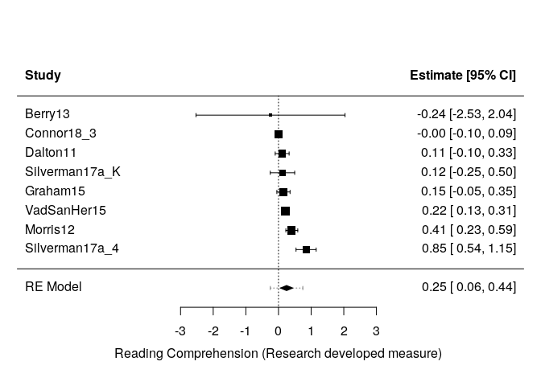

L\&L Metaanalysis
================
Saurabh Khanna
2020-03-27

  - [Reading in data](#reading-in-data)
  - [Calculate effect sizes](#calculate-effect-sizes)
      - [R studies](#r-studies)

``` r
# Libraries
library(tidyverse)
library(metafor)
library(readxl)

# Parameters
data_file <- here::here("data/L&L Data Set Means SDs.xlsx")
```

## Reading in data

``` r
# join checks
read_xlsx(data_file, sheet = "VR") %>% 
  select(AUTYR) %>% 
  drop_na(AUTYR) %>% 
  anti_join(
    read_xlsx(data_file, sheet = "StudyChar") %>% 
      select(AUTYR) %>% 
      drop_na(AUTYR),
    by = "AUTYR"
  )
```

    ## New names:
    ## * `` -> ...40

    ## # A tibble: 0 x 1
    ## # … with 1 variable: AUTYR <chr>

All good\!

## Calculate effect sizes

### R studies

#### RR studies

Post only:

``` r
df_rr_post <-
  read_xlsx(data_file, sheet = "RR") %>% 
  rename_at(vars(-AUTYR), ~ str_replace(., "RR", "")) %>% 
  filter(is.na(T1M1pre)) %>% 
  select_if(~ any(!is.na(.))) %>%
  select(AUTYR, sort(current_vars()))
```

    ## Warning: current_vars() is deprecated. 
    ## Please use tidyselect::peek_vars() instead
    ## This warning is displayed once per session.

``` r
for (t in 1:4) {
  for (mt in 1:4) {
    for (c in 1:4) {
      for (mc in 1:4) {
        if (
          !(str_glue("T{t}M{mt}post") %in% colnames(df_rr_post)) | 
          !(str_glue("C{c}M{mc}post") %in% colnames(df_rr_post))
        ) {
          next
        }
        df_rr_post <-
          escalc(
            data = df_rr_post,
            measure = "SMD",
            m1i = df_rr_post[, str_c("T", t, "M", mt, "post")] %>% unlist(),
            m2i = df_rr_post[, str_c("C", c, "M", mc, "post")] %>% unlist(),
            sd1i = df_rr_post[, str_c("T", t, "S", mt, "post")] %>% unlist(),
            sd2i = df_rr_post[, str_c("C", c, "M", mc, "post")] %>% unlist(),
            n1i = df_rr_post[, str_c("T", t, "N", mt, "post")] %>% unlist(),
            n2i = df_rr_post[, str_c("C", c, "N", mc, "post")] %>% unlist(),
            var.names = c(str_glue("ES_T{t}M{mt}_C{c}M{mc}"), str_glue("EV_T{t}M{mt}_C{c}M{mc}"))
          ) 
      }
    }
  }
}

df_rr_post <- df_rr_post %>% select(AUTYR, starts_with("E"))

# post test only ES broken down
df_rr_post %>% 
  select(AUTYR, starts_with("ES")) %>% 
  knitr::kable()
```

| AUTYR       | ES\_T1M1\_C1M1 | ES\_T1M1\_C1M2 | ES\_T1M2\_C1M1 | ES\_T1M2\_C1M2 | ES\_T2M1\_C1M1 | ES\_T2M1\_C1M2 | ES\_T2M2\_C1M1 | ES\_T2M2\_C1M2 | ES\_T3M1\_C1M1 | ES\_T3M1\_C1M2 | ES\_T3M2\_C1M1 | ES\_T3M2\_C1M2 |
| :---------- | -------------: | -------------: | -------------: | -------------: | -------------: | -------------: | -------------: | -------------: | -------------: | -------------: | -------------: | -------------: |
| Connor18\_3 |      0.0164822 |    \-0.2314048 |      0.2624684 |    \-0.0177789 |      0.0155116 |    \-0.2361821 |      0.2428244 |    \-0.0398454 |      0.0142697 |    \-0.2379407 |      0.2477972 |    \-0.0399563 |
| Connor18\_3 |      0.0140436 |      0.1663439 |    \-0.1671847 |    \-0.0354091 |             NA |             NA |             NA |             NA |             NA |             NA |             NA |             NA |
| Dalton11    |      0.0998691 |    \-0.1177517 |      0.3447373 |      0.0725982 |      0.1046956 |    \-0.1234453 |      0.3976402 |      0.1234006 |             NA |             NA |             NA |             NA |

``` r
# combining measures
# df_rr_post %>% 
#   select(AUTYR, starts_with("E")) %>% 
#   select_if(~ any(!is.na(.))) %>% 
#   gather(-AUTYR, key = "type", value = "value", na.rm = TRUE) %>% 
#   mutate(
#     type = str_replace_all(type, "M\\d", "")
#   ) %>% 
#   arrange(AUTYR, type) %>% 
#   group_by(AUTYR, type) %>% 
#   mutate(
#     id = row_number()
#   ) %>% 
#   spread(type, value) %>% 
#   select(AUTYR, sort(current_vars()), -id) %>%
#   ungroup() %>% 
#   group_by(AUTYR) %>% 
#   summarize(
#     es_T1_C1 = 
#       rma(yi = ES_T1_C1, vi = EV_T1_C1, method = "REML") %>% 
#       summary() %>% 
#       coef() %>% 
#       pull(estimate),
#     EV_T1_C1 = 
#       (
#         rma(yi = ES_T1_C1, vi = EV_T1_C1, method = "REML") %>% 
#           summary() %>% 
#           coef() %>% 
#           pull(se)
#       ) ^ 2,
#     # alter 4 below
#     ES_T2_C1 = mean(ES_T2_C1, na.rm = T), #
#     EV_T2_C1 = mean(EV_T2_C1, na.rm = T), #
#     ES_T3_C1 = mean(ES_T3_C1, na.rm = T), #
#     EV_T3_C1 = mean(EV_T3_C1, na.rm = T) #
#   ) %>% 
#   rename_all(str_to_upper)
```

Pre and post:

``` r
df_rr_prepost <-
  read_xlsx(data_file, sheet = "RR") %>% 
  rename_at(vars(-AUTYR), ~ str_replace(., "RR", "")) %>% 
  filter(!is.na(T1M1pre)) %>% 
  select_if(~ any(!is.na(.))) %>%
  select(AUTYR, sort(current_vars()))

# treatment
for (t in 1:4) {
  for (mt in 1:4) {
    for (c in 1:4) {
      for (mc in 1:4) {
        if (
          !(str_glue("T{t}M{mt}post") %in% colnames(df_rr_prepost)) | 
          !(str_glue("T{t}M{mt}pre") %in% colnames(df_rr_prepost))
        ) {
          next
        }
        df_rr_prepost <-
          escalc(
            data = df_rr_prepost,
            measure = "SMCR",
            m1i = df_rr_prepost[, str_c("T", t, "M", mt, "post")] %>% unlist(),
            m2i = df_rr_prepost[, str_c("T", t, "M", mt, "pre")] %>% unlist(),
            sd1i = df_rr_prepost[, str_c("T", t, "S", mt, "pre")] %>% unlist(),
            ni = df_rr_prepost[, str_c("T", t, "N", mt, "post")] %>% unlist(),
            ri = c(0.7, 0.7, 0.7, 0.7, 0.7, 0.7),
            var.names = c(str_glue("TES_T{t}M{mt}_C{c}M{mc}"), str_glue("TEV_T{t}M{mt}_C{c}M{mc}"))
          ) 
      }
    }
  }
}

# control
for (t in 1:4) {
  for (mt in 1:4) {
    for (c in 1:4) {
      for (mc in 1:4) {
        if (
          !(str_glue("C{c}M{mc}post") %in% colnames(df_rr_prepost)) | 
          !(str_glue("C{c}M{mc}pre") %in% colnames(df_rr_prepost))
        ) {
          next
        }
        df_rr_prepost <-
          escalc(
            data = df_rr_prepost,
            measure = "SMCR",
            m1i = df_rr_prepost[, str_c("C", c, "M", mc, "post")] %>% unlist(),
            m2i = df_rr_prepost[, str_c("C", c, "M", mc, "pre")] %>% unlist(),
            sd1i = df_rr_prepost[, str_c("C", c, "S", mc, "pre")] %>% unlist(),
            ni = df_rr_prepost[, str_c("C", c, "N", mc, "post")] %>% unlist(),
            ri = c(0.7, 0.7, 0.7, 0.7, 0.7, 0.7),
            var.names = c(str_glue("CES_T{t}M{mt}_C{c}M{mc}"), str_glue("CEV_T{t}M{mt}_C{c}M{mc}"))
          ) 
      }
    }
  }
}

# ES and EV taken together
for (t in 1:4) {
  for (mt in 1:4) {
    for (c in 1:4) {
      for (mc in 1:4) {
        if (
          !(str_glue("TES_T{t}M{mt}_C{c}M{mc}") %in% colnames(df_rr_prepost)) | 
          !(str_glue("TEV_T{t}M{mt}_C{c}M{mc}") %in% colnames(df_rr_prepost)) |
          !(str_glue("CES_T{t}M{mt}_C{c}M{mc}") %in% colnames(df_rr_prepost)) | 
          !(str_glue("CEV_T{t}M{mt}_C{c}M{mc}") %in% colnames(df_rr_prepost))
        ) {
          next
        }
        # subtracting effect size
        df_rr_prepost[, str_c("ES_T", t, "M", mt, "_C", c, "M", mc)] <- 
          (df_rr_prepost[, str_c("TES_T", t, "M", mt, "_C", c, "M", mc)] %>% unlist()) -
          (df_rr_prepost[, str_c("CES_T", t, "M", mt, "_C", c, "M", mc)] %>% unlist())
        # adding variance
        df_rr_prepost[, str_c("EV_T", t, "M", mt, "_C", c, "M", mc)] <- 
          (df_rr_prepost[, str_c("TEV_T", t, "M", mt, "_C", c, "M", mc)] %>% unlist()) +
          (df_rr_prepost[, str_c("CEV_T", t, "M", mt, "_C", c, "M", mc)] %>% unlist())
      }
    }
  }
}

df_rr_prepost <- df_rr_prepost %>% select(AUTYR, starts_with("E"))

# pre + post test
df_rr_prepost %>% 
  select(AUTYR, starts_with("ES")) %>% 
  select_if(~ any(!is.na(.))) %>%
  knitr::kable()
```

| AUTYR           | ES\_T1M1\_C1M1 | ES\_T1M1\_C1M2 | ES\_T1M1\_C2M1 | ES\_T1M2\_C1M1 | ES\_T1M2\_C1M2 | ES\_T2M1\_C1M1 | ES\_T2M1\_C2M1 |
| :-------------- | -------------: | -------------: | -------------: | -------------: | -------------: | -------------: | -------------: |
| Berry13         |    \-1.4883572 |      2.2766576 |             NA |    \-2.9909467 |      0.7740681 |             NA |             NA |
| Graham15        |      0.1519858 |             NA |             NA |             NA |             NA |             NA |             NA |
| Silverman17a\_K |      0.0647812 |    \-0.3409696 |             NA |      0.5860680 |      0.1803172 |             NA |             NA |
| Silverman17a\_4 |      1.1520128 |      1.0910970 |             NA |      0.6105715 |      0.5496556 |             NA |             NA |
| VadSanHer15     |      0.2178669 |             NA |             NA |             NA |             NA |             NA |             NA |
| Morris12        |      0.2564557 |             NA |       0.577858 |             NA |             NA |      0.2364356 |      0.5578379 |

Combining RR in a single tibble:

``` r
rr_all <-
  df_rr_prepost %>% 
  select(AUTYR, starts_with("E")) %>% 
  select_if(~ any(!is.na(.))) %>% 
  gather(-AUTYR, key = "type", value = "value", na.rm = TRUE) %>% 
  mutate(
    type = str_replace_all(type, "M\\d", "")
  ) %>% 
  arrange(AUTYR, type) %>% 
  group_by(AUTYR, type) %>% 
  mutate(
    id = row_number()
  ) %>% 
  spread(type, value) %>% 
  select(AUTYR, sort(current_vars()), -id) %>%
  ungroup() %>% 
  group_by(AUTYR) %>% 
  summarize(
    es_T1_C1 = 
      rma(yi = ES_T1_C1, vi = EV_T1_C1, method = "REML") %>% 
      summary() %>% 
      coef() %>% 
      pull(estimate),
    EV_T1_C1 = 
      (
        rma(yi = ES_T1_C1, vi = EV_T1_C1, method = "REML") %>% 
          summary() %>% 
          coef() %>% 
          pull(se)
      ) ^ 2,
    ES_T1_C2 = mean(ES_T1_C2, na.rm = FALSE),
    ES_T2_C1 = mean(ES_T2_C1, na.rm = FALSE),
    ES_T2_C2 = mean(ES_T2_C2, na.rm = FALSE),
    EV_T1_C2 = mean(EV_T1_C2, na.rm = FALSE),
    EV_T2_C1 = mean(EV_T2_C1, na.rm = FALSE),
    EV_T2_C2 = mean(EV_T2_C2, na.rm = FALSE)
  ) %>% 
  rename_all(str_to_upper) %>% 
  bind_rows(
    df_rr_post %>% 
      select(AUTYR, starts_with("E")) %>% 
      select_if(~ any(!is.na(.))) %>% 
      gather(-AUTYR, key = "type", value = "value", na.rm = TRUE) %>% 
      mutate(
        type = str_replace_all(type, "M\\d", "")
      ) %>% 
      arrange(AUTYR, type) %>% 
      group_by(AUTYR, type) %>% 
      mutate(
        id = row_number()
      ) %>% 
      spread(type, value) %>% 
      select(AUTYR, sort(current_vars()), -id) %>%
      ungroup() %>% 
      group_by(AUTYR) %>% 
      summarize(
        es_T1_C1 = 
          rma(yi = ES_T1_C1, vi = EV_T1_C1, method = "REML") %>% 
          summary() %>% 
          coef() %>% 
          pull(estimate),
        EV_T1_C1 = 
          (
            rma(yi = ES_T1_C1, vi = EV_T1_C1, method = "REML") %>% 
              summary() %>% 
              coef() %>% 
              pull(se)
          ) ^ 2,
        # alter 4 below
        ES_T2_C1 = mean(ES_T2_C1, na.rm = T), #
        EV_T2_C1 = mean(EV_T2_C1, na.rm = T), #
        ES_T3_C1 = mean(ES_T3_C1, na.rm = T), #
        EV_T3_C1 = mean(EV_T3_C1, na.rm = T) #
      ) %>% 
      rename_all(str_to_upper)
  ) %>%
  mutate(
    es_list = pmap(list(ES_T1_C1, ES_T1_C2, ES_T2_C1, ES_T2_C2, ES_T3_C1), list),
    ev_list = pmap(list(EV_T1_C1, EV_T1_C2, EV_T2_C1, EV_T2_C2, EV_T3_C1), list),
    ES = 
      map2_dbl(
        es_list, 
        ev_list, 
        ~ rma(
          yi = .x %>% unlist(), 
          vi = .y %>% unlist(), 
          method = "REML"
        ) %>% 
          summary() %>% 
          coef() %>% 
          pull(estimate)
      ),
    EV = 
      (
        map2_dbl(
          es_list, 
          ev_list, 
          ~ rma(
            yi = .x %>% unlist(), 
            vi = .y %>% unlist(), 
            method = "REML"
          ) %>% 
            summary() %>% 
            coef() %>% 
            pull(se)
        )
      ) ^ 2
  ) %>% 
  select(AUTYR, ES, EV, sort(current_vars()), -es_list, -ev_list)

rr_all %>% knitr::kable()
```

| AUTYR           |          ES |        EV |  ES\_T1\_C1 | ES\_T1\_C2 |  ES\_T2\_C1 | ES\_T2\_C2 |  ES\_T3\_C1 | EV\_T1\_C1 | EV\_T1\_C2 | EV\_T2\_C1 | EV\_T2\_C2 | EV\_T3\_C1 |
| :-------------- | ----------: | --------: | ----------: | ---------: | ----------: | ---------: | ----------: | ---------: | ---------: | ---------: | ---------: | ---------: |
| Berry13         | \-0.2449895 | 1.3566568 | \-0.2449895 |         NA |          NA |         NA |          NA |  1.3566568 |         NA |         NA |         NA |         NA |
| Graham15        |   0.1519858 | 0.0106017 |   0.1519858 |         NA |          NA |         NA |          NA |  0.0106017 |         NA |         NA |         NA |         NA |
| Morris12        |   0.4080045 | 0.0086419 |   0.2564557 |   0.577858 |   0.2364356 |  0.5578379 |          NA |  0.0192493 |  0.0189074 |  0.0196849 |   0.019343 |         NA |
| Silverman17a\_4 |   0.8454605 | 0.0247231 |   0.8454605 |         NA |          NA |         NA |          NA |  0.0247231 |         NA |         NA |         NA |         NA |
| Silverman17a\_K |   0.1216708 | 0.0363608 |   0.1216708 |         NA |          NA |         NA |          NA |  0.0363608 |         NA |         NA |         NA |         NA |
| VadSanHer15     |   0.2178669 | 0.0020603 |   0.2178669 |         NA |          NA |         NA |          NA |  0.0020603 |         NA |         NA |         NA |         NA |
| Connor18\_3     | \-0.0005979 | 0.0023523 |   0.0005064 |         NA | \-0.0044229 |         NA | \-0.0039575 |  0.0030758 |         NA |  0.0201864 |         NA |   0.019817 |
| Dalton11        |   0.1122129 | 0.0117944 |   0.1087969 |         NA |   0.1255728 |         NA |         NaN |  0.0148102 |         NA |  0.0579221 |         NA |        NaN |

``` r
rr_all %>% 
  rma(
    yi = ES, 
    vi = EV, 
    data = ., 
    method = "REML",
    slab = AUTYR
  ) %>% 
  forest(
    order = "obs",
    xlab = "Reading Comprehension (Research developed measure)",
    addcred = T, 
    header = T
  )
```


