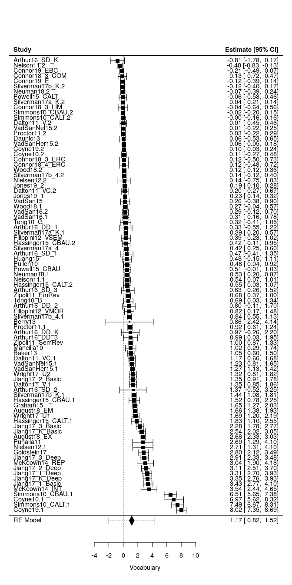
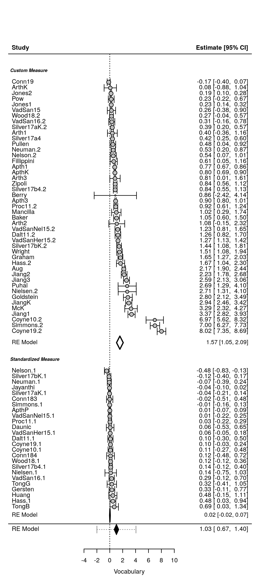
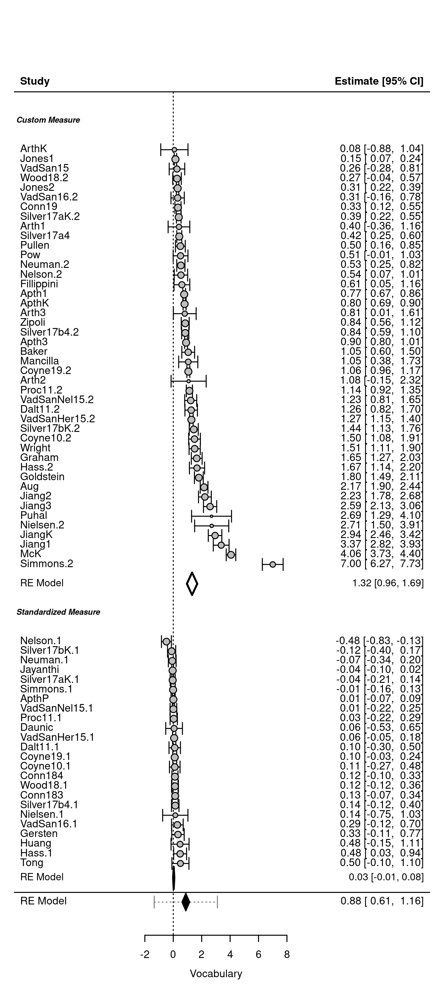
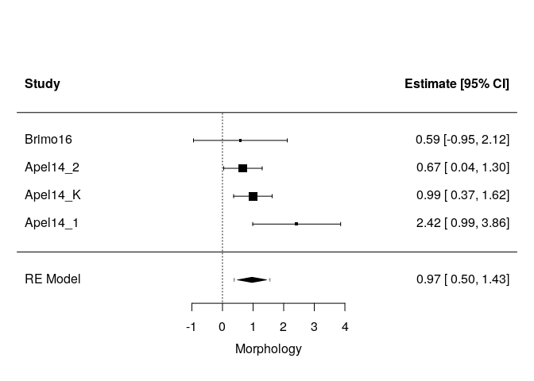
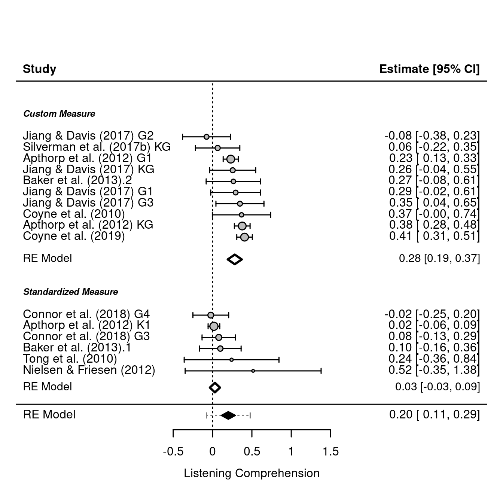
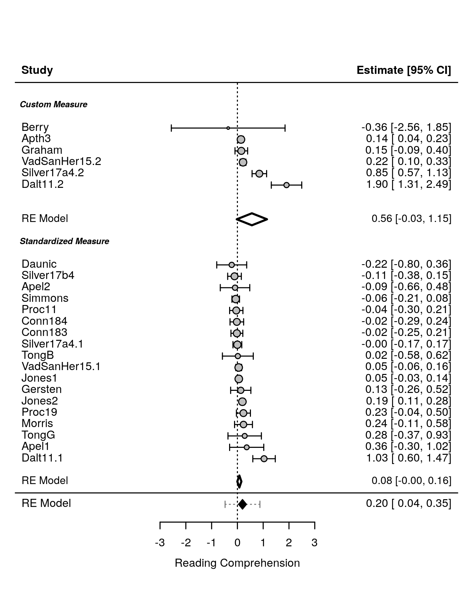
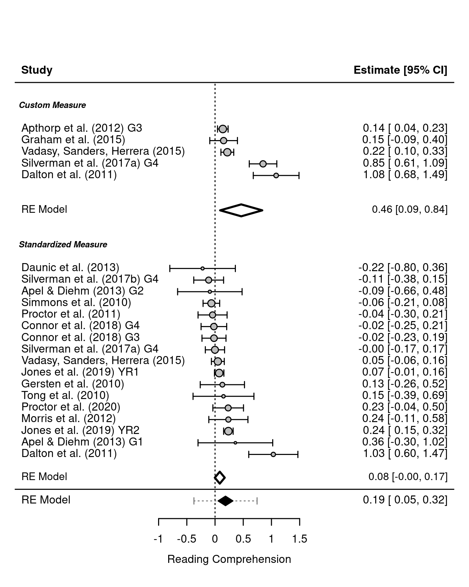
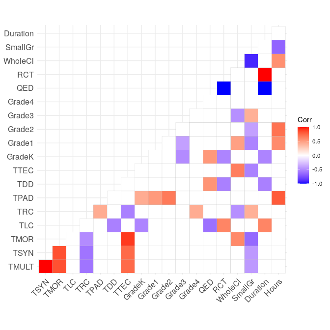
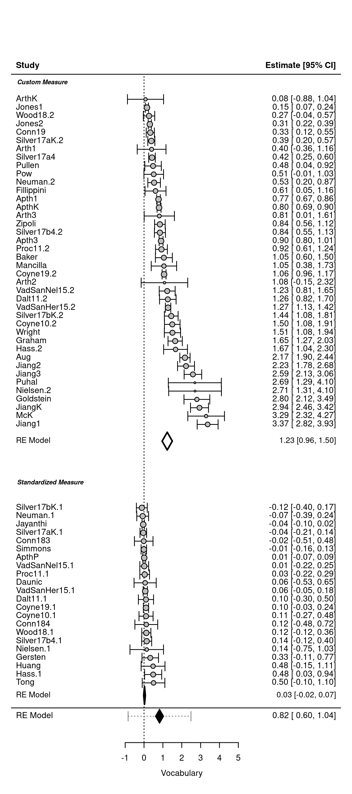

Metaanalysis Script
================
Saurabh Khanna
2020-04-18

  - [Reading in data](#reading-in-data)
  - [Calculate effect sizes](#calculate-effect-sizes)
      - [Post only](#post-only)
      - [Pre and Post](#pre-and-post)
      - [Combining pre and prepost](#combining-pre-and-prepost)
      - [Summary stats](#summary-stats)
  - [Synthesizing effect sizes](#synthesizing-effect-sizes)
      - [Vocabulary](#vocabulary)
      - [Listening Comprehension](#listening-comprehension)
      - [Reading Comprehension](#reading-comprehension)
      - [Morphology](#morphology)
      - [Syntax](#syntax)
      - [AS Studies](#as-studies)
  - [Moderator effects](#moderator-effects)
      - [Vocabulary](#vocabulary-1)
      - [Listening Comprehension](#listening-comprehension-1)
      - [Reading Comprehension](#reading-comprehension-1)
  - [Metaforest](#metaforest)

``` r
# Libraries
library(tidyverse)
```

    ## ── Attaching packages ───────────────────────────────────────────────────────────────────────────────────────────────────── tidyverse 1.3.0 ──

    ## ✓ ggplot2 3.3.0     ✓ purrr   0.3.3
    ## ✓ tibble  3.0.0     ✓ dplyr   0.8.5
    ## ✓ tidyr   1.0.2     ✓ stringr 1.4.0
    ## ✓ readr   1.3.1     ✓ forcats 0.5.0

    ## ── Conflicts ──────────────────────────────────────────────────────────────────────────────────────────────────────── tidyverse_conflicts() ──
    ## x dplyr::filter() masks stats::filter()
    ## x dplyr::lag()    masks stats::lag()

``` r
library(readxl)
library(metafor)
```

    ## Loading required package: Matrix

    ## 
    ## Attaching package: 'Matrix'

    ## The following objects are masked from 'package:tidyr':
    ## 
    ##     expand, pack, unpack

    ## Loading 'metafor' package (version 2.4-0). For an overview 
    ## and introduction to the package please type: help(metafor).

``` r
library(robumeta)
library(metaforest)
```

    ## Loading required package: ranger

    ## Loading required package: data.table

    ## 
    ## Attaching package: 'data.table'

    ## The following objects are masked from 'package:dplyr':
    ## 
    ##     between, first, last

    ## The following object is masked from 'package:purrr':
    ## 
    ##     transpose

``` r
# Parameters
data_file <- here::here("data/L&L Data Set Means SDs.xlsx")
```

## Reading in data

``` r
# join checks
read_xlsx(data_file, sheet = "VR") %>% 
  select(AUTYR) %>% 
  drop_na(AUTYR) %>% 
  anti_join(
    read_xlsx(data_file, sheet = "StudyChar") %>% 
      select(AUTYR) %>% 
      drop_na(AUTYR),
    by = "AUTYR"
  )
```

    ## # A tibble: 0 x 1
    ## # … with 1 variable: AUTYR <chr>

``` r
read_xlsx(data_file, sheet = "VS") %>% 
  select(AUTYR) %>% 
  drop_na(AUTYR) %>% 
  anti_join(
    read_xlsx(data_file, sheet = "StudyChar") %>% 
      select(AUTYR) %>% 
      drop_na(AUTYR),
    by = "AUTYR"
  )
```

    ## # A tibble: 0 x 1
    ## # … with 1 variable: AUTYR <chr>

``` r
read_xlsx(data_file, sheet = "LR") %>% 
  select(AUTYR) %>% 
  drop_na(AUTYR) %>% 
  anti_join(
    read_xlsx(data_file, sheet = "StudyChar") %>% 
      select(AUTYR) %>% 
      drop_na(AUTYR),
    by = "AUTYR"
  )
```

    ## # A tibble: 0 x 1
    ## # … with 1 variable: AUTYR <chr>

``` r
read_xlsx(data_file, sheet = "LS") %>% 
  select(AUTYR) %>% 
  drop_na(AUTYR) %>% 
  anti_join(
    read_xlsx(data_file, sheet = "StudyChar") %>% 
      select(AUTYR) %>% 
      drop_na(AUTYR),
    by = "AUTYR"
  )
```

    ## # A tibble: 0 x 1
    ## # … with 1 variable: AUTYR <chr>

``` r
read_xlsx(data_file, sheet = "RR") %>% 
  select(AUTYR) %>% 
  drop_na(AUTYR) %>% 
  anti_join(
    read_xlsx(data_file, sheet = "StudyChar") %>% 
      select(AUTYR) %>% 
      drop_na(AUTYR),
    by = "AUTYR"
  )
```

    ## # A tibble: 0 x 1
    ## # … with 1 variable: AUTYR <chr>

``` r
read_xlsx(data_file, sheet = "RS") %>% 
  select(AUTYR) %>% 
  drop_na(AUTYR) %>% 
  anti_join(
    read_xlsx(data_file, sheet = "StudyChar") %>% 
      select(AUTYR) %>% 
      drop_na(AUTYR),
    by = "AUTYR"
  )
```

    ## # A tibble: 0 x 1
    ## # … with 1 variable: AUTYR <chr>

All good\!

## Calculate effect sizes

### Post only

``` r
df_post <-
  bind_rows(
    "VR" = read_xlsx(data_file, sheet = "VR") %>% rename_at(vars(-AUTYR), ~ str_replace(., "VR", "")),
    "VS" = read_xlsx(data_file, sheet = "VS") %>% rename_at(vars(-AUTYR), ~ str_replace(., "VS", "")),
    "RR" = read_xlsx(data_file, sheet = "RR") %>% rename_at(vars(-AUTYR), ~ str_replace(., "RR", "")),
    "RS" = read_xlsx(data_file, sheet = "RS") %>% rename_at(vars(-AUTYR), ~ str_replace(., "RS", "")),
    "LR" = read_xlsx(data_file, sheet = "LR") %>% rename_at(vars(-AUTYR), ~ str_replace(., "LR", "")),
    "LS" = read_xlsx(data_file, sheet = "LS") %>% rename_at(vars(-AUTYR), ~ str_replace(., "LS", "")),
    "MR" = read_xlsx(data_file, sheet = "MR") %>% rename_at(vars(-AUTYR), ~ str_replace(., "MR", "")),
    "MS" = read_xlsx(data_file, sheet = "MS") %>% rename_at(vars(-AUTYR), ~ str_replace(., "MS", "")),
    "SR" = read_xlsx(data_file, sheet = "SR") %>% rename_at(vars(-AUTYR), ~ str_replace(., "SR", "")),
    "SS" = read_xlsx(data_file, sheet = "SS") %>% rename_at(vars(-AUTYR), ~ str_replace(., "SS", "")),
    "AS" = read_xlsx(data_file, sheet = "AS") %>% rename_at(vars(-AUTYR), ~ str_replace(., "AS", "")),
    .id = "type"
  ) %>% 
  drop_na(AUTYR) %>%
  filter(is.na(TM1pre)) %>% 
  select_if(~ any(!is.na(.))) %>%
  select(AUTYR, type, sort(current_vars()))


for (mt in 1:4) {
  for (mc in 1:4) {
    if (
      !(str_glue("TM{mt}post") %in% colnames(df_post)) | 
      !(str_glue("CM{mc}post") %in% colnames(df_post))
    ) {
      next
    }
    df_post <-
      escalc(
        data = df_post,
        measure = "SMD",
        m1i = df_post[, str_c("TM", mt, "post")] %>% unlist(),
        m2i = df_post[, str_c("CM", mc, "post")] %>% unlist(),
        sd1i = df_post[, str_c("TS", mt, "post")] %>% unlist(),
        sd2i = df_post[, str_c("CS", mc, "post")] %>% unlist(),
        n1i = df_post[, str_c("TN", mt, "post")] %>% unlist(),
        n2i = df_post[, str_c("CN", mc, "post")] %>% unlist(),
        var.names = c(str_glue("ES_TM{mt}_CM{mc}"), str_glue("EV_TM{mt}_CM{mc}"))
      ) 
  }
}


df_post <-
  df_post %>% 
  transmute(
    AUTYR, 
    type,
    ES =
      pmap_dbl(
        select(., starts_with("ES_")),
        ~ mean(c(...), na.rm = TRUE)
      ),
    EV =
      pmap_dbl(
        select(., starts_with("EV_")),
        ~ mean(c(...), na.rm = TRUE)
      )
  )
```

### Pre and Post

``` r
df_prepost <-
  bind_rows(
    "VR" = read_xlsx(data_file, sheet = "VR") %>% rename_at(vars(-AUTYR), ~ str_replace(., "VR", "")),
    "VS" = read_xlsx(data_file, sheet = "VS") %>% rename_at(vars(-AUTYR), ~ str_replace(., "VS", "")),
    "RR" = read_xlsx(data_file, sheet = "RR") %>% rename_at(vars(-AUTYR), ~ str_replace(., "RR", "")),
    "RS" = read_xlsx(data_file, sheet = "RS") %>% rename_at(vars(-AUTYR), ~ str_replace(., "RS", "")),
    "LR" = read_xlsx(data_file, sheet = "LR") %>% rename_at(vars(-AUTYR), ~ str_replace(., "LR", "")),
    "LS" = read_xlsx(data_file, sheet = "LS") %>% rename_at(vars(-AUTYR), ~ str_replace(., "LS", "")),
    "MR" = read_xlsx(data_file, sheet = "MR") %>% rename_at(vars(-AUTYR), ~ str_replace(., "MR", "")),
    "MS" = read_xlsx(data_file, sheet = "MS") %>% rename_at(vars(-AUTYR), ~ str_replace(., "MS", "")),
    "SR" = read_xlsx(data_file, sheet = "SR") %>% rename_at(vars(-AUTYR), ~ str_replace(., "SR", "")),
    "SS" = read_xlsx(data_file, sheet = "SS") %>% rename_at(vars(-AUTYR), ~ str_replace(., "SS", "")),
    "AS" = read_xlsx(data_file, sheet = "AS") %>% rename_at(vars(-AUTYR), ~ str_replace(., "AS", "")),
    .id = "type"
  ) %>% 
  drop_na(AUTYR) %>%
  filter(!is.na(TM1pre)) %>% 
  select_if(~ any(!is.na(.))) %>%
  select(AUTYR, type, sort(current_vars())) %>% 
  mutate(
    TN1post = if_else(is.na(TN1post) & !is.na(TN1pre), TN1pre, TN1post),
    TN2post = if_else(is.na(TN2post) & !is.na(TN2pre), TN2pre, TN2post),
    CN1post = if_else(is.na(CN1post) & !is.na(CN1pre), CN1pre, CN1post),
    CN2post = if_else(is.na(CN2post) & !is.na(CN2pre), CN2pre, CN2post)
  )

#df_prepost %>% select(type, contains(c("N1p", "N2p"))) %>% summary()

# treatment (post-pre)
for (mt in 1:4) {
  if (
    !(str_glue("TM{mt}post") %in% colnames(df_prepost)) | 
    !(str_glue("TM{mt}pre") %in% colnames(df_prepost))
  ) {
    next
  }
  df_prepost <-
    escalc(
      data = df_prepost,
      measure = "SMCR",
      m1i = df_prepost[, str_c("TM", mt, "post")] %>% unlist(),
      m2i = df_prepost[, str_c("TM", mt, "pre")] %>% unlist(),
      sd1i = df_prepost[, str_c("TS", mt, "pre")] %>% unlist(),
      ni = df_prepost[, str_c("TN", mt, "post")] %>% unlist(),
      ri = rep(0.5, 95),
      var.names = c(str_glue("TES_TM{mt}"), str_glue("TEV_TM{mt}"))
    ) 
}

# control (post-pre)
for (mc in 1:4) {
  if (
    !(str_glue("CM{mc}post") %in% colnames(df_prepost)) | 
    !(str_glue("CM{mc}pre") %in% colnames(df_prepost))
  ) {
    next
  }
  df_prepost <-
    escalc(
      data = df_prepost,
      measure = "SMCR",
      m1i = df_prepost[, str_c("CM", mc, "post")] %>% unlist(),
      m2i = df_prepost[, str_c("CM", mc, "pre")] %>% unlist(),
      sd1i = df_prepost[, str_c("CS", mc, "pre")] %>% unlist(),
      ni = df_prepost[, str_c("CN", mc, "post")] %>% unlist(),
      ri = rep(0.5, 95),
      var.names = c(str_glue("CES_CM{mc}"), str_glue("CEV_CM{mc}"))
    ) 
}


# ES and EV taken together
for (m in 1:4) {
  if (
    !(str_glue("TES_TM{m}") %in% colnames(df_prepost)) | 
    !(str_glue("TEV_TM{m}") %in% colnames(df_prepost)) |
    !(str_glue("CES_CM{m}") %in% colnames(df_prepost)) | 
    !(str_glue("CEV_CM{m}") %in% colnames(df_prepost))
  ) {
    next
  }
  # subtracting effect size
  df_prepost[, str_c("ES_TM", m, "_CM", m)] <- 
    (df_prepost[, str_c("TES_TM", m)] %>% unlist()) -
    (df_prepost[, str_c("CES_CM", m)] %>% unlist())
  # adding variance
  df_prepost[, str_c("EV_TM", m, "_CM", m)] <- 
    (df_prepost[, str_c("TEV_TM", m)] %>% unlist()) +
    (df_prepost[, str_c("CEV_CM", m)] %>% unlist())
}


df_prepost <- 
  df_prepost %>% 
  transmute(
    AUTYR, 
    type,
    ES =
      pmap_dbl(
        select(., starts_with("ES_")),
        ~ mean(c(...), na.rm = TRUE)
      ),
    EV =
      pmap_dbl(
        select(., starts_with("EV_")),
        ~ mean(c(...), na.rm = TRUE)
      )
  )
```

### Combining pre and prepost

``` r
df_clean <- 
  bind_rows(df_post, df_prepost) %>% 
  arrange(type, AUTYR) %>% 
  separate(AUTYR, c("stdid", "case"), remove = F, extra = "merge") %>% 
  left_join(
    read_xlsx(data_file, sheet = "StudyChar") %>% 
      drop_na(AUTYR),
    by = "AUTYR"
  ) %>%
  mutate(
    Hours = Hours %>% parse_number()
  ) %>% 
  mutate_at(vars(type, CONT), as.factor) %>% 
  arrange(type, AUTYR) %>% 
  mutate_at(vars(case), replace_na, replace = "Default") %>% 
  select(-stdid.x, stdid = stdid.y)

df_clean %>% knitr::kable()
```

| AUTYR             | case     | type |          ES |        EV | stdid       | TMULT | TVOC | TSYN | TMOR | TLC | TRC | TPAD | TDD | TTEC | TSTR | CONT | GradeK | Grade1 | Grade2 | Grade3 | Grade4 | Grade5 | QED | RCT | WSD | WholeCl | SmallGr | Indiv | Duration |  Hours |
| :---------------- | :------- | :--: | ----------: | --------: | :---------- | ----: | ---: | ---: | ---: | --: | --: | ---: | --: | ---: | ---: | :--- | -----: | -----: | -----: | -----: | -----: | -----: | --: | --: | --: | ------: | ------: | ----: | -------: | -----: |
| Jones19\_1        | 1        |  AS  |   0.3371586 | 0.0025073 | Jones1      |     0 |    1 |    0 |    0 |   0 |   0 |    0 |   1 |    0 |    0 | BAU  |      0 |      0 |      0 |      0 |      1 |      1 |   0 |   1 |   0 |       1 |       1 |     0 |        1 |  95.00 |
| Jones19\_2        | 2        |  AS  |   0.1152593 | 0.0019759 | Jones2      |     0 |    1 |    0 |    0 |   0 |   0 |    0 |   1 |    0 |    0 | BAU  |      0 |      0 |      0 |      0 |      1 |      1 |   0 |   1 |   0 |       1 |       1 |     0 |        1 |  95.00 |
| Proctor19         | Default  |  AS  |   0.1139215 | 0.0167638 | Proc19      |     1 |    1 |    1 |    1 |   1 |   1 |    0 |   1 |    1 |    0 | BAU  |      0 |      0 |      0 |      0 |      1 |      1 |   1 |   0 |   0 |       0 |       1 |     0 |        1 |  20.00 |
| Baker13           | Default  |  LR  |   0.2651806 | 0.0312088 | Baker       |     0 |    1 |    0 |    0 |   1 |   0 |    0 |   0 |    0 |    0 | ALT  |      0 |      1 |      0 |      0 |      0 |      0 |   0 |   1 |   0 |       1 |       0 |     0 |        1 |  38.00 |
| Connor18\_3\_COM  | 3\_COM   |  LR  |   0.3136444 | 0.0209808 | Conn183     |     0 |    1 |    0 |    0 |   1 |   1 |    0 |   0 |    0 |    0 | BAU  |      0 |      0 |      0 |      1 |      0 |      0 |   0 |   1 |   0 |       0 |       1 |     0 |        1 |  22.00 |
| Connor18\_3\_ERC  | 3\_ERC   |  LR  |   0.0667638 | 0.0201244 | Conn183     |     0 |    1 |    0 |    0 |   1 |   1 |    0 |   0 |    0 |    0 | BAU  |      0 |      0 |      0 |      1 |      0 |      0 |   0 |   1 |   0 |       0 |       1 |     0 |        1 |  22.00 |
| Connor18\_3\_LIM  | 3\_LIM   |  LR  | \-0.1758689 | 0.0198194 | Conn183     |     1 |    1 |    1 |    0 |   1 |   0 |    0 |   0 |    0 |    0 | BAU  |      0 |      0 |      0 |      1 |      0 |      0 |   0 |   1 |   0 |       0 |       1 |     0 |        1 |  22.00 |
| Connor18\_4\_ERC  | 4\_ERC   |  LR  | \-0.0865421 | 0.0178965 | Conn184     |     0 |    1 |    0 |    0 |   1 |   1 |    0 |   0 |    0 |    0 | BAU  |      0 |      0 |      0 |      0 |      1 |      0 |   0 |   1 |   0 |       0 |       1 |     0 |        1 |  22.00 |
| Coyne10           | Default  |  LR  |   0.3683911 | 0.0357745 | Coyne10     |     0 |    1 |    0 |    0 |   0 |   0 |    0 |   0 |    0 |    0 | BAU  |      1 |      0 |      0 |      0 |      0 |      0 |   1 |   0 |   0 |       1 |       0 |     0 |        0 |  18.00 |
| Coyne19           | Default  |  LR  |   0.4067562 | 0.0025440 | Coyne19     |     0 |    1 |    0 |    0 |   0 |   0 |    0 |   0 |    0 |    0 | ALT  |      1 |      0 |      0 |      0 |      0 |      0 |   0 |   1 |   0 |       0 |       1 |     0 |        1 |  44.00 |
| Jiang17\_1\_Basic | 1\_Basic |  LR  |   0.9288143 | 0.0805088 | Jiang1      |     1 |    1 |    1 |    1 |   1 |   0 |    0 |   0 |    1 |    0 | BAU  |      0 |      1 |      0 |      0 |      0 |      0 |   0 |   1 |   0 |       1 |       0 |     0 |        1 |  50.00 |
| Jiang17\_1\_Deep  | 1\_Deep  |  LR  |   0.6614954 | 0.0675574 | Jiang1      |     1 |    1 |    1 |    1 |   1 |   0 |    0 |   0 |    1 |    0 | BAU  |      0 |      1 |      0 |      0 |      0 |      0 |   0 |   1 |   0 |       1 |       0 |     0 |        1 |  50.00 |
| Jiang17\_2\_Basic | 2\_Basic |  LR  |   0.1703855 | 0.0859893 | Jiang2      |     1 |    1 |    1 |    1 |   1 |   0 |    0 |   0 |    1 |    0 | BAU  |      0 |      0 |      1 |      0 |      0 |      0 |   0 |   1 |   0 |       1 |       0 |     0 |        1 |  50.00 |
| Jiang17\_2\_Deep  | 2\_Deep  |  LR  |   0.1655324 | 0.0892940 | Jiang2      |     1 |    1 |    1 |    1 |   1 |   0 |    0 |   0 |    1 |    0 | BAU  |      0 |      0 |      1 |      0 |      0 |      0 |   0 |   1 |   0 |       1 |       0 |     0 |        1 |  50.00 |
| Jiang17\_3\_Basic | 3\_Basic |  LR  |   0.3488033 | 0.0863644 | Jiang3      |     1 |    1 |    1 |    1 |   1 |   0 |    0 |   0 |    1 |    0 | BAU  |      0 |      0 |      0 |      1 |      0 |      0 |   0 |   1 |   0 |       1 |       0 |     0 |        1 |  50.00 |
| Jiang17\_3\_Deep  | 3\_Deep  |  LR  |   0.7369940 | 0.1027305 | Jiang3      |     1 |    1 |    1 |    1 |   1 |   0 |    0 |   0 |    1 |    0 | BAU  |      0 |      0 |      0 |      1 |      0 |      0 |   0 |   1 |   0 |       1 |       0 |     0 |        1 |  50.00 |
| Jiang17\_K\_Basic | K\_Basic |  LR  |   0.9437457 | 0.0716192 | JiangK      |     1 |    1 |    1 |    1 |   1 |   0 |    0 |   0 |    1 |    0 | BAU  |      1 |      0 |      0 |      0 |      0 |      0 |   0 |   1 |   0 |       1 |       0 |     0 |        1 |  50.00 |
| Jiang17\_K\_Deep  | K\_Deep  |  LR  |   0.4473880 | 0.0578489 | JiangK      |     1 |    1 |    1 |    1 |   1 |   0 |    0 |   0 |    1 |    0 | BAU  |      1 |      0 |      0 |      0 |      0 |      0 |   0 |   1 |   0 |       1 |       0 |     0 |        1 |  50.00 |
| Silverman17a\_K   | K        |  LR  |   0.1225492 | 0.0222134 | Silver17aK  |     0 |    1 |    0 |    0 |   0 |   0 |    0 |   1 |    1 |    0 | BAU  |      1 |      0 |      0 |      0 |      0 |      0 |   1 |   0 |   0 |       1 |       1 |     0 |        0 |  10.00 |
| Baker13           | Default  |  LS  |   0.0990000 | 0.0241636 | Baker       |     0 |    1 |    0 |    0 |   1 |   0 |    0 |   0 |    0 |    0 | ALT  |      0 |      1 |      0 |      0 |      0 |      0 |   0 |   1 |   0 |       1 |       0 |     0 |        1 |  38.00 |
| Connor18\_3\_COM  | 3\_COM   |  LS  | \-0.2036594 | 0.0969489 | Conn183     |     0 |    1 |    0 |    0 |   1 |   1 |    0 |   0 |    0 |    0 | BAU  |      0 |      0 |      0 |      1 |      0 |      0 |   0 |   1 |   0 |       0 |       1 |     0 |        1 |  22.00 |
| Connor18\_3\_ERC  | 3\_ERC   |  LS  | \-0.1336838 | 0.1006798 | Conn183     |     0 |    1 |    0 |    0 |   1 |   1 |    0 |   0 |    0 |    0 | BAU  |      0 |      0 |      0 |      1 |      0 |      0 |   0 |   1 |   0 |       0 |       1 |     0 |        1 |  22.00 |
| Connor18\_3\_LIM  | 3\_LIM   |  LS  | \-0.3196310 | 0.0965330 | Conn183     |     1 |    1 |    1 |    0 |   1 |   0 |    0 |   0 |    0 |    0 | BAU  |      0 |      0 |      0 |      1 |      0 |      0 |   0 |   1 |   0 |       0 |       1 |     0 |        1 |  22.00 |
| Connor18\_4\_ERC  | 4\_ERC   |  LS  | \-1.6440105 | 0.0492648 | Conn184     |     0 |    1 |    0 |    0 |   1 |   1 |    0 |   0 |    0 |    0 | BAU  |      0 |      0 |      0 |      0 |      1 |      0 |   0 |   1 |   0 |       0 |       1 |     0 |        1 |  22.00 |
| Nielsen12         | Default  |  LS  |   0.5156824 | 0.1941841 | Nielsen     |     0 |    1 |    0 |    0 |   1 |   0 |    0 |   0 |    0 |    0 | BAU  |      1 |      0 |      0 |      0 |      0 |      0 |   1 |   0 |   0 |       0 |       1 |     0 |        0 |  18.00 |
| Tong10\_B         | B        |  LS  |   0.3306846 | 0.1133714 | Tong\_B     |     0 |    1 |    0 |    0 |   1 |   1 |    1 |   0 |    0 |    0 | BAU  |      1 |      1 |      1 |      0 |      0 |      0 |   0 |   1 |   0 |       1 |       0 |     0 |        1 | 100.00 |
| Tong10\_G         | G        |  LS  |   0.1531120 | 0.1388452 | Tong\_G     |     0 |    1 |    0 |    0 |   1 |   1 |    1 |   0 |    0 |    0 | BAU  |      1 |      1 |      1 |      0 |      0 |      0 |   0 |   1 |   0 |       1 |       0 |     0 |        1 | 100.00 |
| Apel14\_1         | 1        |  MR  |   2.4249393 | 0.5364876 | Apel1       |     0 |    0 |    0 |    1 |   0 |   0 |    0 |   0 |    0 |    0 | BAU  |      0 |      1 |      0 |      0 |      0 |      0 |   0 |   1 |   0 |       0 |       1 |     0 |        0 |  13.00 |
| Apel14\_2         | 2        |  MR  |   0.6689962 | 0.1026682 | Apel2       |     0 |    0 |    0 |    1 |   0 |   0 |    0 |   0 |    0 |    0 | BAU  |      0 |      0 |      1 |      0 |      0 |      0 |   0 |   1 |   0 |       0 |       1 |     0 |        0 |  13.00 |
| Apel14\_K         | K        |  MR  |   0.9939616 | 0.1029765 | ApelK       |     0 |    0 |    0 |    1 |   0 |   0 |    0 |   0 |    0 |    0 | BAU  |      1 |      0 |      0 |      0 |      0 |      0 |   0 |   1 |   0 |       0 |       1 |     0 |        0 |  13.00 |
| Brimo16           | Default  |  MR  |   0.5860487 | 0.6119338 | Brimo       |     0 |    0 |    0 |    1 |   0 |   0 |    0 |   0 |    0 |    0 | BAU  |      0 |      0 |      0 |      1 |      0 |      0 |   1 |   0 |   0 |       0 |       1 |     0 |        0 |  12.50 |
| Berry13           | Default  |  RR  | \-0.3571446 | 1.2659224 | Berry       |     0 |    1 |    0 |    0 |   1 |   0 |    0 |   1 |    0 |    1 | ALT  |      0 |      0 |      0 |      1 |      0 |      0 |   1 |   0 |   0 |       1 |       0 |     0 |        0 |   6.00 |
| Dalton11\_V       | V        |  RR  |   1.7674223 | 0.1076674 | Dalt11      |     0 |    1 |    0 |    0 |   0 |   0 |    0 |   0 |    1 |    0 | ALT  |      0 |      0 |      0 |      0 |      0 |      1 |   0 |   1 |   0 |       0 |       0 |     1 |        1 |  20.00 |
| Dalton11\_VC      | VC       |  RR  |   2.0424503 | 0.1344585 | Dalt11      |     0 |    1 |    0 |    0 |   1 |   1 |    0 |   0 |    1 |    0 | ALT  |      0 |      0 |      0 |      0 |      0 |      1 |   0 |   1 |   0 |       0 |       0 |     1 |        1 |  20.00 |
| Graham15          | Default  |  RR  |   0.1519858 | 0.0156276 | Graham      |     0 |    1 |    0 |    0 |   0 |   0 |    0 |   0 |    0 |    1 | BAU  |      0 |      0 |      0 |      0 |      1 |      0 |   0 |   1 |   0 |       1 |       0 |     0 |        0 |   9.00 |
| Silverman17a\_4   | 4        |  RR  |   0.8508342 | 0.0206818 | Silver17a4  |     0 |    1 |    0 |    0 |   0 |   0 |    0 |   1 |    1 |    0 | BAU  |      0 |      0 |      0 |      0 |      1 |      0 |   1 |   0 |   0 |       1 |       1 |     0 |        0 |  10.00 |
| VadSanHer15       | Default  |  RR  |   0.2178669 | 0.0033594 | VadSanHer15 |     0 |    1 |    0 |    0 |   0 |   1 |    0 |   0 |    0 |    0 | BAU  |      0 |      0 |      0 |      0 |      1 |      1 |   0 |   1 |   0 |       1 |       0 |     0 |        1 |  35.00 |
| Apel14\_1         | 1        |  RS  |   0.3604871 | 0.1141001 | Apel1       |     0 |    0 |    0 |    1 |   0 |   0 |    0 |   0 |    0 |    0 | BAU  |      0 |      1 |      0 |      0 |      0 |      0 |   0 |   1 |   0 |       0 |       1 |     0 |        0 |  13.00 |
| Apel14\_2         | 2        |  RS  | \-0.0919161 | 0.0850093 | Apel2       |     0 |    0 |    0 |    1 |   0 |   0 |    0 |   0 |    0 |    0 | BAU  |      0 |      0 |      1 |      0 |      0 |      0 |   0 |   1 |   0 |       0 |       1 |     0 |        0 |  13.00 |
| Connor18\_3\_COM  | 3\_COM   |  RS  | \-0.0078114 | 0.0211752 | Conn183     |     0 |    1 |    0 |    0 |   1 |   1 |    0 |   0 |    0 |    0 | BAU  |      0 |      0 |      0 |      1 |      0 |      0 |   0 |   1 |   0 |       0 |       1 |     0 |        1 |  22.00 |
| Connor18\_3\_ERC  | 3\_ERC   |  RS  | \-0.0317346 | 0.0205454 | Conn183     |     0 |    1 |    0 |    0 |   1 |   1 |    0 |   0 |    0 |    0 | BAU  |      0 |      0 |      0 |      1 |      0 |      0 |   0 |   1 |   0 |       0 |       1 |     0 |        1 |  22.00 |
| Connor18\_3\_LIM  | 3\_LIM   |  RS  | \-0.0215240 | 0.0201725 | Conn183     |     1 |    1 |    1 |    0 |   1 |   0 |    0 |   0 |    0 |    0 | BAU  |      0 |      0 |      0 |      1 |      0 |      0 |   0 |   1 |   0 |       0 |       1 |     0 |        1 |  22.00 |
| Connor18\_4\_ERC  | 4\_ERC   |  RS  | \-0.0222525 | 0.0180729 | Conn184     |     0 |    1 |    0 |    0 |   1 |   1 |    0 |   0 |    0 |    0 | BAU  |      0 |      0 |      0 |      0 |      1 |      0 |   0 |   1 |   0 |       0 |       1 |     0 |        1 |  22.00 |
| Dalton11\_V       | V        |  RS  |   1.6876576 | 0.0733381 | Dalt11      |     0 |    1 |    0 |    0 |   0 |   0 |    0 |   0 |    1 |    0 | ALT  |      0 |      0 |      0 |      0 |      0 |      1 |   0 |   1 |   0 |       0 |       0 |     1 |        1 |  20.00 |
| Dalton11\_VC      | VC       |  RS  |   0.3785614 | 0.0585894 | Dalt11      |     0 |    1 |    0 |    0 |   1 |   1 |    0 |   0 |    1 |    0 | ALT  |      0 |      0 |      0 |      0 |      0 |      1 |   0 |   1 |   0 |       0 |       0 |     1 |        1 |  20.00 |
| Daunic13          | Default  |  RS  | \-0.2206484 | 0.0877731 | Daunic      |     0 |    1 |    0 |    0 |   1 |   0 |    0 |   1 |    0 |    0 | BAU  |      1 |      0 |      0 |      0 |      0 |      0 |   1 |   0 |   0 |       0 |       1 |     0 |        0 |   5.30 |
| Jones19\_1        | 1        |  RS  |   0.0537309 | 0.0018209 | Jones1      |     0 |    1 |    0 |    0 |   0 |   0 |    0 |   1 |    0 |    0 | BAU  |      0 |      0 |      0 |      0 |      1 |      1 |   0 |   1 |   0 |       1 |       1 |     0 |        1 |  95.00 |
| Jones19\_2        | 2        |  RS  |   0.1929975 | 0.0018416 | Jones2      |     0 |    1 |    0 |    0 |   0 |   0 |    0 |   1 |    0 |    0 | BAU  |      0 |      0 |      0 |      0 |      1 |      1 |   0 |   1 |   0 |       1 |       1 |     0 |        1 |  95.00 |
| Morris12          | Default  |  RS  |   0.2364356 | 0.0312791 | Morris      |     1 |    1 |    1 |    1 |   0 |   0 |    1 |   0 |    0 |    1 | ALT  |      0 |      0 |      1 |      1 |      0 |      0 |   0 |   1 |   0 |       0 |       1 |     0 |        1 |  70.00 |
| Proctor11         | Default  |  RS  | \-0.0436775 | 0.0172460 | Proc11      |     1 |    1 |    1 |    0 |   1 |   1 |    0 |   0 |    1 |    0 | BAU  |      0 |      0 |      0 |      0 |      0 |      1 |   1 |   0 |   0 |       0 |       0 |     1 |        1 |  26.67 |
| Proctor19         | Default  |  RS  |   0.2331418 | 0.0191677 | Proc19      |     1 |    1 |    1 |    1 |   1 |   1 |    0 |   1 |    1 |    0 | BAU  |      0 |      0 |      0 |      0 |      1 |      1 |   1 |   0 |   0 |       0 |       1 |     0 |        1 |  20.00 |
| Silverman17a\_4   | 4        |  RS  | \-0.0014823 | 0.0075817 | Silver17a4  |     0 |    1 |    0 |    0 |   0 |   0 |    0 |   1 |    1 |    0 | BAU  |      0 |      0 |      0 |      0 |      1 |      0 |   1 |   0 |   0 |       1 |       1 |     0 |        0 |  10.00 |
| Silverman17b\_4   | 4        |  RS  | \-0.1127521 | 0.0182102 | Silver17b4  |     0 |    1 |    0 |    0 |   0 |   1 |    0 |   1 |    1 |    1 | BAU  |      0 |      0 |      0 |      0 |      1 |      0 |   1 |   0 |   0 |       1 |       1 |     0 |        1 |  20.00 |
| Simmons10\_CALT   | CALT     |  RS  | \-0.0568601 | 0.0067998 | Simmons     |     0 |    1 |    0 |    0 |   0 |   0 |    0 |   0 |    0 |    1 | ALT  |      0 |      0 |      0 |      0 |      1 |      0 |   0 |   1 |   0 |       1 |       0 |     0 |        1 |  27.00 |
| Simmons10\_CBAU   | CBAU     |  RS  | \-0.0727496 | 0.0082679 | Simmons     |     0 |    1 |    0 |    0 |   0 |   0 |    0 |   0 |    0 |    1 | BAU  |      0 |      0 |      0 |      0 |      1 |      0 |   0 |   1 |   0 |       1 |       0 |     0 |        1 |  27.00 |
| Tong10\_B         | B        |  RS  |   0.0172740 | 0.0931362 | Tong\_B     |     0 |    1 |    0 |    0 |   1 |   1 |    1 |   0 |    0 |    0 | BAU  |      1 |      1 |      1 |      0 |      0 |      0 |   0 |   1 |   0 |       1 |       0 |     0 |        1 | 100.00 |
| Tong10\_G         | G        |  RS  |   0.2822964 | 0.1091847 | Tong\_G     |     0 |    1 |    0 |    0 |   1 |   1 |    1 |   0 |    0 |    0 | BAU  |      1 |      1 |      1 |      0 |      0 |      0 |   0 |   1 |   0 |       1 |       0 |     0 |        1 | 100.00 |
| VadSanHer15       | Default  |  RS  |   0.0500486 | 0.0033727 | VadSanHer15 |     0 |    1 |    0 |    0 |   0 |   1 |    0 |   0 |    0 |    0 | BAU  |      0 |      0 |      0 |      0 |      1 |      1 |   0 |   1 |   0 |       1 |       0 |     0 |        1 |  35.00 |
| Connor18\_3\_COM  | 3\_COM   |  SS  |   0.1654445 | 0.0269010 | Conn183     |     0 |    1 |    0 |    0 |   1 |   1 |    0 |   0 |    0 |    0 | BAU  |      0 |      0 |      0 |      1 |      0 |      0 |   0 |   1 |   0 |       0 |       1 |     0 |        1 |  22.00 |
| Connor18\_3\_ERC  | 3\_ERC   |  SS  |   0.1207297 | 0.0259816 | Conn183     |     0 |    1 |    0 |    0 |   1 |   1 |    0 |   0 |    0 |    0 | BAU  |      0 |      0 |      0 |      1 |      0 |      0 |   0 |   1 |   0 |       0 |       1 |     0 |        1 |  22.00 |
| Connor18\_3\_LIM  | 3\_LIM   |  SS  | \-0.0761698 | 0.0252357 | Conn183     |     1 |    1 |    1 |    0 |   1 |   0 |    0 |   0 |    0 |    0 | BAU  |      0 |      0 |      0 |      1 |      0 |      0 |   0 |   1 |   0 |       0 |       1 |     0 |        1 |  22.00 |
| Connor18\_4\_ERC  | 4\_ERC   |  SS  | \-0.0217323 | 0.0239139 | Conn184     |     0 |    1 |    0 |    0 |   1 |   1 |    0 |   0 |    0 |    0 | BAU  |      0 |      0 |      0 |      0 |      1 |      0 |   0 |   1 |   0 |       0 |       1 |     0 |        1 |  22.00 |
| Arthur16\_DD\_1   | DD\_1    |  VR  |   0.3345986 | 0.2034808 | Arth1       |     1 |    1 |    1 |    0 |   1 |   0 |    0 |   0 |    0 |    0 | BAU  |      0 |      1 |      0 |      0 |      0 |      0 |   1 |   0 |   0 |       1 |       0 |     0 |        0 |   9.00 |
| Arthur16\_DD\_2   | DD\_2    |  VR  |   0.7966542 | 0.2142997 | Arth2       |     1 |    1 |    1 |    0 |   1 |   0 |    0 |   0 |    0 |    0 | BAU  |      0 |      0 |      1 |      0 |      0 |      0 |   1 |   0 |   0 |       1 |       0 |     0 |        0 |   9.00 |
| Arthur16\_DD\_3   | DD\_3    |  VR  |   0.9914873 | 0.2410833 | Arth3       |     1 |    1 |    1 |    0 |   1 |   0 |    0 |   0 |    0 |    0 | BAU  |      0 |      0 |      0 |      1 |      0 |      0 |   1 |   0 |   0 |       1 |       0 |     0 |        0 |   9.00 |
| Arthur16\_DD\_K   | DD\_K    |  VR  |   0.9653333 | 0.3938890 | ArthK       |     1 |    1 |    1 |    0 |   1 |   0 |    0 |   0 |    0 |    0 | BAU  |      1 |      0 |      0 |      0 |      0 |      0 |   1 |   0 |   0 |       1 |       0 |     0 |        0 |   9.00 |
| Arthur16\_SD\_1   | SD\_1    |  VR  |   0.4690806 | 0.1998939 | Arth1       |     1 |    1 |    1 |    0 |   1 |   0 |    0 |   0 |    0 |    0 | BAU  |      0 |      1 |      0 |      0 |      0 |      0 |   1 |   0 |   0 |       1 |       0 |     0 |        0 |   9.00 |
| Arthur16\_SD\_2   | SD\_2    |  VR  |   1.3681978 | 0.9254794 | Arth2       |     1 |    1 |    1 |    0 |   1 |   0 |    0 |   0 |    0 |    0 | BAU  |      0 |      0 |      1 |      0 |      0 |      0 |   1 |   0 |   0 |       1 |       0 |     0 |        0 |   9.00 |
| Arthur16\_SD\_3   | SD\_3    |  VR  |   0.6276522 | 0.2058135 | Arth3       |     1 |    1 |    1 |    0 |   1 |   0 |    0 |   0 |    0 |    0 | BAU  |      0 |      0 |      0 |      1 |      0 |      0 |   1 |   0 |   0 |       1 |       0 |     0 |        0 |   9.00 |
| Arthur16\_SD\_K   | SD\_K    |  VR  | \-0.8080746 | 0.2482847 | ArthK       |     1 |    1 |    1 |    0 |   1 |   0 |    0 |   0 |    0 |    0 | BAU  |      1 |      0 |      0 |      0 |      0 |      0 |   1 |   0 |   0 |       1 |       0 |     0 |        0 |   9.00 |
| August18\_EM      | EM       |  VR  |   1.6576141 | 0.0195257 | Aug         |     0 |    1 |    0 |    0 |   0 |   0 |    0 |   0 |    0 |    0 | ALT  |      0 |      0 |      1 |      0 |      0 |      0 |   0 |   0 |   1 |       1 |       0 |     0 |        1 |  25.00 |
| August18\_EX      | EX       |  VR  |   2.6814346 | 0.0322427 | Aug         |     0 |    1 |    0 |    0 |   0 |   0 |    0 |   0 |    0 |    0 | ALT  |      0 |      0 |      1 |      0 |      0 |      0 |   0 |   0 |   1 |       1 |       0 |     0 |        1 |  25.00 |
| Baker13           | Default  |  VR  |   1.0516546 | 0.0525750 | Baker       |     0 |    1 |    0 |    0 |   1 |   0 |    0 |   0 |    0 |    0 | ALT  |      0 |      1 |      0 |      0 |      0 |      0 |   0 |   1 |   0 |       1 |       0 |     0 |        1 |  38.00 |
| Berry13           | Default  |  VR  |   0.8616891 | 2.8024506 | Berry       |     0 |    1 |    0 |    0 |   1 |   0 |    0 |   1 |    0 |    1 | ALT  |      0 |      0 |      0 |      1 |      0 |      0 |   1 |   0 |   0 |       1 |       0 |     0 |        0 |   6.00 |
| Connor19\_E       | E        |  VR  | \-0.1234557 | 0.0180285 | Conn19      |     1 |    1 |    0 |    1 |   0 |   0 |    0 |   0 |    1 |    1 | BAU  |      0 |      0 |      0 |      1 |      1 |      1 |   0 |   1 |   0 |       0 |       0 |     1 |        0 |   4.50 |
| Connor19\_EBC     | EBC      |  VR  | \-0.2084705 | 0.0203376 | Conn19      |     1 |    1 |    0 |    1 |   0 |   0 |    0 |   1 |    1 |    1 | ALT  |      0 |      0 |      0 |      1 |      1 |      1 |   0 |   1 |   0 |       0 |       1 |     1 |        0 |   4.50 |
| Coyne10           | Default  |  VR  |   6.9739699 | 0.4738991 | Coyne10     |     0 |    1 |    0 |    0 |   0 |   0 |    0 |   0 |    0 |    0 | BAU  |      1 |      0 |      0 |      0 |      0 |      0 |   1 |   0 |   0 |       1 |       0 |     0 |        0 |  18.00 |
| Coyne19           | Default  |  VR  |   8.0164868 | 0.1170897 | Coyne19     |     0 |    1 |    0 |    0 |   0 |   0 |    0 |   0 |    0 |    0 | ALT  |      1 |      0 |      0 |      0 |      0 |      0 |   0 |   1 |   0 |       0 |       1 |     0 |        1 |  44.00 |
| Dalton11\_V       | V        |  VR  |   1.3512556 | 0.0664307 | Dalt11      |     0 |    1 |    0 |    0 |   0 |   0 |    0 |   0 |    1 |    0 | ALT  |      0 |      0 |      0 |      0 |      0 |      1 |   0 |   1 |   0 |       0 |       0 |     1 |        1 |  20.00 |
| Dalton11\_VC      | VC       |  VR  |   1.1700405 | 0.0673443 | Dalt11      |     0 |    1 |    0 |    0 |   1 |   1 |    0 |   0 |    1 |    0 | ALT  |      0 |      0 |      0 |      0 |      0 |      1 |   0 |   1 |   0 |       0 |       0 |     1 |        1 |  20.00 |
| Filippini12\_VMOR | VMOR     |  VR  |   0.8227023 | 0.1120031 | Fillippini  |     1 |    1 |    0 |    1 |   0 |   0 |    1 |   0 |    0 |    0 | ALT  |      0 |      1 |      0 |      0 |      0 |      0 |   0 |   1 |   0 |       0 |       1 |     0 |        0 |   7.25 |
| Filippini12\_VSEM | VSEM     |  VR  |   0.3949393 | 0.1020828 | Fillippini  |     0 |    1 |    0 |    0 |   0 |   0 |    1 |   0 |    0 |    0 | ALT  |      0 |      1 |      0 |      0 |      0 |      0 |   0 |   1 |   0 |       0 |       1 |     0 |        0 |   7.25 |
| Goldstein17       | Default  |  VR  |   2.8023543 | 0.1218541 | Goldstein   |     0 |    1 |    0 |    0 |   0 |   0 |    0 |   0 |    1 |    1 | ALT  |      0 |      1 |      1 |      1 |      0 |      0 |   0 |   1 |   0 |       0 |       0 |     1 |        1 |  72.00 |
| Graham15          | Default  |  VR  |   1.6509504 | 0.0373717 | Graham      |     0 |    1 |    0 |    0 |   0 |   0 |    0 |   0 |    0 |    1 | BAU  |      0 |      0 |      0 |      0 |      1 |      0 |   0 |   1 |   0 |       1 |       0 |     0 |        0 |   9.00 |
| Hassinger15\_CALT | CALT     |  VR  |   1.8251531 | 0.1357037 | Hass        |     0 |    1 |    0 |    0 |   0 |   0 |    0 |   0 |    0 |    0 | ALT  |      1 |      0 |      0 |      0 |      0 |      0 |   0 |   1 |   0 |       0 |       1 |     0 |        0 |  12.00 |
| Hassinger15\_CBAU | CBAU     |  VR  |   1.5170007 | 0.1414513 | Hass        |     0 |    1 |    0 |    0 |   0 |   0 |    0 |   0 |    0 |    0 | BAU  |      1 |      0 |      0 |      0 |      0 |      0 |   0 |   1 |   0 |       0 |       1 |     0 |        0 |  12.00 |
| Jiang17\_1\_Basic | 1\_Basic |  VR  |   3.4324900 | 0.1150367 | Jiang1      |     1 |    1 |    1 |    1 |   1 |   0 |    0 |   0 |    1 |    0 | BAU  |      0 |      1 |      0 |      0 |      0 |      0 |   0 |   1 |   0 |       1 |       0 |     0 |        1 |  50.00 |
| Jiang17\_1\_Deep  | 1\_Deep  |  VR  |   3.3127415 | 0.0981635 | Jiang1      |     1 |    1 |    1 |    1 |   1 |   0 |    0 |   0 |    1 |    0 | BAU  |      0 |      1 |      0 |      0 |      0 |      0 |   0 |   1 |   0 |       1 |       0 |     0 |        1 |  50.00 |
| Jiang17\_2\_Basic | 2\_Basic |  VR  |   1.3461024 | 0.0497289 | Jiang2      |     1 |    1 |    1 |    1 |   1 |   0 |    0 |   0 |    1 |    0 | BAU  |      0 |      0 |      1 |      0 |      0 |      0 |   0 |   1 |   0 |       1 |       0 |     0 |        1 |  50.00 |
| Jiang17\_2\_Deep  | 2\_Deep  |  VR  |   3.1059129 | 0.0925712 | Jiang2      |     1 |    1 |    1 |    1 |   1 |   0 |    0 |   0 |    1 |    0 | BAU  |      0 |      0 |      1 |      0 |      0 |      0 |   0 |   1 |   0 |       1 |       0 |     0 |        1 |  50.00 |
| Jiang17\_3\_Basic | 3\_Basic |  VR  |   2.2761737 | 0.0647487 | Jiang3      |     1 |    1 |    1 |    1 |   1 |   0 |    0 |   0 |    1 |    0 | BAU  |      0 |      0 |      0 |      1 |      0 |      0 |   0 |   1 |   0 |       1 |       0 |     0 |        1 |  50.00 |
| Jiang17\_3\_Deep  | 3\_Deep  |  VR  |   2.9064802 | 0.0856647 | Jiang3      |     1 |    1 |    1 |    1 |   1 |   0 |    0 |   0 |    1 |    0 | BAU  |      0 |      0 |      0 |      1 |      0 |      0 |   0 |   1 |   0 |       1 |       0 |     0 |        1 |  50.00 |
| Jiang17\_K\_Basic | K\_Basic |  VR  |   2.5358793 | 0.0684081 | JiangK      |     1 |    1 |    1 |    1 |   1 |   0 |    0 |   0 |    1 |    0 | BAU  |      1 |      0 |      0 |      0 |      0 |      0 |   0 |   1 |   0 |       1 |       0 |     0 |        1 |  50.00 |
| Jiang17\_K\_Deep  | K\_Deep  |  VR  |   3.3465493 | 0.0899831 | JiangK      |     1 |    1 |    1 |    1 |   1 |   0 |    0 |   0 |    1 |    0 | BAU  |      1 |      0 |      0 |      0 |      0 |      0 |   0 |   1 |   0 |       1 |       0 |     0 |        1 |  50.00 |
| Jones19\_1        | 1        |  VR  |   0.2283174 | 0.0021398 | Jones1      |     0 |    1 |    0 |    0 |   0 |   0 |    0 |   1 |    0 |    0 | BAU  |      0 |      0 |      0 |      0 |      1 |      1 |   0 |   1 |   0 |       1 |       1 |     0 |        1 |  95.00 |
| Jones19\_2        | 2        |  VR  |   0.1901639 | 0.0020985 | Jones2      |     0 |    1 |    0 |    0 |   0 |   0 |    0 |   1 |    0 |    0 | BAU  |      0 |      0 |      0 |      0 |      1 |      1 |   0 |   1 |   0 |       1 |       1 |     0 |        1 |  95.00 |
| Mancilla10        | Default  |  VR  |   1.0153708 | 0.1377186 | Mancilla    |     0 |    1 |    0 |    0 |   0 |   0 |    0 |   1 |    0 |    0 | BAU  |      0 |      0 |      0 |      0 |      0 |      1 |   1 |   0 |   0 |       1 |       0 |     0 |        1 |  25.00 |
| McKeown14\_INT    | INT      |  VR  |   3.5425526 | 0.3173367 | McK         |     0 |    1 |    0 |    0 |   0 |   0 |    0 |   0 |    0 |    0 | ALT  |      1 |      0 |      0 |      0 |      0 |      0 |   0 |   0 |   1 |       1 |       0 |     0 |        0 |   2.50 |
| McKeown14\_REP    | REP      |  VR  |   3.0440364 | 0.3385530 | McK         |     0 |    1 |    0 |    0 |   0 |   0 |    0 |   0 |    0 |    0 | ALT  |      1 |      0 |      0 |      0 |      0 |      0 |   0 |   0 |   1 |       1 |       0 |     0 |        0 |   2.50 |
| Nelson11          | Default  |  VR  |   0.5405571 | 0.0580920 | Nelson      |     0 |    1 |    0 |    0 |   0 |   0 |    1 |   0 |    0 |    0 | ALT  |      1 |      0 |      0 |      0 |      0 |      0 |   0 |   1 |   0 |       0 |       1 |     0 |        1 |  33.00 |
| Neuman18          | Default  |  VR  |   0.5346265 | 0.0288756 | Neuman      |     0 |    1 |    0 |    0 |   0 |   0 |    0 |   0 |    1 |    0 | BAU  |      1 |      0 |      0 |      0 |      0 |      0 |   0 |   1 |   0 |       1 |       0 |     0 |        1 |  20.00 |
| Nielsen12         | Default  |  VR  |   2.7051948 | 0.5095005 | Nielsen     |     0 |    1 |    0 |    0 |   1 |   0 |    0 |   0 |    0 |    0 | BAU  |      1 |      0 |      0 |      0 |      0 |      0 |   1 |   0 |   0 |       0 |       1 |     0 |        0 |  18.00 |
| Powell15\_CALT    | CALT     |  VR  | \-0.0634246 | 0.0699734 | Pow         |     0 |    1 |    0 |    0 |   0 |   0 |    0 |   0 |    0 |    0 | ALT  |      0 |      1 |      0 |      0 |      0 |      0 |   0 |   1 |   0 |       0 |       0 |     1 |        0 |   3.00 |
| Powell15\_CBAU    | CBAU     |  VR  |   0.5140269 | 0.0703675 | Pow         |     0 |    1 |    0 |    0 |   0 |   0 |    0 |   0 |    0 |    0 | BAU  |      0 |      1 |      0 |      0 |      0 |      0 |   0 |   1 |   0 |       0 |       0 |     1 |        0 |   3.00 |
| Proctor11         | Default  |  VR  |   0.9242303 | 0.0256500 | Proc11      |     1 |    1 |    1 |    0 |   1 |   1 |    0 |   0 |    1 |    0 | BAU  |      0 |      0 |      0 |      0 |      0 |      1 |   1 |   0 |   0 |       0 |       0 |     1 |        1 |  26.67 |
| Puhalla11         | Default  |  VR  |   2.6937576 | 0.5142966 | Puhal       |     0 |    1 |    0 |    0 |   0 |   0 |    0 |   0 |    0 |    0 | ALT  |      0 |      1 |      0 |      0 |      0 |      0 |   0 |   1 |   0 |       1 |       1 |     0 |        0 |   5.00 |
| Pullen10          | Default  |  VR  |   0.4786691 | 0.0500405 | Pullen      |     0 |    1 |    0 |    0 |   0 |   0 |    0 |   0 |    0 |    0 | ALT  |      0 |      1 |      0 |      0 |      0 |      0 |   1 |   0 |   0 |       1 |       1 |     0 |        0 |   2.00 |
| Silverman17a\_4   | 4        |  VR  |   0.4220216 | 0.0079434 | Silver17a4  |     0 |    1 |    0 |    0 |   0 |   0 |    0 |   1 |    1 |    0 | BAU  |      0 |      0 |      0 |      0 |      1 |      0 |   1 |   0 |   0 |       1 |       1 |     0 |        0 |  10.00 |
| Silverman17a\_K   | K        |  VR  |   0.3868128 | 0.0091241 | Silver17aK  |     0 |    1 |    0 |    0 |   0 |   0 |    0 |   1 |    1 |    0 | BAU  |      1 |      0 |      0 |      0 |      0 |      0 |   1 |   0 |   0 |       1 |       1 |     0 |        0 |  10.00 |
| Silverman17b\_4   | 4        |  VR  |   0.8424442 | 0.0222265 | Silver17b4  |     0 |    1 |    0 |    0 |   0 |   1 |    0 |   1 |    1 |    1 | BAU  |      0 |      0 |      0 |      0 |      1 |      0 |   1 |   0 |   0 |       1 |       1 |     0 |        1 |  20.00 |
| Silverman17b\_K   | K        |  VR  |   1.4421285 | 0.0345476 | Silver17bK  |     0 |    1 |    0 |    0 |   1 |   0 |    0 |   1 |    1 |    1 | BAU  |      1 |      0 |      0 |      0 |      0 |      0 |   1 |   0 |   0 |       1 |       1 |     0 |        1 |  20.00 |
| Simmons10\_CALT   | CALT     |  VR  |   7.4878594 | 0.1748973 | Simmons     |     0 |    1 |    0 |    0 |   0 |   0 |    0 |   0 |    0 |    1 | ALT  |      0 |      0 |      0 |      0 |      1 |      0 |   0 |   1 |   0 |       1 |       0 |     0 |        1 |  27.00 |
| Simmons10\_CBAU   | CBAU     |  VR  |   6.5140063 | 0.1963028 | Simmons     |     0 |    1 |    0 |    0 |   0 |   0 |    0 |   0 |    0 |    1 | BAU  |      0 |      0 |      0 |      0 |      1 |      0 |   0 |   1 |   0 |       1 |       0 |     0 |        1 |  27.00 |
| VadSan15          | Default  |  VR  |   0.2613394 | 0.1065636 | VadSan15    |     0 |    1 |    0 |    0 |   0 |   0 |    1 |   0 |    0 |    0 | ALT  |      1 |      0 |      0 |      0 |      0 |      0 |   0 |   1 |   0 |       0 |       0 |     1 |        0 |   1.00 |
| VadSan16          | Default  |  VR  |   0.3089192 | 0.0572620 | VadSan16    |     0 |    1 |    0 |    0 |   0 |   0 |    1 |   0 |    0 |    0 | ALT  |      1 |      0 |      0 |      0 |      0 |      0 |   0 |   1 |   0 |       0 |       0 |     1 |        0 |  14.00 |
| VadSanHer15       | Default  |  VR  |   1.2747785 | 0.0053252 | VadSanHer15 |     0 |    1 |    0 |    0 |   0 |   1 |    0 |   0 |    0 |    0 | BAU  |      0 |      0 |      0 |      0 |      1 |      1 |   0 |   1 |   0 |       1 |       0 |     0 |        1 |  35.00 |
| VadSanNel15       | Default  |  VR  |   1.2277100 | 0.0464508 | VadSanNel15 |     0 |    1 |    0 |    0 |   0 |   0 |    1 |   0 |    0 |    0 | ALT  |      1 |      1 |      0 |      0 |      0 |      0 |   0 |   1 |   0 |       0 |       1 |     0 |        1 |  40.00 |
| Wood18            | Default  |  VR  |   0.2654639 | 0.0236715 | Wood18      |     1 |    1 |    0 |    1 |   0 |   0 |    0 |   0 |    1 |    0 | ALT  |      1 |      1 |      0 |      0 |      0 |      0 |   0 |   1 |   0 |       1 |       0 |     0 |        1 |  30.00 |
| Wright17\_U1      | U1       |  VR  |   1.6948761 | 0.0626681 | Wright      |     0 |    1 |    0 |    0 |   1 |   0 |    0 |   1 |    0 |    0 | BAU  |      1 |      0 |      0 |      0 |      0 |      0 |   1 |   0 |   0 |       1 |       0 |     0 |        0 |  15.00 |
| Wright17\_U2      | U2       |  VR  |   1.3191358 | 0.0663016 | Wright      |     0 |    1 |    0 |    0 |   1 |   0 |    0 |   1 |    0 |    0 | BAU  |      1 |      0 |      0 |      0 |      0 |      0 |   1 |   0 |   0 |       1 |       0 |     0 |        0 |  15.00 |
| Zipoli11\_EmRev   | EmRev    |  VR  |   0.6839050 | 0.0264616 | Zipoli      |     0 |    1 |    0 |    0 |   0 |   0 |    0 |   0 |    0 |    0 | ALT  |      1 |      0 |      0 |      0 |      0 |      0 |   0 |   0 |   1 |       1 |       1 |     0 |        0 |  18.00 |
| Zipoli11\_SemRev  | SemRev   |  VR  |   0.9984562 | 0.0281154 | Zipoli      |     0 |    1 |    0 |    0 |   0 |   0 |    0 |   0 |    0 |    0 | ALT  |      1 |      0 |      0 |      0 |      0 |      0 |   0 |   0 |   1 |       1 |       1 |     0 |        0 |  18.00 |
| Connor18\_3\_COM  | 3\_COM   |  VS  | \-0.1258972 | 0.0916727 | Conn183     |     0 |    1 |    0 |    0 |   1 |   1 |    0 |   0 |    0 |    0 | BAU  |      0 |      0 |      0 |      1 |      0 |      0 |   0 |   1 |   0 |       0 |       1 |     0 |        1 |  22.00 |
| Connor18\_3\_ERC  | 3\_ERC   |  VS  |   0.1150151 | 0.0977410 | Conn183     |     0 |    1 |    0 |    0 |   1 |   1 |    0 |   0 |    0 |    0 | BAU  |      0 |      0 |      0 |      1 |      0 |      0 |   0 |   1 |   0 |       0 |       1 |     0 |        1 |  22.00 |
| Connor18\_3\_LIM  | 3\_LIM   |  VS  | \-0.0385816 | 0.0940984 | Conn183     |     1 |    1 |    1 |    0 |   1 |   0 |    0 |   0 |    0 |    0 | BAU  |      0 |      0 |      0 |      1 |      0 |      0 |   0 |   1 |   0 |       0 |       1 |     0 |        1 |  22.00 |
| Connor18\_4\_ERC  | 4\_ERC   |  VS  |   0.1197656 | 0.0951981 | Conn184     |     0 |    1 |    0 |    0 |   1 |   1 |    0 |   0 |    0 |    0 | BAU  |      0 |      0 |      0 |      0 |      1 |      0 |   0 |   1 |   0 |       0 |       1 |     0 |        1 |  22.00 |
| Coyne10           | Default  |  VS  |   0.1061789 | 0.0361622 | Coyne10     |     0 |    1 |    0 |    0 |   0 |   0 |    0 |   0 |    0 |    0 | BAU  |      1 |      0 |      0 |      0 |      0 |      0 |   1 |   0 |   0 |       1 |       0 |     0 |        0 |  18.00 |
| Coyne19           | Default  |  VS  |   0.1034697 | 0.0049060 | Coyne19     |     0 |    1 |    0 |    0 |   0 |   0 |    0 |   0 |    0 |    0 | ALT  |      1 |      0 |      0 |      0 |      0 |      0 |   0 |   1 |   0 |       0 |       1 |     0 |        1 |  44.00 |
| Dalton11\_V       | V        |  VS  |   0.0052469 | 0.0540938 | Dalt11      |     0 |    1 |    0 |    0 |   0 |   0 |    0 |   0 |    1 |    0 | ALT  |      0 |      0 |      0 |      0 |      0 |      1 |   0 |   1 |   0 |       0 |       0 |     1 |        1 |  20.00 |
| Dalton11\_VC      | VC       |  VS  |   0.1996593 | 0.0578505 | Dalt11      |     0 |    1 |    0 |    0 |   1 |   1 |    0 |   0 |    1 |    0 | ALT  |      0 |      0 |      0 |      0 |      0 |      1 |   0 |   1 |   0 |       0 |       0 |     1 |        1 |  20.00 |
| Daunic13          | Default  |  VS  |   0.0580749 | 0.0898036 | Daunic      |     0 |    1 |    0 |    0 |   1 |   0 |    0 |   1 |    0 |    0 | BAU  |      1 |      0 |      0 |      0 |      0 |      0 |   1 |   0 |   0 |       0 |       1 |     0 |        0 |   5.30 |
| Hassinger15\_CALT | CALT     |  VS  |   0.5506831 | 0.0694178 | Hass        |     0 |    1 |    0 |    0 |   0 |   0 |    0 |   0 |    0 |    0 | ALT  |      1 |      0 |      0 |      0 |      0 |      0 |   0 |   1 |   0 |       0 |       1 |     0 |        0 |  12.00 |
| Hassinger15\_CBAU | CBAU     |  VS  |   0.4164971 | 0.0732284 | Hass        |     0 |    1 |    0 |    0 |   0 |   0 |    0 |   0 |    0 |    0 | BAU  |      1 |      0 |      0 |      0 |      0 |      0 |   0 |   1 |   0 |       0 |       1 |     0 |        0 |  12.00 |
| Huang15           | Default  |  VS  |   0.4786637 | 0.1040172 | Huang       |     1 |    1 |    1 |    0 |   0 |   0 |    0 |   0 |    1 |    0 | ALT  |      0 |      0 |      1 |      0 |      0 |      0 |   1 |   0 |   0 |       1 |       0 |     0 |        1 |  80.00 |
| Nelson11          | Default  |  VS  | \-0.4798887 | 0.0317414 | Nelson      |     0 |    1 |    0 |    0 |   0 |   0 |    1 |   0 |    0 |    0 | ALT  |      1 |      0 |      0 |      0 |      0 |      0 |   0 |   1 |   0 |       0 |       1 |     0 |        1 |  33.00 |
| Neuman18          | Default  |  VS  | \-0.0712942 | 0.0256859 | Neuman      |     0 |    1 |    0 |    0 |   0 |   0 |    0 |   0 |    1 |    0 | BAU  |      1 |      0 |      0 |      0 |      0 |      0 |   0 |   1 |   0 |       1 |       0 |     0 |        1 |  20.00 |
| Nielsen12         | Default  |  VS  |   0.1435089 | 0.2058622 | Nielsen     |     0 |    1 |    0 |    0 |   1 |   0 |    0 |   0 |    0 |    0 | BAU  |      1 |      0 |      0 |      0 |      0 |      0 |   1 |   0 |   0 |       0 |       1 |     0 |        0 |  18.00 |
| Proctor11         | Default  |  VS  |   0.0343903 | 0.0171422 | Proc11      |     1 |    1 |    1 |    0 |   1 |   1 |    0 |   0 |    1 |    0 | BAU  |      0 |      0 |      0 |      0 |      0 |      1 |   1 |   0 |   0 |       0 |       0 |     1 |        1 |  26.67 |
| Silverman17a\_K   | K        |  VS  | \-0.0393292 | 0.0079704 | Silver17aK  |     0 |    1 |    0 |    0 |   0 |   0 |    0 |   1 |    1 |    0 | BAU  |      1 |      0 |      0 |      0 |      0 |      0 |   1 |   0 |   0 |       1 |       1 |     0 |        0 |  10.00 |
| Silverman17b\_4   | 4        |  VS  |   0.1398774 | 0.0182383 | Silver17b4  |     0 |    1 |    0 |    0 |   0 |   1 |    0 |   1 |    1 |    1 | BAU  |      0 |      0 |      0 |      0 |      1 |      0 |   1 |   0 |   0 |       1 |       1 |     0 |        1 |  20.00 |
| Silverman17b\_K   | K        |  VS  | \-0.1159971 | 0.0215981 | Silver17bK  |     0 |    1 |    0 |    0 |   1 |   0 |    0 |   1 |    1 |    1 | BAU  |      1 |      0 |      0 |      0 |      0 |      0 |   1 |   0 |   0 |       1 |       1 |     0 |        1 |  20.00 |
| Simmons10\_CALT   | CALT     |  VS  | \-0.0004577 | 0.0065726 | Simmons     |     0 |    1 |    0 |    0 |   0 |   0 |    0 |   0 |    0 |    1 | ALT  |      0 |      0 |      0 |      0 |      1 |      0 |   0 |   1 |   0 |       1 |       0 |     0 |        1 |  27.00 |
| Simmons10\_CBAU   | CBAU     |  VS  | \-0.0208612 | 0.0079782 | Simmons     |     0 |    1 |    0 |    0 |   0 |   0 |    0 |   0 |    0 |    1 | BAU  |      0 |      0 |      0 |      0 |      1 |      0 |   0 |   1 |   0 |       1 |       0 |     0 |        1 |  27.00 |
| Tong10\_B         | B        |  VS  |   0.6892086 | 0.1115444 | Tong\_B     |     0 |    1 |    0 |    0 |   1 |   1 |    1 |   0 |    0 |    0 | BAU  |      1 |      1 |      1 |      0 |      0 |      0 |   0 |   1 |   0 |       1 |       0 |     0 |        1 | 100.00 |
| Tong10\_G         | G        |  VS  |   0.3193906 | 0.1387398 | Tong\_G     |     0 |    1 |    0 |    0 |   1 |   1 |    1 |   0 |    0 |    0 | BAU  |      1 |      1 |      1 |      0 |      0 |      0 |   0 |   1 |   0 |       1 |       0 |     0 |        1 | 100.00 |
| VadSan16          | Default  |  VS  |   0.2884231 | 0.0438190 | VadSan16    |     0 |    1 |    0 |    0 |   0 |   0 |    1 |   0 |    0 |    0 | ALT  |      1 |      0 |      0 |      0 |      0 |      0 |   0 |   1 |   0 |       0 |       0 |     1 |        0 |  14.00 |
| VadSanHer15       | Default  |  VS  |   0.0648028 | 0.0033742 | VadSanHer15 |     0 |    1 |    0 |    0 |   0 |   1 |    0 |   0 |    0 |    0 | BAU  |      0 |      0 |      0 |      0 |      1 |      1 |   0 |   1 |   0 |       1 |       0 |     0 |        1 |  35.00 |
| VadSanNel15       | Default  |  VS  |   0.0111751 | 0.0142347 | VadSanNel15 |     0 |    1 |    0 |    0 |   0 |   0 |    1 |   0 |    0 |    0 | ALT  |      1 |      1 |      0 |      0 |      0 |      0 |   0 |   1 |   0 |       0 |       1 |     0 |        1 |  40.00 |
| Wood18            | Default  |  VS  |   0.1214477 | 0.0151603 | Wood18      |     1 |    1 |    0 |    1 |   0 |   0 |    0 |   0 |    1 |    0 | ALT  |      1 |      1 |      0 |      0 |      0 |      0 |   0 |   1 |   0 |       1 |       0 |     0 |        1 |  30.00 |

### Summary stats

``` r
df_clean %>% count(AUTYR) %>% count()
```

    ## # A tibble: 1 x 1
    ##       n
    ##   <int>
    ## 1    74

``` r
df_clean %>% count(stdid) %>% count()
```

    ## # A tibble: 1 x 1
    ##       n
    ##   <int>
    ## 1    54

``` r
df_clean %>% 
  group_by(type) %>%
  summarize(n = n_distinct(stdid))
```

    ## # A tibble: 9 x 2
    ##   type      n
    ##   <fct> <int>
    ## 1 AS        3
    ## 2 LR       10
    ## 3 LS        6
    ## 4 MR        4
    ## 5 RR        5
    ## 6 RS       17
    ## 7 SS        2
    ## 8 VR       42
    ## 9 VS       22

``` r
df_v <- df_clean %>% filter(type %in% c("VR", "VS"))
df_l <- df_clean %>% filter(type %in% c("LR", "LS"))
df_r <- df_clean %>% filter(type %in% c("RR", "RS"))
df_m <- df_clean %>% filter(type %in% c("MR", "MS"))
df_s <- df_clean %>% filter(type %in% c("SR", "SS"))
df_a <- df_clean %>% filter(type == "AS")

rm(df_post, df_prepost)
```

## Synthesizing effect sizes

### Vocabulary

``` r
robu(
  formula = ES ~ 1, 
  var.eff.size = EV, 
  studynum = stdid,
  data = df_v, 
  modelweights = "CORR",
  rho = 0.5
)
```

    ## RVE: Correlated Effects Model with Small-Sample Corrections 
    ## 
    ## Model: ES ~ 1 
    ## 
    ## Number of studies = 48 
    ## Number of outcomes = 87 (min = 1 , mean = 1.81 , median = 2 , max = 4 )
    ## Rho = 0.5 
    ## I.sq = 97.08343 
    ## Tau.sq = 0.8253554 
    ## 
    ##                Estimate StdErr t-value  dfs      P(|t|>) 95% CI.L 95% CI.U Sig
    ## 1 X.Intercept.     1.08  0.165    6.53 45.9 0.0000000459    0.747     1.41 ***
    ## ---
    ## Signif. codes: < .01 *** < .05 ** < .10 *
    ## ---
    ## Note: If df < 4, do not trust the results

``` r
#forest.robu(es.lab = "stdid", study.lab = "stdid", "Effect Size" = ES)

rma(
  yi = ES, 
  vi = EV, 
  data = df_v, 
  method = "REML",
  slab = AUTYR
) %>% 
  forest(
    order = "obs",
    xlab = "Vocabulary",
    addcred = T, 
    header = T
  )
```



### Listening Comprehension

``` r
robu(
  formula = ES ~ 1, 
  var.eff.size = EV, 
  studynum = stdid,
  data = df_l, 
  modelweights = "CORR",
  rho = 0.5
)
```

    ## RVE: Correlated Effects Model with Small-Sample Corrections 
    ## 
    ## Model: ES ~ 1 
    ## 
    ## Number of studies = 13 
    ## Number of outcomes = 24 (min = 1 , mean = 1.85 , median = 2 , max = 6 )
    ## Rho = 0.5 
    ## I.sq = 84.31963 
    ## Tau.sq = 0.1789739 
    ## 
    ##                Estimate StdErr t-value  dfs P(|t|>) 95% CI.L 95% CI.U Sig
    ## 1 X.Intercept.    0.236  0.124     1.9 11.6  0.0826  -0.0358    0.509   *
    ## ---
    ## Signif. codes: < .01 *** < .05 ** < .10 *
    ## ---
    ## Note: If df < 4, do not trust the results

``` r
#forest.robu(es.lab = "stdid", study.lab = "stdid", "Effect Size" = ES)

rma(
  yi = ES, 
  vi = EV, 
  data = df_l, 
  method = "REML",
  slab = AUTYR
) %>% 
  forest(
    order = "obs",
    xlab = "Listening Comprehension",
    addcred = T, 
    header = T
  )
```



### Reading Comprehension

``` r
robu(
  formula = ES ~ 1, 
  var.eff.size = EV, 
  studynum = stdid,
  data = df_r, 
  modelweights = "CORR",
  rho = 0.5
)
```

    ## RVE: Correlated Effects Model with Small-Sample Corrections 
    ## 
    ## Model: ES ~ 1 
    ## 
    ## Number of studies = 19 
    ## Number of outcomes = 27 (min = 1 , mean = 1.42 , median = 1 , max = 4 )
    ## Rho = 0.5 
    ## I.sq = 72.58123 
    ## Tau.sq = 0.02880387 
    ## 
    ##                Estimate StdErr t-value  dfs P(|t|>) 95% CI.L 95% CI.U Sig
    ## 1 X.Intercept.    0.124 0.0513    2.41 13.9  0.0306   0.0134    0.234  **
    ## ---
    ## Signif. codes: < .01 *** < .05 ** < .10 *
    ## ---
    ## Note: If df < 4, do not trust the results

``` r
#forest.robu(es.lab = "stdid", study.lab = "stdid", "Effect Size" = ES)

rma(
  yi = ES, 
  vi = EV, 
  data = df_r, 
  method = "REML",
  slab = AUTYR
) %>% 
  forest(
    order = "obs",
    xlab = "Reading Comprehension",
    addcred = T, 
    header = T
  )
```



### Morphology

``` r
robu(
  formula = ES ~ 1, 
  var.eff.size = EV, 
  studynum = stdid,
  data = df_m, 
  modelweights = "CORR",
  rho = 0.5
)
```

    ## RVE: Correlated Effects Model with Small-Sample Corrections 
    ## 
    ## Model: ES ~ 1 
    ## 
    ## Number of studies = 4 
    ## Number of outcomes = 4 (min = 1 , mean = 1 , median = 1 , max = 1 )
    ## Rho = 0.5 
    ## I.sq = 40.69111 
    ## Tau.sq = 0.1425553 
    ## 
    ##                Estimate StdErr t-value  dfs P(|t|>) 95% CI.L 95% CI.U Sig
    ## 1 X.Intercept.     1.02  0.267     3.8 2.27  0.0513  -0.0125     2.04   *
    ## ---
    ## Signif. codes: < .01 *** < .05 ** < .10 *
    ## ---
    ## Note: If df < 4, do not trust the results

``` r
#forest.robu(es.lab = "stdid", study.lab = "stdid", "Effect Size" = ES)

rma(
  yi = ES, 
  vi = EV, 
  data = df_m, 
  method = "REML",
  slab = AUTYR
) %>% 
  forest(
    order = "obs",
    xlab = "Morphology",
    addcred = T, 
    header = T
  )
```

<!-- -->

### Syntax

``` r
# robu(
#   formula = ES ~ 1, 
#   var.eff.size = EV, 
#   studynum = stdid,
#   data = df_s, 
#   modelweights = "CORR",
#   rho = 0.5
# )
#forest.robu(es.lab = "stdid", study.lab = "stdid", "Effect Size" = ES)

rma(
  yi = ES, 
  vi = EV, 
  data = df_s, 
  method = "REML",
  slab = AUTYR
) %>% 
  forest(
    order = "obs",
    xlab = "Syntax",
    addcred = T, 
    header = T
  )
```

<!-- -->

### AS Studies

``` r
robu(
  formula = ES ~ 1, 
  var.eff.size = EV, 
  studynum = stdid,
  data = df_a, 
  modelweights = "CORR",
  rho = 0.5
)
```

    ## RVE: Correlated Effects Model with Small-Sample Corrections 
    ## 
    ## Model: ES ~ 1 
    ## 
    ## Number of studies = 3 
    ## Number of outcomes = 3 (min = 1 , mean = 1 , median = 1 , max = 1 )
    ## Rho = 0.5 
    ## I.sq = 82.65861 
    ## Tau.sq = 0.01797174 
    ## 
    ##                Estimate StdErr t-value  dfs P(|t|>) 95% CI.L 95% CI.U Sig
    ## 1 X.Intercept.      0.2 0.0822    2.43 1.87   0.144   -0.179    0.578    
    ## ---
    ## Signif. codes: < .01 *** < .05 ** < .10 *
    ## ---
    ## Note: If df < 4, do not trust the results

``` r
#forest.robu(es.lab = "stdid", study.lab = "stdid", "Effect Size" = ES)

rma(
  yi = ES, 
  vi = EV, 
  data = df_a, 
  method = "REML",
  slab = AUTYR
) %>% 
  forest(
    order = "obs",
    xlab = "AS Studies",
    addcred = T, 
    header = T
  )
```

<!-- -->

## Moderator effects

### Vocabulary

Checking variable correlations:

``` r
p.mat <- ggcorrplot::cor_pmat(df_v %>% select(TMULT:TSTR, GradeK:Hours))
df_v %>% 
  select(TMULT:TSTR, GradeK:Hours) %>% 
  cor() %>% 
  ggcorrplot::ggcorrplot(type = "lower", p.mat = p.mat, insig = "blank")
```

<!-- -->

Meta-regressions:

``` r
# Custom vs Std
robu(
  formula = ES ~ type, 
  var.eff.size = EV, 
  studynum = stdid,
  data = df_v, 
  modelweights = "CORR",
  rho = 0.5
)
```

    ## RVE: Correlated Effects Model with Small-Sample Corrections 
    ## 
    ## Model: ES ~ type 
    ## 
    ## Number of studies = 48 
    ## Number of outcomes = 87 (min = 1 , mean = 1.81 , median = 2 , max = 4 )
    ## Rho = 0.5 
    ## I.sq = 96.92489 
    ## Tau.sq = 0.8044967 
    ## 
    ##                Estimate StdErr t-value  dfs     P(|t|>) 95% CI.L 95% CI.U Sig
    ## 1 X.Intercept.     1.48  0.230    6.43 36.9 0.000000168     1.01    1.947 ***
    ## 2       typeVS    -1.34  0.238   -5.62 30.9 0.000003669    -1.82   -0.852 ***
    ## ---
    ## Signif. codes: < .01 *** < .05 ** < .10 *
    ## ---
    ## Note: If df < 4, do not trust the results

``` r
# Single vs Multiple
robu(
  formula = ES ~ TMULT, 
  var.eff.size = EV, 
  studynum = stdid,
  data = df_v, 
  modelweights = "CORR",
  rho = 0.5
)
```

    ## RVE: Correlated Effects Model with Small-Sample Corrections 
    ## 
    ## Model: ES ~ TMULT 
    ## 
    ## Number of studies = 48 
    ## Number of outcomes = 87 (min = 1 , mean = 1.81 , median = 2 , max = 4 )
    ## Rho = 0.5 
    ## I.sq = 97.10354 
    ## Tau.sq = 0.8455645 
    ## 
    ##                Estimate StdErr t-value  dfs    P(|t|>) 95% CI.L 95% CI.U Sig
    ## 1 X.Intercept.    1.046  0.188   5.577 33.8 0.00000313    0.665    1.428 ***
    ## 2        TMULT    0.127  0.394   0.323 21.2 0.74972571   -0.691    0.945    
    ## ---
    ## Signif. codes: < .01 *** < .05 ** < .10 *
    ## ---
    ## Note: If df < 4, do not trust the results

``` r
# Hours
robu(
  formula = ES ~ scale(Hours), 
  var.eff.size = EV, 
  studynum = stdid,
  data = df_v, 
  modelweights = "CORR",
  rho = 0.5
)
```

    ## RVE: Correlated Effects Model with Small-Sample Corrections 
    ## 
    ## Model: ES ~ scale(Hours) 
    ## 
    ## Number of studies = 48 
    ## Number of outcomes = 87 (min = 1 , mean = 1.81 , median = 2 , max = 4 )
    ## Rho = 0.5 
    ## I.sq = 97.01789 
    ## Tau.sq = 0.9227356 
    ## 
    ##                Estimate StdErr t-value  dfs      P(|t|>) 95% CI.L 95% CI.U Sig
    ## 1 X.Intercept.   1.0669  0.162   6.605 43.1 0.0000000475    0.741    1.393 ***
    ## 2 scale.Hours.   0.0854  0.136   0.629 10.5 0.5426389823   -0.215    0.386    
    ## ---
    ## Signif. codes: < .01 *** < .05 ** < .10 *
    ## ---
    ## Note: If df < 4, do not trust the results

``` r
# Control group
robu(
  formula = ES ~ factor(CONT), 
  var.eff.size = EV, 
  studynum = stdid,
  data = df_v, 
  modelweights = "CORR",
  rho = 0.5
)
```

    ## RVE: Correlated Effects Model with Small-Sample Corrections 
    ## 
    ## Model: ES ~ factor(CONT) 
    ## 
    ## Number of studies = 48 
    ## Number of outcomes = 87 (min = 1 , mean = 1.81 , median = 2 , max = 4 )
    ## Rho = 0.5 
    ## I.sq = 96.99807 
    ## Tau.sq = 0.819126 
    ## 
    ##                   Estimate StdErr t-value  dfs  P(|t|>) 95% CI.L 95% CI.U Sig
    ## 1    X.Intercept.    1.203  0.283   4.248 18.4 0.000465    0.609    1.797 ***
    ## 2 factor.CONT.BAU   -0.203  0.330  -0.617 37.7 0.541008   -0.871    0.464    
    ## ---
    ## Signif. codes: < .01 *** < .05 ** < .10 *
    ## ---
    ## Note: If df < 4, do not trust the results

``` r
# Design
robu(
  formula = ES ~ RCT + WSD, 
  var.eff.size = EV, 
  studynum = stdid,
  data = df_v, 
  modelweights = "CORR",
  rho = 0.5
)
```

    ## RVE: Correlated Effects Model with Small-Sample Corrections 
    ## 
    ## Model: ES ~ RCT + WSD 
    ## 
    ## Number of studies = 48 
    ## Number of outcomes = 87 (min = 1 , mean = 1.81 , median = 2 , max = 4 )
    ## Rho = 0.5 
    ## I.sq = 97.00723 
    ## Tau.sq = 0.8554707 
    ## 
    ##                Estimate StdErr t-value   dfs  P(|t|>) 95% CI.L 95% CI.U Sig
    ## 1 X.Intercept.    0.781  0.192    4.08 15.19 0.000972    0.373    1.189 ***
    ## 2          RCT    0.368  0.306    1.20 31.08 0.237685   -0.255    0.991    
    ## 3          WSD    1.210  0.700    1.73  2.76 0.190485   -1.134    3.554    
    ## ---
    ## Signif. codes: < .01 *** < .05 ** < .10 *
    ## ---
    ## Note: If df < 4, do not trust the results

``` r
# Grade
robu(
  formula = ES ~ GradeK + Grade1 + Grade2 + Grade3 + Grade4, 
  var.eff.size = EV, 
  studynum = stdid,
  data = df_v, 
  modelweights = "CORR",
  rho = 0.5
)
```

    ## RVE: Correlated Effects Model with Small-Sample Corrections 
    ## 
    ## Model: ES ~ GradeK + Grade1 + Grade2 + Grade3 + Grade4 
    ## 
    ## Number of studies = 48 
    ## Number of outcomes = 87 (min = 1 , mean = 1.81 , median = 2 , max = 4 )
    ## Rho = 0.5 
    ## I.sq = 96.91219 
    ## Tau.sq = 0.8322696 
    ## 
    ##                Estimate StdErr t-value   dfs P(|t|>) 95% CI.L 95% CI.U Sig
    ## 1 X.Intercept.   1.2797  0.320   4.004 13.56 0.00139    0.592    1.967 ***
    ## 2       GradeK  -0.1947  0.367  -0.530 20.08 0.60204   -0.961    0.572    
    ## 3       Grade1  -0.2165  0.376  -0.576 17.11 0.57215   -1.009    0.576    
    ## 4       Grade2   0.3024  0.449   0.673  8.75 0.51839   -0.719    1.324    
    ## 5       Grade3  -0.0183  0.632  -0.029  6.67 0.97775   -1.527    1.490    
    ## 6       Grade4  -0.5132  0.471  -1.089 18.35 0.29026   -1.502    0.476    
    ## ---
    ## Signif. codes: < .01 *** < .05 ** < .10 *
    ## ---
    ## Note: If df < 4, do not trust the results

### Listening Comprehension

Checking variable correlations:

``` r
p.mat <- ggcorrplot::cor_pmat(df_l %>% select(TMULT:TSTR, GradeK:Hours))
df_l %>% 
  select(TMULT:TSTR, GradeK:Hours) %>% 
  cor() %>% 
  ggcorrplot::ggcorrplot(type = "lower", p.mat = p.mat, insig = "blank")
```

<!-- -->

Meta-regressions:

``` r
# Custom vs Std
robu(
  formula = ES ~ type, 
  var.eff.size = EV, 
  studynum = stdid,
  data = df_l, 
  modelweights = "CORR",
  rho = 0.5
)
```

    ## RVE: Correlated Effects Model with Small-Sample Corrections 
    ## 
    ## Model: ES ~ type 
    ## 
    ## Number of studies = 13 
    ## Number of outcomes = 24 (min = 1 , mean = 1.85 , median = 2 , max = 6 )
    ## Rho = 0.5 
    ## I.sq = 78.2208 
    ## Tau.sq = 0.1263352 
    ## 
    ##                Estimate StdErr t-value  dfs P(|t|>) 95% CI.L 95% CI.U Sig
    ## 1 X.Intercept.    0.364 0.0821    4.43 8.10 0.00212    0.175    0.553 ***
    ## 2       typeLS   -0.455 0.2899   -1.57 7.99 0.15503   -1.124    0.213    
    ## ---
    ## Signif. codes: < .01 *** < .05 ** < .10 *
    ## ---
    ## Note: If df < 4, do not trust the results

``` r
# Single vs Multiple
robu(
  formula = ES ~ TMULT, 
  var.eff.size = EV, 
  studynum = stdid,
  data = df_l, 
  modelweights = "CORR",
  rho = 0.5
)
```

    ## RVE: Correlated Effects Model with Small-Sample Corrections 
    ## 
    ## Model: ES ~ TMULT 
    ## 
    ## Number of studies = 13 
    ## Number of outcomes = 24 (min = 1 , mean = 1.85 , median = 2 , max = 6 )
    ## Rho = 0.5 
    ## I.sq = 84.84304 
    ## Tau.sq = 0.1949955 
    ## 
    ##                Estimate StdErr t-value  dfs P(|t|>) 95% CI.L 95% CI.U Sig
    ## 1 X.Intercept.    0.121  0.151   0.797 7.54   0.450   -0.232    0.473    
    ## 2        TMULT    0.369  0.206   1.791 6.86   0.117   -0.120    0.859    
    ## ---
    ## Signif. codes: < .01 *** < .05 ** < .10 *
    ## ---
    ## Note: If df < 4, do not trust the results

``` r
# Hours
robu(
  formula = ES ~ scale(Hours), 
  var.eff.size = EV, 
  studynum = stdid,
  data = df_l, 
  modelweights = "CORR",
  rho = 0.5
)
```

    ## RVE: Correlated Effects Model with Small-Sample Corrections 
    ## 
    ## Model: ES ~ scale(Hours) 
    ## 
    ## Number of studies = 13 
    ## Number of outcomes = 24 (min = 1 , mean = 1.85 , median = 2 , max = 6 )
    ## Rho = 0.5 
    ## I.sq = 83.43807 
    ## Tau.sq = 0.1730779 
    ## 
    ##                Estimate StdErr t-value   dfs P(|t|>) 95% CI.L 95% CI.U Sig
    ## 1 X.Intercept.    0.225 0.1259    1.79 10.26   0.103  -0.0543    0.505    
    ## 2 scale.Hours.    0.105 0.0932    1.12  3.32   0.336  -0.1765    0.386    
    ## ---
    ## Signif. codes: < .01 *** < .05 ** < .10 *
    ## ---
    ## Note: If df < 4, do not trust the results

``` r
# Control group
robu(
  formula = ES ~ factor(CONT), 
  var.eff.size = EV, 
  studynum = stdid,
  data = df_l, 
  modelweights = "CORR",
  rho = 0.5
)
```

    ## RVE: Correlated Effects Model with Small-Sample Corrections 
    ## 
    ## Model: ES ~ factor(CONT) 
    ## 
    ## Number of studies = 13 
    ## Number of outcomes = 24 (min = 1 , mean = 1.85 , median = 2 , max = 6 )
    ## Rho = 0.5 
    ## I.sq = 83.57623 
    ## Tau.sq = 0.2439139 
    ## 
    ##                   Estimate StdErr t-value  dfs P(|t|>) 95% CI.L 95% CI.U Sig
    ## 1    X.Intercept.    0.300  0.112   2.673 1.00   0.228    -1.13     1.73    
    ## 2 factor.CONT.BAU   -0.073  0.187  -0.389 1.49   0.745    -1.21     1.06    
    ## ---
    ## Signif. codes: < .01 *** < .05 ** < .10 *
    ## ---
    ## Note: If df < 4, do not trust the results

``` r
# Design
robu(
  formula = ES ~ RCT, 
  var.eff.size = EV, 
  studynum = stdid,
  data = df_l, 
  modelweights = "CORR",
  rho = 0.5
)
```

    ## RVE: Correlated Effects Model with Small-Sample Corrections 
    ## 
    ## Model: ES ~ RCT 
    ## 
    ## Number of studies = 13 
    ## Number of outcomes = 24 (min = 1 , mean = 1.85 , median = 2 , max = 6 )
    ## Rho = 0.5 
    ## I.sq = 85.52369 
    ## Tau.sq = 0.2223701 
    ## 
    ##                Estimate StdErr t-value  dfs P(|t|>) 95% CI.L 95% CI.U Sig
    ## 1 X.Intercept.    0.306  0.112   2.725 1.88   0.120   -0.207    0.818    
    ## 2          RCT   -0.086  0.195  -0.442 3.11   0.687   -0.693    0.521    
    ## ---
    ## Signif. codes: < .01 *** < .05 ** < .10 *
    ## ---
    ## Note: If df < 4, do not trust the results

``` r
# Grade
robu(
  formula = ES ~ GradeK + Grade1 + Grade2 + Grade3 + Grade4, 
  var.eff.size = EV, 
  studynum = stdid,
  data = df_l, 
  modelweights = "CORR",
  rho = 0.5
)
```

    ## RVE: Correlated Effects Model with Small-Sample Corrections 
    ## 
    ## Model: ES ~ GradeK + Grade1 + Grade2 + Grade3 + Grade4 
    ## 
    ## Number of studies = 13 
    ## Number of outcomes = 24 (min = 1 , mean = 1.85 , median = 2 , max = 6 )
    ## Rho = 0.5 
    ## I.sq = 74.50195 
    ## Tau.sq = 0.1164889 
    ## 
    ##                Estimate StdErr t-value  dfs P(|t|>) 95% CI.L 95% CI.U Sig
    ## 1 X.Intercept.   0.3814  0.165  2.3102 2.56 0.11910   -0.199    0.962    
    ## 2       GradeK   0.0138  0.165  0.0837 2.56 0.93939   -0.567    0.594    
    ## 3       Grade1   0.0648  0.165  0.3924 2.56 0.72513   -0.516    0.645    
    ## 4       Grade2  -0.2134  0.165 -1.2928 2.56 0.30045   -0.794    0.367    
    ## 5       Grade3  -0.1759  0.349 -0.5036 2.27 0.65922   -1.520    1.168    
    ## 6       Grade4  -1.2467  0.165 -7.5513 2.56 0.00818   -1.827   -0.666 ***
    ## ---
    ## Signif. codes: < .01 *** < .05 ** < .10 *
    ## ---
    ## Note: If df < 4, do not trust the results

### Reading Comprehension

Checking variable correlations:

``` r
p.mat <- ggcorrplot::cor_pmat(df_r %>% select(TMULT:TSTR, GradeK:Hours))
df_r %>% 
  select(TMULT:TSTR, GradeK:Hours) %>% 
  cor() %>% 
  ggcorrplot::ggcorrplot(type = "lower", p.mat = p.mat, insig = "blank")
```

<!-- -->

Meta-regressions:

``` r
# Custom vs Std
robu(
  formula = ES ~ type, 
  var.eff.size = EV, 
  studynum = stdid,
  data = df_r, 
  modelweights = "CORR",
  rho = 0.5
)
```

    ## RVE: Correlated Effects Model with Small-Sample Corrections 
    ## 
    ## Model: ES ~ type 
    ## 
    ## Number of studies = 19 
    ## Number of outcomes = 27 (min = 1 , mean = 1.42 , median = 1 , max = 4 )
    ## Rho = 0.5 
    ## I.sq = 67.23949 
    ## Tau.sq = 0.0232205 
    ## 
    ##                Estimate StdErr t-value  dfs P(|t|>) 95% CI.L 95% CI.U Sig
    ## 1 X.Intercept.    0.433  0.221    1.96 2.33   0.171   -0.402    1.268    
    ## 2       typeRS   -0.372  0.220   -1.69 3.21   0.183   -1.046    0.302    
    ## ---
    ## Signif. codes: < .01 *** < .05 ** < .10 *
    ## ---
    ## Note: If df < 4, do not trust the results

``` r
# Single vs Multiple
robu(
  formula = ES ~ TMULT, 
  var.eff.size = EV, 
  studynum = stdid,
  data = df_r, 
  modelweights = "CORR",
  rho = 0.5
)
```

    ## RVE: Correlated Effects Model with Small-Sample Corrections 
    ## 
    ## Model: ES ~ TMULT 
    ## 
    ## Number of studies = 19 
    ## Number of outcomes = 27 (min = 1 , mean = 1.42 , median = 1 , max = 4 )
    ## Rho = 0.5 
    ## I.sq = 73.98124 
    ## Tau.sq = 0.03069647 
    ## 
    ##                Estimate StdErr t-value   dfs P(|t|>) 95% CI.L 95% CI.U Sig
    ## 1 X.Intercept.  0.12591 0.0619  2.0347 10.96  0.0668  -0.0103    0.262   *
    ## 2        TMULT -0.00883 0.1057 -0.0836  3.87  0.9376  -0.3063    0.289    
    ## ---
    ## Signif. codes: < .01 *** < .05 ** < .10 *
    ## ---
    ## Note: If df < 4, do not trust the results

``` r
# Hours
robu(
  formula = ES ~ scale(Hours), 
  var.eff.size = EV, 
  studynum = stdid,
  data = df_r, 
  modelweights = "CORR",
  rho = 0.5
)
```

    ## RVE: Correlated Effects Model with Small-Sample Corrections 
    ## 
    ## Model: ES ~ scale(Hours) 
    ## 
    ## Number of studies = 19 
    ## Number of outcomes = 27 (min = 1 , mean = 1.42 , median = 1 , max = 4 )
    ## Rho = 0.5 
    ## I.sq = 73.92881 
    ## Tau.sq = 0.03543443 
    ## 
    ##                Estimate StdErr t-value   dfs P(|t|>) 95% CI.L 95% CI.U Sig
    ## 1 X.Intercept.  0.12549 0.0613  2.0467 12.93  0.0616 -0.00705   0.2580   *
    ## 2 scale.Hours.  0.00131 0.0376  0.0348  5.25  0.9735 -0.09397   0.0966    
    ## ---
    ## Signif. codes: < .01 *** < .05 ** < .10 *
    ## ---
    ## Note: If df < 4, do not trust the results

``` r
# Control group
robu(
  formula = ES ~ factor(CONT), 
  var.eff.size = EV, 
  studynum = stdid,
  data = df_r, 
  modelweights = "CORR",
  rho = 0.5
)
```

    ## RVE: Correlated Effects Model with Small-Sample Corrections 
    ## 
    ## Model: ES ~ factor(CONT) 
    ## 
    ## Number of studies = 19 
    ## Number of outcomes = 27 (min = 1 , mean = 1.42 , median = 1 , max = 4 )
    ## Rho = 0.5 
    ## I.sq = 73.41156 
    ## Tau.sq = 0.0301006 
    ## 
    ##                   Estimate StdErr t-value  dfs P(|t|>) 95% CI.L 95% CI.U Sig
    ## 1    X.Intercept.    0.383  0.329   1.162 1.95   0.368    -1.07    1.836    
    ## 2 factor.CONT.BAU   -0.293  0.327  -0.893 2.47   0.450    -1.47    0.889    
    ## ---
    ## Signif. codes: < .01 *** < .05 ** < .10 *
    ## ---
    ## Note: If df < 4, do not trust the results

``` r
# Design
robu(
  formula = ES ~ RCT, 
  var.eff.size = EV, 
  studynum = stdid,
  data = df_r, 
  modelweights = "CORR",
  rho = 0.5
)
```

    ## RVE: Correlated Effects Model with Small-Sample Corrections 
    ## 
    ## Model: ES ~ RCT 
    ## 
    ## Number of studies = 19 
    ## Number of outcomes = 27 (min = 1 , mean = 1.42 , median = 1 , max = 4 )
    ## Rho = 0.5 
    ## I.sq = 73.98096 
    ## Tau.sq = 0.03122424 
    ## 
    ##                Estimate StdErr t-value  dfs P(|t|>) 95% CI.L 95% CI.U Sig
    ## 1 X.Intercept.   0.0944  0.119   0.791 3.74   0.476   -0.246    0.435    
    ## 2          RCT   0.0419  0.134   0.314 6.87   0.763   -0.275    0.359    
    ## ---
    ## Signif. codes: < .01 *** < .05 ** < .10 *
    ## ---
    ## Note: If df < 4, do not trust the results

``` r
# Grade
robu(
  formula = ES ~ GradeK + Grade1 + Grade2 + Grade3 + Grade4, 
  var.eff.size = EV, 
  studynum = stdid,
  data = df_r, 
  modelweights = "CORR",
  rho = 0.5
)
```

    ## RVE: Correlated Effects Model with Small-Sample Corrections 
    ## 
    ## Model: ES ~ GradeK + Grade1 + Grade2 + Grade3 + Grade4 
    ## 
    ## Number of studies = 19 
    ## Number of outcomes = 27 (min = 1 , mean = 1.42 , median = 1 , max = 4 )
    ## Rho = 0.5 
    ## I.sq = 78.98623 
    ## Tau.sq = 0.03371069 
    ## 
    ##                Estimate StdErr t-value  dfs P(|t|>) 95% CI.L 95% CI.U Sig
    ## 1 X.Intercept.  0.25377  0.378  0.6722 2.09   0.568    -1.31     1.81    
    ## 2       GradeK -0.38488  0.276 -1.3961 1.60   0.325    -1.90     1.13    
    ## 3       Grade1  0.21566  0.260  0.8289 1.66   0.509    -1.15     1.59    
    ## 4       Grade2  0.00782  0.269  0.0291 1.97   0.979    -1.16     1.18    
    ## 5       Grade3 -0.17077  0.396 -0.4309 2.07   0.707    -1.82     1.48    
    ## 6       Grade4 -0.14342  0.381 -0.3764 2.89   0.733    -1.38     1.10    
    ## ---
    ## Signif. codes: < .01 *** < .05 ** < .10 *
    ## ---
    ## Note: If df < 4, do not trust the results

## Metaforest

``` r
df_v %>% 
  rename(vi = EV) %>%
  mutate(stdid = stdid %>% as_factor()) %>% 
  drop_na(ES) %>% 
  MetaForest(
    formula = ES ~ .,
    data = .,
    study = "stdid"
  ) %>%
  #preselect(replications = 100, algorithm = "recursive") %>% 
  plot()
```

<!-- -->
