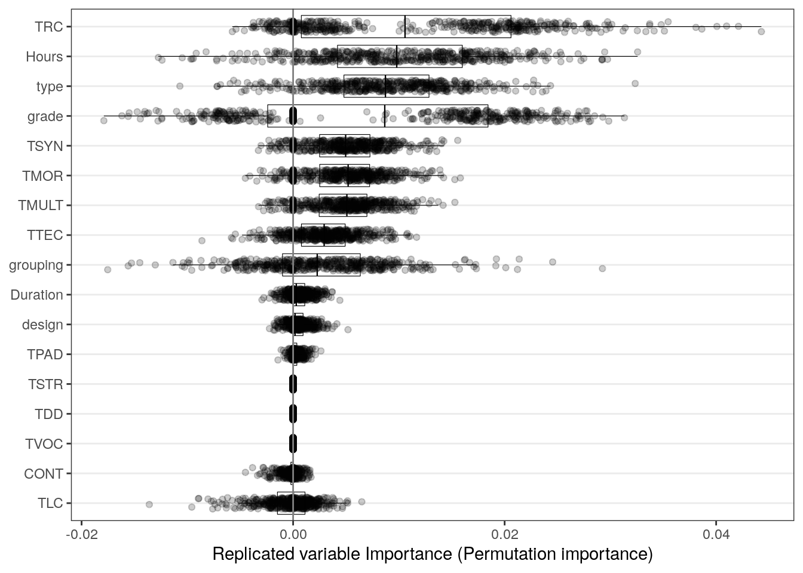

Meta-analysis Script
================
Saurabh Khanna
2020-04-27

  - [Reading in data](#reading-in-data)
  - [Calculate effect sizes](#calculate-effect-sizes)
      - [Post only](#post-only)
      - [Pre and Post](#pre-and-post)
      - [Directly entered ES](#directly-entered-es)
      - [Combining all](#combining-all)
      - [Summary stats](#summary-stats)
  - [Synthesizing effect sizes](#synthesizing-effect-sizes)
      - [Vocabulary](#vocabulary)
      - [Listening Comprehension](#listening-comprehension)
      - [Reading Comprehension](#reading-comprehension)
      - [Morphology](#morphology)
      - [Syntax](#syntax)
      - [Academic Learning](#academic-learning)
  - [MetaForest plots](#metaforest-plots)
      - [Vocabulary](#vocabulary-1)
      - [Listening Comprehension](#listening-comprehension-1)
      - [Reading Comprehension](#reading-comprehension-1)

``` r
# Libraries
library(tidyverse)
```

    ## ── Attaching packages ───────────────────────────────────────────────────────────────────────────────────────────────────────────────── tidyverse 1.3.0 ──

    ## ✓ ggplot2 3.3.0     ✓ purrr   0.3.4
    ## ✓ tibble  3.0.1     ✓ dplyr   0.8.5
    ## ✓ tidyr   1.0.2     ✓ stringr 1.4.0
    ## ✓ readr   1.3.1     ✓ forcats 0.5.0

    ## ── Conflicts ──────────────────────────────────────────────────────────────────────────────────────────────────────────────────── tidyverse_conflicts() ──
    ## x dplyr::filter() masks stats::filter()
    ## x dplyr::lag()    masks stats::lag()

``` r
library(readxl)
library(metafor)
```

    ## Loading required package: Matrix

    ## 
    ## Attaching package: 'Matrix'

    ## The following objects are masked from 'package:tidyr':
    ## 
    ##     expand, pack, unpack

    ## Loading 'metafor' package (version 2.4-0). For an overview 
    ## and introduction to the package please type: help(metafor).

``` r
library(MAd)
library(metaforest)
```

    ## Loading required package: ranger

    ## Loading required package: data.table

    ## 
    ## Attaching package: 'data.table'

    ## The following objects are masked from 'package:dplyr':
    ## 
    ##     between, first, last

    ## The following object is masked from 'package:purrr':
    ## 
    ##     transpose

``` r
# Parameters
data_file <- here::here("data/L&L Data Set Means SDs.xlsx")
```

## Reading in data

``` r
# join checks
read_xlsx(data_file, sheet = "VR") %>% 
  select(AUTYR) %>% 
  drop_na(AUTYR) %>% 
  anti_join(
    read_xlsx(data_file, sheet = "StudyChar") %>% 
      select(AUTYR) %>% 
      drop_na(AUTYR),
    by = "AUTYR"
  )
```

    ## # A tibble: 1 x 1
    ##   AUTYR     
    ##   <chr>     
    ## 1 Nelson11FU

``` r
read_xlsx(data_file, sheet = "VS") %>% 
  select(AUTYR) %>% 
  drop_na(AUTYR) %>% 
  anti_join(
    read_xlsx(data_file, sheet = "StudyChar") %>% 
      select(AUTYR) %>% 
      drop_na(AUTYR),
    by = "AUTYR"
  )
```

    ## # A tibble: 1 x 1
    ##   AUTYR     
    ##   <chr>     
    ## 1 Nelson11FU

``` r
read_xlsx(data_file, sheet = "LR") %>% 
  select(AUTYR) %>% 
  drop_na(AUTYR) %>% 
  anti_join(
    read_xlsx(data_file, sheet = "StudyChar") %>% 
      select(AUTYR) %>% 
      drop_na(AUTYR),
    by = "AUTYR"
  )
```

    ## # A tibble: 0 x 1
    ## # … with 1 variable: AUTYR <chr>

``` r
read_xlsx(data_file, sheet = "LS") %>% 
  select(AUTYR) %>% 
  drop_na(AUTYR) %>% 
  anti_join(
    read_xlsx(data_file, sheet = "StudyChar") %>% 
      select(AUTYR) %>% 
      drop_na(AUTYR),
    by = "AUTYR"
  )
```

    ## # A tibble: 0 x 1
    ## # … with 1 variable: AUTYR <chr>

``` r
read_xlsx(data_file, sheet = "RR") %>% 
  select(AUTYR) %>% 
  drop_na(AUTYR) %>% 
  anti_join(
    read_xlsx(data_file, sheet = "StudyChar") %>% 
      select(AUTYR) %>% 
      drop_na(AUTYR),
    by = "AUTYR"
  )
```

    ## # A tibble: 0 x 1
    ## # … with 1 variable: AUTYR <chr>

``` r
read_xlsx(data_file, sheet = "RS") %>% 
  select(AUTYR) %>% 
  drop_na(AUTYR) %>% 
  anti_join(
    read_xlsx(data_file, sheet = "StudyChar") %>% 
      select(AUTYR) %>% 
      drop_na(AUTYR),
    by = "AUTYR"
  )
```

    ## # A tibble: 0 x 1
    ## # … with 1 variable: AUTYR <chr>

All good\!

## Calculate effect sizes

### Post only

``` r
df_post <-
  bind_rows(
    "VR" = read_xlsx(data_file, sheet = "VR") %>% rename_at(vars(-AUTYR), ~ str_replace(., "VR", "")),
    "VS" = read_xlsx(data_file, sheet = "VS") %>% rename_at(vars(-AUTYR), ~ str_replace(., "VS", "")),
    "RR" = read_xlsx(data_file, sheet = "RR") %>% rename_at(vars(-AUTYR), ~ str_replace(., "RR", "")),
    "RS" = read_xlsx(data_file, sheet = "RS") %>% rename_at(vars(-AUTYR), ~ str_replace(., "RS", "")),
    "LR" = read_xlsx(data_file, sheet = "LR") %>% rename_at(vars(-AUTYR), ~ str_replace(., "LR", "")),
    "LS" = read_xlsx(data_file, sheet = "LS") %>% rename_at(vars(-AUTYR), ~ str_replace(., "LS", "")),
    "MR" = read_xlsx(data_file, sheet = "MR") %>% rename_at(vars(-AUTYR), ~ str_replace(., "MR", "")),
    "MS" = read_xlsx(data_file, sheet = "MS") %>% rename_at(vars(-AUTYR), ~ str_replace(., "MS", "")),
    "SR" = read_xlsx(data_file, sheet = "SR") %>% rename_at(vars(-AUTYR), ~ str_replace(., "SR", "")),
    "SS" = read_xlsx(data_file, sheet = "SS") %>% rename_at(vars(-AUTYR), ~ str_replace(., "SS", "")),
    "AS" = read_xlsx(data_file, sheet = "AS") %>% rename_at(vars(-AUTYR), ~ str_replace(., "AS", "")),
    .id = "type"
  ) %>% 
  drop_na(AUTYR) %>%
  filter(is.na(TM1pre)) %>% 
  select_if(~ any(!is.na(.))) %>%
  select(AUTYR, type, sort(current_vars()))
```

    ## Warning: current_vars() is deprecated. 
    ## Please use tidyselect::peek_vars() instead
    ## This warning is displayed once per session.

``` r
for (m in 1:4) {
  if (
    !(str_glue("TM{m}post") %in% colnames(df_post)) | 
    !(str_glue("CM{m}post") %in% colnames(df_post))
  ) {
    next
  }
  df_post <-
    escalc(
      data = df_post,
      measure = "SMD",
      m1i = df_post[, str_c("TM", m, "post")] %>% unlist(),
      m2i = df_post[, str_c("CM", m, "post")] %>% unlist(),
      sd1i = df_post[, str_c("TS", m, "post")] %>% unlist(),
      sd2i = df_post[, str_c("CS", m, "post")] %>% unlist(),
      n1i = df_post[, str_c("TN", m, "post")] %>% unlist(),
      n2i = df_post[, str_c("CN", m, "post")] %>% unlist(),
      var.names = c(str_glue("ES_{m}"), str_glue("EV_{m}"))
    ) 
}


df_post <-
  df_post %>% 
  select(AUTYR, type, starts_with("ES")) %>% 
  pivot_longer(cols = starts_with("ES"), names_to = "num", values_to = "ES", values_drop_na = T) %>%
  mutate(num = str_sub(num, 4)) %>% 
  left_join(
    df_post %>% 
      select(AUTYR, type, starts_with("EV")) %>% 
      pivot_longer(cols = starts_with("EV"), names_to = "num", values_to = "EV", values_drop_na = T) %>% 
      mutate(num = str_sub(num, 4)),
    by = c("AUTYR", "type", "num")
  ) %>% 
  select(-num)
```

### Pre and Post

``` r
df_prepost <-
  bind_rows(
    "VR" = read_xlsx(data_file, sheet = "VR") %>% rename_at(vars(-AUTYR), ~ str_replace(., "VR", "")),
    "VS" = read_xlsx(data_file, sheet = "VS") %>% rename_at(vars(-AUTYR), ~ str_replace(., "VS", "")),
    "RR" = read_xlsx(data_file, sheet = "RR") %>% rename_at(vars(-AUTYR), ~ str_replace(., "RR", "")),
    "RS" = read_xlsx(data_file, sheet = "RS") %>% rename_at(vars(-AUTYR), ~ str_replace(., "RS", "")),
    "LR" = read_xlsx(data_file, sheet = "LR") %>% rename_at(vars(-AUTYR), ~ str_replace(., "LR", "")),
    "LS" = read_xlsx(data_file, sheet = "LS") %>% rename_at(vars(-AUTYR), ~ str_replace(., "LS", "")),
    "MR" = read_xlsx(data_file, sheet = "MR") %>% rename_at(vars(-AUTYR), ~ str_replace(., "MR", "")),
    "MS" = read_xlsx(data_file, sheet = "MS") %>% rename_at(vars(-AUTYR), ~ str_replace(., "MS", "")),
    "SR" = read_xlsx(data_file, sheet = "SR") %>% rename_at(vars(-AUTYR), ~ str_replace(., "SR", "")),
    "SS" = read_xlsx(data_file, sheet = "SS") %>% rename_at(vars(-AUTYR), ~ str_replace(., "SS", "")),
    "AS" = read_xlsx(data_file, sheet = "AS") %>% rename_at(vars(-AUTYR), ~ str_replace(., "AS", "")),
    .id = "type"
  ) %>% 
  drop_na(AUTYR) %>%
  filter(!is.na(TM1pre)) %>% 
  select_if(~ any(!is.na(.))) %>%
  select(AUTYR, type, sort(current_vars())) %>% 
  mutate(
    TN1post = if_else(is.na(TN1post) & !is.na(TN1pre), TN1pre, TN1post),
    TN2post = if_else(is.na(TN2post) & !is.na(TN2pre), TN2pre, TN2post),
    CN1post = if_else(is.na(CN1post) & !is.na(CN1pre), CN1pre, CN1post),
    CN2post = if_else(is.na(CN2post) & !is.na(CN2pre), CN2pre, CN2post)
  )


# treatment (post-pre)
for (mt in 1:4) {
  if (
    !(str_glue("TM{mt}post") %in% colnames(df_prepost)) | 
    !(str_glue("TM{mt}pre") %in% colnames(df_prepost))
  ) {
    next
  }
  df_prepost <-
    escalc(
      data = df_prepost,
      measure = "SMCR",
      m1i = df_prepost[, str_c("TM", mt, "post")] %>% unlist(),
      m2i = df_prepost[, str_c("TM", mt, "pre")] %>% unlist(),
      sd1i = df_prepost[, str_c("TS", mt, "pre")] %>% unlist(),
      ni = df_prepost[, str_c("TN", mt, "post")] %>% unlist(),
      ri = rep(0.5, 86),
      var.names = c(str_glue("TES_TM{mt}"), str_glue("TEV_TM{mt}"))
    ) 
}

# control (post-pre)
for (mc in 1:4) {
  if (
    !(str_glue("CM{mc}post") %in% colnames(df_prepost)) | 
    !(str_glue("CM{mc}pre") %in% colnames(df_prepost))
  ) {
    next
  }
  df_prepost <-
    escalc(
      data = df_prepost,
      measure = "SMCR",
      m1i = df_prepost[, str_c("CM", mc, "post")] %>% unlist(),
      m2i = df_prepost[, str_c("CM", mc, "pre")] %>% unlist(),
      sd1i = df_prepost[, str_c("CS", mc, "pre")] %>% unlist(),
      ni = df_prepost[, str_c("CN", mc, "post")] %>% unlist(),
      ri = rep(0.5, 86),
      var.names = c(str_glue("CES_CM{mc}"), str_glue("CEV_CM{mc}"))
    ) 
}


# ES and EV taken together
for (m in 1:4) {
  if (
    !(str_glue("TES_TM{m}") %in% colnames(df_prepost)) | 
    !(str_glue("TEV_TM{m}") %in% colnames(df_prepost)) |
    !(str_glue("CES_CM{m}") %in% colnames(df_prepost)) | 
    !(str_glue("CEV_CM{m}") %in% colnames(df_prepost))
  ) {
    next
  }
  # subtracting effect size
  df_prepost[, str_c("ES_", m)] <- 
    (df_prepost[, str_c("TES_TM", m)] %>% unlist()) -
    (df_prepost[, str_c("CES_CM", m)] %>% unlist())
  # adding variance
  df_prepost[, str_c("EV_", m)] <- 
    (df_prepost[, str_c("TEV_TM", m)] %>% unlist()) +
    (df_prepost[, str_c("CEV_CM", m)] %>% unlist())
}


df_prepost <-
  df_prepost %>% 
  select(AUTYR, type, starts_with("ES")) %>% 
  pivot_longer(cols = starts_with("ES"), names_to = "num", values_to = "ES", values_drop_na = T) %>%
  mutate(num = str_sub(num, 4)) %>% 
  left_join(
    df_prepost %>% 
      select(AUTYR, type, starts_with("EV")) %>% 
      pivot_longer(cols = starts_with("EV"), names_to = "num", values_to = "EV", values_drop_na = T) %>% 
      mutate(num = str_sub(num, 4)),
    by = c("AUTYR", "type", "num")
  ) %>% 
  select(-num)
```

### Directly entered ES

``` r
df_es_direct <-
  tribble(
    ~AUTYR,        ~type, ~ES, ~EV,
    
    # "Apthorp12_K", "VR",  0.98, 0,
    # "Apthorp12_1", "VR",  1.00, 0,
    # "Apthorp12_3", "VR",  0.95, 0,
    # "Apthorp12_4", "VR",  1.24, 0,
    
    # "Apthorp12_P", "VS",  0.06, 0,
    # "Apthorp12_I", "VS", -0.14, 0,
    "Gersten10",   "VS",  0.33, 0.05,
    "Jayanthi18",  "VS", -0.043, 0.001,

    # "Apthorp12_K", "LR",  0.24, 0,
    # "Apthorp12_1", "LR",  0.21, 0,
    # 
    # "Apthorp12_P", "LS",  0.05, 0,
    # 
    # "Apthorp12_3", "RR",  0.09, 0,
    # "Apthorp12_4", "RR",  0.44, 0,
    # 
    # "Apthorp12_I", "RS", -0.11, 0,
    "Gersten10",   "RS",  0.13, 0.04
  )
```

### Combining all

``` r
df_append <- 
  bind_rows(df_post, df_prepost, df_es_direct) %>% 
  left_join(
    read_xlsx(data_file, sheet = "StudyChar") %>% 
      drop_na(AUTYR),
    by = "AUTYR"
  ) %>%
  mutate(
    LowIncome = recode(LowIncome, "0.0" = "0", "1.0" = "1", .default = NA_character_) %>% as.integer(),
    Hours = Hours %>% parse_number(),
    CONT = recode(CONT, "BAU" = "0", "ALT" = "1") %>% as.integer()
  ) %>%
  arrange(type, stdid) %>%
  select(type, stdid, AUTYR, everything())
  
cor_es <-
  df_append %>%
  unite("type_stdid", c("type", "stdid")) %>% 
  agg(id = type_stdid, es = ES, var = EV, method = "BHHR", data = .) %>% 
  separate(id, c("type", "stdid")) %>% 
  rename(ES = es, EV = var)

df_clean <-
  df_append %>%
  group_by(type, stdid) %>%
  summarize_at(vars(LowIncome:Hours), ~ round(mean(.))) %>%
  ungroup() %>%
  left_join(cor_es, by = c("type", "stdid")) %>% 
  select(type, stdid, ES, EV, everything()) %>% 
  mutate(
    design = case_when(
      RCT == 1 ~ "RCT",
      QED == 1 ~ "QED",
      WSD == 1 ~ "WSD",
      TRUE ~ NA_character_
    ) %>% as_factor(),
    grade = case_when(
      (GradeK + Grade1 + Grade2) > 0 & (Grade3 + Grade4 + Grade5) == 0 ~ "K-2",
      (Grade3 + Grade4 + Grade5) > 0 & (GradeK + Grade1 + Grade2) == 0 ~ "3-5",
      TRUE ~ "Both"
    ) %>% as_factor(),
    grouping = case_when(
      ((WholeCl + SmallGr) == 2) | ((WholeCl + Indiv) == 2) ~ "Combination",
      WholeCl == 1 ~ "Whole class",
      (SmallGr == 1) | (Indiv == 1) ~ "Small or Indiv",
      TRUE ~ NA_character_
    ) %>% as_factor(),
    type = type %>% as_factor(),
    CONT = CONT %>% factor(labels = c("BAU", "ALT")),
    TCOM = if_else(TLC == 1 | TRC == 1, 1, 0)
  ) %>%
  select(-c(RCT, QED, WSD, WholeCl, SmallGr, Indiv), -starts_with("Grade", ignore.case = F)) %>% 
  left_join(
    read_xlsx(data_file, sheet = "citations"),
    by = c("type", "stdid")
  )
```

    ## Warning: Column `type` joining factor and character vector, coercing into
    ## character vector

``` r
rm(df_post, df_prepost, df_es_direct, df_append, cor_es)
#df_clean %>% summary()
df_clean %>% knitr::kable()
```

| type | stdid       |          ES |        EV | LowIncome | EL | TMULT | TVOC | TSYN | TMOR | TLC | TRC | TPAD | TDD | TTEC | TSTR | CONT | Duration | Hours | design | grade | grouping       | TCOM | citation                                |
| :--: | :---------- | ----------: | --------: | --------: | -: | ----: | ---: | ---: | ---: | --: | --: | ---: | --: | ---: | ---: | :--- | -------: | ----: | :----- | :---- | :------------- | ---: | :-------------------------------------- |
|  AS  | Jones1      |   0.0289111 | 0.0020178 |         1 |  0 |     0 |    1 |    0 |    0 |   0 |   0 |    0 |   1 |    0 |    0 | BAU  |        1 |    95 | RCT    | 3-5   | Combination    |    0 | Jones et al. (2019) YR1                 |
|  AS  | Jones2      |   0.1203421 | 0.0018244 |         1 |  0 |     0 |    1 |    0 |    0 |   0 |   0 |    0 |   1 |    0 |    0 | BAU  |        1 |    95 | RCT    | 3-5   | Combination    |    0 | Jones et al. (2019) YR2                 |
|  AS  | Proc19      |   0.1139215 | 0.0167638 |         1 |  1 |     1 |    1 |    1 |    1 |   1 |   1 |    0 |   1 |    1 |    0 | BAU  |        1 |    20 | QED    | 3-5   | Small or Indiv |    1 | Proctor et al. (2020)                   |
|  LR  | Apth1       |   0.2312520 | 0.0024144 |         1 |  0 |     0 |    1 |    0 |    0 |   0 |   0 |    0 |   0 |    0 |    0 | BAU  |        1 |    30 | RCT    | K-2   | Whole class    |    0 | Apthorp et al. (2012) G1                |
|  LR  | ApthK       |   0.3771837 | 0.0025840 |         1 |  0 |     0 |    1 |    0 |    0 |   0 |   0 |    0 |   0 |    0 |    0 | BAU  |        1 |    30 | RCT    | K-2   | Whole class    |    0 | Apthorp et al. (2012) KG                |
|  LR  | Baker       |   0.2651806 | 0.0312088 |         1 |  0 |     0 |    1 |    0 |    0 |   1 |   0 |    0 |   0 |    0 |    0 | ALT  |        1 |    38 | RCT    | K-2   | Whole class    |    1 | Baker et al. (2013)                     |
|  LR  | Coyne10     |   0.3683911 | 0.0357745 |         1 |  0 |     0 |    1 |    0 |    0 |   0 |   0 |    0 |   0 |    0 |    0 | BAU  |        0 |    18 | QED    | K-2   | Whole class    |    0 | Coyne et al. (2010)                     |
|  LR  | Coyne19     |   0.4067562 | 0.0025440 |        NA |  0 |     0 |    1 |    0 |    0 |   0 |   0 |    0 |   0 |    0 |    0 | ALT  |        1 |    44 | RCT    | K-2   | Small or Indiv |    0 | Coyne et al. (2019)                     |
|  LR  | Jiang1      |   0.2936279 | 0.0260646 |         0 |  0 |     1 |    1 |    1 |    1 |   1 |   0 |    0 |   0 |    1 |    0 | BAU  |        1 |    50 | RCT    | K-2   | Whole class    |    1 | Jiang & Davis (2017) G1                 |
|  LR  | Jiang2      | \-0.0763520 | 0.0242781 |         0 |  0 |     1 |    1 |    1 |    1 |   1 |   0 |    0 |   0 |    1 |    0 | BAU  |        1 |    50 | RCT    | K-2   | Whole class    |    1 | Jiang & Davis (2017) G2                 |
|  LR  | Jiang3      |   0.3481917 | 0.0242353 |         0 |  0 |     1 |    1 |    1 |    1 |   1 |   0 |    0 |   0 |    1 |    0 | BAU  |        1 |    50 | RCT    | 3-5   | Whole class    |    1 | Jiang & Davis (2017) G3                 |
|  LR  | JiangK      |   0.2561034 | 0.0223375 |         0 |  0 |     1 |    1 |    1 |    1 |   1 |   0 |    0 |   0 |    1 |    0 | BAU  |        1 |    50 | RCT    | K-2   | Whole class    |    1 | Jiang & Davis (2017) KG                 |
|  LR  | Silver17bK  |   0.0647812 | 0.0206484 |         1 |  1 |     0 |    1 |    0 |    0 |   1 |   0 |    0 |   1 |    1 |    1 | BAU  |        1 |    20 | QED    | K-2   | Combination    |    1 | Silverman et al. (2017b) KG             |
|  LS  | ApthP       |   0.0176180 | 0.0014313 |         1 |  0 |     0 |    1 |    0 |    0 |   0 |   0 |    0 |   0 |    0 |    0 | BAU  |        1 |    30 | RCT    | K-2   | Whole class    |    0 | Apthorp et al. (2012) K1                |
|  LS  | Baker       |   0.0990000 | 0.0181208 |         1 |  0 |     0 |    1 |    0 |    0 |   1 |   0 |    0 |   0 |    0 |    0 | ALT  |        1 |    38 | RCT    | K-2   | Whole class    |    1 | Baker et al. (2013)                     |
|  LS  | Conn183     |   0.0792939 | 0.0117896 |         0 |  0 |     0 |    1 |    0 |    0 |   1 |   1 |    0 |   0 |    0 |    0 | BAU  |        1 |    22 | RCT    | 3-5   | Small or Indiv |    1 | Connor et al. (2018) G3                 |
|  LS  | Conn184     | \-0.0223388 | 0.0134181 |         0 |  0 |     0 |    1 |    0 |    0 |   1 |   1 |    0 |   0 |    0 |    0 | BAU  |        1 |    22 | RCT    | 3-5   | Small or Indiv |    1 | Connor et al. (2018) G4                 |
|  LS  | Nielsen     |   0.5156824 | 0.1941841 |         1 |  0 |     0 |    1 |    0 |    0 |   1 |   0 |    0 |   0 |    0 |    0 | BAU  |        0 |    18 | QED    | K-2   | Small or Indiv |    1 | Nielsen & Friesen (2012)                |
|  LS  | Tong        |   0.2418983 | 0.0944200 |         1 |  1 |     0 |    1 |    0 |    0 |   1 |   1 |    1 |   0 |    0 |    0 | BAU  |        1 |   100 | RCT    | K-2   | Combination    |    1 | Tong et al. (2010)                      |
|  MR  | Apel1       |   2.4249393 | 0.2456334 |         1 |  0 |     0 |    0 |    0 |    1 |   0 |   0 |    0 |   0 |    0 |    0 | BAU  |        0 |    13 | RCT    | K-2   | Small or Indiv |    0 | Apel & Diehm (2013) G1                  |
|  MR  | Apel2       |   0.6689962 | 0.0636171 |         1 |  0 |     0 |    0 |    0 |    1 |   0 |   0 |    0 |   0 |    0 |    0 | BAU  |        0 |    13 | RCT    | K-2   | Small or Indiv |    0 | Apel & Diehm (2013) G2                  |
|  MR  | ApelK       |   0.9939616 | 0.0770327 |         1 |  0 |     0 |    0 |    0 |    1 |   0 |   0 |    0 |   0 |    0 |    0 | BAU  |        0 |    13 | RCT    | K-2   | Small or Indiv |    0 | Apel & Diehm (2013) KG                  |
|  MR  | Brimo       |   0.5860487 | 0.3775560 |        NA |  0 |     0 |    0 |    0 |    1 |   0 |   0 |    0 |   0 |    0 |    0 | BAU  |        0 |    12 | QED    | 3-5   | Small or Indiv |    0 | Brimo (2016)                            |
|  RR  | Apth3       |   0.1377019 | 0.0022997 |         1 |  0 |     0 |    1 |    0 |    0 |   0 |   0 |    0 |   0 |    0 |    0 | BAU  |        1 |    30 | RCT    | 3-5   | Whole class    |    0 | Apthorp et al. (2012) G3                |
|  RR  | Dalt11      |   1.0831029 | 0.0427347 |         0 |  1 |     0 |    1 |    0 |    0 |   0 |   0 |    0 |   0 |    1 |    0 | ALT  |        1 |    20 | RCT    | 3-5   | Small or Indiv |    0 | Dalton et al. (2011)                    |
|  RR  | Graham      |   0.1519858 | 0.0156276 |        NA |  0 |     0 |    1 |    0 |    0 |   0 |   0 |    0 |   0 |    0 |    1 | BAU  |        0 |     9 | RCT    | 3-5   | Whole class    |    0 | Graham et al. (2015)                    |
|  RR  | Silver17a4  |   0.8508342 | 0.0154886 |         1 |  0 |     0 |    1 |    0 |    0 |   0 |   0 |    0 |   1 |    1 |    0 | BAU  |        0 |    10 | QED    | 3-5   | Combination    |    0 | Silverman et al. (2017a) G4             |
|  RR  | VadSanHer15 |   0.2178669 | 0.0033594 |         0 |  1 |     0 |    1 |    0 |    0 |   0 |   1 |    0 |   0 |    0 |    0 | BAU  |        1 |    35 | RCT    | 3-5   | Whole class    |    1 | Vadasy, Sanders, & Logan Herrera (2015) |
|  RS  | Apel1       |   0.3604871 | 0.1141001 |         1 |  0 |     0 |    0 |    0 |    1 |   0 |   0 |    0 |   0 |    0 |    0 | BAU  |        0 |    13 | RCT    | K-2   | Small or Indiv |    0 | Apel & Diehm (2013) G1                  |
|  RS  | Apel2       | \-0.0919161 | 0.0850093 |         1 |  0 |     0 |    0 |    0 |    1 |   0 |   0 |    0 |   0 |    0 |    0 | BAU  |        0 |    13 | RCT    | K-2   | Small or Indiv |    0 | Apel & Diehm (2013) G2                  |
|  RS  | Conn183     | \-0.0184807 | 0.0117848 |         0 |  0 |     0 |    1 |    0 |    0 |   1 |   1 |    0 |   0 |    0 |    0 | BAU  |        1 |    22 | RCT    | 3-5   | Small or Indiv |    1 | Connor et al. (2018) G3                 |
|  RS  | Conn184     | \-0.0203581 | 0.0134163 |         0 |  0 |     0 |    1 |    0 |    0 |   1 |   1 |    0 |   0 |    0 |    0 | BAU  |        1 |    22 | RCT    | 3-5   | Small or Indiv |    1 | Connor et al. (2018) G4                 |
|  RS  | Dalt11      |   1.0331095 | 0.0493694 |         0 |  1 |     0 |    1 |    0 |    0 |   0 |   0 |    0 |   0 |    1 |    0 | ALT  |        1 |    20 | RCT    | 3-5   | Small or Indiv |    0 | Dalton et al. (2011)                    |
|  RS  | Daunic      | \-0.2206484 | 0.0877731 |        NA |  0 |     0 |    1 |    0 |    0 |   1 |   0 |    0 |   1 |    0 |    0 | BAU  |        0 |     5 | QED    | K-2   | Small or Indiv |    1 | Daunic et al. (2013)                    |
|  RS  | Gersten     |   0.1300000 | 0.0400000 |        NA |  0 |     0 |    1 |    0 |    0 |   1 |   0 |    0 |   0 |    0 |    0 | BAU  |        1 |    NA | RCT    | K-2   | Whole class    |    1 | Gersten et al. (2010)                   |
|  RS  | Jones1      |   0.0733653 | 0.0018199 |         1 |  0 |     0 |    1 |    0 |    0 |   0 |   0 |    0 |   1 |    0 |    0 | BAU  |        1 |    95 | RCT    | 3-5   | Combination    |    0 | Jones et al. (2019) YR1                 |
|  RS  | Jones2      |   0.2366471 | 0.0018459 |         1 |  0 |     0 |    1 |    0 |    0 |   0 |   0 |    0 |   1 |    0 |    0 | BAU  |        1 |    95 | RCT    | 3-5   | Combination    |    0 | Jones et al. (2019) YR2                 |
|  RS  | Morris      |   0.2364356 | 0.0312791 |         0 |  0 |     1 |    1 |    1 |    1 |   0 |   0 |    1 |   0 |    0 |    1 | ALT  |        1 |    70 | RCT    | Both  | Small or Indiv |    0 | Morris et al. (2012)                    |
|  RS  | Proc11      | \-0.0436775 | 0.0172460 |         1 |  1 |     1 |    1 |    1 |    0 |   1 |   1 |    0 |   0 |    1 |    0 | BAU  |        1 |    27 | QED    | 3-5   | Small or Indiv |    1 | Proctor et al. (2011)                   |
|  RS  | Proc19      |   0.2331418 | 0.0191677 |         1 |  1 |     1 |    1 |    1 |    1 |   1 |   1 |    0 |   1 |    1 |    0 | BAU  |        1 |    20 | QED    | 3-5   | Small or Indiv |    1 | Proctor et al. (2020)                   |
|  RS  | Silver17a4  | \-0.0014823 | 0.0075817 |         1 |  0 |     0 |    1 |    0 |    0 |   0 |   0 |    0 |   1 |    1 |    0 | BAU  |        0 |    10 | QED    | 3-5   | Combination    |    0 | Silverman et al. (2017a) G4             |
|  RS  | Silver17b4  | \-0.1127521 | 0.0182102 |         1 |  1 |     0 |    1 |    0 |    0 |   0 |   1 |    0 |   1 |    1 |    1 | BAU  |        1 |    20 | QED    | 3-5   | Combination    |    1 | Silverman et al. (2017b) G4             |
|  RS  | Simmons     | \-0.0648048 | 0.0056414 |         1 |  0 |     0 |    1 |    0 |    0 |   0 |   0 |    0 |   0 |    0 |    1 | BAU  |        1 |    27 | RCT    | 3-5   | Whole class    |    0 | Simmons et al. (2010)                   |
|  RS  | Tong        |   0.1497852 | 0.0757906 |         1 |  1 |     0 |    1 |    0 |    0 |   1 |   1 |    1 |   0 |    0 |    0 | BAU  |        1 |   100 | RCT    | K-2   | Combination    |    1 | Tong et al. (2010)                      |
|  RS  | VadSanHer15 |   0.0500486 | 0.0033727 |         0 |  1 |     0 |    1 |    0 |    0 |   0 |   1 |    0 |   0 |    0 |    0 | BAU  |        1 |    35 | RCT    | 3-5   | Whole class    |    1 | Vadasy, Sanders, & Logan Herrera (2015) |
|  SS  | Conn183     |   0.0767859 | 0.0118030 |         0 |  0 |     0 |    1 |    0 |    0 |   1 |   1 |    0 |   0 |    0 |    0 | BAU  |        1 |    22 | RCT    | 3-5   | Small or Indiv |    1 | Connor et al. (2018) G3                 |
|  SS  | Conn184     | \-0.0627694 | 0.0134290 |         0 |  0 |     0 |    1 |    0 |    0 |   1 |   1 |    0 |   0 |    0 |    0 | BAU  |        1 |    22 | RCT    | 3-5   | Small or Indiv |    1 | Connor et al. (2018) G4                 |
|  VR  | Apth1       |   0.7679293 | 0.0024274 |         1 |  0 |     0 |    1 |    0 |    0 |   0 |   0 |    0 |   0 |    0 |    0 | BAU  |        1 |    30 | RCT    | K-2   | Whole class    |    0 | Apthorp et al. (2012) G1                |
|  VR  | Apth3       |   0.9032747 | 0.0028180 |         1 |  0 |     0 |    1 |    0 |    0 |   0 |   0 |    0 |   0 |    0 |    0 | BAU  |        1 |    30 | RCT    | 3-5   | Whole class    |    0 | Apthorp et al. (2012) G3                |
|  VR  | ApthK       |   0.7963996 | 0.0028469 |         1 |  0 |     0 |    1 |    0 |    0 |   0 |   0 |    0 |   0 |    0 |    0 | BAU  |        1 |    30 | RCT    | K-2   | Whole class    |    0 | Apthorp et al. (2012) KG                |
|  VR  | Arth1       |   0.4018396 | 0.1512635 |        NA |  0 |     1 |    1 |    1 |    0 |   1 |   0 |    0 |   0 |    0 |    0 | BAU  |        0 |     9 | QED    | K-2   | Whole class    |    1 | Arthur & Davis (2016) G1                |
|  VR  | Arth2       |   1.0824260 | 0.3962804 |        NA |  0 |     1 |    1 |    1 |    0 |   1 |   0 |    0 |   0 |    0 |    0 | BAU  |        0 |     9 | QED    | K-2   | Whole class    |    1 | Arthur & Davis (2016) G2                |
|  VR  | Arth3       |   0.8095698 | 0.1674121 |        NA |  0 |     1 |    1 |    1 |    0 |   1 |   0 |    0 |   0 |    0 |    0 | BAU  |        0 |     9 | QED    | 3-5   | Whole class    |    1 | Arthur & Davis (2016) G3                |
|  VR  | ArthK       |   0.0786293 | 0.2387246 |        NA |  0 |     1 |    1 |    1 |    0 |   1 |   0 |    0 |   0 |    0 |    0 | BAU  |        0 |     9 | QED    | K-2   | Whole class    |    1 | Arthur & Davis (2016) KG                |
|  VR  | Aug         |   2.1695243 | 0.0192149 |         1 |  1 |     0 |    1 |    0 |    0 |   0 |   0 |    0 |   0 |    0 |    0 | ALT  |        1 |    25 | WSD    | K-2   | Whole class    |    0 | August et al. (2018)                    |
|  VR  | Baker       |   1.0516546 | 0.0525750 |         1 |  0 |     0 |    1 |    0 |    0 |   1 |   0 |    0 |   0 |    0 |    0 | ALT  |        1 |    38 | RCT    | K-2   | Whole class    |    1 | Baker et al. (2013)                     |
|  VR  | Conn19      |   0.3320051 | 0.0121459 |         1 |  0 |     1 |    1 |    0 |    1 |   0 |   0 |    0 |   0 |    1 |    1 | BAU  |        0 |     4 | RCT    | 3-5   | Small or Indiv |    0 | Connor et al. (2019)                    |
|  VR  | Coyne10     |   1.4966451 | 0.0442593 |         1 |  0 |     0 |    1 |    0 |    0 |   0 |   0 |    0 |   0 |    0 |    0 | BAU  |        0 |    18 | QED    | K-2   | Whole class    |    0 | Coyne et al. (2010)                     |
|  VR  | Coyne19     |   1.0629307 | 0.0028443 |        NA |  0 |     0 |    1 |    0 |    0 |   0 |   0 |    0 |   0 |    0 |    0 | ALT  |        1 |    44 | RCT    | K-2   | Small or Indiv |    0 | Coyne et al. (2019)                     |
|  VR  | Dalt11      |   1.2606480 | 0.0501652 |         0 |  1 |     0 |    1 |    0 |    0 |   0 |   0 |    0 |   0 |    1 |    0 | ALT  |        1 |    20 | RCT    | 3-5   | Small or Indiv |    0 | Dalton et al. (2011)                    |
|  VR  | Fillippini  |   0.6088208 | 0.0802535 |         1 |  0 |     0 |    1 |    0 |    0 |   0 |   0 |    1 |   0 |    0 |    0 | ALT  |        0 |     7 | RCT    | K-2   | Small or Indiv |    0 | Filippini et al. (2012)                 |
|  VR  | Goldstein   |   1.8003662 | 0.0250224 |         1 |  0 |     0 |    1 |    0 |    0 |   0 |   0 |    0 |   0 |    1 |    1 | ALT  |        1 |    72 | RCT    | Both  | Small or Indiv |    0 | Goldstein et al. (2017)                 |
|  VR  | Graham      |   1.6509504 | 0.0373717 |        NA |  0 |     0 |    1 |    0 |    0 |   0 |   0 |    0 |   0 |    0 |    1 | BAU  |        0 |     9 | RCT    | 3-5   | Whole class    |    0 | Graham et al. (2015)                    |
|  VR  | Hass        |   1.6710769 | 0.0741052 |        NA |  1 |     0 |    1 |    0 |    0 |   0 |   0 |    0 |   0 |    0 |    0 | BAU  |        0 |    12 | RCT    | K-2   | Small or Indiv |    0 | Hassinger-Das et al. (2015)             |
|  VR  | Jiang1      |   3.3726157 | 0.0798665 |         0 |  0 |     1 |    1 |    1 |    1 |   1 |   0 |    0 |   0 |    1 |    0 | BAU  |        1 |    50 | RCT    | K-2   | Whole class    |    1 | Jiang & Davis (2017) G1                 |
|  VR  | Jiang2      |   2.2260077 | 0.0525373 |         0 |  0 |     1 |    1 |    1 |    1 |   1 |   0 |    0 |   0 |    1 |    0 | BAU  |        1 |    50 | RCT    | K-2   | Whole class    |    1 | Jiang & Davis (2017) G2                 |
|  VR  | Jiang3      |   2.5913270 | 0.0562224 |         0 |  0 |     1 |    1 |    1 |    1 |   1 |   0 |    0 |   0 |    1 |    0 | BAU  |        1 |    50 | RCT    | 3-5   | Whole class    |    1 | Jiang & Davis (2017) G3                 |
|  VR  | JiangK      |   2.9412143 | 0.0592122 |         0 |  0 |     1 |    1 |    1 |    1 |   1 |   0 |    0 |   0 |    1 |    0 | BAU  |        1 |    50 | RCT    | K-2   | Whole class    |    1 | Jiang & Davis (2017) KG                 |
|  VR  | Jones1      |   0.1546716 | 0.0018014 |         1 |  0 |     0 |    1 |    0 |    0 |   0 |   0 |    0 |   1 |    0 |    0 | BAU  |        1 |    95 | RCT    | 3-5   | Combination    |    0 | Jones et al. (2019) YR1                 |
|  VR  | Jones2      |   0.3068467 | 0.0018948 |         1 |  0 |     0 |    1 |    0 |    0 |   0 |   0 |    0 |   1 |    0 |    0 | BAU  |        1 |    95 | RCT    | 3-5   | Combination    |    0 | Jones et al. (2019) YR2                 |
|  VR  | Mancilla    |   1.0544302 | 0.1178923 |         1 |  1 |     0 |    1 |    0 |    0 |   0 |   0 |    0 |   1 |    0 |    0 | BAU  |        1 |    25 | QED    | 3-5   | Whole class    |    0 | Mancilla-Martinez (2010)                |
|  VR  | McK         |   4.0639472 | 0.0293040 |         0 |  0 |     0 |    1 |    0 |    0 |   0 |   0 |    0 |   0 |    0 |    0 | ALT  |        0 |     2 | WSD    | K-2   | Whole class    |    0 | McKeown & Beck (2014)                   |
|  VR  | Nelson      |   0.5405571 | 0.0580920 |        NA |  1 |     0 |    1 |    0 |    0 |   0 |   0 |    1 |   0 |    0 |    0 | ALT  |        1 |    33 | RCT    | K-2   | Small or Indiv |    0 | Nelson et al. (2011)                    |
|  VR  | Neuman      |   0.5346265 | 0.0216517 |         1 |  0 |     0 |    1 |    0 |    0 |   0 |   0 |    0 |   0 |    1 |    0 | BAU  |        1 |    20 | RCT    | K-2   | Whole class    |    0 | Neuman & Kaefer (2018)                  |
|  VR  | Nielsen     |   2.7051948 | 0.3754320 |         1 |  0 |     0 |    1 |    0 |    0 |   1 |   0 |    0 |   0 |    0 |    0 | BAU  |        0 |    18 | QED    | K-2   | Small or Indiv |    1 | Nielsen & Friesen (2012)                |
|  VR  | Pow         |   0.5140269 | 0.0703675 |         0 |  0 |     0 |    1 |    0 |    0 |   0 |   0 |    0 |   0 |    0 |    0 | BAU  |        0 |     3 | RCT    | K-2   | Small or Indiv |    0 | Powell & Driver (2015)                  |
|  VR  | Proc11      |   1.1361393 | 0.0121983 |         1 |  1 |     1 |    1 |    1 |    0 |   1 |   1 |    0 |   0 |    1 |    0 | BAU  |        1 |    27 | QED    | 3-5   | Small or Indiv |    1 | Proctor et al. (2011)                   |
|  VR  | Puhal       |   2.6937576 | 0.5142966 |         0 |  0 |     0 |    1 |    0 |    0 |   0 |   0 |    0 |   0 |    0 |    0 | ALT  |        0 |     5 | RCT    | K-2   | Combination    |    0 | Puhalla (2011)                          |
|  VR  | Pullen      |   0.5008066 | 0.0309496 |         0 |  0 |     0 |    1 |    0 |    0 |   0 |   0 |    0 |   0 |    0 |    0 | ALT  |        0 |     2 | QED    | K-2   | Combination    |    0 | Pullen et al. (2010)                    |
|  VR  | Silver17a4  |   0.4220216 | 0.0079434 |         1 |  0 |     0 |    1 |    0 |    0 |   0 |   0 |    0 |   1 |    1 |    0 | BAU  |        0 |    10 | QED    | 3-5   | Combination    |    0 | Silverman et al. (2017a) G4             |
|  VR  | Silver17aK  |   0.3868128 | 0.0068429 |         1 |  0 |     0 |    1 |    0 |    0 |   0 |   0 |    0 |   1 |    1 |    0 | BAU  |        0 |    10 | QED    | K-2   | Combination    |    0 | Silverman et al. (2017a) KG             |
|  VR  | Silver17b4  |   0.8424442 | 0.0166698 |         1 |  1 |     0 |    1 |    0 |    0 |   0 |   1 |    0 |   1 |    1 |    1 | BAU  |        1 |    20 | QED    | 3-5   | Combination    |    1 | Silverman et al. (2017b) G4             |
|  VR  | Silver17bK  |   1.4421285 | 0.0258946 |         1 |  1 |     0 |    1 |    0 |    0 |   1 |   0 |    0 |   1 |    1 |    1 | BAU  |        1 |    20 | QED    | K-2   | Combination    |    1 | Silverman et al. (2017b) KG             |
|  VR  | Simmons     |   7.0009329 | 0.1391228 |         1 |  0 |     0 |    1 |    0 |    0 |   0 |   0 |    0 |   0 |    0 |    1 | BAU  |        1 |    27 | RCT    | 3-5   | Whole class    |    0 | Simmons et al. (2010)                   |
|  VR  | VadSan15    |   0.2613394 | 0.0775021 |        NA |  1 |     0 |    1 |    0 |    0 |   0 |   0 |    1 |   0 |    0 |    0 | ALT  |        0 |     1 | RCT    | K-2   | Small or Indiv |    0 | Vadasy & Sanders (2015)                 |
|  VR  | VadSan16    |   0.3089192 | 0.0572620 |         1 |  1 |     0 |    1 |    0 |    0 |   0 |   0 |    1 |   0 |    0 |    0 | ALT  |        0 |    14 | RCT    | K-2   | Small or Indiv |    0 | Vadasy & Sanders (2016)                 |
|  VR  | VadSanHer15 |   1.2747785 | 0.0039758 |         0 |  1 |     0 |    1 |    0 |    0 |   0 |   1 |    0 |   0 |    0 |    0 | BAU  |        1 |    35 | RCT    | 3-5   | Whole class    |    1 | Vadasy, Sanders, & Logan Herrera (2015) |
|  VR  | VadSanNel15 |   1.2277100 | 0.0464508 |         1 |  1 |     0 |    1 |    0 |    0 |   0 |   0 |    1 |   0 |    0 |    0 | ALT  |        1 |    40 | RCT    | K-2   | Small or Indiv |    0 | Vadasy, Sanders, & Nelson (2015)        |
|  VR  | Wood18      |   0.2654639 | 0.0236715 |         1 |  1 |     1 |    1 |    0 |    1 |   0 |   0 |    0 |   0 |    1 |    0 | ALT  |        1 |    30 | RCT    | K-2   | Whole class    |    0 | Wood et al. (2018)                      |
|  VR  | Wright      |   1.5070059 | 0.0402560 |         1 |  0 |     0 |    1 |    0 |    0 |   1 |   0 |    0 |   1 |    0 |    0 | BAU  |        0 |    15 | QED    | K-2   | Whole class    |    1 | Wright & Gotwals (2017)                 |
|  VR  | Zipoli      |   0.8411806 | 0.0204632 |         1 |  0 |     0 |    1 |    0 |    0 |   0 |   0 |    0 |   0 |    0 |    0 | ALT  |        0 |    18 | WSD    | K-2   | Combination    |    0 | Zipoli et al. (2011)                    |
|  VS  | ApthP       |   0.0080847 | 0.0015520 |         1 |  0 |     0 |    1 |    0 |    0 |   0 |   0 |    0 |   0 |    0 |    0 | BAU  |        1 |    30 | RCT    | K-2   | Whole class    |    0 | Apthorp et al. (2012) K1                |
|  VS  | Conn183     |   0.1333309 | 0.0112523 |         0 |  0 |     0 |    1 |    0 |    0 |   1 |   1 |    0 |   0 |    0 |    0 | BAU  |        1 |    22 | RCT    | 3-5   | Small or Indiv |    1 | Connor et al. (2018) G3                 |
|  VS  | Conn184     |   0.1191087 | 0.0119430 |         0 |  0 |     0 |    1 |    0 |    0 |   1 |   1 |    0 |   0 |    0 |    0 | BAU  |        1 |    22 | RCT    | 3-5   | Small or Indiv |    1 | Connor et al. (2018) G4                 |
|  VS  | Coyne10     |   0.1061789 | 0.0361622 |         1 |  0 |     0 |    1 |    0 |    0 |   0 |   0 |    0 |   0 |    0 |    0 | BAU  |        0 |    18 | QED    | K-2   | Whole class    |    0 | Coyne et al. (2010)                     |
|  VS  | Coyne19     |   0.1034697 | 0.0049060 |        NA |  0 |     0 |    1 |    0 |    0 |   0 |   0 |    0 |   0 |    0 |    0 | ALT  |        1 |    44 | RCT    | K-2   | Small or Indiv |    0 | Coyne et al. (2019)                     |
|  VS  | Dalt11      |   0.1024531 | 0.0419712 |         0 |  1 |     0 |    1 |    0 |    0 |   0 |   0 |    0 |   0 |    1 |    0 | ALT  |        1 |    20 | RCT    | 3-5   | Small or Indiv |    0 | Dalton et al. (2011)                    |
|  VS  | Daunic      |   0.0580749 | 0.0898036 |        NA |  0 |     0 |    1 |    0 |    0 |   1 |   0 |    0 |   1 |    0 |    0 | BAU  |        0 |     5 | QED    | K-2   | Small or Indiv |    1 | Daunic et al. (2013)                    |
|  VS  | Gersten     |   0.3300000 | 0.0500000 |        NA |  0 |     0 |    1 |    0 |    0 |   1 |   0 |    0 |   0 |    0 |    0 | BAU  |        1 |    NA | RCT    | K-2   | Whole class    |    1 | Gersten et al. (2010)                   |
|  VS  | Hass        |   0.4835901 | 0.0534860 |        NA |  1 |     0 |    1 |    0 |    0 |   0 |   0 |    0 |   0 |    0 |    0 | BAU  |        0 |    12 | RCT    | K-2   | Small or Indiv |    0 | Hassinger-Das et al. (2015)             |
|  VS  | Huang       |   0.4786637 | 0.1040172 |         1 |  0 |     1 |    1 |    1 |    0 |   0 |   0 |    0 |   0 |    1 |    0 | ALT  |        1 |    80 | QED    | K-2   | Whole class    |    0 | Huang (2015)                            |
|  VS  | Jayanthi    | \-0.0430000 | 0.0010000 |         1 |  1 |     0 |    1 |    0 |    0 |   0 |   0 |    0 |   0 |    0 |    1 | BAU  |        1 |    NA | RCT    | K-2   | Whole class    |    0 | Jayanthi et al. (2018)                  |
|  VS  | Nelson      | \-0.4798887 | 0.0317414 |        NA |  1 |     0 |    1 |    0 |    0 |   0 |   0 |    1 |   0 |    0 |    0 | ALT  |        1 |    33 | RCT    | K-2   | Small or Indiv |    0 | Nelson et al. (2011)                    |
|  VS  | Neuman      | \-0.0712942 | 0.0192485 |         1 |  0 |     0 |    1 |    0 |    0 |   0 |   0 |    0 |   0 |    1 |    0 | BAU  |        1 |    20 | RCT    | K-2   | Whole class    |    0 | Neuman & Kaefer (2018)                  |
|  VS  | Nielsen     |   0.1435089 | 0.2058622 |         1 |  0 |     0 |    1 |    0 |    0 |   1 |   0 |    0 |   0 |    0 |    0 | BAU  |        0 |    18 | QED    | K-2   | Small or Indiv |    1 | Nielsen & Friesen (2012)                |
|  VS  | Proc11      |   0.0343903 | 0.0171422 |         1 |  1 |     1 |    1 |    1 |    0 |   1 |   1 |    0 |   0 |    1 |    0 | BAU  |        1 |    27 | QED    | 3-5   | Small or Indiv |    1 | Proctor et al. (2011)                   |
|  VS  | Silver17aK  | \-0.0393292 | 0.0079704 |         1 |  0 |     0 |    1 |    0 |    0 |   0 |   0 |    0 |   1 |    1 |    0 | BAU  |        0 |    10 | QED    | K-2   | Combination    |    0 | Silverman et al. (2017a) KG             |
|  VS  | Silver17b4  |   0.1398774 | 0.0182383 |         1 |  1 |     0 |    1 |    0 |    0 |   0 |   1 |    0 |   1 |    1 |    1 | BAU  |        1 |    20 | QED    | 3-5   | Combination    |    1 | Silverman et al. (2017b) G4             |
|  VS  | Silver17bK  | \-0.1159971 | 0.0215981 |         1 |  1 |     0 |    1 |    0 |    0 |   1 |   0 |    0 |   1 |    1 |    1 | BAU  |        1 |    20 | QED    | K-2   | Combination    |    1 | Silverman et al. (2017b) KG             |
|  VS  | Simmons     | \-0.0106594 | 0.0054480 |         1 |  0 |     0 |    1 |    0 |    0 |   0 |   0 |    0 |   0 |    0 |    1 | BAU  |        1 |    27 | RCT    | 3-5   | Whole class    |    0 | Simmons et al. (2010)                   |
|  VS  | Tong        |   0.5042996 | 0.0936713 |         1 |  1 |     0 |    1 |    0 |    0 |   1 |   1 |    1 |   0 |    0 |    0 | BAU  |        1 |   100 | RCT    | K-2   | Combination    |    1 | Tong et al. (2010)                      |
|  VS  | VadSan16    |   0.2884231 | 0.0438190 |         1 |  1 |     0 |    1 |    0 |    0 |   0 |   0 |    1 |   0 |    0 |    0 | ALT  |        0 |    14 | RCT    | K-2   | Small or Indiv |    0 | Vadasy & Sanders (2016)                 |
|  VS  | VadSanHer15 |   0.0648028 | 0.0033742 |         0 |  1 |     0 |    1 |    0 |    0 |   0 |   1 |    0 |   0 |    0 |    0 | BAU  |        1 |    35 | RCT    | 3-5   | Whole class    |    1 | Vadasy, Sanders, & Logan Herrera (2015) |
|  VS  | VadSanNel15 |   0.0111751 | 0.0142347 |         1 |  1 |     0 |    1 |    0 |    0 |   0 |   0 |    1 |   0 |    0 |    0 | ALT  |        1 |    40 | RCT    | K-2   | Small or Indiv |    0 | Vadasy, Sanders, & Nelson (2015)        |
|  VS  | Wood18      |   0.1214477 | 0.0151603 |         1 |  1 |     1 |    1 |    0 |    1 |   0 |   0 |    0 |   0 |    1 |    0 | ALT  |        1 |    30 | RCT    | K-2   | Whole class    |    0 | Wood et al. (2018)                      |

### Summary stats

``` r
df_clean %>% count(stdid)
```

    ## # A tibble: 58 x 2
    ##    stdid     n
    ##    <chr> <int>
    ##  1 Apel1     2
    ##  2 Apel2     2
    ##  3 ApelK     1
    ##  4 Apth1     2
    ##  5 Apth3     2
    ##  6 ApthK     2
    ##  7 ApthP     2
    ##  8 Arth1     1
    ##  9 Arth2     1
    ## 10 Arth3     1
    ## # … with 48 more rows

``` r
#df_clean %>% arrange(type, ES) %>% writexl::write_xlsx("df_clean.xlsx")
#df_clean %>% select(stdid, type) %>% arrange(stdid, type) %>% writexl::write_xlsx("temp.xlsx")
df_clean %>% count(type, stdid)
```

    ## # A tibble: 115 x 3
    ##    type  stdid       n
    ##    <chr> <chr>   <int>
    ##  1 AS    Jones1      1
    ##  2 AS    Jones2      1
    ##  3 AS    Proc19      1
    ##  4 LR    Apth1       1
    ##  5 LR    ApthK       1
    ##  6 LR    Baker       1
    ##  7 LR    Coyne10     1
    ##  8 LR    Coyne19     1
    ##  9 LR    Jiang1      1
    ## 10 LR    Jiang2      1
    ## # … with 105 more rows

``` r
df_v <- df_clean %>% filter(type %in% c("VR", "VS"))
df_l <- df_clean %>% filter(type %in% c("LR", "LS"))
df_r <- df_clean %>% filter(type %in% c("RR", "RS"))
df_m <- df_clean %>% filter(type %in% c("MR", "MS"))
df_s <- df_clean %>% filter(type %in% c("SR", "SS"))
df_a <- df_clean %>% filter(type == "AS")
```

## Synthesizing effect sizes

### Vocabulary

``` r
model_1 <-
  df_v %>%
  arrange(desc(type), desc(ES)) %>% 
  rma(
    yi = ES, 
    vi = EV, 
    data = ., 
    method = "REML",
    slab = stdid
  )

model_2 <-
  df_v %>%
  rma(
    yi = ES, 
    vi = EV, 
    data = ., 
    method = "REML",
    subset = (type == "VR"),
    slab = stdid
  )

model_3 <-
  df_v %>%
  rma(
    yi = ES, 
    vi = EV, 
    data = ., 
    method = "REML",
    subset = (type == "VS"),
    slab = stdid
  )

model_1
```

    ## 
    ## Random-Effects Model (k = 68; tau^2 estimator: REML)
    ## 
    ## tau^2 (estimated amount of total heterogeneity): 1.2678 (SE = 0.2284)
    ## tau (square root of estimated tau^2 value):      1.1260
    ## I^2 (total heterogeneity / total variability):   99.22%
    ## H^2 (total variability / sampling variability):  127.97
    ## 
    ## Test for Heterogeneity:
    ## Q(df = 67) = 2750.4215, p-val < .0001
    ## 
    ## Model Results:
    ## 
    ## estimate      se    zval    pval   ci.lb   ci.ub 
    ##   0.8837  0.1396  6.3324  <.0001  0.6102  1.1572  *** 
    ## 
    ## ---
    ## Signif. codes:  0 '***' 0.001 '**' 0.01 '*' 0.05 '.' 0.1 ' ' 1

``` r
  model_2
```

    ## 
    ## Random-Effects Model (k = 44; tau^2 estimator: REML)
    ## 
    ## tau^2 (estimated amount of total heterogeneity): 1.4740 (SE = 0.3321)
    ## tau (square root of estimated tau^2 value):      1.2141
    ## I^2 (total heterogeneity / total variability):   99.21%
    ## H^2 (total variability / sampling variability):  125.89
    ## 
    ## Test for Heterogeneity:
    ## Q(df = 43) = 1675.9200, p-val < .0001
    ## 
    ## Model Results:
    ## 
    ## estimate      se    zval    pval   ci.lb   ci.ub 
    ##   1.3240  0.1872  7.0711  <.0001  0.9570  1.6910  *** 
    ## 
    ## ---
    ## Signif. codes:  0 '***' 0.001 '**' 0.01 '*' 0.05 '.' 0.1 ' ' 1

``` r
model_3
```

    ## 
    ## Random-Effects Model (k = 24; tau^2 estimator: REML)
    ## 
    ## tau^2 (estimated amount of total heterogeneity): 0.0016 (SE = 0.0026)
    ## tau (square root of estimated tau^2 value):      0.0406
    ## I^2 (total heterogeneity / total variability):   15.87%
    ## H^2 (total variability / sampling variability):  1.19
    ## 
    ## Test for Heterogeneity:
    ## Q(df = 23) = 31.8193, p-val = 0.1040
    ## 
    ## Model Results:
    ## 
    ## estimate      se    zval    pval    ci.lb   ci.ub 
    ##   0.0313  0.0228  1.3730  0.1698  -0.0134  0.0759    
    ## 
    ## ---
    ## Signif. codes:  0 '***' 0.001 '**' 0.01 '*' 0.05 '.' 0.1 ' ' 1

``` r
df_v %>% count(type)
```

    ## # A tibble: 2 x 2
    ##   type      n
    ##   <chr> <int>
    ## 1 VR       44
    ## 2 VS       24

``` r
forest(
  model_1,
  xlab = "Vocabulary",
  addcred = T, 
  header = T,
  #xlim = c(-5, 8),
  ylim = c(-1, 85),
  rows = c(3:26, 34:77),
  pch = 21,
  bg = "grey",
  lwd = 1.5
)
op <- par(cex = 0.75, font = 4)
text(-11.5, c(29, 80), pos = 4, c("Standardized Measure", "Custom Measure"))
addpoly(model_2, row = 32, cex = 1.25, col = "white", lwd = 3)
addpoly(model_3, row = 1.5, cex = 1.25, col = "white", lwd = 3)
```


### Listening Comprehension

``` r
model_1 <-
  df_l %>%
  arrange(desc(type), desc(ES)) %>%  
  rma(
    yi = ES, 
    vi = EV, 
    data = ., 
    method = "REML",
    slab = citation
  )

model_2 <-
  df_l %>%
  rma(
    yi = ES, 
    vi = EV, 
    data = ., 
    method = "REML",
    subset = (type == "LR"),
    slab = stdid
  )

model_3 <-
  df_l %>%
  rma(
    yi = ES, 
    vi = EV, 
    data = ., 
    method = "REML",
    subset = (type == "LS"),
    slab = stdid
  )

model_1
```

    ## 
    ## Random-Effects Model (k = 16; tau^2 estimator: REML)
    ## 
    ## tau^2 (estimated amount of total heterogeneity): 0.0180 (SE = 0.0116)
    ## tau (square root of estimated tau^2 value):      0.1340
    ## I^2 (total heterogeneity / total variability):   70.37%
    ## H^2 (total variability / sampling variability):  3.38
    ## 
    ## Test for Heterogeneity:
    ## Q(df = 15) = 64.9402, p-val < .0001
    ## 
    ## Model Results:
    ## 
    ## estimate      se    zval    pval   ci.lb   ci.ub 
    ##   0.2004  0.0464  4.3206  <.0001  0.1095  0.2914  *** 
    ## 
    ## ---
    ## Signif. codes:  0 '***' 0.001 '**' 0.01 '*' 0.05 '.' 0.1 ' ' 1

``` r
model_2
```

    ## 
    ## Random-Effects Model (k = 10; tau^2 estimator: REML)
    ## 
    ## tau^2 (estimated amount of total heterogeneity): 0.0083 (SE = 0.0088)
    ## tau (square root of estimated tau^2 value):      0.0911
    ## I^2 (total heterogeneity / total variability):   51.18%
    ## H^2 (total variability / sampling variability):  2.05
    ## 
    ## Test for Heterogeneity:
    ## Q(df = 9) = 17.4119, p-val = 0.0426
    ## 
    ## Model Results:
    ## 
    ## estimate      se    zval    pval   ci.lb   ci.ub 
    ##   0.2822  0.0455  6.2020  <.0001  0.1930  0.3713  *** 
    ## 
    ## ---
    ## Signif. codes:  0 '***' 0.001 '**' 0.01 '*' 0.05 '.' 0.1 ' ' 1

``` r
model_3
```

    ## 
    ## Random-Effects Model (k = 6; tau^2 estimator: REML)
    ## 
    ## tau^2 (estimated amount of total heterogeneity): 0 (SE = 0.0057)
    ## tau (square root of estimated tau^2 value):      0
    ## I^2 (total heterogeneity / total variability):   0.00%
    ## H^2 (total variability / sampling variability):  1.00
    ## 
    ## Test for Heterogeneity:
    ## Q(df = 5) = 2.4704, p-val = 0.7809
    ## 
    ## Model Results:
    ## 
    ## estimate      se    zval    pval    ci.lb   ci.ub 
    ##   0.0302  0.0328  0.9204  0.3574  -0.0341  0.0945    
    ## 
    ## ---
    ## Signif. codes:  0 '***' 0.001 '**' 0.01 '*' 0.05 '.' 0.1 ' ' 1

``` r
df_l %>% count(type)
```

    ## # A tibble: 2 x 2
    ##   type      n
    ##   <chr> <int>
    ## 1 LR       10
    ## 2 LS        6

``` r
forest(
  model_1,
  xlab = "Listening Comprehension",
  addcred = T, 
  header = T,
  ylim = c(-1, 31),
  rows = c(3:8, 15:24),
  pch = 21,
  bg = "grey",
  lwd = 1.5
)
op <- par(cex = 0.75, font = 4)
text(-2.5, c(10, 26), pos = 4, c("Standardized Measure", "Custom Measure"))
addpoly(model_2, row = 13, cex = 1.25, col = "white", lwd = 3)
addpoly(model_3, row = 1.5, cex = 1.25, col = "white", lwd = 3)
```


### Reading Comprehension

``` r
model_1 <-
  df_r %>%
  arrange(desc(type), desc(ES)) %>%  
  rma(
    yi = ES, 
    vi = EV, 
    data = ., 
    method = "REML",
    slab = stdid
  )

model_2 <-
  df_r %>%
  rma(
    yi = ES, 
    vi = EV, 
    data = ., 
    method = "REML",
    subset = (type == "RR"),
    slab = stdid
  )

model_3 <-
  df_r %>%
  rma(
    yi = ES, 
    vi = EV, 
    data = ., 
    method = "REML",
    subset = (type == "RS"),
    slab = stdid
  )

model_1
```

    ## 
    ## Random-Effects Model (k = 22; tau^2 estimator: REML)
    ## 
    ## tau^2 (estimated amount of total heterogeneity): 0.0770 (SE = 0.0301)
    ## tau (square root of estimated tau^2 value):      0.2775
    ## I^2 (total heterogeneity / total variability):   90.77%
    ## H^2 (total variability / sampling variability):  10.84
    ## 
    ## Test for Heterogeneity:
    ## Q(df = 21) = 104.1853, p-val < .0001
    ## 
    ## Model Results:
    ## 
    ## estimate      se    zval    pval   ci.lb   ci.ub 
    ##   0.1855  0.0674  2.7531  0.0059  0.0534  0.3175  ** 
    ## 
    ## ---
    ## Signif. codes:  0 '***' 0.001 '**' 0.01 '*' 0.05 '.' 0.1 ' ' 1

``` r
model_2
```

    ## 
    ## Random-Effects Model (k = 5; tau^2 estimator: REML)
    ## 
    ## tau^2 (estimated amount of total heterogeneity): 0.1666 (SE = 0.1282)
    ## tau (square root of estimated tau^2 value):      0.4082
    ## I^2 (total heterogeneity / total variability):   95.89%
    ## H^2 (total variability / sampling variability):  24.35
    ## 
    ## Test for Heterogeneity:
    ## Q(df = 4) = 45.9085, p-val < .0001
    ## 
    ## Model Results:
    ## 
    ## estimate      se    zval    pval   ci.lb   ci.ub 
    ##   0.4636  0.1905  2.4339  0.0149  0.0903  0.8370  * 
    ## 
    ## ---
    ## Signif. codes:  0 '***' 0.001 '**' 0.01 '*' 0.05 '.' 0.1 ' ' 1

``` r
model_3
```

    ## 
    ## Random-Effects Model (k = 17; tau^2 estimator: REML)
    ## 
    ## tau^2 (estimated amount of total heterogeneity): 0.0164 (SE = 0.0109)
    ## tau (square root of estimated tau^2 value):      0.1279
    ## I^2 (total heterogeneity / total variability):   64.68%
    ## H^2 (total variability / sampling variability):  2.83
    ## 
    ## Test for Heterogeneity:
    ## Q(df = 16) = 44.7441, p-val = 0.0002
    ## 
    ## Model Results:
    ## 
    ## estimate      se    zval    pval    ci.lb   ci.ub 
    ##   0.0839  0.0449  1.8672  0.0619  -0.0042  0.1719  . 
    ## 
    ## ---
    ## Signif. codes:  0 '***' 0.001 '**' 0.01 '*' 0.05 '.' 0.1 ' ' 1

``` r
df_r %>% count(type)
```

    ## # A tibble: 2 x 2
    ##   type      n
    ##   <chr> <int>
    ## 1 RR        5
    ## 2 RS       17

``` r
forest(
  model_1,
  xlab = "Reading Comprehension",
  addcred = T, 
  header = T,
  ylim = c(-1, 37),
  rows = c(3:19, 27:31),
  pch = 21,
  bg = "grey",
  lwd = 1.5
)
op <- par(cex = 0.75, font = 4)
text(-3.6, c(21, 33), pos = 4, c("Standardized Measure", "Custom Measure"))
addpoly(model_2, row = 24, cex = 1.25, col = "white", lwd = 3)
addpoly(model_3, row = 1, cex = 1.25, col = "white", lwd = 3)
```


### Morphology

``` r
df_m %>%
  rma(
    yi = ES, 
    vi = EV, 
    data = ., 
    method = "REML",
    slab = stdid
  )
```

    ## 
    ## Random-Effects Model (k = 4; tau^2 estimator: REML)
    ## 
    ## tau^2 (estimated amount of total heterogeneity): 0.4450 (SE = 0.4987)
    ## tau (square root of estimated tau^2 value):      0.6671
    ## I^2 (total heterogeneity / total variability):   77.35%
    ## H^2 (total variability / sampling variability):  4.41
    ## 
    ## Test for Heterogeneity:
    ## Q(df = 3) = 10.4334, p-val = 0.0152
    ## 
    ## Model Results:
    ## 
    ## estimate      se    zval    pval   ci.lb   ci.ub 
    ##   1.1371  0.3909  2.9092  0.0036  0.3710  1.9033  ** 
    ## 
    ## ---
    ## Signif. codes:  0 '***' 0.001 '**' 0.01 '*' 0.05 '.' 0.1 ' ' 1

``` r
df_m %>%
  rma(
    yi = ES, 
    vi = EV, 
    data = ., 
    method = "REML",
    slab = citation
  ) %>% 
  forest(
    order = "obs",
    xlab = "Morphology",
    addcred = T, 
    header = T,
    pch = 21,
    bg = "grey",
    lwd = 1.5
  )
```


### Syntax

``` r
df_s %>%
  rma(
    yi = ES, 
    vi = EV, 
    data = ., 
    method = "REML",
    slab = stdid
  )
```

    ## 
    ## Random-Effects Model (k = 2; tau^2 estimator: REML)
    ## 
    ## tau^2 (estimated amount of total heterogeneity): 0 (SE = 0.0178)
    ## tau (square root of estimated tau^2 value):      0
    ## I^2 (total heterogeneity / total variability):   0.00%
    ## H^2 (total variability / sampling variability):  1.00
    ## 
    ## Test for Heterogeneity:
    ## Q(df = 1) = 0.7719, p-val = 0.3796
    ## 
    ## Model Results:
    ## 
    ## estimate      se    zval    pval    ci.lb   ci.ub 
    ##   0.0115  0.0793  0.1452  0.8846  -0.1438  0.1668    
    ## 
    ## ---
    ## Signif. codes:  0 '***' 0.001 '**' 0.01 '*' 0.05 '.' 0.1 ' ' 1

``` r
df_s %>%
  rma(
    yi = ES, 
    vi = EV, 
    data = ., 
    method = "REML",
    slab = citation
  ) %>% 
  forest(
    order = "obs",
    xlab = "Syntax",
    addcred = T, 
    header = T,
    pch = 21,
    bg = "grey",
    lwd = 1.5
  )
```


### Academic Learning

``` r
df_a %>%
  rma(
    yi = ES, 
    vi = EV, 
    data = ., 
    method = "REML",
    slab = stdid
  )
```

    ## 
    ## Random-Effects Model (k = 3; tau^2 estimator: REML)
    ## 
    ## tau^2 (estimated amount of total heterogeneity): 0.0014 (SE = 0.0046)
    ## tau (square root of estimated tau^2 value):      0.0380
    ## I^2 (total heterogeneity / total variability):   30.44%
    ## H^2 (total variability / sampling variability):  1.44
    ## 
    ## Test for Heterogeneity:
    ## Q(df = 2) = 2.2530, p-val = 0.3242
    ## 
    ## Model Results:
    ## 
    ## estimate      se    zval    pval   ci.lb   ci.ub 
    ##   0.0792  0.0392  2.0170  0.0437  0.0022  0.1561  * 
    ## 
    ## ---
    ## Signif. codes:  0 '***' 0.001 '**' 0.01 '*' 0.05 '.' 0.1 ' ' 1

``` r
df_a %>%
  rma(
    yi = ES, 
    vi = EV, 
    data = ., 
    method = "REML",
    slab = citation
  ) %>% 
  forest(
    order = "obs",
    xlab = "Academic Learning",
    addcred = T, 
    header = T,
    pch = 21,
    bg = "grey",
    lwd = 1.5
  )
```


## MetaForest plots

### Vocabulary

``` r
df_v %>%
  rename(vi = EV) %>%
  mutate(stdid = stdid %>% as_factor()) %>% 
  drop_na(Hours, LowIncome) %>% 
  MetaForest(
    formula = ES ~ .,
    data = .,
    study = "stdid"
  ) %>%
  preselect(replications = 500L) %>% 
  plot()
```


### Listening Comprehension

``` r
df_l %>%
  rename(vi = EV) %>%
  mutate(stdid = stdid %>% as_factor()) %>% 
  drop_na(Hours, LowIncome) %>%
  MetaForest(
    formula = ES ~ .,
    data = .,
    study = "stdid"
  ) %>%
  preselect(replications = 500L) %>% 
  plot()
```



### Reading Comprehension

``` r
df_r %>%
  rename(vi = EV) %>%
  mutate(stdid = stdid %>% as_factor()) %>% 
  drop_na(Hours, LowIncome) %>% 
  MetaForest(
    formula = ES ~ .,
    data = .,
    study = "stdid"
  ) %>%
  preselect(replications = 500L) %>% 
  plot()
```


