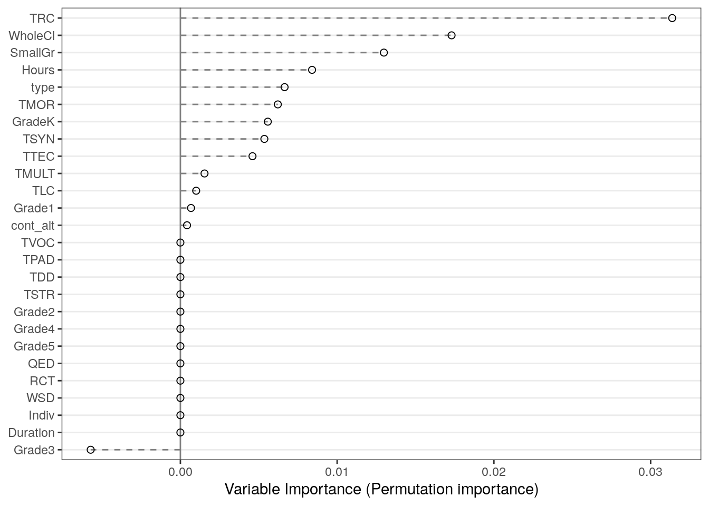

Metaanalysis Script
================
Saurabh Khanna
2020-04-21

  - [Reading in data](#reading-in-data)
  - [Calculate effect sizes](#calculate-effect-sizes)
      - [Post only](#post-only)
      - [Pre and Post](#pre-and-post)
      - [Combining pre and prepost](#combining-pre-and-prepost)
      - [Summary stats](#summary-stats)
  - [Synthesizing effect sizes](#synthesizing-effect-sizes)
      - [Vocabulary](#vocabulary)
      - [Listening Comprehension](#listening-comprehension)
      - [Reading Comprehension](#reading-comprehension)
      - [Morphology](#morphology)
      - [Syntax](#syntax)
      - [AS Studies](#as-studies)
  - [Moderator effects](#moderator-effects)
      - [Vocabulary](#vocabulary-1)
      - [Listening Comprehension](#listening-comprehension-1)
      - [Reading Comprehension](#reading-comprehension-1)
  - [Metaforest](#metaforest)

``` r
# Libraries
library(tidyverse)
```

    ## ── Attaching packages ──────────────────────────────────────────────────────────────────────────────────────────────────────────── tidyverse 1.3.0 ──

    ## ✓ ggplot2 3.3.0     ✓ purrr   0.3.4
    ## ✓ tibble  3.0.0     ✓ dplyr   0.8.5
    ## ✓ tidyr   1.0.2     ✓ stringr 1.4.0
    ## ✓ readr   1.3.1     ✓ forcats 0.5.0

    ## ── Conflicts ─────────────────────────────────────────────────────────────────────────────────────────────────────────────── tidyverse_conflicts() ──
    ## x dplyr::filter() masks stats::filter()
    ## x dplyr::lag()    masks stats::lag()

``` r
library(readxl)
library(metafor)
```

    ## Loading required package: Matrix

    ## 
    ## Attaching package: 'Matrix'

    ## The following objects are masked from 'package:tidyr':
    ## 
    ##     expand, pack, unpack

    ## Loading 'metafor' package (version 2.4-0). For an overview 
    ## and introduction to the package please type: help(metafor).

``` r
#library(robumeta)
library(MAd)
library(metaforest)
```

    ## Loading required package: ranger

    ## Loading required package: data.table

    ## 
    ## Attaching package: 'data.table'

    ## The following objects are masked from 'package:dplyr':
    ## 
    ##     between, first, last

    ## The following object is masked from 'package:purrr':
    ## 
    ##     transpose

``` r
# Parameters
data_file <- here::here("data/L&L Data Set Means SDs.xlsx")
```

## Reading in data

``` r
# join checks
read_xlsx(data_file, sheet = "VR") %>% 
  select(AUTYR) %>% 
  drop_na(AUTYR) %>% 
  anti_join(
    read_xlsx(data_file, sheet = "StudyChar") %>% 
      select(AUTYR) %>% 
      drop_na(AUTYR),
    by = "AUTYR"
  )
```

    ## # A tibble: 0 x 1
    ## # … with 1 variable: AUTYR <chr>

``` r
read_xlsx(data_file, sheet = "VS") %>% 
  select(AUTYR) %>% 
  drop_na(AUTYR) %>% 
  anti_join(
    read_xlsx(data_file, sheet = "StudyChar") %>% 
      select(AUTYR) %>% 
      drop_na(AUTYR),
    by = "AUTYR"
  )
```

    ## # A tibble: 0 x 1
    ## # … with 1 variable: AUTYR <chr>

``` r
read_xlsx(data_file, sheet = "LR") %>% 
  select(AUTYR) %>% 
  drop_na(AUTYR) %>% 
  anti_join(
    read_xlsx(data_file, sheet = "StudyChar") %>% 
      select(AUTYR) %>% 
      drop_na(AUTYR),
    by = "AUTYR"
  )
```

    ## # A tibble: 0 x 1
    ## # … with 1 variable: AUTYR <chr>

``` r
read_xlsx(data_file, sheet = "LS") %>% 
  select(AUTYR) %>% 
  drop_na(AUTYR) %>% 
  anti_join(
    read_xlsx(data_file, sheet = "StudyChar") %>% 
      select(AUTYR) %>% 
      drop_na(AUTYR),
    by = "AUTYR"
  )
```

    ## # A tibble: 0 x 1
    ## # … with 1 variable: AUTYR <chr>

``` r
read_xlsx(data_file, sheet = "RR") %>% 
  select(AUTYR) %>% 
  drop_na(AUTYR) %>% 
  anti_join(
    read_xlsx(data_file, sheet = "StudyChar") %>% 
      select(AUTYR) %>% 
      drop_na(AUTYR),
    by = "AUTYR"
  )
```

    ## # A tibble: 0 x 1
    ## # … with 1 variable: AUTYR <chr>

``` r
read_xlsx(data_file, sheet = "RS") %>% 
  select(AUTYR) %>% 
  drop_na(AUTYR) %>% 
  anti_join(
    read_xlsx(data_file, sheet = "StudyChar") %>% 
      select(AUTYR) %>% 
      drop_na(AUTYR),
    by = "AUTYR"
  )
```

    ## # A tibble: 0 x 1
    ## # … with 1 variable: AUTYR <chr>

All good\!

## Calculate effect sizes

### Post only

``` r
df_post <-
  bind_rows(
    "VR" = read_xlsx(data_file, sheet = "VR") %>% rename_at(vars(-AUTYR), ~ str_replace(., "VR", "")),
    "VS" = read_xlsx(data_file, sheet = "VS") %>% rename_at(vars(-AUTYR), ~ str_replace(., "VS", "")),
    "RR" = read_xlsx(data_file, sheet = "RR") %>% rename_at(vars(-AUTYR), ~ str_replace(., "RR", "")),
    "RS" = read_xlsx(data_file, sheet = "RS") %>% rename_at(vars(-AUTYR), ~ str_replace(., "RS", "")),
    "LR" = read_xlsx(data_file, sheet = "LR") %>% rename_at(vars(-AUTYR), ~ str_replace(., "LR", "")),
    "LS" = read_xlsx(data_file, sheet = "LS") %>% rename_at(vars(-AUTYR), ~ str_replace(., "LS", "")),
    "MR" = read_xlsx(data_file, sheet = "MR") %>% rename_at(vars(-AUTYR), ~ str_replace(., "MR", "")),
    "MS" = read_xlsx(data_file, sheet = "MS") %>% rename_at(vars(-AUTYR), ~ str_replace(., "MS", "")),
    "SR" = read_xlsx(data_file, sheet = "SR") %>% rename_at(vars(-AUTYR), ~ str_replace(., "SR", "")),
    "SS" = read_xlsx(data_file, sheet = "SS") %>% rename_at(vars(-AUTYR), ~ str_replace(., "SS", "")),
    "AS" = read_xlsx(data_file, sheet = "AS") %>% rename_at(vars(-AUTYR), ~ str_replace(., "AS", "")),
    .id = "type"
  ) %>% 
  drop_na(AUTYR) %>%
  filter(is.na(TM1pre)) %>% 
  select_if(~ any(!is.na(.))) %>%
  select(AUTYR, type, sort(current_vars()))


for (mt in 1:4) {
  for (mc in 1:4) {
    if (
      !(str_glue("TM{mt}post") %in% colnames(df_post)) | 
      !(str_glue("CM{mc}post") %in% colnames(df_post))
    ) {
      next
    }
    df_post <-
      escalc(
        data = df_post,
        measure = "SMD",
        m1i = df_post[, str_c("TM", mt, "post")] %>% unlist(),
        m2i = df_post[, str_c("CM", mc, "post")] %>% unlist(),
        sd1i = df_post[, str_c("TS", mt, "post")] %>% unlist(),
        sd2i = df_post[, str_c("CS", mc, "post")] %>% unlist(),
        n1i = df_post[, str_c("TN", mt, "post")] %>% unlist(),
        n2i = df_post[, str_c("CN", mc, "post")] %>% unlist(),
        var.names = c(str_glue("ES_TM{mt}_CM{mc}"), str_glue("EV_TM{mt}_CM{mc}"))
      ) 
  }
}


df_post <-
  df_post %>% 
  transmute(
    AUTYR, 
    type,
    ES =
      pmap_dbl(
        select(., starts_with("ES_")),
        ~ mean(c(...), na.rm = TRUE)
      ),
    EV =
      pmap_dbl(
        select(., starts_with("EV_")),
        ~ mean(c(...), na.rm = TRUE)
      )
  )
```

### Pre and Post

``` r
df_prepost <-
  bind_rows(
    "VR" = read_xlsx(data_file, sheet = "VR") %>% rename_at(vars(-AUTYR), ~ str_replace(., "VR", "")),
    "VS" = read_xlsx(data_file, sheet = "VS") %>% rename_at(vars(-AUTYR), ~ str_replace(., "VS", "")),
    "RR" = read_xlsx(data_file, sheet = "RR") %>% rename_at(vars(-AUTYR), ~ str_replace(., "RR", "")),
    "RS" = read_xlsx(data_file, sheet = "RS") %>% rename_at(vars(-AUTYR), ~ str_replace(., "RS", "")),
    "LR" = read_xlsx(data_file, sheet = "LR") %>% rename_at(vars(-AUTYR), ~ str_replace(., "LR", "")),
    "LS" = read_xlsx(data_file, sheet = "LS") %>% rename_at(vars(-AUTYR), ~ str_replace(., "LS", "")),
    "MR" = read_xlsx(data_file, sheet = "MR") %>% rename_at(vars(-AUTYR), ~ str_replace(., "MR", "")),
    "MS" = read_xlsx(data_file, sheet = "MS") %>% rename_at(vars(-AUTYR), ~ str_replace(., "MS", "")),
    "SR" = read_xlsx(data_file, sheet = "SR") %>% rename_at(vars(-AUTYR), ~ str_replace(., "SR", "")),
    "SS" = read_xlsx(data_file, sheet = "SS") %>% rename_at(vars(-AUTYR), ~ str_replace(., "SS", "")),
    "AS" = read_xlsx(data_file, sheet = "AS") %>% rename_at(vars(-AUTYR), ~ str_replace(., "AS", "")),
    .id = "type"
  ) %>% 
  drop_na(AUTYR) %>%
  filter(!is.na(TM1pre)) %>% 
  select_if(~ any(!is.na(.))) %>%
  select(AUTYR, type, sort(current_vars())) %>% 
  mutate(
    TN1post = if_else(is.na(TN1post) & !is.na(TN1pre), TN1pre, TN1post),
    TN2post = if_else(is.na(TN2post) & !is.na(TN2pre), TN2pre, TN2post),
    CN1post = if_else(is.na(CN1post) & !is.na(CN1pre), CN1pre, CN1post),
    CN2post = if_else(is.na(CN2post) & !is.na(CN2pre), CN2pre, CN2post)
  )


# treatment (post-pre)
for (mt in 1:4) {
  if (
    !(str_glue("TM{mt}post") %in% colnames(df_prepost)) | 
    !(str_glue("TM{mt}pre") %in% colnames(df_prepost))
  ) {
    next
  }
  df_prepost <-
    escalc(
      data = df_prepost,
      measure = "SMCR",
      m1i = df_prepost[, str_c("TM", mt, "post")] %>% unlist(),
      m2i = df_prepost[, str_c("TM", mt, "pre")] %>% unlist(),
      sd1i = df_prepost[, str_c("TS", mt, "pre")] %>% unlist(),
      ni = df_prepost[, str_c("TN", mt, "post")] %>% unlist(),
      ri = rep(0.5, 95),
      var.names = c(str_glue("TES_TM{mt}"), str_glue("TEV_TM{mt}"))
    ) 
}

# control (post-pre)
for (mc in 1:4) {
  if (
    !(str_glue("CM{mc}post") %in% colnames(df_prepost)) | 
    !(str_glue("CM{mc}pre") %in% colnames(df_prepost))
  ) {
    next
  }
  df_prepost <-
    escalc(
      data = df_prepost,
      measure = "SMCR",
      m1i = df_prepost[, str_c("CM", mc, "post")] %>% unlist(),
      m2i = df_prepost[, str_c("CM", mc, "pre")] %>% unlist(),
      sd1i = df_prepost[, str_c("CS", mc, "pre")] %>% unlist(),
      ni = df_prepost[, str_c("CN", mc, "post")] %>% unlist(),
      ri = rep(0.5, 95),
      var.names = c(str_glue("CES_CM{mc}"), str_glue("CEV_CM{mc}"))
    ) 
}


# ES and EV taken together
for (m in 1:4) {
  if (
    !(str_glue("TES_TM{m}") %in% colnames(df_prepost)) | 
    !(str_glue("TEV_TM{m}") %in% colnames(df_prepost)) |
    !(str_glue("CES_CM{m}") %in% colnames(df_prepost)) | 
    !(str_glue("CEV_CM{m}") %in% colnames(df_prepost))
  ) {
    next
  }
  # subtracting effect size
  df_prepost[, str_c("ES_TM", m, "_CM", m)] <- 
    (df_prepost[, str_c("TES_TM", m)] %>% unlist()) -
    (df_prepost[, str_c("CES_CM", m)] %>% unlist())
  # adding variance
  df_prepost[, str_c("EV_TM", m, "_CM", m)] <- 
    (df_prepost[, str_c("TEV_TM", m)] %>% unlist()) +
    (df_prepost[, str_c("CEV_CM", m)] %>% unlist())
}


df_prepost <- 
  df_prepost %>% 
  transmute(
    AUTYR, 
    type,
    ES =
      pmap_dbl(
        select(., starts_with("ES_")),
        ~ mean(c(...), na.rm = TRUE)
      ),
    EV =
      pmap_dbl(
        select(., starts_with("EV_")),
        ~ mean(c(...), na.rm = TRUE)
      )
  )
```

### Combining pre and prepost

``` r
df_es_direct <-
  tribble(
    ~AUTYR,        ~type, ~ES, ~EV,
    
    # "Apthorp12_K", "VR",  0.98, 0,
    # "Apthorp12_1", "VR",  1.00, 0,
    # "Apthorp12_3", "VR",  0.95, 0,
    # "Apthorp12_4", "VR",  1.24, 0,
    
    # "Apthorp12_P", "VS",  0.06, 0,
    # "Apthorp12_I", "VS", -0.14, 0,
    "Gersten10",   "VS",  0.33, 0.05,
    "Jayanthi18",  "VS", -0.043, 0.001,

    # "Apthorp12_K", "LR",  0.24, 0,
    # "Apthorp12_1", "LR",  0.21, 0,
    # 
    # "Apthorp12_P", "LS",  0.05, 0,
    # 
    # "Apthorp12_3", "RR",  0.09, 0,
    # "Apthorp12_4", "RR",  0.44, 0,
    # 
    # "Apthorp12_I", "RS", -0.11, 0,
    "Gersten10",   "RS",  0.13, 0.04
  )


df_append <- 
  bind_rows(df_post, df_prepost, df_es_direct) %>% 
  left_join(
    read_xlsx(data_file, sheet = "StudyChar") %>% 
      drop_na(AUTYR),
    by = "AUTYR"
  ) %>%
  left_join(
    read_xlsx(data_file, sheet = "Notes") %>% select(AUTYR, Citation),
    by = "AUTYR"
  ) %>% 
  mutate(
    Hours = Hours %>% parse_number(),
    CONT = recode(CONT, "BAU" = "0", "ALT" = "1") %>% as.integer()
  ) %>%
  rename(cont_alt = CONT, citation = Citation) %>% 
  arrange(type, stdid) %>%
  select(type, stdid, citation, AUTYR, everything()) %>% 
  filter(!str_detect(stdid, "^Apth"))
```

    ## New names:
    ## * Notes -> Notes...3
    ## * Notes -> Notes...4
    ## * `` -> ...5
    ## * `` -> ...6
    ## * `` -> ...7
    ## * ...

``` r
cor_es <-
  df_append %>%
  unite("type_stdid", c("type", "stdid")) %>% 
  agg(id = type_stdid, es = ES, var = EV, method = "BHHR", data = .) %>% 
  separate(id, c("type", "stdid")) %>% 
  rename(ES = es, EV = var)

df_clean <-
  df_append %>%
  group_by(type, stdid) %>% 
  summarize_at(vars(TMULT:Hours), ~ round(mean(.))) %>%
  ungroup() %>%
  left_join(cor_es, by = c("type", "stdid")) %>% 
  select(type, stdid, ES, EV, everything())

rm(df_post, df_prepost, df_es_direct, df_append, cor_es)
#df_clean %>% knitr::kable()
```

### Summary stats

``` r
df_clean %>% count(stdid)
```

    ## # A tibble: 56 x 2
    ##    stdid     n
    ##    <chr> <int>
    ##  1 Apel1     2
    ##  2 Apel2     2
    ##  3 ApelK     1
    ##  4 Arth1     1
    ##  5 Arth2     1
    ##  6 Arth3     1
    ##  7 ArthK     1
    ##  8 Aug       1
    ##  9 Baker     3
    ## 10 Berry     2
    ## # … with 46 more rows

``` r
#df_clean %>% writexl::write_xlsx("df_clean.xlsx")
df_clean %>% count(type, stdid)
```

    ## # A tibble: 114 x 3
    ##    type  stdid       n
    ##    <chr> <chr>   <int>
    ##  1 AS    Jones1      1
    ##  2 AS    Jones2      1
    ##  3 AS    Proc19      1
    ##  4 LR    Baker       1
    ##  5 LR    Conn183     1
    ##  6 LR    Conn184     1
    ##  7 LR    Coyne10     1
    ##  8 LR    Coyne19     1
    ##  9 LR    Jiang1      1
    ## 10 LR    Jiang2      1
    ## # … with 104 more rows

``` r
df_v <- df_clean %>% filter(type %in% c("VR", "VS"))
df_l <- df_clean %>% filter(type %in% c("LR", "LS"))
df_r <- df_clean %>% filter(type %in% c("RR", "RS"))
df_m <- df_clean %>% filter(type %in% c("MR", "MS"))
df_s <- df_clean %>% filter(type %in% c("SR", "SS"))
df_a <- df_clean %>% filter(type == "AS")
```

## Synthesizing effect sizes

### Vocabulary

``` r
model_1 <-
  df_v %>%
  arrange(desc(type), desc(ES)) %>% 
  rma(
    yi = ES, 
    vi = EV, 
    data = ., 
    method = "REML",
    slab = stdid
  )

model_2 <-
  df_v %>%
  rma(
    yi = ES, 
    vi = EV, 
    data = ., 
    method = "REML",
    subset = (type == "VR"),
    slab = stdid
  )

model_3 <-
  df_v %>%
  rma(
    yi = ES, 
    vi = EV, 
    data = ., 
    method = "REML",
    subset = (type == "VS"),
    slab = stdid
  )

model_1
```

    ## 
    ## Random-Effects Model (k = 66; tau^2 estimator: REML)
    ## 
    ## tau^2 (estimated amount of total heterogeneity): 2.4970 (SE = 0.4547)
    ## tau (square root of estimated tau^2 value):      1.5802
    ## I^2 (total heterogeneity / total variability):   99.36%
    ## H^2 (total variability / sampling variability):  155.90
    ## 
    ## Test for Heterogeneity:
    ## Q(df = 65) = 2283.9471, p-val < .0001
    ## 
    ## Model Results:
    ## 
    ## estimate      se    zval    pval   ci.lb   ci.ub 
    ##   1.0599  0.1984  5.3413  <.0001  0.6710  1.4489  *** 
    ## 
    ## ---
    ## Signif. codes:  0 '***' 0.001 '**' 0.01 '*' 0.05 '.' 0.1 ' ' 1

``` r
model_2
```

    ## 
    ## Random-Effects Model (k = 42; tau^2 estimator: REML)
    ## 
    ## tau^2 (estimated amount of total heterogeneity): 3.2308 (SE = 0.7421)
    ## tau (square root of estimated tau^2 value):      1.7974
    ## I^2 (total heterogeneity / total variability):   99.30%
    ## H^2 (total variability / sampling variability):  143.67
    ## 
    ## Test for Heterogeneity:
    ## Q(df = 41) = 1764.6384, p-val < .0001
    ## 
    ## Model Results:
    ## 
    ## estimate      se    zval    pval   ci.lb   ci.ub 
    ##   1.6238  0.2832  5.7328  <.0001  1.0686  2.1789  *** 
    ## 
    ## ---
    ## Signif. codes:  0 '***' 0.001 '**' 0.01 '*' 0.05 '.' 0.1 ' ' 1

``` r
model_3
```

    ## 
    ## Random-Effects Model (k = 24; tau^2 estimator: REML)
    ## 
    ## tau^2 (estimated amount of total heterogeneity): 0.0026 (SE = 0.0039)
    ## tau (square root of estimated tau^2 value):      0.0510
    ## I^2 (total heterogeneity / total variability):   17.28%
    ## H^2 (total variability / sampling variability):  1.21
    ## 
    ## Test for Heterogeneity:
    ## Q(df = 23) = 31.8420, p-val = 0.1035
    ## 
    ## Model Results:
    ## 
    ## estimate      se    zval    pval    ci.lb   ci.ub 
    ##   0.0337  0.0278  1.2121  0.2255  -0.0208  0.0883    
    ## 
    ## ---
    ## Signif. codes:  0 '***' 0.001 '**' 0.01 '*' 0.05 '.' 0.1 ' ' 1

``` r
df_v %>% count(type)
```

    ## # A tibble: 2 x 2
    ##   type      n
    ##   <chr> <int>
    ## 1 VR       42
    ## 2 VS       24

``` r
forest(
  model_1,
  xlab = "Vocabulary",
  addcred = T, 
  header = T,
  ylim = c(-1, 80),
  rows = c(3:26, 33:74),
  pch = 21,
  bg = "grey",
  lwd = 1.5
)
op <- par(cex = 0.75, font = 4)
text(-16, c(28, 76), pos = 4, c("Standardized Measure", "Custom Measure"))
addpoly(model_2, row = 31, cex = 1.25, col = "white", lwd = 3)
addpoly(model_3, row = 1, cex = 1.25, col = "white", lwd = 3)
```


### Listening Comprehension

``` r
model_1 <-
  df_l %>%
  arrange(desc(type), desc(ES)) %>%  
  rma(
    yi = ES, 
    vi = EV, 
    data = ., 
    method = "REML",
    slab = stdid
  )

model_2 <-
  df_l %>%
  rma(
    yi = ES, 
    vi = EV, 
    data = ., 
    method = "REML",
    subset = (type == "LR"),
    slab = stdid
  )

model_3 <-
  df_l %>%
  rma(
    yi = ES, 
    vi = EV, 
    data = ., 
    method = "REML",
    subset = (type == "LS"),
    slab = stdid
  )

model_1
```

    ## 
    ## Random-Effects Model (k = 16; tau^2 estimator: REML)
    ## 
    ## tau^2 (estimated amount of total heterogeneity): 0.2546 (SE = 0.1114)
    ## tau (square root of estimated tau^2 value):      0.5046
    ## I^2 (total heterogeneity / total variability):   90.77%
    ## H^2 (total variability / sampling variability):  10.83
    ## 
    ## Test for Heterogeneity:
    ## Q(df = 15) = 107.9416, p-val < .0001
    ## 
    ## Model Results:
    ## 
    ## estimate      se    zval    pval    ci.lb   ci.ub 
    ##   0.1519  0.1386  1.0960  0.2731  -0.1198  0.4236    
    ## 
    ## ---
    ## Signif. codes:  0 '***' 0.001 '**' 0.01 '*' 0.05 '.' 0.1 ' ' 1

``` r
model_2
```

    ## 
    ## Random-Effects Model (k = 10; tau^2 estimator: REML)
    ## 
    ## tau^2 (estimated amount of total heterogeneity): 0.0424 (SE = 0.0333)
    ## tau (square root of estimated tau^2 value):      0.2060
    ## I^2 (total heterogeneity / total variability):   68.17%
    ## H^2 (total variability / sampling variability):  3.14
    ## 
    ## Test for Heterogeneity:
    ## Q(df = 9) = 26.8296, p-val = 0.0015
    ## 
    ## Model Results:
    ## 
    ## estimate      se    zval    pval   ci.lb   ci.ub 
    ##   0.2987  0.0852  3.5059  0.0005  0.1317  0.4656  *** 
    ## 
    ## ---
    ## Signif. codes:  0 '***' 0.001 '**' 0.01 '*' 0.05 '.' 0.1 ' ' 1

``` r
model_3
```

    ## 
    ## Random-Effects Model (k = 6; tau^2 estimator: REML)
    ## 
    ## tau^2 (estimated amount of total heterogeneity): 0.5617 (SE = 0.4132)
    ## tau (square root of estimated tau^2 value):      0.7494
    ## I^2 (total heterogeneity / total variability):   89.07%
    ## H^2 (total variability / sampling variability):  9.15
    ## 
    ## Test for Heterogeneity:
    ## Q(df = 5) = 51.6442, p-val < .0001
    ## 
    ## Model Results:
    ## 
    ## estimate      se     zval    pval    ci.lb   ci.ub 
    ##  -0.1614  0.3302  -0.4889  0.6249  -0.8087  0.4858    
    ## 
    ## ---
    ## Signif. codes:  0 '***' 0.001 '**' 0.01 '*' 0.05 '.' 0.1 ' ' 1

``` r
df_l %>% count(type)
```

    ## # A tibble: 2 x 2
    ##   type      n
    ##   <chr> <int>
    ## 1 LR       10
    ## 2 LS        6

``` r
forest(
  model_1,
  xlab = "Listening Comprehension",
  addcred = T, 
  header = T,
  ylim = c(-1, 30),
  rows = c(3:8, 15:24),
  pch = 21,
  bg = "grey",
  lwd = 1.5
)
op <- par(cex = 0.75, font = 4)
text(-6.3, c(10, 26), pos = 4, c("Standardized Measure", "Custom Measure"))
addpoly(model_2, row = 12, cex = 1.25, col = "white", lwd = 3)
addpoly(model_3, row = 1, cex = 1.25, col = "white", lwd = 3)
```


### Reading Comprehension

``` r
model_1 <-
  df_r %>%
  arrange(desc(type), desc(ES)) %>%  
  rma(
    yi = ES, 
    vi = EV, 
    data = ., 
    method = "REML",
    slab = stdid
  )

model_2 <-
  df_r %>%
  rma(
    yi = ES, 
    vi = EV, 
    data = ., 
    method = "REML",
    subset = (type == "RR"),
    slab = stdid
  )

model_3 <-
  df_r %>%
  rma(
    yi = ES, 
    vi = EV, 
    data = ., 
    method = "REML",
    subset = (type == "RS"),
    slab = stdid
  )

model_1
```

    ## 
    ## Random-Effects Model (k = 23; tau^2 estimator: REML)
    ## 
    ## tau^2 (estimated amount of total heterogeneity): 0.1247 (SE = 0.0472)
    ## tau (square root of estimated tau^2 value):      0.3531
    ## I^2 (total heterogeneity / total variability):   92.60%
    ## H^2 (total variability / sampling variability):  13.51
    ## 
    ## Test for Heterogeneity:
    ## Q(df = 22) = 106.6186, p-val < .0001
    ## 
    ## Model Results:
    ## 
    ## estimate      se    zval    pval   ci.lb   ci.ub 
    ##   0.2031  0.0839  2.4203  0.0155  0.0386  0.3676  * 
    ## 
    ## ---
    ## Signif. codes:  0 '***' 0.001 '**' 0.01 '*' 0.05 '.' 0.1 ' ' 1

``` r
model_2
```

    ## 
    ## Random-Effects Model (k = 5; tau^2 estimator: REML)
    ## 
    ## tau^2 (estimated amount of total heterogeneity): 0.5327 (SE = 0.4501)
    ## tau (square root of estimated tau^2 value):      0.7299
    ## I^2 (total heterogeneity / total variability):   96.31%
    ## H^2 (total variability / sampling variability):  27.14
    ## 
    ## Test for Heterogeneity:
    ## Q(df = 4) = 46.6163, p-val < .0001
    ## 
    ## Model Results:
    ## 
    ## estimate      se    zval    pval    ci.lb   ci.ub 
    ##   0.6633  0.3614  1.8354  0.0664  -0.0450  1.3716  . 
    ## 
    ## ---
    ## Signif. codes:  0 '***' 0.001 '**' 0.01 '*' 0.05 '.' 0.1 ' ' 1

``` r
model_3
```

    ## 
    ## Random-Effects Model (k = 18; tau^2 estimator: REML)
    ## 
    ## tau^2 (estimated amount of total heterogeneity): 0.0115 (SE = 0.0087)
    ## tau (square root of estimated tau^2 value):      0.1071
    ## I^2 (total heterogeneity / total variability):   54.35%
    ## H^2 (total variability / sampling variability):  2.19
    ## 
    ## Test for Heterogeneity:
    ## Q(df = 17) = 39.3585, p-val = 0.0016
    ## 
    ## Model Results:
    ## 
    ## estimate      se    zval    pval    ci.lb   ci.ub 
    ##   0.0756  0.0405  1.8649  0.0622  -0.0039  0.1550  . 
    ## 
    ## ---
    ## Signif. codes:  0 '***' 0.001 '**' 0.01 '*' 0.05 '.' 0.1 ' ' 1

``` r
df_r %>% count(type)
```

    ## # A tibble: 2 x 2
    ##   type      n
    ##   <chr> <int>
    ## 1 RR        5
    ## 2 RS       18

``` r
forest(
  model_1,
  xlab = "Reading Comprehension",
  addcred = T, 
  header = T,
  ylim = c(-1, 37),
  rows = c(3:20, 27:31),
  pch = 21,
  bg = "grey",
  lwd = 1.5
)
op <- par(cex = 0.75, font = 4)
text(-8.7, c(22, 33), pos = 4, c("Standardized Measure", "Custom Measure"))
addpoly(model_2, row = 24, cex = 1.25, col = "white", lwd = 3)
addpoly(model_3, row = 1, cex = 1.25, col = "white", lwd = 3)
```


### Morphology

``` r
df_m %>%
  rma(
    yi = ES, 
    vi = EV, 
    data = ., 
    method = "REML",
    slab = stdid
  )
```

    ## 
    ## Random-Effects Model (k = 4; tau^2 estimator: REML)
    ## 
    ## tau^2 (estimated amount of total heterogeneity): 0.0340 (SE = 0.1776)
    ## tau (square root of estimated tau^2 value):      0.1844
    ## I^2 (total heterogeneity / total variability):   14.06%
    ## H^2 (total variability / sampling variability):  1.16
    ## 
    ## Test for Heterogeneity:
    ## Q(df = 3) = 5.0583, p-val = 0.1676
    ## 
    ## Model Results:
    ## 
    ## estimate      se    zval    pval   ci.lb   ci.ub 
    ##   0.9660  0.2362  4.0892  <.0001  0.5030  1.4290  *** 
    ## 
    ## ---
    ## Signif. codes:  0 '***' 0.001 '**' 0.01 '*' 0.05 '.' 0.1 ' ' 1

``` r
df_m %>%
  rma(
    yi = ES, 
    vi = EV, 
    data = ., 
    method = "REML",
    slab = stdid
  ) %>% 
  forest(
    order = "obs",
    xlab = "Morphology",
    addcred = T, 
    header = T,
    pch = 21,
    bg = "grey",
    lwd = 1.5
  )
```


### Syntax

``` r
df_s %>%
  rma(
    yi = ES, 
    vi = EV, 
    data = ., 
    method = "REML",
    slab = stdid
  )
```

    ## 
    ## Random-Effects Model (k = 2; tau^2 estimator: REML)
    ## 
    ## tau^2 (estimated amount of total heterogeneity): 0 (SE = 0.0292)
    ## tau (square root of estimated tau^2 value):      0
    ## I^2 (total heterogeneity / total variability):   0.00%
    ## H^2 (total variability / sampling variability):  1.00
    ## 
    ## Test for Heterogeneity:
    ## Q(df = 1) = 0.2039, p-val = 0.6516
    ## 
    ## Model Results:
    ## 
    ## estimate      se    zval    pval    ci.lb   ci.ub 
    ##   0.0314  0.1003  0.3133  0.7540  -0.1651  0.2280    
    ## 
    ## ---
    ## Signif. codes:  0 '***' 0.001 '**' 0.01 '*' 0.05 '.' 0.1 ' ' 1

``` r
df_s %>%
  rma(
    yi = ES, 
    vi = EV, 
    data = ., 
    method = "REML",
    slab = stdid
  ) %>% 
  forest(
    order = "obs",
    xlab = "Syntax",
    addcred = T, 
    header = T,
    pch = 21,
    bg = "grey",
    lwd = 1.5
  )
```


### AS Studies

``` r
df_a %>%
  rma(
    yi = ES, 
    vi = EV, 
    data = ., 
    method = "REML",
    slab = stdid
  )
```

    ## 
    ## Random-Effects Model (k = 3; tau^2 estimator: REML)
    ## 
    ## tau^2 (estimated amount of total heterogeneity): 0.0147 (SE = 0.0202)
    ## tau (square root of estimated tau^2 value):      0.1213
    ## I^2 (total heterogeneity / total variability):   79.61%
    ## H^2 (total variability / sampling variability):  4.90
    ## 
    ## Test for Heterogeneity:
    ## Q(df = 2) = 11.5331, p-val = 0.0031
    ## 
    ## Model Results:
    ## 
    ## estimate      se    zval    pval   ci.lb   ci.ub 
    ##   0.2010  0.0817  2.4596  0.0139  0.0408  0.3612  * 
    ## 
    ## ---
    ## Signif. codes:  0 '***' 0.001 '**' 0.01 '*' 0.05 '.' 0.1 ' ' 1

``` r
df_a %>%
  rma(
    yi = ES, 
    vi = EV, 
    data = ., 
    method = "REML",
    slab = stdid
  ) %>% 
  forest(
    order = "obs",
    xlab = "Academic Learning",
    addcred = T, 
    header = T,
    pch = 21,
    bg = "grey",
    lwd = 1.5
  )
```


## Moderator effects

### Vocabulary

Checking variable correlations:

``` r
p.mat <- ggcorrplot::cor_pmat(df_v %>% select(TMULT:Hours))
df_v %>% 
  select(TMULT:Hours) %>% 
  cor(use = "pairwise.complete.obs") %>% 
  ggcorrplot::ggcorrplot(type = "lower", p.mat = p.mat, insig = "blank")
```


Meta-regressions:

``` r
df_v %>%
  rma(
    yi = ES, 
    vi = EV, 
    data = ., 
    method = "REML",
    mods = ~ . - stdid - ES - EV - RCT - TSYN
  )
```

    ## 
    ## Mixed-Effects Model (k = 64; tau^2 estimator: REML)
    ## 
    ## tau^2 (estimated amount of residual heterogeneity):     1.9612 (SE = 0.4603)
    ## tau (square root of estimated tau^2 value):             1.4004
    ## I^2 (residual heterogeneity / unaccounted variability): 98.70%
    ## H^2 (unaccounted variability / sampling variability):   77.13
    ## R^2 (amount of heterogeneity accounted for):            23.27%
    ## 
    ## Test for Residual Heterogeneity:
    ## QE(df = 40) = 929.3012, p-val < .0001
    ## 
    ## Test of Moderators (coefficients 2:24):
    ## QM(df = 23) = 41.7022, p-val = 0.0098
    ## 
    ## Model Results:
    ## 
    ##           estimate      se     zval    pval    ci.lb    ci.ub 
    ## intrcpt     3.1392  1.2277   2.5570  0.0106   0.7330   5.5454    * 
    ## typeVS     -1.9059  0.4491  -4.2441  <.0001  -2.7861  -1.0257  *** 
    ## TMULT      -1.6997  0.9738  -1.7454  0.0809  -3.6082   0.2089    . 
    ## TMOR        1.9331  1.2186   1.5864  0.1127  -0.4552   4.3214      
    ## TLC        -0.4579  0.6438  -0.7113  0.4769  -1.7198   0.8039      
    ## TRC         0.7845  0.8566   0.9158  0.3597  -0.8944   2.4634      
    ## TPAD       -1.2922  0.7676  -1.6834  0.0923  -2.7967   0.2123    . 
    ## TDD        -1.5175  0.8775  -1.7293  0.0838  -3.2373   0.2024    . 
    ## TTEC       -0.4389  0.7977  -0.5501  0.5822  -2.0024   1.1247      
    ## TSTR        1.3289  0.8643   1.5376  0.1241  -0.3650   3.0228      
    ## cont_alt   -0.0004  0.6658  -0.0006  0.9996  -1.3053   1.3046      
    ## GradeK     -0.3826  0.6977  -0.5484  0.5834  -1.7499   0.9848      
    ## Grade1     -0.9764  0.6430  -1.5186  0.1289  -2.2366   0.2838      
    ## Grade2     -0.8025  0.9650  -0.8316  0.4056  -2.6939   1.0888      
    ## Grade3     -1.1128  0.8747  -1.2723  0.2033  -2.8272   0.6015      
    ## Grade4     -1.3300  1.1164  -1.1914  0.2335  -3.5180   0.8580      
    ## Grade5     -1.2617  0.8614  -1.4647  0.1430  -2.9500   0.4266      
    ## QED         0.9750  0.8500   1.1470  0.2514  -0.6910   2.6409      
    ## WSD         0.0593  1.1976   0.0495  0.9605  -2.2879   2.4065      
    ## WholeCl    -0.8935  0.8846  -1.0100  0.3125  -2.6272   0.8403      
    ## SmallGr    -0.7262  0.8007  -0.9069  0.3644  -2.2955   0.8432      
    ## Indiv      -0.8313  1.3426  -0.6191  0.5358  -3.4628   1.8003      
    ## Duration   -0.1252  0.9023  -0.1388  0.8896  -1.8936   1.6432      
    ## Hours       0.0373  0.0172   2.1601  0.0308   0.0035   0.0711    * 
    ## 
    ## ---
    ## Signif. codes:  0 '***' 0.001 '**' 0.01 '*' 0.05 '.' 0.1 ' ' 1

### Listening Comprehension

Checking variable correlations:

``` r
p.mat <- ggcorrplot::cor_pmat(df_l %>% select(TMULT:Hours))
df_l %>% 
  select(TMULT:Hours) %>% 
  cor(use = "pairwise.complete.obs") %>% 
  ggcorrplot::ggcorrplot(type = "lower", p.mat = p.mat, insig = "blank")
```


Meta-regressions:

### Reading Comprehension

Checking variable correlations:

``` r
p.mat <- ggcorrplot::cor_pmat(df_r %>% select(TMULT:Hours))
df_r %>% 
  select(TMULT:Hours) %>% 
  cor(use = "pairwise.complete.obs") %>% 
  ggcorrplot::ggcorrplot(type = "lower", p.mat = p.mat, insig = "blank")
```


Meta-regressions:

## Metaforest

``` r
df_v %>% 
  rename(vi = EV) %>%
  mutate(stdid = stdid %>% as_factor()) %>% 
  drop_na(Hours) %>% 
  MetaForest(
    formula = ES ~ .,
    data = .,
    study = "stdid"
  ) %>%
  VarImpPlot()
```


``` r
df_l %>% 
  rename(vi = EV) %>%
  mutate(stdid = stdid %>% as_factor()) %>% 
  drop_na(Hours) %>% 
  MetaForest(
    formula = ES ~ .,
    data = .,
    study = "stdid"
  ) %>%
  VarImpPlot()
```



``` r
df_r %>% 
  rename(vi = EV) %>%
  mutate(stdid = stdid %>% as_factor()) %>% 
  drop_na(Hours) %>% 
  MetaForest(
    formula = ES ~ .,
    data = .,
    study = "stdid"
  ) %>%
  VarImpPlot()
```


