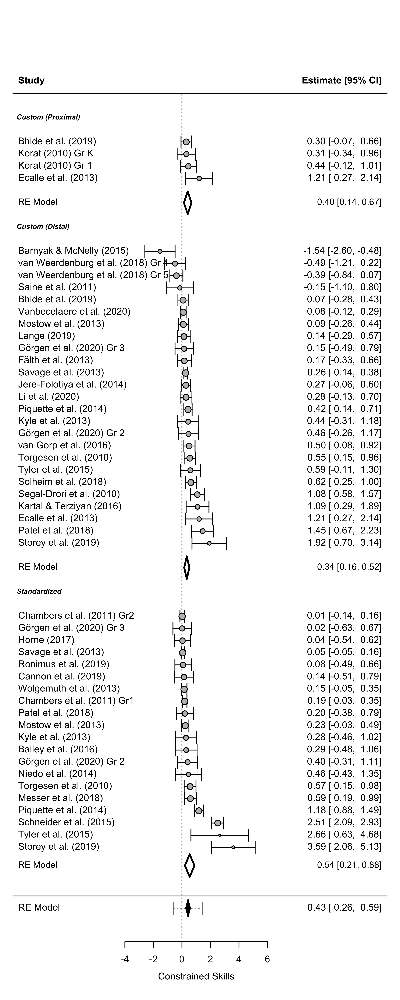

Meta-analysis Script
================
Saurabh Khanna
2020-06-04

  - [Reading in data](#reading-in-data)
  - [Calculate effect sizes](#calculate-effect-sizes)
      - [Post only](#post-only)
      - [Pre and Post](#pre-and-post)
      - [Directly entered ES](#directly-entered-es)
      - [Combining all](#combining-all)
      - [Summary stats](#summary-stats)
  - [Synthesizing effect sizes](#synthesizing-effect-sizes)
      - [Vocabulary](#vocabulary)
      - [Listening Comprehension](#listening-comprehension)
      - [Reading Comprehension](#reading-comprehension)
      - [Morphology](#morphology)
      - [Syntax](#syntax)
      - [Academic Learning](#academic-learning)
  - [Delayed Tests Analysis](#delayed-tests-analysis)
      - [Calculate ES](#calculate-es)
      - [Combining ES](#combining-es)
      - [Forest plots - Vocabulary](#forest-plots---vocabulary)
      - [Forest plots - Reading
        Comprehension](#forest-plots---reading-comprehension)
  - [Moderator Analysis](#moderator-analysis)
      - [Vocabulary - overall](#vocabulary---overall)
      - [Vocabulary - overall (Controlling for
        type)](#vocabulary---overall-controlling-for-type)
      - [Vocabulary - VR](#vocabulary---vr)
      - [Vocabulary - VS](#vocabulary---vs)
      - [Listening Comprehension -
        overall](#listening-comprehension---overall)
      - [Listening Comprehension - overall (Controlling for
        type)](#listening-comprehension---overall-controlling-for-type)
      - [Listening Comprehension - LR](#listening-comprehension---lr)
      - [Listening Comprehension - LS](#listening-comprehension---ls)
      - [Reading Comprehension -
        overall](#reading-comprehension---overall)
      - [Reading Comprehension - overall (Controlling for
        type)](#reading-comprehension---overall-controlling-for-type)
      - [Reading Comprehension - RR](#reading-comprehension---rr)
      - [Reading Comprehension - RS](#reading-comprehension---rs)
  - [Publication Bias](#publication-bias)
      - [Funnel plots](#funnel-plots)
      - [Egger’s Test](#eggers-test)
      - [P Curves](#p-curves)
  - [MetaForest plots](#metaforest-plots)
      - [Vocabulary](#vocabulary-1)
      - [Listening Comprehension](#listening-comprehension-1)
      - [Reading Comprehension](#reading-comprehension-1)

``` r
# Libraries
library(tidyverse)
library(readxl)
library(metafor)
library(MAd)
library(metaforest)
library(dmetar)

# Parameters
data_file <- "data/L&L Data Set Means SDs.xlsx"
```

## Reading in data

``` r
# join checks
read_xlsx(data_file, sheet = "VR") %>% 
  select(AUTYR) %>% 
  drop_na(AUTYR) %>% 
  anti_join(
    read_xlsx(data_file, sheet = "StudyChar") %>% 
      select(AUTYR) %>% 
      drop_na(AUTYR),
    by = "AUTYR"
  )
```

    ## # A tibble: 1 x 1
    ##   AUTYR     
    ##   <chr>     
    ## 1 Nelson11FU

``` r
read_xlsx(data_file, sheet = "VS") %>% 
  select(AUTYR) %>% 
  drop_na(AUTYR) %>% 
  anti_join(
    read_xlsx(data_file, sheet = "StudyChar") %>% 
      select(AUTYR) %>% 
      drop_na(AUTYR),
    by = "AUTYR"
  )
```

    ## # A tibble: 1 x 1
    ##   AUTYR     
    ##   <chr>     
    ## 1 Nelson11FU

``` r
read_xlsx(data_file, sheet = "LR") %>% 
  select(AUTYR) %>% 
  drop_na(AUTYR) %>% 
  anti_join(
    read_xlsx(data_file, sheet = "StudyChar") %>% 
      select(AUTYR) %>% 
      drop_na(AUTYR),
    by = "AUTYR"
  )
```

    ## # A tibble: 0 x 1
    ## # ... with 1 variable: AUTYR <chr>

``` r
read_xlsx(data_file, sheet = "LS") %>% 
  select(AUTYR) %>% 
  drop_na(AUTYR) %>% 
  anti_join(
    read_xlsx(data_file, sheet = "StudyChar") %>% 
      select(AUTYR) %>% 
      drop_na(AUTYR),
    by = "AUTYR"
  )
```

    ## # A tibble: 0 x 1
    ## # ... with 1 variable: AUTYR <chr>

``` r
read_xlsx(data_file, sheet = "RR") %>% 
  select(AUTYR) %>% 
  drop_na(AUTYR) %>% 
  anti_join(
    read_xlsx(data_file, sheet = "StudyChar") %>% 
      select(AUTYR) %>% 
      drop_na(AUTYR),
    by = "AUTYR"
  )
```

    ## # A tibble: 0 x 1
    ## # ... with 1 variable: AUTYR <chr>

``` r
read_xlsx(data_file, sheet = "RS") %>% 
  select(AUTYR) %>% 
  drop_na(AUTYR) %>% 
  anti_join(
    read_xlsx(data_file, sheet = "StudyChar") %>% 
      select(AUTYR) %>% 
      drop_na(AUTYR),
    by = "AUTYR"
  )
```

    ## # A tibble: 0 x 1
    ## # ... with 1 variable: AUTYR <chr>

All good\!

## Calculate effect sizes

### Post only

``` r
df_post <-
  bind_rows(
    "VR" = read_xlsx(data_file, sheet = "VR") %>% rename_at(vars(-AUTYR), ~ str_replace(., "VR", "")),
    "VS" = read_xlsx(data_file, sheet = "VS") %>% rename_at(vars(-AUTYR), ~ str_replace(., "VS", "")),
    "RR" = read_xlsx(data_file, sheet = "RR") %>% rename_at(vars(-AUTYR), ~ str_replace(., "RR", "")),
    "RS" = read_xlsx(data_file, sheet = "RS") %>% rename_at(vars(-AUTYR), ~ str_replace(., "RS", "")),
    "LR" = read_xlsx(data_file, sheet = "LR") %>% rename_at(vars(-AUTYR), ~ str_replace(., "LR", "")),
    "LS" = read_xlsx(data_file, sheet = "LS") %>% rename_at(vars(-AUTYR), ~ str_replace(., "LS", "")),
    "MR" = read_xlsx(data_file, sheet = "MR") %>% rename_at(vars(-AUTYR), ~ str_replace(., "MR", "")),
    #"MS" = read_xlsx(data_file, sheet = "MS") %>% rename_at(vars(-AUTYR), ~ str_replace(., "MS", "")),
    #"SR" = read_xlsx(data_file, sheet = "SR") %>% rename_at(vars(-AUTYR), ~ str_replace(., "SR", "")),
    "SS" = read_xlsx(data_file, sheet = "SS") %>% rename_at(vars(-AUTYR), ~ str_replace(., "SS", "")),
    "AS" = read_xlsx(data_file, sheet = "AS") %>% rename_at(vars(-AUTYR), ~ str_replace(., "AS", "")),
    .id = "type"
  ) %>% 
  drop_na(AUTYR) %>%
  filter(is.na(TM1pre)) %>% 
  select_if(~ any(!is.na(.))) %>%
  select(AUTYR, type, sort(current_vars()))


for (m in 1:4) {
  if (
    !(str_glue("TM{m}post") %in% colnames(df_post)) | 
    !(str_glue("CM{m}post") %in% colnames(df_post))
  ) {
    next
  }
  df_post <-
    escalc(
      data = df_post,
      measure = "SMD",
      m1i = df_post[, str_c("TM", m, "post")] %>% unlist(),
      m2i = df_post[, str_c("CM", m, "post")] %>% unlist(),
      sd1i = df_post[, str_c("TS", m, "post")] %>% unlist(),
      sd2i = df_post[, str_c("CS", m, "post")] %>% unlist(),
      n1i = df_post[, str_c("TN", m, "post")] %>% unlist(),
      n2i = df_post[, str_c("CN", m, "post")] %>% unlist(),
      var.names = c(str_glue("ES_{m}"), str_glue("EV_{m}"))
    ) 
}


df_post <-
  df_post %>% 
  select(AUTYR, type, starts_with("ES")) %>% 
  pivot_longer(cols = starts_with("ES"), names_to = "num", values_to = "ES", values_drop_na = T) %>%
  mutate(num = str_sub(num, 4)) %>% 
  left_join(
    df_post %>% 
      select(AUTYR, type, starts_with("EV")) %>% 
      pivot_longer(cols = starts_with("EV"), names_to = "num", values_to = "EV", values_drop_na = T) %>% 
      mutate(num = str_sub(num, 4)),
    by = c("AUTYR", "type", "num")
  ) %>% 
  select(-num)
```

### Pre and Post

``` r
df_prepost <-
  bind_rows(
    "VR" = read_xlsx(data_file, sheet = "VR") %>% rename_at(vars(-AUTYR), ~ str_replace(., "VR", "")),
    "VS" = read_xlsx(data_file, sheet = "VS") %>% rename_at(vars(-AUTYR), ~ str_replace(., "VS", "")),
    "RR" = read_xlsx(data_file, sheet = "RR") %>% rename_at(vars(-AUTYR), ~ str_replace(., "RR", "")),
    "RS" = read_xlsx(data_file, sheet = "RS") %>% rename_at(vars(-AUTYR), ~ str_replace(., "RS", "")),
    "LR" = read_xlsx(data_file, sheet = "LR") %>% rename_at(vars(-AUTYR), ~ str_replace(., "LR", "")),
    "LS" = read_xlsx(data_file, sheet = "LS") %>% rename_at(vars(-AUTYR), ~ str_replace(., "LS", "")),
    "MR" = read_xlsx(data_file, sheet = "MR") %>% rename_at(vars(-AUTYR), ~ str_replace(., "MR", "")),
   # "MS" = read_xlsx(data_file, sheet = "MS") %>% rename_at(vars(-AUTYR), ~ str_replace(., "MS", "")),
   # "SR" = read_xlsx(data_file, sheet = "SR") %>% rename_at(vars(-AUTYR), ~ str_replace(., "SR", "")),
    "SS" = read_xlsx(data_file, sheet = "SS") %>% rename_at(vars(-AUTYR), ~ str_replace(., "SS", "")),
    "AS" = read_xlsx(data_file, sheet = "AS") %>% rename_at(vars(-AUTYR), ~ str_replace(., "AS", "")),
    .id = "type"
  ) %>% 
  drop_na(AUTYR) %>%
  filter(!is.na(TM1pre)) %>% 
  select_if(~ any(!is.na(.))) %>%
  select(AUTYR, type, sort(current_vars())) %>% 
  mutate(
    TN1post = if_else(is.na(TN1post) & !is.na(TN1pre), TN1pre, TN1post),
    TN2post = if_else(is.na(TN2post) & !is.na(TN2pre), TN2pre, TN2post),
    CN1post = if_else(is.na(CN1post) & !is.na(CN1pre), CN1pre, CN1post),
    CN2post = if_else(is.na(CN2post) & !is.na(CN2pre), CN2pre, CN2post)
  )


# treatment (post-pre)
for (mt in 1:4) {
  if (
    !(str_glue("TM{mt}post") %in% colnames(df_prepost)) | 
    !(str_glue("TM{mt}pre") %in% colnames(df_prepost))
  ) {
    next
  }
  df_prepost <-
    escalc(
      data = df_prepost,
      measure = "SMCR",
      m1i = df_prepost[, str_c("TM", mt, "post")] %>% unlist(),
      m2i = df_prepost[, str_c("TM", mt, "pre")] %>% unlist(),
      sd1i = df_prepost[, str_c("TS", mt, "pre")] %>% unlist(),
      ni = df_prepost[, str_c("TN", mt, "post")] %>% unlist(),
      ri = rep(0.5, 85),
      var.names = c(str_glue("TES_TM{mt}"), str_glue("TEV_TM{mt}"))
    ) 
}

# control (post-pre)
for (mc in 1:4) {
  if (
    !(str_glue("CM{mc}post") %in% colnames(df_prepost)) | 
    !(str_glue("CM{mc}pre") %in% colnames(df_prepost))
  ) {
    next
  }
  df_prepost <-
    escalc(
      data = df_prepost,
      measure = "SMCR",
      m1i = df_prepost[, str_c("CM", mc, "post")] %>% unlist(),
      m2i = df_prepost[, str_c("CM", mc, "pre")] %>% unlist(),
      sd1i = df_prepost[, str_c("CS", mc, "pre")] %>% unlist(),
      ni = df_prepost[, str_c("CN", mc, "post")] %>% unlist(),
      ri = rep(0.5, 85),
      var.names = c(str_glue("CES_CM{mc}"), str_glue("CEV_CM{mc}"))
    ) 
}


# ES and EV taken together
for (m in 1:4) {
  if (
    !(str_glue("TES_TM{m}") %in% colnames(df_prepost)) | 
    !(str_glue("TEV_TM{m}") %in% colnames(df_prepost)) |
    !(str_glue("CES_CM{m}") %in% colnames(df_prepost)) | 
    !(str_glue("CEV_CM{m}") %in% colnames(df_prepost))
  ) {
    next
  }
  # subtracting effect size
  df_prepost[, str_c("ES_", m)] <- 
    (df_prepost[, str_c("TES_TM", m)] %>% unlist()) -
    (df_prepost[, str_c("CES_CM", m)] %>% unlist())
  # adding variance
  df_prepost[, str_c("EV_", m)] <- 
    (df_prepost[, str_c("TEV_TM", m)] %>% unlist()) +
    (df_prepost[, str_c("CEV_CM", m)] %>% unlist())
}


df_prepost <-
  df_prepost %>% 
  select(AUTYR, type, starts_with("ES")) %>% 
  pivot_longer(cols = starts_with("ES"), names_to = "num", values_to = "ES", values_drop_na = T) %>%
  mutate(num = str_sub(num, 4)) %>% 
  left_join(
    df_prepost %>% 
      select(AUTYR, type, starts_with("EV")) %>% 
      pivot_longer(cols = starts_with("EV"), names_to = "num", values_to = "EV", values_drop_na = T) %>% 
      mutate(num = str_sub(num, 4)),
    by = c("AUTYR", "type", "num")
  ) %>% 
  select(-num)
```

### Directly entered ES

``` r
df_es_direct <-
  tribble(
    ~AUTYR,        ~type, ~ES, ~EV,
    
    # "Apthorp12_K", "VR",  0.98, 0,
    # "Apthorp12_1", "VR",  1.00, 0,
    # "Apthorp12_3", "VR",  0.95, 0,
    # "Apthorp12_4", "VR",  1.24, 0,
    
    # "Apthorp12_P", "VS",  0.06, 0,
    # "Apthorp12_I", "VS", -0.14, 0,
    "Gersten10",   "VS",  0.33, 0.05,
    "Jayanthi18",  "VS", -0.043, 0.001,

    # "Apthorp12_K", "LR",  0.24, 0,
    # "Apthorp12_1", "LR",  0.21, 0,
    # 
    # "Apthorp12_P", "LS",  0.05, 0,
    # 
    # "Apthorp12_3", "RR",  0.09, 0,
    # "Apthorp12_4", "RR",  0.44, 0,
    # 
    # "Apthorp12_I", "RS", -0.11, 0,
    "Gersten10",   "RS",  0.13, 0.04
  )
```

### Combining all

``` r
df_append <- 
  bind_rows(df_post, df_prepost, df_es_direct) %>% 
  left_join(
    read_xlsx(data_file, sheet = "StudyChar") %>% 
      drop_na(AUTYR),
    by = "AUTYR"
  ) %>%
  mutate(
    LowIncome = recode(LowIncome, "0.0" = "0", "1.0" = "1", .default = NA_character_) %>% as.integer(),
    Hours = Hours %>% parse_number(),
    CONT = recode(CONT, "BAU" = "0", "ALT" = "1") %>% as.integer()
  ) %>%
  arrange(type, stdid) %>%
  select(type, stdid, AUTYR, everything())
  
cor_es <-
  df_append %>%
  unite("type_stdid", c("type", "stdid")) %>% 
  agg(id = type_stdid, es = ES, var = EV, method = "BHHR", data = .) %>% 
  separate(id, c("type", "stdid")) %>% 
  rename(ES = es, EV = var)

df_clean <-
  df_append %>%
  group_by(type, stdid) %>%
  summarize_at(vars(Content:Hours), ~ round(mean(.))) %>%
  ungroup() %>%
  left_join(cor_es, by = c("type", "stdid")) %>% 
  select(type, stdid, ES, EV, everything()) %>% 
  mutate(
    design = case_when(
      RCT == 1 ~ "RCT",
      QED == 1 ~ "QED",
      WSD == 1 ~ "WSD",
      TRUE ~ NA_character_
    ) %>% as_factor(),
    grade = case_when(
      (GradeK + Grade1 + Grade2) > 0 & (Grade3 + Grade4 + Grade5) == 0 ~ "K-2",
      (Grade3 + Grade4 + Grade5) > 0 & (GradeK + Grade1 + Grade2) == 0 ~ "3-5",
      TRUE ~ "Both"
    ) %>% as_factor(),
    grouping = case_when(
      (WholeCl == 1) & (SmallGr == 0) & (Indiv == 0) ~ 1,
      TRUE ~ 0
    ),
    CONT = CONT %>% factor(labels = c("BAU", "ALT")),
    TCOM = if_else(TLC == 1 | TRC == 1, 1, 0)
  ) %>%
  select(-c(RCT, QED, WSD, WholeCl, SmallGr, Indiv), -starts_with("Grade", ignore.case = F)) %>% 
  left_join(
    read_xlsx(data_file, sheet = "citations"),
    by = c("type", "stdid")
  ) %>% 
  mutate(
    type = type %>% as_factor(),
    citation = if_else(str_detect(type, "S$"), str_c(citation, " "), citation)
  )

rm(df_post, df_prepost, df_es_direct, df_append, cor_es)
df_clean %>% summary()
```

    ##       type       stdid                 ES                 EV         
    ##  VR     :44   Length:109         Min.   :-0.47989   Min.   :0.00100  
    ##  VS     :24   Class :character   1st Qu.: 0.07679   1st Qu.:0.01194  
    ##  RS     :17   Mode  :character   Median : 0.29363   Median :0.02428  
    ##  LR     : 6                      Mean   : 0.64582   Mean   :0.05637  
    ##  LS     : 6                      3rd Qu.: 0.84244   3rd Qu.:0.05921  
    ##  MR     : 4                      Max.   : 7.00093   Max.   :0.51430  
    ##  (Other): 8                                                          
    ##     Content             PD            LowIncome            EL        
    ##  Min.   :0.0000   Min.   :0.00000   Min.   :0.0000   Min.   :0.0000  
    ##  1st Qu.:0.0000   1st Qu.:0.00000   1st Qu.:0.0000   1st Qu.:0.0000  
    ##  Median :0.0000   Median :0.00000   Median :1.0000   Median :0.0000  
    ##  Mean   :0.3119   Mean   :0.05505   Mean   :0.6923   Mean   :0.3211  
    ##  3rd Qu.:1.0000   3rd Qu.:0.00000   3rd Qu.:1.0000   3rd Qu.:1.0000  
    ##  Max.   :1.0000   Max.   :1.00000   Max.   :1.0000   Max.   :1.0000  
    ##                                     NA's   :18                       
    ##      TMULT             TVOC            TSYN            TMOR      
    ##  Min.   :0.0000   Min.   :0.000   Min.   :0.000   Min.   :0.000  
    ##  1st Qu.:0.0000   1st Qu.:1.000   1st Qu.:0.000   1st Qu.:0.000  
    ##  Median :0.0000   Median :1.000   Median :0.000   Median :0.000  
    ##  Mean   :0.3578   Mean   :0.945   Mean   :0.211   Mean   :0.367  
    ##  3rd Qu.:1.0000   3rd Qu.:1.000   3rd Qu.:0.000   3rd Qu.:1.000  
    ##  Max.   :1.0000   Max.   :1.000   Max.   :1.000   Max.   :1.000  
    ##                                                                  
    ##       TCOG             TLC              TRC              TPAD       
    ##  Min.   :0.0000   Min.   :0.0000   Min.   :0.0000   Min.   :0.0000  
    ##  1st Qu.:0.0000   1st Qu.:0.0000   1st Qu.:0.0000   1st Qu.:0.0000  
    ##  Median :0.0000   Median :0.0000   Median :0.0000   Median :0.0000  
    ##  Mean   :0.1468   Mean   :0.3853   Mean   :0.2018   Mean   :0.1101  
    ##  3rd Qu.:0.0000   3rd Qu.:1.0000   3rd Qu.:0.0000   3rd Qu.:0.0000  
    ##  Max.   :1.0000   Max.   :1.0000   Max.   :1.0000   Max.   :1.0000  
    ##                                                                     
    ##       TDD             TTEC             TSTR         CONT       Duration     
    ##  Min.   :0.000   Min.   :0.0000   Min.   :0.0000   BAU:82   Min.   :0.0000  
    ##  1st Qu.:0.000   1st Qu.:0.0000   1st Qu.:0.0000   ALT:27   1st Qu.:0.0000  
    ##  Median :0.000   Median :0.0000   Median :0.0000            Median :1.0000  
    ##  Mean   :0.211   Mean   :0.3211   Mean   :0.1376            Mean   :0.6606  
    ##  3rd Qu.:0.000   3rd Qu.:1.0000   3rd Qu.:0.0000            3rd Qu.:1.0000  
    ##  Max.   :1.000   Max.   :1.0000   Max.   :1.0000            Max.   :1.0000  
    ##                                                                             
    ##      Hours        design    grade       grouping           TCOM       
    ##  Min.   :  1.00   RCT:74   3-5 :44   Min.   :0.0000   Min.   :0.0000  
    ##  1st Qu.: 13.00   QED:32   K-2 :63   1st Qu.:0.0000   1st Qu.:0.0000  
    ##  Median : 22.00   WSD: 3   Both: 2   Median :0.0000   Median :0.0000  
    ##  Mean   : 30.31                      Mean   :0.3486   Mean   :0.4404  
    ##  3rd Qu.: 37.25                      3rd Qu.:1.0000   3rd Qu.:1.0000  
    ##  Max.   :100.00                      Max.   :1.0000   Max.   :1.0000  
    ##  NA's   :3                                                            
    ##    citation        
    ##  Length:109        
    ##  Class :character  
    ##  Mode  :character  
    ##                    
    ##                    
    ##                    
    ## 

``` r
#df_clean %>% knitr::kable()
```

### Summary stats

``` r
df_clean %>% count(stdid)
```

    ## # A tibble: 58 x 2
    ##    stdid     n
    ##    <chr> <int>
    ##  1 Apel1     2
    ##  2 Apel2     2
    ##  3 ApelK     1
    ##  4 Apth1     1
    ##  5 Apth3     1
    ##  6 ApthK     1
    ##  7 ApthP     2
    ##  8 Arth1     1
    ##  9 Arth2     1
    ## 10 Arth3     1
    ## # ... with 48 more rows

``` r
#df_clean %>% arrange(type, ES) %>% writexl::write_xlsx("df_clean.xlsx")
#df_clean %>% select(stdid, type) %>% arrange(stdid, type) %>% writexl::write_xlsx("temp.xlsx")
df_clean %>% count(type, stdid)
```

    ## # A tibble: 109 x 3
    ##    type  stdid          n
    ##    <fct> <chr>      <int>
    ##  1 AS    Jones1         1
    ##  2 AS    Jones2         1
    ##  3 AS    Proc19         1
    ##  4 LR    Baker          1
    ##  5 LR    Jiang1         1
    ##  6 LR    Jiang2         1
    ##  7 LR    Jiang3         1
    ##  8 LR    JiangK         1
    ##  9 LR    Silver17bK     1
    ## 10 LS    ApthP          1
    ## # ... with 99 more rows

``` r
df_v <- df_clean %>% filter(type %in% c("VR", "VS"))
df_l <- df_clean %>% filter(type %in% c("LR", "LS"))
df_r <- df_clean %>% filter(type %in% c("RR", "RS"))
df_m <- df_clean %>% filter(type %in% c("MR", "MS"))
df_s <- df_clean %>% filter(type %in% c("SR", "SS"))
df_a <- df_clean %>% filter(type == "AS")
```

## Synthesizing effect sizes

### Vocabulary

``` r
model_1 <-
  df_v %>%
  arrange(desc(type), desc(ES)) %>%
  rma(
    yi = ES, 
    vi = EV, 
    data = ., 
    method = "REML",
    slab = citation
  )

model_2 <-
  df_v %>%
  rma(
    yi = ES, 
    vi = EV, 
    data = ., 
    method = "REML",
    subset = (type == "VR"),
    slab = stdid
  )

model_3 <-
  df_v %>%
  rma(
    yi = ES, 
    vi = EV, 
    data = ., 
    method = "REML",
    subset = (type == "VS"),
    slab = stdid
  )

model_1
```

    ## 
    ## Random-Effects Model (k = 68; tau^2 estimator: REML)
    ## 
    ## tau^2 (estimated amount of total heterogeneity): 1.2617 (SE = 0.2273)
    ## tau (square root of estimated tau^2 value):      1.1233
    ## I^2 (total heterogeneity / total variability):   99.28%
    ## H^2 (total variability / sampling variability):  138.33
    ## 
    ## Test for Heterogeneity:
    ## Q(df = 67) = 2339.9370, p-val < .0001
    ## 
    ## Model Results:
    ## 
    ## estimate      se    zval    pval   ci.lb   ci.ub 
    ##   0.8504  0.1392  6.1083  <.0001  0.5775  1.1233  *** 
    ## 
    ## ---
    ## Signif. codes:  0 '***' 0.001 '**' 0.01 '*' 0.05 '.' 0.1 ' ' 1

``` r
model_2
```

    ## 
    ## Random-Effects Model (k = 44; tau^2 estimator: REML)
    ## 
    ## tau^2 (estimated amount of total heterogeneity): 1.5141 (SE = 0.3407)
    ## tau (square root of estimated tau^2 value):      1.2305
    ## I^2 (total heterogeneity / total variability):   99.33%
    ## H^2 (total variability / sampling variability):  148.48
    ## 
    ## Test for Heterogeneity:
    ## Q(df = 43) = 1578.6988, p-val < .0001
    ## 
    ## Model Results:
    ## 
    ## estimate      se    zval    pval   ci.lb   ci.ub 
    ##   1.2728  0.1896  6.7116  <.0001  0.9011  1.6445  *** 
    ## 
    ## ---
    ## Signif. codes:  0 '***' 0.001 '**' 0.01 '*' 0.05 '.' 0.1 ' ' 1

``` r
model_3
```

    ## 
    ## Random-Effects Model (k = 24; tau^2 estimator: REML)
    ## 
    ## tau^2 (estimated amount of total heterogeneity): 0.0016 (SE = 0.0026)
    ## tau (square root of estimated tau^2 value):      0.0406
    ## I^2 (total heterogeneity / total variability):   15.87%
    ## H^2 (total variability / sampling variability):  1.19
    ## 
    ## Test for Heterogeneity:
    ## Q(df = 23) = 31.8193, p-val = 0.1040
    ## 
    ## Model Results:
    ## 
    ## estimate      se    zval    pval    ci.lb   ci.ub 
    ##   0.0313  0.0228  1.3730  0.1698  -0.0134  0.0759    
    ## 
    ## ---
    ## Signif. codes:  0 '***' 0.001 '**' 0.01 '*' 0.05 '.' 0.1 ' ' 1

``` r
df_v %>% count(type)
```

    ## # A tibble: 2 x 2
    ##   type      n
    ##   <fct> <int>
    ## 1 VR       44
    ## 2 VS       24

``` r
#boxplot(df_v$ES, plot=FALSE)$out
```

``` r
forest(
  model_1,
  xlab = "Vocabulary",
  addcred = T, 
  header = T,
  xlim = c(-15, 18),
  ylim = c(-1, 85),
  rows = c(3:26, 34:77),
  pch = 21,
  bg = "grey",
  lwd = 1.5
)
op <- par(cex = 0.75, font = 4)
text(-15, c(29, 80), pos = 4, c("Standardized Measure", "Custom Measure"))
addpoly(model_2, row = 32, cex = 1.25, col = "white", lwd = 3)
addpoly(model_3, row = 1.5, cex = 1.25, col = "white", lwd = 3)
```


### Listening Comprehension

``` r
model_1 <-
  df_l %>%
  arrange(desc(type), desc(ES)) %>%  
  rma(
    yi = ES, 
    vi = EV, 
    data = ., 
    method = "REML",
    slab = citation
  )

model_2 <-
  df_l %>%
  rma(
    yi = ES, 
    vi = EV, 
    data = ., 
    method = "REML",
    subset = (type == "LR"),
    slab = stdid
  )

model_3 <-
  df_l %>%
  rma(
    yi = ES, 
    vi = EV, 
    data = ., 
    method = "REML",
    subset = (type == "LS"),
    slab = stdid
  )

model_1
```

    ## 
    ## Random-Effects Model (k = 12; tau^2 estimator: REML)
    ## 
    ## tau^2 (estimated amount of total heterogeneity): 0.0040 (SE = 0.0076)
    ## tau (square root of estimated tau^2 value):      0.0633
    ## I^2 (total heterogeneity / total variability):   21.15%
    ## H^2 (total variability / sampling variability):  1.27
    ## 
    ## Test for Heterogeneity:
    ## Q(df = 11) = 12.6457, p-val = 0.3171
    ## 
    ## Model Results:
    ## 
    ## estimate      se    zval    pval   ci.lb   ci.ub 
    ##   0.0968  0.0417  2.3245  0.0201  0.0152  0.1785  * 
    ## 
    ## ---
    ## Signif. codes:  0 '***' 0.001 '**' 0.01 '*' 0.05 '.' 0.1 ' ' 1

``` r
model_2
```

    ## 
    ## Random-Effects Model (k = 6; tau^2 estimator: REML)
    ## 
    ## tau^2 (estimated amount of total heterogeneity): 0.0029 (SE = 0.0172)
    ## tau (square root of estimated tau^2 value):      0.0536
    ## I^2 (total heterogeneity / total variability):   10.50%
    ## H^2 (total variability / sampling variability):  1.12
    ## 
    ## Test for Heterogeneity:
    ## Q(df = 5) = 5.4973, p-val = 0.3582
    ## 
    ## Model Results:
    ## 
    ## estimate      se    zval    pval   ci.lb   ci.ub 
    ##   0.1860  0.0674  2.7571  0.0058  0.0538  0.3181  ** 
    ## 
    ## ---
    ## Signif. codes:  0 '***' 0.001 '**' 0.01 '*' 0.05 '.' 0.1 ' ' 1

``` r
model_3
```

    ## 
    ## Random-Effects Model (k = 6; tau^2 estimator: REML)
    ## 
    ## tau^2 (estimated amount of total heterogeneity): 0 (SE = 0.0057)
    ## tau (square root of estimated tau^2 value):      0
    ## I^2 (total heterogeneity / total variability):   0.00%
    ## H^2 (total variability / sampling variability):  1.00
    ## 
    ## Test for Heterogeneity:
    ## Q(df = 5) = 2.4704, p-val = 0.7809
    ## 
    ## Model Results:
    ## 
    ## estimate      se    zval    pval    ci.lb   ci.ub 
    ##   0.0302  0.0328  0.9204  0.3574  -0.0341  0.0945    
    ## 
    ## ---
    ## Signif. codes:  0 '***' 0.001 '**' 0.01 '*' 0.05 '.' 0.1 ' ' 1

``` r
df_l %>% count(type)
```

    ## # A tibble: 2 x 2
    ##   type      n
    ##   <fct> <int>
    ## 1 LR        6
    ## 2 LS        6

``` r
forest(
  model_1,
  xlab = "Listening Comprehension",
  addcred = T, 
  header = T,
  ylim = c(-1, 26),
  rows = c(3:8, 15:20),
  pch = 21,
  bg = "grey",
  lwd = 1.5
)
op <- par(cex = 0.75, font = 4)
text(-2.5, c(10, 22), pos = 4, c("Standardized Measure", "Custom Measure"))
addpoly(model_2, row = 13, cex = 1.25, col = "white", lwd = 3)
addpoly(model_3, row = 1.5, cex = 1.25, col = "white", lwd = 3)
```


### Reading Comprehension

``` r
model_1 <-
  df_r %>%
  arrange(desc(type), desc(ES)) %>%  
  rma(
    yi = ES, 
    vi = EV, 
    data = ., 
    method = "REML",
    slab = citation
  )

model_2 <-
  df_r %>%
  rma(
    yi = ES, 
    vi = EV, 
    data = ., 
    method = "REML",
    subset = (type == "RR"),
    slab = stdid
  )

model_3 <-
  df_r %>%
  rma(
    yi = ES, 
    vi = EV, 
    data = ., 
    method = "REML",
    subset = (type == "RS"),
    slab = stdid
  )

model_1
```

    ## 
    ## Random-Effects Model (k = 20; tau^2 estimator: REML)
    ## 
    ## tau^2 (estimated amount of total heterogeneity): 0.0925 (SE = 0.0378)
    ## tau (square root of estimated tau^2 value):      0.3041
    ## I^2 (total heterogeneity / total variability):   90.52%
    ## H^2 (total variability / sampling variability):  10.55
    ## 
    ## Test for Heterogeneity:
    ## Q(df = 19) = 102.0868, p-val < .0001
    ## 
    ## Model Results:
    ## 
    ## estimate      se    zval    pval   ci.lb   ci.ub 
    ##   0.1887  0.0770  2.4498  0.0143  0.0377  0.3397  * 
    ## 
    ## ---
    ## Signif. codes:  0 '***' 0.001 '**' 0.01 '*' 0.05 '.' 0.1 ' ' 1

``` r
model_2
```

    ## 
    ## Random-Effects Model (k = 3; tau^2 estimator: REML)
    ## 
    ## tau^2 (estimated amount of total heterogeneity): 0.2116 (SE = 0.2357)
    ## tau (square root of estimated tau^2 value):      0.4600
    ## I^2 (total heterogeneity / total variability):   90.86%
    ## H^2 (total variability / sampling variability):  10.94
    ## 
    ## Test for Heterogeneity:
    ## Q(df = 2) = 22.3583, p-val < .0001
    ## 
    ## Model Results:
    ## 
    ## estimate      se    zval    pval   ci.lb   ci.ub 
    ##   0.6811  0.2802  2.4306  0.0151  0.1319  1.2302  * 
    ## 
    ## ---
    ## Signif. codes:  0 '***' 0.001 '**' 0.01 '*' 0.05 '.' 0.1 ' ' 1

``` r
model_3
```

    ## 
    ## Random-Effects Model (k = 17; tau^2 estimator: REML)
    ## 
    ## tau^2 (estimated amount of total heterogeneity): 0.0164 (SE = 0.0109)
    ## tau (square root of estimated tau^2 value):      0.1279
    ## I^2 (total heterogeneity / total variability):   64.68%
    ## H^2 (total variability / sampling variability):  2.83
    ## 
    ## Test for Heterogeneity:
    ## Q(df = 16) = 44.7441, p-val = 0.0002
    ## 
    ## Model Results:
    ## 
    ## estimate      se    zval    pval    ci.lb   ci.ub 
    ##   0.0839  0.0449  1.8672  0.0619  -0.0042  0.1719  . 
    ## 
    ## ---
    ## Signif. codes:  0 '***' 0.001 '**' 0.01 '*' 0.05 '.' 0.1 ' ' 1

``` r
df_r %>% count(type)
```

    ## # A tibble: 2 x 2
    ##   type      n
    ##   <fct> <int>
    ## 1 RR        3
    ## 2 RS       17

``` r
forest(
  model_1,
  xlab = "Reading Comprehension",
  addcred = T, 
  header = T,
  ylim = c(-1, 35),
  rows = c(3:19, 27:29),
  pch = 21,
  bg = "grey",
  lwd = 1.5
)
op <- par(cex = 0.75, font = 4)
text(-3.6, c(21, 31), pos = 4, c("Standardized Measure", "Custom Measure"))
addpoly(model_2, row = 24, cex = 1.25, col = "white", lwd = 3)
addpoly(model_3, row = 1, cex = 1.25, col = "white", lwd = 3)
```


### Morphology

``` r
df_m %>%
  rma(
    yi = ES, 
    vi = EV, 
    data = ., 
    method = "REML",
    slab = stdid
  )
```

    ## 
    ## Random-Effects Model (k = 4; tau^2 estimator: REML)
    ## 
    ## tau^2 (estimated amount of total heterogeneity): 0.4450 (SE = 0.4987)
    ## tau (square root of estimated tau^2 value):      0.6671
    ## I^2 (total heterogeneity / total variability):   77.35%
    ## H^2 (total variability / sampling variability):  4.41
    ## 
    ## Test for Heterogeneity:
    ## Q(df = 3) = 10.4334, p-val = 0.0152
    ## 
    ## Model Results:
    ## 
    ## estimate      se    zval    pval   ci.lb   ci.ub 
    ##   1.1371  0.3909  2.9092  0.0036  0.3710  1.9033  ** 
    ## 
    ## ---
    ## Signif. codes:  0 '***' 0.001 '**' 0.01 '*' 0.05 '.' 0.1 ' ' 1

``` r
df_m %>%
  rma(
    yi = ES, 
    vi = EV, 
    data = ., 
    method = "REML",
    slab = citation
  ) %>% 
  forest(
    order = "obs",
    xlab = "Morphology",
    addcred = T, 
    header = T,
    pch = 21,
    bg = "grey",
    lwd = 1.5
  )
```


### Syntax

``` r
df_s %>%
  rma(
    yi = ES, 
    vi = EV, 
    data = ., 
    method = "REML",
    slab = stdid
  )
```

    ## 
    ## Random-Effects Model (k = 2; tau^2 estimator: REML)
    ## 
    ## tau^2 (estimated amount of total heterogeneity): 0 (SE = 0.0178)
    ## tau (square root of estimated tau^2 value):      0
    ## I^2 (total heterogeneity / total variability):   0.00%
    ## H^2 (total variability / sampling variability):  1.00
    ## 
    ## Test for Heterogeneity:
    ## Q(df = 1) = 0.7719, p-val = 0.3796
    ## 
    ## Model Results:
    ## 
    ## estimate      se    zval    pval    ci.lb   ci.ub 
    ##   0.0115  0.0793  0.1452  0.8846  -0.1438  0.1668    
    ## 
    ## ---
    ## Signif. codes:  0 '***' 0.001 '**' 0.01 '*' 0.05 '.' 0.1 ' ' 1

``` r
df_s %>%
  rma(
    yi = ES, 
    vi = EV, 
    data = ., 
    method = "REML",
    slab = citation
  ) %>% 
  forest(
    order = "obs",
    xlab = "Syntax",
    addcred = T, 
    header = T,
    pch = 21,
    bg = "grey",
    lwd = 1.5
  )
```


### Academic Learning

``` r
df_a %>%
  rma(
    yi = ES, 
    vi = EV, 
    data = ., 
    method = "REML",
    slab = stdid
  )
```

    ## 
    ## Random-Effects Model (k = 3; tau^2 estimator: REML)
    ## 
    ## tau^2 (estimated amount of total heterogeneity): 0.0014 (SE = 0.0046)
    ## tau (square root of estimated tau^2 value):      0.0380
    ## I^2 (total heterogeneity / total variability):   30.44%
    ## H^2 (total variability / sampling variability):  1.44
    ## 
    ## Test for Heterogeneity:
    ## Q(df = 2) = 2.2530, p-val = 0.3242
    ## 
    ## Model Results:
    ## 
    ## estimate      se    zval    pval   ci.lb   ci.ub 
    ##   0.0792  0.0392  2.0170  0.0437  0.0022  0.1561  * 
    ## 
    ## ---
    ## Signif. codes:  0 '***' 0.001 '**' 0.01 '*' 0.05 '.' 0.1 ' ' 1

``` r
df_a %>%
  rma(
    yi = ES, 
    vi = EV, 
    data = ., 
    method = "REML",
    slab = citation
  ) %>% 
  forest(
    order = "obs",
    xlab = "Academic Learning",
    addcred = T, 
    header = T,
    pch = 21,
    bg = "grey",
    lwd = 1.5
  )
```


## Delayed Tests Analysis

### Calculate ES

#### Delay only

``` r
df_delay <-
  bind_rows(
    "VR" = read_xlsx(data_file, sheet = "VR") %>% rename_at(vars(-AUTYR), ~ str_replace(., "VR", "")),
    "VS" = read_xlsx(data_file, sheet = "VS") %>% rename_at(vars(-AUTYR), ~ str_replace(., "VS", "")),
    "RR" = read_xlsx(data_file, sheet = "RR") %>% rename_at(vars(-AUTYR), ~ str_replace(., "RR", "")),
    "RS" = read_xlsx(data_file, sheet = "RS") %>% rename_at(vars(-AUTYR), ~ str_replace(., "RS", "")),
    "LR" = read_xlsx(data_file, sheet = "LR") %>% rename_at(vars(-AUTYR), ~ str_replace(., "LR", "")),
    "LS" = read_xlsx(data_file, sheet = "LS") %>% rename_at(vars(-AUTYR), ~ str_replace(., "LS", "")),
    "MR" = read_xlsx(data_file, sheet = "MR") %>% rename_at(vars(-AUTYR), ~ str_replace(., "MR", "")),
    #"MS" = read_xlsx(data_file, sheet = "MS") %>% rename_at(vars(-AUTYR), ~ str_replace(., "MS", "")),
    #"SR" = read_xlsx(data_file, sheet = "SR") %>% rename_at(vars(-AUTYR), ~ str_replace(., "SR", "")),
    "SS" = read_xlsx(data_file, sheet = "SS") %>% rename_at(vars(-AUTYR), ~ str_replace(., "SS", "")),
    "AS" = read_xlsx(data_file, sheet = "AS") %>% rename_at(vars(-AUTYR), ~ str_replace(., "AS", "")),
    .id = "type"
  ) %>% 
  drop_na(AUTYR) %>%
  filter(!is.na(TM1delay) & is.na(TM1pre)) %>% 
  select_if(~ any(!is.na(.))) %>%
  select(AUTYR, type, sort(current_vars()))


for (m in 1:4) {
  if (
    !(str_glue("TM{m}delay") %in% colnames(df_delay)) | 
    !(str_glue("CM{m}delay") %in% colnames(df_delay))
  ) {
    next
  }
  df_delay <-
    escalc(
      data = df_delay,
      measure = "SMD",
      m1i = df_delay[, str_c("TM", m, "delay")] %>% unlist(),
      m2i = df_delay[, str_c("CM", m, "delay")] %>% unlist(),
      sd1i = df_delay[, str_c("TS", m, "delay")] %>% unlist(),
      sd2i = df_delay[, str_c("CS", m, "delay")] %>% unlist(),
      n1i = df_delay[, str_c("TN", m, "delay")] %>% unlist(),
      n2i = df_delay[, str_c("CN", m, "delay")] %>% unlist(),
      var.names = c(str_glue("ES_{m}"), str_glue("EV_{m}"))
    ) 
}


df_delay <-
  df_delay %>% 
  select(AUTYR, type, starts_with("ES")) %>% 
  pivot_longer(cols = starts_with("ES"), names_to = "num", values_to = "ES", values_drop_na = T) %>%
  mutate(num = str_sub(num, 4)) %>% 
  left_join(
    df_delay %>% 
      select(AUTYR, type, starts_with("EV")) %>% 
      pivot_longer(cols = starts_with("EV"), names_to = "num", values_to = "EV", values_drop_na = T) %>% 
      mutate(num = str_sub(num, 4)),
    by = c("AUTYR", "type", "num")
  ) %>% 
  select(-num)
```

#### Pre-Delay

``` r
df_predelay <-
  bind_rows(
    "VR" = read_xlsx(data_file, sheet = "VR") %>% rename_at(vars(-AUTYR), ~ str_replace(., "VR", "")),
    "VS" = read_xlsx(data_file, sheet = "VS") %>% rename_at(vars(-AUTYR), ~ str_replace(., "VS", "")),
    "RR" = read_xlsx(data_file, sheet = "RR") %>% rename_at(vars(-AUTYR), ~ str_replace(., "RR", "")),
    "RS" = read_xlsx(data_file, sheet = "RS") %>% rename_at(vars(-AUTYR), ~ str_replace(., "RS", "")),
    "LR" = read_xlsx(data_file, sheet = "LR") %>% rename_at(vars(-AUTYR), ~ str_replace(., "LR", "")),
    "LS" = read_xlsx(data_file, sheet = "LS") %>% rename_at(vars(-AUTYR), ~ str_replace(., "LS", "")),
    "MR" = read_xlsx(data_file, sheet = "MR") %>% rename_at(vars(-AUTYR), ~ str_replace(., "MR", "")),
    #"MS" = read_xlsx(data_file, sheet = "MS") %>% rename_at(vars(-AUTYR), ~ str_replace(., "MS", "")),
    #"SR" = read_xlsx(data_file, sheet = "SR") %>% rename_at(vars(-AUTYR), ~ str_replace(., "SR", "")),
    "SS" = read_xlsx(data_file, sheet = "SS") %>% rename_at(vars(-AUTYR), ~ str_replace(., "SS", "")),
    "AS" = read_xlsx(data_file, sheet = "AS") %>% rename_at(vars(-AUTYR), ~ str_replace(., "AS", "")),
    .id = "type"
  ) %>% 
  drop_na(AUTYR) %>%
  filter(!is.na(TM1delay)) %>% 
  select_if(~ any(!is.na(.))) %>%
  select(AUTYR, type, sort(current_vars()))


# treatment (delay-pre)
for (mt in 1:4) {
  if (
    !(str_glue("TM{mt}delay") %in% colnames(df_predelay)) | 
    !(str_glue("TM{mt}pre") %in% colnames(df_predelay))
  ) {
    next
  }
  df_predelay <-
    escalc(
      data = df_predelay,
      measure = "SMCR",
      m1i = df_predelay[, str_c("TM", mt, "delay")] %>% unlist(),
      m2i = df_predelay[, str_c("TM", mt, "pre")] %>% unlist(),
      sd1i = df_predelay[, str_c("TS", mt, "pre")] %>% unlist(),
      ni = df_predelay[, str_c("TN", mt, "delay")] %>% unlist(),
      ri = rep(0.5, 13),
      var.names = c(str_glue("TES_TM{mt}"), str_glue("TEV_TM{mt}"))
    ) 
}

# control (delay-pre)
for (mc in 1:4) {
  if (
    !(str_glue("CM{mc}delay") %in% colnames(df_predelay)) | 
    !(str_glue("CM{mc}pre") %in% colnames(df_predelay))
  ) {
    next
  }
  df_predelay <-
    escalc(
      data = df_predelay,
      measure = "SMCR",
      m1i = df_predelay[, str_c("CM", mc, "delay")] %>% unlist(),
      m2i = df_predelay[, str_c("CM", mc, "pre")] %>% unlist(),
      sd1i = df_predelay[, str_c("CS", mc, "pre")] %>% unlist(),
      ni = df_predelay[, str_c("CN", mc, "delay")] %>% unlist(),
      ri = rep(0.5, 13),
      var.names = c(str_glue("CES_CM{mc}"), str_glue("CEV_CM{mc}"))
    ) 
}


# ES and EV taken together
for (m in 1:4) {
  if (
    !(str_glue("TES_TM{m}") %in% colnames(df_predelay)) | 
    !(str_glue("TEV_TM{m}") %in% colnames(df_predelay)) |
    !(str_glue("CES_CM{m}") %in% colnames(df_predelay)) | 
    !(str_glue("CEV_CM{m}") %in% colnames(df_predelay))
  ) {
    next
  }
  # subtracting effect size
  df_predelay[, str_c("ES_", m)] <- 
    (df_predelay[, str_c("TES_TM", m)] %>% unlist()) -
    (df_predelay[, str_c("CES_CM", m)] %>% unlist())
  # adding variance
  df_predelay[, str_c("EV_", m)] <- 
    (df_predelay[, str_c("TEV_TM", m)] %>% unlist()) +
    (df_predelay[, str_c("CEV_CM", m)] %>% unlist())
}


df_predelay <-
  df_predelay %>% 
  select(AUTYR, type, starts_with("ES")) %>% 
  pivot_longer(cols = starts_with("ES"), names_to = "num", values_to = "ES", values_drop_na = T) %>%
  mutate(num = str_sub(num, 4)) %>% 
  left_join(
    df_predelay %>% 
      select(AUTYR, type, starts_with("EV")) %>% 
      pivot_longer(cols = starts_with("EV"), names_to = "num", values_to = "EV", values_drop_na = T) %>% 
      mutate(num = str_sub(num, 4)),
    by = c("AUTYR", "type", "num")
  ) %>% 
  select(-num)
```

### Combining ES

``` r
df_clean_delay <- 
  bind_rows(df_delay, df_predelay) %>% 
  left_join(
    read_xlsx(data_file, sheet = "StudyChar") %>% 
      drop_na(AUTYR),
    by = "AUTYR"
  ) %>%
  mutate(stdid = if_else(is.na(stdid), "Nelson11FU", stdid)) %>% 
  arrange(type, stdid) %>%
  select(type, stdid, ES, EV) %>%
  unite("type_stdid", c("type", "stdid")) %>% 
  agg(id = type_stdid, es = ES, var = EV, method = "BHHR", data = .) %>% 
  separate(id, c("type", "stdid")) %>% 
  rename(ES = es, EV = var) %>% 
  left_join(
    read_xlsx(data_file, sheet = "citations"),
    by = c("type", "stdid")
  ) %>% 
  mutate(
    citation = if_else(str_detect(type, "S$"), str_c(citation, " "), citation)
  )

df_clean_delay %>% summary()
```

    ##      type              stdid                 ES                 EV         
    ##  Length:11          Length:11          Min.   :0.002612   Min.   :0.01543  
    ##  Class :character   Class :character   1st Qu.:0.198064   1st Qu.:0.02676  
    ##  Mode  :character   Mode  :character   Median :0.338542   Median :0.03848  
    ##                                        Mean   :0.766881   Mean   :0.10418  
    ##                                        3rd Qu.:1.057405   3rd Qu.:0.07843  
    ##                                        Max.   :2.921499   Max.   :0.64887  
    ##    citation        
    ##  Length:11         
    ##  Class :character  
    ##  Mode  :character  
    ##                    
    ##                    
    ## 

``` r
rm(df_delay, df_predelay)
```

### Forest plots - Vocabulary

``` r
model_1 <-
  df_clean_delay %>% 
  filter(type %in% c("VR", "VS")) %>% 
  arrange(desc(type), desc(ES)) %>%
  rma(
    yi = ES, 
    vi = EV, 
    data = ., 
    method = "REML",
    slab = citation
  )

model_2 <-
  df_clean_delay %>% 
  filter(type == "VR") %>% 
  rma(
    yi = ES, 
    vi = EV, 
    data = ., 
    method = "REML",
    slab = stdid
  )

model_3 <-
  df_clean_delay %>% 
  filter(type == "VS") %>% 
  rma(
    yi = ES, 
    vi = EV, 
    data = ., 
    method = "REML",
    slab = stdid
  )

model_1
```

    ## 
    ## Random-Effects Model (k = 9; tau^2 estimator: REML)
    ## 
    ## tau^2 (estimated amount of total heterogeneity): 0.6038 (SE = 0.3442)
    ## tau (square root of estimated tau^2 value):      0.7770
    ## I^2 (total heterogeneity / total variability):   92.99%
    ## H^2 (total variability / sampling variability):  14.27
    ## 
    ## Test for Heterogeneity:
    ## Q(df = 8) = 82.0792, p-val < .0001
    ## 
    ## Model Results:
    ## 
    ## estimate      se    zval    pval   ci.lb   ci.ub 
    ##   0.7348  0.2779  2.6438  0.0082  0.1901  1.2795  ** 
    ## 
    ## ---
    ## Signif. codes:  0 '***' 0.001 '**' 0.01 '*' 0.05 '.' 0.1 ' ' 1

``` r
model_2
```

    ## 
    ## Random-Effects Model (k = 6; tau^2 estimator: REML)
    ## 
    ## tau^2 (estimated amount of total heterogeneity): 0.8172 (SE = 0.5954)
    ## tau (square root of estimated tau^2 value):      0.9040
    ## I^2 (total heterogeneity / total variability):   92.05%
    ## H^2 (total variability / sampling variability):  12.59
    ## 
    ## Test for Heterogeneity:
    ## Q(df = 5) = 47.8553, p-val < .0001
    ## 
    ## Model Results:
    ## 
    ## estimate      se    zval    pval   ci.lb   ci.ub 
    ##   1.0512  0.3974  2.6451  0.0082  0.2723  1.8302  ** 
    ## 
    ## ---
    ## Signif. codes:  0 '***' 0.001 '**' 0.01 '*' 0.05 '.' 0.1 ' ' 1

``` r
model_3
```

    ## 
    ## Random-Effects Model (k = 3; tau^2 estimator: REML)
    ## 
    ## tau^2 (estimated amount of total heterogeneity): 0.0496 (SE = 0.0805)
    ## tau (square root of estimated tau^2 value):      0.2227
    ## I^2 (total heterogeneity / total variability):   63.83%
    ## H^2 (total variability / sampling variability):  2.76
    ## 
    ## Test for Heterogeneity:
    ## Q(df = 2) = 4.8472, p-val = 0.0886
    ## 
    ## Model Results:
    ## 
    ## estimate      se    zval    pval    ci.lb   ci.ub 
    ##   0.1651  0.1631  1.0124  0.3113  -0.1546  0.4848    
    ## 
    ## ---
    ## Signif. codes:  0 '***' 0.001 '**' 0.01 '*' 0.05 '.' 0.1 ' ' 1

``` r
forest(
  model_1,
  xlab = "Vocabulary - Delayed effects",
  addcred = T, 
  header = T,
  xlim = c(-9, 9),
  ylim = c(-1, 23),
  rows = c(3:5, 12:17),
  pch = 21,
  bg = "grey",
  lwd = 1.5
)
op <- par(cex = 0.75, font = 4)
text(-9, c(7, 19), pos = 4, c("Standardized Measure", "Custom Measure"))
addpoly(model_2, row = 10, cex = 1.25, col = "white", lwd = 3)
addpoly(model_3, row = 1.5, cex = 1.25, col = "white", lwd = 3)
```



### Forest plots - Reading Comprehension

``` r
df_clean_delay %>% 
  filter(type %in% c("RR", "RS")) %>% 
  arrange(desc(type), desc(ES)) %>%
  rma(
    yi = ES, 
    vi = EV, 
    data = ., 
    method = "REML",
    slab = citation
  )
```

    ## 
    ## Random-Effects Model (k = 2; tau^2 estimator: REML)
    ## 
    ## tau^2 (estimated amount of total heterogeneity): 0 (SE = 0.0329)
    ## tau (square root of estimated tau^2 value):      0
    ## I^2 (total heterogeneity / total variability):   0.00%
    ## H^2 (total variability / sampling variability):  1.00
    ## 
    ## Test for Heterogeneity:
    ## Q(df = 1) = 0.0341, p-val = 0.8534
    ## 
    ## Model Results:
    ## 
    ## estimate      se    zval    pval   ci.lb   ci.ub 
    ##   0.3518  0.1016  3.4638  0.0005  0.1527  0.5508  *** 
    ## 
    ## ---
    ## Signif. codes:  0 '***' 0.001 '**' 0.01 '*' 0.05 '.' 0.1 ' ' 1

``` r
df_clean_delay %>% 
  filter(type %in% c("RR", "RS")) %>% 
  arrange(desc(type), desc(ES)) %>%
  rma(
    yi = ES, 
    vi = EV, 
    data = ., 
    method = "REML",
    slab = citation
  ) %>% 
  forest(
    xlab = "Reading Comprehension - Delayed effects",
    addcred = T, 
    header = T,
    pch = 21,
    bg = "grey",
    lwd = 1.5
  )
```


## Moderator Analysis

### Vocabulary - overall

``` r
rma(yi = ES, vi = EV, data = df_v, method = "REML", mods = ~ type)
```

    ## 
    ## Mixed-Effects Model (k = 68; tau^2 estimator: REML)
    ## 
    ## tau^2 (estimated amount of residual heterogeneity):     0.9450 (SE = 0.1736)
    ## tau (square root of estimated tau^2 value):             0.9721
    ## I^2 (residual heterogeneity / unaccounted variability): 98.99%
    ## H^2 (unaccounted variability / sampling variability):   98.73
    ## R^2 (amount of heterogeneity accounted for):            25.10%
    ## 
    ## Test for Residual Heterogeneity:
    ## QE(df = 66) = 1610.5180, p-val < .0001
    ## 
    ## Test of Moderators (coefficient 2):
    ## QM(df = 1) = 21.2255, p-val < .0001
    ## 
    ## Model Results:
    ## 
    ##          estimate      se    zval    pval    ci.lb   ci.ub 
    ## intrcpt    0.0992  0.2021  0.4908  0.6236  -0.2970  0.4954      
    ## typeVR     1.1640  0.2527  4.6071  <.0001   0.6688  1.6592  *** 
    ## 
    ## ---
    ## Signif. codes:  0 '***' 0.001 '**' 0.01 '*' 0.05 '.' 0.1 ' ' 1

``` r
rma(yi = ES, vi = EV, data = df_v, method = "REML", mods = ~ Content)
```

    ## 
    ## Mixed-Effects Model (k = 68; tau^2 estimator: REML)
    ## 
    ## tau^2 (estimated amount of residual heterogeneity):     1.2743 (SE = 0.2313)
    ## tau (square root of estimated tau^2 value):             1.1288
    ## I^2 (residual heterogeneity / unaccounted variability): 99.26%
    ## H^2 (unaccounted variability / sampling variability):   134.32
    ## R^2 (amount of heterogeneity accounted for):            0.00%
    ## 
    ## Test for Residual Heterogeneity:
    ## QE(df = 66) = 2331.1913, p-val < .0001
    ## 
    ## Test of Moderators (coefficient 2):
    ## QM(df = 1) = 0.5844, p-val = 0.4446
    ## 
    ## Model Results:
    ## 
    ##          estimate      se    zval    pval    ci.lb   ci.ub 
    ## intrcpt    0.7841  0.1647  4.7611  <.0001   0.4613  1.1069  *** 
    ## Content    0.2385  0.3120  0.7645  0.4446  -0.3730  0.8501      
    ## 
    ## ---
    ## Signif. codes:  0 '***' 0.001 '**' 0.01 '*' 0.05 '.' 0.1 ' ' 1

``` r
rma(yi = ES, vi = EV, data = df_v, method = "REML", mods = ~ PD)
```

    ## 
    ## Mixed-Effects Model (k = 68; tau^2 estimator: REML)
    ## 
    ## tau^2 (estimated amount of residual heterogeneity):     1.2658 (SE = 0.2298)
    ## tau (square root of estimated tau^2 value):             1.1251
    ## I^2 (residual heterogeneity / unaccounted variability): 99.19%
    ## H^2 (unaccounted variability / sampling variability):   123.80
    ## R^2 (amount of heterogeneity accounted for):            0.00%
    ## 
    ## Test for Residual Heterogeneity:
    ## QE(df = 66) = 2133.9554, p-val < .0001
    ## 
    ## Test of Moderators (coefficient 2):
    ## QM(df = 1) = 0.8414, p-val = 0.3590
    ## 
    ## Model Results:
    ## 
    ##          estimate      se     zval    pval    ci.lb   ci.ub 
    ## intrcpt    0.8780  0.1426   6.1555  <.0001   0.5985  1.1576  *** 
    ## PD        -0.6208  0.6768  -0.9173  0.3590  -1.9472  0.7056      
    ## 
    ## ---
    ## Signif. codes:  0 '***' 0.001 '**' 0.01 '*' 0.05 '.' 0.1 ' ' 1

``` r
rma(yi = ES, vi = EV, data = df_v, method = "REML", mods = ~ TMULT)
```

    ## 
    ## Mixed-Effects Model (k = 68; tau^2 estimator: REML)
    ## 
    ## tau^2 (estimated amount of residual heterogeneity):     1.2175 (SE = 0.2213)
    ## tau (square root of estimated tau^2 value):             1.1034
    ## I^2 (residual heterogeneity / unaccounted variability): 99.25%
    ## H^2 (unaccounted variability / sampling variability):   133.16
    ## R^2 (amount of heterogeneity accounted for):            3.51%
    ## 
    ## Test for Residual Heterogeneity:
    ## QE(df = 66) = 2234.8060, p-val < .0001
    ## 
    ## Test of Moderators (coefficient 2):
    ## QM(df = 1) = 3.1209, p-val = 0.0773
    ## 
    ## Model Results:
    ## 
    ##          estimate      se    zval    pval    ci.lb   ci.ub 
    ## intrcpt    0.6607  0.1737  3.8027  0.0001   0.3201  1.0012  *** 
    ## TMULT      0.4982  0.2820  1.7666  0.0773  -0.0545  1.0510    . 
    ## 
    ## ---
    ## Signif. codes:  0 '***' 0.001 '**' 0.01 '*' 0.05 '.' 0.1 ' ' 1

``` r
rma(yi = ES, vi = EV, data = df_v, method = "REML", mods = ~ TVOC)
```

    ## 
    ## Random-Effects Model (k = 68; tau^2 estimator: REML)
    ## 
    ## tau^2 (estimated amount of total heterogeneity): 1.2617 (SE = 0.2273)
    ## tau (square root of estimated tau^2 value):      1.1233
    ## I^2 (total heterogeneity / total variability):   99.28%
    ## H^2 (total variability / sampling variability):  138.33
    ## 
    ## Test for Heterogeneity:
    ## Q(df = 67) = 2339.9370, p-val < .0001
    ## 
    ## Model Results:
    ## 
    ## estimate      se    zval    pval   ci.lb   ci.ub 
    ##   0.8504  0.1392  6.1083  <.0001  0.5775  1.1233  *** 
    ## 
    ## ---
    ## Signif. codes:  0 '***' 0.001 '**' 0.01 '*' 0.05 '.' 0.1 ' ' 1

``` r
rma(yi = ES, vi = EV, data = df_v, method = "REML", mods = ~ TSYN)
```

    ## 
    ## Mixed-Effects Model (k = 68; tau^2 estimator: REML)
    ## 
    ## tau^2 (estimated amount of residual heterogeneity):     1.2302 (SE = 0.2235)
    ## tau (square root of estimated tau^2 value):             1.1092
    ## I^2 (residual heterogeneity / unaccounted variability): 99.26%
    ## H^2 (unaccounted variability / sampling variability):   135.93
    ## R^2 (amount of heterogeneity accounted for):            2.50%
    ## 
    ## Test for Residual Heterogeneity:
    ## QE(df = 66) = 2188.6887, p-val < .0001
    ## 
    ## Test of Moderators (coefficient 2):
    ## QM(df = 1) = 2.2488, p-val = 0.1337
    ## 
    ## Model Results:
    ## 
    ##          estimate      se    zval    pval    ci.lb   ci.ub 
    ## intrcpt    0.7518  0.1523  4.9363  <.0001   0.4533  1.0503  *** 
    ## TSYN       0.5318  0.3546  1.4996  0.1337  -0.1632  1.2267      
    ## 
    ## ---
    ## Signif. codes:  0 '***' 0.001 '**' 0.01 '*' 0.05 '.' 0.1 ' ' 1

``` r
rma(yi = ES, vi = EV, data = df_v, method = "REML", mods = ~ TMOR)
```

    ## 
    ## Mixed-Effects Model (k = 68; tau^2 estimator: REML)
    ## 
    ## tau^2 (estimated amount of residual heterogeneity):     1.1913 (SE = 0.2168)
    ## tau (square root of estimated tau^2 value):             1.0915
    ## I^2 (residual heterogeneity / unaccounted variability): 99.23%
    ## H^2 (unaccounted variability / sampling variability):   130.32
    ## R^2 (amount of heterogeneity accounted for):            5.58%
    ## 
    ## Test for Residual Heterogeneity:
    ## QE(df = 66) = 2234.9404, p-val < .0001
    ## 
    ## Test of Moderators (coefficient 2):
    ## QM(df = 1) = 4.7133, p-val = 0.0299
    ## 
    ## Model Results:
    ## 
    ##          estimate      se    zval    pval   ci.lb   ci.ub 
    ## intrcpt    0.6505  0.1635  3.9791  <.0001  0.3301  0.9709  *** 
    ## TMOR       0.6337  0.2919  2.1710  0.0299  0.0616  1.2058    * 
    ## 
    ## ---
    ## Signif. codes:  0 '***' 0.001 '**' 0.01 '*' 0.05 '.' 0.1 ' ' 1

``` r
rma(yi = ES, vi = EV, data = df_v, method = "REML", mods = ~ TLC)
```

    ## 
    ## Mixed-Effects Model (k = 68; tau^2 estimator: REML)
    ## 
    ## tau^2 (estimated amount of residual heterogeneity):     1.2596 (SE = 0.2286)
    ## tau (square root of estimated tau^2 value):             1.1223
    ## I^2 (residual heterogeneity / unaccounted variability): 99.28%
    ## H^2 (unaccounted variability / sampling variability):   138.58
    ## R^2 (amount of heterogeneity accounted for):            0.17%
    ## 
    ## Test for Residual Heterogeneity:
    ## QE(df = 66) = 2263.1441, p-val < .0001
    ## 
    ## Test of Moderators (coefficient 2):
    ## QM(df = 1) = 1.0053, p-val = 0.3160
    ## 
    ## Model Results:
    ## 
    ##          estimate      se    zval    pval    ci.lb   ci.ub 
    ## intrcpt    0.7592  0.1662  4.5678  <.0001   0.4334  1.0849  *** 
    ## TLC        0.3045  0.3037  1.0026  0.3160  -0.2907  0.8997      
    ## 
    ## ---
    ## Signif. codes:  0 '***' 0.001 '**' 0.01 '*' 0.05 '.' 0.1 ' ' 1

``` r
rma(yi = ES, vi = EV, data = df_v, method = "REML", mods = ~ TRC)
```

    ## 
    ## Mixed-Effects Model (k = 68; tau^2 estimator: REML)
    ## 
    ## tau^2 (estimated amount of residual heterogeneity):     1.2539 (SE = 0.2278)
    ## tau (square root of estimated tau^2 value):             1.1198
    ## I^2 (residual heterogeneity / unaccounted variability): 99.26%
    ## H^2 (unaccounted variability / sampling variability):   135.10
    ## R^2 (amount of heterogeneity accounted for):            0.62%
    ## 
    ## Test for Residual Heterogeneity:
    ## QE(df = 66) = 2337.5229, p-val < .0001
    ## 
    ## Test of Moderators (coefficient 2):
    ## QM(df = 1) = 1.4890, p-val = 0.2224
    ## 
    ## Model Results:
    ## 
    ##          estimate      se     zval    pval    ci.lb   ci.ub 
    ## intrcpt    0.9175  0.1493   6.1439  <.0001   0.6248  1.2102  *** 
    ## TRC       -0.4940  0.4049  -1.2203  0.2224  -1.2876  0.2995      
    ## 
    ## ---
    ## Signif. codes:  0 '***' 0.001 '**' 0.01 '*' 0.05 '.' 0.1 ' ' 1

``` r
rma(yi = ES, vi = EV, data = df_v, method = "REML", mods = ~ TCOM)
```

    ## 
    ## Mixed-Effects Model (k = 68; tau^2 estimator: REML)
    ## 
    ## tau^2 (estimated amount of residual heterogeneity):     1.2735 (SE = 0.2311)
    ## tau (square root of estimated tau^2 value):             1.1285
    ## I^2 (residual heterogeneity / unaccounted variability): 99.27%
    ## H^2 (unaccounted variability / sampling variability):   137.53
    ## R^2 (amount of heterogeneity accounted for):            0.00%
    ## 
    ## Test for Residual Heterogeneity:
    ## QE(df = 66) = 2274.7248, p-val < .0001
    ## 
    ## Test of Moderators (coefficient 2):
    ## QM(df = 1) = 0.3833, p-val = 0.5358
    ## 
    ## Model Results:
    ## 
    ##          estimate      se    zval    pval    ci.lb   ci.ub 
    ## intrcpt    0.7856  0.1749  4.4922  <.0001   0.4428  1.1283  *** 
    ## TCOM       0.1803  0.2913  0.6191  0.5358  -0.3905  0.7512      
    ## 
    ## ---
    ## Signif. codes:  0 '***' 0.001 '**' 0.01 '*' 0.05 '.' 0.1 ' ' 1

``` r
rma(yi = ES, vi = EV, data = df_v, method = "REML", mods = ~ TPAD)
```

    ## 
    ## Mixed-Effects Model (k = 68; tau^2 estimator: REML)
    ## 
    ## tau^2 (estimated amount of residual heterogeneity):     1.2456 (SE = 0.2262)
    ## tau (square root of estimated tau^2 value):             1.1161
    ## I^2 (residual heterogeneity / unaccounted variability): 99.27%
    ## H^2 (unaccounted variability / sampling variability):   137.71
    ## R^2 (amount of heterogeneity accounted for):            1.28%
    ## 
    ## Test for Residual Heterogeneity:
    ## QE(df = 66) = 2334.4529, p-val < .0001
    ## 
    ## Test of Moderators (coefficient 2):
    ## QM(df = 1) = 1.9135, p-val = 0.1666
    ## 
    ## Model Results:
    ## 
    ##          estimate      se     zval    pval    ci.lb   ci.ub 
    ## intrcpt    0.9249  0.1485   6.2266  <.0001   0.6338  1.2161  *** 
    ## TPAD      -0.5647  0.4082  -1.3833  0.1666  -1.3647  0.2354      
    ## 
    ## ---
    ## Signif. codes:  0 '***' 0.001 '**' 0.01 '*' 0.05 '.' 0.1 ' ' 1

``` r
rma(yi = ES, vi = EV, data = df_v, method = "REML", mods = ~ LowIncome)
```

    ## 
    ## Mixed-Effects Model (k = 54; tau^2 estimator: REML)
    ## 
    ## tau^2 (estimated amount of residual heterogeneity):     1.4100 (SE = 0.2854)
    ## tau (square root of estimated tau^2 value):             1.1874
    ## I^2 (residual heterogeneity / unaccounted variability): 99.41%
    ## H^2 (unaccounted variability / sampling variability):   168.26
    ## R^2 (amount of heterogeneity accounted for):            6.04%
    ## 
    ## Test for Residual Heterogeneity:
    ## QE(df = 52) = 2038.7842, p-val < .0001
    ## 
    ## Test of Moderators (coefficient 2):
    ## QM(df = 1) = 4.1870, p-val = 0.0407
    ## 
    ## Model Results:
    ## 
    ##            estimate      se     zval    pval    ci.lb    ci.ub 
    ## intrcpt      1.5017  0.3245   4.6277  <.0001   0.8657   2.1377  *** 
    ## LowIncome   -0.7699  0.3763  -2.0462  0.0407  -1.5073  -0.0325    * 
    ## 
    ## ---
    ## Signif. codes:  0 '***' 0.001 '**' 0.01 '*' 0.05 '.' 0.1 ' ' 1

``` r
rma(yi = ES, vi = EV, data = df_v, method = "REML", mods = ~ EL)
```

    ## 
    ## Mixed-Effects Model (k = 68; tau^2 estimator: REML)
    ## 
    ## tau^2 (estimated amount of residual heterogeneity):     1.2342 (SE = 0.2243)
    ## tau (square root of estimated tau^2 value):             1.1110
    ## I^2 (residual heterogeneity / unaccounted variability): 99.22%
    ## H^2 (unaccounted variability / sampling variability):   128.36
    ## R^2 (amount of heterogeneity accounted for):            2.18%
    ## 
    ## Test for Residual Heterogeneity:
    ## QE(df = 66) = 2300.8444, p-val < .0001
    ## 
    ## Test of Moderators (coefficient 2):
    ## QM(df = 1) = 2.5989, p-val = 0.1069
    ## 
    ## Model Results:
    ## 
    ##          estimate      se     zval    pval    ci.lb   ci.ub 
    ## intrcpt    1.0213  0.1740   5.8699  <.0001   0.6803  1.3624  *** 
    ## EL        -0.4592  0.2848  -1.6121  0.1069  -1.0174  0.0991      
    ## 
    ## ---
    ## Signif. codes:  0 '***' 0.001 '**' 0.01 '*' 0.05 '.' 0.1 ' ' 1

``` r
rma(yi = ES, vi = EV, data = df_v, method = "REML", mods = ~ TDD)
```

    ## 
    ## Mixed-Effects Model (k = 68; tau^2 estimator: REML)
    ## 
    ## tau^2 (estimated amount of residual heterogeneity):     1.2571 (SE = 0.2283)
    ## tau (square root of estimated tau^2 value):             1.1212
    ## I^2 (residual heterogeneity / unaccounted variability): 99.24%
    ## H^2 (unaccounted variability / sampling variability):   132.35
    ## R^2 (amount of heterogeneity accounted for):            0.36%
    ## 
    ## Test for Residual Heterogeneity:
    ## QE(df = 66) = 2321.3572, p-val < .0001
    ## 
    ## Test of Moderators (coefficient 2):
    ## QM(df = 1) = 1.3252, p-val = 0.2497
    ## 
    ## Model Results:
    ## 
    ##          estimate      se     zval    pval    ci.lb   ci.ub 
    ## intrcpt    0.9253  0.1535   6.0285  <.0001   0.6245  1.2262  *** 
    ## TDD       -0.4162  0.3616  -1.1512  0.2497  -1.1249  0.2924      
    ## 
    ## ---
    ## Signif. codes:  0 '***' 0.001 '**' 0.01 '*' 0.05 '.' 0.1 ' ' 1

``` r
rma(yi = ES, vi = EV, data = df_v, method = "REML", mods = ~ TTEC)
```

    ## 
    ## Mixed-Effects Model (k = 68; tau^2 estimator: REML)
    ## 
    ## tau^2 (estimated amount of residual heterogeneity):     1.2811 (SE = 0.2325)
    ## tau (square root of estimated tau^2 value):             1.1318
    ## I^2 (residual heterogeneity / unaccounted variability): 99.28%
    ## H^2 (unaccounted variability / sampling variability):   139.74
    ## R^2 (amount of heterogeneity accounted for):            0.00%
    ## 
    ## Test for Residual Heterogeneity:
    ## QE(df = 66) = 2303.9109, p-val < .0001
    ## 
    ## Test of Moderators (coefficient 2):
    ## QM(df = 1) = 0.0736, p-val = 0.7862
    ## 
    ## Model Results:
    ## 
    ##          estimate      se    zval    pval    ci.lb   ci.ub 
    ## intrcpt    0.8240  0.1713  4.8104  <.0001   0.4883  1.1597  *** 
    ## TTEC       0.0809  0.2983  0.2713  0.7862  -0.5038  0.6656      
    ## 
    ## ---
    ## Signif. codes:  0 '***' 0.001 '**' 0.01 '*' 0.05 '.' 0.1 ' ' 1

``` r
rma(yi = ES, vi = EV, data = df_v, method = "REML", mods = ~ TSTR)
```

    ## 
    ## Mixed-Effects Model (k = 68; tau^2 estimator: REML)
    ## 
    ## tau^2 (estimated amount of residual heterogeneity):     1.2566 (SE = 0.2282)
    ## tau (square root of estimated tau^2 value):             1.1210
    ## I^2 (residual heterogeneity / unaccounted variability): 99.22%
    ## H^2 (unaccounted variability / sampling variability):   127.96
    ## R^2 (amount of heterogeneity accounted for):            0.40%
    ## 
    ## Test for Residual Heterogeneity:
    ## QE(df = 66) = 2247.8002, p-val < .0001
    ## 
    ## Test of Moderators (coefficient 2):
    ## QM(df = 1) = 1.4612, p-val = 0.2267
    ## 
    ## Model Results:
    ## 
    ##          estimate      se    zval    pval    ci.lb   ci.ub 
    ## intrcpt    0.7797  0.1507  5.1731  <.0001   0.4843  1.0751  *** 
    ## TSTR       0.4702  0.3890  1.2088  0.2267  -0.2922  1.2326      
    ## 
    ## ---
    ## Signif. codes:  0 '***' 0.001 '**' 0.01 '*' 0.05 '.' 0.1 ' ' 1

``` r
rma(yi = ES, vi = EV, data = df_v, method = "REML", mods = ~ CONT)
```

    ## 
    ## Mixed-Effects Model (k = 68; tau^2 estimator: REML)
    ## 
    ## tau^2 (estimated amount of residual heterogeneity):     1.2830 (SE = 0.2328)
    ## tau (square root of estimated tau^2 value):             1.1327
    ## I^2 (residual heterogeneity / unaccounted variability): 99.27%
    ## H^2 (unaccounted variability / sampling variability):   137.29
    ## R^2 (amount of heterogeneity accounted for):            0.00%
    ## 
    ## Test for Residual Heterogeneity:
    ## QE(df = 66) = 2201.2157, p-val < .0001
    ## 
    ## Test of Moderators (coefficient 2):
    ## QM(df = 1) = 0.0023, p-val = 0.9614
    ## 
    ## Model Results:
    ## 
    ##          estimate      se     zval    pval    ci.lb   ci.ub 
    ## intrcpt    0.8554  0.1707   5.0120  <.0001   0.5209  1.1899  *** 
    ## CONTALT   -0.0145  0.2999  -0.0484  0.9614  -0.6023  0.5733      
    ## 
    ## ---
    ## Signif. codes:  0 '***' 0.001 '**' 0.01 '*' 0.05 '.' 0.1 ' ' 1

``` r
rma(yi = ES, vi = EV, data = df_v, method = "REML", mods = ~ Duration)
```

    ## 
    ## Mixed-Effects Model (k = 68; tau^2 estimator: REML)
    ## 
    ## tau^2 (estimated amount of residual heterogeneity):     1.2827 (SE = 0.2327)
    ## tau (square root of estimated tau^2 value):             1.1326
    ## I^2 (residual heterogeneity / unaccounted variability): 99.29%
    ## H^2 (unaccounted variability / sampling variability):   140.27
    ## R^2 (amount of heterogeneity accounted for):            0.00%
    ## 
    ## Test for Residual Heterogeneity:
    ## QE(df = 66) = 2288.6694, p-val < .0001
    ## 
    ## Test of Moderators (coefficient 2):
    ## QM(df = 1) = 0.0000, p-val = 0.9962
    ## 
    ## Model Results:
    ## 
    ##           estimate      se     zval    pval    ci.lb   ci.ub 
    ## intrcpt     0.8516  0.2305   3.6937  0.0002   0.3997  1.3034  *** 
    ## Duration   -0.0014  0.2906  -0.0047  0.9962  -0.5709  0.5681      
    ## 
    ## ---
    ## Signif. codes:  0 '***' 0.001 '**' 0.01 '*' 0.05 '.' 0.1 ' ' 1

``` r
rma(yi = ES, vi = EV, data = df_v, method = "REML", mods = ~ Hours)
```

    ## 
    ## Mixed-Effects Model (k = 66; tau^2 estimator: REML)
    ## 
    ## tau^2 (estimated amount of residual heterogeneity):     1.3081 (SE = 0.2410)
    ## tau (square root of estimated tau^2 value):             1.1437
    ## I^2 (residual heterogeneity / unaccounted variability): 99.18%
    ## H^2 (unaccounted variability / sampling variability):   122.15
    ## R^2 (amount of heterogeneity accounted for):            0.00%
    ## 
    ## Test for Residual Heterogeneity:
    ## QE(df = 64) = 2093.3441, p-val < .0001
    ## 
    ## Test of Moderators (coefficient 2):
    ## QM(df = 1) = 0.0650, p-val = 0.7988
    ## 
    ## Model Results:
    ## 
    ##          estimate      se    zval    pval    ci.lb   ci.ub 
    ## intrcpt    0.8272  0.2304  3.5897  0.0003   0.3756  1.2789  *** 
    ## Hours      0.0017  0.0066  0.2550  0.7988  -0.0112  0.0146      
    ## 
    ## ---
    ## Signif. codes:  0 '***' 0.001 '**' 0.01 '*' 0.05 '.' 0.1 ' ' 1

``` r
rma(yi = ES, vi = EV, data = df_v, method = "REML", mods = ~ design)
```

    ## 
    ## Mixed-Effects Model (k = 68; tau^2 estimator: REML)
    ## 
    ## tau^2 (estimated amount of residual heterogeneity):     1.1673 (SE = 0.2142)
    ## tau (square root of estimated tau^2 value):             1.0804
    ## I^2 (residual heterogeneity / unaccounted variability): 99.22%
    ## H^2 (unaccounted variability / sampling variability):   128.61
    ## R^2 (amount of heterogeneity accounted for):            7.48%
    ## 
    ## Test for Residual Heterogeneity:
    ## QE(df = 65) = 1893.1333, p-val < .0001
    ## 
    ## Test of Moderators (coefficients 2:3):
    ## QM(df = 2) = 6.6456, p-val = 0.0361
    ## 
    ## Model Results:
    ## 
    ##            estimate      se     zval    pval    ci.lb   ci.ub 
    ## intrcpt      0.8561  0.1678   5.1032  <.0001   0.5273  1.1848  *** 
    ## designQED   -0.2380  0.2918  -0.8157  0.4147  -0.8100  0.3339      
    ## designWSD    1.4979  0.6518   2.2979  0.0216   0.2203  2.7755    * 
    ## 
    ## ---
    ## Signif. codes:  0 '***' 0.001 '**' 0.01 '*' 0.05 '.' 0.1 ' ' 1

``` r
rma(yi = ES, vi = EV, data = df_v, method = "REML", mods = ~ grade)
```

    ## 
    ## Mixed-Effects Model (k = 68; tau^2 estimator: REML)
    ## 
    ## tau^2 (estimated amount of residual heterogeneity):     1.2877 (SE = 0.2355)
    ## tau (square root of estimated tau^2 value):             1.1348
    ## I^2 (residual heterogeneity / unaccounted variability): 99.27%
    ## H^2 (unaccounted variability / sampling variability):   136.36
    ## R^2 (amount of heterogeneity accounted for):            0.00%
    ## 
    ## Test for Residual Heterogeneity:
    ## QE(df = 65) = 2258.9643, p-val < .0001
    ## 
    ## Test of Moderators (coefficients 2:3):
    ## QM(df = 2) = 0.7894, p-val = 0.6739
    ## 
    ## Model Results:
    ## 
    ##            estimate      se     zval    pval    ci.lb   ci.ub 
    ## intrcpt      0.8990  0.2508   3.5841  0.0003   0.4074  1.3907  *** 
    ## gradeK-2    -0.0922  0.3040  -0.3033  0.7617  -0.6879  0.5036      
    ## gradeBoth    0.9013  1.1729   0.7685  0.4422  -1.3975  3.2002      
    ## 
    ## ---
    ## Signif. codes:  0 '***' 0.001 '**' 0.01 '*' 0.05 '.' 0.1 ' ' 1

``` r
rma(yi = ES, vi = EV, data = df_v, method = "REML", mods = ~ grouping)
```

    ## 
    ## Mixed-Effects Model (k = 68; tau^2 estimator: REML)
    ## 
    ## tau^2 (estimated amount of residual heterogeneity):     1.1269 (SE = 0.2055)
    ## tau (square root of estimated tau^2 value):             1.0616
    ## I^2 (residual heterogeneity / unaccounted variability): 99.16%
    ## H^2 (unaccounted variability / sampling variability):   118.51
    ## R^2 (amount of heterogeneity accounted for):            10.69%
    ## 
    ## Test for Residual Heterogeneity:
    ## QE(df = 66) = 2339.7215, p-val < .0001
    ## 
    ## Test of Moderators (coefficient 2):
    ## QM(df = 1) = 8.0283, p-val = 0.0046
    ## 
    ## Model Results:
    ## 
    ##           estimate      se    zval    pval   ci.lb   ci.ub 
    ## intrcpt     0.5465  0.1695  3.2242  0.0013  0.2143  0.8787  ** 
    ## grouping    0.7645  0.2698  2.8334  0.0046  0.2357  1.2933  ** 
    ## 
    ## ---
    ## Signif. codes:  0 '***' 0.001 '**' 0.01 '*' 0.05 '.' 0.1 ' ' 1

### Vocabulary - overall (Controlling for type)

``` r
rma(yi = ES, vi = EV, data = df_v, method = "REML", mods = ~ Content + type)
```

    ## 
    ## Mixed-Effects Model (k = 68; tau^2 estimator: REML)
    ## 
    ## tau^2 (estimated amount of residual heterogeneity):     0.9515 (SE = 0.1761)
    ## tau (square root of estimated tau^2 value):             0.9754
    ## I^2 (residual heterogeneity / unaccounted variability): 98.96%
    ## H^2 (unaccounted variability / sampling variability):   95.73
    ## R^2 (amount of heterogeneity accounted for):            24.59%
    ## 
    ## Test for Residual Heterogeneity:
    ## QE(df = 65) = 1551.2785, p-val < .0001
    ## 
    ## Test of Moderators (coefficients 2:3):
    ## QM(df = 2) = 21.9934, p-val < .0001
    ## 
    ## Model Results:
    ## 
    ##          estimate      se    zval    pval    ci.lb   ci.ub 
    ## intrcpt    0.0237  0.2179  0.1088  0.9133  -0.4033  0.4507      
    ## Content    0.2578  0.2715  0.9494  0.3424  -0.2744  0.7899      
    ## typeVR     1.1700  0.2536  4.6144  <.0001   0.6731  1.6670  *** 
    ## 
    ## ---
    ## Signif. codes:  0 '***' 0.001 '**' 0.01 '*' 0.05 '.' 0.1 ' ' 1

``` r
rma(yi = ES, vi = EV, data = df_v, method = "REML", mods = ~ PD + type)
```

    ## 
    ## Mixed-Effects Model (k = 68; tau^2 estimator: REML)
    ## 
    ## tau^2 (estimated amount of residual heterogeneity):     0.9606 (SE = 0.1777)
    ## tau (square root of estimated tau^2 value):             0.9801
    ## I^2 (residual heterogeneity / unaccounted variability): 98.90%
    ## H^2 (unaccounted variability / sampling variability):   90.77
    ## R^2 (amount of heterogeneity accounted for):            23.87%
    ## 
    ## Test for Residual Heterogeneity:
    ## QE(df = 65) = 1607.2580, p-val < .0001
    ## 
    ## Test of Moderators (coefficients 2:3):
    ## QM(df = 2) = 20.9905, p-val < .0001
    ## 
    ## Model Results:
    ## 
    ##          estimate      se    zval    pval    ci.lb   ci.ub 
    ## intrcpt    0.0773  0.2176  0.3550  0.7226  -0.3493  0.5039      
    ## PD         0.1780  0.6190  0.2876  0.7737  -1.0352  1.3912      
    ## typeVR     1.1863  0.2659  4.4618  <.0001   0.6652  1.7075  *** 
    ## 
    ## ---
    ## Signif. codes:  0 '***' 0.001 '**' 0.01 '*' 0.05 '.' 0.1 ' ' 1

``` r
rma(yi = ES, vi = EV, data = df_v, method = "REML", mods = ~ TMULT + type)
```

    ## 
    ## Mixed-Effects Model (k = 68; tau^2 estimator: REML)
    ## 
    ## tau^2 (estimated amount of residual heterogeneity):     0.9108 (SE = 0.1689)
    ## tau (square root of estimated tau^2 value):             0.9543
    ## I^2 (residual heterogeneity / unaccounted variability): 98.95%
    ## H^2 (unaccounted variability / sampling variability):   94.80
    ## R^2 (amount of heterogeneity accounted for):            27.82%
    ## 
    ## Test for Residual Heterogeneity:
    ## QE(df = 65) = 1471.6344, p-val < .0001
    ## 
    ## Test of Moderators (coefficients 2:3):
    ## QM(df = 2) = 24.9239, p-val < .0001
    ## 
    ## Model Results:
    ## 
    ##          estimate      se     zval    pval    ci.lb   ci.ub 
    ## intrcpt   -0.0429  0.2150  -0.1996  0.8418  -0.4644  0.3785      
    ## TMULT      0.4240  0.2462   1.7218  0.0851  -0.0586  0.9065    . 
    ## typeVR     1.1344  0.2488   4.5595  <.0001   0.6468  1.6220  *** 
    ## 
    ## ---
    ## Signif. codes:  0 '***' 0.001 '**' 0.01 '*' 0.05 '.' 0.1 ' ' 1

``` r
rma(yi = ES, vi = EV, data = df_v, method = "REML", mods = ~ TVOC + type)
```

    ## 
    ## Mixed-Effects Model (k = 68; tau^2 estimator: REML)
    ## 
    ## tau^2 (estimated amount of residual heterogeneity):     0.9450 (SE = 0.1736)
    ## tau (square root of estimated tau^2 value):             0.9721
    ## I^2 (residual heterogeneity / unaccounted variability): 98.99%
    ## H^2 (unaccounted variability / sampling variability):   98.73
    ## R^2 (amount of heterogeneity accounted for):            25.10%
    ## 
    ## Test for Residual Heterogeneity:
    ## QE(df = 66) = 1610.5180, p-val < .0001
    ## 
    ## Test of Moderators (coefficient 2):
    ## QM(df = 1) = 21.2255, p-val < .0001
    ## 
    ## Model Results:
    ## 
    ##          estimate      se    zval    pval    ci.lb   ci.ub 
    ## intrcpt    0.0992  0.2021  0.4908  0.6236  -0.2970  0.4954      
    ## typeVR     1.1640  0.2527  4.6071  <.0001   0.6688  1.6592  *** 
    ## 
    ## ---
    ## Signif. codes:  0 '***' 0.001 '**' 0.01 '*' 0.05 '.' 0.1 ' ' 1

``` r
rma(yi = ES, vi = EV, data = df_v, method = "REML", mods = ~ TSYN + type)
```

    ## 
    ## Mixed-Effects Model (k = 68; tau^2 estimator: REML)
    ## 
    ## tau^2 (estimated amount of residual heterogeneity):     0.9304 (SE = 0.1723)
    ## tau (square root of estimated tau^2 value):             0.9646
    ## I^2 (residual heterogeneity / unaccounted variability): 98.98%
    ## H^2 (unaccounted variability / sampling variability):   97.94
    ## R^2 (amount of heterogeneity accounted for):            26.26%
    ## 
    ## Test for Residual Heterogeneity:
    ## QE(df = 65) = 1474.8382, p-val < .0001
    ## 
    ## Test of Moderators (coefficients 2:3):
    ## QM(df = 2) = 23.0012, p-val < .0001
    ## 
    ## Model Results:
    ## 
    ##          estimate      se    zval    pval    ci.lb   ci.ub 
    ## intrcpt    0.0525  0.2043  0.2568  0.7973  -0.3480  0.4529      
    ## TSYN       0.3803  0.3137  1.2123  0.2254  -0.2345  0.9951      
    ## typeVR     1.1281  0.2525  4.4681  <.0001   0.6333  1.6230  *** 
    ## 
    ## ---
    ## Signif. codes:  0 '***' 0.001 '**' 0.01 '*' 0.05 '.' 0.1 ' ' 1

``` r
rma(yi = ES, vi = EV, data = df_v, method = "REML", mods = ~ TMOR + type)
```

    ## 
    ## Mixed-Effects Model (k = 68; tau^2 estimator: REML)
    ## 
    ## tau^2 (estimated amount of residual heterogeneity):     0.8797 (SE = 0.1635)
    ## tau (square root of estimated tau^2 value):             0.9379
    ## I^2 (residual heterogeneity / unaccounted variability): 98.91%
    ## H^2 (unaccounted variability / sampling variability):   91.60
    ## R^2 (amount of heterogeneity accounted for):            30.28%
    ## 
    ## Test for Residual Heterogeneity:
    ## QE(df = 65) = 1470.1825, p-val < .0001
    ## 
    ## Test of Moderators (coefficients 2:3):
    ## QM(df = 2) = 28.1941, p-val < .0001
    ## 
    ## Model Results:
    ## 
    ##          estimate      se     zval    pval    ci.lb   ci.ub 
    ## intrcpt   -0.0768  0.2091  -0.3674  0.7133  -0.4867  0.3330      
    ## TMOR       0.5934  0.2525   2.3504  0.0188   0.0986  1.0882    * 
    ## typeVR     1.1452  0.2443   4.6882  <.0001   0.6664  1.6239  *** 
    ## 
    ## ---
    ## Signif. codes:  0 '***' 0.001 '**' 0.01 '*' 0.05 '.' 0.1 ' ' 1

``` r
rma(yi = ES, vi = EV, data = df_v, method = "REML", mods = ~ TLC + type)
```

    ## 
    ## Mixed-Effects Model (k = 68; tau^2 estimator: REML)
    ## 
    ## tau^2 (estimated amount of residual heterogeneity):     0.9252 (SE = 0.1714)
    ## tau (square root of estimated tau^2 value):             0.9619
    ## I^2 (residual heterogeneity / unaccounted variability): 98.97%
    ## H^2 (unaccounted variability / sampling variability):   96.87
    ## R^2 (amount of heterogeneity accounted for):            26.68%
    ## 
    ## Test for Residual Heterogeneity:
    ## QE(df = 65) = 1480.8369, p-val < .0001
    ## 
    ## Test of Moderators (coefficients 2:3):
    ## QM(df = 2) = 23.6015, p-val < .0001
    ## 
    ## Model Results:
    ## 
    ##          estimate      se     zval    pval    ci.lb   ci.ub 
    ## intrcpt   -0.0206  0.2176  -0.0948  0.9245  -0.4472  0.4059      
    ## TLC        0.3680  0.2631   1.3989  0.1619  -0.1476  0.8837      
    ## typeVR     1.1801  0.2504   4.7133  <.0001   0.6894  1.6709  *** 
    ## 
    ## ---
    ## Signif. codes:  0 '***' 0.001 '**' 0.01 '*' 0.05 '.' 0.1 ' ' 1

``` r
rma(yi = ES, vi = EV, data = df_v, method = "REML", mods = ~ TRC + type)
```

    ## 
    ## Mixed-Effects Model (k = 68; tau^2 estimator: REML)
    ## 
    ## tau^2 (estimated amount of residual heterogeneity):     0.9616 (SE = 0.1780)
    ## tau (square root of estimated tau^2 value):             0.9806
    ## I^2 (residual heterogeneity / unaccounted variability): 98.98%
    ## H^2 (unaccounted variability / sampling variability):   98.29
    ## R^2 (amount of heterogeneity accounted for):            23.79%
    ## 
    ## Test for Residual Heterogeneity:
    ## QE(df = 65) = 1580.5157, p-val < .0001
    ## 
    ## Test of Moderators (coefficients 2:3):
    ## QM(df = 2) = 20.9406, p-val < .0001
    ## 
    ## Model Results:
    ## 
    ##          estimate      se     zval    pval    ci.lb   ci.ub 
    ## intrcpt    0.1204  0.2240   0.5376  0.5908  -0.3186  0.5595      
    ## TRC       -0.0837  0.3675  -0.2278  0.8198  -0.8039  0.6365      
    ## typeVR     1.1492  0.2633   4.3651  <.0001   0.6332  1.6652  *** 
    ## 
    ## ---
    ## Signif. codes:  0 '***' 0.001 '**' 0.01 '*' 0.05 '.' 0.1 ' ' 1

``` r
rma(yi = ES, vi = EV, data = df_v, method = "REML", mods = ~ TCOM + type)
```

    ## 
    ## Mixed-Effects Model (k = 68; tau^2 estimator: REML)
    ## 
    ## tau^2 (estimated amount of residual heterogeneity):     0.9378 (SE = 0.1737)
    ## tau (square root of estimated tau^2 value):             0.9684
    ## I^2 (residual heterogeneity / unaccounted variability): 98.96%
    ## H^2 (unaccounted variability / sampling variability):   96.19
    ## R^2 (amount of heterogeneity accounted for):            25.67%
    ## 
    ## Test for Residual Heterogeneity:
    ## QE(df = 65) = 1483.4381, p-val < .0001
    ## 
    ## Test of Moderators (coefficients 2:3):
    ## QM(df = 2) = 22.6218, p-val < .0001
    ## 
    ## Model Results:
    ## 
    ##          estimate      se     zval    pval    ci.lb   ci.ub 
    ## intrcpt   -0.0168  0.2266  -0.0743  0.9408  -0.4610  0.4274      
    ## TCOM       0.2823  0.2528   1.1164  0.2642  -0.2133  0.7778      
    ## typeVR     1.1871  0.2526   4.6996  <.0001   0.6920  1.6822  *** 
    ## 
    ## ---
    ## Signif. codes:  0 '***' 0.001 '**' 0.01 '*' 0.05 '.' 0.1 ' ' 1

``` r
rma(yi = ES, vi = EV, data = df_v, method = "REML", mods = ~ TPAD + type)
```

    ## 
    ## Mixed-Effects Model (k = 68; tau^2 estimator: REML)
    ## 
    ## tau^2 (estimated amount of residual heterogeneity):     0.9387 (SE = 0.1739)
    ## tau (square root of estimated tau^2 value):             0.9689
    ## I^2 (residual heterogeneity / unaccounted variability): 98.99%
    ## H^2 (unaccounted variability / sampling variability):   98.82
    ## R^2 (amount of heterogeneity accounted for):            25.60%
    ## 
    ## Test for Residual Heterogeneity:
    ## QE(df = 65) = 1610.4114, p-val < .0001
    ## 
    ## Test of Moderators (coefficients 2:3):
    ## QM(df = 2) = 22.8803, p-val < .0001
    ## 
    ## Model Results:
    ## 
    ##          estimate      se     zval    pval    ci.lb   ci.ub 
    ## intrcpt    0.1721  0.2100   0.8196  0.4125  -0.2395  0.5836      
    ## TPAD      -0.4415  0.3577  -1.2343  0.2171  -1.1427  0.2596      
    ## typeVR     1.1412  0.2525   4.5195  <.0001   0.6463  1.6361  *** 
    ## 
    ## ---
    ## Signif. codes:  0 '***' 0.001 '**' 0.01 '*' 0.05 '.' 0.1 ' ' 1

``` r
rma(yi = ES, vi = EV, data = df_v, method = "REML", mods = ~ LowIncome + type)
```

    ## 
    ## Mixed-Effects Model (k = 54; tau^2 estimator: REML)
    ## 
    ## tau^2 (estimated amount of residual heterogeneity):     1.0551 (SE = 0.2176)
    ## tau (square root of estimated tau^2 value):             1.0272
    ## I^2 (residual heterogeneity / unaccounted variability): 99.16%
    ## H^2 (unaccounted variability / sampling variability):   118.43
    ## R^2 (amount of heterogeneity accounted for):            29.69%
    ## 
    ## Test for Residual Heterogeneity:
    ## QE(df = 51) = 1361.5232, p-val < .0001
    ## 
    ## Test of Moderators (coefficients 2:3):
    ## QM(df = 2) = 22.4661, p-val < .0001
    ## 
    ## Model Results:
    ## 
    ##            estimate      se     zval    pval    ci.lb    ci.ub 
    ## intrcpt      0.6281  0.3520   1.7845  0.0743  -0.0617   1.3180    . 
    ## LowIncome   -0.6715  0.3282  -2.0457  0.0408  -1.3148  -0.0281    * 
    ## typeVR       1.2317  0.2990   4.1195  <.0001   0.6457   1.8177  *** 
    ## 
    ## ---
    ## Signif. codes:  0 '***' 0.001 '**' 0.01 '*' 0.05 '.' 0.1 ' ' 1

``` r
rma(yi = ES, vi = EV, data = df_v, method = "REML", mods = ~ EL + type)
```

    ## 
    ## Mixed-Effects Model (k = 68; tau^2 estimator: REML)
    ## 
    ## tau^2 (estimated amount of residual heterogeneity):     0.9509 (SE = 0.1760)
    ## tau (square root of estimated tau^2 value):             0.9751
    ## I^2 (residual heterogeneity / unaccounted variability): 98.95%
    ## H^2 (unaccounted variability / sampling variability):   95.48
    ## R^2 (amount of heterogeneity accounted for):            24.64%
    ## 
    ## Test for Residual Heterogeneity:
    ## QE(df = 65) = 1578.1614, p-val < .0001
    ## 
    ## Test of Moderators (coefficients 2:3):
    ## QM(df = 2) = 21.9171, p-val < .0001
    ## 
    ## Model Results:
    ## 
    ##          estimate      se     zval    pval    ci.lb   ci.ub 
    ## intrcpt    0.2156  0.2404   0.8971  0.3697  -0.2555  0.6868      
    ## EL        -0.2312  0.2565  -0.9015  0.3673  -0.7339  0.2715      
    ## typeVR     1.1175  0.2586   4.3211  <.0001   0.6106  1.6244  *** 
    ## 
    ## ---
    ## Signif. codes:  0 '***' 0.001 '**' 0.01 '*' 0.05 '.' 0.1 ' ' 1

``` r
rma(yi = ES, vi = EV, data = df_v, method = "REML", mods = ~ TDD + type)
```

    ## 
    ## Mixed-Effects Model (k = 68; tau^2 estimator: REML)
    ## 
    ## tau^2 (estimated amount of residual heterogeneity):     0.9286 (SE = 0.1721)
    ## tau (square root of estimated tau^2 value):             0.9636
    ## I^2 (residual heterogeneity / unaccounted variability): 98.93%
    ## H^2 (unaccounted variability / sampling variability):   93.40
    ## R^2 (amount of heterogeneity accounted for):            26.40%
    ## 
    ## Test for Residual Heterogeneity:
    ## QE(df = 65) = 1446.0999, p-val < .0001
    ## 
    ## Test of Moderators (coefficients 2:3):
    ## QM(df = 2) = 23.6596, p-val < .0001
    ## 
    ## Model Results:
    ## 
    ##          estimate      se     zval    pval    ci.lb   ci.ub 
    ## intrcpt    0.1745  0.2071   0.8427  0.3994  -0.2314  0.5805      
    ## TDD       -0.4512  0.3122  -1.4451  0.1484  -1.0632  0.1608      
    ## typeVR     1.1737  0.2506   4.6828  <.0001   0.6824  1.6649  *** 
    ## 
    ## ---
    ## Signif. codes:  0 '***' 0.001 '**' 0.01 '*' 0.05 '.' 0.1 ' ' 1

``` r
rma(yi = ES, vi = EV, data = df_v, method = "REML", mods = ~ TTEC + type)
```

    ## 
    ## Mixed-Effects Model (k = 68; tau^2 estimator: REML)
    ## 
    ## tau^2 (estimated amount of residual heterogeneity):     0.9596 (SE = 0.1776)
    ## tau (square root of estimated tau^2 value):             0.9796
    ## I^2 (residual heterogeneity / unaccounted variability): 99.00%
    ## H^2 (unaccounted variability / sampling variability):   99.65
    ## R^2 (amount of heterogeneity accounted for):            23.95%
    ## 
    ## Test for Residual Heterogeneity:
    ## QE(df = 65) = 1583.7454, p-val < .0001
    ## 
    ## Test of Moderators (coefficients 2:3):
    ## QM(df = 2) = 21.0551, p-val < .0001
    ## 
    ## Model Results:
    ## 
    ##          estimate      se    zval    pval    ci.lb   ci.ub 
    ## intrcpt    0.0683  0.2215  0.3085  0.7577  -0.3657  0.5024      
    ## TTEC       0.0923  0.2595  0.3556  0.7222  -0.4164  0.6009      
    ## typeVR     1.1649  0.2545  4.5770  <.0001   0.6661  1.6637  *** 
    ## 
    ## ---
    ## Signif. codes:  0 '***' 0.001 '**' 0.01 '*' 0.05 '.' 0.1 ' ' 1

``` r
rma(yi = ES, vi = EV, data = df_v, method = "REML", mods = ~ TSTR + type)
```

    ## 
    ## Mixed-Effects Model (k = 68; tau^2 estimator: REML)
    ## 
    ## tau^2 (estimated amount of residual heterogeneity):     0.9283 (SE = 0.1721)
    ## tau (square root of estimated tau^2 value):             0.9635
    ## I^2 (residual heterogeneity / unaccounted variability): 98.91%
    ## H^2 (unaccounted variability / sampling variability):   91.61
    ## R^2 (amount of heterogeneity accounted for):            26.43%
    ## 
    ## Test for Residual Heterogeneity:
    ## QE(df = 65) = 1605.1423, p-val < .0001
    ## 
    ## Test of Moderators (coefficients 2:3):
    ## QM(df = 2) = 24.0102, p-val < .0001
    ## 
    ## Model Results:
    ## 
    ##          estimate      se    zval    pval    ci.lb   ci.ub 
    ## intrcpt    0.0095  0.2085  0.0458  0.9635  -0.3991  0.4182      
    ## TSTR       0.5242  0.3361  1.5597  0.1188  -0.1345  1.1829      
    ## typeVR     1.1799  0.2507  4.7062  <.0001   0.6885  1.6714  *** 
    ## 
    ## ---
    ## Signif. codes:  0 '***' 0.001 '**' 0.01 '*' 0.05 '.' 0.1 ' ' 1

``` r
rma(yi = ES, vi = EV, data = df_v, method = "REML", mods = ~ CONT + type)
```

    ## 
    ## Mixed-Effects Model (k = 68; tau^2 estimator: REML)
    ## 
    ## tau^2 (estimated amount of residual heterogeneity):     0.9608 (SE = 0.1778)
    ## tau (square root of estimated tau^2 value):             0.9802
    ## I^2 (residual heterogeneity / unaccounted variability): 98.98%
    ## H^2 (unaccounted variability / sampling variability):   97.84
    ## R^2 (amount of heterogeneity accounted for):            23.85%
    ## 
    ## Test for Residual Heterogeneity:
    ## QE(df = 65) = 1512.5971, p-val < .0001
    ## 
    ## Test of Moderators (coefficients 2:3):
    ## QM(df = 2) = 20.9843, p-val < .0001
    ## 
    ## Model Results:
    ## 
    ##          estimate      se     zval    pval    ci.lb   ci.ub 
    ## intrcpt    0.1209  0.2176   0.5557  0.5784  -0.3056  0.5474      
    ## CONTALT   -0.0742  0.2615  -0.2836  0.7767  -0.5867  0.4384      
    ## typeVR     1.1681  0.2550   4.5806  <.0001   0.6683  1.6679  *** 
    ## 
    ## ---
    ## Signif. codes:  0 '***' 0.001 '**' 0.01 '*' 0.05 '.' 0.1 ' ' 1

``` r
rma(yi = ES, vi = EV, data = df_v, method = "REML", mods = ~ Duration + type)
```

    ## 
    ## Mixed-Effects Model (k = 68; tau^2 estimator: REML)
    ## 
    ## tau^2 (estimated amount of residual heterogeneity):     0.9490 (SE = 0.1757)
    ## tau (square root of estimated tau^2 value):             0.9742
    ## I^2 (residual heterogeneity / unaccounted variability): 98.99%
    ## H^2 (unaccounted variability / sampling variability):   98.80
    ## R^2 (amount of heterogeneity accounted for):            24.78%
    ## 
    ## Test for Residual Heterogeneity:
    ## QE(df = 65) = 1594.3164, p-val < .0001
    ## 
    ## Test of Moderators (coefficients 2:3):
    ## QM(df = 2) = 21.9660, p-val < .0001
    ## 
    ## Model Results:
    ## 
    ##           estimate      se     zval    pval    ci.lb   ci.ub 
    ## intrcpt    -0.0776  0.2811  -0.2761  0.7824  -0.6285  0.4733      
    ## Duration    0.2332  0.2570   0.9076  0.3641  -0.2705  0.7370      
    ## typeVR      1.2098  0.2581   4.6868  <.0001   0.7039  1.7157  *** 
    ## 
    ## ---
    ## Signif. codes:  0 '***' 0.001 '**' 0.01 '*' 0.05 '.' 0.1 ' ' 1

``` r
rma(yi = ES, vi = EV, data = df_v, method = "REML", mods = ~ Hours + type)
```

    ## 
    ## Mixed-Effects Model (k = 66; tau^2 estimator: REML)
    ## 
    ## tau^2 (estimated amount of residual heterogeneity):     0.9919 (SE = 0.1863)
    ## tau (square root of estimated tau^2 value):             0.9959
    ## I^2 (residual heterogeneity / unaccounted variability): 98.88%
    ## H^2 (unaccounted variability / sampling variability):   89.49
    ## R^2 (amount of heterogeneity accounted for):            22.97%
    ## 
    ## Test for Residual Heterogeneity:
    ## QE(df = 63) = 1448.0226, p-val < .0001
    ## 
    ## Test of Moderators (coefficients 2:3):
    ## QM(df = 2) = 19.6022, p-val < .0001
    ## 
    ## Model Results:
    ## 
    ##          estimate      se    zval    pval    ci.lb   ci.ub 
    ## intrcpt    0.0013  0.2744  0.0049  0.9961  -0.5364  0.5391      
    ## Hours      0.0032  0.0058  0.5590  0.5761  -0.0081  0.0146      
    ## typeVR     1.1775  0.2666  4.4174  <.0001   0.6550  1.6999  *** 
    ## 
    ## ---
    ## Signif. codes:  0 '***' 0.001 '**' 0.01 '*' 0.05 '.' 0.1 ' ' 1

``` r
rma(yi = ES, vi = EV, data = df_v, method = "REML", mods = ~ design + type)
```

    ## 
    ## Mixed-Effects Model (k = 68; tau^2 estimator: REML)
    ## 
    ## tau^2 (estimated amount of residual heterogeneity):     0.8945 (SE = 0.1674)
    ## tau (square root of estimated tau^2 value):             0.9458
    ## I^2 (residual heterogeneity / unaccounted variability): 98.93%
    ## H^2 (unaccounted variability / sampling variability):   93.76
    ## R^2 (amount of heterogeneity accounted for):            29.10%
    ## 
    ## Test for Residual Heterogeneity:
    ## QE(df = 64) = 1279.7340, p-val < .0001
    ## 
    ## Test of Moderators (coefficients 2:4):
    ## QM(df = 3) = 27.3859, p-val < .0001
    ## 
    ## Model Results:
    ## 
    ##            estimate      se     zval    pval    ci.lb   ci.ub 
    ## intrcpt      0.1772  0.2139   0.8283  0.4075  -0.2421  0.5965      
    ## designQED   -0.2404  0.2575  -0.9335  0.3505  -0.7451  0.2643      
    ## designWSD    1.0952  0.5801   1.8878  0.0591  -0.0419  2.2322    . 
    ## typeVR       1.0803  0.2495   4.3300  <.0001   0.5913  1.5693  *** 
    ## 
    ## ---
    ## Signif. codes:  0 '***' 0.001 '**' 0.01 '*' 0.05 '.' 0.1 ' ' 1

``` r
rma(yi = ES, vi = EV, data = df_v, method = "REML", mods = ~ grade + type)
```

    ## 
    ## Mixed-Effects Model (k = 68; tau^2 estimator: REML)
    ## 
    ## tau^2 (estimated amount of residual heterogeneity):     0.9739 (SE = 0.1816)
    ## tau (square root of estimated tau^2 value):             0.9868
    ## I^2 (residual heterogeneity / unaccounted variability): 98.99%
    ## H^2 (unaccounted variability / sampling variability):   98.71
    ## R^2 (amount of heterogeneity accounted for):            22.82%
    ## 
    ## Test for Residual Heterogeneity:
    ## QE(df = 64) = 1516.6008, p-val < .0001
    ## 
    ## Test of Moderators (coefficients 2:4):
    ## QM(df = 3) = 20.9680, p-val = 0.0001
    ## 
    ## Model Results:
    ## 
    ##            estimate      se     zval    pval    ci.lb   ci.ub 
    ## intrcpt      0.1305  0.2773   0.4704  0.6380  -0.4131  0.6741      
    ## gradeK-2    -0.0444  0.2658  -0.1669  0.8675  -0.5653  0.4766      
    ## gradeBoth    0.5199  1.0269   0.5063  0.6127  -1.4928  2.5325      
    ## typeVR       1.1500  0.2576   4.4643  <.0001   0.6451  1.6549  *** 
    ## 
    ## ---
    ## Signif. codes:  0 '***' 0.001 '**' 0.01 '*' 0.05 '.' 0.1 ' ' 1

``` r
rma(yi = ES, vi = EV, data = df_v, method = "REML", mods = ~ grouping + type)
```

    ## 
    ## Mixed-Effects Model (k = 68; tau^2 estimator: REML)
    ## 
    ## tau^2 (estimated amount of residual heterogeneity):     0.8586 (SE = 0.1597)
    ## tau (square root of estimated tau^2 value):             0.9266
    ## I^2 (residual heterogeneity / unaccounted variability): 98.84%
    ## H^2 (unaccounted variability / sampling variability):   86.49
    ## R^2 (amount of heterogeneity accounted for):            31.95%
    ## 
    ## Test for Residual Heterogeneity:
    ## QE(df = 65) = 1564.4234, p-val < .0001
    ## 
    ## Test of Moderators (coefficients 2:3):
    ## QM(df = 2) = 29.5679, p-val < .0001
    ## 
    ## Model Results:
    ## 
    ##           estimate      se     zval    pval    ci.lb   ci.ub 
    ## intrcpt    -0.0801  0.2056  -0.3896  0.6968  -0.4831  0.3229      
    ## grouping    0.6064  0.2399   2.5275  0.0115   0.1362  1.0766    * 
    ## typeVR      1.0683  0.2442   4.3753  <.0001   0.5898  1.5469  *** 
    ## 
    ## ---
    ## Signif. codes:  0 '***' 0.001 '**' 0.01 '*' 0.05 '.' 0.1 ' ' 1

### Vocabulary - VR

``` r
rma(yi = ES, vi = EV, data = df_v, method = "REML", subset = (type == "VR"), mods = ~ Content)
```

    ## 
    ## Mixed-Effects Model (k = 44; tau^2 estimator: REML)
    ## 
    ## tau^2 (estimated amount of residual heterogeneity):     1.5269 (SE = 0.3476)
    ## tau (square root of estimated tau^2 value):             1.2357
    ## I^2 (residual heterogeneity / unaccounted variability): 99.27%
    ## H^2 (unaccounted variability / sampling variability):   137.76
    ## R^2 (amount of heterogeneity accounted for):            0.00%
    ## 
    ## Test for Residual Heterogeneity:
    ## QE(df = 42) = 1486.7688, p-val < .0001
    ## 
    ## Test of Moderators (coefficient 2):
    ## QM(df = 1) = 0.8528, p-val = 0.3558
    ## 
    ## Model Results:
    ## 
    ##          estimate      se    zval    pval    ci.lb   ci.ub 
    ## intrcpt    1.1658  0.2230  5.2275  <.0001   0.7287  1.6029  *** 
    ## Content    0.3957  0.4285  0.9235  0.3558  -0.4441  1.2354      
    ## 
    ## ---
    ## Signif. codes:  0 '***' 0.001 '**' 0.01 '*' 0.05 '.' 0.1 ' ' 1

``` r
rma(yi = ES, vi = EV, data = df_v, method = "REML", subset = (type == "VR"), mods = ~ PD)
```

    ## 
    ## Random-Effects Model (k = 44; tau^2 estimator: REML)
    ## 
    ## tau^2 (estimated amount of total heterogeneity): 1.5141 (SE = 0.3407)
    ## tau (square root of estimated tau^2 value):      1.2305
    ## I^2 (total heterogeneity / total variability):   99.33%
    ## H^2 (total variability / sampling variability):  148.48
    ## 
    ## Test for Heterogeneity:
    ## Q(df = 43) = 1578.6988, p-val < .0001
    ## 
    ## Model Results:
    ## 
    ## estimate      se    zval    pval   ci.lb   ci.ub 
    ##   1.2728  0.1896  6.7116  <.0001  0.9011  1.6445  *** 
    ## 
    ## ---
    ## Signif. codes:  0 '***' 0.001 '**' 0.01 '*' 0.05 '.' 0.1 ' ' 1

``` r
rma(yi = ES, vi = EV, data = df_v, method = "REML", subset = (type == "VR"), mods = ~ TMULT)
```

    ## 
    ## Mixed-Effects Model (k = 44; tau^2 estimator: REML)
    ## 
    ## tau^2 (estimated amount of residual heterogeneity):     1.4194 (SE = 0.3240)
    ## tau (square root of estimated tau^2 value):             1.1914
    ## I^2 (residual heterogeneity / unaccounted variability): 99.28%
    ## H^2 (unaccounted variability / sampling variability):   139.45
    ## R^2 (amount of heterogeneity accounted for):            6.25%
    ## 
    ## Test for Residual Heterogeneity:
    ## QE(df = 42) = 1309.1288, p-val < .0001
    ## 
    ## Test of Moderators (coefficient 2):
    ## QM(df = 1) = 3.3726, p-val = 0.0663
    ## 
    ## Model Results:
    ## 
    ##          estimate      se    zval    pval    ci.lb   ci.ub 
    ## intrcpt    0.9930  0.2384  4.1655  <.0001   0.5258  1.4603  *** 
    ## TMULT      0.6878  0.3745  1.8365  0.0663  -0.0462  1.4219    . 
    ## 
    ## ---
    ## Signif. codes:  0 '***' 0.001 '**' 0.01 '*' 0.05 '.' 0.1 ' ' 1

``` r
rma(yi = ES, vi = EV, data = df_v, method = "REML", subset = (type == "VR"), mods = ~ TVOC)
```

    ## 
    ## Random-Effects Model (k = 44; tau^2 estimator: REML)
    ## 
    ## tau^2 (estimated amount of total heterogeneity): 1.5141 (SE = 0.3407)
    ## tau (square root of estimated tau^2 value):      1.2305
    ## I^2 (total heterogeneity / total variability):   99.33%
    ## H^2 (total variability / sampling variability):  148.48
    ## 
    ## Test for Heterogeneity:
    ## Q(df = 43) = 1578.6988, p-val < .0001
    ## 
    ## Model Results:
    ## 
    ## estimate      se    zval    pval   ci.lb   ci.ub 
    ##   1.2728  0.1896  6.7116  <.0001  0.9011  1.6445  *** 
    ## 
    ## ---
    ## Signif. codes:  0 '***' 0.001 '**' 0.01 '*' 0.05 '.' 0.1 ' ' 1

``` r
rma(yi = ES, vi = EV, data = df_v, method = "REML", subset = (type == "VR"), mods = ~ TSYN)
```

    ## 
    ## Mixed-Effects Model (k = 44; tau^2 estimator: REML)
    ## 
    ## tau^2 (estimated amount of residual heterogeneity):     1.5066 (SE = 0.3430)
    ## tau (square root of estimated tau^2 value):             1.2274
    ## I^2 (residual heterogeneity / unaccounted variability): 99.33%
    ## H^2 (unaccounted variability / sampling variability):   149.43
    ## R^2 (amount of heterogeneity accounted for):            0.49%
    ## 
    ## Test for Residual Heterogeneity:
    ## QE(df = 42) = 1387.4803, p-val < .0001
    ## 
    ## Test of Moderators (coefficient 2):
    ## QM(df = 1) = 0.9435, p-val = 0.3314
    ## 
    ## Model Results:
    ## 
    ##          estimate      se    zval    pval    ci.lb   ci.ub 
    ## intrcpt    1.1751  0.2142  5.4851  <.0001   0.7552  1.5950  *** 
    ## TSYN       0.4436  0.4566  0.9714  0.3314  -0.4514  1.3386      
    ## 
    ## ---
    ## Signif. codes:  0 '***' 0.001 '**' 0.01 '*' 0.05 '.' 0.1 ' ' 1

``` r
rma(yi = ES, vi = EV, data = df_v, method = "REML", subset = (type == "VR"), mods = ~ TMOR)
```

    ## 
    ## Mixed-Effects Model (k = 44; tau^2 estimator: REML)
    ## 
    ## tau^2 (estimated amount of residual heterogeneity):     1.3094 (SE = 0.3000)
    ## tau (square root of estimated tau^2 value):             1.1443
    ## I^2 (residual heterogeneity / unaccounted variability): 99.22%
    ## H^2 (unaccounted variability / sampling variability):   128.74
    ## R^2 (amount of heterogeneity accounted for):            13.51%
    ## 
    ## Test for Residual Heterogeneity:
    ## QE(df = 42) = 1297.0458, p-val < .0001
    ## 
    ## Test of Moderators (coefficient 2):
    ## QM(df = 1) = 7.1994, p-val = 0.0073
    ## 
    ## Model Results:
    ## 
    ##          estimate      se    zval    pval   ci.lb   ci.ub 
    ## intrcpt    0.9419  0.2151  4.3783  <.0001  0.5202  1.3635  *** 
    ## TMOR       1.0146  0.3781  2.6832  0.0073  0.2735  1.7557   ** 
    ## 
    ## ---
    ## Signif. codes:  0 '***' 0.001 '**' 0.01 '*' 0.05 '.' 0.1 ' ' 1

``` r
rma(yi = ES, vi = EV, data = df_v, method = "REML", subset = (type == "VR"), mods = ~ TLC)
```

    ## 
    ## Mixed-Effects Model (k = 44; tau^2 estimator: REML)
    ## 
    ## tau^2 (estimated amount of residual heterogeneity):     1.4826 (SE = 0.3378)
    ## tau (square root of estimated tau^2 value):             1.2176
    ## I^2 (residual heterogeneity / unaccounted variability): 99.32%
    ## H^2 (unaccounted variability / sampling variability):   146.91
    ## R^2 (amount of heterogeneity accounted for):            2.08%
    ## 
    ## Test for Residual Heterogeneity:
    ## QE(df = 42) = 1340.6034, p-val < .0001
    ## 
    ## Test of Moderators (coefficient 2):
    ## QM(df = 1) = 1.6238, p-val = 0.2026
    ## 
    ## Model Results:
    ## 
    ##          estimate      se    zval    pval    ci.lb   ci.ub 
    ## intrcpt    1.1213  0.2221  5.0484  <.0001   0.6860  1.5566  *** 
    ## TLC        0.5297  0.4157  1.2743  0.2026  -0.2850  1.3445      
    ## 
    ## ---
    ## Signif. codes:  0 '***' 0.001 '**' 0.01 '*' 0.05 '.' 0.1 ' ' 1

``` r
rma(yi = ES, vi = EV, data = df_v, method = "REML", subset = (type == "VR"), mods = ~ TRC)
```

    ## 
    ## Mixed-Effects Model (k = 44; tau^2 estimator: REML)
    ## 
    ## tau^2 (estimated amount of residual heterogeneity):     1.5461 (SE = 0.3521)
    ## tau (square root of estimated tau^2 value):             1.2434
    ## I^2 (residual heterogeneity / unaccounted variability): 99.32%
    ## H^2 (unaccounted variability / sampling variability):   146.63
    ## R^2 (amount of heterogeneity accounted for):            0.00%
    ## 
    ## Test for Residual Heterogeneity:
    ## QE(df = 42) = 1544.2135, p-val < .0001
    ## 
    ## Test of Moderators (coefficient 2):
    ## QM(df = 1) = 0.2304, p-val = 0.6312
    ## 
    ## Model Results:
    ## 
    ##          estimate      se     zval    pval    ci.lb   ci.ub 
    ## intrcpt    1.2986  0.1987   6.5347  <.0001   0.9091  1.6880  *** 
    ## TRC       -0.3588  0.7475  -0.4800  0.6312  -1.8238  1.1062      
    ## 
    ## ---
    ## Signif. codes:  0 '***' 0.001 '**' 0.01 '*' 0.05 '.' 0.1 ' ' 1

``` r
rma(yi = ES, vi = EV, data = df_v, method = "REML", subset = (type == "VR"), mods = ~ TCOM)
```

    ## 
    ## Mixed-Effects Model (k = 44; tau^2 estimator: REML)
    ## 
    ## tau^2 (estimated amount of residual heterogeneity):     1.5090 (SE = 0.3436)
    ## tau (square root of estimated tau^2 value):             1.2284
    ## I^2 (residual heterogeneity / unaccounted variability): 99.31%
    ## H^2 (unaccounted variability / sampling variability):   144.57
    ## R^2 (amount of heterogeneity accounted for):            0.34%
    ## 
    ## Test for Residual Heterogeneity:
    ## QE(df = 42) = 1382.8962, p-val < .0001
    ## 
    ## Test of Moderators (coefficient 2):
    ## QM(df = 1) = 0.9908, p-val = 0.3195
    ## 
    ## Model Results:
    ## 
    ##          estimate      se    zval    pval    ci.lb   ci.ub 
    ## intrcpt    1.1397  0.2318  4.9166  <.0001   0.6853  1.5940  *** 
    ## TCOM       0.4000  0.4018  0.9954  0.3195  -0.3876  1.1875      
    ## 
    ## ---
    ## Signif. codes:  0 '***' 0.001 '**' 0.01 '*' 0.05 '.' 0.1 ' ' 1

``` r
rma(yi = ES, vi = EV, data = df_v, method = "REML", subset = (type == "VR"), mods = ~ TPAD)
```

    ## 
    ## Mixed-Effects Model (k = 44; tau^2 estimator: REML)
    ## 
    ## tau^2 (estimated amount of residual heterogeneity):     1.4917 (SE = 0.3399)
    ## tau (square root of estimated tau^2 value):             1.2214
    ## I^2 (residual heterogeneity / unaccounted variability): 99.33%
    ## H^2 (unaccounted variability / sampling variability):   148.92
    ## R^2 (amount of heterogeneity accounted for):            1.47%
    ## 
    ## Test for Residual Heterogeneity:
    ## QE(df = 42) = 1578.6983, p-val < .0001
    ## 
    ## Test of Moderators (coefficient 2):
    ## QM(df = 1) = 1.6845, p-val = 0.1943
    ## 
    ## Model Results:
    ## 
    ##          estimate      se     zval    pval    ci.lb   ci.ub 
    ## intrcpt    1.3602  0.2000   6.7996  <.0001   0.9682  1.7523  *** 
    ## TPAD      -0.7691  0.5926  -1.2979  0.1943  -1.9305  0.3923      
    ## 
    ## ---
    ## Signif. codes:  0 '***' 0.001 '**' 0.01 '*' 0.05 '.' 0.1 ' ' 1

``` r
rma(yi = ES, vi = EV, data = df_v, method = "REML", subset = (type == "VR"), mods = ~ LowIncome)
```

    ## 
    ## Mixed-Effects Model (k = 35; tau^2 estimator: REML)
    ## 
    ## tau^2 (estimated amount of residual heterogeneity):     1.6388 (SE = 0.4163)
    ## tau (square root of estimated tau^2 value):             1.2802
    ## I^2 (residual heterogeneity / unaccounted variability): 99.41%
    ## H^2 (unaccounted variability / sampling variability):   169.64
    ## R^2 (amount of heterogeneity accounted for):            8.80%
    ## 
    ## Test for Residual Heterogeneity:
    ## QE(df = 33) = 1230.4220, p-val < .0001
    ## 
    ## Test of Moderators (coefficient 2):
    ## QM(df = 1) = 3.9508, p-val = 0.0468
    ## 
    ## Model Results:
    ## 
    ##            estimate      se     zval    pval    ci.lb    ci.ub 
    ## intrcpt      2.0888  0.4152   5.0308  <.0001   1.2750   2.9025  *** 
    ## LowIncome   -0.9730  0.4895  -1.9877  0.0468  -1.9325  -0.0136    * 
    ## 
    ## ---
    ## Signif. codes:  0 '***' 0.001 '**' 0.01 '*' 0.05 '.' 0.1 ' ' 1

``` r
rma(yi = ES, vi = EV, data = df_v, method = "REML", subset = (type == "VR"), mods = ~ EL)
```

    ## 
    ## Mixed-Effects Model (k = 44; tau^2 estimator: REML)
    ## 
    ## tau^2 (estimated amount of residual heterogeneity):     1.5238 (SE = 0.3470)
    ## tau (square root of estimated tau^2 value):             1.2344
    ## I^2 (residual heterogeneity / unaccounted variability): 99.32%
    ## H^2 (unaccounted variability / sampling variability):   146.14
    ## R^2 (amount of heterogeneity accounted for):            0.00%
    ## 
    ## Test for Residual Heterogeneity:
    ## QE(df = 42) = 1477.6432, p-val < .0001
    ## 
    ## Test of Moderators (coefficient 2):
    ## QM(df = 1) = 0.8623, p-val = 0.3531
    ## 
    ## Model Results:
    ## 
    ##          estimate      se     zval    pval    ci.lb   ci.ub 
    ## intrcpt    1.3886  0.2274   6.1071  <.0001   0.9430  1.8342  *** 
    ## EL        -0.3855  0.4151  -0.9286  0.3531  -1.1991  0.4281      
    ## 
    ## ---
    ## Signif. codes:  0 '***' 0.001 '**' 0.01 '*' 0.05 '.' 0.1 ' ' 1

``` r
rma(yi = ES, vi = EV, data = df_v, method = "REML", subset = (type == "VR"), mods = ~ TDD)
```

    ## 
    ## Mixed-Effects Model (k = 44; tau^2 estimator: REML)
    ## 
    ## tau^2 (estimated amount of residual heterogeneity):     1.4886 (SE = 0.3394)
    ## tau (square root of estimated tau^2 value):             1.2201
    ## I^2 (residual heterogeneity / unaccounted variability): 99.26%
    ## H^2 (unaccounted variability / sampling variability):   134.96
    ## R^2 (amount of heterogeneity accounted for):            1.68%
    ## 
    ## Test for Residual Heterogeneity:
    ## QE(df = 42) = 1383.4488, p-val < .0001
    ## 
    ## Test of Moderators (coefficient 2):
    ## QM(df = 1) = 1.7166, p-val = 0.1901
    ## 
    ## Model Results:
    ## 
    ##          estimate      se     zval    pval    ci.lb   ci.ub 
    ## intrcpt    1.3907  0.2086   6.6666  <.0001   0.9818  1.7995  *** 
    ## TDD       -0.6323  0.4826  -1.3102  0.1901  -1.5782  0.3136      
    ## 
    ## ---
    ## Signif. codes:  0 '***' 0.001 '**' 0.01 '*' 0.05 '.' 0.1 ' ' 1

``` r
rma(yi = ES, vi = EV, data = df_v, method = "REML", subset = (type == "VR"), mods = ~ TTEC)
```

    ## 
    ## Mixed-Effects Model (k = 44; tau^2 estimator: REML)
    ## 
    ## tau^2 (estimated amount of residual heterogeneity):     1.5471 (SE = 0.3521)
    ## tau (square root of estimated tau^2 value):             1.2438
    ## I^2 (residual heterogeneity / unaccounted variability): 99.33%
    ## H^2 (unaccounted variability / sampling variability):   150.05
    ## R^2 (amount of heterogeneity accounted for):            0.00%
    ## 
    ## Test for Residual Heterogeneity:
    ## QE(df = 42) = 1537.5818, p-val < .0001
    ## 
    ## Test of Moderators (coefficient 2):
    ## QM(df = 1) = 0.1515, p-val = 0.6971
    ## 
    ## Model Results:
    ## 
    ##          estimate      se    zval    pval    ci.lb   ci.ub 
    ## intrcpt    1.2214  0.2333  5.2345  <.0001   0.7641  1.6787  *** 
    ## TTEC       0.1592  0.4089  0.3893  0.6971  -0.6423  0.9607      
    ## 
    ## ---
    ## Signif. codes:  0 '***' 0.001 '**' 0.01 '*' 0.05 '.' 0.1 ' ' 1

``` r
rma(yi = ES, vi = EV, data = df_v, method = "REML", subset = (type == "VR"), mods = ~ TSTR)
```

    ## 
    ## Mixed-Effects Model (k = 44; tau^2 estimator: REML)
    ## 
    ## tau^2 (estimated amount of residual heterogeneity):     1.4378 (SE = 0.3282)
    ## tau (square root of estimated tau^2 value):             1.1991
    ## I^2 (residual heterogeneity / unaccounted variability): 99.29%
    ## H^2 (unaccounted variability / sampling variability):   141.80
    ## R^2 (amount of heterogeneity accounted for):            5.04%
    ## 
    ## Test for Residual Heterogeneity:
    ## QE(df = 42) = 1501.0757, p-val < .0001
    ## 
    ## Test of Moderators (coefficient 2):
    ## QM(df = 1) = 3.3562, p-val = 0.0670
    ## 
    ## Model Results:
    ## 
    ##          estimate      se    zval    pval    ci.lb   ci.ub 
    ## intrcpt    1.1359  0.1994  5.6975  <.0001   0.7451  1.5266  *** 
    ## TSTR       0.9802  0.5351  1.8320  0.0670  -0.0685  2.0289    . 
    ## 
    ## ---
    ## Signif. codes:  0 '***' 0.001 '**' 0.01 '*' 0.05 '.' 0.1 ' ' 1

``` r
rma(yi = ES, vi = EV, data = df_v, method = "REML", subset = (type == "VR"), mods = ~ CONT)
```

    ## 
    ## Mixed-Effects Model (k = 44; tau^2 estimator: REML)
    ## 
    ## tau^2 (estimated amount of residual heterogeneity):     1.5511 (SE = 0.3529)
    ## tau (square root of estimated tau^2 value):             1.2454
    ## I^2 (residual heterogeneity / unaccounted variability): 99.30%
    ## H^2 (unaccounted variability / sampling variability):   143.87
    ## R^2 (amount of heterogeneity accounted for):            0.00%
    ## 
    ## Test for Residual Heterogeneity:
    ## QE(df = 42) = 1448.4606, p-val < .0001
    ## 
    ## Test of Moderators (coefficient 2):
    ## QM(df = 1) = 0.0690, p-val = 0.7928
    ## 
    ## Model Results:
    ## 
    ##          estimate      se     zval    pval    ci.lb   ci.ub 
    ## intrcpt    1.3095  0.2364   5.5384  <.0001   0.8461  1.7730  *** 
    ## CONTALT   -0.1062  0.4046  -0.2626  0.7928  -0.8992  0.6867      
    ## 
    ## ---
    ## Signif. codes:  0 '***' 0.001 '**' 0.01 '*' 0.05 '.' 0.1 ' ' 1

``` r
rma(yi = ES, vi = EV, data = df_v, method = "REML", subset = (type == "VR"), mods = ~ Duration)
```

    ## 
    ## Mixed-Effects Model (k = 44; tau^2 estimator: REML)
    ## 
    ## tau^2 (estimated amount of residual heterogeneity):     1.5162 (SE = 0.3453)
    ## tau (square root of estimated tau^2 value):             1.2314
    ## I^2 (residual heterogeneity / unaccounted variability): 99.32%
    ## H^2 (unaccounted variability / sampling variability):   147.45
    ## R^2 (amount of heterogeneity accounted for):            0.00%
    ## 
    ## Test for Residual Heterogeneity:
    ## QE(df = 42) = 1561.1366, p-val < .0001
    ## 
    ## Test of Moderators (coefficient 2):
    ## QM(df = 1) = 0.9624, p-val = 0.3266
    ## 
    ## Model Results:
    ## 
    ##           estimate      se    zval    pval    ci.lb   ci.ub 
    ## intrcpt     1.0641  0.2851  3.7319  0.0002   0.5052  1.6230  *** 
    ## Duration    0.3748  0.3821  0.9810  0.3266  -0.3740  1.1236      
    ## 
    ## ---
    ## Signif. codes:  0 '***' 0.001 '**' 0.01 '*' 0.05 '.' 0.1 ' ' 1

``` r
rma(yi = ES, vi = EV, data = df_v, method = "REML", subset = (type == "VR"), mods = ~ Hours)
```

    ## 
    ## Mixed-Effects Model (k = 44; tau^2 estimator: REML)
    ## 
    ## tau^2 (estimated amount of residual heterogeneity):     1.5499 (SE = 0.3528)
    ## tau (square root of estimated tau^2 value):             1.2449
    ## I^2 (residual heterogeneity / unaccounted variability): 99.29%
    ## H^2 (unaccounted variability / sampling variability):   139.93
    ## R^2 (amount of heterogeneity accounted for):            0.00%
    ## 
    ## Test for Residual Heterogeneity:
    ## QE(df = 42) = 1406.3902, p-val < .0001
    ## 
    ## Test of Moderators (coefficient 2):
    ## QM(df = 1) = 0.1181, p-val = 0.7311
    ## 
    ## Model Results:
    ## 
    ##          estimate      se    zval    pval    ci.lb   ci.ub 
    ## intrcpt    1.1948  0.2981  4.0088  <.0001   0.6107  1.7790  *** 
    ## Hours      0.0030  0.0087  0.3437  0.7311  -0.0140  0.0200      
    ## 
    ## ---
    ## Signif. codes:  0 '***' 0.001 '**' 0.01 '*' 0.05 '.' 0.1 ' ' 1

``` r
rma(yi = ES, vi = EV, data = df_v, method = "REML", subset = (type == "VR"), mods = ~ design)
```

    ## 
    ## Mixed-Effects Model (k = 44; tau^2 estimator: REML)
    ## 
    ## tau^2 (estimated amount of residual heterogeneity):     1.4577 (SE = 0.3366)
    ## tau (square root of estimated tau^2 value):             1.2073
    ## I^2 (residual heterogeneity / unaccounted variability): 99.30%
    ## H^2 (unaccounted variability / sampling variability):   143.11
    ## R^2 (amount of heterogeneity accounted for):            3.72%
    ## 
    ## Test for Residual Heterogeneity:
    ## QE(df = 41) = 1244.7195, p-val < .0001
    ## 
    ## Test of Moderators (coefficients 2:3):
    ## QM(df = 2) = 3.4672, p-val = 0.1766
    ## 
    ## Model Results:
    ## 
    ##            estimate      se     zval    pval    ci.lb   ci.ub 
    ## intrcpt      1.3211  0.2367   5.5821  <.0001   0.8572  1.7849  *** 
    ## designQED   -0.3913  0.4095  -0.9556  0.3393  -1.1939  0.4113      
    ## designWSD    1.0337  0.7413   1.3944  0.1632  -0.4192  2.4867      
    ## 
    ## ---
    ## Signif. codes:  0 '***' 0.001 '**' 0.01 '*' 0.05 '.' 0.1 ' ' 1

``` r
rma(yi = ES, vi = EV, data = df_v, method = "REML", subset = (type == "VR"), mods = ~ grade)
```

    ## 
    ## Mixed-Effects Model (k = 44; tau^2 estimator: REML)
    ## 
    ## tau^2 (estimated amount of residual heterogeneity):     1.5868 (SE = 0.3654)
    ## tau (square root of estimated tau^2 value):             1.2597
    ## I^2 (residual heterogeneity / unaccounted variability): 99.32%
    ## H^2 (unaccounted variability / sampling variability):   146.13
    ## R^2 (amount of heterogeneity accounted for):            0.00%
    ## 
    ## Test for Residual Heterogeneity:
    ## QE(df = 41) = 1444.9920, p-val < .0001
    ## 
    ## Test of Moderators (coefficients 2:3):
    ## QM(df = 2) = 0.2239, p-val = 0.8941
    ## 
    ## Model Results:
    ## 
    ##            estimate      se     zval    pval    ci.lb   ci.ub 
    ## intrcpt      1.3220  0.3412   3.8743  0.0001   0.6532  1.9907  *** 
    ## gradeK-2    -0.0910  0.4171  -0.2182  0.8272  -0.9086  0.7265      
    ## gradeBoth    0.4784  1.3146   0.3639  0.7159  -2.0982  3.0550      
    ## 
    ## ---
    ## Signif. codes:  0 '***' 0.001 '**' 0.01 '*' 0.05 '.' 0.1 ' ' 1

``` r
rma(yi = ES, vi = EV, data = df_v, method = "REML", subset = (type == "VR"), mods = ~ grouping)
```

    ## 
    ## Mixed-Effects Model (k = 44; tau^2 estimator: REML)
    ## 
    ## tau^2 (estimated amount of residual heterogeneity):     1.3286 (SE = 0.3041)
    ## tau (square root of estimated tau^2 value):             1.1526
    ## I^2 (residual heterogeneity / unaccounted variability): 99.17%
    ## H^2 (unaccounted variability / sampling variability):   120.95
    ## R^2 (amount of heterogeneity accounted for):            12.25%
    ## 
    ## Test for Residual Heterogeneity:
    ## QE(df = 42) = 1479.2581, p-val < .0001
    ## 
    ## Test of Moderators (coefficient 2):
    ## QM(df = 1) = 6.0361, p-val = 0.0140
    ## 
    ## Model Results:
    ## 
    ##           estimate      se    zval    pval   ci.lb   ci.ub 
    ## intrcpt     0.8735  0.2405  3.6321  0.0003  0.4021  1.3449  *** 
    ## grouping    0.8795  0.3580  2.4569  0.0140  0.1779  1.5812    * 
    ## 
    ## ---
    ## Signif. codes:  0 '***' 0.001 '**' 0.01 '*' 0.05 '.' 0.1 ' ' 1

### Vocabulary - VS

``` r
rma(yi = ES, vi = EV, data = df_v, method = "REML", subset = (type == "VS"), mods = ~ Content)
```

    ## 
    ## Mixed-Effects Model (k = 24; tau^2 estimator: REML)
    ## 
    ## tau^2 (estimated amount of residual heterogeneity):     0.0018 (SE = 0.0028)
    ## tau (square root of estimated tau^2 value):             0.0426
    ## I^2 (residual heterogeneity / unaccounted variability): 16.86%
    ## H^2 (unaccounted variability / sampling variability):   1.20
    ## R^2 (amount of heterogeneity accounted for):            0.00%
    ## 
    ## Test for Residual Heterogeneity:
    ## QE(df = 22) = 31.3242, p-val = 0.0897
    ## 
    ## Test of Moderators (coefficient 2):
    ## QM(df = 1) = 0.1953, p-val = 0.6586
    ## 
    ## Model Results:
    ## 
    ##          estimate      se    zval    pval    ci.lb   ci.ub 
    ## intrcpt    0.0270  0.0259  1.0415  0.2977  -0.0238  0.0777    
    ## Content    0.0254  0.0575  0.4419  0.6586  -0.0873  0.1382    
    ## 
    ## ---
    ## Signif. codes:  0 '***' 0.001 '**' 0.01 '*' 0.05 '.' 0.1 ' ' 1

``` r
rma(yi = ES, vi = EV, data = df_v, method = "REML", subset = (type == "VS"), mods = ~ PD)
```

    ## 
    ## Mixed-Effects Model (k = 24; tau^2 estimator: REML)
    ## 
    ## tau^2 (estimated amount of residual heterogeneity):     0.0000 (SE = 0.0022)
    ## tau (square root of estimated tau^2 value):             0.0011
    ## I^2 (residual heterogeneity / unaccounted variability): 0.01%
    ## H^2 (unaccounted variability / sampling variability):   1.00
    ## R^2 (amount of heterogeneity accounted for):            99.93%
    ## 
    ## Test for Residual Heterogeneity:
    ## QE(df = 22) = 28.5592, p-val = 0.1579
    ## 
    ## Test of Moderators (coefficient 2):
    ## QM(df = 1) = 3.2562, p-val = 0.0712
    ## 
    ## Model Results:
    ## 
    ##          estimate      se     zval    pval    ci.lb   ci.ub 
    ## intrcpt    0.0385  0.0217   1.7719  0.0764  -0.0041  0.0810  . 
    ## PD        -0.0685  0.0380  -1.8045  0.0712  -0.1430  0.0059  . 
    ## 
    ## ---
    ## Signif. codes:  0 '***' 0.001 '**' 0.01 '*' 0.05 '.' 0.1 ' ' 1

``` r
rma(yi = ES, vi = EV, data = df_v, method = "REML", subset = (type == "VS"), mods = ~ TMULT)
```

    ## 
    ## Mixed-Effects Model (k = 24; tau^2 estimator: REML)
    ## 
    ## tau^2 (estimated amount of residual heterogeneity):     0.0024 (SE = 0.0032)
    ## tau (square root of estimated tau^2 value):             0.0493
    ## I^2 (residual heterogeneity / unaccounted variability): 21.41%
    ## H^2 (unaccounted variability / sampling variability):   1.27
    ## R^2 (amount of heterogeneity accounted for):            0.00%
    ## 
    ## Test for Residual Heterogeneity:
    ## QE(df = 22) = 31.7488, p-val = 0.0818
    ## 
    ## Test of Moderators (coefficient 2):
    ## QM(df = 1) = 0.4384, p-val = 0.5079
    ## 
    ## Model Results:
    ## 
    ##          estimate      se     zval    pval    ci.lb   ci.ub 
    ## intrcpt    0.0436  0.0277   1.5742  0.1154  -0.0107  0.0978    
    ## TMULT     -0.0384  0.0579  -0.6621  0.5079  -0.1519  0.0752    
    ## 
    ## ---
    ## Signif. codes:  0 '***' 0.001 '**' 0.01 '*' 0.05 '.' 0.1 ' ' 1

``` r
rma(yi = ES, vi = EV, data = df_v, method = "REML", subset = (type == "VS"), mods = ~ TVOC)
```

    ## 
    ## Random-Effects Model (k = 24; tau^2 estimator: REML)
    ## 
    ## tau^2 (estimated amount of total heterogeneity): 0.0016 (SE = 0.0026)
    ## tau (square root of estimated tau^2 value):      0.0406
    ## I^2 (total heterogeneity / total variability):   15.87%
    ## H^2 (total variability / sampling variability):  1.19
    ## 
    ## Test for Heterogeneity:
    ## Q(df = 23) = 31.8193, p-val = 0.1040
    ## 
    ## Model Results:
    ## 
    ## estimate      se    zval    pval    ci.lb   ci.ub 
    ##   0.0313  0.0228  1.3730  0.1698  -0.0134  0.0759    
    ## 
    ## ---
    ## Signif. codes:  0 '***' 0.001 '**' 0.01 '*' 0.05 '.' 0.1 ' ' 1

``` r
rma(yi = ES, vi = EV, data = df_v, method = "REML", subset = (type == "VS"), mods = ~ TSYN)
```

    ## 
    ## Mixed-Effects Model (k = 24; tau^2 estimator: REML)
    ## 
    ## tau^2 (estimated amount of residual heterogeneity):     0.0016 (SE = 0.0026)
    ## tau (square root of estimated tau^2 value):             0.0401
    ## I^2 (residual heterogeneity / unaccounted variability): 15.88%
    ## H^2 (unaccounted variability / sampling variability):   1.19
    ## R^2 (amount of heterogeneity accounted for):            2.11%
    ## 
    ## Test for Residual Heterogeneity:
    ## QE(df = 22) = 31.1752, p-val = 0.0926
    ## 
    ## Test of Moderators (coefficient 2):
    ## QM(df = 1) = 0.4470, p-val = 0.5038
    ## 
    ## Model Results:
    ## 
    ##          estimate      se    zval    pval    ci.lb   ci.ub 
    ## intrcpt    0.0278  0.0232  1.1983  0.2308  -0.0177  0.0733    
    ## TSYN       0.0739  0.1105  0.6686  0.5038  -0.1426  0.2904    
    ## 
    ## ---
    ## Signif. codes:  0 '***' 0.001 '**' 0.01 '*' 0.05 '.' 0.1 ' ' 1

``` r
rma(yi = ES, vi = EV, data = df_v, method = "REML", subset = (type == "VS"), mods = ~ TMOR)
```

    ## 
    ## Mixed-Effects Model (k = 24; tau^2 estimator: REML)
    ## 
    ## tau^2 (estimated amount of residual heterogeneity):     0.0027 (SE = 0.0034)
    ## tau (square root of estimated tau^2 value):             0.0518
    ## I^2 (residual heterogeneity / unaccounted variability): 23.09%
    ## H^2 (unaccounted variability / sampling variability):   1.30
    ## R^2 (amount of heterogeneity accounted for):            0.00%
    ## 
    ## Test for Residual Heterogeneity:
    ## QE(df = 22) = 31.5781, p-val = 0.0849
    ## 
    ## Test of Moderators (coefficient 2):
    ## QM(df = 1) = 0.8643, p-val = 0.3526
    ## 
    ## Model Results:
    ## 
    ##          estimate      se     zval    pval    ci.lb   ci.ub 
    ## intrcpt    0.0482  0.0281   1.7122  0.0869  -0.0070  0.1033  . 
    ## TMOR      -0.0550  0.0591  -0.9297  0.3526  -0.1708  0.0609    
    ## 
    ## ---
    ## Signif. codes:  0 '***' 0.001 '**' 0.01 '*' 0.05 '.' 0.1 ' ' 1

``` r
rma(yi = ES, vi = EV, data = df_v, method = "REML", subset = (type == "VS"), mods = ~ TLC)
```

    ## 
    ## Mixed-Effects Model (k = 24; tau^2 estimator: REML)
    ## 
    ## tau^2 (estimated amount of residual heterogeneity):     0.0010 (SE = 0.0022)
    ## tau (square root of estimated tau^2 value):             0.0323
    ## I^2 (residual heterogeneity / unaccounted variability): 10.66%
    ## H^2 (unaccounted variability / sampling variability):   1.12
    ## R^2 (amount of heterogeneity accounted for):            36.68%
    ## 
    ## Test for Residual Heterogeneity:
    ## QE(df = 22) = 29.3875, p-val = 0.1341
    ## 
    ## Test of Moderators (coefficient 2):
    ## QM(df = 1) = 1.7767, p-val = 0.1826
    ## 
    ## Model Results:
    ## 
    ##          estimate      se    zval    pval    ci.lb   ci.ub 
    ## intrcpt    0.0161  0.0230  0.7018  0.4828  -0.0289  0.0612    
    ## TLC        0.0824  0.0618  1.3329  0.1826  -0.0388  0.2036    
    ## 
    ## ---
    ## Signif. codes:  0 '***' 0.001 '**' 0.01 '*' 0.05 '.' 0.1 ' ' 1

``` r
rma(yi = ES, vi = EV, data = df_v, method = "REML", subset = (type == "VS"), mods = ~ TRC)
```

    ## 
    ## Mixed-Effects Model (k = 24; tau^2 estimator: REML)
    ## 
    ## tau^2 (estimated amount of residual heterogeneity):     0.0004 (SE = 0.0018)
    ## tau (square root of estimated tau^2 value):             0.0203
    ## I^2 (residual heterogeneity / unaccounted variability): 4.25%
    ## H^2 (unaccounted variability / sampling variability):   1.04
    ## R^2 (amount of heterogeneity accounted for):            75.00%
    ## 
    ## Test for Residual Heterogeneity:
    ## QE(df = 22) = 27.3143, p-val = 0.1995
    ## 
    ## Test of Moderators (coefficient 2):
    ## QM(df = 1) = 3.8447, p-val = 0.0499
    ## 
    ## Model Results:
    ## 
    ##          estimate      se    zval    pval    ci.lb   ci.ub 
    ## intrcpt    0.0022  0.0219  0.1011  0.9195  -0.0406  0.0450    
    ## TRC        0.0938  0.0478  1.9608  0.0499   0.0000  0.1876  * 
    ## 
    ## ---
    ## Signif. codes:  0 '***' 0.001 '**' 0.01 '*' 0.05 '.' 0.1 ' ' 1

``` r
rma(yi = ES, vi = EV, data = df_v, method = "REML", subset = (type == "VS"), mods = ~ TCOM)
```

    ## 
    ## Mixed-Effects Model (k = 24; tau^2 estimator: REML)
    ## 
    ## tau^2 (estimated amount of residual heterogeneity):     0.0004 (SE = 0.0018)
    ## tau (square root of estimated tau^2 value):             0.0192
    ## I^2 (residual heterogeneity / unaccounted variability): 3.82%
    ## H^2 (unaccounted variability / sampling variability):   1.04
    ## R^2 (amount of heterogeneity accounted for):            77.65%
    ## 
    ## Test for Residual Heterogeneity:
    ## QE(df = 22) = 27.5094, p-val = 0.1925
    ## 
    ## Test of Moderators (coefficient 2):
    ## QM(df = 1) = 3.6907, p-val = 0.0547
    ## 
    ## Model Results:
    ## 
    ##          estimate      se    zval    pval    ci.lb   ci.ub 
    ## intrcpt    0.0006  0.0221  0.0280  0.9776  -0.0427  0.0439    
    ## TCOM       0.0871  0.0454  1.9211  0.0547  -0.0018  0.1760  . 
    ## 
    ## ---
    ## Signif. codes:  0 '***' 0.001 '**' 0.01 '*' 0.05 '.' 0.1 ' ' 1

``` r
rma(yi = ES, vi = EV, data = df_v, method = "REML", subset = (type == "VS"), mods = ~ TPAD)
```

    ## 
    ## Mixed-Effects Model (k = 24; tau^2 estimator: REML)
    ## 
    ## tau^2 (estimated amount of residual heterogeneity):     0.0020 (SE = 0.0028)
    ## tau (square root of estimated tau^2 value):             0.0442
    ## I^2 (residual heterogeneity / unaccounted variability): 18.57%
    ## H^2 (unaccounted variability / sampling variability):   1.23
    ## R^2 (amount of heterogeneity accounted for):            0.00%
    ## 
    ## Test for Residual Heterogeneity:
    ## QE(df = 22) = 31.6601, p-val = 0.0834
    ## 
    ## Test of Moderators (coefficient 2):
    ## QM(df = 1) = 0.3156, p-val = 0.5743
    ## 
    ## Model Results:
    ## 
    ##          estimate      se     zval    pval    ci.lb   ci.ub 
    ## intrcpt    0.0363  0.0242   1.4987  0.1340  -0.0112  0.0838    
    ## TPAD      -0.0523  0.0931  -0.5617  0.5743  -0.2348  0.1302    
    ## 
    ## ---
    ## Signif. codes:  0 '***' 0.001 '**' 0.01 '*' 0.05 '.' 0.1 ' ' 1

``` r
rma(yi = ES, vi = EV, data = df_v, method = "REML", subset = (type == "VS"), mods = ~ LowIncome)
```

    ## 
    ## Mixed-Effects Model (k = 19; tau^2 estimator: REML)
    ## 
    ## tau^2 (estimated amount of residual heterogeneity):     0 (SE = 0.0015)
    ## tau (square root of estimated tau^2 value):             0
    ## I^2 (residual heterogeneity / unaccounted variability): 0.00%
    ## H^2 (unaccounted variability / sampling variability):   1.00
    ## R^2 (amount of heterogeneity accounted for):            100.00%
    ## 
    ## Test for Residual Heterogeneity:
    ## QE(df = 17) = 12.6768, p-val = 0.7575
    ## 
    ## Test of Moderators (coefficient 2):
    ## QM(df = 1) = 3.6493, p-val = 0.0561
    ## 
    ## Model Results:
    ## 
    ##            estimate      se     zval    pval    ci.lb   ci.ub 
    ## intrcpt      0.0882  0.0450   1.9581  0.0502  -0.0001  0.1765  . 
    ## LowIncome   -0.0946  0.0495  -1.9103  0.0561  -0.1916  0.0025  . 
    ## 
    ## ---
    ## Signif. codes:  0 '***' 0.001 '**' 0.01 '*' 0.05 '.' 0.1 ' ' 1

``` r
rma(yi = ES, vi = EV, data = df_v, method = "REML", subset = (type == "VS"), mods = ~ EL)
```

    ## 
    ## Mixed-Effects Model (k = 24; tau^2 estimator: REML)
    ## 
    ## tau^2 (estimated amount of residual heterogeneity):     0.0018 (SE = 0.0031)
    ## tau (square root of estimated tau^2 value):             0.0424
    ## I^2 (residual heterogeneity / unaccounted variability): 14.87%
    ## H^2 (unaccounted variability / sampling variability):   1.17
    ## R^2 (amount of heterogeneity accounted for):            0.00%
    ## 
    ## Test for Residual Heterogeneity:
    ## QE(df = 22) = 30.6978, p-val = 0.1025
    ## 
    ## Test of Moderators (coefficient 2):
    ## QM(df = 1) = 0.3204, p-val = 0.5713
    ## 
    ## Model Results:
    ## 
    ##          estimate      se     zval    pval    ci.lb   ci.ub 
    ## intrcpt    0.0448  0.0323   1.3865  0.1656  -0.0185  0.1082    
    ## EL        -0.0261  0.0462  -0.5661  0.5713  -0.1166  0.0643    
    ## 
    ## ---
    ## Signif. codes:  0 '***' 0.001 '**' 0.01 '*' 0.05 '.' 0.1 ' ' 1

``` r
rma(yi = ES, vi = EV, data = df_v, method = "REML", subset = (type == "VS"), mods = ~ TDD)
```

    ## 
    ## Mixed-Effects Model (k = 24; tau^2 estimator: REML)
    ## 
    ## tau^2 (estimated amount of residual heterogeneity):     0.0021 (SE = 0.0030)
    ## tau (square root of estimated tau^2 value):             0.0459
    ## I^2 (residual heterogeneity / unaccounted variability): 19.40%
    ## H^2 (unaccounted variability / sampling variability):   1.24
    ## R^2 (amount of heterogeneity accounted for):            0.00%
    ## 
    ## Test for Residual Heterogeneity:
    ## QE(df = 22) = 31.6659, p-val = 0.0833
    ## 
    ## Test of Moderators (coefficient 2):
    ## QM(df = 1) = 0.3610, p-val = 0.5479
    ## 
    ## Model Results:
    ## 
    ##          estimate      se     zval    pval    ci.lb   ci.ub 
    ## intrcpt    0.0386  0.0252   1.5318  0.1256  -0.0108  0.0879    
    ## TDD       -0.0450  0.0748  -0.6009  0.5479  -0.1916  0.1017    
    ## 
    ## ---
    ## Signif. codes:  0 '***' 0.001 '**' 0.01 '*' 0.05 '.' 0.1 ' ' 1

``` r
rma(yi = ES, vi = EV, data = df_v, method = "REML", subset = (type == "VS"), mods = ~ TTEC)
```

    ## 
    ## Mixed-Effects Model (k = 24; tau^2 estimator: REML)
    ## 
    ## tau^2 (estimated amount of residual heterogeneity):     0.0020 (SE = 0.0029)
    ## tau (square root of estimated tau^2 value):             0.0450
    ## I^2 (residual heterogeneity / unaccounted variability): 18.66%
    ## H^2 (unaccounted variability / sampling variability):   1.23
    ## R^2 (amount of heterogeneity accounted for):            0.00%
    ## 
    ## Test for Residual Heterogeneity:
    ## QE(df = 22) = 31.7825, p-val = 0.0812
    ## 
    ## Test of Moderators (coefficient 2):
    ## QM(df = 1) = 0.0163, p-val = 0.8986
    ## 
    ## Model Results:
    ## 
    ##          estimate      se     zval    pval    ci.lb   ci.ub 
    ## intrcpt    0.0347  0.0265   1.3073  0.1911  -0.0173  0.0866    
    ## TTEC      -0.0074  0.0577  -0.1275  0.8986  -0.1204  0.1057    
    ## 
    ## ---
    ## Signif. codes:  0 '***' 0.001 '**' 0.01 '*' 0.05 '.' 0.1 ' ' 1

``` r
rma(yi = ES, vi = EV, data = df_v, method = "REML", subset = (type == "VS"), mods = ~ TSTR)
```

    ## 
    ## Mixed-Effects Model (k = 24; tau^2 estimator: REML)
    ## 
    ## tau^2 (estimated amount of residual heterogeneity):     0.0000 (SE = 0.0020)
    ## tau (square root of estimated tau^2 value):             0.0023
    ## I^2 (residual heterogeneity / unaccounted variability): 0.05%
    ## H^2 (unaccounted variability / sampling variability):   1.00
    ## R^2 (amount of heterogeneity accounted for):            99.67%
    ## 
    ## Test for Residual Heterogeneity:
    ## QE(df = 22) = 26.5603, p-val = 0.2284
    ## 
    ## Test of Moderators (coefficient 2):
    ## QM(df = 1) = 5.2422, p-val = 0.0220
    ## 
    ## Model Results:
    ## 
    ##          estimate      se     zval    pval    ci.lb    ci.ub 
    ## intrcpt    0.0499  0.0231   2.1576  0.0310   0.0046   0.0953  * 
    ## TSTR      -0.0831  0.0363  -2.2896  0.0220  -0.1542  -0.0120  * 
    ## 
    ## ---
    ## Signif. codes:  0 '***' 0.001 '**' 0.01 '*' 0.05 '.' 0.1 ' ' 1

``` r
rma(yi = ES, vi = EV, data = df_v, method = "REML", subset = (type == "VS"), mods = ~ CONT)
```

    ## 
    ## Mixed-Effects Model (k = 24; tau^2 estimator: REML)
    ## 
    ## tau^2 (estimated amount of residual heterogeneity):     0.0012 (SE = 0.0024)
    ## tau (square root of estimated tau^2 value):             0.0353
    ## I^2 (residual heterogeneity / unaccounted variability): 12.16%
    ## H^2 (unaccounted variability / sampling variability):   1.14
    ## R^2 (amount of heterogeneity accounted for):            24.49%
    ## 
    ## Test for Residual Heterogeneity:
    ## QE(df = 22) = 30.5664, p-val = 0.1053
    ## 
    ## Test of Moderators (coefficient 2):
    ## QM(df = 1) = 0.5454, p-val = 0.4602
    ## 
    ## Model Results:
    ## 
    ##          estimate      se    zval    pval    ci.lb   ci.ub 
    ## intrcpt    0.0214  0.0241  0.8877  0.3747  -0.0258  0.0686    
    ## CONTALT    0.0422  0.0571  0.7385  0.4602  -0.0697  0.1540    
    ## 
    ## ---
    ## Signif. codes:  0 '***' 0.001 '**' 0.01 '*' 0.05 '.' 0.1 ' ' 1

``` r
rma(yi = ES, vi = EV, data = df_v, method = "REML", subset = (type == "VS"), mods = ~ Duration)
```

    ## 
    ## Mixed-Effects Model (k = 24; tau^2 estimator: REML)
    ## 
    ## tau^2 (estimated amount of residual heterogeneity):     0.0019 (SE = 0.0028)
    ## tau (square root of estimated tau^2 value):             0.0431
    ## I^2 (residual heterogeneity / unaccounted variability): 17.55%
    ## H^2 (unaccounted variability / sampling variability):   1.21
    ## R^2 (amount of heterogeneity accounted for):            0.00%
    ## 
    ## Test for Residual Heterogeneity:
    ## QE(df = 22) = 31.1361, p-val = 0.0934
    ## 
    ## Test of Moderators (coefficient 2):
    ## QM(df = 1) = 0.5145, p-val = 0.4732
    ## 
    ## Model Results:
    ## 
    ##           estimate      se     zval    pval    ci.lb   ci.ub 
    ## intrcpt     0.0825  0.0738   1.1189  0.2632  -0.0620  0.2271    
    ## Duration   -0.0557  0.0777  -0.7173  0.4732  -0.2081  0.0966    
    ## 
    ## ---
    ## Signif. codes:  0 '***' 0.001 '**' 0.01 '*' 0.05 '.' 0.1 ' ' 1

``` r
rma(yi = ES, vi = EV, data = df_v, method = "REML", subset = (type == "VS"), mods = ~ Hours)
```

    ## 
    ## Mixed-Effects Model (k = 22; tau^2 estimator: REML)
    ## 
    ## tau^2 (estimated amount of residual heterogeneity):     0.0000 (SE = 0.0022)
    ## tau (square root of estimated tau^2 value):             0.0011
    ## I^2 (residual heterogeneity / unaccounted variability): 0.01%
    ## H^2 (unaccounted variability / sampling variability):   1.00
    ## R^2 (amount of heterogeneity accounted for):            0.00%
    ## 
    ## Test for Residual Heterogeneity:
    ## QE(df = 20) = 23.5048, p-val = 0.2647
    ## 
    ## Test of Moderators (coefficient 2):
    ## QM(df = 1) = 1.5507, p-val = 0.2130
    ## 
    ## Model Results:
    ## 
    ##          estimate      se     zval    pval    ci.lb   ci.ub 
    ## intrcpt   -0.0346  0.0643  -0.5386  0.5902  -0.1607  0.0914    
    ## Hours      0.0026  0.0021   1.2453  0.2130  -0.0015  0.0066    
    ## 
    ## ---
    ## Signif. codes:  0 '***' 0.001 '**' 0.01 '*' 0.05 '.' 0.1 ' ' 1

``` r
rma(yi = ES, vi = EV, data = df_v, method = "REML", subset = (type == "VS"), mods = ~ design)
```

    ## 
    ## Mixed-Effects Model (k = 24; tau^2 estimator: REML)
    ## 
    ## tau^2 (estimated amount of residual heterogeneity):     0.0020 (SE = 0.0029)
    ## tau (square root of estimated tau^2 value):             0.0442
    ## I^2 (residual heterogeneity / unaccounted variability): 18.21%
    ## H^2 (unaccounted variability / sampling variability):   1.22
    ## R^2 (amount of heterogeneity accounted for):            0.00%
    ## 
    ## Test for Residual Heterogeneity:
    ## QE(df = 22) = 31.7929, p-val = 0.0810
    ## 
    ## Test of Moderators (coefficient 2):
    ## QM(df = 1) = 0.0063, p-val = 0.9367
    ## 
    ## Model Results:
    ## 
    ##            estimate      se     zval    pval    ci.lb   ci.ub 
    ## intrcpt      0.0336  0.0256   1.3139  0.1889  -0.0165  0.0837    
    ## designQED   -0.0050  0.0635  -0.0794  0.9367  -0.1294  0.1193    
    ## 
    ## ---
    ## Signif. codes:  0 '***' 0.001 '**' 0.01 '*' 0.05 '.' 0.1 ' ' 1

``` r
rma(yi = ES, vi = EV, data = df_v, method = "REML", subset = (type == "VS"), mods = ~ grade)
```

    ## 
    ## Mixed-Effects Model (k = 24; tau^2 estimator: REML)
    ## 
    ## tau^2 (estimated amount of residual heterogeneity):     0.0008 (SE = 0.0022)
    ## tau (square root of estimated tau^2 value):             0.0290
    ## I^2 (residual heterogeneity / unaccounted variability): 8.23%
    ## H^2 (unaccounted variability / sampling variability):   1.09
    ## R^2 (amount of heterogeneity accounted for):            48.86%
    ## 
    ## Test for Residual Heterogeneity:
    ## QE(df = 22) = 29.3135, p-val = 0.1361
    ## 
    ## Test of Moderators (coefficient 2):
    ## QM(df = 1) = 1.5962, p-val = 0.2064
    ## 
    ## Model Results:
    ## 
    ##           estimate      se     zval    pval    ci.lb   ci.ub 
    ## intrcpt     0.0663  0.0381   1.7399  0.0819  -0.0084  0.1410  . 
    ## gradeK-2   -0.0574  0.0455  -1.2634  0.2064  -0.1466  0.0317    
    ## 
    ## ---
    ## Signif. codes:  0 '***' 0.001 '**' 0.01 '*' 0.05 '.' 0.1 ' ' 1

``` r
rma(yi = ES, vi = EV, data = df_v, method = "REML", subset = (type == "VS"), mods = ~ grouping)
```

    ## 
    ## Mixed-Effects Model (k = 24; tau^2 estimator: REML)
    ## 
    ## tau^2 (estimated amount of residual heterogeneity):     0.0004 (SE = 0.0018)
    ## tau (square root of estimated tau^2 value):             0.0194
    ## I^2 (residual heterogeneity / unaccounted variability): 3.89%
    ## H^2 (unaccounted variability / sampling variability):   1.04
    ## R^2 (amount of heterogeneity accounted for):            77.08%
    ## 
    ## Test for Residual Heterogeneity:
    ## QE(df = 22) = 28.2798, p-val = 0.1666
    ## 
    ## Test of Moderators (coefficient 2):
    ## QM(df = 1) = 2.8999, p-val = 0.0886
    ## 
    ## Model Results:
    ## 
    ##           estimate      se     zval    pval    ci.lb   ci.ub 
    ## intrcpt     0.0671  0.0331   2.0288  0.0425   0.0023  0.1318  * 
    ## grouping   -0.0694  0.0407  -1.7029  0.0886  -0.1492  0.0105  . 
    ## 
    ## ---
    ## Signif. codes:  0 '***' 0.001 '**' 0.01 '*' 0.05 '.' 0.1 ' ' 1

### Listening Comprehension - overall

``` r
rma(yi = ES, vi = EV, data = df_l, method = "REML", mods = ~ type)
```

    ## 
    ## Mixed-Effects Model (k = 12; tau^2 estimator: REML)
    ## 
    ## tau^2 (estimated amount of residual heterogeneity):     0 (SE = 0.0053)
    ## tau (square root of estimated tau^2 value):             0
    ## I^2 (residual heterogeneity / unaccounted variability): 0.00%
    ## H^2 (unaccounted variability / sampling variability):   1.00
    ## R^2 (amount of heterogeneity accounted for):            100.00%
    ## 
    ## Test for Residual Heterogeneity:
    ## QE(df = 10) = 7.9677, p-val = 0.6320
    ## 
    ## Test of Moderators (coefficient 2):
    ## QM(df = 1) = 4.6781, p-val = 0.0306
    ## 
    ## Model Results:
    ## 
    ##          estimate      se    zval    pval    ci.lb   ci.ub 
    ## intrcpt    0.0302  0.0328  0.9204  0.3574  -0.0341  0.0945    
    ## typeLR     0.1551  0.0717  2.1629  0.0306   0.0145  0.2956  * 
    ## 
    ## ---
    ## Signif. codes:  0 '***' 0.001 '**' 0.01 '*' 0.05 '.' 0.1 ' ' 1

``` r
rma(yi = ES, vi = EV, data = df_l, method = "REML", mods = ~ Content)
```

    ## 
    ## Mixed-Effects Model (k = 12; tau^2 estimator: REML)
    ## 
    ## tau^2 (estimated amount of residual heterogeneity):     0.0060 (SE = 0.0098)
    ## tau (square root of estimated tau^2 value):             0.0775
    ## I^2 (residual heterogeneity / unaccounted variability): 27.40%
    ## H^2 (unaccounted variability / sampling variability):   1.38
    ## R^2 (amount of heterogeneity accounted for):            0.00%
    ## 
    ## Test for Residual Heterogeneity:
    ## QE(df = 10) = 12.4870, p-val = 0.2538
    ## 
    ## Test of Moderators (coefficient 2):
    ## QM(df = 1) = 0.5495, p-val = 0.4585
    ## 
    ## Model Results:
    ## 
    ##          estimate      se     zval    pval    ci.lb   ci.ub 
    ## intrcpt    0.1206  0.0502   2.4012  0.0163   0.0222  0.2190  * 
    ## Content   -0.0833  0.1124  -0.7413  0.4585  -0.3035  0.1369    
    ## 
    ## ---
    ## Signif. codes:  0 '***' 0.001 '**' 0.01 '*' 0.05 '.' 0.1 ' ' 1

``` r
rma(yi = ES, vi = EV, data = df_l, method = "REML", mods = ~ PD)
```

    ## 
    ## Mixed-Effects Model (k = 12; tau^2 estimator: REML)
    ## 
    ## tau^2 (estimated amount of residual heterogeneity):     0.0039 (SE = 0.0076)
    ## tau (square root of estimated tau^2 value):             0.0626
    ## I^2 (residual heterogeneity / unaccounted variability): 22.09%
    ## H^2 (unaccounted variability / sampling variability):   1.28
    ## R^2 (amount of heterogeneity accounted for):            1.97%
    ## 
    ## Test for Residual Heterogeneity:
    ## QE(df = 10) = 12.3024, p-val = 0.2653
    ## 
    ## Test of Moderators (coefficient 2):
    ## QM(df = 1) = 0.2188, p-val = 0.6400
    ## 
    ## Model Results:
    ## 
    ##          estimate      se    zval    pval    ci.lb   ci.ub 
    ## intrcpt    0.0939  0.0419  2.2420  0.0250   0.0118  0.1760  * 
    ## PD         0.1480  0.3164  0.4678  0.6400  -0.4721  0.7681    
    ## 
    ## ---
    ## Signif. codes:  0 '***' 0.001 '**' 0.01 '*' 0.05 '.' 0.1 ' ' 1

``` r
rma(yi = ES, vi = EV, data = df_l, method = "REML", mods = ~ TMULT)
```

    ## 
    ## Mixed-Effects Model (k = 12; tau^2 estimator: REML)
    ## 
    ## tau^2 (estimated amount of residual heterogeneity):     0 (SE = 0.0051)
    ## tau (square root of estimated tau^2 value):             0
    ## I^2 (residual heterogeneity / unaccounted variability): 0.00%
    ## H^2 (unaccounted variability / sampling variability):   1.00
    ## R^2 (amount of heterogeneity accounted for):            100.00%
    ## 
    ## Test for Residual Heterogeneity:
    ## QE(df = 10) = 9.4427, p-val = 0.4907
    ## 
    ## Test of Moderators (coefficient 2):
    ## QM(df = 1) = 3.2030, p-val = 0.0735
    ## 
    ## Model Results:
    ## 
    ##          estimate      se    zval    pval    ci.lb   ci.ub 
    ## intrcpt    0.0380  0.0323  1.1790  0.2384  -0.0252  0.1013    
    ## TMULT      0.1353  0.0756  1.7897  0.0735  -0.0129  0.2834  . 
    ## 
    ## ---
    ## Signif. codes:  0 '***' 0.001 '**' 0.01 '*' 0.05 '.' 0.1 ' ' 1

``` r
rma(yi = ES, vi = EV, data = df_l, method = "REML", mods = ~ TVOC)
```

    ## 
    ## Random-Effects Model (k = 12; tau^2 estimator: REML)
    ## 
    ## tau^2 (estimated amount of total heterogeneity): 0.0040 (SE = 0.0076)
    ## tau (square root of estimated tau^2 value):      0.0633
    ## I^2 (total heterogeneity / total variability):   21.15%
    ## H^2 (total variability / sampling variability):  1.27
    ## 
    ## Test for Heterogeneity:
    ## Q(df = 11) = 12.6457, p-val = 0.3171
    ## 
    ## Model Results:
    ## 
    ## estimate      se    zval    pval   ci.lb   ci.ub 
    ##   0.0968  0.0417  2.3245  0.0201  0.0152  0.1785  * 
    ## 
    ## ---
    ## Signif. codes:  0 '***' 0.001 '**' 0.01 '*' 0.05 '.' 0.1 ' ' 1

``` r
rma(yi = ES, vi = EV, data = df_l, method = "REML", mods = ~ TSYN)
```

    ## 
    ## Mixed-Effects Model (k = 12; tau^2 estimator: REML)
    ## 
    ## tau^2 (estimated amount of residual heterogeneity):     0 (SE = 0.0048)
    ## tau (square root of estimated tau^2 value):             0
    ## I^2 (residual heterogeneity / unaccounted variability): 0.00%
    ## H^2 (unaccounted variability / sampling variability):   1.00
    ## R^2 (amount of heterogeneity accounted for):            100.00%
    ## 
    ## Test for Residual Heterogeneity:
    ## QE(df = 10) = 8.7385, p-val = 0.5571
    ## 
    ## Test of Moderators (coefficient 2):
    ## QM(df = 1) = 3.9072, p-val = 0.0481
    ## 
    ## Model Results:
    ## 
    ##          estimate      se    zval    pval    ci.lb   ci.ub 
    ## intrcpt    0.0393  0.0315  1.2491  0.2116  -0.0224  0.1010    
    ## TSYN       0.1657  0.0838  1.9767  0.0481   0.0014  0.3301  * 
    ## 
    ## ---
    ## Signif. codes:  0 '***' 0.001 '**' 0.01 '*' 0.05 '.' 0.1 ' ' 1

``` r
rma(yi = ES, vi = EV, data = df_l, method = "REML", mods = ~ TMOR)
```

    ## 
    ## Mixed-Effects Model (k = 12; tau^2 estimator: REML)
    ## 
    ## tau^2 (estimated amount of residual heterogeneity):     0 (SE = 0.0051)
    ## tau (square root of estimated tau^2 value):             0
    ## I^2 (residual heterogeneity / unaccounted variability): 0.00%
    ## H^2 (unaccounted variability / sampling variability):   1.00
    ## R^2 (amount of heterogeneity accounted for):            100.00%
    ## 
    ## Test for Residual Heterogeneity:
    ## QE(df = 10) = 9.4427, p-val = 0.4907
    ## 
    ## Test of Moderators (coefficient 2):
    ## QM(df = 1) = 3.2030, p-val = 0.0735
    ## 
    ## Model Results:
    ## 
    ##          estimate      se    zval    pval    ci.lb   ci.ub 
    ## intrcpt    0.0380  0.0323  1.1790  0.2384  -0.0252  0.1013    
    ## TMOR       0.1353  0.0756  1.7897  0.0735  -0.0129  0.2834  . 
    ## 
    ## ---
    ## Signif. codes:  0 '***' 0.001 '**' 0.01 '*' 0.05 '.' 0.1 ' ' 1

``` r
rma(yi = ES, vi = EV, data = df_l, method = "REML", mods = ~ TLC)
```

    ## 
    ## Mixed-Effects Model (k = 12; tau^2 estimator: REML)
    ## 
    ## tau^2 (estimated amount of residual heterogeneity):     0 (SE = 0.0095)
    ## tau (square root of estimated tau^2 value):             0
    ## I^2 (residual heterogeneity / unaccounted variability): 0.00%
    ## H^2 (unaccounted variability / sampling variability):   1.00
    ## R^2 (amount of heterogeneity accounted for):            100.00%
    ## 
    ## Test for Residual Heterogeneity:
    ## QE(df = 10) = 9.1475, p-val = 0.5182
    ## 
    ## Test of Moderators (coefficient 2):
    ## QM(df = 1) = 3.4982, p-val = 0.0614
    ## 
    ## Model Results:
    ## 
    ##          estimate      se    zval    pval    ci.lb   ci.ub 
    ## intrcpt    0.0176  0.0378  0.4657  0.6414  -0.0565  0.0918    
    ## TLC        0.1111  0.0594  1.8704  0.0614  -0.0053  0.2276  . 
    ## 
    ## ---
    ## Signif. codes:  0 '***' 0.001 '**' 0.01 '*' 0.05 '.' 0.1 ' ' 1

``` r
rma(yi = ES, vi = EV, data = df_l, method = "REML", mods = ~ TRC)
```

    ## 
    ## Mixed-Effects Model (k = 12; tau^2 estimator: REML)
    ## 
    ## tau^2 (estimated amount of residual heterogeneity):     0.0064 (SE = 0.0103)
    ## tau (square root of estimated tau^2 value):             0.0802
    ## I^2 (residual heterogeneity / unaccounted variability): 27.85%
    ## H^2 (unaccounted variability / sampling variability):   1.39
    ## R^2 (amount of heterogeneity accounted for):            0.00%
    ## 
    ## Test for Residual Heterogeneity:
    ## QE(df = 10) = 12.5827, p-val = 0.2479
    ## 
    ## Test of Moderators (coefficient 2):
    ## QM(df = 1) = 0.4798, p-val = 0.4885
    ## 
    ## Model Results:
    ## 
    ##          estimate      se     zval    pval    ci.lb   ci.ub 
    ## intrcpt    0.1228  0.0522   2.3532  0.0186   0.0205  0.2251  * 
    ## TRC       -0.0740  0.1068  -0.6927  0.4885  -0.2833  0.1353    
    ## 
    ## ---
    ## Signif. codes:  0 '***' 0.001 '**' 0.01 '*' 0.05 '.' 0.1 ' ' 1

``` r
rma(yi = ES, vi = EV, data = df_l, method = "REML", mods = ~ TCOM)
```

    ## 
    ## Mixed-Effects Model (k = 12; tau^2 estimator: REML)
    ## 
    ## tau^2 (estimated amount of residual heterogeneity):     0 (SE = 0.0095)
    ## tau (square root of estimated tau^2 value):             0
    ## I^2 (residual heterogeneity / unaccounted variability): 0.00%
    ## H^2 (unaccounted variability / sampling variability):   1.00
    ## R^2 (amount of heterogeneity accounted for):            100.00%
    ## 
    ## Test for Residual Heterogeneity:
    ## QE(df = 10) = 9.1475, p-val = 0.5182
    ## 
    ## Test of Moderators (coefficient 2):
    ## QM(df = 1) = 3.4982, p-val = 0.0614
    ## 
    ## Model Results:
    ## 
    ##          estimate      se    zval    pval    ci.lb   ci.ub 
    ## intrcpt    0.0176  0.0378  0.4657  0.6414  -0.0565  0.0918    
    ## TCOM       0.1111  0.0594  1.8704  0.0614  -0.0053  0.2276  . 
    ## 
    ## ---
    ## Signif. codes:  0 '***' 0.001 '**' 0.01 '*' 0.05 '.' 0.1 ' ' 1

``` r
rma(yi = ES, vi = EV, data = df_l, method = "REML", mods = ~ TPAD)
```

    ## 
    ## Mixed-Effects Model (k = 12; tau^2 estimator: REML)
    ## 
    ## tau^2 (estimated amount of residual heterogeneity):     0.0039 (SE = 0.0076)
    ## tau (square root of estimated tau^2 value):             0.0626
    ## I^2 (residual heterogeneity / unaccounted variability): 22.09%
    ## H^2 (unaccounted variability / sampling variability):   1.28
    ## R^2 (amount of heterogeneity accounted for):            1.97%
    ## 
    ## Test for Residual Heterogeneity:
    ## QE(df = 10) = 12.3024, p-val = 0.2653
    ## 
    ## Test of Moderators (coefficient 2):
    ## QM(df = 1) = 0.2188, p-val = 0.6400
    ## 
    ## Model Results:
    ## 
    ##          estimate      se    zval    pval    ci.lb   ci.ub 
    ## intrcpt    0.0939  0.0419  2.2420  0.0250   0.0118  0.1760  * 
    ## TPAD       0.1480  0.3164  0.4678  0.6400  -0.4721  0.7681    
    ## 
    ## ---
    ## Signif. codes:  0 '***' 0.001 '**' 0.01 '*' 0.05 '.' 0.1 ' ' 1

``` r
rma(yi = ES, vi = EV, data = df_l, method = "REML", mods = ~ LowIncome)
```

    ## 
    ## Mixed-Effects Model (k = 12; tau^2 estimator: REML)
    ## 
    ## tau^2 (estimated amount of residual heterogeneity):     0.0034 (SE = 0.0091)
    ## tau (square root of estimated tau^2 value):             0.0585
    ## I^2 (residual heterogeneity / unaccounted variability): 15.43%
    ## H^2 (unaccounted variability / sampling variability):   1.18
    ## R^2 (amount of heterogeneity accounted for):            14.41%
    ## 
    ## Test for Residual Heterogeneity:
    ## QE(df = 10) = 11.1661, p-val = 0.3447
    ## 
    ## Test of Moderators (coefficient 2):
    ## QM(df = 1) = 0.4458, p-val = 0.5044
    ## 
    ## Model Results:
    ## 
    ##            estimate      se     zval    pval    ci.lb   ci.ub 
    ## intrcpt      0.1245  0.0609   2.0455  0.0408   0.0052  0.2437  * 
    ## LowIncome   -0.0545  0.0816  -0.6677  0.5044  -0.2145  0.1055    
    ## 
    ## ---
    ## Signif. codes:  0 '***' 0.001 '**' 0.01 '*' 0.05 '.' 0.1 ' ' 1

``` r
rma(yi = ES, vi = EV, data = df_l, method = "REML", mods = ~ EL)
```

    ## 
    ## Mixed-Effects Model (k = 12; tau^2 estimator: REML)
    ## 
    ## tau^2 (estimated amount of residual heterogeneity):     0.0051 (SE = 0.0088)
    ## tau (square root of estimated tau^2 value):             0.0711
    ## I^2 (residual heterogeneity / unaccounted variability): 25.44%
    ## H^2 (unaccounted variability / sampling variability):   1.34
    ## R^2 (amount of heterogeneity accounted for):            0.00%
    ## 
    ## Test for Residual Heterogeneity:
    ## QE(df = 10) = 12.5743, p-val = 0.2485
    ## 
    ## Test of Moderators (coefficient 2):
    ## QM(df = 1) = 0.0000, p-val = 0.9987
    ## 
    ## Model Results:
    ## 
    ##          estimate      se    zval    pval    ci.lb   ci.ub 
    ## intrcpt    0.1009  0.0456  2.2110  0.0270   0.0115  0.1903  * 
    ## EL         0.0003  0.1500  0.0017  0.9987  -0.2938  0.2943    
    ## 
    ## ---
    ## Signif. codes:  0 '***' 0.001 '**' 0.01 '*' 0.05 '.' 0.1 ' ' 1

``` r
rma(yi = ES, vi = EV, data = df_l, method = "REML", mods = ~ TDD)
```

    ## 
    ## Mixed-Effects Model (k = 12; tau^2 estimator: REML)
    ## 
    ## tau^2 (estimated amount of residual heterogeneity):     0.0055 (SE = 0.0091)
    ## tau (square root of estimated tau^2 value):             0.0741
    ## I^2 (residual heterogeneity / unaccounted variability): 26.98%
    ## H^2 (unaccounted variability / sampling variability):   1.37
    ## R^2 (amount of heterogeneity accounted for):            0.00%
    ## 
    ## Test for Residual Heterogeneity:
    ## QE(df = 10) = 12.6455, p-val = 0.2442
    ## 
    ## Test of Moderators (coefficient 2):
    ## QM(df = 1) = 0.0585, p-val = 0.8090
    ## 
    ## Model Results:
    ## 
    ##          estimate      se     zval    pval    ci.lb   ci.ub 
    ## intrcpt    0.1054  0.0459   2.2963  0.0217   0.0154  0.1954  * 
    ## TDD       -0.0406  0.1681  -0.2418  0.8090  -0.3701  0.2888    
    ## 
    ## ---
    ## Signif. codes:  0 '***' 0.001 '**' 0.01 '*' 0.05 '.' 0.1 ' ' 1

``` r
rma(yi = ES, vi = EV, data = df_l, method = "REML", mods = ~ TTEC)
```

    ## 
    ## Mixed-Effects Model (k = 12; tau^2 estimator: REML)
    ## 
    ## tau^2 (estimated amount of residual heterogeneity):     0 (SE = 0.0051)
    ## tau (square root of estimated tau^2 value):             0
    ## I^2 (residual heterogeneity / unaccounted variability): 0.00%
    ## H^2 (unaccounted variability / sampling variability):   1.00
    ## R^2 (amount of heterogeneity accounted for):            100.00%
    ## 
    ## Test for Residual Heterogeneity:
    ## QE(df = 10) = 9.4427, p-val = 0.4907
    ## 
    ## Test of Moderators (coefficient 2):
    ## QM(df = 1) = 3.2030, p-val = 0.0735
    ## 
    ## Model Results:
    ## 
    ##          estimate      se    zval    pval    ci.lb   ci.ub 
    ## intrcpt    0.0380  0.0323  1.1790  0.2384  -0.0252  0.1013    
    ## TTEC       0.1353  0.0756  1.7897  0.0735  -0.0129  0.2834  . 
    ## 
    ## ---
    ## Signif. codes:  0 '***' 0.001 '**' 0.01 '*' 0.05 '.' 0.1 ' ' 1

``` r
rma(yi = ES, vi = EV, data = df_l, method = "REML", mods = ~ TSTR)
```

    ## 
    ## Mixed-Effects Model (k = 12; tau^2 estimator: REML)
    ## 
    ## tau^2 (estimated amount of residual heterogeneity):     0.0055 (SE = 0.0091)
    ## tau (square root of estimated tau^2 value):             0.0741
    ## I^2 (residual heterogeneity / unaccounted variability): 26.98%
    ## H^2 (unaccounted variability / sampling variability):   1.37
    ## R^2 (amount of heterogeneity accounted for):            0.00%
    ## 
    ## Test for Residual Heterogeneity:
    ## QE(df = 10) = 12.6455, p-val = 0.2442
    ## 
    ## Test of Moderators (coefficient 2):
    ## QM(df = 1) = 0.0585, p-val = 0.8090
    ## 
    ## Model Results:
    ## 
    ##          estimate      se     zval    pval    ci.lb   ci.ub 
    ## intrcpt    0.1054  0.0459   2.2963  0.0217   0.0154  0.1954  * 
    ## TSTR      -0.0406  0.1681  -0.2418  0.8090  -0.3701  0.2888    
    ## 
    ## ---
    ## Signif. codes:  0 '***' 0.001 '**' 0.01 '*' 0.05 '.' 0.1 ' ' 1

``` r
rma(yi = ES, vi = EV, data = df_l, method = "REML", mods = ~ CONT)
```

    ## 
    ## Mixed-Effects Model (k = 12; tau^2 estimator: REML)
    ## 
    ## tau^2 (estimated amount of residual heterogeneity):     0.0038 (SE = 0.0079)
    ## tau (square root of estimated tau^2 value):             0.0617
    ## I^2 (residual heterogeneity / unaccounted variability): 20.05%
    ## H^2 (unaccounted variability / sampling variability):   1.25
    ## R^2 (amount of heterogeneity accounted for):            4.96%
    ## 
    ## Test for Residual Heterogeneity:
    ## QE(df = 10) = 11.7523, p-val = 0.3020
    ## 
    ## Test of Moderators (coefficient 2):
    ## QM(df = 1) = 0.3814, p-val = 0.5368
    ## 
    ## Model Results:
    ## 
    ##          estimate      se    zval    pval    ci.lb   ci.ub 
    ## intrcpt    0.0863  0.0442  1.9526  0.0509  -0.0003  0.1729  . 
    ## CONTALT    0.0767  0.1242  0.6176  0.5368  -0.1668  0.3202    
    ## 
    ## ---
    ## Signif. codes:  0 '***' 0.001 '**' 0.01 '*' 0.05 '.' 0.1 ' ' 1

``` r
rma(yi = ES, vi = EV, data = df_l, method = "REML", mods = ~ Duration)
```

    ## 
    ## Mixed-Effects Model (k = 12; tau^2 estimator: REML)
    ## 
    ## tau^2 (estimated amount of residual heterogeneity):     0.0036 (SE = 0.0074)
    ## tau (square root of estimated tau^2 value):             0.0601
    ## I^2 (residual heterogeneity / unaccounted variability): 20.89%
    ## H^2 (unaccounted variability / sampling variability):   1.26
    ## R^2 (amount of heterogeneity accounted for):            9.63%
    ## 
    ## Test for Residual Heterogeneity:
    ## QE(df = 10) = 11.5842, p-val = 0.3138
    ## 
    ## Test of Moderators (coefficient 2):
    ## QM(df = 1) = 0.9019, p-val = 0.3423
    ## 
    ## Model Results:
    ## 
    ##           estimate      se     zval    pval    ci.lb   ci.ub 
    ## intrcpt     0.5157  0.4447   1.1595  0.2463  -0.3560  1.3874    
    ## Duration   -0.4242  0.4466  -0.9497  0.3423  -1.2996  0.4512    
    ## 
    ## ---
    ## Signif. codes:  0 '***' 0.001 '**' 0.01 '*' 0.05 '.' 0.1 ' ' 1

``` r
rma(yi = ES, vi = EV, data = df_l, method = "REML", mods = ~ Hours)
```

    ## 
    ## Mixed-Effects Model (k = 12; tau^2 estimator: REML)
    ## 
    ## tau^2 (estimated amount of residual heterogeneity):     0.0007 (SE = 0.0050)
    ## tau (square root of estimated tau^2 value):             0.0271
    ## I^2 (residual heterogeneity / unaccounted variability): 4.76%
    ## H^2 (unaccounted variability / sampling variability):   1.05
    ## R^2 (amount of heterogeneity accounted for):            81.65%
    ## 
    ## Test for Residual Heterogeneity:
    ## QE(df = 10) = 9.1196, p-val = 0.5208
    ## 
    ## Test of Moderators (coefficient 2):
    ## QM(df = 1) = 3.1496, p-val = 0.0759
    ## 
    ## Model Results:
    ## 
    ##          estimate      se     zval    pval    ci.lb   ci.ub 
    ## intrcpt   -0.0915  0.0986  -0.9273  0.3538  -0.2848  0.1019    
    ## Hours      0.0050  0.0028   1.7747  0.0759  -0.0005  0.0105  . 
    ## 
    ## ---
    ## Signif. codes:  0 '***' 0.001 '**' 0.01 '*' 0.05 '.' 0.1 ' ' 1

``` r
rma(yi = ES, vi = EV, data = df_l, method = "REML", mods = ~ design)
```

    ## 
    ## Mixed-Effects Model (k = 12; tau^2 estimator: REML)
    ## 
    ## tau^2 (estimated amount of residual heterogeneity):     0.0050 (SE = 0.0087)
    ## tau (square root of estimated tau^2 value):             0.0707
    ## I^2 (residual heterogeneity / unaccounted variability): 25.20%
    ## H^2 (unaccounted variability / sampling variability):   1.34
    ## R^2 (amount of heterogeneity accounted for):            0.00%
    ## 
    ## Test for Residual Heterogeneity:
    ## QE(df = 10) = 12.5297, p-val = 0.2512
    ## 
    ## Test of Moderators (coefficient 2):
    ## QM(df = 1) = 0.0115, p-val = 0.9145
    ## 
    ## Model Results:
    ## 
    ##            estimate      se    zval    pval    ci.lb   ci.ub 
    ## intrcpt      0.0993  0.0453  2.1928  0.0283   0.0105  0.1881  * 
    ## designQED    0.0169  0.1574  0.1074  0.9145  -0.2916  0.3254    
    ## 
    ## ---
    ## Signif. codes:  0 '***' 0.001 '**' 0.01 '*' 0.05 '.' 0.1 ' ' 1

``` r
rma(yi = ES, vi = EV, data = df_l, method = "REML", mods = ~ grade)
```

    ## 
    ## Mixed-Effects Model (k = 12; tau^2 estimator: REML)
    ## 
    ## tau^2 (estimated amount of residual heterogeneity):     0.0058 (SE = 0.0099)
    ## tau (square root of estimated tau^2 value):             0.0760
    ## I^2 (residual heterogeneity / unaccounted variability): 25.42%
    ## H^2 (unaccounted variability / sampling variability):   1.34
    ## R^2 (amount of heterogeneity accounted for):            0.00%
    ## 
    ## Test for Residual Heterogeneity:
    ## QE(df = 10) = 12.3632, p-val = 0.2615
    ## 
    ## Test of Moderators (coefficient 2):
    ## QM(df = 1) = 0.0006, p-val = 0.9800
    ## 
    ## Model Results:
    ## 
    ##           estimate      se     zval    pval    ci.lb   ci.ub 
    ## intrcpt     0.1050  0.0838   1.2532  0.2101  -0.0592  0.2693    
    ## gradeK-2   -0.0025  0.0990  -0.0251  0.9800  -0.1965  0.1915    
    ## 
    ## ---
    ## Signif. codes:  0 '***' 0.001 '**' 0.01 '*' 0.05 '.' 0.1 ' ' 1

``` r
rma(yi = ES, vi = EV, data = df_l, method = "REML", mods = ~ grouping)
```

    ## 
    ## Mixed-Effects Model (k = 12; tau^2 estimator: REML)
    ## 
    ## tau^2 (estimated amount of residual heterogeneity):     0.0065 (SE = 0.0105)
    ## tau (square root of estimated tau^2 value):             0.0807
    ## I^2 (residual heterogeneity / unaccounted variability): 27.51%
    ## H^2 (unaccounted variability / sampling variability):   1.38
    ## R^2 (amount of heterogeneity accounted for):            0.00%
    ## 
    ## Test for Residual Heterogeneity:
    ## QE(df = 10) = 12.6438, p-val = 0.2443
    ## 
    ## Test of Moderators (coefficient 2):
    ## QM(df = 1) = 0.3335, p-val = 0.5636
    ## 
    ## Model Results:
    ## 
    ##           estimate      se    zval    pval    ci.lb   ci.ub 
    ## intrcpt     0.0675  0.0799  0.8443  0.3985  -0.0892  0.2242    
    ## grouping    0.0562  0.0974  0.5775  0.5636  -0.1346  0.2471    
    ## 
    ## ---
    ## Signif. codes:  0 '***' 0.001 '**' 0.01 '*' 0.05 '.' 0.1 ' ' 1

### Listening Comprehension - overall (Controlling for type)

``` r
rma(yi = ES, vi = EV, data = df_l, method = "REML", mods = ~ Content + type)
```

    ## 
    ## Mixed-Effects Model (k = 12; tau^2 estimator: REML)
    ## 
    ## tau^2 (estimated amount of residual heterogeneity):     0 (SE = 0.0062)
    ## tau (square root of estimated tau^2 value):             0
    ## I^2 (residual heterogeneity / unaccounted variability): 0.00%
    ## H^2 (unaccounted variability / sampling variability):   1.00
    ## R^2 (amount of heterogeneity accounted for):            100.00%
    ## 
    ## Test for Residual Heterogeneity:
    ## QE(df = 9) = 7.4826, p-val = 0.5870
    ## 
    ## Test of Moderators (coefficients 2:3):
    ## QM(df = 2) = 5.1632, p-val = 0.0757
    ## 
    ## Model Results:
    ## 
    ##          estimate      se     zval    pval    ci.lb   ci.ub 
    ## intrcpt    0.0361  0.0339   1.0656  0.2866  -0.0303  0.1025    
    ## Content   -0.0646  0.0928  -0.6965  0.4861  -0.2464  0.1172    
    ## typeLR     0.1619  0.0724   2.2371  0.0253   0.0200  0.3037  * 
    ## 
    ## ---
    ## Signif. codes:  0 '***' 0.001 '**' 0.01 '*' 0.05 '.' 0.1 ' ' 1

``` r
rma(yi = ES, vi = EV, data = df_l, method = "REML", mods = ~ PD + type)
```

    ## 
    ## Mixed-Effects Model (k = 12; tau^2 estimator: REML)
    ## 
    ## tau^2 (estimated amount of residual heterogeneity):     0.0000 (SE = 0.0054)
    ## tau (square root of estimated tau^2 value):             0.0025
    ## I^2 (residual heterogeneity / unaccounted variability): 0.04%
    ## H^2 (unaccounted variability / sampling variability):   1.00
    ## R^2 (amount of heterogeneity accounted for):            99.84%
    ## 
    ## Test for Residual Heterogeneity:
    ## QE(df = 9) = 7.4875, p-val = 0.5865
    ## 
    ## Test of Moderators (coefficients 2:3):
    ## QM(df = 2) = 5.1515, p-val = 0.0761
    ## 
    ## Model Results:
    ## 
    ##          estimate      se    zval    pval    ci.lb   ci.ub 
    ## intrcpt    0.0278  0.0331  0.8406  0.4006  -0.0370  0.0926    
    ## PD         0.2141  0.3091  0.6928  0.4884  -0.3916  0.8199    
    ## typeLR     0.1575  0.0718  2.1929  0.0283   0.0167  0.2982  * 
    ## 
    ## ---
    ## Signif. codes:  0 '***' 0.001 '**' 0.01 '*' 0.05 '.' 0.1 ' ' 1

``` r
rma(yi = ES, vi = EV, data = df_l, method = "REML", mods = ~ TMULT + type)
```

    ## 
    ## Mixed-Effects Model (k = 12; tau^2 estimator: REML)
    ## 
    ## tau^2 (estimated amount of residual heterogeneity):     0 (SE = 0.0054)
    ## tau (square root of estimated tau^2 value):             0
    ## I^2 (residual heterogeneity / unaccounted variability): 0.00%
    ## H^2 (unaccounted variability / sampling variability):   1.00
    ## R^2 (amount of heterogeneity accounted for):            100.00%
    ## 
    ## Test for Residual Heterogeneity:
    ## QE(df = 9) = 7.7324, p-val = 0.5613
    ## 
    ## Test of Moderators (coefficients 2:3):
    ## QM(df = 2) = 4.9133, p-val = 0.0857
    ## 
    ## Model Results:
    ## 
    ##          estimate      se     zval    pval    ci.lb   ci.ub 
    ## intrcpt    0.0302  0.0328   0.9204  0.3574  -0.0341  0.0945    
    ## TMULT     -0.0919  0.1894  -0.4850  0.6277  -0.4631  0.2794    
    ## typeLR     0.2350  0.1797   1.3078  0.1909  -0.1172  0.5872    
    ## 
    ## ---
    ## Signif. codes:  0 '***' 0.001 '**' 0.01 '*' 0.05 '.' 0.1 ' ' 1

``` r
rma(yi = ES, vi = EV, data = df_l, method = "REML", mods = ~ TVOC + type)
```

    ## 
    ## Mixed-Effects Model (k = 12; tau^2 estimator: REML)
    ## 
    ## tau^2 (estimated amount of residual heterogeneity):     0 (SE = 0.0053)
    ## tau (square root of estimated tau^2 value):             0
    ## I^2 (residual heterogeneity / unaccounted variability): 0.00%
    ## H^2 (unaccounted variability / sampling variability):   1.00
    ## R^2 (amount of heterogeneity accounted for):            100.00%
    ## 
    ## Test for Residual Heterogeneity:
    ## QE(df = 10) = 7.9677, p-val = 0.6320
    ## 
    ## Test of Moderators (coefficient 2):
    ## QM(df = 1) = 4.6781, p-val = 0.0306
    ## 
    ## Model Results:
    ## 
    ##          estimate      se    zval    pval    ci.lb   ci.ub 
    ## intrcpt    0.0302  0.0328  0.9204  0.3574  -0.0341  0.0945    
    ## typeLR     0.1551  0.0717  2.1629  0.0306   0.0145  0.2956  * 
    ## 
    ## ---
    ## Signif. codes:  0 '***' 0.001 '**' 0.01 '*' 0.05 '.' 0.1 ' ' 1

``` r
rma(yi = ES, vi = EV, data = df_l, method = "REML", mods = ~ TSYN + type)
```

    ## 
    ## Mixed-Effects Model (k = 12; tau^2 estimator: REML)
    ## 
    ## tau^2 (estimated amount of residual heterogeneity):     0 (SE = 0.0054)
    ## tau (square root of estimated tau^2 value):             0
    ## I^2 (residual heterogeneity / unaccounted variability): 0.00%
    ## H^2 (unaccounted variability / sampling variability):   1.00
    ## R^2 (amount of heterogeneity accounted for):            100.00%
    ## 
    ## Test for Residual Heterogeneity:
    ## QE(df = 9) = 7.7696, p-val = 0.5575
    ## 
    ## Test of Moderators (coefficients 2:3):
    ## QM(df = 2) = 4.8761, p-val = 0.0873
    ## 
    ## Model Results:
    ## 
    ##          estimate      se    zval    pval    ci.lb   ci.ub 
    ## intrcpt    0.0302  0.0328  0.9204  0.3574  -0.0341  0.0945    
    ## TSYN       0.0605  0.1359  0.4450  0.6563  -0.2059  0.3268    
    ## typeLR     0.1144  0.1162  0.9843  0.3250  -0.1134  0.3421    
    ## 
    ## ---
    ## Signif. codes:  0 '***' 0.001 '**' 0.01 '*' 0.05 '.' 0.1 ' ' 1

``` r
rma(yi = ES, vi = EV, data = df_l, method = "REML", mods = ~ TMOR + type)
```

    ## 
    ## Mixed-Effects Model (k = 12; tau^2 estimator: REML)
    ## 
    ## tau^2 (estimated amount of residual heterogeneity):     0 (SE = 0.0054)
    ## tau (square root of estimated tau^2 value):             0
    ## I^2 (residual heterogeneity / unaccounted variability): 0.00%
    ## H^2 (unaccounted variability / sampling variability):   1.00
    ## R^2 (amount of heterogeneity accounted for):            100.00%
    ## 
    ## Test for Residual Heterogeneity:
    ## QE(df = 9) = 7.7324, p-val = 0.5613
    ## 
    ## Test of Moderators (coefficients 2:3):
    ## QM(df = 2) = 4.9133, p-val = 0.0857
    ## 
    ## Model Results:
    ## 
    ##          estimate      se     zval    pval    ci.lb   ci.ub 
    ## intrcpt    0.0302  0.0328   0.9204  0.3574  -0.0341  0.0945    
    ## TMOR      -0.0919  0.1894  -0.4850  0.6277  -0.4631  0.2794    
    ## typeLR     0.2350  0.1797   1.3078  0.1909  -0.1172  0.5872    
    ## 
    ## ---
    ## Signif. codes:  0 '***' 0.001 '**' 0.01 '*' 0.05 '.' 0.1 ' ' 1

``` r
rma(yi = ES, vi = EV, data = df_l, method = "REML", mods = ~ TLC + type)
```

    ## 
    ## Mixed-Effects Model (k = 12; tau^2 estimator: REML)
    ## 
    ## tau^2 (estimated amount of residual heterogeneity):     0 (SE = 0.0103)
    ## tau (square root of estimated tau^2 value):             0
    ## I^2 (residual heterogeneity / unaccounted variability): 0.00%
    ## H^2 (unaccounted variability / sampling variability):   1.00
    ## R^2 (amount of heterogeneity accounted for):            100.00%
    ## 
    ## Test for Residual Heterogeneity:
    ## QE(df = 9) = 7.5217, p-val = 0.5830
    ## 
    ## Test of Moderators (coefficients 2:3):
    ## QM(df = 2) = 5.1240, p-val = 0.0771
    ## 
    ## Model Results:
    ## 
    ##          estimate      se    zval    pval    ci.lb   ci.ub 
    ## intrcpt    0.0176  0.0378  0.4657  0.6414  -0.0565  0.0918    
    ## TLC        0.0507  0.0760  0.6678  0.5043  -0.0982  0.1997    
    ## typeLR     0.1169  0.0917  1.2751  0.2023  -0.0628  0.2966    
    ## 
    ## ---
    ## Signif. codes:  0 '***' 0.001 '**' 0.01 '*' 0.05 '.' 0.1 ' ' 1

``` r
rma(yi = ES, vi = EV, data = df_l, method = "REML", mods = ~ TRC + type)
```

    ## 
    ## Mixed-Effects Model (k = 12; tau^2 estimator: REML)
    ## 
    ## tau^2 (estimated amount of residual heterogeneity):     0 (SE = 0.0088)
    ## tau (square root of estimated tau^2 value):             0
    ## I^2 (residual heterogeneity / unaccounted variability): 0.00%
    ## H^2 (unaccounted variability / sampling variability):   1.00
    ## R^2 (amount of heterogeneity accounted for):            100.00%
    ## 
    ## Test for Residual Heterogeneity:
    ## QE(df = 9) = 7.9230, p-val = 0.5419
    ## 
    ## Test of Moderators (coefficients 2:3):
    ## QM(df = 2) = 4.7228, p-val = 0.0943
    ## 
    ## Model Results:
    ## 
    ##          estimate      se    zval    pval    ci.lb   ci.ub 
    ## intrcpt    0.0269  0.0363  0.7415  0.4584  -0.0442  0.0981    
    ## TRC        0.0179  0.0849  0.2114  0.8326  -0.1484  0.1843    
    ## typeLR     0.1584  0.0734  2.1586  0.0309   0.0146  0.3021  * 
    ## 
    ## ---
    ## Signif. codes:  0 '***' 0.001 '**' 0.01 '*' 0.05 '.' 0.1 ' ' 1

``` r
rma(yi = ES, vi = EV, data = df_l, method = "REML", mods = ~ TCOM + type)
```

    ## 
    ## Mixed-Effects Model (k = 12; tau^2 estimator: REML)
    ## 
    ## tau^2 (estimated amount of residual heterogeneity):     0 (SE = 0.0103)
    ## tau (square root of estimated tau^2 value):             0
    ## I^2 (residual heterogeneity / unaccounted variability): 0.00%
    ## H^2 (unaccounted variability / sampling variability):   1.00
    ## R^2 (amount of heterogeneity accounted for):            100.00%
    ## 
    ## Test for Residual Heterogeneity:
    ## QE(df = 9) = 7.5217, p-val = 0.5830
    ## 
    ## Test of Moderators (coefficients 2:3):
    ## QM(df = 2) = 5.1240, p-val = 0.0771
    ## 
    ## Model Results:
    ## 
    ##          estimate      se    zval    pval    ci.lb   ci.ub 
    ## intrcpt    0.0176  0.0378  0.4657  0.6414  -0.0565  0.0918    
    ## TCOM       0.0507  0.0760  0.6678  0.5043  -0.0982  0.1997    
    ## typeLR     0.1169  0.0917  1.2751  0.2023  -0.0628  0.2966    
    ## 
    ## ---
    ## Signif. codes:  0 '***' 0.001 '**' 0.01 '*' 0.05 '.' 0.1 ' ' 1

``` r
rma(yi = ES, vi = EV, data = df_l, method = "REML", mods = ~ TPAD + type)
```

    ## 
    ## Mixed-Effects Model (k = 12; tau^2 estimator: REML)
    ## 
    ## tau^2 (estimated amount of residual heterogeneity):     0.0000 (SE = 0.0054)
    ## tau (square root of estimated tau^2 value):             0.0025
    ## I^2 (residual heterogeneity / unaccounted variability): 0.04%
    ## H^2 (unaccounted variability / sampling variability):   1.00
    ## R^2 (amount of heterogeneity accounted for):            99.84%
    ## 
    ## Test for Residual Heterogeneity:
    ## QE(df = 9) = 7.4875, p-val = 0.5865
    ## 
    ## Test of Moderators (coefficients 2:3):
    ## QM(df = 2) = 5.1515, p-val = 0.0761
    ## 
    ## Model Results:
    ## 
    ##          estimate      se    zval    pval    ci.lb   ci.ub 
    ## intrcpt    0.0278  0.0331  0.8406  0.4006  -0.0370  0.0926    
    ## TPAD       0.2141  0.3091  0.6928  0.4884  -0.3916  0.8199    
    ## typeLR     0.1575  0.0718  2.1929  0.0283   0.0167  0.2982  * 
    ## 
    ## ---
    ## Signif. codes:  0 '***' 0.001 '**' 0.01 '*' 0.05 '.' 0.1 ' ' 1

``` r
rma(yi = ES, vi = EV, data = df_l, method = "REML", mods = ~ LowIncome + type)
```

    ## 
    ## Mixed-Effects Model (k = 12; tau^2 estimator: REML)
    ## 
    ## tau^2 (estimated amount of residual heterogeneity):     0 (SE = 0.0075)
    ## tau (square root of estimated tau^2 value):             0
    ## I^2 (residual heterogeneity / unaccounted variability): 0.00%
    ## H^2 (unaccounted variability / sampling variability):   1.00
    ## R^2 (amount of heterogeneity accounted for):            100.00%
    ## 
    ## Test for Residual Heterogeneity:
    ## QE(df = 9) = 7.9009, p-val = 0.5442
    ## 
    ## Test of Moderators (coefficients 2:3):
    ## QM(df = 2) = 4.7448, p-val = 0.0933
    ## 
    ## Model Results:
    ## 
    ##            estimate      se     zval    pval    ci.lb   ci.ub 
    ## intrcpt      0.0459  0.0690   0.6647  0.5062  -0.0894  0.1811    
    ## LowIncome   -0.0189  0.0733  -0.2583  0.7962  -0.1626  0.1247    
    ## typeLR       0.1456  0.0806   1.8070  0.0708  -0.0123  0.3035  . 
    ## 
    ## ---
    ## Signif. codes:  0 '***' 0.001 '**' 0.01 '*' 0.05 '.' 0.1 ' ' 1

``` r
rma(yi = ES, vi = EV, data = df_l, method = "REML", mods = ~ EL + type)
```

    ## 
    ## Mixed-Effects Model (k = 12; tau^2 estimator: REML)
    ## 
    ## tau^2 (estimated amount of residual heterogeneity):     0 (SE = 0.0054)
    ## tau (square root of estimated tau^2 value):             0
    ## I^2 (residual heterogeneity / unaccounted variability): 0.00%
    ## H^2 (unaccounted variability / sampling variability):   1.00
    ## R^2 (amount of heterogeneity accounted for):            100.00%
    ## 
    ## Test for Residual Heterogeneity:
    ## QE(df = 9) = 7.7061, p-val = 0.5640
    ## 
    ## Test of Moderators (coefficients 2:3):
    ## QM(df = 2) = 4.9396, p-val = 0.0846
    ## 
    ## Model Results:
    ## 
    ##          estimate      se     zval    pval    ci.lb   ci.ub 
    ## intrcpt    0.0310  0.0328   0.9445  0.3449  -0.0334  0.0954    
    ## EL        -0.0728  0.1423  -0.5114  0.6091  -0.3517  0.2062    
    ## typeLR     0.1686  0.0764   2.2064  0.0274   0.0188  0.3183  * 
    ## 
    ## ---
    ## Signif. codes:  0 '***' 0.001 '**' 0.01 '*' 0.05 '.' 0.1 ' ' 1

``` r
rma(yi = ES, vi = EV, data = df_l, method = "REML", mods = ~ TDD + type)
```

    ## 
    ## Mixed-Effects Model (k = 12; tau^2 estimator: REML)
    ## 
    ## tau^2 (estimated amount of residual heterogeneity):     0 (SE = 0.0054)
    ## tau (square root of estimated tau^2 value):             0
    ## I^2 (residual heterogeneity / unaccounted variability): 0.00%
    ## H^2 (unaccounted variability / sampling variability):   1.00
    ## R^2 (amount of heterogeneity accounted for):            100.00%
    ## 
    ## Test for Residual Heterogeneity:
    ## QE(df = 9) = 7.0923, p-val = 0.6275
    ## 
    ## Test of Moderators (coefficients 2:3):
    ## QM(df = 2) = 5.5534, p-val = 0.0622
    ## 
    ## Model Results:
    ## 
    ##          estimate      se     zval    pval    ci.lb   ci.ub 
    ## intrcpt    0.0302  0.0328   0.9204  0.3574  -0.0341  0.0945    
    ## TDD       -0.1500  0.1603  -0.9356  0.3495  -0.4643  0.1642    
    ## typeLR     0.1846  0.0783   2.3565  0.0184   0.0311  0.3381  * 
    ## 
    ## ---
    ## Signif. codes:  0 '***' 0.001 '**' 0.01 '*' 0.05 '.' 0.1 ' ' 1

``` r
rma(yi = ES, vi = EV, data = df_l, method = "REML", mods = ~ TTEC + type)
```

    ## 
    ## Mixed-Effects Model (k = 12; tau^2 estimator: REML)
    ## 
    ## tau^2 (estimated amount of residual heterogeneity):     0 (SE = 0.0054)
    ## tau (square root of estimated tau^2 value):             0
    ## I^2 (residual heterogeneity / unaccounted variability): 0.00%
    ## H^2 (unaccounted variability / sampling variability):   1.00
    ## R^2 (amount of heterogeneity accounted for):            100.00%
    ## 
    ## Test for Residual Heterogeneity:
    ## QE(df = 9) = 7.7324, p-val = 0.5613
    ## 
    ## Test of Moderators (coefficients 2:3):
    ## QM(df = 2) = 4.9133, p-val = 0.0857
    ## 
    ## Model Results:
    ## 
    ##          estimate      se     zval    pval    ci.lb   ci.ub 
    ## intrcpt    0.0302  0.0328   0.9204  0.3574  -0.0341  0.0945    
    ## TTEC      -0.0919  0.1894  -0.4850  0.6277  -0.4631  0.2794    
    ## typeLR     0.2350  0.1797   1.3078  0.1909  -0.1172  0.5872    
    ## 
    ## ---
    ## Signif. codes:  0 '***' 0.001 '**' 0.01 '*' 0.05 '.' 0.1 ' ' 1

``` r
rma(yi = ES, vi = EV, data = df_l, method = "REML", mods = ~ TSTR + type)
```

    ## 
    ## Mixed-Effects Model (k = 12; tau^2 estimator: REML)
    ## 
    ## tau^2 (estimated amount of residual heterogeneity):     0 (SE = 0.0054)
    ## tau (square root of estimated tau^2 value):             0
    ## I^2 (residual heterogeneity / unaccounted variability): 0.00%
    ## H^2 (unaccounted variability / sampling variability):   1.00
    ## R^2 (amount of heterogeneity accounted for):            100.00%
    ## 
    ## Test for Residual Heterogeneity:
    ## QE(df = 9) = 7.0923, p-val = 0.6275
    ## 
    ## Test of Moderators (coefficients 2:3):
    ## QM(df = 2) = 5.5534, p-val = 0.0622
    ## 
    ## Model Results:
    ## 
    ##          estimate      se     zval    pval    ci.lb   ci.ub 
    ## intrcpt    0.0302  0.0328   0.9204  0.3574  -0.0341  0.0945    
    ## TSTR      -0.1500  0.1603  -0.9356  0.3495  -0.4643  0.1642    
    ## typeLR     0.1846  0.0783   2.3565  0.0184   0.0311  0.3381  * 
    ## 
    ## ---
    ## Signif. codes:  0 '***' 0.001 '**' 0.01 '*' 0.05 '.' 0.1 ' ' 1

``` r
rma(yi = ES, vi = EV, data = df_l, method = "REML", mods = ~ CONT + type)
```

    ## 
    ## Mixed-Effects Model (k = 12; tau^2 estimator: REML)
    ## 
    ## tau^2 (estimated amount of residual heterogeneity):     0 (SE = 0.0058)
    ## tau (square root of estimated tau^2 value):             0
    ## I^2 (residual heterogeneity / unaccounted variability): 0.00%
    ## H^2 (unaccounted variability / sampling variability):   1.00
    ## R^2 (amount of heterogeneity accounted for):            100.00%
    ## 
    ## Test for Residual Heterogeneity:
    ## QE(df = 9) = 7.4610, p-val = 0.5892
    ## 
    ## Test of Moderators (coefficients 2:3):
    ## QM(df = 2) = 5.1847, p-val = 0.0748
    ## 
    ## Model Results:
    ## 
    ##          estimate      se    zval    pval    ci.lb   ci.ub 
    ## intrcpt    0.0255  0.0335  0.7606  0.4469  -0.0402  0.0911    
    ## CONTALT    0.0797  0.1120  0.7118  0.4766  -0.1397  0.2991    
    ## typeLR     0.1494  0.0721  2.0715  0.0383   0.0080  0.2908  * 
    ## 
    ## ---
    ## Signif. codes:  0 '***' 0.001 '**' 0.01 '*' 0.05 '.' 0.1 ' ' 1

``` r
rma(yi = ES, vi = EV, data = df_l, method = "REML", mods = ~ Duration + type)
```

    ## 
    ## Mixed-Effects Model (k = 12; tau^2 estimator: REML)
    ## 
    ## tau^2 (estimated amount of residual heterogeneity):     0 (SE = 0.0054)
    ## tau (square root of estimated tau^2 value):             0
    ## I^2 (residual heterogeneity / unaccounted variability): 0.00%
    ## H^2 (unaccounted variability / sampling variability):   1.00
    ## R^2 (amount of heterogeneity accounted for):            100.00%
    ## 
    ## Test for Residual Heterogeneity:
    ## QE(df = 9) = 6.7471, p-val = 0.6634
    ## 
    ## Test of Moderators (coefficients 2:3):
    ## QM(df = 2) = 5.8986, p-val = 0.0524
    ## 
    ## Model Results:
    ## 
    ##           estimate      se     zval    pval    ci.lb   ci.ub 
    ## intrcpt     0.5157  0.4407   1.1702  0.2419  -0.3480  1.3794    
    ## Duration   -0.4882  0.4419  -1.1048  0.2693  -1.3543  0.3779    
    ## typeLR      0.1578  0.0717   2.1993  0.0279   0.0172  0.2984  * 
    ## 
    ## ---
    ## Signif. codes:  0 '***' 0.001 '**' 0.01 '*' 0.05 '.' 0.1 ' ' 1

``` r
rma(yi = ES, vi = EV, data = df_l, method = "REML", mods = ~ Hours + type)
```

    ## 
    ## Mixed-Effects Model (k = 12; tau^2 estimator: REML)
    ## 
    ## tau^2 (estimated amount of residual heterogeneity):     0.0000 (SE = 0.0054)
    ## tau (square root of estimated tau^2 value):             0.0024
    ## I^2 (residual heterogeneity / unaccounted variability): 0.04%
    ## H^2 (unaccounted variability / sampling variability):   1.00
    ## R^2 (amount of heterogeneity accounted for):            99.85%
    ## 
    ## Test for Residual Heterogeneity:
    ## QE(df = 9) = 7.0770, p-val = 0.6291
    ## 
    ## Test of Moderators (coefficients 2:3):
    ## QM(df = 2) = 5.5624, p-val = 0.0620
    ## 
    ## Model Results:
    ## 
    ##          estimate      se     zval    pval    ci.lb   ci.ub 
    ## intrcpt   -0.0584  0.0995  -0.5871  0.5572  -0.2536  0.1367    
    ## Hours      0.0030  0.0031   0.9437  0.3453  -0.0032  0.0091    
    ## typeLR     0.1173  0.0821   1.4283  0.1532  -0.0437  0.2783    
    ## 
    ## ---
    ## Signif. codes:  0 '***' 0.001 '**' 0.01 '*' 0.05 '.' 0.1 ' ' 1

``` r
rma(yi = ES, vi = EV, data = df_l, method = "REML", mods = ~ design + type)
```

    ## 
    ## Mixed-Effects Model (k = 12; tau^2 estimator: REML)
    ## 
    ## tau^2 (estimated amount of residual heterogeneity):     0 (SE = 0.0054)
    ## tau (square root of estimated tau^2 value):             0
    ## I^2 (residual heterogeneity / unaccounted variability): 0.00%
    ## H^2 (unaccounted variability / sampling variability):   1.00
    ## R^2 (amount of heterogeneity accounted for):            100.00%
    ## 
    ## Test for Residual Heterogeneity:
    ## QE(df = 9) = 7.7150, p-val = 0.5631
    ## 
    ## Test of Moderators (coefficients 2:3):
    ## QM(df = 2) = 4.9307, p-val = 0.0850
    ## 
    ## Model Results:
    ## 
    ##            estimate      se     zval    pval    ci.lb   ci.ub 
    ## intrcpt      0.0306  0.0328   0.9329  0.3509  -0.0337  0.0949    
    ## designQED   -0.0758  0.1507  -0.5027  0.6152  -0.3712  0.2196    
    ## typeLR       0.1696  0.0773   2.1943  0.0282   0.0181  0.3210  * 
    ## 
    ## ---
    ## Signif. codes:  0 '***' 0.001 '**' 0.01 '*' 0.05 '.' 0.1 ' ' 1

``` r
rma(yi = ES, vi = EV, data = df_l, method = "REML", mods = ~ grade + type)
```

    ## 
    ## Mixed-Effects Model (k = 12; tau^2 estimator: REML)
    ## 
    ## tau^2 (estimated amount of residual heterogeneity):     0 (SE = 0.0078)
    ## tau (square root of estimated tau^2 value):             0
    ## I^2 (residual heterogeneity / unaccounted variability): 0.00%
    ## H^2 (unaccounted variability / sampling variability):   1.00
    ## R^2 (amount of heterogeneity accounted for):            100.00%
    ## 
    ## Test for Residual Heterogeneity:
    ## QE(df = 9) = 7.6755, p-val = 0.5672
    ## 
    ## Test of Moderators (coefficients 2:3):
    ## QM(df = 2) = 4.9702, p-val = 0.0833
    ## 
    ## Model Results:
    ## 
    ##           estimate      se     zval    pval    ci.lb   ci.ub 
    ## intrcpt     0.0649  0.0721   0.9000  0.3681  -0.0765  0.2063    
    ## gradeK-2   -0.0419  0.0775  -0.5405  0.5888  -0.1939  0.1101    
    ## typeLR      0.1552  0.0717   2.1651  0.0304   0.0147  0.2958  * 
    ## 
    ## ---
    ## Signif. codes:  0 '***' 0.001 '**' 0.01 '*' 0.05 '.' 0.1 ' ' 1

``` r
rma(yi = ES, vi = EV, data = df_l, method = "REML", mods = ~ grouping + type)
```

    ## 
    ## Mixed-Effects Model (k = 12; tau^2 estimator: REML)
    ## 
    ## tau^2 (estimated amount of residual heterogeneity):     0 (SE = 0.0080)
    ## tau (square root of estimated tau^2 value):             0
    ## I^2 (residual heterogeneity / unaccounted variability): 0.00%
    ## H^2 (unaccounted variability / sampling variability):   1.00
    ## R^2 (amount of heterogeneity accounted for):            100.00%
    ## 
    ## Test for Residual Heterogeneity:
    ## QE(df = 9) = 7.9637, p-val = 0.5378
    ## 
    ## Test of Moderators (coefficients 2:3):
    ## QM(df = 2) = 4.6820, p-val = 0.0962
    ## 
    ## Model Results:
    ## 
    ##           estimate      se    zval    pval    ci.lb   ci.ub 
    ## intrcpt     0.0264  0.0687  0.3846  0.7005  -0.1082  0.1610    
    ## grouping    0.0047  0.0743  0.0627  0.9500  -0.1410  0.1504    
    ## typeLR      0.1551  0.0717  2.1633  0.0305   0.0146  0.2956  * 
    ## 
    ## ---
    ## Signif. codes:  0 '***' 0.001 '**' 0.01 '*' 0.05 '.' 0.1 ' ' 1

### Listening Comprehension - LR

``` r
rma(yi = ES, vi = EV, data = df_l, method = "REML", subset = (type == "LR"), mods = ~ Content)
```

    ## 
    ## Mixed-Effects Model (k = 6; tau^2 estimator: REML)
    ## 
    ## tau^2 (estimated amount of residual heterogeneity):     0.0047 (SE = 0.0213)
    ## tau (square root of estimated tau^2 value):             0.0689
    ## I^2 (residual heterogeneity / unaccounted variability): 15.77%
    ## H^2 (unaccounted variability / sampling variability):   1.19
    ## R^2 (amount of heterogeneity accounted for):            0.00%
    ## 
    ## Test for Residual Heterogeneity:
    ## QE(df = 4) = 4.6219, p-val = 0.3283
    ## 
    ## Test of Moderators (coefficient 2):
    ## QM(df = 1) = 0.7196, p-val = 0.3963
    ## 
    ## Model Results:
    ## 
    ##          estimate      se     zval    pval    ci.lb   ci.ub 
    ## intrcpt    0.2151  0.0776   2.7729  0.0056   0.0631  0.3672  ** 
    ## Content   -0.1504  0.1772  -0.8483  0.3963  -0.4978  0.1970     
    ## 
    ## ---
    ## Signif. codes:  0 '***' 0.001 '**' 0.01 '*' 0.05 '.' 0.1 ' ' 1

``` r
rma(yi = ES, vi = EV, data = df_l, method = "REML", subset = (type == "LR"), mods = ~ PD)
```

    ## 
    ## Random-Effects Model (k = 6; tau^2 estimator: REML)
    ## 
    ## tau^2 (estimated amount of total heterogeneity): 0.0029 (SE = 0.0172)
    ## tau (square root of estimated tau^2 value):      0.0536
    ## I^2 (total heterogeneity / total variability):   10.50%
    ## H^2 (total variability / sampling variability):  1.12
    ## 
    ## Test for Heterogeneity:
    ## Q(df = 5) = 5.4973, p-val = 0.3582
    ## 
    ## Model Results:
    ## 
    ## estimate      se    zval    pval   ci.lb   ci.ub 
    ##   0.1860  0.0674  2.7571  0.0058  0.0538  0.3181  ** 
    ## 
    ## ---
    ## Signif. codes:  0 '***' 0.001 '**' 0.01 '*' 0.05 '.' 0.1 ' ' 1

``` r
rma(yi = ES, vi = EV, data = df_l, method = "REML", subset = (type == "LR"), mods = ~ TMULT)
```

    ## 
    ## Mixed-Effects Model (k = 6; tau^2 estimator: REML)
    ## 
    ## tau^2 (estimated amount of residual heterogeneity):     0.0071 (SE = 0.0215)
    ## tau (square root of estimated tau^2 value):             0.0840
    ## I^2 (residual heterogeneity / unaccounted variability): 23.17%
    ## H^2 (unaccounted variability / sampling variability):   1.30
    ## R^2 (amount of heterogeneity accounted for):            0.00%
    ## 
    ## Test for Residual Heterogeneity:
    ## QE(df = 4) = 5.2620, p-val = 0.2615
    ## 
    ## Test of Moderators (coefficient 2):
    ## QM(df = 1) = 0.1864, p-val = 0.6659
    ## 
    ## Model Results:
    ## 
    ##          estimate      se     zval    pval    ci.lb   ci.ub 
    ## intrcpt    0.2652  0.1956   1.3556  0.1752  -0.1182  0.6486    
    ## TMULT     -0.0909  0.2106  -0.4318  0.6659  -0.5037  0.3219    
    ## 
    ## ---
    ## Signif. codes:  0 '***' 0.001 '**' 0.01 '*' 0.05 '.' 0.1 ' ' 1

``` r
rma(yi = ES, vi = EV, data = df_l, method = "REML", subset = (type == "LR"), mods = ~ TVOC)
```

    ## 
    ## Random-Effects Model (k = 6; tau^2 estimator: REML)
    ## 
    ## tau^2 (estimated amount of total heterogeneity): 0.0029 (SE = 0.0172)
    ## tau (square root of estimated tau^2 value):      0.0536
    ## I^2 (total heterogeneity / total variability):   10.50%
    ## H^2 (total variability / sampling variability):  1.12
    ## 
    ## Test for Heterogeneity:
    ## Q(df = 5) = 5.4973, p-val = 0.3582
    ## 
    ## Model Results:
    ## 
    ## estimate      se    zval    pval   ci.lb   ci.ub 
    ##   0.1860  0.0674  2.7571  0.0058  0.0538  0.3181  ** 
    ## 
    ## ---
    ## Signif. codes:  0 '***' 0.001 '**' 0.01 '*' 0.05 '.' 0.1 ' ' 1

``` r
rma(yi = ES, vi = EV, data = df_l, method = "REML", subset = (type == "LR"), mods = ~ TSYN)
```

    ## 
    ## Mixed-Effects Model (k = 6; tau^2 estimator: REML)
    ## 
    ## tau^2 (estimated amount of residual heterogeneity):     0.0080 (SE = 0.0231)
    ## tau (square root of estimated tau^2 value):             0.0896
    ## I^2 (residual heterogeneity / unaccounted variability): 24.60%
    ## H^2 (unaccounted variability / sampling variability):   1.33
    ## R^2 (amount of heterogeneity accounted for):            0.00%
    ## 
    ## Test for Residual Heterogeneity:
    ## QE(df = 4) = 5.2992, p-val = 0.2579
    ## 
    ## Test of Moderators (coefficient 2):
    ## QM(df = 1) = 0.1260, p-val = 0.7226
    ## 
    ## Model Results:
    ## 
    ##          estimate      se    zval    pval    ci.lb   ci.ub 
    ## intrcpt    0.1494  0.1287  1.1607  0.2458  -0.1029  0.4017    
    ## TSYN       0.0557  0.1569  0.3550  0.7226  -0.2518  0.3632    
    ## 
    ## ---
    ## Signif. codes:  0 '***' 0.001 '**' 0.01 '*' 0.05 '.' 0.1 ' ' 1

``` r
rma(yi = ES, vi = EV, data = df_l, method = "REML", subset = (type == "LR"), mods = ~ TMOR)
```

    ## 
    ## Mixed-Effects Model (k = 6; tau^2 estimator: REML)
    ## 
    ## tau^2 (estimated amount of residual heterogeneity):     0.0071 (SE = 0.0215)
    ## tau (square root of estimated tau^2 value):             0.0840
    ## I^2 (residual heterogeneity / unaccounted variability): 23.17%
    ## H^2 (unaccounted variability / sampling variability):   1.30
    ## R^2 (amount of heterogeneity accounted for):            0.00%
    ## 
    ## Test for Residual Heterogeneity:
    ## QE(df = 4) = 5.2620, p-val = 0.2615
    ## 
    ## Test of Moderators (coefficient 2):
    ## QM(df = 1) = 0.1864, p-val = 0.6659
    ## 
    ## Model Results:
    ## 
    ##          estimate      se     zval    pval    ci.lb   ci.ub 
    ## intrcpt    0.2652  0.1956   1.3556  0.1752  -0.1182  0.6486    
    ## TMOR      -0.0909  0.2106  -0.4318  0.6659  -0.5037  0.3219    
    ## 
    ## ---
    ## Signif. codes:  0 '***' 0.001 '**' 0.01 '*' 0.05 '.' 0.1 ' ' 1

``` r
rma(yi = ES, vi = EV, data = df_l, method = "REML", subset = (type == "LR"), mods = ~ TLC)
```

    ## 
    ## Random-Effects Model (k = 6; tau^2 estimator: REML)
    ## 
    ## tau^2 (estimated amount of total heterogeneity): 0.0029 (SE = 0.0172)
    ## tau (square root of estimated tau^2 value):      0.0536
    ## I^2 (total heterogeneity / total variability):   10.50%
    ## H^2 (total variability / sampling variability):  1.12
    ## 
    ## Test for Heterogeneity:
    ## Q(df = 5) = 5.4973, p-val = 0.3582
    ## 
    ## Model Results:
    ## 
    ## estimate      se    zval    pval   ci.lb   ci.ub 
    ##   0.1860  0.0674  2.7571  0.0058  0.0538  0.3181  ** 
    ## 
    ## ---
    ## Signif. codes:  0 '***' 0.001 '**' 0.01 '*' 0.05 '.' 0.1 ' ' 1

``` r
rma(yi = ES, vi = EV, data = df_l, method = "REML", subset = (type == "LR"), mods = ~ TRC)
```

    ## 
    ## Random-Effects Model (k = 6; tau^2 estimator: REML)
    ## 
    ## tau^2 (estimated amount of total heterogeneity): 0.0029 (SE = 0.0172)
    ## tau (square root of estimated tau^2 value):      0.0536
    ## I^2 (total heterogeneity / total variability):   10.50%
    ## H^2 (total variability / sampling variability):  1.12
    ## 
    ## Test for Heterogeneity:
    ## Q(df = 5) = 5.4973, p-val = 0.3582
    ## 
    ## Model Results:
    ## 
    ## estimate      se    zval    pval   ci.lb   ci.ub 
    ##   0.1860  0.0674  2.7571  0.0058  0.0538  0.3181  ** 
    ## 
    ## ---
    ## Signif. codes:  0 '***' 0.001 '**' 0.01 '*' 0.05 '.' 0.1 ' ' 1

``` r
rma(yi = ES, vi = EV, data = df_l, method = "REML", subset = (type == "LR"), mods = ~ TCOM)
```

    ## 
    ## Random-Effects Model (k = 6; tau^2 estimator: REML)
    ## 
    ## tau^2 (estimated amount of total heterogeneity): 0.0029 (SE = 0.0172)
    ## tau (square root of estimated tau^2 value):      0.0536
    ## I^2 (total heterogeneity / total variability):   10.50%
    ## H^2 (total variability / sampling variability):  1.12
    ## 
    ## Test for Heterogeneity:
    ## Q(df = 5) = 5.4973, p-val = 0.3582
    ## 
    ## Model Results:
    ## 
    ## estimate      se    zval    pval   ci.lb   ci.ub 
    ##   0.1860  0.0674  2.7571  0.0058  0.0538  0.3181  ** 
    ## 
    ## ---
    ## Signif. codes:  0 '***' 0.001 '**' 0.01 '*' 0.05 '.' 0.1 ' ' 1

``` r
rma(yi = ES, vi = EV, data = df_l, method = "REML", subset = (type == "LR"), mods = ~ TPAD)
```

    ## 
    ## Random-Effects Model (k = 6; tau^2 estimator: REML)
    ## 
    ## tau^2 (estimated amount of total heterogeneity): 0.0029 (SE = 0.0172)
    ## tau (square root of estimated tau^2 value):      0.0536
    ## I^2 (total heterogeneity / total variability):   10.50%
    ## H^2 (total variability / sampling variability):  1.12
    ## 
    ## Test for Heterogeneity:
    ## Q(df = 5) = 5.4973, p-val = 0.3582
    ## 
    ## Model Results:
    ## 
    ## estimate      se    zval    pval   ci.lb   ci.ub 
    ##   0.1860  0.0674  2.7571  0.0058  0.0538  0.3181  ** 
    ## 
    ## ---
    ## Signif. codes:  0 '***' 0.001 '**' 0.01 '*' 0.05 '.' 0.1 ' ' 1

``` r
rma(yi = ES, vi = EV, data = df_l, method = "REML", subset = (type == "LR"), mods = ~ LowIncome)
```

    ## 
    ## Mixed-Effects Model (k = 6; tau^2 estimator: REML)
    ## 
    ## tau^2 (estimated amount of residual heterogeneity):     0.0080 (SE = 0.0231)
    ## tau (square root of estimated tau^2 value):             0.0896
    ## I^2 (residual heterogeneity / unaccounted variability): 24.60%
    ## H^2 (unaccounted variability / sampling variability):   1.33
    ## R^2 (amount of heterogeneity accounted for):            0.00%
    ## 
    ## Test for Residual Heterogeneity:
    ## QE(df = 4) = 5.2992, p-val = 0.2579
    ## 
    ## Test of Moderators (coefficient 2):
    ## QM(df = 1) = 0.1260, p-val = 0.7226
    ## 
    ## Model Results:
    ## 
    ##            estimate      se     zval    pval    ci.lb   ci.ub 
    ## intrcpt      0.2051  0.0897   2.2859  0.0223   0.0292  0.3809  * 
    ## LowIncome   -0.0557  0.1569  -0.3550  0.7226  -0.3632  0.2518    
    ## 
    ## ---
    ## Signif. codes:  0 '***' 0.001 '**' 0.01 '*' 0.05 '.' 0.1 ' ' 1

``` r
rma(yi = ES, vi = EV, data = df_l, method = "REML", subset = (type == "LR"), mods = ~ EL)
```

    ## 
    ## Mixed-Effects Model (k = 6; tau^2 estimator: REML)
    ## 
    ## tau^2 (estimated amount of residual heterogeneity):     0.0047 (SE = 0.0213)
    ## tau (square root of estimated tau^2 value):             0.0689
    ## I^2 (residual heterogeneity / unaccounted variability): 15.77%
    ## H^2 (unaccounted variability / sampling variability):   1.19
    ## R^2 (amount of heterogeneity accounted for):            0.00%
    ## 
    ## Test for Residual Heterogeneity:
    ## QE(df = 4) = 4.6219, p-val = 0.3283
    ## 
    ## Test of Moderators (coefficient 2):
    ## QM(df = 1) = 0.7196, p-val = 0.3963
    ## 
    ## Model Results:
    ## 
    ##          estimate      se     zval    pval    ci.lb   ci.ub 
    ## intrcpt    0.2151  0.0776   2.7729  0.0056   0.0631  0.3672  ** 
    ## EL        -0.1504  0.1772  -0.8483  0.3963  -0.4978  0.1970     
    ## 
    ## ---
    ## Signif. codes:  0 '***' 0.001 '**' 0.01 '*' 0.05 '.' 0.1 ' ' 1

``` r
rma(yi = ES, vi = EV, data = df_l, method = "REML", subset = (type == "LR"), mods = ~ TDD)
```

    ## 
    ## Mixed-Effects Model (k = 6; tau^2 estimator: REML)
    ## 
    ## tau^2 (estimated amount of residual heterogeneity):     0.0047 (SE = 0.0213)
    ## tau (square root of estimated tau^2 value):             0.0689
    ## I^2 (residual heterogeneity / unaccounted variability): 15.77%
    ## H^2 (unaccounted variability / sampling variability):   1.19
    ## R^2 (amount of heterogeneity accounted for):            0.00%
    ## 
    ## Test for Residual Heterogeneity:
    ## QE(df = 4) = 4.6219, p-val = 0.3283
    ## 
    ## Test of Moderators (coefficient 2):
    ## QM(df = 1) = 0.7196, p-val = 0.3963
    ## 
    ## Model Results:
    ## 
    ##          estimate      se     zval    pval    ci.lb   ci.ub 
    ## intrcpt    0.2151  0.0776   2.7729  0.0056   0.0631  0.3672  ** 
    ## TDD       -0.1504  0.1772  -0.8483  0.3963  -0.4978  0.1970     
    ## 
    ## ---
    ## Signif. codes:  0 '***' 0.001 '**' 0.01 '*' 0.05 '.' 0.1 ' ' 1

``` r
rma(yi = ES, vi = EV, data = df_l, method = "REML", subset = (type == "LR"), mods = ~ TTEC)
```

    ## 
    ## Mixed-Effects Model (k = 6; tau^2 estimator: REML)
    ## 
    ## tau^2 (estimated amount of residual heterogeneity):     0.0071 (SE = 0.0215)
    ## tau (square root of estimated tau^2 value):             0.0840
    ## I^2 (residual heterogeneity / unaccounted variability): 23.17%
    ## H^2 (unaccounted variability / sampling variability):   1.30
    ## R^2 (amount of heterogeneity accounted for):            0.00%
    ## 
    ## Test for Residual Heterogeneity:
    ## QE(df = 4) = 5.2620, p-val = 0.2615
    ## 
    ## Test of Moderators (coefficient 2):
    ## QM(df = 1) = 0.1864, p-val = 0.6659
    ## 
    ## Model Results:
    ## 
    ##          estimate      se     zval    pval    ci.lb   ci.ub 
    ## intrcpt    0.2652  0.1956   1.3556  0.1752  -0.1182  0.6486    
    ## TTEC      -0.0909  0.2106  -0.4318  0.6659  -0.5037  0.3219    
    ## 
    ## ---
    ## Signif. codes:  0 '***' 0.001 '**' 0.01 '*' 0.05 '.' 0.1 ' ' 1

``` r
rma(yi = ES, vi = EV, data = df_l, method = "REML", subset = (type == "LR"), mods = ~ TSTR)
```

    ## 
    ## Mixed-Effects Model (k = 6; tau^2 estimator: REML)
    ## 
    ## tau^2 (estimated amount of residual heterogeneity):     0.0047 (SE = 0.0213)
    ## tau (square root of estimated tau^2 value):             0.0689
    ## I^2 (residual heterogeneity / unaccounted variability): 15.77%
    ## H^2 (unaccounted variability / sampling variability):   1.19
    ## R^2 (amount of heterogeneity accounted for):            0.00%
    ## 
    ## Test for Residual Heterogeneity:
    ## QE(df = 4) = 4.6219, p-val = 0.3283
    ## 
    ## Test of Moderators (coefficient 2):
    ## QM(df = 1) = 0.7196, p-val = 0.3963
    ## 
    ## Model Results:
    ## 
    ##          estimate      se     zval    pval    ci.lb   ci.ub 
    ## intrcpt    0.2151  0.0776   2.7729  0.0056   0.0631  0.3672  ** 
    ## TSTR      -0.1504  0.1772  -0.8483  0.3963  -0.4978  0.1970     
    ## 
    ## ---
    ## Signif. codes:  0 '***' 0.001 '**' 0.01 '*' 0.05 '.' 0.1 ' ' 1

``` r
rma(yi = ES, vi = EV, data = df_l, method = "REML", subset = (type == "LR"), mods = ~ CONT)
```

    ## 
    ## Mixed-Effects Model (k = 6; tau^2 estimator: REML)
    ## 
    ## tau^2 (estimated amount of residual heterogeneity):     0.0071 (SE = 0.0215)
    ## tau (square root of estimated tau^2 value):             0.0840
    ## I^2 (residual heterogeneity / unaccounted variability): 23.17%
    ## H^2 (unaccounted variability / sampling variability):   1.30
    ## R^2 (amount of heterogeneity accounted for):            0.00%
    ## 
    ## Test for Residual Heterogeneity:
    ## QE(df = 4) = 5.2620, p-val = 0.2615
    ## 
    ## Test of Moderators (coefficient 2):
    ## QM(df = 1) = 0.1864, p-val = 0.6659
    ## 
    ## Model Results:
    ## 
    ##          estimate      se    zval    pval    ci.lb   ci.ub 
    ## intrcpt    0.1742  0.0780  2.2326  0.0256   0.0213  0.3272  * 
    ## CONTALT    0.0909  0.2106  0.4318  0.6659  -0.3219  0.5037    
    ## 
    ## ---
    ## Signif. codes:  0 '***' 0.001 '**' 0.01 '*' 0.05 '.' 0.1 ' ' 1

``` r
rma(yi = ES, vi = EV, data = df_l, method = "REML", subset = (type == "LR"), mods = ~ Duration)
```

    ## 
    ## Random-Effects Model (k = 6; tau^2 estimator: REML)
    ## 
    ## tau^2 (estimated amount of total heterogeneity): 0.0029 (SE = 0.0172)
    ## tau (square root of estimated tau^2 value):      0.0536
    ## I^2 (total heterogeneity / total variability):   10.50%
    ## H^2 (total variability / sampling variability):  1.12
    ## 
    ## Test for Heterogeneity:
    ## Q(df = 5) = 5.4973, p-val = 0.3582
    ## 
    ## Model Results:
    ## 
    ## estimate      se    zval    pval   ci.lb   ci.ub 
    ##   0.1860  0.0674  2.7571  0.0058  0.0538  0.3181  ** 
    ## 
    ## ---
    ## Signif. codes:  0 '***' 0.001 '**' 0.01 '*' 0.05 '.' 0.1 ' ' 1

``` r
rma(yi = ES, vi = EV, data = df_l, method = "REML", subset = (type == "LR"), mods = ~ Hours)
```

    ## 
    ## Mixed-Effects Model (k = 6; tau^2 estimator: REML)
    ## 
    ## tau^2 (estimated amount of residual heterogeneity):     0.0062 (SE = 0.0222)
    ## tau (square root of estimated tau^2 value):             0.0785
    ## I^2 (residual heterogeneity / unaccounted variability): 19.58%
    ## H^2 (unaccounted variability / sampling variability):   1.24
    ## R^2 (amount of heterogeneity accounted for):            0.00%
    ## 
    ## Test for Residual Heterogeneity:
    ## QE(df = 4) = 4.8931, p-val = 0.2984
    ## 
    ## Test of Moderators (coefficient 2):
    ## QM(df = 1) = 0.4596, p-val = 0.4978
    ## 
    ## Model Results:
    ## 
    ##          estimate      se    zval    pval    ci.lb   ci.ub 
    ## intrcpt    0.0101  0.2700  0.0374  0.9702  -0.5190  0.5392    
    ## Hours      0.0041  0.0061  0.6779  0.4978  -0.0078  0.0161    
    ## 
    ## ---
    ## Signif. codes:  0 '***' 0.001 '**' 0.01 '*' 0.05 '.' 0.1 ' ' 1

``` r
rma(yi = ES, vi = EV, data = df_l, method = "REML", subset = (type == "LR"), mods = ~ design)
```

    ## 
    ## Mixed-Effects Model (k = 6; tau^2 estimator: REML)
    ## 
    ## tau^2 (estimated amount of residual heterogeneity):     0.0047 (SE = 0.0213)
    ## tau (square root of estimated tau^2 value):             0.0689
    ## I^2 (residual heterogeneity / unaccounted variability): 15.77%
    ## H^2 (unaccounted variability / sampling variability):   1.19
    ## R^2 (amount of heterogeneity accounted for):            0.00%
    ## 
    ## Test for Residual Heterogeneity:
    ## QE(df = 4) = 4.6219, p-val = 0.3283
    ## 
    ## Test of Moderators (coefficient 2):
    ## QM(df = 1) = 0.7196, p-val = 0.3963
    ## 
    ## Model Results:
    ## 
    ##            estimate      se     zval    pval    ci.lb   ci.ub 
    ## intrcpt      0.2151  0.0776   2.7729  0.0056   0.0631  0.3672  ** 
    ## designQED   -0.1504  0.1772  -0.8483  0.3963  -0.4978  0.1970     
    ## 
    ## ---
    ## Signif. codes:  0 '***' 0.001 '**' 0.01 '*' 0.05 '.' 0.1 ' ' 1

``` r
rma(yi = ES, vi = EV, data = df_l, method = "REML", subset = (type == "LR"), mods = ~ grade)
```

    ## 
    ## Mixed-Effects Model (k = 6; tau^2 estimator: REML)
    ## 
    ## tau^2 (estimated amount of residual heterogeneity):     0.0012 (SE = 0.0181)
    ## tau (square root of estimated tau^2 value):             0.0340
    ## I^2 (residual heterogeneity / unaccounted variability): 4.49%
    ## H^2 (unaccounted variability / sampling variability):   1.05
    ## R^2 (amount of heterogeneity accounted for):            59.78%
    ## 
    ## Test for Residual Heterogeneity:
    ## QE(df = 4) = 4.1814, p-val = 0.3820
    ## 
    ## Test of Moderators (coefficient 2):
    ## QM(df = 1) = 1.2517, p-val = 0.2632
    ## 
    ## Model Results:
    ## 
    ##           estimate      se     zval    pval    ci.lb   ci.ub 
    ## intrcpt     0.3482  0.1593   2.1852  0.0289   0.0359  0.6605  * 
    ## gradeK-2   -0.1954  0.1747  -1.1188  0.2632  -0.5377  0.1469    
    ## 
    ## ---
    ## Signif. codes:  0 '***' 0.001 '**' 0.01 '*' 0.05 '.' 0.1 ' ' 1

``` r
rma(yi = ES, vi = EV, data = df_l, method = "REML", subset = (type == "LR"), mods = ~ grouping)
```

    ## 
    ## Mixed-Effects Model (k = 6; tau^2 estimator: REML)
    ## 
    ## tau^2 (estimated amount of residual heterogeneity):     0.0047 (SE = 0.0213)
    ## tau (square root of estimated tau^2 value):             0.0689
    ## I^2 (residual heterogeneity / unaccounted variability): 15.77%
    ## H^2 (unaccounted variability / sampling variability):   1.19
    ## R^2 (amount of heterogeneity accounted for):            0.00%
    ## 
    ## Test for Residual Heterogeneity:
    ## QE(df = 4) = 4.6219, p-val = 0.3283
    ## 
    ## Test of Moderators (coefficient 2):
    ## QM(df = 1) = 0.7196, p-val = 0.3963
    ## 
    ## Model Results:
    ## 
    ##           estimate      se    zval    pval    ci.lb   ci.ub 
    ## intrcpt     0.0648  0.1594  0.4065  0.6844  -0.2476  0.3771    
    ## grouping    0.1504  0.1772  0.8483  0.3963  -0.1970  0.4978    
    ## 
    ## ---
    ## Signif. codes:  0 '***' 0.001 '**' 0.01 '*' 0.05 '.' 0.1 ' ' 1

### Listening Comprehension - LS

``` r
rma(yi = ES, vi = EV, data = df_l, method = "REML", subset = (type == "LS"), mods = ~ Content)
```

    ## 
    ## Mixed-Effects Model (k = 6; tau^2 estimator: REML)
    ## 
    ## tau^2 (estimated amount of residual heterogeneity):     0 (SE = 0.0073)
    ## tau (square root of estimated tau^2 value):             0
    ## I^2 (residual heterogeneity / unaccounted variability): 0.00%
    ## H^2 (unaccounted variability / sampling variability):   1.00
    ## R^2 (amount of heterogeneity accounted for):            0.00%
    ## 
    ## Test for Residual Heterogeneity:
    ## QE(df = 4) = 2.4342, p-val = 0.6565
    ## 
    ## Test of Moderators (coefficient 2):
    ## QM(df = 1) = 0.0362, p-val = 0.8491
    ## 
    ## Model Results:
    ## 
    ##          estimate      se     zval    pval    ci.lb   ci.ub 
    ## intrcpt    0.0322  0.0344   0.9348  0.3499  -0.0353  0.0997    
    ## Content   -0.0216  0.1137  -0.1903  0.8491  -0.2445  0.2013    
    ## 
    ## ---
    ## Signif. codes:  0 '***' 0.001 '**' 0.01 '*' 0.05 '.' 0.1 ' ' 1

``` r
rma(yi = ES, vi = EV, data = df_l, method = "REML", subset = (type == "LS"), mods = ~ PD)
```

    ## 
    ## Mixed-Effects Model (k = 6; tau^2 estimator: REML)
    ## 
    ## tau^2 (estimated amount of residual heterogeneity):     0 (SE = 0.0058)
    ## tau (square root of estimated tau^2 value):             0
    ## I^2 (residual heterogeneity / unaccounted variability): 0.00%
    ## H^2 (unaccounted variability / sampling variability):   1.00
    ## R^2 (amount of heterogeneity accounted for):            0.00%
    ## 
    ## Test for Residual Heterogeneity:
    ## QE(df = 4) = 1.9902, p-val = 0.7376
    ## 
    ## Test of Moderators (coefficient 2):
    ## QM(df = 1) = 0.4801, p-val = 0.4884
    ## 
    ## Model Results:
    ## 
    ##          estimate      se    zval    pval    ci.lb   ci.ub 
    ## intrcpt    0.0278  0.0330  0.8411  0.4003  -0.0369  0.0924    
    ## PD         0.2141  0.3090  0.6929  0.4884  -0.3916  0.8199    
    ## 
    ## ---
    ## Signif. codes:  0 '***' 0.001 '**' 0.01 '*' 0.05 '.' 0.1 ' ' 1

``` r
rma(yi = ES, vi = EV, data = df_l, method = "REML", subset = (type == "LS"), mods = ~ TMULT)
```

    ## 
    ## Random-Effects Model (k = 6; tau^2 estimator: REML)
    ## 
    ## tau^2 (estimated amount of total heterogeneity): 0 (SE = 0.0057)
    ## tau (square root of estimated tau^2 value):      0
    ## I^2 (total heterogeneity / total variability):   0.00%
    ## H^2 (total variability / sampling variability):  1.00
    ## 
    ## Test for Heterogeneity:
    ## Q(df = 5) = 2.4704, p-val = 0.7809
    ## 
    ## Model Results:
    ## 
    ## estimate      se    zval    pval    ci.lb   ci.ub 
    ##   0.0302  0.0328  0.9204  0.3574  -0.0341  0.0945    
    ## 
    ## ---
    ## Signif. codes:  0 '***' 0.001 '**' 0.01 '*' 0.05 '.' 0.1 ' ' 1

``` r
rma(yi = ES, vi = EV, data = df_l, method = "REML", subset = (type == "LS"), mods = ~ TVOC)
```

    ## 
    ## Random-Effects Model (k = 6; tau^2 estimator: REML)
    ## 
    ## tau^2 (estimated amount of total heterogeneity): 0 (SE = 0.0057)
    ## tau (square root of estimated tau^2 value):      0
    ## I^2 (total heterogeneity / total variability):   0.00%
    ## H^2 (total variability / sampling variability):  1.00
    ## 
    ## Test for Heterogeneity:
    ## Q(df = 5) = 2.4704, p-val = 0.7809
    ## 
    ## Model Results:
    ## 
    ## estimate      se    zval    pval    ci.lb   ci.ub 
    ##   0.0302  0.0328  0.9204  0.3574  -0.0341  0.0945    
    ## 
    ## ---
    ## Signif. codes:  0 '***' 0.001 '**' 0.01 '*' 0.05 '.' 0.1 ' ' 1

``` r
rma(yi = ES, vi = EV, data = df_l, method = "REML", subset = (type == "LS"), mods = ~ TSYN)
```

    ## 
    ## Random-Effects Model (k = 6; tau^2 estimator: REML)
    ## 
    ## tau^2 (estimated amount of total heterogeneity): 0 (SE = 0.0057)
    ## tau (square root of estimated tau^2 value):      0
    ## I^2 (total heterogeneity / total variability):   0.00%
    ## H^2 (total variability / sampling variability):  1.00
    ## 
    ## Test for Heterogeneity:
    ## Q(df = 5) = 2.4704, p-val = 0.7809
    ## 
    ## Model Results:
    ## 
    ## estimate      se    zval    pval    ci.lb   ci.ub 
    ##   0.0302  0.0328  0.9204  0.3574  -0.0341  0.0945    
    ## 
    ## ---
    ## Signif. codes:  0 '***' 0.001 '**' 0.01 '*' 0.05 '.' 0.1 ' ' 1

``` r
rma(yi = ES, vi = EV, data = df_l, method = "REML", subset = (type == "LS"), mods = ~ TMOR)
```

    ## 
    ## Random-Effects Model (k = 6; tau^2 estimator: REML)
    ## 
    ## tau^2 (estimated amount of total heterogeneity): 0 (SE = 0.0057)
    ## tau (square root of estimated tau^2 value):      0
    ## I^2 (total heterogeneity / total variability):   0.00%
    ## H^2 (total variability / sampling variability):  1.00
    ## 
    ## Test for Heterogeneity:
    ## Q(df = 5) = 2.4704, p-val = 0.7809
    ## 
    ## Model Results:
    ## 
    ## estimate      se    zval    pval    ci.lb   ci.ub 
    ##   0.0302  0.0328  0.9204  0.3574  -0.0341  0.0945    
    ## 
    ## ---
    ## Signif. codes:  0 '***' 0.001 '**' 0.01 '*' 0.05 '.' 0.1 ' ' 1

``` r
rma(yi = ES, vi = EV, data = df_l, method = "REML", subset = (type == "LS"), mods = ~ TLC)
```

    ## 
    ## Mixed-Effects Model (k = 6; tau^2 estimator: REML)
    ## 
    ## tau^2 (estimated amount of residual heterogeneity):     0 (SE = 0.0139)
    ## tau (square root of estimated tau^2 value):             0
    ## I^2 (residual heterogeneity / unaccounted variability): 0.00%
    ## H^2 (unaccounted variability / sampling variability):   1.00
    ## R^2 (amount of heterogeneity accounted for):            0.00%
    ## 
    ## Test for Residual Heterogeneity:
    ## QE(df = 4) = 2.0244, p-val = 0.7313
    ## 
    ## Test of Moderators (coefficient 2):
    ## QM(df = 1) = 0.4460, p-val = 0.5043
    ## 
    ## Model Results:
    ## 
    ##          estimate      se    zval    pval    ci.lb   ci.ub 
    ## intrcpt    0.0176  0.0378  0.4657  0.6414  -0.0565  0.0918    
    ## TLC        0.0507  0.0760  0.6678  0.5043  -0.0982  0.1997    
    ## 
    ## ---
    ## Signif. codes:  0 '***' 0.001 '**' 0.01 '*' 0.05 '.' 0.1 ' ' 1

``` r
rma(yi = ES, vi = EV, data = df_l, method = "REML", subset = (type == "LS"), mods = ~ TRC)
```

    ## 
    ## Mixed-Effects Model (k = 6; tau^2 estimator: REML)
    ## 
    ## tau^2 (estimated amount of residual heterogeneity):     0 (SE = 0.0107)
    ## tau (square root of estimated tau^2 value):             0
    ## I^2 (residual heterogeneity / unaccounted variability): 0.00%
    ## H^2 (unaccounted variability / sampling variability):   1.00
    ## R^2 (amount of heterogeneity accounted for):            0.00%
    ## 
    ## Test for Residual Heterogeneity:
    ## QE(df = 4) = 2.4257, p-val = 0.6580
    ## 
    ## Test of Moderators (coefficient 2):
    ## QM(df = 1) = 0.0447, p-val = 0.8326
    ## 
    ## Model Results:
    ## 
    ##          estimate      se    zval    pval    ci.lb   ci.ub 
    ## intrcpt    0.0269  0.0363  0.7415  0.4584  -0.0442  0.0981    
    ## TRC        0.0179  0.0849  0.2114  0.8326  -0.1484  0.1843    
    ## 
    ## ---
    ## Signif. codes:  0 '***' 0.001 '**' 0.01 '*' 0.05 '.' 0.1 ' ' 1

``` r
rma(yi = ES, vi = EV, data = df_l, method = "REML", subset = (type == "LS"), mods = ~ TCOM)
```

    ## 
    ## Mixed-Effects Model (k = 6; tau^2 estimator: REML)
    ## 
    ## tau^2 (estimated amount of residual heterogeneity):     0 (SE = 0.0139)
    ## tau (square root of estimated tau^2 value):             0
    ## I^2 (residual heterogeneity / unaccounted variability): 0.00%
    ## H^2 (unaccounted variability / sampling variability):   1.00
    ## R^2 (amount of heterogeneity accounted for):            0.00%
    ## 
    ## Test for Residual Heterogeneity:
    ## QE(df = 4) = 2.0244, p-val = 0.7313
    ## 
    ## Test of Moderators (coefficient 2):
    ## QM(df = 1) = 0.4460, p-val = 0.5043
    ## 
    ## Model Results:
    ## 
    ##          estimate      se    zval    pval    ci.lb   ci.ub 
    ## intrcpt    0.0176  0.0378  0.4657  0.6414  -0.0565  0.0918    
    ## TCOM       0.0507  0.0760  0.6678  0.5043  -0.0982  0.1997    
    ## 
    ## ---
    ## Signif. codes:  0 '***' 0.001 '**' 0.01 '*' 0.05 '.' 0.1 ' ' 1

``` r
rma(yi = ES, vi = EV, data = df_l, method = "REML", subset = (type == "LS"), mods = ~ TPAD)
```

    ## 
    ## Mixed-Effects Model (k = 6; tau^2 estimator: REML)
    ## 
    ## tau^2 (estimated amount of residual heterogeneity):     0 (SE = 0.0058)
    ## tau (square root of estimated tau^2 value):             0
    ## I^2 (residual heterogeneity / unaccounted variability): 0.00%
    ## H^2 (unaccounted variability / sampling variability):   1.00
    ## R^2 (amount of heterogeneity accounted for):            0.00%
    ## 
    ## Test for Residual Heterogeneity:
    ## QE(df = 4) = 1.9902, p-val = 0.7376
    ## 
    ## Test of Moderators (coefficient 2):
    ## QM(df = 1) = 0.4801, p-val = 0.4884
    ## 
    ## Model Results:
    ## 
    ##          estimate      se    zval    pval    ci.lb   ci.ub 
    ## intrcpt    0.0278  0.0330  0.8411  0.4003  -0.0369  0.0924    
    ## TPAD       0.2141  0.3090  0.6929  0.4884  -0.3916  0.8199    
    ## 
    ## ---
    ## Signif. codes:  0 '***' 0.001 '**' 0.01 '*' 0.05 '.' 0.1 ' ' 1

``` r
rma(yi = ES, vi = EV, data = df_l, method = "REML", subset = (type == "LS"), mods = ~ LowIncome)
```

    ## 
    ## Mixed-Effects Model (k = 6; tau^2 estimator: REML)
    ## 
    ## tau^2 (estimated amount of residual heterogeneity):     0 (SE = 0.0104)
    ## tau (square root of estimated tau^2 value):             0
    ## I^2 (residual heterogeneity / unaccounted variability): 0.00%
    ## H^2 (unaccounted variability / sampling variability):   1.00
    ## R^2 (amount of heterogeneity accounted for):            0.00%
    ## 
    ## Test for Residual Heterogeneity:
    ## QE(df = 4) = 2.4699, p-val = 0.6500
    ## 
    ## Test of Moderators (coefficient 2):
    ## QM(df = 1) = 0.0005, p-val = 0.9827
    ## 
    ## Model Results:
    ## 
    ##            estimate      se     zval    pval    ci.lb   ci.ub 
    ## intrcpt      0.0318  0.0792   0.4009  0.6885  -0.1235  0.1870    
    ## LowIncome   -0.0019  0.0870  -0.0217  0.9827  -0.1725  0.1687    
    ## 
    ## ---
    ## Signif. codes:  0 '***' 0.001 '**' 0.01 '*' 0.05 '.' 0.1 ' ' 1

``` r
rma(yi = ES, vi = EV, data = df_l, method = "REML", subset = (type == "LS"), mods = ~ EL)
```

    ## 
    ## Mixed-Effects Model (k = 6; tau^2 estimator: REML)
    ## 
    ## tau^2 (estimated amount of residual heterogeneity):     0 (SE = 0.0058)
    ## tau (square root of estimated tau^2 value):             0
    ## I^2 (residual heterogeneity / unaccounted variability): 0.00%
    ## H^2 (unaccounted variability / sampling variability):   1.00
    ## R^2 (amount of heterogeneity accounted for):            0.00%
    ## 
    ## Test for Residual Heterogeneity:
    ## QE(df = 4) = 1.9902, p-val = 0.7376
    ## 
    ## Test of Moderators (coefficient 2):
    ## QM(df = 1) = 0.4801, p-val = 0.4884
    ## 
    ## Model Results:
    ## 
    ##          estimate      se    zval    pval    ci.lb   ci.ub 
    ## intrcpt    0.0278  0.0330  0.8411  0.4003  -0.0369  0.0924    
    ## EL         0.2141  0.3090  0.6929  0.4884  -0.3916  0.8199    
    ## 
    ## ---
    ## Signif. codes:  0 '***' 0.001 '**' 0.01 '*' 0.05 '.' 0.1 ' ' 1

``` r
rma(yi = ES, vi = EV, data = df_l, method = "REML", subset = (type == "LS"), mods = ~ TDD)
```

    ## 
    ## Random-Effects Model (k = 6; tau^2 estimator: REML)
    ## 
    ## tau^2 (estimated amount of total heterogeneity): 0 (SE = 0.0057)
    ## tau (square root of estimated tau^2 value):      0
    ## I^2 (total heterogeneity / total variability):   0.00%
    ## H^2 (total variability / sampling variability):  1.00
    ## 
    ## Test for Heterogeneity:
    ## Q(df = 5) = 2.4704, p-val = 0.7809
    ## 
    ## Model Results:
    ## 
    ## estimate      se    zval    pval    ci.lb   ci.ub 
    ##   0.0302  0.0328  0.9204  0.3574  -0.0341  0.0945    
    ## 
    ## ---
    ## Signif. codes:  0 '***' 0.001 '**' 0.01 '*' 0.05 '.' 0.1 ' ' 1

``` r
rma(yi = ES, vi = EV, data = df_l, method = "REML", subset = (type == "LS"), mods = ~ TTEC)
```

    ## 
    ## Random-Effects Model (k = 6; tau^2 estimator: REML)
    ## 
    ## tau^2 (estimated amount of total heterogeneity): 0 (SE = 0.0057)
    ## tau (square root of estimated tau^2 value):      0
    ## I^2 (total heterogeneity / total variability):   0.00%
    ## H^2 (total variability / sampling variability):  1.00
    ## 
    ## Test for Heterogeneity:
    ## Q(df = 5) = 2.4704, p-val = 0.7809
    ## 
    ## Model Results:
    ## 
    ## estimate      se    zval    pval    ci.lb   ci.ub 
    ##   0.0302  0.0328  0.9204  0.3574  -0.0341  0.0945    
    ## 
    ## ---
    ## Signif. codes:  0 '***' 0.001 '**' 0.01 '*' 0.05 '.' 0.1 ' ' 1

``` r
rma(yi = ES, vi = EV, data = df_l, method = "REML", subset = (type == "LS"), mods = ~ TSTR)
```

    ## 
    ## Random-Effects Model (k = 6; tau^2 estimator: REML)
    ## 
    ## tau^2 (estimated amount of total heterogeneity): 0 (SE = 0.0057)
    ## tau (square root of estimated tau^2 value):      0
    ## I^2 (total heterogeneity / total variability):   0.00%
    ## H^2 (total variability / sampling variability):  1.00
    ## 
    ## Test for Heterogeneity:
    ## Q(df = 5) = 2.4704, p-val = 0.7809
    ## 
    ## Model Results:
    ## 
    ## estimate      se    zval    pval    ci.lb   ci.ub 
    ##   0.0302  0.0328  0.9204  0.3574  -0.0341  0.0945    
    ## 
    ## ---
    ## Signif. codes:  0 '***' 0.001 '**' 0.01 '*' 0.05 '.' 0.1 ' ' 1

``` r
rma(yi = ES, vi = EV, data = df_l, method = "REML", subset = (type == "LS"), mods = ~ CONT)
```

    ## 
    ## Mixed-Effects Model (k = 6; tau^2 estimator: REML)
    ## 
    ## tau^2 (estimated amount of residual heterogeneity):     0 (SE = 0.0065)
    ## tau (square root of estimated tau^2 value):             0
    ## I^2 (residual heterogeneity / unaccounted variability): 0.00%
    ## H^2 (unaccounted variability / sampling variability):   1.00
    ## R^2 (amount of heterogeneity accounted for):            0.00%
    ## 
    ## Test for Residual Heterogeneity:
    ## QE(df = 4) = 2.1926, p-val = 0.7004
    ## 
    ## Test of Moderators (coefficient 2):
    ## QM(df = 1) = 0.2777, p-val = 0.5982
    ## 
    ## Model Results:
    ## 
    ##          estimate      se    zval    pval    ci.lb   ci.ub 
    ## intrcpt    0.0259  0.0338  0.7641  0.4448  -0.0405  0.0922    
    ## CONTALT    0.0731  0.1388  0.5270  0.5982  -0.1989  0.3452    
    ## 
    ## ---
    ## Signif. codes:  0 '***' 0.001 '**' 0.01 '*' 0.05 '.' 0.1 ' ' 1

``` r
rma(yi = ES, vi = EV, data = df_l, method = "REML", subset = (type == "LS"), mods = ~ Duration)
```

    ## 
    ## Mixed-Effects Model (k = 6; tau^2 estimator: REML)
    ## 
    ## tau^2 (estimated amount of residual heterogeneity):     0 (SE = 0.0057)
    ## tau (square root of estimated tau^2 value):             0
    ## I^2 (residual heterogeneity / unaccounted variability): 0.00%
    ## H^2 (unaccounted variability / sampling variability):   1.00
    ## R^2 (amount of heterogeneity accounted for):            0.00%
    ## 
    ## Test for Residual Heterogeneity:
    ## QE(df = 4) = 1.2498, p-val = 0.8698
    ## 
    ## Test of Moderators (coefficient 2):
    ## QM(df = 1) = 1.2205, p-val = 0.2693
    ## 
    ## Model Results:
    ## 
    ##           estimate      se     zval    pval    ci.lb   ci.ub 
    ## intrcpt     0.5157  0.4407   1.1702  0.2419  -0.3480  1.3794    
    ## Duration   -0.4882  0.4419  -1.1048  0.2693  -1.3543  0.3779    
    ## 
    ## ---
    ## Signif. codes:  0 '***' 0.001 '**' 0.01 '*' 0.05 '.' 0.1 ' ' 1

``` r
rma(yi = ES, vi = EV, data = df_l, method = "REML", subset = (type == "LS"), mods = ~ Hours)
```

    ## 
    ## Mixed-Effects Model (k = 6; tau^2 estimator: REML)
    ## 
    ## tau^2 (estimated amount of residual heterogeneity):     0.0000 (SE = 0.0058)
    ## tau (square root of estimated tau^2 value):             0.0016
    ## I^2 (residual heterogeneity / unaccounted variability): 0.02%
    ## H^2 (unaccounted variability / sampling variability):   1.00
    ## R^2 (amount of heterogeneity accounted for):            0.00%
    ## 
    ## Test for Residual Heterogeneity:
    ## QE(df = 4) = 2.1067, p-val = 0.7161
    ## 
    ## Test of Moderators (coefficient 2):
    ## QM(df = 1) = 0.3637, p-val = 0.5465
    ## 
    ## Model Results:
    ## 
    ##          estimate      se     zval    pval    ci.lb   ci.ub 
    ## intrcpt   -0.0396  0.1204  -0.3293  0.7420  -0.2756  0.1963    
    ## Hours      0.0023  0.0039   0.6031  0.5465  -0.0053  0.0100    
    ## 
    ## ---
    ## Signif. codes:  0 '***' 0.001 '**' 0.01 '*' 0.05 '.' 0.1 ' ' 1

``` r
rma(yi = ES, vi = EV, data = df_l, method = "REML", subset = (type == "LS"), mods = ~ design)
```

    ## 
    ## Mixed-Effects Model (k = 6; tau^2 estimator: REML)
    ## 
    ## tau^2 (estimated amount of residual heterogeneity):     0 (SE = 0.0057)
    ## tau (square root of estimated tau^2 value):             0
    ## I^2 (residual heterogeneity / unaccounted variability): 0.00%
    ## H^2 (unaccounted variability / sampling variability):   1.00
    ## R^2 (amount of heterogeneity accounted for):            0.00%
    ## 
    ## Test for Residual Heterogeneity:
    ## QE(df = 4) = 1.2498, p-val = 0.8698
    ## 
    ## Test of Moderators (coefficient 2):
    ## QM(df = 1) = 1.2205, p-val = 0.2693
    ## 
    ## Model Results:
    ## 
    ##            estimate      se    zval    pval    ci.lb   ci.ub 
    ## intrcpt      0.0275  0.0329  0.8355  0.4034  -0.0370  0.0920    
    ## designQED    0.4882  0.4419  1.1048  0.2693  -0.3779  1.3543    
    ## 
    ## ---
    ## Signif. codes:  0 '***' 0.001 '**' 0.01 '*' 0.05 '.' 0.1 ' ' 1

``` r
rma(yi = ES, vi = EV, data = df_l, method = "REML", subset = (type == "LS"), mods = ~ grade)
```

    ## 
    ## Mixed-Effects Model (k = 6; tau^2 estimator: REML)
    ## 
    ## tau^2 (estimated amount of residual heterogeneity):     0 (SE = 0.0104)
    ## tau (square root of estimated tau^2 value):             0
    ## I^2 (residual heterogeneity / unaccounted variability): 0.00%
    ## H^2 (unaccounted variability / sampling variability):   1.00
    ## R^2 (amount of heterogeneity accounted for):            0.00%
    ## 
    ## Test for Residual Heterogeneity:
    ## QE(df = 4) = 2.4699, p-val = 0.6500
    ## 
    ## Test of Moderators (coefficient 2):
    ## QM(df = 1) = 0.0005, p-val = 0.9827
    ## 
    ## Model Results:
    ## 
    ##           estimate      se     zval    pval    ci.lb   ci.ub 
    ## intrcpt     0.0318  0.0792   0.4009  0.6885  -0.1235  0.1870    
    ## gradeK-2   -0.0019  0.0870  -0.0217  0.9827  -0.1725  0.1687    
    ## 
    ## ---
    ## Signif. codes:  0 '***' 0.001 '**' 0.01 '*' 0.05 '.' 0.1 ' ' 1

``` r
rma(yi = ES, vi = EV, data = df_l, method = "REML", subset = (type == "LS"), mods = ~ grouping)
```

    ## 
    ## Mixed-Effects Model (k = 6; tau^2 estimator: REML)
    ## 
    ## tau^2 (estimated amount of residual heterogeneity):     0 (SE = 0.0108)
    ## tau (square root of estimated tau^2 value):             0
    ## I^2 (residual heterogeneity / unaccounted variability): 0.00%
    ## H^2 (unaccounted variability / sampling variability):   1.00
    ## R^2 (amount of heterogeneity accounted for):            0.00%
    ## 
    ## Test for Residual Heterogeneity:
    ## QE(df = 4) = 2.2950, p-val = 0.6817
    ## 
    ## Test of Moderators (coefficient 2):
    ## QM(df = 1) = 0.1753, p-val = 0.6754
    ## 
    ## Model Results:
    ## 
    ##           estimate      se     zval    pval    ci.lb   ci.ub 
    ## intrcpt     0.0587  0.0756   0.7768  0.4373  -0.0894  0.2068    
    ## grouping   -0.0351  0.0839  -0.4187  0.6754  -0.1996  0.1293    
    ## 
    ## ---
    ## Signif. codes:  0 '***' 0.001 '**' 0.01 '*' 0.05 '.' 0.1 ' ' 1

### Reading Comprehension - overall

``` r
rma(yi = ES, vi = EV, data = df_r, method = "REML", mods = ~ type)
```

    ## 
    ## Mixed-Effects Model (k = 20; tau^2 estimator: REML)
    ## 
    ## tau^2 (estimated amount of residual heterogeneity):     0.0468 (SE = 0.0225)
    ## tau (square root of estimated tau^2 value):             0.2164
    ## I^2 (residual heterogeneity / unaccounted variability): 83.06%
    ## H^2 (unaccounted variability / sampling variability):   5.90
    ## R^2 (amount of heterogeneity accounted for):            49.36%
    ## 
    ## Test for Residual Heterogeneity:
    ## QE(df = 18) = 67.1025, p-val < .0001
    ## 
    ## Test of Moderators (coefficient 2):
    ## QM(df = 1) = 11.3894, p-val = 0.0007
    ## 
    ## Model Results:
    ## 
    ##          estimate      se    zval    pval    ci.lb   ci.ub 
    ## intrcpt    0.0947  0.0642  1.4747  0.1403  -0.0312  0.2206      
    ## typeRR     0.5572  0.1651  3.3748  0.0007   0.2336  0.8809  *** 
    ## 
    ## ---
    ## Signif. codes:  0 '***' 0.001 '**' 0.01 '*' 0.05 '.' 0.1 ' ' 1

``` r
rma(yi = ES, vi = EV, data = df_r, method = "REML", mods = ~ Content)
```

    ## 
    ## Mixed-Effects Model (k = 20; tau^2 estimator: REML)
    ## 
    ## tau^2 (estimated amount of residual heterogeneity):     0.0891 (SE = 0.0378)
    ## tau (square root of estimated tau^2 value):             0.2985
    ## I^2 (residual heterogeneity / unaccounted variability): 89.46%
    ## H^2 (unaccounted variability / sampling variability):   9.49
    ## R^2 (amount of heterogeneity accounted for):            3.64%
    ## 
    ## Test for Residual Heterogeneity:
    ## QE(df = 18) = 101.0264, p-val < .0001
    ## 
    ## Test of Moderators (coefficient 2):
    ## QM(df = 1) = 1.6522, p-val = 0.1987
    ## 
    ## Model Results:
    ## 
    ##          estimate      se     zval    pval    ci.lb   ci.ub 
    ## intrcpt    0.2748  0.1014   2.7093  0.0067   0.0760  0.4736  ** 
    ## Content   -0.1965  0.1529  -1.2854  0.1987  -0.4961  0.1031     
    ## 
    ## ---
    ## Signif. codes:  0 '***' 0.001 '**' 0.01 '*' 0.05 '.' 0.1 ' ' 1

``` r
rma(yi = ES, vi = EV, data = df_r, method = "REML", mods = ~ PD)
```

    ## 
    ## Mixed-Effects Model (k = 20; tau^2 estimator: REML)
    ## 
    ## tau^2 (estimated amount of residual heterogeneity):     0.0986 (SE = 0.0406)
    ## tau (square root of estimated tau^2 value):             0.3140
    ## I^2 (residual heterogeneity / unaccounted variability): 91.38%
    ## H^2 (unaccounted variability / sampling variability):   11.60
    ## R^2 (amount of heterogeneity accounted for):            0.00%
    ## 
    ## Test for Residual Heterogeneity:
    ## QE(df = 18) = 102.0842, p-val < .0001
    ## 
    ## Test of Moderators (coefficient 2):
    ## QM(df = 1) = 0.0362, p-val = 0.8492
    ## 
    ## Model Results:
    ## 
    ##          estimate      se     zval    pval    ci.lb   ci.ub 
    ## intrcpt    0.1939  0.0825   2.3505  0.0187   0.0322  0.3555  * 
    ## PD        -0.0551  0.2899  -0.1901  0.8492  -0.6232  0.5130    
    ## 
    ## ---
    ## Signif. codes:  0 '***' 0.001 '**' 0.01 '*' 0.05 '.' 0.1 ' ' 1

``` r
rma(yi = ES, vi = EV, data = df_r, method = "REML", mods = ~ TMULT)
```

    ## 
    ## Mixed-Effects Model (k = 20; tau^2 estimator: REML)
    ## 
    ## tau^2 (estimated amount of residual heterogeneity):     0.0976 (SE = 0.0407)
    ## tau (square root of estimated tau^2 value):             0.3123
    ## I^2 (residual heterogeneity / unaccounted variability): 90.74%
    ## H^2 (unaccounted variability / sampling variability):   10.80
    ## R^2 (amount of heterogeneity accounted for):            0.00%
    ## 
    ## Test for Residual Heterogeneity:
    ## QE(df = 18) = 101.9004, p-val < .0001
    ## 
    ## Test of Moderators (coefficient 2):
    ## QM(df = 1) = 0.8963, p-val = 0.3438
    ## 
    ## Model Results:
    ## 
    ##          estimate      se    zval    pval    ci.lb   ci.ub 
    ## intrcpt    0.1340  0.0980  1.3664  0.1718  -0.0582  0.3261    
    ## TMULT      0.1558  0.1645  0.9467  0.3438  -0.1667  0.4782    
    ## 
    ## ---
    ## Signif. codes:  0 '***' 0.001 '**' 0.01 '*' 0.05 '.' 0.1 ' ' 1

``` r
rma(yi = ES, vi = EV, data = df_r, method = "REML", mods = ~ TVOC)
```

    ## 
    ## Mixed-Effects Model (k = 20; tau^2 estimator: REML)
    ## 
    ## tau^2 (estimated amount of residual heterogeneity):     0.0971 (SE = 0.0398)
    ## tau (square root of estimated tau^2 value):             0.3116
    ## I^2 (residual heterogeneity / unaccounted variability): 91.31%
    ## H^2 (unaccounted variability / sampling variability):   11.51
    ## R^2 (amount of heterogeneity accounted for):            0.00%
    ## 
    ## Test for Residual Heterogeneity:
    ## QE(df = 18) = 102.0713, p-val < .0001
    ## 
    ## Test of Moderators (coefficient 2):
    ## QM(df = 1) = 0.0561, p-val = 0.8128
    ## 
    ## Model Results:
    ## 
    ##          estimate      se    zval    pval    ci.lb   ci.ub 
    ## intrcpt    0.1176  0.3127  0.3759  0.7070  -0.4953  0.7304    
    ## TVOC       0.0765  0.3231  0.2369  0.8128  -0.5567  0.7097    
    ## 
    ## ---
    ## Signif. codes:  0 '***' 0.001 '**' 0.01 '*' 0.05 '.' 0.1 ' ' 1

``` r
rma(yi = ES, vi = EV, data = df_r, method = "REML", mods = ~ TSYN)
```

    ## 
    ## Mixed-Effects Model (k = 20; tau^2 estimator: REML)
    ## 
    ## tau^2 (estimated amount of residual heterogeneity):     0.0780 (SE = 0.0337)
    ## tau (square root of estimated tau^2 value):             0.2793
    ## I^2 (residual heterogeneity / unaccounted variability): 89.14%
    ## H^2 (unaccounted variability / sampling variability):   9.21
    ## R^2 (amount of heterogeneity accounted for):            15.63%
    ## 
    ## Test for Residual Heterogeneity:
    ## QE(df = 18) = 92.9203, p-val < .0001
    ## 
    ## Test of Moderators (coefficient 2):
    ## QM(df = 1) = 4.5138, p-val = 0.0336
    ## 
    ## Model Results:
    ## 
    ##          estimate      se    zval    pval    ci.lb   ci.ub 
    ## intrcpt    0.1011  0.0824  1.2270  0.2198  -0.0604  0.2627    
    ## TSYN       0.3587  0.1688  2.1246  0.0336   0.0278  0.6896  * 
    ## 
    ## ---
    ## Signif. codes:  0 '***' 0.001 '**' 0.01 '*' 0.05 '.' 0.1 ' ' 1

``` r
rma(yi = ES, vi = EV, data = df_r, method = "REML", mods = ~ TMOR)
```

    ## 
    ## Mixed-Effects Model (k = 20; tau^2 estimator: REML)
    ## 
    ## tau^2 (estimated amount of residual heterogeneity):     0.0979 (SE = 0.0408)
    ## tau (square root of estimated tau^2 value):             0.3129
    ## I^2 (residual heterogeneity / unaccounted variability): 90.78%
    ## H^2 (unaccounted variability / sampling variability):   10.84
    ## R^2 (amount of heterogeneity accounted for):            0.00%
    ## 
    ## Test for Residual Heterogeneity:
    ## QE(df = 18) = 101.8809, p-val < .0001
    ## 
    ## Test of Moderators (coefficient 2):
    ## QM(df = 1) = 0.6419, p-val = 0.4230
    ## 
    ## Model Results:
    ## 
    ##          estimate      se    zval    pval    ci.lb   ci.ub 
    ## intrcpt    0.1357  0.1034  1.3126  0.1893  -0.0669  0.3384    
    ## TMOR       0.1281  0.1599  0.8012  0.4230  -0.1852  0.4414    
    ## 
    ## ---
    ## Signif. codes:  0 '***' 0.001 '**' 0.01 '*' 0.05 '.' 0.1 ' ' 1

``` r
rma(yi = ES, vi = EV, data = df_r, method = "REML", mods = ~ TLC)
```

    ## 
    ## Mixed-Effects Model (k = 20; tau^2 estimator: REML)
    ## 
    ## tau^2 (estimated amount of residual heterogeneity):     0.0892 (SE = 0.0377)
    ## tau (square root of estimated tau^2 value):             0.2987
    ## I^2 (residual heterogeneity / unaccounted variability): 90.20%
    ## H^2 (unaccounted variability / sampling variability):   10.20
    ## R^2 (amount of heterogeneity accounted for):            3.52%
    ## 
    ## Test for Residual Heterogeneity:
    ## QE(df = 18) = 98.4077, p-val < .0001
    ## 
    ## Test of Moderators (coefficient 2):
    ## QM(df = 1) = 2.0292, p-val = 0.1543
    ## 
    ## Model Results:
    ## 
    ##          estimate      se     zval    pval    ci.lb   ci.ub 
    ## intrcpt    0.2647  0.0929   2.8478  0.0044   0.0825  0.4468  ** 
    ## TLC       -0.2295  0.1611  -1.4245  0.1543  -0.5453  0.0863     
    ## 
    ## ---
    ## Signif. codes:  0 '***' 0.001 '**' 0.01 '*' 0.05 '.' 0.1 ' ' 1

``` r
rma(yi = ES, vi = EV, data = df_r, method = "REML", mods = ~ TRC)
```

    ## 
    ## Mixed-Effects Model (k = 20; tau^2 estimator: REML)
    ## 
    ## tau^2 (estimated amount of residual heterogeneity):     0.0815 (SE = 0.0351)
    ## tau (square root of estimated tau^2 value):             0.2855
    ## I^2 (residual heterogeneity / unaccounted variability): 88.67%
    ## H^2 (unaccounted variability / sampling variability):   8.82
    ## R^2 (amount of heterogeneity accounted for):            11.85%
    ## 
    ## Test for Residual Heterogeneity:
    ## QE(df = 18) = 93.0488, p-val < .0001
    ## 
    ## Test of Moderators (coefficient 2):
    ## QM(df = 1) = 2.8435, p-val = 0.0917
    ## 
    ## Model Results:
    ## 
    ##          estimate      se     zval    pval    ci.lb   ci.ub 
    ## intrcpt    0.2823  0.0924   3.0550  0.0023   0.1012  0.4634  ** 
    ## TRC       -0.2554  0.1514  -1.6863  0.0917  -0.5522  0.0414   . 
    ## 
    ## ---
    ## Signif. codes:  0 '***' 0.001 '**' 0.01 '*' 0.05 '.' 0.1 ' ' 1

``` r
rma(yi = ES, vi = EV, data = df_r, method = "REML", mods = ~ TCOM)
```

    ## 
    ## Mixed-Effects Model (k = 20; tau^2 estimator: REML)
    ## 
    ## tau^2 (estimated amount of residual heterogeneity):     0.0769 (SE = 0.0335)
    ## tau (square root of estimated tau^2 value):             0.2774
    ## I^2 (residual heterogeneity / unaccounted variability): 88.07%
    ## H^2 (unaccounted variability / sampling variability):   8.38
    ## R^2 (amount of heterogeneity accounted for):            16.81%
    ## 
    ## Test for Residual Heterogeneity:
    ## QE(df = 18) = 92.2445, p-val < .0001
    ## 
    ## Test of Moderators (coefficient 2):
    ## QM(df = 1) = 4.4106, p-val = 0.0357
    ## 
    ## Model Results:
    ## 
    ##          estimate      se     zval    pval    ci.lb    ci.ub 
    ## intrcpt    0.3218  0.0963   3.3424  0.0008   0.1331   0.5105  *** 
    ## TCOM      -0.3021  0.1439  -2.1001  0.0357  -0.5841  -0.0202    * 
    ## 
    ## ---
    ## Signif. codes:  0 '***' 0.001 '**' 0.01 '*' 0.05 '.' 0.1 ' ' 1

``` r
rma(yi = ES, vi = EV, data = df_r, method = "REML", mods = ~ TPAD)
```

    ## 
    ## Mixed-Effects Model (k = 20; tau^2 estimator: REML)
    ## 
    ## tau^2 (estimated amount of residual heterogeneity):     0.0989 (SE = 0.0408)
    ## tau (square root of estimated tau^2 value):             0.3145
    ## I^2 (residual heterogeneity / unaccounted variability): 91.38%
    ## H^2 (unaccounted variability / sampling variability):   11.60
    ## R^2 (amount of heterogeneity accounted for):            0.00%
    ## 
    ## Test for Residual Heterogeneity:
    ## QE(df = 18) = 101.7734, p-val < .0001
    ## 
    ## Test of Moderators (coefficient 2):
    ## QM(df = 1) = 0.0015, p-val = 0.9695
    ## 
    ## Model Results:
    ## 
    ##          estimate      se    zval    pval    ci.lb   ci.ub 
    ## intrcpt    0.1885  0.0827  2.2790  0.0227   0.0264  0.3507  * 
    ## TPAD       0.0109  0.2854  0.0382  0.9695  -0.5484  0.5702    
    ## 
    ## ---
    ## Signif. codes:  0 '***' 0.001 '**' 0.01 '*' 0.05 '.' 0.1 ' ' 1

``` r
rma(yi = ES, vi = EV, data = df_r, method = "REML", mods = ~ LowIncome)
```

    ## 
    ## Mixed-Effects Model (k = 17; tau^2 estimator: REML)
    ## 
    ## tau^2 (estimated amount of residual heterogeneity):     0.1131 (SE = 0.0497)
    ## tau (square root of estimated tau^2 value):             0.3364
    ## I^2 (residual heterogeneity / unaccounted variability): 92.38%
    ## H^2 (unaccounted variability / sampling variability):   13.12
    ## R^2 (amount of heterogeneity accounted for):            0.00%
    ## 
    ## Test for Residual Heterogeneity:
    ## QE(df = 15) = 100.6308, p-val < .0001
    ## 
    ## Test of Moderators (coefficient 2):
    ## QM(df = 1) = 1.1445, p-val = 0.2847
    ## 
    ## Model Results:
    ## 
    ##            estimate      se     zval    pval    ci.lb   ci.ub 
    ## intrcpt      0.3425  0.1508   2.2714  0.0231   0.0470  0.6380  * 
    ## LowIncome   -0.2011  0.1879  -1.0698  0.2847  -0.5694  0.1673    
    ## 
    ## ---
    ## Signif. codes:  0 '***' 0.001 '**' 0.01 '*' 0.05 '.' 0.1 ' ' 1

``` r
rma(yi = ES, vi = EV, data = df_r, method = "REML", mods = ~ EL)
```

    ## 
    ## Mixed-Effects Model (k = 20; tau^2 estimator: REML)
    ## 
    ## tau^2 (estimated amount of residual heterogeneity):     0.0960 (SE = 0.0401)
    ## tau (square root of estimated tau^2 value):             0.3098
    ## I^2 (residual heterogeneity / unaccounted variability): 90.22%
    ## H^2 (unaccounted variability / sampling variability):   10.23
    ## R^2 (amount of heterogeneity accounted for):            0.00%
    ## 
    ## Test for Residual Heterogeneity:
    ## QE(df = 18) = 102.0868, p-val < .0001
    ## 
    ## Test of Moderators (coefficient 2):
    ## QM(df = 1) = 1.0775, p-val = 0.2993
    ## 
    ## Model Results:
    ## 
    ##          estimate      se    zval    pval    ci.lb   ci.ub 
    ## intrcpt    0.1303  0.0966  1.3496  0.1771  -0.0589  0.3196    
    ## EL         0.1709  0.1646  1.0380  0.2993  -0.1518  0.4936    
    ## 
    ## ---
    ## Signif. codes:  0 '***' 0.001 '**' 0.01 '*' 0.05 '.' 0.1 ' ' 1

``` r
rma(yi = ES, vi = EV, data = df_r, method = "REML", mods = ~ TDD)
```

    ## 
    ## Mixed-Effects Model (k = 20; tau^2 estimator: REML)
    ## 
    ## tau^2 (estimated amount of residual heterogeneity):     0.1009 (SE = 0.0420)
    ## tau (square root of estimated tau^2 value):             0.3176
    ## I^2 (residual heterogeneity / unaccounted variability): 90.46%
    ## H^2 (unaccounted variability / sampling variability):   10.48
    ## R^2 (amount of heterogeneity accounted for):            0.00%
    ## 
    ## Test for Residual Heterogeneity:
    ## QE(df = 18) = 98.2325, p-val < .0001
    ## 
    ## Test of Moderators (coefficient 2):
    ## QM(df = 1) = 0.0333, p-val = 0.8553
    ## 
    ## Model Results:
    ## 
    ##          estimate      se     zval    pval    ci.lb   ci.ub 
    ## intrcpt    0.2010  0.1012   1.9861  0.0470   0.0026  0.3994  * 
    ## TDD       -0.0300  0.1646  -0.1823  0.8553  -0.3527  0.2926    
    ## 
    ## ---
    ## Signif. codes:  0 '***' 0.001 '**' 0.01 '*' 0.05 '.' 0.1 ' ' 1

``` r
rma(yi = ES, vi = EV, data = df_r, method = "REML", mods = ~ TTEC)
```

    ## 
    ## Mixed-Effects Model (k = 20; tau^2 estimator: REML)
    ## 
    ## tau^2 (estimated amount of residual heterogeneity):     0.0781 (SE = 0.0338)
    ## tau (square root of estimated tau^2 value):             0.2794
    ## I^2 (residual heterogeneity / unaccounted variability): 88.81%
    ## H^2 (unaccounted variability / sampling variability):   8.93
    ## R^2 (amount of heterogeneity accounted for):            15.58%
    ## 
    ## Test for Residual Heterogeneity:
    ## QE(df = 18) = 93.8813, p-val < .0001
    ## 
    ## Test of Moderators (coefficient 2):
    ## QM(df = 1) = 4.3488, p-val = 0.0370
    ## 
    ## Model Results:
    ## 
    ##          estimate      se    zval    pval    ci.lb   ci.ub 
    ## intrcpt    0.0740  0.0900  0.8219  0.4111  -0.1024  0.2504    
    ## TTEC       0.3125  0.1499  2.0854  0.0370   0.0188  0.6062  * 
    ## 
    ## ---
    ## Signif. codes:  0 '***' 0.001 '**' 0.01 '*' 0.05 '.' 0.1 ' ' 1

``` r
rma(yi = ES, vi = EV, data = df_r, method = "REML", mods = ~ TSTR)
```

    ## 
    ## Mixed-Effects Model (k = 20; tau^2 estimator: REML)
    ## 
    ## tau^2 (estimated amount of residual heterogeneity):     0.0932 (SE = 0.0392)
    ## tau (square root of estimated tau^2 value):             0.3052
    ## I^2 (residual heterogeneity / unaccounted variability): 90.34%
    ## H^2 (unaccounted variability / sampling variability):   10.35
    ## R^2 (amount of heterogeneity accounted for):            0.00%
    ## 
    ## Test for Residual Heterogeneity:
    ## QE(df = 18) = 95.6324, p-val < .0001
    ## 
    ## Test of Moderators (coefficient 2):
    ## QM(df = 1) = 0.9613, p-val = 0.3269
    ## 
    ## Model Results:
    ## 
    ##          estimate      se     zval    pval    ci.lb   ci.ub 
    ## intrcpt    0.2287  0.0873   2.6189  0.0088   0.0575  0.3998  ** 
    ## TSTR      -0.1838  0.1875  -0.9805  0.3269  -0.5513  0.1836     
    ## 
    ## ---
    ## Signif. codes:  0 '***' 0.001 '**' 0.01 '*' 0.05 '.' 0.1 ' ' 1

``` r
rma(yi = ES, vi = EV, data = df_r, method = "REML", mods = ~ CONT)
```

    ## 
    ## Mixed-Effects Model (k = 20; tau^2 estimator: REML)
    ## 
    ## tau^2 (estimated amount of residual heterogeneity):     0.0509 (SE = 0.0237)
    ## tau (square root of estimated tau^2 value):             0.2256
    ## I^2 (residual heterogeneity / unaccounted variability): 84.48%
    ## H^2 (unaccounted variability / sampling variability):   6.44
    ## R^2 (amount of heterogeneity accounted for):            44.97%
    ## 
    ## Test for Residual Heterogeneity:
    ## QE(df = 18) = 75.4928, p-val < .0001
    ## 
    ## Test of Moderators (coefficient 2):
    ## QM(df = 1) = 12.3023, p-val = 0.0005
    ## 
    ## Model Results:
    ## 
    ##          estimate      se    zval    pval    ci.lb   ci.ub 
    ## intrcpt    0.1006  0.0651  1.5441  0.1226  -0.0271  0.2282      
    ## CONTALT    0.6534  0.1863  3.5075  0.0005   0.2883  1.0186  *** 
    ## 
    ## ---
    ## Signif. codes:  0 '***' 0.001 '**' 0.01 '*' 0.05 '.' 0.1 ' ' 1

``` r
rma(yi = ES, vi = EV, data = df_r, method = "REML", mods = ~ Duration)
```

    ## 
    ## Mixed-Effects Model (k = 20; tau^2 estimator: REML)
    ## 
    ## tau^2 (estimated amount of residual heterogeneity):     0.0990 (SE = 0.0412)
    ## tau (square root of estimated tau^2 value):             0.3147
    ## I^2 (residual heterogeneity / unaccounted variability): 91.00%
    ## H^2 (unaccounted variability / sampling variability):   11.11
    ## R^2 (amount of heterogeneity accounted for):            0.00%
    ## 
    ## Test for Residual Heterogeneity:
    ## QE(df = 18) = 99.3515, p-val < .0001
    ## 
    ## Test of Moderators (coefficient 2):
    ## QM(df = 1) = 0.0174, p-val = 0.8951
    ## 
    ## Model Results:
    ## 
    ##           estimate      se     zval    pval    ci.lb   ci.ub 
    ## intrcpt     0.2068  0.1537   1.3455  0.1785  -0.0945  0.5082    
    ## Duration   -0.0237  0.1794  -0.1319  0.8951  -0.3753  0.3279    
    ## 
    ## ---
    ## Signif. codes:  0 '***' 0.001 '**' 0.01 '*' 0.05 '.' 0.1 ' ' 1

``` r
rma(yi = ES, vi = EV, data = df_r, method = "REML", mods = ~ Hours)
```

    ## 
    ## Mixed-Effects Model (k = 19; tau^2 estimator: REML)
    ## 
    ## tau^2 (estimated amount of residual heterogeneity):     0.1072 (SE = 0.0452)
    ## tau (square root of estimated tau^2 value):             0.3274
    ## I^2 (residual heterogeneity / unaccounted variability): 91.06%
    ## H^2 (unaccounted variability / sampling variability):   11.19
    ## R^2 (amount of heterogeneity accounted for):            0.00%
    ## 
    ## Test for Residual Heterogeneity:
    ## QE(df = 17) = 101.4785, p-val < .0001
    ## 
    ## Test of Moderators (coefficient 2):
    ## QM(df = 1) = 0.0868, p-val = 0.7683
    ## 
    ## Model Results:
    ## 
    ##          estimate      se     zval    pval    ci.lb   ci.ub 
    ## intrcpt    0.2209  0.1261   1.7523  0.0797  -0.0262  0.4680  . 
    ## Hours     -0.0008  0.0027  -0.2946  0.7683  -0.0062  0.0046    
    ## 
    ## ---
    ## Signif. codes:  0 '***' 0.001 '**' 0.01 '*' 0.05 '.' 0.1 ' ' 1

``` r
rma(yi = ES, vi = EV, data = df_r, method = "REML", mods = ~ design)
```

    ## 
    ## Mixed-Effects Model (k = 20; tau^2 estimator: REML)
    ## 
    ## tau^2 (estimated amount of residual heterogeneity):     0.1004 (SE = 0.0417)
    ## tau (square root of estimated tau^2 value):             0.3169
    ## I^2 (residual heterogeneity / unaccounted variability): 91.08%
    ## H^2 (unaccounted variability / sampling variability):   11.22
    ## R^2 (amount of heterogeneity accounted for):            0.00%
    ## 
    ## Test for Residual Heterogeneity:
    ## QE(df = 18) = 101.8975, p-val < .0001
    ## 
    ## Test of Moderators (coefficient 2):
    ## QM(df = 1) = 0.1734, p-val = 0.6772
    ## 
    ## Model Results:
    ## 
    ##            estimate      se     zval    pval    ci.lb   ci.ub 
    ## intrcpt      0.2117  0.0958   2.2109  0.0270   0.0240  0.3994  * 
    ## designQED   -0.0719  0.1726  -0.4164  0.6772  -0.4102  0.2664    
    ## 
    ## ---
    ## Signif. codes:  0 '***' 0.001 '**' 0.01 '*' 0.05 '.' 0.1 ' ' 1

``` r
rma(yi = ES, vi = EV, data = df_r, method = "REML", mods = ~ grade)
```

    ## 
    ## Mixed-Effects Model (k = 20; tau^2 estimator: REML)
    ## 
    ## tau^2 (estimated amount of residual heterogeneity):     0.1041 (SE = 0.0436)
    ## tau (square root of estimated tau^2 value):             0.3227
    ## I^2 (residual heterogeneity / unaccounted variability): 92.08%
    ## H^2 (unaccounted variability / sampling variability):   12.63
    ## R^2 (amount of heterogeneity accounted for):            0.00%
    ## 
    ## Test for Residual Heterogeneity:
    ## QE(df = 17) = 101.4600, p-val < .0001
    ## 
    ## Test of Moderators (coefficients 2:3):
    ## QM(df = 2) = 0.5412, p-val = 0.7629
    ## 
    ## Model Results:
    ## 
    ##            estimate      se     zval    pval    ci.lb   ci.ub 
    ## intrcpt      0.2167  0.0921   2.3530  0.0186   0.0362  0.3971  * 
    ## gradeK-2    -0.1532  0.2115  -0.7242  0.4689  -0.5678  0.2614    
    ## gradeBoth    0.0198  0.3793   0.0521  0.9584  -0.7237  0.7632    
    ## 
    ## ---
    ## Signif. codes:  0 '***' 0.001 '**' 0.01 '*' 0.05 '.' 0.1 ' ' 1

``` r
rma(yi = ES, vi = EV, data = df_r, method = "REML", mods = ~ grouping)
```

    ## 
    ## Mixed-Effects Model (k = 20; tau^2 estimator: REML)
    ## 
    ## tau^2 (estimated amount of residual heterogeneity):     0.0946 (SE = 0.0398)
    ## tau (square root of estimated tau^2 value):             0.3075
    ## I^2 (residual heterogeneity / unaccounted variability): 89.96%
    ## H^2 (unaccounted variability / sampling variability):   9.96
    ## R^2 (amount of heterogeneity accounted for):            0.00%
    ## 
    ## Test for Residual Heterogeneity:
    ## QE(df = 18) = 94.6879, p-val < .0001
    ## 
    ## Test of Moderators (coefficient 2):
    ## QM(df = 1) = 0.7816, p-val = 0.3767
    ## 
    ## Model Results:
    ## 
    ##           estimate      se     zval    pval    ci.lb   ci.ub 
    ## intrcpt     0.2256  0.0881   2.5607  0.0104   0.0529  0.3984  * 
    ## grouping   -0.1654  0.1871  -0.8841  0.3767  -0.5322  0.2013    
    ## 
    ## ---
    ## Signif. codes:  0 '***' 0.001 '**' 0.01 '*' 0.05 '.' 0.1 ' ' 1

### Reading Comprehension - overall (Controlling for type)

``` r
rma(yi = ES, vi = EV, data = df_r, method = "REML", mods = ~ Content + type)
```

    ## 
    ## Mixed-Effects Model (k = 20; tau^2 estimator: REML)
    ## 
    ## tau^2 (estimated amount of residual heterogeneity):     0.0462 (SE = 0.0231)
    ## tau (square root of estimated tau^2 value):             0.2150
    ## I^2 (residual heterogeneity / unaccounted variability): 81.70%
    ## H^2 (unaccounted variability / sampling variability):   5.46
    ## R^2 (amount of heterogeneity accounted for):            50.02%
    ## 
    ## Test for Residual Heterogeneity:
    ## QE(df = 17) = 67.0554, p-val < .0001
    ## 
    ## Test of Moderators (coefficients 2:3):
    ## QM(df = 2) = 13.2530, p-val = 0.0013
    ## 
    ## Model Results:
    ## 
    ##          estimate      se     zval    pval    ci.lb   ci.ub 
    ## intrcpt    0.1696  0.0853   1.9885  0.0468   0.0024  0.3368   * 
    ## Content   -0.1574  0.1185  -1.3286  0.1840  -0.3896  0.0748     
    ## typeRR     0.5403  0.1648   3.2782  0.0010   0.2173  0.8634  ** 
    ## 
    ## ---
    ## Signif. codes:  0 '***' 0.001 '**' 0.01 '*' 0.05 '.' 0.1 ' ' 1

``` r
rma(yi = ES, vi = EV, data = df_r, method = "REML", mods = ~ PD + type)
```

    ## 
    ## Mixed-Effects Model (k = 20; tau^2 estimator: REML)
    ## 
    ## tau^2 (estimated amount of residual heterogeneity):     0.0506 (SE = 0.0242)
    ## tau (square root of estimated tau^2 value):             0.2249
    ## I^2 (residual heterogeneity / unaccounted variability): 84.68%
    ## H^2 (unaccounted variability / sampling variability):   6.53
    ## R^2 (amount of heterogeneity accounted for):            45.29%
    ## 
    ## Test for Residual Heterogeneity:
    ## QE(df = 17) = 67.0369, p-val < .0001
    ## 
    ## Test of Moderators (coefficients 2:3):
    ## QM(df = 2) = 10.8642, p-val = 0.0044
    ## 
    ## Model Results:
    ## 
    ##          estimate      se    zval    pval    ci.lb   ci.ub 
    ## intrcpt    0.0917  0.0690  1.3288  0.1839  -0.0436  0.2270      
    ## PD         0.0465  0.2399  0.1940  0.8462  -0.4236  0.5166      
    ## typeRR     0.5622  0.1708  3.2906  0.0010   0.2273  0.8970  *** 
    ## 
    ## ---
    ## Signif. codes:  0 '***' 0.001 '**' 0.01 '*' 0.05 '.' 0.1 ' ' 1

``` r
rma(yi = ES, vi = EV, data = df_r, method = "REML", mods = ~ TMULT + type)
```

    ## 
    ## Mixed-Effects Model (k = 20; tau^2 estimator: REML)
    ## 
    ## tau^2 (estimated amount of residual heterogeneity):     0.0498 (SE = 0.0244)
    ## tau (square root of estimated tau^2 value):             0.2232
    ## I^2 (residual heterogeneity / unaccounted variability): 83.53%
    ## H^2 (unaccounted variability / sampling variability):   6.07
    ## R^2 (amount of heterogeneity accounted for):            46.12%
    ## 
    ## Test for Residual Heterogeneity:
    ## QE(df = 17) = 67.0018, p-val < .0001
    ## 
    ## Test of Moderators (coefficients 2:3):
    ## QM(df = 2) = 12.4973, p-val = 0.0019
    ## 
    ## Model Results:
    ## 
    ##          estimate      se    zval    pval    ci.lb   ci.ub 
    ## intrcpt    0.0373  0.0805  0.4630  0.6434  -0.1206  0.1951      
    ## TMULT      0.1591  0.1274  1.2491  0.2116  -0.0905  0.4087      
    ## typeRR     0.5747  0.1693  3.3950  0.0007   0.2429  0.9065  *** 
    ## 
    ## ---
    ## Signif. codes:  0 '***' 0.001 '**' 0.01 '*' 0.05 '.' 0.1 ' ' 1

``` r
rma(yi = ES, vi = EV, data = df_r, method = "REML", mods = ~ TVOC + type)
```

    ## 
    ## Mixed-Effects Model (k = 20; tau^2 estimator: REML)
    ## 
    ## tau^2 (estimated amount of residual heterogeneity):     0.0496 (SE = 0.0237)
    ## tau (square root of estimated tau^2 value):             0.2228
    ## I^2 (residual heterogeneity / unaccounted variability): 84.53%
    ## H^2 (unaccounted variability / sampling variability):   6.46
    ## R^2 (amount of heterogeneity accounted for):            46.32%
    ## 
    ## Test for Residual Heterogeneity:
    ## QE(df = 17) = 67.1018, p-val < .0001
    ## 
    ## Test of Moderators (coefficients 2:3):
    ## QM(df = 2) = 10.9668, p-val = 0.0042
    ## 
    ## Model Results:
    ## 
    ##          estimate      se     zval    pval    ci.lb   ci.ub 
    ## intrcpt    0.1122  0.2718   0.4129  0.6797  -0.4205  0.6450      
    ## TVOC      -0.0179  0.2801  -0.0639  0.9491  -0.5669  0.5311      
    ## typeRR     0.5591  0.1693   3.3017  0.0010   0.2272  0.8910  *** 
    ## 
    ## ---
    ## Signif. codes:  0 '***' 0.001 '**' 0.01 '*' 0.05 '.' 0.1 ' ' 1

``` r
rma(yi = ES, vi = EV, data = df_r, method = "REML", mods = ~ TSYN + type)
```

    ## 
    ## Mixed-Effects Model (k = 20; tau^2 estimator: REML)
    ## 
    ## tau^2 (estimated amount of residual heterogeneity):     0.0348 (SE = 0.0184)
    ## tau (square root of estimated tau^2 value):             0.1865
    ## I^2 (residual heterogeneity / unaccounted variability): 78.82%
    ## H^2 (unaccounted variability / sampling variability):   4.72
    ## R^2 (amount of heterogeneity accounted for):            62.38%
    ## 
    ## Test for Residual Heterogeneity:
    ## QE(df = 17) = 60.2779, p-val < .0001
    ## 
    ## Test of Moderators (coefficients 2:3):
    ## QM(df = 2) = 19.7038, p-val < .0001
    ## 
    ## Model Results:
    ## 
    ##          estimate      se    zval    pval    ci.lb   ci.ub 
    ## intrcpt    0.0235  0.0640  0.3675  0.7133  -0.1019  0.1489      
    ## TSYN       0.3150  0.1285  2.4515  0.0142   0.0632  0.5669    * 
    ## typeRR     0.5436  0.1495  3.6368  0.0003   0.2507  0.8366  *** 
    ## 
    ## ---
    ## Signif. codes:  0 '***' 0.001 '**' 0.01 '*' 0.05 '.' 0.1 ' ' 1

``` r
rma(yi = ES, vi = EV, data = df_r, method = "REML", mods = ~ TMOR + type)
```

    ## 
    ## Mixed-Effects Model (k = 20; tau^2 estimator: REML)
    ## 
    ## tau^2 (estimated amount of residual heterogeneity):     0.0496 (SE = 0.0243)
    ## tau (square root of estimated tau^2 value):             0.2228
    ## I^2 (residual heterogeneity / unaccounted variability): 83.47%
    ## H^2 (unaccounted variability / sampling variability):   6.05
    ## R^2 (amount of heterogeneity accounted for):            46.34%
    ## 
    ## Test for Residual Heterogeneity:
    ## QE(df = 17) = 67.0091, p-val < .0001
    ## 
    ## Test of Moderators (coefficients 2:3):
    ## QM(df = 2) = 12.5285, p-val = 0.0019
    ## 
    ## Model Results:
    ## 
    ##          estimate      se    zval    pval    ci.lb   ci.ub 
    ## intrcpt    0.0295  0.0842  0.3508  0.7258  -0.1354  0.1945      
    ## TMOR       0.1554  0.1243  1.2501  0.2112  -0.0883  0.3992      
    ## typeRR     0.5833  0.1697  3.4369  0.0006   0.2507  0.9160  *** 
    ## 
    ## ---
    ## Signif. codes:  0 '***' 0.001 '**' 0.01 '*' 0.05 '.' 0.1 ' ' 1

``` r
rma(yi = ES, vi = EV, data = df_r, method = "REML", mods = ~ TLC + type)
```

    ## 
    ## Mixed-Effects Model (k = 20; tau^2 estimator: REML)
    ## 
    ## tau^2 (estimated amount of residual heterogeneity):     0.0516 (SE = 0.0250)
    ## tau (square root of estimated tau^2 value):             0.2271
    ## I^2 (residual heterogeneity / unaccounted variability): 84.31%
    ## H^2 (unaccounted variability / sampling variability):   6.37
    ## R^2 (amount of heterogeneity accounted for):            44.24%
    ## 
    ## Test for Residual Heterogeneity:
    ## QE(df = 17) = 65.4312, p-val < .0001
    ## 
    ## Test of Moderators (coefficients 2:3):
    ## QM(df = 2) = 11.1893, p-val = 0.0037
    ## 
    ## Model Results:
    ## 
    ##          estimate      se     zval    pval    ci.lb   ci.ub 
    ## intrcpt    0.1327  0.0846   1.5681  0.1169  -0.0332  0.2985     
    ## TLC       -0.0969  0.1372  -0.7064  0.4799  -0.3657  0.1719     
    ## typeRR     0.5217  0.1786   2.9206  0.0035   0.1716  0.8718  ** 
    ## 
    ## ---
    ## Signif. codes:  0 '***' 0.001 '**' 0.01 '*' 0.05 '.' 0.1 ' ' 1

``` r
rma(yi = ES, vi = EV, data = df_r, method = "REML", mods = ~ TRC + type)
```

    ## 
    ## Mixed-Effects Model (k = 20; tau^2 estimator: REML)
    ## 
    ## tau^2 (estimated amount of residual heterogeneity):     0.0486 (SE = 0.0240)
    ## tau (square root of estimated tau^2 value):             0.2205
    ## I^2 (residual heterogeneity / unaccounted variability): 82.39%
    ## H^2 (unaccounted variability / sampling variability):   5.68
    ## R^2 (amount of heterogeneity accounted for):            47.42%
    ## 
    ## Test for Residual Heterogeneity:
    ## QE(df = 17) = 62.8526, p-val < .0001
    ## 
    ## Test of Moderators (coefficients 2:3):
    ## QM(df = 2) = 12.0437, p-val = 0.0024
    ## 
    ## Model Results:
    ## 
    ##          estimate      se     zval    pval    ci.lb   ci.ub 
    ## intrcpt    0.1514  0.0874   1.7313  0.0834  -0.0200  0.3227   . 
    ## TRC       -0.1264  0.1311  -0.9640  0.3351  -0.3833  0.1305     
    ## typeRR     0.5015  0.1772   2.8308  0.0046   0.1543  0.8488  ** 
    ## 
    ## ---
    ## Signif. codes:  0 '***' 0.001 '**' 0.01 '*' 0.05 '.' 0.1 ' ' 1

``` r
rma(yi = ES, vi = EV, data = df_r, method = "REML", mods = ~ TCOM + type)
```

    ## 
    ## Mixed-Effects Model (k = 20; tau^2 estimator: REML)
    ## 
    ## tau^2 (estimated amount of residual heterogeneity):     0.0484 (SE = 0.0239)
    ## tau (square root of estimated tau^2 value):             0.2200
    ## I^2 (residual heterogeneity / unaccounted variability): 82.31%
    ## H^2 (unaccounted variability / sampling variability):   5.65
    ## R^2 (amount of heterogeneity accounted for):            47.66%
    ## 
    ## Test for Residual Heterogeneity:
    ## QE(df = 17) = 62.4477, p-val < .0001
    ## 
    ## Test of Moderators (coefficients 2:3):
    ## QM(df = 2) = 12.6139, p-val = 0.0018
    ## 
    ## Model Results:
    ## 
    ##          estimate      se     zval    pval    ci.lb   ci.ub 
    ## intrcpt    0.1777  0.0942   1.8855  0.0594  -0.0070  0.3624   . 
    ## TCOM      -0.1577  0.1302  -1.2109  0.2259  -0.4129  0.0975     
    ## typeRR     0.4751  0.1804   2.6334  0.0085   0.1215  0.8287  ** 
    ## 
    ## ---
    ## Signif. codes:  0 '***' 0.001 '**' 0.01 '*' 0.05 '.' 0.1 ' ' 1

``` r
rma(yi = ES, vi = EV, data = df_r, method = "REML", mods = ~ TPAD + type)
```

    ## 
    ## Mixed-Effects Model (k = 20; tau^2 estimator: REML)
    ## 
    ## tau^2 (estimated amount of residual heterogeneity):     0.0495 (SE = 0.0239)
    ## tau (square root of estimated tau^2 value):             0.2225
    ## I^2 (residual heterogeneity / unaccounted variability): 84.35%
    ## H^2 (unaccounted variability / sampling variability):   6.39
    ## R^2 (amount of heterogeneity accounted for):            46.46%
    ## 
    ## Test for Residual Heterogeneity:
    ## QE(df = 17) = 66.4886, p-val < .0001
    ## 
    ## Test of Moderators (coefficients 2:3):
    ## QM(df = 2) = 11.2379, p-val = 0.0036
    ## 
    ## Model Results:
    ## 
    ##          estimate      se    zval    pval    ci.lb   ci.ub 
    ## intrcpt    0.0851  0.0687  1.2390  0.2153  -0.0495  0.2196      
    ## TPAD       0.1174  0.2320  0.5060  0.6129  -0.3374  0.5722      
    ## typeRR     0.5683  0.1696  3.3506  0.0008   0.2359  0.9007  *** 
    ## 
    ## ---
    ## Signif. codes:  0 '***' 0.001 '**' 0.01 '*' 0.05 '.' 0.1 ' ' 1

``` r
rma(yi = ES, vi = EV, data = df_r, method = "REML", mods = ~ LowIncome + type)
```

    ## 
    ## Mixed-Effects Model (k = 17; tau^2 estimator: REML)
    ## 
    ## tau^2 (estimated amount of residual heterogeneity):     0.0243 (SE = 0.0151)
    ## tau (square root of estimated tau^2 value):             0.1560
    ## I^2 (residual heterogeneity / unaccounted variability): 72.82%
    ## H^2 (unaccounted variability / sampling variability):   3.68
    ## R^2 (amount of heterogeneity accounted for):            77.76%
    ## 
    ## Test for Residual Heterogeneity:
    ## QE(df = 14) = 44.4327, p-val < .0001
    ## 
    ## Test of Moderators (coefficients 2:3):
    ## QM(df = 2) = 26.7286, p-val < .0001
    ## 
    ## Model Results:
    ## 
    ##            estimate      se     zval    pval    ci.lb   ci.ub 
    ## intrcpt      0.1656  0.0874   1.8942  0.0582  -0.0058  0.3370    . 
    ## LowIncome   -0.1093  0.1055  -1.0365  0.3000  -0.3160  0.0974      
    ## typeRR       0.8403  0.1667   5.0415  <.0001   0.5136  1.1670  *** 
    ## 
    ## ---
    ## Signif. codes:  0 '***' 0.001 '**' 0.01 '*' 0.05 '.' 0.1 ' ' 1

``` r
rma(yi = ES, vi = EV, data = df_r, method = "REML", mods = ~ EL + type)
```

    ## 
    ## Mixed-Effects Model (k = 20; tau^2 estimator: REML)
    ## 
    ## tau^2 (estimated amount of residual heterogeneity):     0.0480 (SE = 0.0237)
    ## tau (square root of estimated tau^2 value):             0.2191
    ## I^2 (residual heterogeneity / unaccounted variability): 82.34%
    ## H^2 (unaccounted variability / sampling variability):   5.66
    ## R^2 (amount of heterogeneity accounted for):            48.11%
    ## 
    ## Test for Residual Heterogeneity:
    ## QE(df = 17) = 67.0335, p-val < .0001
    ## 
    ## Test of Moderators (coefficients 2:3):
    ## QM(df = 2) = 13.0631, p-val = 0.0015
    ## 
    ## Model Results:
    ## 
    ##          estimate      se    zval    pval    ci.lb   ci.ub 
    ## intrcpt    0.0347  0.0785  0.4423  0.6582  -0.1191  0.1886      
    ## EL         0.1725  0.1267  1.3613  0.1734  -0.0759  0.4209      
    ## typeRR     0.5731  0.1669  3.4333  0.0006   0.2459  0.9003  *** 
    ## 
    ## ---
    ## Signif. codes:  0 '***' 0.001 '**' 0.01 '*' 0.05 '.' 0.1 ' ' 1

``` r
rma(yi = ES, vi = EV, data = df_r, method = "REML", mods = ~ TDD + type)
```

    ## 
    ## Mixed-Effects Model (k = 20; tau^2 estimator: REML)
    ## 
    ## tau^2 (estimated amount of residual heterogeneity):     0.0529 (SE = 0.0256)
    ## tau (square root of estimated tau^2 value):             0.2300
    ## I^2 (residual heterogeneity / unaccounted variability): 83.45%
    ## H^2 (unaccounted variability / sampling variability):   6.04
    ## R^2 (amount of heterogeneity accounted for):            42.79%
    ## 
    ## Test for Residual Heterogeneity:
    ## QE(df = 17) = 60.4284, p-val < .0001
    ## 
    ## Test of Moderators (coefficients 2:3):
    ## QM(df = 2) = 10.5081, p-val = 0.0052
    ## 
    ## Model Results:
    ## 
    ##          estimate      se    zval    pval    ci.lb   ci.ub 
    ## intrcpt    0.0953  0.0841  1.1337  0.2569  -0.0695  0.2601     
    ## TDD        0.0019  0.1267  0.0148  0.9882  -0.2465  0.2503     
    ## typeRR     0.5590  0.1725  3.2411  0.0012   0.2210  0.8970  ** 
    ## 
    ## ---
    ## Signif. codes:  0 '***' 0.001 '**' 0.01 '*' 0.05 '.' 0.1 ' ' 1

``` r
rma(yi = ES, vi = EV, data = df_r, method = "REML", mods = ~ TTEC + type)
```

    ## 
    ## Mixed-Effects Model (k = 20; tau^2 estimator: REML)
    ## 
    ## tau^2 (estimated amount of residual heterogeneity):     0.0442 (SE = 0.0222)
    ## tau (square root of estimated tau^2 value):             0.2103
    ## I^2 (residual heterogeneity / unaccounted variability): 82.09%
    ## H^2 (unaccounted variability / sampling variability):   5.58
    ## R^2 (amount of heterogeneity accounted for):            52.18%
    ## 
    ## Test for Residual Heterogeneity:
    ## QE(df = 17) = 65.5326, p-val < .0001
    ## 
    ## Test of Moderators (coefficients 2:3):
    ## QM(df = 2) = 14.5038, p-val = 0.0007
    ## 
    ## Model Results:
    ## 
    ##          estimate      se    zval    pval    ci.lb   ci.ub 
    ## intrcpt    0.0311  0.0737  0.4215  0.6734  -0.1134  0.1755     
    ## TTEC       0.2041  0.1246  1.6389  0.1012  -0.0400  0.4483     
    ## typeRR     0.4912  0.1667  2.9468  0.0032   0.1645  0.8179  ** 
    ## 
    ## ---
    ## Signif. codes:  0 '***' 0.001 '**' 0.01 '*' 0.05 '.' 0.1 ' ' 1

``` r
rma(yi = ES, vi = EV, data = df_r, method = "REML", mods = ~ TSTR + type)
```

    ## 
    ## Mixed-Effects Model (k = 20; tau^2 estimator: REML)
    ## 
    ## tau^2 (estimated amount of residual heterogeneity):     0.0336 (SE = 0.0181)
    ## tau (square root of estimated tau^2 value):             0.1832
    ## I^2 (residual heterogeneity / unaccounted variability): 77.40%
    ## H^2 (unaccounted variability / sampling variability):   4.43
    ## R^2 (amount of heterogeneity accounted for):            63.69%
    ## 
    ## Test for Residual Heterogeneity:
    ## QE(df = 17) = 52.0484, p-val < .0001
    ## 
    ## Test of Moderators (coefficients 2:3):
    ## QM(df = 2) = 17.9917, p-val = 0.0001
    ## 
    ## Model Results:
    ## 
    ##          estimate      se     zval    pval    ci.lb    ci.ub 
    ## intrcpt    0.1410  0.0622   2.2674  0.0234   0.0191   0.2629    * 
    ## TSTR      -0.2561  0.1279  -2.0023  0.0453  -0.5069  -0.0054    * 
    ## typeRR     0.5992  0.1496   4.0058  <.0001   0.3060   0.8923  *** 
    ## 
    ## ---
    ## Signif. codes:  0 '***' 0.001 '**' 0.01 '*' 0.05 '.' 0.1 ' ' 1

``` r
rma(yi = ES, vi = EV, data = df_r, method = "REML", mods = ~ CONT + type)
```

    ## 
    ## Mixed-Effects Model (k = 20; tau^2 estimator: REML)
    ## 
    ## tau^2 (estimated amount of residual heterogeneity):     0.0217 (SE = 0.0129)
    ## tau (square root of estimated tau^2 value):             0.1473
    ## I^2 (residual heterogeneity / unaccounted variability): 70.26%
    ## H^2 (unaccounted variability / sampling variability):   3.36
    ## R^2 (amount of heterogeneity accounted for):            76.54%
    ## 
    ## Test for Residual Heterogeneity:
    ## QE(df = 17) = 49.8196, p-val < .0001
    ## 
    ## Test of Moderators (coefficients 2:3):
    ## QM(df = 2) = 30.3294, p-val < .0001
    ## 
    ## Model Results:
    ## 
    ##          estimate      se    zval    pval    ci.lb   ci.ub 
    ## intrcpt    0.0429  0.0506  0.8481  0.3964  -0.0563  0.1421      
    ## CONTALT    0.5464  0.1536  3.5566  0.0004   0.2453  0.8475  *** 
    ## typeRR     0.4669  0.1317  3.5439  0.0004   0.2087  0.7251  *** 
    ## 
    ## ---
    ## Signif. codes:  0 '***' 0.001 '**' 0.01 '*' 0.05 '.' 0.1 ' ' 1

``` r
rma(yi = ES, vi = EV, data = df_r, method = "REML", mods = ~ Duration + type)
```

    ## 
    ## Mixed-Effects Model (k = 20; tau^2 estimator: REML)
    ## 
    ## tau^2 (estimated amount of residual heterogeneity):     0.0448 (SE = 0.0223)
    ## tau (square root of estimated tau^2 value):             0.2116
    ## I^2 (residual heterogeneity / unaccounted variability): 82.31%
    ## H^2 (unaccounted variability / sampling variability):   5.65
    ## R^2 (amount of heterogeneity accounted for):            51.60%
    ## 
    ## Test for Residual Heterogeneity:
    ## QE(df = 17) = 62.5839, p-val < .0001
    ## 
    ## Test of Moderators (coefficients 2:3):
    ## QM(df = 2) = 13.5896, p-val = 0.0011
    ## 
    ## Model Results:
    ## 
    ##           estimate      se     zval    pval    ci.lb   ci.ub 
    ## intrcpt    -0.0810  0.1431  -0.5663  0.5712  -0.3616  0.1995      
    ## Duration    0.2092  0.1533   1.3648  0.1723  -0.0912  0.5097      
    ## typeRR      0.6782  0.1854   3.6589  0.0003   0.3149  1.0416  *** 
    ## 
    ## ---
    ## Signif. codes:  0 '***' 0.001 '**' 0.01 '*' 0.05 '.' 0.1 ' ' 1

``` r
rma(yi = ES, vi = EV, data = df_r, method = "REML", mods = ~ Hours + type)
```

    ## 
    ## Mixed-Effects Model (k = 19; tau^2 estimator: REML)
    ## 
    ## tau^2 (estimated amount of residual heterogeneity):     0.0538 (SE = 0.0266)
    ## tau (square root of estimated tau^2 value):             0.2319
    ## I^2 (residual heterogeneity / unaccounted variability): 83.82%
    ## H^2 (unaccounted variability / sampling variability):   6.18
    ## R^2 (amount of heterogeneity accounted for):            45.73%
    ## 
    ## Test for Residual Heterogeneity:
    ## QE(df = 16) = 57.7967, p-val < .0001
    ## 
    ## Test of Moderators (coefficients 2:3):
    ## QM(df = 2) = 10.8845, p-val = 0.0043
    ## 
    ## Model Results:
    ## 
    ##          estimate      se    zval    pval    ci.lb   ci.ub 
    ## intrcpt    0.0329  0.1107  0.2970  0.7665  -0.1841  0.2498     
    ## Hours      0.0016  0.0022  0.7149  0.4747  -0.0027  0.0058     
    ## typeRR     0.6034  0.1840  3.2789  0.0010   0.2427  0.9641  ** 
    ## 
    ## ---
    ## Signif. codes:  0 '***' 0.001 '**' 0.01 '*' 0.05 '.' 0.1 ' ' 1

``` r
rma(yi = ES, vi = EV, data = df_r, method = "REML", mods = ~ design + type)
```

    ## 
    ## Mixed-Effects Model (k = 20; tau^2 estimator: REML)
    ## 
    ## tau^2 (estimated amount of residual heterogeneity):     0.0530 (SE = 0.0256)
    ## tau (square root of estimated tau^2 value):             0.2303
    ## I^2 (residual heterogeneity / unaccounted variability): 84.61%
    ## H^2 (unaccounted variability / sampling variability):   6.50
    ## R^2 (amount of heterogeneity accounted for):            42.66%
    ## 
    ## Test for Residual Heterogeneity:
    ## QE(df = 17) = 66.6154, p-val < .0001
    ## 
    ## Test of Moderators (coefficients 2:3):
    ## QM(df = 2) = 10.7842, p-val = 0.0046
    ## 
    ## Model Results:
    ## 
    ##            estimate      se     zval    pval    ci.lb   ci.ub 
    ## intrcpt      0.1177  0.0783   1.5040  0.1326  -0.0357  0.2712     
    ## designQED   -0.0727  0.1344  -0.5409  0.5886  -0.3361  0.1907     
    ## typeRR       0.5641  0.1728   3.2640  0.0011   0.2254  0.9028  ** 
    ## 
    ## ---
    ## Signif. codes:  0 '***' 0.001 '**' 0.01 '*' 0.05 '.' 0.1 ' ' 1

``` r
rma(yi = ES, vi = EV, data = df_r, method = "REML", mods = ~ grade + type)
```

    ## 
    ## Mixed-Effects Model (k = 20; tau^2 estimator: REML)
    ## 
    ## tau^2 (estimated amount of residual heterogeneity):     0.0547 (SE = 0.0264)
    ## tau (square root of estimated tau^2 value):             0.2339
    ## I^2 (residual heterogeneity / unaccounted variability): 86.16%
    ## H^2 (unaccounted variability / sampling variability):   7.22
    ## R^2 (amount of heterogeneity accounted for):            40.82%
    ## 
    ## Test for Residual Heterogeneity:
    ## QE(df = 16) = 66.4138, p-val < .0001
    ## 
    ## Test of Moderators (coefficients 2:4):
    ## QM(df = 3) = 10.5392, p-val = 0.0145
    ## 
    ## Model Results:
    ## 
    ##            estimate      se     zval    pval    ci.lb   ci.ub 
    ## intrcpt      0.0941  0.0777   1.2117  0.2256  -0.0581  0.2464     
    ## gradeK-2    -0.0302  0.1793  -0.1686  0.8661  -0.3816  0.3211     
    ## gradeBoth    0.1423  0.3034   0.4690  0.6391  -0.4523  0.7369     
    ## typeRR       0.5617  0.1785   3.1464  0.0017   0.2118  0.9115  ** 
    ## 
    ## ---
    ## Signif. codes:  0 '***' 0.001 '**' 0.01 '*' 0.05 '.' 0.1 ' ' 1

``` r
rma(yi = ES, vi = EV, data = df_r, method = "REML", mods = ~ grouping + type)
```

    ## 
    ## Mixed-Effects Model (k = 20; tau^2 estimator: REML)
    ## 
    ## tau^2 (estimated amount of residual heterogeneity):     0.0388 (SE = 0.0203)
    ## tau (square root of estimated tau^2 value):             0.1970
    ## I^2 (residual heterogeneity / unaccounted variability): 78.80%
    ## H^2 (unaccounted variability / sampling variability):   4.72
    ## R^2 (amount of heterogeneity accounted for):            58.05%
    ## 
    ## Test for Residual Heterogeneity:
    ## QE(df = 17) = 55.6481, p-val < .0001
    ## 
    ## Test of Moderators (coefficients 2:3):
    ## QM(df = 2) = 15.8232, p-val = 0.0004
    ## 
    ## Model Results:
    ## 
    ##           estimate      se     zval    pval    ci.lb   ci.ub 
    ## intrcpt     0.1408  0.0661   2.1298  0.0332   0.0112  0.2704    * 
    ## grouping   -0.2275  0.1314  -1.7312  0.0834  -0.4850  0.0301    . 
    ## typeRR      0.5916  0.1563   3.7845  0.0002   0.2852  0.8979  *** 
    ## 
    ## ---
    ## Signif. codes:  0 '***' 0.001 '**' 0.01 '*' 0.05 '.' 0.1 ' ' 1

### Reading Comprehension - RR

``` r
rma(yi = ES, vi = EV, data = df_r, method = "REML", subset = (type == "RR"), mods = ~ Content)
```

    ## 
    ## Mixed-Effects Model (k = 3; tau^2 estimator: REML)
    ## 
    ## tau^2 (estimated amount of residual heterogeneity):     0 (SE = 0.0412)
    ## tau (square root of estimated tau^2 value):             0
    ## I^2 (residual heterogeneity / unaccounted variability): 0.00%
    ## H^2 (unaccounted variability / sampling variability):   1.00
    ## R^2 (amount of heterogeneity accounted for):            100.00%
    ## 
    ## Test for Residual Heterogeneity:
    ## QE(df = 1) = 0.9266, p-val = 0.3358
    ## 
    ## Test of Moderators (coefficient 2):
    ## QM(df = 1) = 21.4317, p-val < .0001
    ## 
    ## Model Results:
    ## 
    ##          estimate      se     zval    pval    ci.lb    ci.ub 
    ## intrcpt    0.9126  0.1066   8.5594  <.0001   0.7036   1.1216  *** 
    ## Content   -0.7606  0.1643  -4.6294  <.0001  -1.0827  -0.4386  *** 
    ## 
    ## ---
    ## Signif. codes:  0 '***' 0.001 '**' 0.01 '*' 0.05 '.' 0.1 ' ' 1

``` r
rma(yi = ES, vi = EV, data = df_r, method = "REML", subset = (type == "RR"), mods = ~ PD)
```

    ## 
    ## Random-Effects Model (k = 3; tau^2 estimator: REML)
    ## 
    ## tau^2 (estimated amount of total heterogeneity): 0.2116 (SE = 0.2357)
    ## tau (square root of estimated tau^2 value):      0.4600
    ## I^2 (total heterogeneity / total variability):   90.86%
    ## H^2 (total variability / sampling variability):  10.94
    ## 
    ## Test for Heterogeneity:
    ## Q(df = 2) = 22.3583, p-val < .0001
    ## 
    ## Model Results:
    ## 
    ## estimate      se    zval    pval   ci.lb   ci.ub 
    ##   0.6811  0.2802  2.4306  0.0151  0.1319  1.2302  * 
    ## 
    ## ---
    ## Signif. codes:  0 '***' 0.001 '**' 0.01 '*' 0.05 '.' 0.1 ' ' 1

``` r
rma(yi = ES, vi = EV, data = df_r, method = "REML", subset = (type == "RR"), mods = ~ TMULT)
```

    ## 
    ## Mixed-Effects Model (k = 3; tau^2 estimator: REML)
    ## 
    ## tau^2 (estimated amount of residual heterogeneity):     0.2286 (SE = 0.3453)
    ## tau (square root of estimated tau^2 value):             0.4782
    ## I^2 (residual heterogeneity / unaccounted variability): 93.63%
    ## H^2 (unaccounted variability / sampling variability):   15.70
    ## R^2 (amount of heterogeneity accounted for):            0.00%
    ## 
    ## Test for Residual Heterogeneity:
    ## QE(df = 1) = 15.6957, p-val < .0001
    ## 
    ## Test of Moderators (coefficient 2):
    ## QM(df = 1) = 0.8597, p-val = 0.3538
    ## 
    ## Model Results:
    ## 
    ##          estimate      se    zval    pval    ci.lb   ci.ub 
    ## intrcpt    0.5015  0.3494  1.4352  0.1512  -0.1833  1.1864    
    ## TMULT      0.5816  0.6273  0.9272  0.3538  -0.6478  1.8110    
    ## 
    ## ---
    ## Signif. codes:  0 '***' 0.001 '**' 0.01 '*' 0.05 '.' 0.1 ' ' 1

``` r
rma(yi = ES, vi = EV, data = df_r, method = "REML", subset = (type == "RR"), mods = ~ TVOC)
```

    ## 
    ## Random-Effects Model (k = 3; tau^2 estimator: REML)
    ## 
    ## tau^2 (estimated amount of total heterogeneity): 0.2116 (SE = 0.2357)
    ## tau (square root of estimated tau^2 value):      0.4600
    ## I^2 (total heterogeneity / total variability):   90.86%
    ## H^2 (total variability / sampling variability):  10.94
    ## 
    ## Test for Heterogeneity:
    ## Q(df = 2) = 22.3583, p-val < .0001
    ## 
    ## Model Results:
    ## 
    ## estimate      se    zval    pval   ci.lb   ci.ub 
    ##   0.6811  0.2802  2.4306  0.0151  0.1319  1.2302  * 
    ## 
    ## ---
    ## Signif. codes:  0 '***' 0.001 '**' 0.01 '*' 0.05 '.' 0.1 ' ' 1

``` r
rma(yi = ES, vi = EV, data = df_r, method = "REML", subset = (type == "RR"), mods = ~ TSYN)
```

    ## 
    ## Mixed-Effects Model (k = 3; tau^2 estimator: REML)
    ## 
    ## tau^2 (estimated amount of residual heterogeneity):     0.2286 (SE = 0.3453)
    ## tau (square root of estimated tau^2 value):             0.4782
    ## I^2 (residual heterogeneity / unaccounted variability): 93.63%
    ## H^2 (unaccounted variability / sampling variability):   15.70
    ## R^2 (amount of heterogeneity accounted for):            0.00%
    ## 
    ## Test for Residual Heterogeneity:
    ## QE(df = 1) = 15.6957, p-val < .0001
    ## 
    ## Test of Moderators (coefficient 2):
    ## QM(df = 1) = 0.8597, p-val = 0.3538
    ## 
    ## Model Results:
    ## 
    ##          estimate      se    zval    pval    ci.lb   ci.ub 
    ## intrcpt    0.5015  0.3494  1.4352  0.1512  -0.1833  1.1864    
    ## TSYN       0.5816  0.6273  0.9272  0.3538  -0.6478  1.8110    
    ## 
    ## ---
    ## Signif. codes:  0 '***' 0.001 '**' 0.01 '*' 0.05 '.' 0.1 ' ' 1

``` r
rma(yi = ES, vi = EV, data = df_r, method = "REML", subset = (type == "RR"), mods = ~ TMOR)
```

    ## 
    ## Mixed-Effects Model (k = 3; tau^2 estimator: REML)
    ## 
    ## tau^2 (estimated amount of residual heterogeneity):     0.2286 (SE = 0.3453)
    ## tau (square root of estimated tau^2 value):             0.4782
    ## I^2 (residual heterogeneity / unaccounted variability): 93.63%
    ## H^2 (unaccounted variability / sampling variability):   15.70
    ## R^2 (amount of heterogeneity accounted for):            0.00%
    ## 
    ## Test for Residual Heterogeneity:
    ## QE(df = 1) = 15.6957, p-val < .0001
    ## 
    ## Test of Moderators (coefficient 2):
    ## QM(df = 1) = 0.8597, p-val = 0.3538
    ## 
    ## Model Results:
    ## 
    ##          estimate      se    zval    pval    ci.lb   ci.ub 
    ## intrcpt    0.5015  0.3494  1.4352  0.1512  -0.1833  1.1864    
    ## TMOR       0.5816  0.6273  0.9272  0.3538  -0.6478  1.8110    
    ## 
    ## ---
    ## Signif. codes:  0 '***' 0.001 '**' 0.01 '*' 0.05 '.' 0.1 ' ' 1

``` r
rma(yi = ES, vi = EV, data = df_r, method = "REML", subset = (type == "RR"), mods = ~ TLC)
```

    ## 
    ## Random-Effects Model (k = 3; tau^2 estimator: REML)
    ## 
    ## tau^2 (estimated amount of total heterogeneity): 0.2116 (SE = 0.2357)
    ## tau (square root of estimated tau^2 value):      0.4600
    ## I^2 (total heterogeneity / total variability):   90.86%
    ## H^2 (total variability / sampling variability):  10.94
    ## 
    ## Test for Heterogeneity:
    ## Q(df = 2) = 22.3583, p-val < .0001
    ## 
    ## Model Results:
    ## 
    ## estimate      se    zval    pval   ci.lb   ci.ub 
    ##   0.6811  0.2802  2.4306  0.0151  0.1319  1.2302  * 
    ## 
    ## ---
    ## Signif. codes:  0 '***' 0.001 '**' 0.01 '*' 0.05 '.' 0.1 ' ' 1

``` r
rma(yi = ES, vi = EV, data = df_r, method = "REML", subset = (type == "RR"), mods = ~ TRC)
```

    ## 
    ## Random-Effects Model (k = 3; tau^2 estimator: REML)
    ## 
    ## tau^2 (estimated amount of total heterogeneity): 0.2116 (SE = 0.2357)
    ## tau (square root of estimated tau^2 value):      0.4600
    ## I^2 (total heterogeneity / total variability):   90.86%
    ## H^2 (total variability / sampling variability):  10.94
    ## 
    ## Test for Heterogeneity:
    ## Q(df = 2) = 22.3583, p-val < .0001
    ## 
    ## Model Results:
    ## 
    ## estimate      se    zval    pval   ci.lb   ci.ub 
    ##   0.6811  0.2802  2.4306  0.0151  0.1319  1.2302  * 
    ## 
    ## ---
    ## Signif. codes:  0 '***' 0.001 '**' 0.01 '*' 0.05 '.' 0.1 ' ' 1

``` r
rma(yi = ES, vi = EV, data = df_r, method = "REML", subset = (type == "RR"), mods = ~ TCOM)
```

    ## 
    ## Random-Effects Model (k = 3; tau^2 estimator: REML)
    ## 
    ## tau^2 (estimated amount of total heterogeneity): 0.2116 (SE = 0.2357)
    ## tau (square root of estimated tau^2 value):      0.4600
    ## I^2 (total heterogeneity / total variability):   90.86%
    ## H^2 (total variability / sampling variability):  10.94
    ## 
    ## Test for Heterogeneity:
    ## Q(df = 2) = 22.3583, p-val < .0001
    ## 
    ## Model Results:
    ## 
    ## estimate      se    zval    pval   ci.lb   ci.ub 
    ##   0.6811  0.2802  2.4306  0.0151  0.1319  1.2302  * 
    ## 
    ## ---
    ## Signif. codes:  0 '***' 0.001 '**' 0.01 '*' 0.05 '.' 0.1 ' ' 1

``` r
rma(yi = ES, vi = EV, data = df_r, method = "REML", subset = (type == "RR"), mods = ~ TPAD)
```

    ## 
    ## Random-Effects Model (k = 3; tau^2 estimator: REML)
    ## 
    ## tau^2 (estimated amount of total heterogeneity): 0.2116 (SE = 0.2357)
    ## tau (square root of estimated tau^2 value):      0.4600
    ## I^2 (total heterogeneity / total variability):   90.86%
    ## H^2 (total variability / sampling variability):  10.94
    ## 
    ## Test for Heterogeneity:
    ## Q(df = 2) = 22.3583, p-val < .0001
    ## 
    ## Model Results:
    ## 
    ## estimate      se    zval    pval   ci.lb   ci.ub 
    ##   0.6811  0.2802  2.4306  0.0151  0.1319  1.2302  * 
    ## 
    ## ---
    ## Signif. codes:  0 '***' 0.001 '**' 0.01 '*' 0.05 '.' 0.1 ' ' 1

``` r
rma(yi = ES, vi = EV, data = df_r, method = "REML", subset = (type == "RR"), mods = ~ LowIncome)
```

    ## Error in rma(yi = ES, vi = EV, data = df_r, method = "REML", subset = (type == : Number of parameters to be estimated is larger than the number of observations.

``` r
rma(yi = ES, vi = EV, data = df_r, method = "REML", subset = (type == "RR"), mods = ~ EL)
```

    ## 
    ## Mixed-Effects Model (k = 3; tau^2 estimator: REML)
    ## 
    ## tau^2 (estimated amount of residual heterogeneity):     0.2286 (SE = 0.3453)
    ## tau (square root of estimated tau^2 value):             0.4782
    ## I^2 (residual heterogeneity / unaccounted variability): 93.63%
    ## H^2 (unaccounted variability / sampling variability):   15.70
    ## R^2 (amount of heterogeneity accounted for):            0.00%
    ## 
    ## Test for Residual Heterogeneity:
    ## QE(df = 1) = 15.6957, p-val < .0001
    ## 
    ## Test of Moderators (coefficient 2):
    ## QM(df = 1) = 0.8597, p-val = 0.3538
    ## 
    ## Model Results:
    ## 
    ##          estimate      se    zval    pval    ci.lb   ci.ub 
    ## intrcpt    0.5015  0.3494  1.4352  0.1512  -0.1833  1.1864    
    ## EL         0.5816  0.6273  0.9272  0.3538  -0.6478  1.8110    
    ## 
    ## ---
    ## Signif. codes:  0 '***' 0.001 '**' 0.01 '*' 0.05 '.' 0.1 ' ' 1

``` r
rma(yi = ES, vi = EV, data = df_r, method = "REML", subset = (type == "RR"), mods = ~ TDD)
```

    ## 
    ## Mixed-Effects Model (k = 3; tau^2 estimator: REML)
    ## 
    ## tau^2 (estimated amount of residual heterogeneity):     0.4043 (SE = 0.6130)
    ## tau (square root of estimated tau^2 value):             0.6359
    ## I^2 (residual heterogeneity / unaccounted variability): 93.27%
    ## H^2 (unaccounted variability / sampling variability):   14.86
    ## R^2 (amount of heterogeneity accounted for):            0.00%
    ## 
    ## Test for Residual Heterogeneity:
    ## QE(df = 1) = 14.8551, p-val = 0.0001
    ## 
    ## Test of Moderators (coefficient 2):
    ## QM(df = 1) = 0.0965, p-val = 0.7560
    ## 
    ## Model Results:
    ## 
    ##          estimate      se    zval    pval    ci.lb   ci.ub 
    ## intrcpt    0.6030  0.4653  1.2958  0.1950  -0.3090  1.5150    
    ## TDD        0.2478  0.7977  0.3107  0.7560  -1.3156  1.8113    
    ## 
    ## ---
    ## Signif. codes:  0 '***' 0.001 '**' 0.01 '*' 0.05 '.' 0.1 ' ' 1

``` r
rma(yi = ES, vi = EV, data = df_r, method = "REML", subset = (type == "RR"), mods = ~ TTEC)
```

    ## 
    ## Mixed-Effects Model (k = 3; tau^2 estimator: REML)
    ## 
    ## tau^2 (estimated amount of residual heterogeneity):     0 (SE = 0.0412)
    ## tau (square root of estimated tau^2 value):             0
    ## I^2 (residual heterogeneity / unaccounted variability): 0.00%
    ## H^2 (unaccounted variability / sampling variability):   1.00
    ## R^2 (amount of heterogeneity accounted for):            100.00%
    ## 
    ## Test for Residual Heterogeneity:
    ## QE(df = 1) = 0.9266, p-val = 0.3358
    ## 
    ## Test of Moderators (coefficient 2):
    ## QM(df = 1) = 21.4317, p-val < .0001
    ## 
    ## Model Results:
    ## 
    ##          estimate      se    zval    pval    ci.lb   ci.ub 
    ## intrcpt    0.1520  0.1250  1.2158  0.2241  -0.0930  0.3970      
    ## TTEC       0.7606  0.1643  4.6294  <.0001   0.4386  1.0827  *** 
    ## 
    ## ---
    ## Signif. codes:  0 '***' 0.001 '**' 0.01 '*' 0.05 '.' 0.1 ' ' 1

``` r
rma(yi = ES, vi = EV, data = df_r, method = "REML", subset = (type == "RR"), mods = ~ TSTR)
```

    ## 
    ## Mixed-Effects Model (k = 3; tau^2 estimator: REML)
    ## 
    ## tau^2 (estimated amount of residual heterogeneity):     0 (SE = 0.0412)
    ## tau (square root of estimated tau^2 value):             0
    ## I^2 (residual heterogeneity / unaccounted variability): 0.00%
    ## H^2 (unaccounted variability / sampling variability):   1.00
    ## R^2 (amount of heterogeneity accounted for):            100.00%
    ## 
    ## Test for Residual Heterogeneity:
    ## QE(df = 1) = 0.9266, p-val = 0.3358
    ## 
    ## Test of Moderators (coefficient 2):
    ## QM(df = 1) = 21.4317, p-val < .0001
    ## 
    ## Model Results:
    ## 
    ##          estimate      se     zval    pval    ci.lb    ci.ub 
    ## intrcpt    0.9126  0.1066   8.5594  <.0001   0.7036   1.1216  *** 
    ## TSTR      -0.7606  0.1643  -4.6294  <.0001  -1.0827  -0.4386  *** 
    ## 
    ## ---
    ## Signif. codes:  0 '***' 0.001 '**' 0.01 '*' 0.05 '.' 0.1 ' ' 1

``` r
rma(yi = ES, vi = EV, data = df_r, method = "REML", subset = (type == "RR"), mods = ~ CONT)
```

    ## 
    ## Mixed-Effects Model (k = 3; tau^2 estimator: REML)
    ## 
    ## tau^2 (estimated amount of residual heterogeneity):     0.2286 (SE = 0.3453)
    ## tau (square root of estimated tau^2 value):             0.4782
    ## I^2 (residual heterogeneity / unaccounted variability): 93.63%
    ## H^2 (unaccounted variability / sampling variability):   15.70
    ## R^2 (amount of heterogeneity accounted for):            0.00%
    ## 
    ## Test for Residual Heterogeneity:
    ## QE(df = 1) = 15.6957, p-val < .0001
    ## 
    ## Test of Moderators (coefficient 2):
    ## QM(df = 1) = 0.8597, p-val = 0.3538
    ## 
    ## Model Results:
    ## 
    ##          estimate      se    zval    pval    ci.lb   ci.ub 
    ## intrcpt    0.5015  0.3494  1.4352  0.1512  -0.1833  1.1864    
    ## CONTALT    0.5816  0.6273  0.9272  0.3538  -0.6478  1.8110    
    ## 
    ## ---
    ## Signif. codes:  0 '***' 0.001 '**' 0.01 '*' 0.05 '.' 0.1 ' ' 1

``` r
rma(yi = ES, vi = EV, data = df_r, method = "REML", subset = (type == "RR"), mods = ~ Duration)
```

    ## 
    ## Mixed-Effects Model (k = 3; tau^2 estimator: REML)
    ## 
    ## tau^2 (estimated amount of residual heterogeneity):     0.2286 (SE = 0.3453)
    ## tau (square root of estimated tau^2 value):             0.4782
    ## I^2 (residual heterogeneity / unaccounted variability): 93.63%
    ## H^2 (unaccounted variability / sampling variability):   15.70
    ## R^2 (amount of heterogeneity accounted for):            0.00%
    ## 
    ## Test for Residual Heterogeneity:
    ## QE(df = 1) = 15.6957, p-val < .0001
    ## 
    ## Test of Moderators (coefficient 2):
    ## QM(df = 1) = 0.8597, p-val = 0.3538
    ## 
    ## Model Results:
    ## 
    ##           estimate      se    zval    pval    ci.lb   ci.ub 
    ## intrcpt     0.5015  0.3494  1.4352  0.1512  -0.1833  1.1864    
    ## Duration    0.5816  0.6273  0.9272  0.3538  -0.6478  1.8110    
    ## 
    ## ---
    ## Signif. codes:  0 '***' 0.001 '**' 0.01 '*' 0.05 '.' 0.1 ' ' 1

``` r
rma(yi = ES, vi = EV, data = df_r, method = "REML", subset = (type == "RR"), mods = ~ Hours)
```

    ## 
    ## Mixed-Effects Model (k = 3; tau^2 estimator: REML)
    ## 
    ## tau^2 (estimated amount of residual heterogeneity):     0.1899 (SE = 0.2908)
    ## tau (square root of estimated tau^2 value):             0.4358
    ## I^2 (residual heterogeneity / unaccounted variability): 92.38%
    ## H^2 (unaccounted variability / sampling variability):   13.12
    ## R^2 (amount of heterogeneity accounted for):            10.23%
    ## 
    ## Test for Residual Heterogeneity:
    ## QE(df = 1) = 13.1183, p-val = 0.0003
    ## 
    ## Test of Moderators (coefficient 2):
    ## QM(df = 1) = 1.1967, p-val = 0.2740
    ## 
    ## Model Results:
    ## 
    ##          estimate      se     zval    pval    ci.lb   ci.ub 
    ## intrcpt   -0.0848  0.7481  -0.1134  0.9097  -1.5511  1.3815    
    ## Hours      0.0601  0.0550   1.0939  0.2740  -0.0476  0.1678    
    ## 
    ## ---
    ## Signif. codes:  0 '***' 0.001 '**' 0.01 '*' 0.05 '.' 0.1 ' ' 1

``` r
rma(yi = ES, vi = EV, data = df_r, method = "REML", subset = (type == "RR"), mods = ~ design)
```

    ## 
    ## Mixed-Effects Model (k = 3; tau^2 estimator: REML)
    ## 
    ## tau^2 (estimated amount of residual heterogeneity):     0.4043 (SE = 0.6130)
    ## tau (square root of estimated tau^2 value):             0.6359
    ## I^2 (residual heterogeneity / unaccounted variability): 93.27%
    ## H^2 (unaccounted variability / sampling variability):   14.86
    ## R^2 (amount of heterogeneity accounted for):            0.00%
    ## 
    ## Test for Residual Heterogeneity:
    ## QE(df = 1) = 14.8551, p-val = 0.0001
    ## 
    ## Test of Moderators (coefficient 2):
    ## QM(df = 1) = 0.0965, p-val = 0.7560
    ## 
    ## Model Results:
    ## 
    ##            estimate      se    zval    pval    ci.lb   ci.ub 
    ## intrcpt      0.6030  0.4653  1.2958  0.1950  -0.3090  1.5150    
    ## designQED    0.2478  0.7977  0.3107  0.7560  -1.3156  1.8113    
    ## 
    ## ---
    ## Signif. codes:  0 '***' 0.001 '**' 0.01 '*' 0.05 '.' 0.1 ' ' 1

``` r
rma(yi = ES, vi = EV, data = df_r, method = "REML", subset = (type == "RR"), mods = ~ grade)
```

    ## 
    ## Random-Effects Model (k = 3; tau^2 estimator: REML)
    ## 
    ## tau^2 (estimated amount of total heterogeneity): 0.2116 (SE = 0.2357)
    ## tau (square root of estimated tau^2 value):      0.4600
    ## I^2 (total heterogeneity / total variability):   90.86%
    ## H^2 (total variability / sampling variability):  10.94
    ## 
    ## Test for Heterogeneity:
    ## Q(df = 2) = 22.3583, p-val < .0001
    ## 
    ## Model Results:
    ## 
    ## estimate      se    zval    pval   ci.lb   ci.ub 
    ##   0.6811  0.2802  2.4306  0.0151  0.1319  1.2302  * 
    ## 
    ## ---
    ## Signif. codes:  0 '***' 0.001 '**' 0.01 '*' 0.05 '.' 0.1 ' ' 1

``` r
rma(yi = ES, vi = EV, data = df_r, method = "REML", subset = (type == "RR"), mods = ~ grouping)
```

    ## 
    ## Mixed-Effects Model (k = 3; tau^2 estimator: REML)
    ## 
    ## tau^2 (estimated amount of residual heterogeneity):     0 (SE = 0.0412)
    ## tau (square root of estimated tau^2 value):             0
    ## I^2 (residual heterogeneity / unaccounted variability): 0.00%
    ## H^2 (unaccounted variability / sampling variability):   1.00
    ## R^2 (amount of heterogeneity accounted for):            100.00%
    ## 
    ## Test for Residual Heterogeneity:
    ## QE(df = 1) = 0.9266, p-val = 0.3358
    ## 
    ## Test of Moderators (coefficient 2):
    ## QM(df = 1) = 21.4317, p-val < .0001
    ## 
    ## Model Results:
    ## 
    ##           estimate      se     zval    pval    ci.lb    ci.ub 
    ## intrcpt     0.9126  0.1066   8.5594  <.0001   0.7036   1.1216  *** 
    ## grouping   -0.7606  0.1643  -4.6294  <.0001  -1.0827  -0.4386  *** 
    ## 
    ## ---
    ## Signif. codes:  0 '***' 0.001 '**' 0.01 '*' 0.05 '.' 0.1 ' ' 1

### Reading Comprehension - RS

``` r
rma(yi = ES, vi = EV, data = df_r, method = "REML", subset = (type == "RS"), mods = ~ Content)
```

    ## 
    ## Mixed-Effects Model (k = 17; tau^2 estimator: REML)
    ## 
    ## tau^2 (estimated amount of residual heterogeneity):     0.0221 (SE = 0.0142)
    ## tau (square root of estimated tau^2 value):             0.1488
    ## I^2 (residual heterogeneity / unaccounted variability): 69.35%
    ## H^2 (unaccounted variability / sampling variability):   3.26
    ## R^2 (amount of heterogeneity accounted for):            0.00%
    ## 
    ## Test for Residual Heterogeneity:
    ## QE(df = 15) = 43.5734, p-val = 0.0001
    ## 
    ## Test of Moderators (coefficient 2):
    ## QM(df = 1) = 0.1194, p-val = 0.7297
    ## 
    ## Model Results:
    ## 
    ##          estimate      se     zval    pval    ci.lb   ci.ub 
    ## intrcpt    0.1038  0.0703   1.4769  0.1397  -0.0340  0.2416    
    ## Content   -0.0342  0.0989  -0.3455  0.7297  -0.2280  0.1596    
    ## 
    ## ---
    ## Signif. codes:  0 '***' 0.001 '**' 0.01 '*' 0.05 '.' 0.1 ' ' 1

``` r
rma(yi = ES, vi = EV, data = df_r, method = "REML", subset = (type == "RS"), mods = ~ PD)
```

    ## 
    ## Mixed-Effects Model (k = 17; tau^2 estimator: REML)
    ## 
    ## tau^2 (estimated amount of residual heterogeneity):     0.0181 (SE = 0.0118)
    ## tau (square root of estimated tau^2 value):             0.1346
    ## I^2 (residual heterogeneity / unaccounted variability): 68.05%
    ## H^2 (unaccounted variability / sampling variability):   3.13
    ## R^2 (amount of heterogeneity accounted for):            0.00%
    ## 
    ## Test for Residual Heterogeneity:
    ## QE(df = 15) = 44.6786, p-val < .0001
    ## 
    ## Test of Moderators (coefficient 2):
    ## QM(df = 1) = 0.0828, p-val = 0.7736
    ## 
    ## Model Results:
    ## 
    ##          estimate      se    zval    pval    ci.lb   ci.ub 
    ## intrcpt    0.0813  0.0478  1.7012  0.0889  -0.0124  0.1751  . 
    ## PD         0.0562  0.1954  0.2877  0.7736  -0.3268  0.4392    
    ## 
    ## ---
    ## Signif. codes:  0 '***' 0.001 '**' 0.01 '*' 0.05 '.' 0.1 ' ' 1

``` r
rma(yi = ES, vi = EV, data = df_r, method = "REML", subset = (type == "RS"), mods = ~ TMULT)
```

    ## 
    ## Mixed-Effects Model (k = 17; tau^2 estimator: REML)
    ## 
    ## tau^2 (estimated amount of residual heterogeneity):     0.0232 (SE = 0.0146)
    ## tau (square root of estimated tau^2 value):             0.1523
    ## I^2 (residual heterogeneity / unaccounted variability): 71.57%
    ## H^2 (unaccounted variability / sampling variability):   3.52
    ## R^2 (amount of heterogeneity accounted for):            0.00%
    ## 
    ## Test for Residual Heterogeneity:
    ## QE(df = 15) = 43.8091, p-val = 0.0001
    ## 
    ## Test of Moderators (coefficient 2):
    ## QM(df = 1) = 0.3861, p-val = 0.5344
    ## 
    ## Model Results:
    ## 
    ##          estimate      se    zval    pval    ci.lb   ci.ub 
    ## intrcpt    0.0641  0.0623  1.0281  0.3039  -0.0581  0.1862    
    ## TMULT      0.0653  0.1052  0.6213  0.5344  -0.1408  0.2715    
    ## 
    ## ---
    ## Signif. codes:  0 '***' 0.001 '**' 0.01 '*' 0.05 '.' 0.1 ' ' 1

``` r
rma(yi = ES, vi = EV, data = df_r, method = "REML", subset = (type == "RS"), mods = ~ TVOC)
```

    ## 
    ## Mixed-Effects Model (k = 17; tau^2 estimator: REML)
    ## 
    ## tau^2 (estimated amount of residual heterogeneity):     0.0176 (SE = 0.0115)
    ## tau (square root of estimated tau^2 value):             0.1325
    ## I^2 (residual heterogeneity / unaccounted variability): 67.53%
    ## H^2 (unaccounted variability / sampling variability):   3.08
    ## R^2 (amount of heterogeneity accounted for):            0.00%
    ## 
    ## Test for Residual Heterogeneity:
    ## QE(df = 15) = 44.7435, p-val < .0001
    ## 
    ## Test of Moderators (coefficient 2):
    ## QM(df = 1) = 0.0085, p-val = 0.9265
    ## 
    ## Model Results:
    ## 
    ##          estimate      se     zval    pval    ci.lb   ci.ub 
    ## intrcpt    0.1062  0.2401   0.4423  0.6583  -0.3644  0.5768    
    ## TVOC      -0.0226  0.2446  -0.0923  0.9265  -0.5020  0.4569    
    ## 
    ## ---
    ## Signif. codes:  0 '***' 0.001 '**' 0.01 '*' 0.05 '.' 0.1 ' ' 1

``` r
rma(yi = ES, vi = EV, data = df_r, method = "REML", subset = (type == "RS"), mods = ~ TSYN)
```

    ## 
    ## Mixed-Effects Model (k = 17; tau^2 estimator: REML)
    ## 
    ## tau^2 (estimated amount of residual heterogeneity):     0.0153 (SE = 0.0107)
    ## tau (square root of estimated tau^2 value):             0.1236
    ## I^2 (residual heterogeneity / unaccounted variability): 63.65%
    ## H^2 (unaccounted variability / sampling variability):   2.75
    ## R^2 (amount of heterogeneity accounted for):            6.63%
    ## 
    ## Test for Residual Heterogeneity:
    ## QE(df = 15) = 41.3516, p-val = 0.0003
    ## 
    ## Test of Moderators (coefficient 2):
    ## QM(df = 1) = 4.3167, p-val = 0.0377
    ## 
    ## Model Results:
    ## 
    ##          estimate      se    zval    pval    ci.lb   ci.ub 
    ## intrcpt    0.0395  0.0488  0.8097  0.4181  -0.0561  0.1351    
    ## TSYN       0.2343  0.1128  2.0777  0.0377   0.0133  0.4554  * 
    ## 
    ## ---
    ## Signif. codes:  0 '***' 0.001 '**' 0.01 '*' 0.05 '.' 0.1 ' ' 1

``` r
rma(yi = ES, vi = EV, data = df_r, method = "REML", subset = (type == "RS"), mods = ~ TMOR)
```

    ## 
    ## Mixed-Effects Model (k = 17; tau^2 estimator: REML)
    ## 
    ## tau^2 (estimated amount of residual heterogeneity):     0.0231 (SE = 0.0145)
    ## tau (square root of estimated tau^2 value):             0.1520
    ## I^2 (residual heterogeneity / unaccounted variability): 71.49%
    ## H^2 (unaccounted variability / sampling variability):   3.51
    ## R^2 (amount of heterogeneity accounted for):            0.00%
    ## 
    ## Test for Residual Heterogeneity:
    ## QE(df = 15) = 43.8564, p-val = 0.0001
    ## 
    ## Test of Moderators (coefficient 2):
    ## QM(df = 1) = 0.4112, p-val = 0.5213
    ## 
    ## Model Results:
    ## 
    ##          estimate      se    zval    pval    ci.lb   ci.ub 
    ## intrcpt    0.0611  0.0643  0.9503  0.3420  -0.0650  0.1872    
    ## TMOR       0.0658  0.1027  0.6413  0.5213  -0.1354  0.2671    
    ## 
    ## ---
    ## Signif. codes:  0 '***' 0.001 '**' 0.01 '*' 0.05 '.' 0.1 ' ' 1

``` r
rma(yi = ES, vi = EV, data = df_r, method = "REML", subset = (type == "RS"), mods = ~ TLC)
```

    ## 
    ## Mixed-Effects Model (k = 17; tau^2 estimator: REML)
    ## 
    ## tau^2 (estimated amount of residual heterogeneity):     0.0201 (SE = 0.0131)
    ## tau (square root of estimated tau^2 value):             0.1416
    ## I^2 (residual heterogeneity / unaccounted variability): 69.16%
    ## H^2 (unaccounted variability / sampling variability):   3.24
    ## R^2 (amount of heterogeneity accounted for):            0.00%
    ## 
    ## Test for Residual Heterogeneity:
    ## QE(df = 15) = 43.0729, p-val = 0.0002
    ## 
    ## Test of Moderators (coefficient 2):
    ## QM(df = 1) = 0.5829, p-val = 0.4452
    ## 
    ## Model Results:
    ## 
    ##          estimate      se     zval    pval    ci.lb   ci.ub 
    ## intrcpt    0.1121  0.0591   1.8961  0.0579  -0.0038  0.2279  . 
    ## TLC       -0.0770  0.1008  -0.7635  0.4452  -0.2745  0.1206    
    ## 
    ## ---
    ## Signif. codes:  0 '***' 0.001 '**' 0.01 '*' 0.05 '.' 0.1 ' ' 1

``` r
rma(yi = ES, vi = EV, data = df_r, method = "REML", subset = (type == "RS"), mods = ~ TRC)
```

    ## 
    ## Mixed-Effects Model (k = 17; tau^2 estimator: REML)
    ## 
    ## tau^2 (estimated amount of residual heterogeneity):     0.0174 (SE = 0.0120)
    ## tau (square root of estimated tau^2 value):             0.1318
    ## I^2 (residual heterogeneity / unaccounted variability): 64.09%
    ## H^2 (unaccounted variability / sampling variability):   2.78
    ## R^2 (amount of heterogeneity accounted for):            0.00%
    ## 
    ## Test for Residual Heterogeneity:
    ## QE(df = 15) = 40.4942, p-val = 0.0004
    ## 
    ## Test of Moderators (coefficient 2):
    ## QM(df = 1) = 1.4465, p-val = 0.2291
    ## 
    ## Model Results:
    ## 
    ##          estimate      se     zval    pval    ci.lb   ci.ub 
    ## intrcpt    0.1331  0.0611   2.1776  0.0294   0.0133  0.2529  * 
    ## TRC       -0.1109  0.0922  -1.2027  0.2291  -0.2915  0.0698    
    ## 
    ## ---
    ## Signif. codes:  0 '***' 0.001 '**' 0.01 '*' 0.05 '.' 0.1 ' ' 1

``` r
rma(yi = ES, vi = EV, data = df_r, method = "REML", subset = (type == "RS"), mods = ~ TCOM)
```

    ## 
    ## Mixed-Effects Model (k = 17; tau^2 estimator: REML)
    ## 
    ## tau^2 (estimated amount of residual heterogeneity):     0.0182 (SE = 0.0124)
    ## tau (square root of estimated tau^2 value):             0.1350
    ## I^2 (residual heterogeneity / unaccounted variability): 65.17%
    ## H^2 (unaccounted variability / sampling variability):   2.87
    ## R^2 (amount of heterogeneity accounted for):            0.00%
    ## 
    ## Test for Residual Heterogeneity:
    ## QE(df = 15) = 40.0894, p-val = 0.0004
    ## 
    ## Test of Moderators (coefficient 2):
    ## QM(df = 1) = 1.9049, p-val = 0.1675
    ## 
    ## Model Results:
    ## 
    ##          estimate      se     zval    pval    ci.lb   ci.ub 
    ## intrcpt    0.1486  0.0656   2.2668  0.0234   0.0201  0.2771  * 
    ## TCOM      -0.1282  0.0929  -1.3802  0.1675  -0.3103  0.0539    
    ## 
    ## ---
    ## Signif. codes:  0 '***' 0.001 '**' 0.01 '*' 0.05 '.' 0.1 ' ' 1

``` r
rma(yi = ES, vi = EV, data = df_r, method = "REML", subset = (type == "RS"), mods = ~ TPAD)
```

    ## 
    ## Mixed-Effects Model (k = 17; tau^2 estimator: REML)
    ## 
    ## tau^2 (estimated amount of residual heterogeneity):     0.0170 (SE = 0.0113)
    ## tau (square root of estimated tau^2 value):             0.1302
    ## I^2 (residual heterogeneity / unaccounted variability): 66.51%
    ## H^2 (unaccounted variability / sampling variability):   2.99
    ## R^2 (amount of heterogeneity accounted for):            0.00%
    ## 
    ## Test for Residual Heterogeneity:
    ## QE(df = 15) = 44.1303, p-val = 0.0001
    ## 
    ## Test of Moderators (coefficient 2):
    ## QM(df = 1) = 0.5069, p-val = 0.4765
    ## 
    ## Model Results:
    ## 
    ##          estimate      se    zval    pval    ci.lb   ci.ub 
    ## intrcpt    0.0756  0.0470  1.6103  0.1073  -0.0164  0.1677    
    ## TPAD       0.1312  0.1842  0.7120  0.4765  -0.2299  0.4922    
    ## 
    ## ---
    ## Signif. codes:  0 '***' 0.001 '**' 0.01 '*' 0.05 '.' 0.1 ' ' 1

``` r
rma(yi = ES, vi = EV, data = df_r, method = "REML", subset = (type == "RS"), mods = ~ LowIncome)
```

    ## 
    ## Mixed-Effects Model (k = 15; tau^2 estimator: REML)
    ## 
    ## tau^2 (estimated amount of residual heterogeneity):     0.0271 (SE = 0.0168)
    ## tau (square root of estimated tau^2 value):             0.1645
    ## I^2 (residual heterogeneity / unaccounted variability): 75.72%
    ## H^2 (unaccounted variability / sampling variability):   4.12
    ## R^2 (amount of heterogeneity accounted for):            0.00%
    ## 
    ## Test for Residual Heterogeneity:
    ## QE(df = 13) = 43.3565, p-val < .0001
    ## 
    ## Test of Moderators (coefficient 2):
    ## QM(df = 1) = 0.7442, p-val = 0.3883
    ## 
    ## Model Results:
    ## 
    ##            estimate      se     zval    pval    ci.lb   ci.ub 
    ## intrcpt      0.1606  0.0939   1.7114  0.0870  -0.0233  0.3446  . 
    ## LowIncome   -0.0996  0.1155  -0.8627  0.3883  -0.3260  0.1267    
    ## 
    ## ---
    ## Signif. codes:  0 '***' 0.001 '**' 0.01 '*' 0.05 '.' 0.1 ' ' 1

``` r
rma(yi = ES, vi = EV, data = df_r, method = "REML", subset = (type == "RS"), mods = ~ EL)
```

    ## 
    ## Mixed-Effects Model (k = 17; tau^2 estimator: REML)
    ## 
    ## tau^2 (estimated amount of residual heterogeneity):     0.0220 (SE = 0.0141)
    ## tau (square root of estimated tau^2 value):             0.1485
    ## I^2 (residual heterogeneity / unaccounted variability): 69.45%
    ## H^2 (unaccounted variability / sampling variability):   3.27
    ## R^2 (amount of heterogeneity accounted for):            0.00%
    ## 
    ## Test for Residual Heterogeneity:
    ## QE(df = 15) = 44.6423, p-val < .0001
    ## 
    ## Test of Moderators (coefficient 2):
    ## QM(df = 1) = 0.6574, p-val = 0.4175
    ## 
    ## Model Results:
    ## 
    ##          estimate      se    zval    pval    ci.lb   ci.ub 
    ## intrcpt    0.0580  0.0606  0.9566  0.3388  -0.0608  0.1768    
    ## EL         0.0847  0.1045  0.8108  0.4175  -0.1201  0.2895    
    ## 
    ## ---
    ## Signif. codes:  0 '***' 0.001 '**' 0.01 '*' 0.05 '.' 0.1 ' ' 1

``` r
rma(yi = ES, vi = EV, data = df_r, method = "REML", subset = (type == "RS"), mods = ~ TDD)
```

    ## 
    ## Mixed-Effects Model (k = 17; tau^2 estimator: REML)
    ## 
    ## tau^2 (estimated amount of residual heterogeneity):     0.0224 (SE = 0.0144)
    ## tau (square root of estimated tau^2 value):             0.1497
    ## I^2 (residual heterogeneity / unaccounted variability): 69.30%
    ## H^2 (unaccounted variability / sampling variability):   3.26
    ## R^2 (amount of heterogeneity accounted for):            0.00%
    ## 
    ## Test for Residual Heterogeneity:
    ## QE(df = 15) = 41.0104, p-val = 0.0003
    ## 
    ## Test of Moderators (coefficient 2):
    ## QM(df = 1) = 0.0222, p-val = 0.8816
    ## 
    ## Model Results:
    ## 
    ##          estimate      se     zval    pval    ci.lb   ci.ub 
    ## intrcpt    0.0931  0.0656   1.4182  0.1561  -0.0356  0.2217    
    ## TDD       -0.0149  0.1003  -0.1489  0.8816  -0.2116  0.1817    
    ## 
    ## ---
    ## Signif. codes:  0 '***' 0.001 '**' 0.01 '*' 0.05 '.' 0.1 ' ' 1

``` r
rma(yi = ES, vi = EV, data = df_r, method = "REML", subset = (type == "RS"), mods = ~ TTEC)
```

    ## 
    ## Mixed-Effects Model (k = 17; tau^2 estimator: REML)
    ## 
    ## tau^2 (estimated amount of residual heterogeneity):     0.0223 (SE = 0.0141)
    ## tau (square root of estimated tau^2 value):             0.1492
    ## I^2 (residual heterogeneity / unaccounted variability): 71.13%
    ## H^2 (unaccounted variability / sampling variability):   3.46
    ## R^2 (amount of heterogeneity accounted for):            0.00%
    ## 
    ## Test for Residual Heterogeneity:
    ## QE(df = 15) = 44.6014, p-val < .0001
    ## 
    ## Test of Moderators (coefficient 2):
    ## QM(df = 1) = 0.3642, p-val = 0.5462
    ## 
    ## Model Results:
    ## 
    ##          estimate      se    zval    pval    ci.lb   ci.ub 
    ## intrcpt    0.0671  0.0591  1.1348  0.2564  -0.0488  0.1830    
    ## TTEC       0.0653  0.1083  0.6035  0.5462  -0.1469  0.2775    
    ## 
    ## ---
    ## Signif. codes:  0 '***' 0.001 '**' 0.01 '*' 0.05 '.' 0.1 ' ' 1

``` r
rma(yi = ES, vi = EV, data = df_r, method = "REML", subset = (type == "RS"), mods = ~ TSTR)
```

    ## 
    ## Mixed-Effects Model (k = 17; tau^2 estimator: REML)
    ## 
    ## tau^2 (estimated amount of residual heterogeneity):     0.0148 (SE = 0.0107)
    ## tau (square root of estimated tau^2 value):             0.1215
    ## I^2 (residual heterogeneity / unaccounted variability): 61.56%
    ## H^2 (unaccounted variability / sampling variability):   2.60
    ## R^2 (amount of heterogeneity accounted for):            9.71%
    ## 
    ## Test for Residual Heterogeneity:
    ## QE(df = 15) = 39.3279, p-val = 0.0006
    ## 
    ## Test of Moderators (coefficient 2):
    ## QM(df = 1) = 1.1887, p-val = 0.2756
    ## 
    ## Model Results:
    ## 
    ##          estimate      se     zval    pval    ci.lb   ci.ub 
    ## intrcpt    0.1062  0.0484   2.1933  0.0283   0.0113  0.2011  * 
    ## TSTR      -0.1206  0.1107  -1.0903  0.2756  -0.3375  0.0962    
    ## 
    ## ---
    ## Signif. codes:  0 '***' 0.001 '**' 0.01 '*' 0.05 '.' 0.1 ' ' 1

``` r
rma(yi = ES, vi = EV, data = df_r, method = "REML", subset = (type == "RS"), mods = ~ CONT)
```

    ## 
    ## Mixed-Effects Model (k = 17; tau^2 estimator: REML)
    ## 
    ## tau^2 (estimated amount of residual heterogeneity):     0.0095 (SE = 0.0077)
    ## tau (square root of estimated tau^2 value):             0.0973
    ## I^2 (residual heterogeneity / unaccounted variability): 52.55%
    ## H^2 (unaccounted variability / sampling variability):   2.11
    ## R^2 (amount of heterogeneity accounted for):            42.15%
    ## 
    ## Test for Residual Heterogeneity:
    ## QE(df = 15) = 33.9212, p-val = 0.0035
    ## 
    ## Test of Moderators (coefficient 2):
    ## QM(df = 1) = 10.2617, p-val = 0.0014
    ## 
    ## Model Results:
    ## 
    ##          estimate      se    zval    pval    ci.lb   ci.ub 
    ## intrcpt    0.0495  0.0395  1.2522  0.2105  -0.0280  0.1270     
    ## CONTALT    0.5129  0.1601  3.2034  0.0014   0.1991  0.8267  ** 
    ## 
    ## ---
    ## Signif. codes:  0 '***' 0.001 '**' 0.01 '*' 0.05 '.' 0.1 ' ' 1

``` r
rma(yi = ES, vi = EV, data = df_r, method = "REML", subset = (type == "RS"), mods = ~ Duration)
```

    ## 
    ## Mixed-Effects Model (k = 17; tau^2 estimator: REML)
    ## 
    ## tau^2 (estimated amount of residual heterogeneity):     0.0189 (SE = 0.0126)
    ## tau (square root of estimated tau^2 value):             0.1373
    ## I^2 (residual heterogeneity / unaccounted variability): 67.64%
    ## H^2 (unaccounted variability / sampling variability):   3.09
    ## R^2 (amount of heterogeneity accounted for):            0.00%
    ## 
    ## Test for Residual Heterogeneity:
    ## QE(df = 15) = 42.9838, p-val = 0.0002
    ## 
    ## Test of Moderators (coefficient 2):
    ## QM(df = 1) = 0.6034, p-val = 0.4373
    ## 
    ## Model Results:
    ## 
    ##           estimate      se     zval    pval    ci.lb   ci.ub 
    ## intrcpt    -0.0046  0.1247  -0.0373  0.9703  -0.2490  0.2397    
    ## Duration    0.1045  0.1346   0.7768  0.4373  -0.1592  0.3683    
    ## 
    ## ---
    ## Signif. codes:  0 '***' 0.001 '**' 0.01 '*' 0.05 '.' 0.1 ' ' 1

``` r
rma(yi = ES, vi = EV, data = df_r, method = "REML", subset = (type == "RS"), mods = ~ Hours)
```

    ## 
    ## Mixed-Effects Model (k = 16; tau^2 estimator: REML)
    ## 
    ## tau^2 (estimated amount of residual heterogeneity):     0.0146 (SE = 0.0110)
    ## tau (square root of estimated tau^2 value):             0.1209
    ## I^2 (residual heterogeneity / unaccounted variability): 60.16%
    ## H^2 (unaccounted variability / sampling variability):   2.51
    ## R^2 (amount of heterogeneity accounted for):            21.29%
    ## 
    ## Test for Residual Heterogeneity:
    ## QE(df = 14) = 35.9596, p-val = 0.0011
    ## 
    ## Test of Moderators (coefficient 2):
    ## QM(df = 1) = 1.3306, p-val = 0.2487
    ## 
    ## Model Results:
    ## 
    ##          estimate      se    zval    pval    ci.lb   ci.ub 
    ## intrcpt    0.0145  0.0729  0.1986  0.8425  -0.1284  0.1573    
    ## Hours      0.0015  0.0013  1.1535  0.2487  -0.0011  0.0042    
    ## 
    ## ---
    ## Signif. codes:  0 '***' 0.001 '**' 0.01 '*' 0.05 '.' 0.1 ' ' 1

``` r
rma(yi = ES, vi = EV, data = df_r, method = "REML", subset = (type == "RS"), mods = ~ design)
```

    ## 
    ## Mixed-Effects Model (k = 17; tau^2 estimator: REML)
    ## 
    ## tau^2 (estimated amount of residual heterogeneity):     0.0186 (SE = 0.0124)
    ## tau (square root of estimated tau^2 value):             0.1363
    ## I^2 (residual heterogeneity / unaccounted variability): 67.27%
    ## H^2 (unaccounted variability / sampling variability):   3.06
    ## R^2 (amount of heterogeneity accounted for):            0.00%
    ## 
    ## Test for Residual Heterogeneity:
    ## QE(df = 15) = 41.6019, p-val = 0.0003
    ## 
    ## Test of Moderators (coefficient 2):
    ## QM(df = 1) = 1.3556, p-val = 0.2443
    ## 
    ## Model Results:
    ## 
    ##            estimate      se     zval    pval    ci.lb   ci.ub 
    ## intrcpt      0.1190  0.0552   2.1582  0.0309   0.0109  0.2272  * 
    ## designQED   -0.1209  0.1038  -1.1643  0.2443  -0.3244  0.0826    
    ## 
    ## ---
    ## Signif. codes:  0 '***' 0.001 '**' 0.01 '*' 0.05 '.' 0.1 ' ' 1

``` r
rma(yi = ES, vi = EV, data = df_r, method = "REML", subset = (type == "RS"), mods = ~ grade)
```

    ## 
    ## Mixed-Effects Model (k = 17; tau^2 estimator: REML)
    ## 
    ## tau^2 (estimated amount of residual heterogeneity):     0.0199 (SE = 0.0128)
    ## tau (square root of estimated tau^2 value):             0.1409
    ## I^2 (residual heterogeneity / unaccounted variability): 70.99%
    ## H^2 (unaccounted variability / sampling variability):   3.45
    ## R^2 (amount of heterogeneity accounted for):            0.00%
    ## 
    ## Test for Residual Heterogeneity:
    ## QE(df = 14) = 44.0555, p-val < .0001
    ## 
    ## Test of Moderators (coefficients 2:3):
    ## QM(df = 2) = 0.4765, p-val = 0.7880
    ## 
    ## Model Results:
    ## 
    ##            estimate      se     zval    pval    ci.lb   ci.ub 
    ## intrcpt      0.0804  0.0523   1.5377  0.1241  -0.0221  0.1828    
    ## gradeK-2    -0.0149  0.1464  -0.1015  0.9192  -0.3018  0.2721    
    ## gradeBoth    0.1561  0.2321   0.6724  0.5013  -0.2988  0.6109    
    ## 
    ## ---
    ## Signif. codes:  0 '***' 0.001 '**' 0.01 '*' 0.05 '.' 0.1 ' ' 1

``` r
rma(yi = ES, vi = EV, data = df_r, method = "REML", subset = (type == "RS"), mods = ~ grouping)
```

    ## 
    ## Mixed-Effects Model (k = 17; tau^2 estimator: REML)
    ## 
    ## tau^2 (estimated amount of residual heterogeneity):     0.0182 (SE = 0.0125)
    ## tau (square root of estimated tau^2 value):             0.1350
    ## I^2 (residual heterogeneity / unaccounted variability): 64.81%
    ## H^2 (unaccounted variability / sampling variability):   2.84
    ## R^2 (amount of heterogeneity accounted for):            0.00%
    ## 
    ## Test for Residual Heterogeneity:
    ## QE(df = 15) = 40.3166, p-val = 0.0004
    ## 
    ## Test of Moderators (coefficient 2):
    ## QM(df = 1) = 0.6187, p-val = 0.4315
    ## 
    ## Model Results:
    ## 
    ##           estimate      se     zval    pval    ci.lb   ci.ub 
    ## intrcpt     0.1046  0.0528   1.9790  0.0478   0.0010  0.2082  * 
    ## grouping   -0.0872  0.1108  -0.7866  0.4315  -0.3044  0.1300    
    ## 
    ## ---
    ## Signif. codes:  0 '***' 0.001 '**' 0.01 '*' 0.05 '.' 0.1 ' ' 1

## Publication Bias

### Funnel plots

``` r
df_v %>%
  rma(
    yi = ES, 
    vi = EV, 
    data = ., 
    method = "REML"
  ) %>% 
  funnel(xlab = "Vocabulary Effect Size")
```


``` r
df_l %>%
  rma(
    yi = ES, 
    vi = EV, 
    data = ., 
    method = "REML"
  ) %>% 
  funnel(xlab = "Listening Comprehension Effect Size")
```


``` r
df_r %>%
  rma(
    yi = ES, 
    vi = EV, 
    data = ., 
    method = "REML"
  ) %>% 
  funnel(xlab = "Reading Comprehension Effect Size")
```


### Egger’s Test

``` r
# Vocabulary
df_v %>%
  rma(
    yi = ES, 
    vi = EV, 
    data = ., 
    method = "REML"
  ) %>%
  regtest(model = "rma", predictor = "sei")
```

    ## 
    ## Regression Test for Funnel Plot Asymmetry
    ## 
    ## model:     mixed-effects meta-regression model
    ## predictor: standard error
    ## 
    ## test for funnel plot asymmetry: z = 3.1121, p = 0.0019

``` r
# Listening Comp.
df_l %>%
  rma(
    yi = ES, 
    vi = EV, 
    data = ., 
    method = "REML"
  ) %>%
  regtest(model = "rma", predictor = "sei")
```

    ## 
    ## Regression Test for Funnel Plot Asymmetry
    ## 
    ## model:     mixed-effects meta-regression model
    ## predictor: standard error
    ## 
    ## test for funnel plot asymmetry: z = 2.4016, p = 0.0163

``` r
# Reading Comp.
df_r %>%
  rma(
    yi = ES, 
    vi = EV, 
    data = ., 
    method = "REML"
  ) %>% 
  regtest(model = "rma", predictor = "sei")
```

    ## 
    ## Regression Test for Funnel Plot Asymmetry
    ## 
    ## model:     mixed-effects meta-regression model
    ## predictor: standard error
    ## 
    ## test for funnel plot asymmetry: z = 0.9595, p = 0.3373

### P Curves

``` r
# Vocabulary
df_v %>% 
  mutate(
    SE = sqrt(EV)
  ) %>% 
  meta::metagen(
    ES,
    SE,
    data = .,
    comb.fixed = F,
    comb.random = T,
    method.tau = "REML",
    hakn = T,
    sm = "SMD"
  ) %>% 
  pcurve()
```


    ## P-curve analysis 
    ##  ----------------------- 
    ## - Total number of provided studies: k = 68 
    ## - Total number of p<0.05 studies included into the analysis: k = 39 (57.35%) 
    ## - Total number of studies with p<0.025: k = 36 (52.94%) 
    ##    
    ## Results 
    ##  ----------------------- 
    ##                     pBinomial   zFull pFull   zHalf pHalf
    ## Right-skewness test         0 -31.216     0 -31.570     0
    ## Flatness test               1  28.320     1  31.259     1
    ## Note: p-values of 0 or 1 correspond to p<0.001 and p>0.999, respectively.   
    ## Power Estimate: 99% (99%-99%)
    ##    
    ## Evidential value 
    ##  ----------------------- 
    ## - Evidential value present: yes 
    ## - Evidential value absent/inadequate: no

``` r
# Reading Comp
df_r %>% 
  mutate(
    SE = sqrt(EV)
  ) %>% 
  meta::metagen(
    ES,
    SE,
    data = .,
    comb.fixed = F,
    comb.random = T,
    method.tau = "REML",
    hakn = T,
    sm = "SMD"
  ) %>% 
  pcurve()
```


    ## P-curve analysis 
    ##  ----------------------- 
    ## - Total number of provided studies: k = 20 
    ## - Total number of p<0.05 studies included into the analysis: k = 4 (20%) 
    ## - Total number of studies with p<0.025: k = 4 (20%) 
    ##    
    ## Results 
    ##  ----------------------- 
    ##                     pBinomial  zFull pFull  zHalf pHalf
    ## Right-skewness test     0.062 -9.718     0 -9.432     0
    ## Flatness test           1.000  7.509     1  7.895     1
    ## Note: p-values of 0 or 1 correspond to p<0.001 and p>0.999, respectively.   
    ## Power Estimate: 99% (99%-99%)
    ##    
    ## Evidential value 
    ##  ----------------------- 
    ## - Evidential value present: yes 
    ## - Evidential value absent/inadequate: no

``` r
# # Listening Comp
# df_l %>% 
#   mutate(
#     SE = sqrt(EV)
#   ) %>% 
#   meta::metagen(
#     ES,
#     SE,
#     data = .,
#     comb.fixed = F,
#     comb.random = T,
#     method.tau = "REML",
#     hakn = T,
#     sm = "SMD"
#   ) %>% 
#   pcurve()
```

## MetaForest plots

### Vocabulary

``` r
df_v %>%
  rename(vi = EV) %>%
  mutate(stdid = stdid %>% as_factor()) %>% 
  drop_na(Hours, LowIncome) %>% 
  MetaForest(
    formula = ES ~ .,
    data = .,
    study = "stdid"
  ) %>%
  preselect(replications = 500L) %>% 
  plot()
```

### Listening Comprehension

``` r
df_l %>%
  rename(vi = EV) %>%
  mutate(stdid = stdid %>% as_factor()) %>% 
  drop_na(Hours, LowIncome) %>%
  MetaForest(
    formula = ES ~ .,
    data = .,
    study = "stdid"
  ) %>%
  preselect(replications = 500L) %>% 
  plot()
```

### Reading Comprehension

``` r
df_r %>%
  rename(vi = EV) %>%
  mutate(stdid = stdid %>% as_factor()) %>% 
  drop_na(Hours, LowIncome) %>% 
  MetaForest(
    formula = ES ~ .,
    data = .,
    study = "stdid"
  ) %>%
  preselect(replications = 500L) %>% 
  plot()
```
