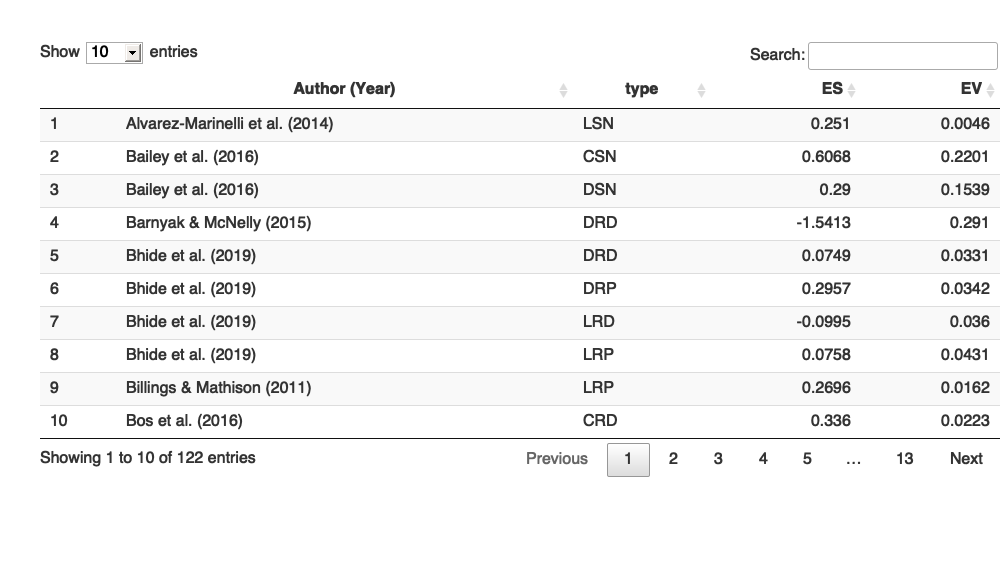

Meta-analysis Script
================
Saurabh Khanna
2020-04-28

  - [Reading in data](#reading-in-data)
  - [Calculate effect sizes](#calculate-effect-sizes)
      - [Post only](#post-only)
      - [Pre and Post](#pre-and-post)
      - [Directly entered ES](#directly-entered-es)
      - [Combining all](#combining-all)
      - [Summary stats](#summary-stats)
  - [Synthesizing effect sizes](#synthesizing-effect-sizes)
      - [Vocabulary](#vocabulary)
      - [Listening Comprehension](#listening-comprehension)
      - [Reading Comprehension](#reading-comprehension)
      - [Morphology](#morphology)
      - [Syntax](#syntax)
      - [Academic Learning](#academic-learning)
  - [Moderator Analysis](#moderator-analysis)
      - [Vocabulary - overall](#vocabulary---overall)
      - [Vocabulary - overall (Controlling for
        type)](#vocabulary---overall-controlling-for-type)
      - [Vocabulary - VR](#vocabulary---vr)
      - [Vocabulary - VS](#vocabulary---vs)
      - [Listening Comprehension -
        overall](#listening-comprehension---overall)
      - [Listening Comprehension - overall (Controlling for
        type)](#listening-comprehension---overall-controlling-for-type)
      - [Listening Comprehension - LR](#listening-comprehension---lr)
      - [Listening Comprehension - LS](#listening-comprehension---ls)
      - [Reading Comprehension -
        overall](#reading-comprehension---overall)
      - [Reading Comprehension - overall (Controlling for
        type)](#reading-comprehension---overall-controlling-for-type)
      - [Reading Comprehension - RR](#reading-comprehension---rr)
      - [Reading Comprehension - RS](#reading-comprehension---rs)
  - [MetaForest plots](#metaforest-plots)
      - [Vocabulary](#vocabulary-1)
      - [Listening Comprehension](#listening-comprehension-1)
      - [Reading Comprehension](#reading-comprehension-1)

``` r
# Libraries
library(tidyverse)
```

    ## ── Attaching packages ─────────────────────────────────────── tidyverse 1.3.0 ──

    ## ✓ ggplot2 3.3.0     ✓ purrr   0.3.4
    ## ✓ tibble  3.0.1     ✓ dplyr   0.8.5
    ## ✓ tidyr   1.0.2     ✓ stringr 1.4.0
    ## ✓ readr   1.3.1     ✓ forcats 0.5.0

    ## ── Conflicts ────────────────────────────────────────── tidyverse_conflicts() ──
    ## x dplyr::filter() masks stats::filter()
    ## x dplyr::lag()    masks stats::lag()

``` r
library(readxl)
library(metafor)
```

    ## Loading required package: Matrix

    ## 
    ## Attaching package: 'Matrix'

    ## The following objects are masked from 'package:tidyr':
    ## 
    ##     expand, pack, unpack

    ## Loading 'metafor' package (version 2.4-0). For an overview 
    ## and introduction to the package please type: help(metafor).

``` r
library(MAd)
library(metaforest)
```

    ## Loading required package: ranger

    ## Loading required package: data.table

    ## 
    ## Attaching package: 'data.table'

    ## The following objects are masked from 'package:dplyr':
    ## 
    ##     between, first, last

    ## The following object is masked from 'package:purrr':
    ## 
    ##     transpose

``` r
# Parameters
data_file <- here::here("data/L&L Data Set Means SDs.xlsx")
```

## Reading in data

``` r
# join checks
read_xlsx(data_file, sheet = "VR") %>% 
  select(AUTYR) %>% 
  drop_na(AUTYR) %>% 
  anti_join(
    read_xlsx(data_file, sheet = "StudyChar") %>% 
      select(AUTYR) %>% 
      drop_na(AUTYR),
    by = "AUTYR"
  )
```

    ## # A tibble: 1 x 1
    ##   AUTYR     
    ##   <chr>     
    ## 1 Nelson11FU

``` r
read_xlsx(data_file, sheet = "VS") %>% 
  select(AUTYR) %>% 
  drop_na(AUTYR) %>% 
  anti_join(
    read_xlsx(data_file, sheet = "StudyChar") %>% 
      select(AUTYR) %>% 
      drop_na(AUTYR),
    by = "AUTYR"
  )
```

    ## # A tibble: 1 x 1
    ##   AUTYR     
    ##   <chr>     
    ## 1 Nelson11FU

``` r
read_xlsx(data_file, sheet = "LR") %>% 
  select(AUTYR) %>% 
  drop_na(AUTYR) %>% 
  anti_join(
    read_xlsx(data_file, sheet = "StudyChar") %>% 
      select(AUTYR) %>% 
      drop_na(AUTYR),
    by = "AUTYR"
  )
```

    ## # A tibble: 0 x 1
    ## # … with 1 variable: AUTYR <chr>

``` r
read_xlsx(data_file, sheet = "LS") %>% 
  select(AUTYR) %>% 
  drop_na(AUTYR) %>% 
  anti_join(
    read_xlsx(data_file, sheet = "StudyChar") %>% 
      select(AUTYR) %>% 
      drop_na(AUTYR),
    by = "AUTYR"
  )
```

    ## # A tibble: 0 x 1
    ## # … with 1 variable: AUTYR <chr>

``` r
read_xlsx(data_file, sheet = "RR") %>% 
  select(AUTYR) %>% 
  drop_na(AUTYR) %>% 
  anti_join(
    read_xlsx(data_file, sheet = "StudyChar") %>% 
      select(AUTYR) %>% 
      drop_na(AUTYR),
    by = "AUTYR"
  )
```

    ## # A tibble: 0 x 1
    ## # … with 1 variable: AUTYR <chr>

``` r
read_xlsx(data_file, sheet = "RS") %>% 
  select(AUTYR) %>% 
  drop_na(AUTYR) %>% 
  anti_join(
    read_xlsx(data_file, sheet = "StudyChar") %>% 
      select(AUTYR) %>% 
      drop_na(AUTYR),
    by = "AUTYR"
  )
```

    ## # A tibble: 0 x 1
    ## # … with 1 variable: AUTYR <chr>

All good\!

## Calculate effect sizes

### Post only

``` r
df_post <-
  bind_rows(
    "VR" = read_xlsx(data_file, sheet = "VR") %>% rename_at(vars(-AUTYR), ~ str_replace(., "VR", "")),
    "VS" = read_xlsx(data_file, sheet = "VS") %>% rename_at(vars(-AUTYR), ~ str_replace(., "VS", "")),
    "RR" = read_xlsx(data_file, sheet = "RR") %>% rename_at(vars(-AUTYR), ~ str_replace(., "RR", "")),
    "RS" = read_xlsx(data_file, sheet = "RS") %>% rename_at(vars(-AUTYR), ~ str_replace(., "RS", "")),
    "LR" = read_xlsx(data_file, sheet = "LR") %>% rename_at(vars(-AUTYR), ~ str_replace(., "LR", "")),
    "LS" = read_xlsx(data_file, sheet = "LS") %>% rename_at(vars(-AUTYR), ~ str_replace(., "LS", "")),
    "MR" = read_xlsx(data_file, sheet = "MR") %>% rename_at(vars(-AUTYR), ~ str_replace(., "MR", "")),
    "MS" = read_xlsx(data_file, sheet = "MS") %>% rename_at(vars(-AUTYR), ~ str_replace(., "MS", "")),
    "SR" = read_xlsx(data_file, sheet = "SR") %>% rename_at(vars(-AUTYR), ~ str_replace(., "SR", "")),
    "SS" = read_xlsx(data_file, sheet = "SS") %>% rename_at(vars(-AUTYR), ~ str_replace(., "SS", "")),
    "AS" = read_xlsx(data_file, sheet = "AS") %>% rename_at(vars(-AUTYR), ~ str_replace(., "AS", "")),
    .id = "type"
  ) %>% 
  drop_na(AUTYR) %>%
  filter(is.na(TM1pre)) %>% 
  select_if(~ any(!is.na(.))) %>%
  select(AUTYR, type, sort(current_vars()))


for (m in 1:4) {
  if (
    !(str_glue("TM{m}post") %in% colnames(df_post)) | 
    !(str_glue("CM{m}post") %in% colnames(df_post))
  ) {
    next
  }
  df_post <-
    escalc(
      data = df_post,
      measure = "SMD",
      m1i = df_post[, str_c("TM", m, "post")] %>% unlist(),
      m2i = df_post[, str_c("CM", m, "post")] %>% unlist(),
      sd1i = df_post[, str_c("TS", m, "post")] %>% unlist(),
      sd2i = df_post[, str_c("CS", m, "post")] %>% unlist(),
      n1i = df_post[, str_c("TN", m, "post")] %>% unlist(),
      n2i = df_post[, str_c("CN", m, "post")] %>% unlist(),
      var.names = c(str_glue("ES_{m}"), str_glue("EV_{m}"))
    ) 
}


df_post <-
  df_post %>% 
  select(AUTYR, type, starts_with("ES")) %>% 
  pivot_longer(cols = starts_with("ES"), names_to = "num", values_to = "ES", values_drop_na = T) %>%
  mutate(num = str_sub(num, 4)) %>% 
  left_join(
    df_post %>% 
      select(AUTYR, type, starts_with("EV")) %>% 
      pivot_longer(cols = starts_with("EV"), names_to = "num", values_to = "EV", values_drop_na = T) %>% 
      mutate(num = str_sub(num, 4)),
    by = c("AUTYR", "type", "num")
  ) %>% 
  select(-num)
```

### Pre and Post

``` r
df_prepost <-
  bind_rows(
    "VR" = read_xlsx(data_file, sheet = "VR") %>% rename_at(vars(-AUTYR), ~ str_replace(., "VR", "")),
    "VS" = read_xlsx(data_file, sheet = "VS") %>% rename_at(vars(-AUTYR), ~ str_replace(., "VS", "")),
    "RR" = read_xlsx(data_file, sheet = "RR") %>% rename_at(vars(-AUTYR), ~ str_replace(., "RR", "")),
    "RS" = read_xlsx(data_file, sheet = "RS") %>% rename_at(vars(-AUTYR), ~ str_replace(., "RS", "")),
    "LR" = read_xlsx(data_file, sheet = "LR") %>% rename_at(vars(-AUTYR), ~ str_replace(., "LR", "")),
    "LS" = read_xlsx(data_file, sheet = "LS") %>% rename_at(vars(-AUTYR), ~ str_replace(., "LS", "")),
    "MR" = read_xlsx(data_file, sheet = "MR") %>% rename_at(vars(-AUTYR), ~ str_replace(., "MR", "")),
    "MS" = read_xlsx(data_file, sheet = "MS") %>% rename_at(vars(-AUTYR), ~ str_replace(., "MS", "")),
    "SR" = read_xlsx(data_file, sheet = "SR") %>% rename_at(vars(-AUTYR), ~ str_replace(., "SR", "")),
    "SS" = read_xlsx(data_file, sheet = "SS") %>% rename_at(vars(-AUTYR), ~ str_replace(., "SS", "")),
    "AS" = read_xlsx(data_file, sheet = "AS") %>% rename_at(vars(-AUTYR), ~ str_replace(., "AS", "")),
    .id = "type"
  ) %>% 
  drop_na(AUTYR) %>%
  filter(!is.na(TM1pre)) %>% 
  select_if(~ any(!is.na(.))) %>%
  select(AUTYR, type, sort(current_vars())) %>% 
  mutate(
    TN1post = if_else(is.na(TN1post) & !is.na(TN1pre), TN1pre, TN1post),
    TN2post = if_else(is.na(TN2post) & !is.na(TN2pre), TN2pre, TN2post),
    CN1post = if_else(is.na(CN1post) & !is.na(CN1pre), CN1pre, CN1post),
    CN2post = if_else(is.na(CN2post) & !is.na(CN2pre), CN2pre, CN2post)
  )


# treatment (post-pre)
for (mt in 1:4) {
  if (
    !(str_glue("TM{mt}post") %in% colnames(df_prepost)) | 
    !(str_glue("TM{mt}pre") %in% colnames(df_prepost))
  ) {
    next
  }
  df_prepost <-
    escalc(
      data = df_prepost,
      measure = "SMCR",
      m1i = df_prepost[, str_c("TM", mt, "post")] %>% unlist(),
      m2i = df_prepost[, str_c("TM", mt, "pre")] %>% unlist(),
      sd1i = df_prepost[, str_c("TS", mt, "pre")] %>% unlist(),
      ni = df_prepost[, str_c("TN", mt, "post")] %>% unlist(),
      ri = rep(0.5, 86),
      var.names = c(str_glue("TES_TM{mt}"), str_glue("TEV_TM{mt}"))
    ) 
}

# control (post-pre)
for (mc in 1:4) {
  if (
    !(str_glue("CM{mc}post") %in% colnames(df_prepost)) | 
    !(str_glue("CM{mc}pre") %in% colnames(df_prepost))
  ) {
    next
  }
  df_prepost <-
    escalc(
      data = df_prepost,
      measure = "SMCR",
      m1i = df_prepost[, str_c("CM", mc, "post")] %>% unlist(),
      m2i = df_prepost[, str_c("CM", mc, "pre")] %>% unlist(),
      sd1i = df_prepost[, str_c("CS", mc, "pre")] %>% unlist(),
      ni = df_prepost[, str_c("CN", mc, "post")] %>% unlist(),
      ri = rep(0.5, 86),
      var.names = c(str_glue("CES_CM{mc}"), str_glue("CEV_CM{mc}"))
    ) 
}


# ES and EV taken together
for (m in 1:4) {
  if (
    !(str_glue("TES_TM{m}") %in% colnames(df_prepost)) | 
    !(str_glue("TEV_TM{m}") %in% colnames(df_prepost)) |
    !(str_glue("CES_CM{m}") %in% colnames(df_prepost)) | 
    !(str_glue("CEV_CM{m}") %in% colnames(df_prepost))
  ) {
    next
  }
  # subtracting effect size
  df_prepost[, str_c("ES_", m)] <- 
    (df_prepost[, str_c("TES_TM", m)] %>% unlist()) -
    (df_prepost[, str_c("CES_CM", m)] %>% unlist())
  # adding variance
  df_prepost[, str_c("EV_", m)] <- 
    (df_prepost[, str_c("TEV_TM", m)] %>% unlist()) +
    (df_prepost[, str_c("CEV_CM", m)] %>% unlist())
}


df_prepost <-
  df_prepost %>% 
  select(AUTYR, type, starts_with("ES")) %>% 
  pivot_longer(cols = starts_with("ES"), names_to = "num", values_to = "ES", values_drop_na = T) %>%
  mutate(num = str_sub(num, 4)) %>% 
  left_join(
    df_prepost %>% 
      select(AUTYR, type, starts_with("EV")) %>% 
      pivot_longer(cols = starts_with("EV"), names_to = "num", values_to = "EV", values_drop_na = T) %>% 
      mutate(num = str_sub(num, 4)),
    by = c("AUTYR", "type", "num")
  ) %>% 
  select(-num)
```

### Directly entered ES

``` r
df_es_direct <-
  tribble(
    ~AUTYR,        ~type, ~ES, ~EV,
    
    # "Apthorp12_K", "VR",  0.98, 0,
    # "Apthorp12_1", "VR",  1.00, 0,
    # "Apthorp12_3", "VR",  0.95, 0,
    # "Apthorp12_4", "VR",  1.24, 0,
    
    # "Apthorp12_P", "VS",  0.06, 0,
    # "Apthorp12_I", "VS", -0.14, 0,
    "Gersten10",   "VS",  0.33, 0.05,
    "Jayanthi18",  "VS", -0.043, 0.001,

    # "Apthorp12_K", "LR",  0.24, 0,
    # "Apthorp12_1", "LR",  0.21, 0,
    # 
    # "Apthorp12_P", "LS",  0.05, 0,
    # 
    # "Apthorp12_3", "RR",  0.09, 0,
    # "Apthorp12_4", "RR",  0.44, 0,
    # 
    # "Apthorp12_I", "RS", -0.11, 0,
    "Gersten10",   "RS",  0.13, 0.04
  )
```

### Combining all

``` r
df_append <- 
  bind_rows(df_post, df_prepost, df_es_direct) %>% 
  left_join(
    read_xlsx(data_file, sheet = "StudyChar") %>% 
      drop_na(AUTYR),
    by = "AUTYR"
  ) %>%
  mutate(
    LowIncome = recode(LowIncome, "0.0" = "0", "1.0" = "1", .default = NA_character_) %>% as.integer(),
    Hours = Hours %>% parse_number(),
    CONT = recode(CONT, "BAU" = "0", "ALT" = "1") %>% as.integer()
  ) %>%
  arrange(type, stdid) %>%
  select(type, stdid, AUTYR, everything())
  
cor_es <-
  df_append %>%
  unite("type_stdid", c("type", "stdid")) %>% 
  agg(id = type_stdid, es = ES, var = EV, method = "BHHR", data = .) %>% 
  separate(id, c("type", "stdid")) %>% 
  rename(ES = es, EV = var)

df_clean <-
  df_append %>%
  group_by(type, stdid) %>%
  summarize_at(vars(Content:Hours), ~ round(mean(.))) %>%
  ungroup() %>%
  left_join(cor_es, by = c("type", "stdid")) %>% 
  select(type, stdid, ES, EV, everything()) %>% 
  mutate(
    design = case_when(
      RCT == 1 ~ "RCT",
      QED == 1 ~ "QED",
      WSD == 1 ~ "WSD",
      TRUE ~ NA_character_
    ) %>% as_factor(),
    grade = case_when(
      (GradeK + Grade1 + Grade2) > 0 & (Grade3 + Grade4 + Grade5) == 0 ~ "K-2",
      (Grade3 + Grade4 + Grade5) > 0 & (GradeK + Grade1 + Grade2) == 0 ~ "3-5",
      TRUE ~ "Both"
    ) %>% as_factor(),
    grouping = case_when(
      (WholeCl == 1) & (SmallGr == 0) & (Indiv == 0) ~ 1,
      TRUE ~ 0
    ),
    CONT = CONT %>% factor(labels = c("BAU", "ALT")),
    TCOM = if_else(TLC == 1 | TRC == 1, 1, 0)
  ) %>%
  select(-c(RCT, QED, WSD, WholeCl, SmallGr, Indiv), -starts_with("Grade", ignore.case = F)) %>% 
  left_join(
    read_xlsx(data_file, sheet = "citations"),
    by = c("type", "stdid")
  ) %>% 
  mutate(
    type = type %>% as_factor(),
    citation = if_else(str_detect(type, "S$"), str_c(citation, " "), citation)
  )

rm(df_post, df_prepost, df_es_direct, df_append, cor_es)
#df_clean %>% summary()
df_clean %>% knitr::kable()
```

| type | stdid       |          ES |        EV | Content | PD | LowIncome | EL | TMULT | TVOC | TSYN | TMOR | TLC | TRC | TPAD | TDD | TTEC | TSTR | CONT | Duration | Hours | design | grade | grouping | TCOM | citation                        |
| :--: | :---------- | ----------: | --------: | ------: | -: | --------: | -: | ----: | ---: | ---: | ---: | --: | --: | ---: | --: | ---: | ---: | :--- | -------: | ----: | :----- | :---- | -------: | ---: | :------------------------------ |
|  AS  | Jones1      |   0.0289111 | 0.0020178 |       1 |  0 |         1 |  0 |     0 |    1 |    0 |    0 |   0 |   0 |    0 |   1 |    0 |    0 | BAU  |        1 |    95 | RCT    | 3-5   |        0 |    0 | Jones et al. (2019) YR1         |
|  AS  | Jones2      |   0.1203421 | 0.0018244 |       1 |  0 |         1 |  0 |     0 |    1 |    0 |    0 |   0 |   0 |    0 |   1 |    0 |    0 | BAU  |        1 |    95 | RCT    | 3-5   |        0 |    0 | Jones et al. (2019) YR2         |
|  AS  | Proc19      |   0.1139215 | 0.0167638 |       1 |  0 |         1 |  1 |     1 |    1 |    1 |    1 |   1 |   1 |    0 |   1 |    1 |    0 | BAU  |        1 |    20 | QED    | 3-5   |        0 |    1 | Proctor et al. (2020)           |
|  LR  | Apth1       |   0.2312520 | 0.0024144 |       0 |  0 |         1 |  0 |     0 |    1 |    0 |    0 |   0 |   0 |    0 |   0 |    0 |    0 | BAU  |        1 |    30 | RCT    | K-2   |        1 |    0 | Apthorp et al. (2012) G1        |
|  LR  | ApthK       |   0.3771837 | 0.0025840 |       0 |  0 |         1 |  0 |     0 |    1 |    0 |    0 |   0 |   0 |    0 |   0 |    0 |    0 | BAU  |        1 |    30 | RCT    | K-2   |        1 |    0 | Apthorp et al. (2012) KG        |
|  LR  | Baker       |   0.2651806 | 0.0312088 |       0 |  0 |         1 |  0 |     0 |    1 |    0 |    0 |   1 |   0 |    0 |   0 |    0 |    0 | ALT  |        1 |    38 | RCT    | K-2   |        1 |    1 | Baker et al. (2013)             |
|  LR  | Coyne10     |   0.3683911 | 0.0357745 |       0 |  0 |         1 |  0 |     0 |    1 |    0 |    0 |   0 |   0 |    0 |   0 |    0 |    0 | BAU  |        0 |    18 | QED    | K-2   |        0 |    0 | Coyne et al. (2010)             |
|  LR  | Coyne19     |   0.4067562 | 0.0025440 |       0 |  0 |        NA |  0 |     0 |    1 |    0 |    0 |   0 |   0 |    0 |   0 |    0 |    0 | ALT  |        1 |    44 | RCT    | K-2   |        0 |    0 | Coyne et al. (2019)             |
|  LR  | Jiang1      |   0.2936279 | 0.0260646 |       0 |  0 |         0 |  0 |     1 |    1 |    1 |    1 |   1 |   0 |    0 |   0 |    1 |    0 | BAU  |        1 |    50 | RCT    | K-2   |        1 |    1 | Jiang & Davis (2017) G1         |
|  LR  | Jiang2      | \-0.0763520 | 0.0242781 |       0 |  0 |         0 |  0 |     1 |    1 |    1 |    1 |   1 |   0 |    0 |   0 |    1 |    0 | BAU  |        1 |    50 | RCT    | K-2   |        1 |    1 | Jiang & Davis (2017) G2         |
|  LR  | Jiang3      |   0.3481917 | 0.0242353 |       0 |  0 |         0 |  0 |     1 |    1 |    1 |    1 |   1 |   0 |    0 |   0 |    1 |    0 | BAU  |        1 |    50 | RCT    | 3-5   |        1 |    1 | Jiang & Davis (2017) G3         |
|  LR  | JiangK      |   0.2561034 | 0.0223375 |       0 |  0 |         0 |  0 |     1 |    1 |    1 |    1 |   1 |   0 |    0 |   0 |    1 |    0 | BAU  |        1 |    50 | RCT    | K-2   |        1 |    1 | Jiang & Davis (2017) KG         |
|  LR  | Silver17bK  |   0.0647812 | 0.0206484 |       1 |  0 |         1 |  1 |     0 |    1 |    0 |    0 |   1 |   0 |    0 |   1 |    1 |    1 | BAU  |        1 |    20 | QED    | K-2   |        0 |    1 | Silverman et al. (2017b) KG     |
|  LS  | ApthP       |   0.0176180 | 0.0014313 |       0 |  0 |         1 |  0 |     0 |    1 |    0 |    0 |   0 |   0 |    0 |   0 |    0 |    0 | BAU  |        1 |    30 | RCT    | K-2   |        1 |    0 | Apthorp et al. (2012) K1        |
|  LS  | Baker       |   0.0990000 | 0.0181208 |       0 |  0 |         1 |  0 |     0 |    1 |    0 |    0 |   1 |   0 |    0 |   0 |    0 |    0 | ALT  |        1 |    38 | RCT    | K-2   |        1 |    1 | Baker et al. (2013)             |
|  LS  | Conn183     |   0.0792939 | 0.0117896 |       0 |  0 |         0 |  0 |     0 |    1 |    0 |    0 |   1 |   1 |    0 |   0 |    0 |    0 | BAU  |        1 |    22 | RCT    | 3-5   |        0 |    1 | Connor et al. (2018) G3         |
|  LS  | Conn184     | \-0.0223388 | 0.0134181 |       1 |  0 |         0 |  0 |     0 |    1 |    0 |    0 |   1 |   1 |    0 |   0 |    0 |    0 | BAU  |        1 |    22 | RCT    | 3-5   |        0 |    1 | Connor et al. (2018) G4         |
|  LS  | Nielsen     |   0.5156824 | 0.1941841 |       0 |  0 |         1 |  0 |     0 |    1 |    0 |    0 |   1 |   0 |    0 |   0 |    0 |    0 | BAU  |        0 |    18 | QED    | K-2   |        0 |    1 | Nielsen & Friesen (2012)        |
|  LS  | Tong        |   0.2418983 | 0.0944200 |       1 |  1 |         1 |  1 |     0 |    1 |    0 |    0 |   1 |   1 |    1 |   0 |    0 |    0 | BAU  |        1 |   100 | RCT    | K-2   |        0 |    1 | Tong et al. (2010)              |
|  MR  | Apel1       |   2.4249393 | 0.2456334 |       0 |  0 |         1 |  0 |     0 |    0 |    0 |    1 |   0 |   0 |    0 |   0 |    0 |    0 | BAU  |        0 |    13 | RCT    | K-2   |        0 |    0 | Apel & Diehm (2013) G1          |
|  MR  | Apel2       |   0.6689962 | 0.0636171 |       0 |  0 |         1 |  0 |     0 |    0 |    0 |    1 |   0 |   0 |    0 |   0 |    0 |    0 | BAU  |        0 |    13 | RCT    | K-2   |        0 |    0 | Apel & Diehm (2013) G2          |
|  MR  | ApelK       |   0.9939616 | 0.0770327 |       0 |  0 |         1 |  0 |     0 |    0 |    0 |    1 |   0 |   0 |    0 |   0 |    0 |    0 | BAU  |        0 |    13 | RCT    | K-2   |        0 |    0 | Apel & Diehm (2013) KG          |
|  MR  | Brimo       |   0.5860487 | 0.3775560 |       0 |  0 |        NA |  0 |     0 |    0 |    0 |    1 |   0 |   0 |    0 |   0 |    0 |    0 | BAU  |        0 |    12 | QED    | 3-5   |        0 |    0 | Brimo (2016)                    |
|  RR  | Apth3       |   0.1377019 | 0.0022997 |       0 |  0 |         1 |  0 |     0 |    1 |    0 |    0 |   0 |   0 |    0 |   0 |    0 |    0 | BAU  |        1 |    30 | RCT    | 3-5   |        1 |    0 | Apthorp et al. (2012) G3        |
|  RR  | Dalt11      |   1.0831029 | 0.0427347 |       0 |  0 |         0 |  1 |     0 |    1 |    0 |    0 |   0 |   0 |    0 |   0 |    1 |    0 | ALT  |        1 |    20 | RCT    | 3-5   |        0 |    0 | Dalton et al. (2011)            |
|  RR  | Graham      |   0.1519858 | 0.0156276 |       1 |  0 |        NA |  0 |     0 |    1 |    0 |    0 |   0 |   0 |    0 |   0 |    0 |    1 | BAU  |        0 |     9 | RCT    | 3-5   |        1 |    0 | Graham et al. (2015)            |
|  RR  | Silver17a4  |   0.8508342 | 0.0154886 |       0 |  0 |         1 |  0 |     0 |    1 |    0 |    0 |   0 |   0 |    0 |   1 |    1 |    0 | BAU  |        0 |    10 | QED    | 3-5   |        0 |    0 | Silverman et al. (2017a) G4     |
|  RR  | VadSanHer15 |   0.2178669 | 0.0033594 |       0 |  0 |         0 |  1 |     0 |    1 |    0 |    0 |   0 |   1 |    0 |   0 |    0 |    0 | BAU  |        1 |    35 | RCT    | 3-5   |        1 |    1 | Vadasy, Sanders, Herrera (2015) |
|  RS  | Apel1       |   0.3604871 | 0.1141001 |       0 |  0 |         1 |  0 |     0 |    0 |    0 |    1 |   0 |   0 |    0 |   0 |    0 |    0 | BAU  |        0 |    13 | RCT    | K-2   |        0 |    0 | Apel & Diehm (2013) G1          |
|  RS  | Apel2       | \-0.0919161 | 0.0850093 |       0 |  0 |         1 |  0 |     0 |    0 |    0 |    1 |   0 |   0 |    0 |   0 |    0 |    0 | BAU  |        0 |    13 | RCT    | K-2   |        0 |    0 | Apel & Diehm (2013) G2          |
|  RS  | Conn183     | \-0.0184807 | 0.0117848 |       0 |  0 |         0 |  0 |     0 |    1 |    0 |    0 |   1 |   1 |    0 |   0 |    0 |    0 | BAU  |        1 |    22 | RCT    | 3-5   |        0 |    1 | Connor et al. (2018) G3         |
|  RS  | Conn184     | \-0.0203581 | 0.0134163 |       1 |  0 |         0 |  0 |     0 |    1 |    0 |    0 |   1 |   1 |    0 |   0 |    0 |    0 | BAU  |        1 |    22 | RCT    | 3-5   |        0 |    1 | Connor et al. (2018) G4         |
|  RS  | Dalt11      |   1.0331095 | 0.0493694 |       0 |  0 |         0 |  1 |     0 |    1 |    0 |    0 |   0 |   0 |    0 |   0 |    1 |    0 | ALT  |        1 |    20 | RCT    | 3-5   |        0 |    0 | Dalton et al. (2011)            |
|  RS  | Daunic      | \-0.2206484 | 0.0877731 |       0 |  0 |        NA |  0 |     0 |    1 |    0 |    0 |   1 |   0 |    0 |   1 |    0 |    0 | BAU  |        0 |     5 | QED    | K-2   |        0 |    1 | Daunic et al. (2013)            |
|  RS  | Gersten     |   0.1300000 | 0.0400000 |       0 |  1 |        NA |  0 |     0 |    1 |    0 |    0 |   1 |   0 |    0 |   0 |    0 |    0 | BAU  |        1 |    NA | RCT    | K-2   |        1 |    1 | Gersten et al. (2010)           |
|  RS  | Jones1      |   0.0733653 | 0.0018199 |       1 |  0 |         1 |  0 |     0 |    1 |    0 |    0 |   0 |   0 |    0 |   1 |    0 |    0 | BAU  |        1 |    95 | RCT    | 3-5   |        0 |    0 | Jones et al. (2019) YR1         |
|  RS  | Jones2      |   0.2366471 | 0.0018459 |       1 |  0 |         1 |  0 |     0 |    1 |    0 |    0 |   0 |   0 |    0 |   1 |    0 |    0 | BAU  |        1 |    95 | RCT    | 3-5   |        0 |    0 | Jones et al. (2019) YR2         |
|  RS  | Morris      |   0.2364356 | 0.0312791 |       0 |  0 |         0 |  0 |     1 |    1 |    1 |    1 |   0 |   0 |    1 |   0 |    0 |    1 | ALT  |        1 |    70 | RCT    | Both  |        0 |    0 | Morris et al. (2012)            |
|  RS  | Proc11      | \-0.0436775 | 0.0172460 |       0 |  0 |         1 |  1 |     1 |    1 |    1 |    0 |   1 |   1 |    0 |   0 |    1 |    0 | BAU  |        1 |    27 | QED    | 3-5   |        0 |    1 | Proctor et al. (2011)           |
|  RS  | Proc19      |   0.2331418 | 0.0191677 |       1 |  0 |         1 |  1 |     1 |    1 |    1 |    1 |   1 |   1 |    0 |   1 |    1 |    0 | BAU  |        1 |    20 | QED    | 3-5   |        0 |    1 | Proctor et al. (2020)           |
|  RS  | Silver17a4  | \-0.0014823 | 0.0075817 |       0 |  0 |         1 |  0 |     0 |    1 |    0 |    0 |   0 |   0 |    0 |   1 |    1 |    0 | BAU  |        0 |    10 | QED    | 3-5   |        0 |    0 | Silverman et al. (2017a) G4     |
|  RS  | Silver17b4  | \-0.1127521 | 0.0182102 |       1 |  0 |         1 |  1 |     0 |    1 |    0 |    0 |   0 |   1 |    0 |   1 |    1 |    1 | BAU  |        1 |    20 | QED    | 3-5   |        0 |    1 | Silverman et al. (2017b) G4     |
|  RS  | Simmons     | \-0.0648048 | 0.0056414 |       1 |  0 |         1 |  0 |     0 |    1 |    0 |    0 |   0 |   0 |    0 |   0 |    0 |    1 | BAU  |        1 |    27 | RCT    | 3-5   |        1 |    0 | Simmons et al. (2010)           |
|  RS  | Tong        |   0.1497852 | 0.0757906 |       1 |  1 |         1 |  1 |     0 |    1 |    0 |    0 |   1 |   1 |    1 |   0 |    0 |    0 | BAU  |        1 |   100 | RCT    | K-2   |        0 |    1 | Tong et al. (2010)              |
|  RS  | VadSanHer15 |   0.0500486 | 0.0033727 |       0 |  0 |         0 |  1 |     0 |    1 |    0 |    0 |   0 |   1 |    0 |   0 |    0 |    0 | BAU  |        1 |    35 | RCT    | 3-5   |        1 |    1 | Vadasy, Sanders, Herrera (2015) |
|  SS  | Conn183     |   0.0767859 | 0.0118030 |       0 |  0 |         0 |  0 |     0 |    1 |    0 |    0 |   1 |   1 |    0 |   0 |    0 |    0 | BAU  |        1 |    22 | RCT    | 3-5   |        0 |    1 | Connor et al. (2018) G3         |
|  SS  | Conn184     | \-0.0627694 | 0.0134290 |       1 |  0 |         0 |  0 |     0 |    1 |    0 |    0 |   1 |   1 |    0 |   0 |    0 |    0 | BAU  |        1 |    22 | RCT    | 3-5   |        0 |    1 | Connor et al. (2018) G4         |
|  VR  | Apth1       |   0.7679293 | 0.0024274 |       0 |  0 |         1 |  0 |     0 |    1 |    0 |    0 |   0 |   0 |    0 |   0 |    0 |    0 | BAU  |        1 |    30 | RCT    | K-2   |        1 |    0 | Apthorp et al. (2012) G1        |
|  VR  | Apth3       |   0.9032747 | 0.0028180 |       0 |  0 |         1 |  0 |     0 |    1 |    0 |    0 |   0 |   0 |    0 |   0 |    0 |    0 | BAU  |        1 |    30 | RCT    | 3-5   |        1 |    0 | Apthorp et al. (2012) G3        |
|  VR  | ApthK       |   0.7963996 | 0.0028469 |       0 |  0 |         1 |  0 |     0 |    1 |    0 |    0 |   0 |   0 |    0 |   0 |    0 |    0 | BAU  |        1 |    30 | RCT    | K-2   |        1 |    0 | Apthorp et al. (2012) KG        |
|  VR  | Arth1       |   0.4018396 | 0.1512635 |       0 |  0 |        NA |  0 |     1 |    1 |    1 |    0 |   1 |   0 |    0 |   0 |    0 |    0 | BAU  |        0 |     9 | QED    | K-2   |        1 |    1 | Arthur & Davis (2016) G1        |
|  VR  | Arth2       |   1.0824260 | 0.3962804 |       0 |  0 |        NA |  0 |     1 |    1 |    1 |    0 |   1 |   0 |    0 |   0 |    0 |    0 | BAU  |        0 |     9 | QED    | K-2   |        1 |    1 | Arthur & Davis (2016) G2        |
|  VR  | Arth3       |   0.8095698 | 0.1674121 |       0 |  0 |        NA |  0 |     1 |    1 |    1 |    0 |   1 |   0 |    0 |   0 |    0 |    0 | BAU  |        0 |     9 | QED    | 3-5   |        1 |    1 | Arthur & Davis (2016) G3        |
|  VR  | ArthK       |   0.0786293 | 0.2387246 |       0 |  0 |        NA |  0 |     1 |    1 |    1 |    0 |   1 |   0 |    0 |   0 |    0 |    0 | BAU  |        0 |     9 | QED    | K-2   |        1 |    1 | Arthur & Davis (2016) KG        |
|  VR  | Aug         |   2.1695243 | 0.0192149 |       0 |  0 |         1 |  1 |     0 |    1 |    0 |    0 |   0 |   0 |    0 |   0 |    0 |    0 | ALT  |        1 |    25 | WSD    | K-2   |        1 |    0 | August et al. (2018)            |
|  VR  | Baker       |   1.0516546 | 0.0525750 |       0 |  0 |         1 |  0 |     0 |    1 |    0 |    0 |   1 |   0 |    0 |   0 |    0 |    0 | ALT  |        1 |    38 | RCT    | K-2   |        1 |    1 | Baker et al. (2013)             |
|  VR  | Conn19      |   0.3320051 | 0.0121459 |       0 |  0 |         1 |  0 |     1 |    1 |    0 |    1 |   0 |   0 |    0 |   0 |    1 |    1 | BAU  |        0 |     4 | RCT    | 3-5   |        0 |    0 | Connor et al. (2019)            |
|  VR  | Coyne10     |   1.4966451 | 0.0442593 |       0 |  0 |         1 |  0 |     0 |    1 |    0 |    0 |   0 |   0 |    0 |   0 |    0 |    0 | BAU  |        0 |    18 | QED    | K-2   |        0 |    0 | Coyne et al. (2010)             |
|  VR  | Coyne19     |   1.0629307 | 0.0028443 |       0 |  0 |        NA |  0 |     0 |    1 |    0 |    0 |   0 |   0 |    0 |   0 |    0 |    0 | ALT  |        1 |    44 | RCT    | K-2   |        0 |    0 | Coyne et al. (2019)             |
|  VR  | Dalt11      |   1.2606480 | 0.0501652 |       0 |  0 |         0 |  1 |     0 |    1 |    0 |    0 |   0 |   0 |    0 |   0 |    1 |    0 | ALT  |        1 |    20 | RCT    | 3-5   |        0 |    0 | Dalton et al. (2011)            |
|  VR  | Fillippini  |   0.6088208 | 0.0802535 |       0 |  0 |         1 |  0 |     0 |    1 |    0 |    0 |   0 |   0 |    1 |   0 |    0 |    0 | ALT  |        0 |     7 | RCT    | K-2   |        0 |    0 | Filippini et al. (2012)         |
|  VR  | Goldstein   |   1.8003662 | 0.0250224 |       0 |  0 |         1 |  0 |     0 |    1 |    0 |    0 |   0 |   0 |    0 |   0 |    1 |    1 | ALT  |        1 |    72 | RCT    | Both  |        0 |    0 | Goldstein et al. (2017)         |
|  VR  | Graham      |   1.6509504 | 0.0373717 |       1 |  0 |        NA |  0 |     0 |    1 |    0 |    0 |   0 |   0 |    0 |   0 |    0 |    1 | BAU  |        0 |     9 | RCT    | 3-5   |        1 |    0 | Graham et al. (2015)            |
|  VR  | Hass        |   1.6710769 | 0.0741052 |       1 |  0 |        NA |  1 |     0 |    1 |    0 |    0 |   0 |   0 |    0 |   0 |    0 |    0 | BAU  |        0 |    12 | RCT    | K-2   |        0 |    0 | Hassinger-Das et al. (2015)     |
|  VR  | Jiang1      |   3.3726157 | 0.0798665 |       0 |  0 |         0 |  0 |     1 |    1 |    1 |    1 |   1 |   0 |    0 |   0 |    1 |    0 | BAU  |        1 |    50 | RCT    | K-2   |        1 |    1 | Jiang & Davis (2017) G1         |
|  VR  | Jiang2      |   2.2260077 | 0.0525373 |       0 |  0 |         0 |  0 |     1 |    1 |    1 |    1 |   1 |   0 |    0 |   0 |    1 |    0 | BAU  |        1 |    50 | RCT    | K-2   |        1 |    1 | Jiang & Davis (2017) G2         |
|  VR  | Jiang3      |   2.5913270 | 0.0562224 |       0 |  0 |         0 |  0 |     1 |    1 |    1 |    1 |   1 |   0 |    0 |   0 |    1 |    0 | BAU  |        1 |    50 | RCT    | 3-5   |        1 |    1 | Jiang & Davis (2017) G3         |
|  VR  | JiangK      |   2.9412143 | 0.0592122 |       0 |  0 |         0 |  0 |     1 |    1 |    1 |    1 |   1 |   0 |    0 |   0 |    1 |    0 | BAU  |        1 |    50 | RCT    | K-2   |        1 |    1 | Jiang & Davis (2017) KG         |
|  VR  | Jones1      |   0.1546716 | 0.0018014 |       1 |  0 |         1 |  0 |     0 |    1 |    0 |    0 |   0 |   0 |    0 |   1 |    0 |    0 | BAU  |        1 |    95 | RCT    | 3-5   |        0 |    0 | Jones et al. (2019) YR1         |
|  VR  | Jones2      |   0.3068467 | 0.0018948 |       1 |  0 |         1 |  0 |     0 |    1 |    0 |    0 |   0 |   0 |    0 |   1 |    0 |    0 | BAU  |        1 |    95 | RCT    | 3-5   |        0 |    0 | Jones et al. (2019) YR2         |
|  VR  | Mancilla    |   1.0544302 | 0.1178923 |       1 |  0 |         1 |  1 |     0 |    1 |    0 |    0 |   0 |   0 |    0 |   1 |    0 |    0 | BAU  |        1 |    25 | QED    | 3-5   |        1 |    0 | Mancilla-Martinez (2010)        |
|  VR  | McK         |   4.0639472 | 0.0293040 |       0 |  0 |         0 |  0 |     0 |    1 |    0 |    0 |   0 |   0 |    0 |   0 |    0 |    0 | ALT  |        0 |     2 | WSD    | K-2   |        1 |    0 | McKeown & Beck (2014)           |
|  VR  | Nelson      |   0.5405571 | 0.0580920 |       0 |  0 |        NA |  1 |     0 |    1 |    0 |    0 |   0 |   0 |    1 |   0 |    0 |    0 | ALT  |        1 |    33 | RCT    | K-2   |        0 |    0 | Nelson et al. (2011)            |
|  VR  | Neuman      |   0.5346265 | 0.0216517 |       1 |  0 |         1 |  0 |     0 |    1 |    0 |    0 |   0 |   0 |    0 |   0 |    1 |    0 | BAU  |        1 |    20 | RCT    | K-2   |        1 |    0 | Neuman & Kaefer (2018)          |
|  VR  | Nielsen     |   2.7051948 | 0.3754320 |       0 |  0 |         1 |  0 |     0 |    1 |    0 |    0 |   1 |   0 |    0 |   0 |    0 |    0 | BAU  |        0 |    18 | QED    | K-2   |        0 |    1 | Nielsen & Friesen (2012)        |
|  VR  | Pow         |   0.5140269 | 0.0703675 |       1 |  0 |         0 |  0 |     0 |    1 |    0 |    0 |   0 |   0 |    0 |   0 |    0 |    0 | BAU  |        0 |     3 | RCT    | K-2   |        0 |    0 | Powell & Driver (2015)          |
|  VR  | Proc11      |   1.1361393 | 0.0121983 |       0 |  0 |         1 |  1 |     1 |    1 |    1 |    0 |   1 |   1 |    0 |   0 |    1 |    0 | BAU  |        1 |    27 | QED    | 3-5   |        0 |    1 | Proctor et al. (2011)           |
|  VR  | Puhal       |   2.6937576 | 0.5142966 |       1 |  0 |         0 |  0 |     0 |    1 |    0 |    0 |   0 |   0 |    0 |   0 |    0 |    0 | ALT  |        0 |     5 | RCT    | K-2   |        0 |    0 | Puhalla (2011)                  |
|  VR  | Pullen      |   0.5008066 | 0.0309496 |       0 |  0 |         0 |  0 |     0 |    1 |    0 |    0 |   0 |   0 |    0 |   0 |    0 |    0 | ALT  |        0 |     2 | QED    | K-2   |        0 |    0 | Pullen et al. (2010)            |
|  VR  | Silver17a4  |   0.4220216 | 0.0079434 |       0 |  0 |         1 |  0 |     0 |    1 |    0 |    0 |   0 |   0 |    0 |   1 |    1 |    0 | BAU  |        0 |    10 | QED    | 3-5   |        0 |    0 | Silverman et al. (2017a) G4     |
|  VR  | Silver17aK  |   0.3868128 | 0.0068429 |       0 |  0 |         1 |  0 |     0 |    1 |    0 |    0 |   0 |   0 |    0 |   1 |    1 |    0 | BAU  |        0 |    10 | QED    | K-2   |        0 |    0 | Silverman et al. (2017a) KG     |
|  VR  | Silver17b4  |   0.8424442 | 0.0166698 |       1 |  0 |         1 |  1 |     0 |    1 |    0 |    0 |   0 |   1 |    0 |   1 |    1 |    1 | BAU  |        1 |    20 | QED    | 3-5   |        0 |    1 | Silverman et al. (2017b) G4     |
|  VR  | Silver17bK  |   1.4421285 | 0.0258946 |       1 |  0 |         1 |  1 |     0 |    1 |    0 |    0 |   1 |   0 |    0 |   1 |    1 |    1 | BAU  |        1 |    20 | QED    | K-2   |        0 |    1 | Silverman et al. (2017b) KG     |
|  VR  | Simmons     |   7.0009329 | 0.1391228 |       1 |  0 |         1 |  0 |     0 |    1 |    0 |    0 |   0 |   0 |    0 |   0 |    0 |    1 | BAU  |        1 |    27 | RCT    | 3-5   |        1 |    0 | Simmons et al. (2010)           |
|  VR  | VadSan15    |   0.2613394 | 0.0775021 |       0 |  0 |        NA |  1 |     0 |    1 |    0 |    0 |   0 |   0 |    1 |   0 |    0 |    0 | ALT  |        0 |     1 | RCT    | K-2   |        0 |    0 | Vadasy & Sanders (2015)         |
|  VR  | VadSan16    |   0.3089192 | 0.0572620 |       0 |  0 |         1 |  1 |     0 |    1 |    0 |    0 |   0 |   0 |    1 |   0 |    0 |    0 | ALT  |        0 |    14 | RCT    | K-2   |        0 |    0 | Vadasy & Sanders (2016)         |
|  VR  | VadSanHer15 |   1.2747785 | 0.0039758 |       0 |  0 |         0 |  1 |     0 |    1 |    0 |    0 |   0 |   1 |    0 |   0 |    0 |    0 | BAU  |        1 |    35 | RCT    | 3-5   |        1 |    1 | Vadasy, Sanders, Herrera (2015) |
|  VR  | VadSanNel15 |   1.2277100 | 0.0464508 |       0 |  0 |         1 |  1 |     0 |    1 |    0 |    0 |   0 |   0 |    1 |   0 |    0 |    0 | ALT  |        1 |    40 | RCT    | K-2   |        0 |    0 | Vadasy, Sanders, Nelson (2015)  |
|  VR  | Wood18      |   0.2654639 | 0.0236715 |       0 |  0 |         1 |  1 |     1 |    1 |    0 |    1 |   0 |   0 |    0 |   0 |    1 |    0 | ALT  |        1 |    30 | RCT    | K-2   |        1 |    0 | Wood et al. (2018)              |
|  VR  | Wright      |   1.5070059 | 0.0402560 |       1 |  0 |         1 |  0 |     0 |    1 |    0 |    0 |   1 |   0 |    0 |   1 |    0 |    0 | BAU  |        0 |    15 | QED    | K-2   |        1 |    1 | Wright & Gotwals (2017)         |
|  VR  | Zipoli      |   0.8411806 | 0.0204632 |       0 |  0 |         1 |  0 |     0 |    1 |    0 |    0 |   0 |   0 |    0 |   0 |    0 |    0 | ALT  |        0 |    18 | WSD    | K-2   |        0 |    0 | Zipoli et al. (2011)            |
|  VS  | ApthP       |   0.0080847 | 0.0015520 |       0 |  0 |         1 |  0 |     0 |    1 |    0 |    0 |   0 |   0 |    0 |   0 |    0 |    0 | BAU  |        1 |    30 | RCT    | K-2   |        1 |    0 | Apthorp et al. (2012) K1        |
|  VS  | Conn183     |   0.1333309 | 0.0112523 |       0 |  0 |         0 |  0 |     0 |    1 |    0 |    0 |   1 |   1 |    0 |   0 |    0 |    0 | BAU  |        1 |    22 | RCT    | 3-5   |        0 |    1 | Connor et al. (2018) G3         |
|  VS  | Conn184     |   0.1191087 | 0.0119430 |       1 |  0 |         0 |  0 |     0 |    1 |    0 |    0 |   1 |   1 |    0 |   0 |    0 |    0 | BAU  |        1 |    22 | RCT    | 3-5   |        0 |    1 | Connor et al. (2018) G4         |
|  VS  | Coyne10     |   0.1061789 | 0.0361622 |       0 |  0 |         1 |  0 |     0 |    1 |    0 |    0 |   0 |   0 |    0 |   0 |    0 |    0 | BAU  |        0 |    18 | QED    | K-2   |        0 |    0 | Coyne et al. (2010)             |
|  VS  | Coyne19     |   0.1034697 | 0.0049060 |       0 |  0 |        NA |  0 |     0 |    1 |    0 |    0 |   0 |   0 |    0 |   0 |    0 |    0 | ALT  |        1 |    44 | RCT    | K-2   |        0 |    0 | Coyne et al. (2019)             |
|  VS  | Dalt11      |   0.1024531 | 0.0419712 |       0 |  0 |         0 |  1 |     0 |    1 |    0 |    0 |   0 |   0 |    0 |   0 |    1 |    0 | ALT  |        1 |    20 | RCT    | 3-5   |        0 |    0 | Dalton et al. (2011)            |
|  VS  | Daunic      |   0.0580749 | 0.0898036 |       0 |  0 |        NA |  0 |     0 |    1 |    0 |    0 |   1 |   0 |    0 |   1 |    0 |    0 | BAU  |        0 |     5 | QED    | K-2   |        0 |    1 | Daunic et al. (2013)            |
|  VS  | Gersten     |   0.3300000 | 0.0500000 |       0 |  1 |        NA |  0 |     0 |    1 |    0 |    0 |   1 |   0 |    0 |   0 |    0 |    0 | BAU  |        1 |    NA | RCT    | K-2   |        1 |    1 | Gersten et al. (2010)           |
|  VS  | Hass        |   0.4835901 | 0.0534860 |       1 |  0 |        NA |  1 |     0 |    1 |    0 |    0 |   0 |   0 |    0 |   0 |    0 |    0 | BAU  |        0 |    12 | RCT    | K-2   |        0 |    0 | Hassinger-Das et al. (2015)     |
|  VS  | Huang       |   0.4786637 | 0.1040172 |       0 |  0 |         1 |  0 |     1 |    1 |    1 |    0 |   0 |   0 |    0 |   0 |    1 |    0 | ALT  |        1 |    80 | QED    | K-2   |        1 |    0 | Huang (2015)                    |
|  VS  | Jayanthi    | \-0.0430000 | 0.0010000 |       0 |  1 |         1 |  1 |     0 |    1 |    0 |    0 |   0 |   0 |    0 |   0 |    0 |    1 | BAU  |        1 |    NA | RCT    | K-2   |        1 |    0 | Jayanthi et al. (2018)          |
|  VS  | Nelson      | \-0.4798887 | 0.0317414 |       0 |  0 |        NA |  1 |     0 |    1 |    0 |    0 |   0 |   0 |    1 |   0 |    0 |    0 | ALT  |        1 |    33 | RCT    | K-2   |        0 |    0 | Nelson et al. (2011)            |
|  VS  | Neuman      | \-0.0712942 | 0.0192485 |       1 |  0 |         1 |  0 |     0 |    1 |    0 |    0 |   0 |   0 |    0 |   0 |    1 |    0 | BAU  |        1 |    20 | RCT    | K-2   |        1 |    0 | Neuman & Kaefer (2018)          |
|  VS  | Nielsen     |   0.1435089 | 0.2058622 |       0 |  0 |         1 |  0 |     0 |    1 |    0 |    0 |   1 |   0 |    0 |   0 |    0 |    0 | BAU  |        0 |    18 | QED    | K-2   |        0 |    1 | Nielsen & Friesen (2012)        |
|  VS  | Proc11      |   0.0343903 | 0.0171422 |       0 |  0 |         1 |  1 |     1 |    1 |    1 |    0 |   1 |   1 |    0 |   0 |    1 |    0 | BAU  |        1 |    27 | QED    | 3-5   |        0 |    1 | Proctor et al. (2011)           |
|  VS  | Silver17aK  | \-0.0393292 | 0.0079704 |       0 |  0 |         1 |  0 |     0 |    1 |    0 |    0 |   0 |   0 |    0 |   1 |    1 |    0 | BAU  |        0 |    10 | QED    | K-2   |        0 |    0 | Silverman et al. (2017a) KG     |
|  VS  | Silver17b4  |   0.1398774 | 0.0182383 |       1 |  0 |         1 |  1 |     0 |    1 |    0 |    0 |   0 |   1 |    0 |   1 |    1 |    1 | BAU  |        1 |    20 | QED    | 3-5   |        0 |    1 | Silverman et al. (2017b) G4     |
|  VS  | Silver17bK  | \-0.1159971 | 0.0215981 |       1 |  0 |         1 |  1 |     0 |    1 |    0 |    0 |   1 |   0 |    0 |   1 |    1 |    1 | BAU  |        1 |    20 | QED    | K-2   |        0 |    1 | Silverman et al. (2017b) KG     |
|  VS  | Simmons     | \-0.0106594 | 0.0054480 |       1 |  0 |         1 |  0 |     0 |    1 |    0 |    0 |   0 |   0 |    0 |   0 |    0 |    1 | BAU  |        1 |    27 | RCT    | 3-5   |        1 |    0 | Simmons et al. (2010)           |
|  VS  | Tong        |   0.5042996 | 0.0936713 |       1 |  1 |         1 |  1 |     0 |    1 |    0 |    0 |   1 |   1 |    1 |   0 |    0 |    0 | BAU  |        1 |   100 | RCT    | K-2   |        0 |    1 | Tong et al. (2010)              |
|  VS  | VadSan16    |   0.2884231 | 0.0438190 |       0 |  0 |         1 |  1 |     0 |    1 |    0 |    0 |   0 |   0 |    1 |   0 |    0 |    0 | ALT  |        0 |    14 | RCT    | K-2   |        0 |    0 | Vadasy & Sanders (2016)         |
|  VS  | VadSanHer15 |   0.0648028 | 0.0033742 |       0 |  0 |         0 |  1 |     0 |    1 |    0 |    0 |   0 |   1 |    0 |   0 |    0 |    0 | BAU  |        1 |    35 | RCT    | 3-5   |        1 |    1 | Vadasy, Sanders, Herrera (2015) |
|  VS  | VadSanNel15 |   0.0111751 | 0.0142347 |       0 |  0 |         1 |  1 |     0 |    1 |    0 |    0 |   0 |   0 |    1 |   0 |    0 |    0 | ALT  |        1 |    40 | RCT    | K-2   |        0 |    0 | Vadasy, Sanders, Nelson (2015)  |
|  VS  | Wood18      |   0.1214477 | 0.0151603 |       0 |  0 |         1 |  1 |     1 |    1 |    0 |    1 |   0 |   0 |    0 |   0 |    1 |    0 | ALT  |        1 |    30 | RCT    | K-2   |        1 |    0 | Wood et al. (2018)              |

### Summary stats

``` r
df_clean %>% count(stdid)
```

    ## # A tibble: 58 x 2
    ##    stdid     n
    ##    <chr> <int>
    ##  1 Apel1     2
    ##  2 Apel2     2
    ##  3 ApelK     1
    ##  4 Apth1     2
    ##  5 Apth3     2
    ##  6 ApthK     2
    ##  7 ApthP     2
    ##  8 Arth1     1
    ##  9 Arth2     1
    ## 10 Arth3     1
    ## # … with 48 more rows

``` r
#df_clean %>% arrange(type, ES) %>% writexl::write_xlsx("df_clean.xlsx")
#df_clean %>% select(stdid, type) %>% arrange(stdid, type) %>% writexl::write_xlsx("temp.xlsx")
df_clean %>% count(type, stdid)
```

    ## # A tibble: 115 x 3
    ##    type  stdid       n
    ##    <fct> <chr>   <int>
    ##  1 AS    Jones1      1
    ##  2 AS    Jones2      1
    ##  3 AS    Proc19      1
    ##  4 LR    Apth1       1
    ##  5 LR    ApthK       1
    ##  6 LR    Baker       1
    ##  7 LR    Coyne10     1
    ##  8 LR    Coyne19     1
    ##  9 LR    Jiang1      1
    ## 10 LR    Jiang2      1
    ## # … with 105 more rows

``` r
df_v <- df_clean %>% filter(type %in% c("VR", "VS"))
df_l <- df_clean %>% filter(type %in% c("LR", "LS"))
df_r <- df_clean %>% filter(type %in% c("RR", "RS"))
df_m <- df_clean %>% filter(type %in% c("MR", "MS"))
df_s <- df_clean %>% filter(type %in% c("SR", "SS"))
df_a <- df_clean %>% filter(type == "AS")
```

## Synthesizing effect sizes

### Vocabulary

``` r
model_1 <-
  df_v %>%
  arrange(desc(type), desc(ES)) %>%
  rma(
    yi = ES, 
    vi = EV, 
    data = ., 
    method = "REML",
    slab = citation
  )

model_2 <-
  df_v %>%
  rma(
    yi = ES, 
    vi = EV, 
    data = ., 
    method = "REML",
    subset = (type == "VR"),
    slab = stdid
  )

model_3 <-
  df_v %>%
  rma(
    yi = ES, 
    vi = EV, 
    data = ., 
    method = "REML",
    subset = (type == "VS"),
    slab = stdid
  )

model_1
```

    ## 
    ## Random-Effects Model (k = 68; tau^2 estimator: REML)
    ## 
    ## tau^2 (estimated amount of total heterogeneity): 1.2678 (SE = 0.2284)
    ## tau (square root of estimated tau^2 value):      1.1260
    ## I^2 (total heterogeneity / total variability):   99.22%
    ## H^2 (total variability / sampling variability):  127.97
    ## 
    ## Test for Heterogeneity:
    ## Q(df = 67) = 2750.4215, p-val < .0001
    ## 
    ## Model Results:
    ## 
    ## estimate      se    zval    pval   ci.lb   ci.ub 
    ##   0.8837  0.1396  6.3324  <.0001  0.6102  1.1572  *** 
    ## 
    ## ---
    ## Signif. codes:  0 '***' 0.001 '**' 0.01 '*' 0.05 '.' 0.1 ' ' 1

``` r
  model_2
```

    ## 
    ## Random-Effects Model (k = 44; tau^2 estimator: REML)
    ## 
    ## tau^2 (estimated amount of total heterogeneity): 1.4740 (SE = 0.3321)
    ## tau (square root of estimated tau^2 value):      1.2141
    ## I^2 (total heterogeneity / total variability):   99.21%
    ## H^2 (total variability / sampling variability):  125.89
    ## 
    ## Test for Heterogeneity:
    ## Q(df = 43) = 1675.9200, p-val < .0001
    ## 
    ## Model Results:
    ## 
    ## estimate      se    zval    pval   ci.lb   ci.ub 
    ##   1.3240  0.1872  7.0711  <.0001  0.9570  1.6910  *** 
    ## 
    ## ---
    ## Signif. codes:  0 '***' 0.001 '**' 0.01 '*' 0.05 '.' 0.1 ' ' 1

``` r
model_3
```

    ## 
    ## Random-Effects Model (k = 24; tau^2 estimator: REML)
    ## 
    ## tau^2 (estimated amount of total heterogeneity): 0.0016 (SE = 0.0026)
    ## tau (square root of estimated tau^2 value):      0.0406
    ## I^2 (total heterogeneity / total variability):   15.87%
    ## H^2 (total variability / sampling variability):  1.19
    ## 
    ## Test for Heterogeneity:
    ## Q(df = 23) = 31.8193, p-val = 0.1040
    ## 
    ## Model Results:
    ## 
    ## estimate      se    zval    pval    ci.lb   ci.ub 
    ##   0.0313  0.0228  1.3730  0.1698  -0.0134  0.0759    
    ## 
    ## ---
    ## Signif. codes:  0 '***' 0.001 '**' 0.01 '*' 0.05 '.' 0.1 ' ' 1

``` r
df_v %>% count(type)
```

    ## # A tibble: 2 x 2
    ##   type      n
    ##   <fct> <int>
    ## 1 VR       44
    ## 2 VS       24

``` r
forest(
  model_1,
  xlab = "Vocabulary",
  addcred = T, 
  header = T,
  xlim = c(-15, 18),
  ylim = c(-1, 85),
  rows = c(3:26, 34:77),
  pch = 21,
  bg = "grey",
  lwd = 1.5
)
op <- par(cex = 0.75, font = 4)
text(-15, c(29, 80), pos = 4, c("Standardized Measure", "Custom Measure"))
addpoly(model_2, row = 32, cex = 1.25, col = "white", lwd = 3)
addpoly(model_3, row = 1.5, cex = 1.25, col = "white", lwd = 3)
```


### Listening Comprehension

``` r
model_1 <-
  df_l %>%
  arrange(desc(type), desc(ES)) %>%  
  rma(
    yi = ES, 
    vi = EV, 
    data = ., 
    method = "REML",
    slab = citation
  )

model_2 <-
  df_l %>%
  rma(
    yi = ES, 
    vi = EV, 
    data = ., 
    method = "REML",
    subset = (type == "LR"),
    slab = stdid
  )

model_3 <-
  df_l %>%
  rma(
    yi = ES, 
    vi = EV, 
    data = ., 
    method = "REML",
    subset = (type == "LS"),
    slab = stdid
  )

model_1
```

    ## 
    ## Random-Effects Model (k = 16; tau^2 estimator: REML)
    ## 
    ## tau^2 (estimated amount of total heterogeneity): 0.0180 (SE = 0.0116)
    ## tau (square root of estimated tau^2 value):      0.1340
    ## I^2 (total heterogeneity / total variability):   70.37%
    ## H^2 (total variability / sampling variability):  3.38
    ## 
    ## Test for Heterogeneity:
    ## Q(df = 15) = 64.9402, p-val < .0001
    ## 
    ## Model Results:
    ## 
    ## estimate      se    zval    pval   ci.lb   ci.ub 
    ##   0.2004  0.0464  4.3206  <.0001  0.1095  0.2914  *** 
    ## 
    ## ---
    ## Signif. codes:  0 '***' 0.001 '**' 0.01 '*' 0.05 '.' 0.1 ' ' 1

``` r
model_2
```

    ## 
    ## Random-Effects Model (k = 10; tau^2 estimator: REML)
    ## 
    ## tau^2 (estimated amount of total heterogeneity): 0.0083 (SE = 0.0088)
    ## tau (square root of estimated tau^2 value):      0.0911
    ## I^2 (total heterogeneity / total variability):   51.18%
    ## H^2 (total variability / sampling variability):  2.05
    ## 
    ## Test for Heterogeneity:
    ## Q(df = 9) = 17.4119, p-val = 0.0426
    ## 
    ## Model Results:
    ## 
    ## estimate      se    zval    pval   ci.lb   ci.ub 
    ##   0.2822  0.0455  6.2020  <.0001  0.1930  0.3713  *** 
    ## 
    ## ---
    ## Signif. codes:  0 '***' 0.001 '**' 0.01 '*' 0.05 '.' 0.1 ' ' 1

``` r
model_3
```

    ## 
    ## Random-Effects Model (k = 6; tau^2 estimator: REML)
    ## 
    ## tau^2 (estimated amount of total heterogeneity): 0 (SE = 0.0057)
    ## tau (square root of estimated tau^2 value):      0
    ## I^2 (total heterogeneity / total variability):   0.00%
    ## H^2 (total variability / sampling variability):  1.00
    ## 
    ## Test for Heterogeneity:
    ## Q(df = 5) = 2.4704, p-val = 0.7809
    ## 
    ## Model Results:
    ## 
    ## estimate      se    zval    pval    ci.lb   ci.ub 
    ##   0.0302  0.0328  0.9204  0.3574  -0.0341  0.0945    
    ## 
    ## ---
    ## Signif. codes:  0 '***' 0.001 '**' 0.01 '*' 0.05 '.' 0.1 ' ' 1

``` r
df_l %>% count(type)
```

    ## # A tibble: 2 x 2
    ##   type      n
    ##   <fct> <int>
    ## 1 LR       10
    ## 2 LS        6

``` r
forest(
  model_1,
  xlab = "Listening Comprehension",
  addcred = T, 
  header = T,
  ylim = c(-1, 31),
  rows = c(3:8, 15:24),
  pch = 21,
  bg = "grey",
  lwd = 1.5
)
op <- par(cex = 0.75, font = 4)
text(-2.5, c(10, 26), pos = 4, c("Standardized Measure", "Custom Measure"))
addpoly(model_2, row = 13, cex = 1.25, col = "white", lwd = 3)
addpoly(model_3, row = 1.5, cex = 1.25, col = "white", lwd = 3)
```


### Reading Comprehension

``` r
model_1 <-
  df_r %>%
  arrange(desc(type), desc(ES)) %>%  
  rma(
    yi = ES, 
    vi = EV, 
    data = ., 
    method = "REML",
    slab = citation
  )

model_2 <-
  df_r %>%
  rma(
    yi = ES, 
    vi = EV, 
    data = ., 
    method = "REML",
    subset = (type == "RR"),
    slab = stdid
  )

model_3 <-
  df_r %>%
  rma(
    yi = ES, 
    vi = EV, 
    data = ., 
    method = "REML",
    subset = (type == "RS"),
    slab = stdid
  )

model_1
```

    ## 
    ## Random-Effects Model (k = 22; tau^2 estimator: REML)
    ## 
    ## tau^2 (estimated amount of total heterogeneity): 0.0770 (SE = 0.0301)
    ## tau (square root of estimated tau^2 value):      0.2775
    ## I^2 (total heterogeneity / total variability):   90.77%
    ## H^2 (total variability / sampling variability):  10.84
    ## 
    ## Test for Heterogeneity:
    ## Q(df = 21) = 104.1853, p-val < .0001
    ## 
    ## Model Results:
    ## 
    ## estimate      se    zval    pval   ci.lb   ci.ub 
    ##   0.1855  0.0674  2.7531  0.0059  0.0534  0.3175  ** 
    ## 
    ## ---
    ## Signif. codes:  0 '***' 0.001 '**' 0.01 '*' 0.05 '.' 0.1 ' ' 1

``` r
model_2
```

    ## 
    ## Random-Effects Model (k = 5; tau^2 estimator: REML)
    ## 
    ## tau^2 (estimated amount of total heterogeneity): 0.1666 (SE = 0.1282)
    ## tau (square root of estimated tau^2 value):      0.4082
    ## I^2 (total heterogeneity / total variability):   95.89%
    ## H^2 (total variability / sampling variability):  24.35
    ## 
    ## Test for Heterogeneity:
    ## Q(df = 4) = 45.9085, p-val < .0001
    ## 
    ## Model Results:
    ## 
    ## estimate      se    zval    pval   ci.lb   ci.ub 
    ##   0.4636  0.1905  2.4339  0.0149  0.0903  0.8370  * 
    ## 
    ## ---
    ## Signif. codes:  0 '***' 0.001 '**' 0.01 '*' 0.05 '.' 0.1 ' ' 1

``` r
model_3
```

    ## 
    ## Random-Effects Model (k = 17; tau^2 estimator: REML)
    ## 
    ## tau^2 (estimated amount of total heterogeneity): 0.0164 (SE = 0.0109)
    ## tau (square root of estimated tau^2 value):      0.1279
    ## I^2 (total heterogeneity / total variability):   64.68%
    ## H^2 (total variability / sampling variability):  2.83
    ## 
    ## Test for Heterogeneity:
    ## Q(df = 16) = 44.7441, p-val = 0.0002
    ## 
    ## Model Results:
    ## 
    ## estimate      se    zval    pval    ci.lb   ci.ub 
    ##   0.0839  0.0449  1.8672  0.0619  -0.0042  0.1719  . 
    ## 
    ## ---
    ## Signif. codes:  0 '***' 0.001 '**' 0.01 '*' 0.05 '.' 0.1 ' ' 1

``` r
df_r %>% count(type)
```

    ## # A tibble: 2 x 2
    ##   type      n
    ##   <fct> <int>
    ## 1 RR        5
    ## 2 RS       17

``` r
forest(
  model_1,
  xlab = "Reading Comprehension",
  addcred = T, 
  header = T,
  ylim = c(-1, 37),
  rows = c(3:19, 27:31),
  pch = 21,
  bg = "grey",
  lwd = 1.5
)
op <- par(cex = 0.75, font = 4)
text(-3.6, c(21, 33), pos = 4, c("Standardized Measure", "Custom Measure"))
addpoly(model_2, row = 24, cex = 1.25, col = "white", lwd = 3)
addpoly(model_3, row = 1, cex = 1.25, col = "white", lwd = 3)
```



### Morphology

``` r
df_m %>%
  rma(
    yi = ES, 
    vi = EV, 
    data = ., 
    method = "REML",
    slab = stdid
  )
```

    ## 
    ## Random-Effects Model (k = 4; tau^2 estimator: REML)
    ## 
    ## tau^2 (estimated amount of total heterogeneity): 0.4450 (SE = 0.4987)
    ## tau (square root of estimated tau^2 value):      0.6671
    ## I^2 (total heterogeneity / total variability):   77.35%
    ## H^2 (total variability / sampling variability):  4.41
    ## 
    ## Test for Heterogeneity:
    ## Q(df = 3) = 10.4334, p-val = 0.0152
    ## 
    ## Model Results:
    ## 
    ## estimate      se    zval    pval   ci.lb   ci.ub 
    ##   1.1371  0.3909  2.9092  0.0036  0.3710  1.9033  ** 
    ## 
    ## ---
    ## Signif. codes:  0 '***' 0.001 '**' 0.01 '*' 0.05 '.' 0.1 ' ' 1

``` r
df_m %>%
  rma(
    yi = ES, 
    vi = EV, 
    data = ., 
    method = "REML",
    slab = citation
  ) %>% 
  forest(
    order = "obs",
    xlab = "Morphology",
    addcred = T, 
    header = T,
    pch = 21,
    bg = "grey",
    lwd = 1.5
  )
```


### Syntax

``` r
df_s %>%
  rma(
    yi = ES, 
    vi = EV, 
    data = ., 
    method = "REML",
    slab = stdid
  )
```

    ## 
    ## Random-Effects Model (k = 2; tau^2 estimator: REML)
    ## 
    ## tau^2 (estimated amount of total heterogeneity): 0 (SE = 0.0178)
    ## tau (square root of estimated tau^2 value):      0
    ## I^2 (total heterogeneity / total variability):   0.00%
    ## H^2 (total variability / sampling variability):  1.00
    ## 
    ## Test for Heterogeneity:
    ## Q(df = 1) = 0.7719, p-val = 0.3796
    ## 
    ## Model Results:
    ## 
    ## estimate      se    zval    pval    ci.lb   ci.ub 
    ##   0.0115  0.0793  0.1452  0.8846  -0.1438  0.1668    
    ## 
    ## ---
    ## Signif. codes:  0 '***' 0.001 '**' 0.01 '*' 0.05 '.' 0.1 ' ' 1

``` r
df_s %>%
  rma(
    yi = ES, 
    vi = EV, 
    data = ., 
    method = "REML",
    slab = citation
  ) %>% 
  forest(
    order = "obs",
    xlab = "Syntax",
    addcred = T, 
    header = T,
    pch = 21,
    bg = "grey",
    lwd = 1.5
  )
```


### Academic Learning

``` r
df_a %>%
  rma(
    yi = ES, 
    vi = EV, 
    data = ., 
    method = "REML",
    slab = stdid
  )
```

    ## 
    ## Random-Effects Model (k = 3; tau^2 estimator: REML)
    ## 
    ## tau^2 (estimated amount of total heterogeneity): 0.0014 (SE = 0.0046)
    ## tau (square root of estimated tau^2 value):      0.0380
    ## I^2 (total heterogeneity / total variability):   30.44%
    ## H^2 (total variability / sampling variability):  1.44
    ## 
    ## Test for Heterogeneity:
    ## Q(df = 2) = 2.2530, p-val = 0.3242
    ## 
    ## Model Results:
    ## 
    ## estimate      se    zval    pval   ci.lb   ci.ub 
    ##   0.0792  0.0392  2.0170  0.0437  0.0022  0.1561  * 
    ## 
    ## ---
    ## Signif. codes:  0 '***' 0.001 '**' 0.01 '*' 0.05 '.' 0.1 ' ' 1

``` r
df_a %>%
  rma(
    yi = ES, 
    vi = EV, 
    data = ., 
    method = "REML",
    slab = citation
  ) %>% 
  forest(
    order = "obs",
    xlab = "Academic Learning",
    addcred = T, 
    header = T,
    pch = 21,
    bg = "grey",
    lwd = 1.5
  )
```


## Moderator Analysis

### Vocabulary - overall

``` r
rma(yi = ES, vi = EV, data = df_v, method = "REML", mods = ~ type)
```

    ## 
    ## Mixed-Effects Model (k = 68; tau^2 estimator: REML)
    ## 
    ## tau^2 (estimated amount of residual heterogeneity):     0.9184 (SE = 0.1690)
    ## tau (square root of estimated tau^2 value):             0.9584
    ## I^2 (residual heterogeneity / unaccounted variability): 98.87%
    ## H^2 (unaccounted variability / sampling variability):   88.39
    ## R^2 (amount of heterogeneity accounted for):            27.56%
    ## 
    ## Test for Residual Heterogeneity:
    ## QE(df = 66) = 1707.7392, p-val < .0001
    ## 
    ## Test of Moderators (coefficient 2):
    ## QM(df = 1) = 23.8039, p-val < .0001
    ## 
    ## Model Results:
    ## 
    ##          estimate      se    zval    pval    ci.lb   ci.ub 
    ## intrcpt    0.0991  0.1994  0.4971  0.6191  -0.2917  0.4899      
    ## typeVR     1.2161  0.2492  4.8789  <.0001   0.7275  1.7046  *** 
    ## 
    ## ---
    ## Signif. codes:  0 '***' 0.001 '**' 0.01 '*' 0.05 '.' 0.1 ' ' 1

``` r
rma(yi = ES, vi = EV, data = df_v, method = "REML", mods = ~ Content)
```

    ## 
    ## Mixed-Effects Model (k = 68; tau^2 estimator: REML)
    ## 
    ## tau^2 (estimated amount of residual heterogeneity):     1.2841 (SE = 0.2330)
    ## tau (square root of estimated tau^2 value):             1.1332
    ## I^2 (residual heterogeneity / unaccounted variability): 99.19%
    ## H^2 (unaccounted variability / sampling variability):   124.20
    ## R^2 (amount of heterogeneity accounted for):            0.00%
    ## 
    ## Test for Residual Heterogeneity:
    ## QE(df = 66) = 2716.0632, p-val < .0001
    ## 
    ## Test of Moderators (coefficient 2):
    ## QM(df = 1) = 0.3788, p-val = 0.5382
    ## 
    ## Model Results:
    ## 
    ##          estimate      se    zval    pval    ci.lb   ci.ub 
    ## intrcpt    0.8302  0.1653  5.0219  <.0001   0.5062  1.1543  *** 
    ## Content    0.1928  0.3132  0.6155  0.5382  -0.4211  0.8066      
    ## 
    ## ---
    ## Signif. codes:  0 '***' 0.001 '**' 0.01 '*' 0.05 '.' 0.1 ' ' 1

``` r
rma(yi = ES, vi = EV, data = df_v, method = "REML", mods = ~ PD)
```

    ## 
    ## Mixed-Effects Model (k = 68; tau^2 estimator: REML)
    ## 
    ## tau^2 (estimated amount of residual heterogeneity):     1.2699 (SE = 0.2305)
    ## tau (square root of estimated tau^2 value):             1.1269
    ## I^2 (residual heterogeneity / unaccounted variability): 99.12%
    ## H^2 (unaccounted variability / sampling variability):   113.27
    ## R^2 (amount of heterogeneity accounted for):            0.00%
    ## 
    ## Test for Residual Heterogeneity:
    ## QE(df = 66) = 2478.3372, p-val < .0001
    ## 
    ## Test of Moderators (coefficient 2):
    ## QM(df = 1) = 0.9355, p-val = 0.3334
    ## 
    ## Model Results:
    ## 
    ##          estimate      se     zval    pval    ci.lb   ci.ub 
    ## intrcpt    0.9129  0.1429   6.3893  <.0001   0.6328  1.1929  *** 
    ## PD        -0.6556  0.6778  -0.9672  0.3334  -1.9841  0.6729      
    ## 
    ## ---
    ## Signif. codes:  0 '***' 0.001 '**' 0.01 '*' 0.05 '.' 0.1 ' ' 1

``` r
rma(yi = ES, vi = EV, data = df_v, method = "REML", mods = ~ TMULT)
```

    ## 
    ## Mixed-Effects Model (k = 68; tau^2 estimator: REML)
    ## 
    ## tau^2 (estimated amount of residual heterogeneity):     1.2682 (SE = 0.2302)
    ## tau (square root of estimated tau^2 value):             1.1261
    ## I^2 (residual heterogeneity / unaccounted variability): 99.22%
    ## H^2 (unaccounted variability / sampling variability):   128.40
    ## R^2 (amount of heterogeneity accounted for):            0.00%
    ## 
    ## Test for Residual Heterogeneity:
    ## QE(df = 66) = 2695.9995, p-val < .0001
    ## 
    ## Test of Moderators (coefficient 2):
    ## QM(df = 1) = 0.8428, p-val = 0.3586
    ## 
    ## Model Results:
    ## 
    ##          estimate      se    zval    pval    ci.lb   ci.ub 
    ## intrcpt    0.8195  0.1561  5.2501  <.0001   0.5136  1.1255  *** 
    ## TMULT      0.3200  0.3486  0.9180  0.3586  -0.3632  1.0032      
    ## 
    ## ---
    ## Signif. codes:  0 '***' 0.001 '**' 0.01 '*' 0.05 '.' 0.1 ' ' 1

``` r
rma(yi = ES, vi = EV, data = df_v, method = "REML", mods = ~ TVOC)
```

    ## 
    ## Random-Effects Model (k = 68; tau^2 estimator: REML)
    ## 
    ## tau^2 (estimated amount of total heterogeneity): 1.2678 (SE = 0.2284)
    ## tau (square root of estimated tau^2 value):      1.1260
    ## I^2 (total heterogeneity / total variability):   99.22%
    ## H^2 (total variability / sampling variability):  127.97
    ## 
    ## Test for Heterogeneity:
    ## Q(df = 67) = 2750.4215, p-val < .0001
    ## 
    ## Model Results:
    ## 
    ## estimate      se    zval    pval   ci.lb   ci.ub 
    ##   0.8837  0.1396  6.3324  <.0001  0.6102  1.1572  *** 
    ## 
    ## ---
    ## Signif. codes:  0 '***' 0.001 '**' 0.01 '*' 0.05 '.' 0.1 ' ' 1

``` r
rma(yi = ES, vi = EV, data = df_v, method = "REML", mods = ~ TSYN)
```

    ## 
    ## Mixed-Effects Model (k = 68; tau^2 estimator: REML)
    ## 
    ## tau^2 (estimated amount of residual heterogeneity):     1.2277 (SE = 0.2231)
    ## tau (square root of estimated tau^2 value):             1.1080
    ## I^2 (residual heterogeneity / unaccounted variability): 99.20%
    ## H^2 (unaccounted variability / sampling variability):   124.69
    ## R^2 (amount of heterogeneity accounted for):            3.16%
    ## 
    ## Test for Residual Heterogeneity:
    ## QE(df = 66) = 2598.6692, p-val < .0001
    ## 
    ## Test of Moderators (coefficient 2):
    ## QM(df = 1) = 2.6344, p-val = 0.1046
    ## 
    ## Model Results:
    ## 
    ##          estimate      se    zval    pval    ci.lb   ci.ub 
    ## intrcpt    0.7877  0.1495  5.2693  <.0001   0.4947  1.0806  *** 
    ## TSYN       0.6165  0.3798  1.6231  0.1046  -0.1280  1.3609      
    ## 
    ## ---
    ## Signif. codes:  0 '***' 0.001 '**' 0.01 '*' 0.05 '.' 0.1 ' ' 1

``` r
rma(yi = ES, vi = EV, data = df_v, method = "REML", mods = ~ TMOR)
```

    ## 
    ## Mixed-Effects Model (k = 68; tau^2 estimator: REML)
    ## 
    ## tau^2 (estimated amount of residual heterogeneity):     1.2110 (SE = 0.2202)
    ## tau (square root of estimated tau^2 value):             1.1005
    ## I^2 (residual heterogeneity / unaccounted variability): 99.19%
    ## H^2 (unaccounted variability / sampling variability):   122.87
    ## R^2 (amount of heterogeneity accounted for):            4.48%
    ## 
    ## Test for Residual Heterogeneity:
    ## QE(df = 66) = 2699.1526, p-val < .0001
    ## 
    ## Test of Moderators (coefficient 2):
    ## QM(df = 1) = 3.8493, p-val = 0.0498
    ## 
    ## Model Results:
    ## 
    ##          estimate      se    zval    pval   ci.lb   ci.ub 
    ## intrcpt    0.7916  0.1442  5.4884  <.0001  0.5089  1.0743  *** 
    ## TMOR       0.8771  0.4470  1.9620  0.0498  0.0009  1.7532    * 
    ## 
    ## ---
    ## Signif. codes:  0 '***' 0.001 '**' 0.01 '*' 0.05 '.' 0.1 ' ' 1

``` r
rma(yi = ES, vi = EV, data = df_v, method = "REML", mods = ~ TLC)
```

    ## 
    ## Mixed-Effects Model (k = 68; tau^2 estimator: REML)
    ## 
    ## tau^2 (estimated amount of residual heterogeneity):     1.2718 (SE = 0.2308)
    ## tau (square root of estimated tau^2 value):             1.1277
    ## I^2 (residual heterogeneity / unaccounted variability): 99.22%
    ## H^2 (unaccounted variability / sampling variability):   128.64
    ## R^2 (amount of heterogeneity accounted for):            0.00%
    ## 
    ## Test for Residual Heterogeneity:
    ## QE(df = 66) = 2689.5567, p-val < .0001
    ## 
    ## Test of Moderators (coefficient 2):
    ## QM(df = 1) = 0.7297, p-val = 0.3930
    ## 
    ## Model Results:
    ## 
    ##          estimate      se    zval    pval    ci.lb   ci.ub 
    ## intrcpt    0.8057  0.1670  4.8243  <.0001   0.4784  1.1330  *** 
    ## TLC        0.2606  0.3051  0.8542  0.3930  -0.3373  0.8586      
    ## 
    ## ---
    ## Signif. codes:  0 '***' 0.001 '**' 0.01 '*' 0.05 '.' 0.1 ' ' 1

``` r
rma(yi = ES, vi = EV, data = df_v, method = "REML", mods = ~ TRC)
```

    ## 
    ## Mixed-Effects Model (k = 68; tau^2 estimator: REML)
    ## 
    ## tau^2 (estimated amount of residual heterogeneity):     1.2622 (SE = 0.2293)
    ## tau (square root of estimated tau^2 value):             1.1235
    ## I^2 (residual heterogeneity / unaccounted variability): 99.20%
    ## H^2 (unaccounted variability / sampling variability):   125.10
    ## R^2 (amount of heterogeneity accounted for):            0.44%
    ## 
    ## Test for Residual Heterogeneity:
    ## QE(df = 66) = 2742.6138, p-val < .0001
    ## 
    ## Test of Moderators (coefficient 2):
    ## QM(df = 1) = 1.3738, p-val = 0.2412
    ## 
    ## Model Results:
    ## 
    ##          estimate      se     zval    pval    ci.lb   ci.ub 
    ## intrcpt    0.9484  0.1498   6.3302  <.0001   0.6548  1.2421  *** 
    ## TRC       -0.4761  0.4062  -1.1721  0.2412  -1.2721  0.3200      
    ## 
    ## ---
    ## Signif. codes:  0 '***' 0.001 '**' 0.01 '*' 0.05 '.' 0.1 ' ' 1

``` r
rma(yi = ES, vi = EV, data = df_v, method = "REML", mods = ~ TCOM)
```

    ## 
    ## Mixed-Effects Model (k = 68; tau^2 estimator: REML)
    ## 
    ## tau^2 (estimated amount of residual heterogeneity):     1.2818 (SE = 0.2326)
    ## tau (square root of estimated tau^2 value):             1.1322
    ## I^2 (residual heterogeneity / unaccounted variability): 99.21%
    ## H^2 (unaccounted variability / sampling variability):   127.31
    ## R^2 (amount of heterogeneity accounted for):            0.00%
    ## 
    ## Test for Residual Heterogeneity:
    ## QE(df = 66) = 2672.3418, p-val < .0001
    ## 
    ## Test of Moderators (coefficient 2):
    ## QM(df = 1) = 0.2891, p-val = 0.5908
    ## 
    ## Model Results:
    ## 
    ##          estimate      se    zval    pval    ci.lb   ci.ub 
    ## intrcpt    0.8273  0.1754  4.7151  <.0001   0.4834  1.1711  *** 
    ## TCOM       0.1571  0.2922  0.5377  0.5908  -0.4155  0.7297      
    ## 
    ## ---
    ## Signif. codes:  0 '***' 0.001 '**' 0.01 '*' 0.05 '.' 0.1 ' ' 1

``` r
rma(yi = ES, vi = EV, data = df_v, method = "REML", mods = ~ TPAD)
```

    ## 
    ## Mixed-Effects Model (k = 68; tau^2 estimator: REML)
    ## 
    ## tau^2 (estimated amount of residual heterogeneity):     1.2462 (SE = 0.2264)
    ## tau (square root of estimated tau^2 value):             1.1163
    ## I^2 (residual heterogeneity / unaccounted variability): 99.21%
    ## H^2 (unaccounted variability / sampling variability):   126.78
    ## R^2 (amount of heterogeneity accounted for):            1.71%
    ## 
    ## Test for Residual Heterogeneity:
    ## QE(df = 66) = 2740.0136, p-val < .0001
    ## 
    ## Test of Moderators (coefficient 2):
    ## QM(df = 1) = 2.1813, p-val = 0.1397
    ## 
    ## Model Results:
    ## 
    ##          estimate      se     zval    pval    ci.lb   ci.ub 
    ## intrcpt    0.9633  0.1486   6.4826  <.0001   0.6720  1.2545  *** 
    ## TPAD      -0.6030  0.4083  -1.4769  0.1397  -1.4033  0.1972      
    ## 
    ## ---
    ## Signif. codes:  0 '***' 0.001 '**' 0.01 '*' 0.05 '.' 0.1 ' ' 1

``` r
rma(yi = ES, vi = EV, data = df_v, method = "REML", mods = ~ LowIncome)
```

    ## 
    ## Mixed-Effects Model (k = 54; tau^2 estimator: REML)
    ## 
    ## tau^2 (estimated amount of residual heterogeneity):     1.4137 (SE = 0.2862)
    ## tau (square root of estimated tau^2 value):             1.1890
    ## I^2 (residual heterogeneity / unaccounted variability): 99.36%
    ## H^2 (unaccounted variability / sampling variability):   156.97
    ## R^2 (amount of heterogeneity accounted for):            5.85%
    ## 
    ## Test for Residual Heterogeneity:
    ## QE(df = 52) = 2337.1700, p-val < .0001
    ## 
    ## Test of Moderators (coefficient 2):
    ## QM(df = 1) = 4.0804, p-val = 0.0434
    ## 
    ## Model Results:
    ## 
    ##            estimate      se     zval    pval    ci.lb    ci.ub 
    ## intrcpt      1.5303  0.3249   4.7099  <.0001   0.8935   2.1671  *** 
    ## LowIncome   -0.7610  0.3768  -2.0200  0.0434  -1.4994  -0.0226    * 
    ## 
    ## ---
    ## Signif. codes:  0 '***' 0.001 '**' 0.01 '*' 0.05 '.' 0.1 ' ' 1

``` r
rma(yi = ES, vi = EV, data = df_v, method = "REML", mods = ~ EL)
```

    ## 
    ## Mixed-Effects Model (k = 68; tau^2 estimator: REML)
    ## 
    ## tau^2 (estimated amount of residual heterogeneity):     1.2345 (SE = 0.2244)
    ## tau (square root of estimated tau^2 value):             1.1111
    ## I^2 (residual heterogeneity / unaccounted variability): 99.15%
    ## H^2 (unaccounted variability / sampling variability):   117.92
    ## R^2 (amount of heterogeneity accounted for):            2.63%
    ## 
    ## Test for Residual Heterogeneity:
    ## QE(df = 66) = 2694.1562, p-val < .0001
    ## 
    ## Test of Moderators (coefficient 2):
    ## QM(df = 1) = 2.8850, p-val = 0.0894
    ## 
    ## Model Results:
    ## 
    ##          estimate      se     zval    pval    ci.lb   ci.ub 
    ## intrcpt    1.0639  0.1740   6.1126  <.0001   0.7227  1.4050  *** 
    ## EL        -0.4838  0.2849  -1.6985  0.0894  -1.0422  0.0745    . 
    ## 
    ## ---
    ## Signif. codes:  0 '***' 0.001 '**' 0.01 '*' 0.05 '.' 0.1 ' ' 1

``` r
rma(yi = ES, vi = EV, data = df_v, method = "REML", mods = ~ TDD)
```

    ## 
    ## Mixed-Effects Model (k = 68; tau^2 estimator: REML)
    ## 
    ## tau^2 (estimated amount of residual heterogeneity):     1.2575 (SE = 0.2284)
    ## tau (square root of estimated tau^2 value):             1.1214
    ## I^2 (residual heterogeneity / unaccounted variability): 99.18%
    ## H^2 (unaccounted variability / sampling variability):   121.48
    ## R^2 (amount of heterogeneity accounted for):            0.81%
    ## 
    ## Test for Residual Heterogeneity:
    ## QE(df = 66) = 2698.9130, p-val < .0001
    ## 
    ## Test of Moderators (coefficient 2):
    ## QM(df = 1) = 1.5956, p-val = 0.2065
    ## 
    ## Model Results:
    ## 
    ##          estimate      se     zval    pval    ci.lb   ci.ub 
    ## intrcpt    0.9659  0.1535   6.2912  <.0001   0.6650  1.2668  *** 
    ## TDD       -0.4568  0.3616  -1.2632  0.2065  -1.1656  0.2520      
    ## 
    ## ---
    ## Signif. codes:  0 '***' 0.001 '**' 0.01 '*' 0.05 '.' 0.1 ' ' 1

``` r
rma(yi = ES, vi = EV, data = df_v, method = "REML", mods = ~ TTEC)
```

    ## 
    ## Mixed-Effects Model (k = 68; tau^2 estimator: REML)
    ## 
    ## tau^2 (estimated amount of residual heterogeneity):     1.2888 (SE = 0.2339)
    ## tau (square root of estimated tau^2 value):             1.1353
    ## I^2 (residual heterogeneity / unaccounted variability): 99.23%
    ## H^2 (unaccounted variability / sampling variability):   129.19
    ## R^2 (amount of heterogeneity accounted for):            0.00%
    ## 
    ## Test for Residual Heterogeneity:
    ## QE(df = 66) = 2732.6038, p-val < .0001
    ## 
    ## Test of Moderators (coefficient 2):
    ## QM(df = 1) = 0.0135, p-val = 0.9074
    ## 
    ## Model Results:
    ## 
    ##          estimate      se    zval    pval    ci.lb   ci.ub 
    ## intrcpt    0.8725  0.1718  5.0784  <.0001   0.5358  1.2093  *** 
    ## TTEC       0.0348  0.2992  0.1163  0.9074  -0.5516  0.6212      
    ## 
    ## ---
    ## Signif. codes:  0 '***' 0.001 '**' 0.01 '*' 0.05 '.' 0.1 ' ' 1

``` r
rma(yi = ES, vi = EV, data = df_v, method = "REML", mods = ~ TSTR)
```

    ## 
    ## Mixed-Effects Model (k = 68; tau^2 estimator: REML)
    ## 
    ## tau^2 (estimated amount of residual heterogeneity):     1.2675 (SE = 0.2302)
    ## tau (square root of estimated tau^2 value):             1.1258
    ## I^2 (residual heterogeneity / unaccounted variability): 99.15%
    ## H^2 (unaccounted variability / sampling variability):   118.20
    ## R^2 (amount of heterogeneity accounted for):            0.02%
    ## 
    ## Test for Residual Heterogeneity:
    ## QE(df = 66) = 2598.7286, p-val < .0001
    ## 
    ## Test of Moderators (coefficient 2):
    ## QM(df = 1) = 1.2197, p-val = 0.2694
    ## 
    ## Model Results:
    ## 
    ##          estimate      se    zval    pval    ci.lb   ci.ub 
    ## intrcpt    0.8189  0.1514  5.4104  <.0001   0.5223  1.1156  *** 
    ## TSTR       0.4314  0.3906  1.1044  0.2694  -0.3342  1.1970      
    ## 
    ## ---
    ## Signif. codes:  0 '***' 0.001 '**' 0.01 '*' 0.05 '.' 0.1 ' ' 1

``` r
rma(yi = ES, vi = EV, data = df_v, method = "REML", mods = ~ CONT)
```

    ## 
    ## Mixed-Effects Model (k = 68; tau^2 estimator: REML)
    ## 
    ## tau^2 (estimated amount of residual heterogeneity):     1.2888 (SE = 0.2338)
    ## tau (square root of estimated tau^2 value):             1.1353
    ## I^2 (residual heterogeneity / unaccounted variability): 99.22%
    ## H^2 (unaccounted variability / sampling variability):   127.90
    ## R^2 (amount of heterogeneity accounted for):            0.00%
    ## 
    ## Test for Residual Heterogeneity:
    ## QE(df = 66) = 2597.5081, p-val < .0001
    ## 
    ## Test of Moderators (coefficient 2):
    ## QM(df = 1) = 0.0184, p-val = 0.8922
    ## 
    ## Model Results:
    ## 
    ##          estimate      se     zval    pval    ci.lb   ci.ub 
    ## intrcpt    0.8972  0.1711   5.2448  <.0001   0.5619  1.2325  *** 
    ## CONTALT   -0.0407  0.3006  -0.1355  0.8922  -0.6299  0.5484      
    ## 
    ## ---
    ## Signif. codes:  0 '***' 0.001 '**' 0.01 '*' 0.05 '.' 0.1 ' ' 1

``` r
rma(yi = ES, vi = EV, data = df_v, method = "REML", mods = ~ Duration)
```

    ## 
    ## Mixed-Effects Model (k = 68; tau^2 estimator: REML)
    ## 
    ## tau^2 (estimated amount of residual heterogeneity):     1.2888 (SE = 0.2338)
    ## tau (square root of estimated tau^2 value):             1.1353
    ## I^2 (residual heterogeneity / unaccounted variability): 99.23%
    ## H^2 (unaccounted variability / sampling variability):   129.58
    ## R^2 (amount of heterogeneity accounted for):            0.00%
    ## 
    ## Test for Residual Heterogeneity:
    ## QE(df = 66) = 2718.3912, p-val < .0001
    ## 
    ## Test of Moderators (coefficient 2):
    ## QM(df = 1) = 0.0028, p-val = 0.9574
    ## 
    ## Model Results:
    ## 
    ##           estimate      se    zval    pval    ci.lb   ci.ub 
    ## intrcpt     0.8742  0.2311  3.7828  0.0002   0.4213  1.3272  *** 
    ## Duration    0.0155  0.2913  0.0534  0.9574  -0.5553  0.5864      
    ## 
    ## ---
    ## Signif. codes:  0 '***' 0.001 '**' 0.01 '*' 0.05 '.' 0.1 ' ' 1

``` r
rma(yi = ES, vi = EV, data = df_v, method = "REML", mods = ~ Hours)
```

    ## 
    ## Mixed-Effects Model (k = 66; tau^2 estimator: REML)
    ## 
    ## tau^2 (estimated amount of residual heterogeneity):     1.3123 (SE = 0.2418)
    ## tau (square root of estimated tau^2 value):             1.1456
    ## I^2 (residual heterogeneity / unaccounted variability): 99.10%
    ## H^2 (unaccounted variability / sampling variability):   111.09
    ## R^2 (amount of heterogeneity accounted for):            0.00%
    ## 
    ## Test for Residual Heterogeneity:
    ## QE(df = 64) = 2415.9378, p-val < .0001
    ## 
    ## Test of Moderators (coefficient 2):
    ## QM(df = 1) = 0.0797, p-val = 0.7776
    ## 
    ## Model Results:
    ## 
    ##          estimate      se    zval    pval    ci.lb   ci.ub 
    ## intrcpt    0.8565  0.2308  3.7109  0.0002   0.4041  1.3089  *** 
    ## Hours      0.0019  0.0066  0.2824  0.7776  -0.0111  0.0148      
    ## 
    ## ---
    ## Signif. codes:  0 '***' 0.001 '**' 0.01 '*' 0.05 '.' 0.1 ' ' 1

``` r
rma(yi = ES, vi = EV, data = df_v, method = "REML", mods = ~ design)
```

    ## 
    ## Mixed-Effects Model (k = 68; tau^2 estimator: REML)
    ## 
    ## tau^2 (estimated amount of residual heterogeneity):     1.1785 (SE = 0.2162)
    ## tau (square root of estimated tau^2 value):             1.0856
    ## I^2 (residual heterogeneity / unaccounted variability): 99.16%
    ## H^2 (unaccounted variability / sampling variability):   119.27
    ## R^2 (amount of heterogeneity accounted for):            7.04%
    ## 
    ## Test for Residual Heterogeneity:
    ## QE(df = 65) = 2337.3630, p-val < .0001
    ## 
    ## Test of Moderators (coefficients 2:3):
    ## QM(df = 2) = 6.3740, p-val = 0.0413
    ## 
    ## Model Results:
    ## 
    ##            estimate      se     zval    pval    ci.lb   ci.ub 
    ## intrcpt      0.8941  0.1685   5.3053  <.0001   0.5638  1.2245  *** 
    ## designQED   -0.2471  0.2932  -0.8427  0.3994  -0.8218  0.3276      
    ## designWSD    1.4598  0.6549   2.2291  0.0258   0.1762  2.7435    * 
    ## 
    ## ---
    ## Signif. codes:  0 '***' 0.001 '**' 0.01 '*' 0.05 '.' 0.1 ' ' 1

``` r
rma(yi = ES, vi = EV, data = df_v, method = "REML", mods = ~ grade)
```

    ## 
    ## Mixed-Effects Model (k = 68; tau^2 estimator: REML)
    ## 
    ## tau^2 (estimated amount of residual heterogeneity):     1.2947 (SE = 0.2368)
    ## tau (square root of estimated tau^2 value):             1.1379
    ## I^2 (residual heterogeneity / unaccounted variability): 99.21%
    ## H^2 (unaccounted variability / sampling variability):   126.15
    ## R^2 (amount of heterogeneity accounted for):            0.00%
    ## 
    ## Test for Residual Heterogeneity:
    ## QE(df = 65) = 2673.8398, p-val < .0001
    ## 
    ## Test of Moderators (coefficients 2:3):
    ## QM(df = 2) = 0.7561, p-val = 0.6852
    ## 
    ## Model Results:
    ## 
    ##            estimate      se     zval    pval    ci.lb   ci.ub 
    ## intrcpt      0.9390  0.2515   3.7336  0.0002   0.4461  1.4319  *** 
    ## gradeK-2    -0.1012  0.3048  -0.3320  0.7399  -0.6985  0.4961      
    ## gradeBoth    0.8614  1.1760   0.7325  0.4639  -1.4436  3.1663      
    ## 
    ## ---
    ## Signif. codes:  0 '***' 0.001 '**' 0.01 '*' 0.05 '.' 0.1 ' ' 1

``` r
rma(yi = ES, vi = EV, data = df_v, method = "REML", mods = ~ grouping)
```

    ## 
    ## Mixed-Effects Model (k = 68; tau^2 estimator: REML)
    ## 
    ## tau^2 (estimated amount of residual heterogeneity):     1.1602 (SE = 0.2113)
    ## tau (square root of estimated tau^2 value):             1.0771
    ## I^2 (residual heterogeneity / unaccounted variability): 99.11%
    ## H^2 (unaccounted variability / sampling variability):   112.29
    ## R^2 (amount of heterogeneity accounted for):            8.49%
    ## 
    ## Test for Residual Heterogeneity:
    ## QE(df = 66) = 2745.0815, p-val < .0001
    ## 
    ## Test of Moderators (coefficient 2):
    ## QM(df = 1) = 6.4364, p-val = 0.0112
    ## 
    ## Model Results:
    ## 
    ##           estimate      se    zval    pval   ci.lb   ci.ub 
    ## intrcpt     0.5903  0.1764  3.3470  0.0008  0.2446  0.9360  *** 
    ## grouping    0.6864  0.2705  2.5370  0.0112  0.1561  1.2166    * 
    ## 
    ## ---
    ## Signif. codes:  0 '***' 0.001 '**' 0.01 '*' 0.05 '.' 0.1 ' ' 1

### Vocabulary - overall (Controlling for type)

``` r
rma(yi = ES, vi = EV, data = df_v, method = "REML", mods = ~ Content + type)
```

    ## 
    ## Mixed-Effects Model (k = 68; tau^2 estimator: REML)
    ## 
    ## tau^2 (estimated amount of residual heterogeneity):     0.9288 (SE = 0.1722)
    ## tau (square root of estimated tau^2 value):             0.9638
    ## I^2 (residual heterogeneity / unaccounted variability): 98.84%
    ## H^2 (unaccounted variability / sampling variability):   86.15
    ## R^2 (amount of heterogeneity accounted for):            26.74%
    ## 
    ## Test for Residual Heterogeneity:
    ## QE(df = 65) = 1530.9869, p-val < .0001
    ## 
    ## Test of Moderators (coefficients 2:3):
    ## QM(df = 2) = 24.1778, p-val < .0001
    ## 
    ## Model Results:
    ## 
    ##          estimate      se    zval    pval    ci.lb   ci.ub 
    ## intrcpt    0.0372  0.2154  0.1726  0.8629  -0.3849  0.4593      
    ## Content    0.2115  0.2684  0.7879  0.4308  -0.3146  0.7376      
    ## typeVR     1.2211  0.2507  4.8713  <.0001   0.7298  1.7124  *** 
    ## 
    ## ---
    ## Signif. codes:  0 '***' 0.001 '**' 0.01 '*' 0.05 '.' 0.1 ' ' 1

``` r
rma(yi = ES, vi = EV, data = df_v, method = "REML", mods = ~ PD + type)
```

    ## 
    ## Mixed-Effects Model (k = 68; tau^2 estimator: REML)
    ## 
    ## tau^2 (estimated amount of residual heterogeneity):     0.9336 (SE = 0.1730)
    ## tau (square root of estimated tau^2 value):             0.9663
    ## I^2 (residual heterogeneity / unaccounted variability): 98.76%
    ## H^2 (unaccounted variability / sampling variability):   80.42
    ## R^2 (amount of heterogeneity accounted for):            26.36%
    ## 
    ## Test for Residual Heterogeneity:
    ## QE(df = 65) = 1704.4791, p-val < .0001
    ## 
    ## Test of Moderators (coefficients 2:3):
    ## QM(df = 2) = 23.5297, p-val < .0001
    ## 
    ## Model Results:
    ## 
    ##          estimate      se    zval    pval    ci.lb   ci.ub 
    ## intrcpt    0.0772  0.2147  0.3596  0.7192  -0.3436  0.4979      
    ## PD         0.1778  0.6106  0.2912  0.7709  -1.0190  1.3747      
    ## typeVR     1.2383  0.2623  4.7210  <.0001   0.7242  1.7524  *** 
    ## 
    ## ---
    ## Signif. codes:  0 '***' 0.001 '**' 0.01 '*' 0.05 '.' 0.1 ' ' 1

``` r
rma(yi = ES, vi = EV, data = df_v, method = "REML", mods = ~ TMULT + type)
```

    ## 
    ## Mixed-Effects Model (k = 68; tau^2 estimator: REML)
    ## 
    ## tau^2 (estimated amount of residual heterogeneity):     0.9299 (SE = 0.1723)
    ## tau (square root of estimated tau^2 value):             0.9643
    ## I^2 (residual heterogeneity / unaccounted variability): 98.89%
    ## H^2 (unaccounted variability / sampling variability):   89.73
    ## R^2 (amount of heterogeneity accounted for):            26.65%
    ## 
    ## Test for Residual Heterogeneity:
    ## QE(df = 65) = 1679.9133, p-val < .0001
    ## 
    ## Test of Moderators (coefficients 2:3):
    ## QM(df = 2) = 23.7003, p-val < .0001
    ## 
    ## Model Results:
    ## 
    ##          estimate      se    zval    pval    ci.lb   ci.ub 
    ## intrcpt    0.0837  0.2041  0.4099  0.6819  -0.3164  0.4837      
    ## TMULT      0.1250  0.3045  0.4106  0.6814  -0.4718  0.7219      
    ## typeVR     1.2016  0.2533  4.7448  <.0001   0.7053  1.6980  *** 
    ## 
    ## ---
    ## Signif. codes:  0 '***' 0.001 '**' 0.01 '*' 0.05 '.' 0.1 ' ' 1

``` r
rma(yi = ES, vi = EV, data = df_v, method = "REML", mods = ~ TVOC + type)
```

    ## 
    ## Mixed-Effects Model (k = 68; tau^2 estimator: REML)
    ## 
    ## tau^2 (estimated amount of residual heterogeneity):     0.9184 (SE = 0.1690)
    ## tau (square root of estimated tau^2 value):             0.9584
    ## I^2 (residual heterogeneity / unaccounted variability): 98.87%
    ## H^2 (unaccounted variability / sampling variability):   88.39
    ## R^2 (amount of heterogeneity accounted for):            27.56%
    ## 
    ## Test for Residual Heterogeneity:
    ## QE(df = 66) = 1707.7392, p-val < .0001
    ## 
    ## Test of Moderators (coefficient 2):
    ## QM(df = 1) = 23.8039, p-val < .0001
    ## 
    ## Model Results:
    ## 
    ##          estimate      se    zval    pval    ci.lb   ci.ub 
    ## intrcpt    0.0991  0.1994  0.4971  0.6191  -0.2917  0.4899      
    ## typeVR     1.2161  0.2492  4.8789  <.0001   0.7275  1.7046  *** 
    ## 
    ## ---
    ## Signif. codes:  0 '***' 0.001 '**' 0.01 '*' 0.05 '.' 0.1 ' ' 1

``` r
rma(yi = ES, vi = EV, data = df_v, method = "REML", mods = ~ TSYN + type)
```

    ## 
    ## Mixed-Effects Model (k = 68; tau^2 estimator: REML)
    ## 
    ## tau^2 (estimated amount of residual heterogeneity):     0.9044 (SE = 0.1678)
    ## tau (square root of estimated tau^2 value):             0.9510
    ## I^2 (residual heterogeneity / unaccounted variability): 98.86%
    ## H^2 (unaccounted variability / sampling variability):   87.54
    ## R^2 (amount of heterogeneity accounted for):            28.67%
    ## 
    ## Test for Residual Heterogeneity:
    ## QE(df = 65) = 1597.9695, p-val < .0001
    ## 
    ## Test of Moderators (coefficients 2:3):
    ## QM(df = 2) = 25.5697, p-val < .0001
    ## 
    ## Model Results:
    ## 
    ##          estimate      se    zval    pval    ci.lb   ci.ub 
    ## intrcpt    0.0667  0.1998  0.3337  0.7386  -0.3249  0.4582      
    ## TSYN       0.3984  0.3338  1.1933  0.2328  -0.2559  1.0527      
    ## typeVR     1.1713  0.2502  4.6812  <.0001   0.6809  1.6617  *** 
    ## 
    ## ---
    ## Signif. codes:  0 '***' 0.001 '**' 0.01 '*' 0.05 '.' 0.1 ' ' 1

``` r
rma(yi = ES, vi = EV, data = df_v, method = "REML", mods = ~ TMOR + type)
```

    ## 
    ## Mixed-Effects Model (k = 68; tau^2 estimator: REML)
    ## 
    ## tau^2 (estimated amount of residual heterogeneity):     0.8979 (SE = 0.1667)
    ## tau (square root of estimated tau^2 value):             0.9476
    ## I^2 (residual heterogeneity / unaccounted variability): 98.85%
    ## H^2 (unaccounted variability / sampling variability):   86.82
    ## R^2 (amount of heterogeneity accounted for):            29.18%
    ## 
    ## Test for Residual Heterogeneity:
    ## QE(df = 65) = 1684.4104, p-val < .0001
    ## 
    ## Test of Moderators (coefficients 2:3):
    ## QM(df = 2) = 26.6510, p-val < .0001
    ## 
    ## Model Results:
    ## 
    ##          estimate      se    zval    pval    ci.lb   ci.ub 
    ## intrcpt    0.0735  0.1979  0.3713  0.7104  -0.3144  0.4614      
    ## TMOR       0.5996  0.3917  1.5306  0.1259  -0.1682  1.3673      
    ## typeVR     1.1578  0.2494  4.6415  <.0001   0.6689  1.6467  *** 
    ## 
    ## ---
    ## Signif. codes:  0 '***' 0.001 '**' 0.01 '*' 0.05 '.' 0.1 ' ' 1

``` r
rma(yi = ES, vi = EV, data = df_v, method = "REML", mods = ~ TLC + type)
```

    ## 
    ## Mixed-Effects Model (k = 68; tau^2 estimator: REML)
    ## 
    ## tau^2 (estimated amount of residual heterogeneity):     0.9054 (SE = 0.1680)
    ## tau (square root of estimated tau^2 value):             0.9515
    ## I^2 (residual heterogeneity / unaccounted variability): 98.85%
    ## H^2 (unaccounted variability / sampling variability):   87.20
    ## R^2 (amount of heterogeneity accounted for):            28.59%
    ## 
    ## Test for Residual Heterogeneity:
    ## QE(df = 65) = 1605.4150, p-val < .0001
    ## 
    ## Test of Moderators (coefficients 2:3):
    ## QM(df = 2) = 25.6973, p-val < .0001
    ## 
    ## Model Results:
    ## 
    ##          estimate      se     zval    pval    ci.lb   ci.ub 
    ## intrcpt   -0.0073  0.2154  -0.0338  0.9730  -0.4294  0.4149      
    ## TLC        0.3269  0.2605   1.2550  0.2095  -0.1836  0.8374      
    ## typeVR     1.2305  0.2478   4.9653  <.0001   0.7448  1.7162  *** 
    ## 
    ## ---
    ## Signif. codes:  0 '***' 0.001 '**' 0.01 '*' 0.05 '.' 0.1 ' ' 1

``` r
rma(yi = ES, vi = EV, data = df_v, method = "REML", mods = ~ TRC + type)
```

    ## 
    ## Mixed-Effects Model (k = 68; tau^2 estimator: REML)
    ## 
    ## tau^2 (estimated amount of residual heterogeneity):     0.9352 (SE = 0.1734)
    ## tau (square root of estimated tau^2 value):             0.9670
    ## I^2 (residual heterogeneity / unaccounted variability): 98.86%
    ## H^2 (unaccounted variability / sampling variability):   87.96
    ## R^2 (amount of heterogeneity accounted for):            26.24%
    ## 
    ## Test for Residual Heterogeneity:
    ## QE(df = 65) = 1659.2158, p-val < .0001
    ## 
    ## Test of Moderators (coefficients 2:3):
    ## QM(df = 2) = 23.4247, p-val < .0001
    ## 
    ## Model Results:
    ## 
    ##          estimate      se     zval    pval    ci.lb   ci.ub 
    ## intrcpt    0.1105  0.2210   0.5000  0.6171  -0.3227  0.5437      
    ## TRC       -0.0448  0.3625  -0.1236  0.9016  -0.7552  0.6656      
    ## typeVR     1.2083  0.2598   4.6510  <.0001   0.6991  1.7175  *** 
    ## 
    ## ---
    ## Signif. codes:  0 '***' 0.001 '**' 0.01 '*' 0.05 '.' 0.1 ' ' 1

``` r
rma(yi = ES, vi = EV, data = df_v, method = "REML", mods = ~ TCOM + type)
```

    ## 
    ## Mixed-Effects Model (k = 68; tau^2 estimator: REML)
    ## 
    ## tau^2 (estimated amount of residual heterogeneity):     0.9135 (SE = 0.1694)
    ## tau (square root of estimated tau^2 value):             0.9558
    ## I^2 (residual heterogeneity / unaccounted variability): 98.84%
    ## H^2 (unaccounted variability / sampling variability):   86.21
    ## R^2 (amount of heterogeneity accounted for):            27.95%
    ## 
    ## Test for Residual Heterogeneity:
    ## QE(df = 65) = 1565.6584, p-val < .0001
    ## 
    ## Test of Moderators (coefficients 2:3):
    ## QM(df = 2) = 25.0396, p-val < .0001
    ## 
    ## Model Results:
    ## 
    ##          estimate      se     zval    pval    ci.lb   ci.ub 
    ## intrcpt   -0.0093  0.2238  -0.0416  0.9668  -0.4479  0.4293      
    ## TCOM       0.2638  0.2497   1.0563  0.2908  -0.2257  0.7532      
    ## typeVR     1.2377  0.2494   4.9616  <.0001   0.7488  1.7266  *** 
    ## 
    ## ---
    ## Signif. codes:  0 '***' 0.001 '**' 0.01 '*' 0.05 '.' 0.1 ' ' 1

``` r
rma(yi = ES, vi = EV, data = df_v, method = "REML", mods = ~ TPAD + type)
```

    ## 
    ## Mixed-Effects Model (k = 68; tau^2 estimator: REML)
    ## 
    ## tau^2 (estimated amount of residual heterogeneity):     0.9078 (SE = 0.1684)
    ## tau (square root of estimated tau^2 value):             0.9528
    ## I^2 (residual heterogeneity / unaccounted variability): 98.86%
    ## H^2 (unaccounted variability / sampling variability):   87.98
    ## R^2 (amount of heterogeneity accounted for):            28.40%
    ## 
    ## Test for Residual Heterogeneity:
    ## QE(df = 65) = 1706.4217, p-val < .0001
    ## 
    ## Test of Moderators (coefficients 2:3):
    ## QM(df = 2) = 25.8784, p-val < .0001
    ## 
    ## Model Results:
    ## 
    ##          estimate      se     zval    pval    ci.lb   ci.ub 
    ## intrcpt    0.1774  0.2066   0.8586  0.3906  -0.2276  0.5823      
    ## TPAD      -0.4745  0.3521  -1.3477  0.1778  -1.1646  0.2156      
    ## typeVR     1.1916  0.2485   4.7947  <.0001   0.7045  1.6786  *** 
    ## 
    ## ---
    ## Signif. codes:  0 '***' 0.001 '**' 0.01 '*' 0.05 '.' 0.1 ' ' 1

``` r
rma(yi = ES, vi = EV, data = df_v, method = "REML", mods = ~ LowIncome + type)
```

    ## 
    ## Mixed-Effects Model (k = 54; tau^2 estimator: REML)
    ## 
    ## tau^2 (estimated amount of residual heterogeneity):     1.0219 (SE = 0.2111)
    ## tau (square root of estimated tau^2 value):             1.0109
    ## I^2 (residual heterogeneity / unaccounted variability): 99.06%
    ## H^2 (unaccounted variability / sampling variability):   106.77
    ## R^2 (amount of heterogeneity accounted for):            31.94%
    ## 
    ## Test for Residual Heterogeneity:
    ## QE(df = 51) = 1401.2700, p-val < .0001
    ## 
    ## Test of Moderators (coefficients 2:3):
    ## QM(df = 2) = 24.6362, p-val < .0001
    ## 
    ## Model Results:
    ## 
    ##            estimate      se     zval    pval    ci.lb    ci.ub 
    ## intrcpt      0.6177  0.3466   1.7822  0.0747  -0.0616   1.2970    . 
    ## LowIncome   -0.6584  0.3233  -2.0368  0.0417  -1.2920  -0.0248    * 
    ## typeVR       1.2868  0.2944   4.3707  <.0001   0.7098   1.8639  *** 
    ## 
    ## ---
    ## Signif. codes:  0 '***' 0.001 '**' 0.01 '*' 0.05 '.' 0.1 ' ' 1

``` r
rma(yi = ES, vi = EV, data = df_v, method = "REML", mods = ~ EL + type)
```

    ## 
    ## Mixed-Effects Model (k = 68; tau^2 estimator: REML)
    ## 
    ## tau^2 (estimated amount of residual heterogeneity):     0.9222 (SE = 0.1710)
    ## tau (square root of estimated tau^2 value):             0.9603
    ## I^2 (residual heterogeneity / unaccounted variability): 98.82%
    ## H^2 (unaccounted variability / sampling variability):   84.98
    ## R^2 (amount of heterogeneity accounted for):            27.26%
    ## 
    ## Test for Residual Heterogeneity:
    ## QE(df = 65) = 1672.9308, p-val < .0001
    ## 
    ## Test of Moderators (coefficients 2:3):
    ## QM(df = 2) = 24.6610, p-val < .0001
    ## 
    ## Model Results:
    ## 
    ##          estimate      se     zval    pval    ci.lb   ci.ub 
    ## intrcpt    0.2229  0.2369   0.9412  0.3466  -0.2413  0.6872      
    ## EL        -0.2459  0.2527  -0.9729  0.3306  -0.7413  0.2495      
    ## typeVR     1.1666  0.2549   4.5774  <.0001   0.6671  1.6662  *** 
    ## 
    ## ---
    ## Signif. codes:  0 '***' 0.001 '**' 0.01 '*' 0.05 '.' 0.1 ' ' 1

``` r
rma(yi = ES, vi = EV, data = df_v, method = "REML", mods = ~ TDD + type)
```

    ## 
    ## Mixed-Effects Model (k = 68; tau^2 estimator: REML)
    ## 
    ## tau^2 (estimated amount of residual heterogeneity):     0.8942 (SE = 0.1661)
    ## tau (square root of estimated tau^2 value):             0.9456
    ## I^2 (residual heterogeneity / unaccounted variability): 98.80%
    ## H^2 (unaccounted variability / sampling variability):   83.05
    ## R^2 (amount of heterogeneity accounted for):            29.47%
    ## 
    ## Test for Residual Heterogeneity:
    ## QE(df = 65) = 1322.5936, p-val < .0001
    ## 
    ## Test of Moderators (coefficients 2:3):
    ## QM(df = 2) = 26.9964, p-val < .0001
    ## 
    ## Model Results:
    ## 
    ##          estimate      se     zval    pval    ci.lb   ci.ub 
    ## intrcpt    0.1815  0.2034   0.8926  0.3721  -0.2171  0.5802      
    ## TDD       -0.4939  0.3066  -1.6110  0.1072  -1.0949  0.1070      
    ## typeVR     1.2267  0.2462   4.9830  <.0001   0.7442  1.7092  *** 
    ## 
    ## ---
    ## Signif. codes:  0 '***' 0.001 '**' 0.01 '*' 0.05 '.' 0.1 ' ' 1

``` r
rma(yi = ES, vi = EV, data = df_v, method = "REML", mods = ~ TTEC + type)
```

    ## 
    ## Mixed-Effects Model (k = 68; tau^2 estimator: REML)
    ## 
    ## tau^2 (estimated amount of residual heterogeneity):     0.9344 (SE = 0.1732)
    ## tau (square root of estimated tau^2 value):             0.9667
    ## I^2 (residual heterogeneity / unaccounted variability): 98.88%
    ## H^2 (unaccounted variability / sampling variability):   89.25
    ## R^2 (amount of heterogeneity accounted for):            26.30%
    ## 
    ## Test for Residual Heterogeneity:
    ## QE(df = 65) = 1703.5864, p-val < .0001
    ## 
    ## Test of Moderators (coefficients 2:3):
    ## QM(df = 2) = 23.4585, p-val < .0001
    ## 
    ## Model Results:
    ## 
    ##          estimate      se    zval    pval    ci.lb   ci.ub 
    ## intrcpt    0.0838  0.2186  0.3833  0.7015  -0.3447  0.5123      
    ## TTEC       0.0458  0.2562  0.1789  0.8580  -0.4564  0.5480      
    ## typeVR     1.2166  0.2513  4.8411  <.0001   0.7241  1.7092  *** 
    ## 
    ## ---
    ## Signif. codes:  0 '***' 0.001 '**' 0.01 '*' 0.05 '.' 0.1 ' ' 1

``` r
rma(yi = ES, vi = EV, data = df_v, method = "REML", mods = ~ TSTR + type)
```

    ## 
    ## Mixed-Effects Model (k = 68; tau^2 estimator: REML)
    ## 
    ## tau^2 (estimated amount of residual heterogeneity):     0.9068 (SE = 0.1683)
    ## tau (square root of estimated tau^2 value):             0.9522
    ## I^2 (residual heterogeneity / unaccounted variability): 98.78%
    ## H^2 (unaccounted variability / sampling variability):   81.89
    ## R^2 (amount of heterogeneity accounted for):            28.48%
    ## 
    ## Test for Residual Heterogeneity:
    ## QE(df = 65) = 1706.4227, p-val < .0001
    ## 
    ## Test of Moderators (coefficients 2:3):
    ## QM(df = 2) = 26.2293, p-val < .0001
    ## 
    ## Model Results:
    ## 
    ##          estimate      se    zval    pval    ci.lb   ci.ub 
    ## intrcpt    0.0159  0.2062  0.0770  0.9386  -0.3882  0.4199      
    ## TSTR       0.4863  0.3323  1.4635  0.1433  -0.1650  1.1376      
    ## typeVR     1.2310  0.2479  4.9646  <.0001   0.7450  1.7169  *** 
    ## 
    ## ---
    ## Signif. codes:  0 '***' 0.001 '**' 0.01 '*' 0.05 '.' 0.1 ' ' 1

``` r
rma(yi = ES, vi = EV, data = df_v, method = "REML", mods = ~ CONT + type)
```

    ## 
    ## Mixed-Effects Model (k = 68; tau^2 estimator: REML)
    ## 
    ## tau^2 (estimated amount of residual heterogeneity):     0.9326 (SE = 0.1728)
    ## tau (square root of estimated tau^2 value):             0.9657
    ## I^2 (residual heterogeneity / unaccounted variability): 98.87%
    ## H^2 (unaccounted variability / sampling variability):   88.16
    ## R^2 (amount of heterogeneity accounted for):            26.44%
    ## 
    ## Test for Residual Heterogeneity:
    ## QE(df = 65) = 1600.8171, p-val < .0001
    ## 
    ## Test of Moderators (coefficients 2:3):
    ## QM(df = 2) = 23.6288, p-val < .0001
    ## 
    ## Model Results:
    ## 
    ##          estimate      se     zval    pval    ci.lb   ci.ub 
    ## intrcpt    0.1293  0.2145   0.6028  0.5466  -0.2911  0.5497      
    ## CONTALT   -0.1033  0.2579  -0.4006  0.6887  -0.6087  0.4021      
    ## typeVR     1.2216  0.2514   4.8587  <.0001   0.7288  1.7143  *** 
    ## 
    ## ---
    ## Signif. codes:  0 '***' 0.001 '**' 0.01 '*' 0.05 '.' 0.1 ' ' 1

``` r
rma(yi = ES, vi = EV, data = df_v, method = "REML", mods = ~ Duration + type)
```

    ## 
    ## Mixed-Effects Model (k = 68; tau^2 estimator: REML)
    ## 
    ## tau^2 (estimated amount of residual heterogeneity):     0.9187 (SE = 0.1704)
    ## tau (square root of estimated tau^2 value):             0.9585
    ## I^2 (residual heterogeneity / unaccounted variability): 98.86%
    ## H^2 (unaccounted variability / sampling variability):   88.02
    ## R^2 (amount of heterogeneity accounted for):            27.54%
    ## 
    ## Test for Residual Heterogeneity:
    ## QE(df = 65) = 1706.7328, p-val < .0001
    ## 
    ## Test of Moderators (coefficients 2:3):
    ## QM(df = 2) = 24.8606, p-val < .0001
    ## 
    ## Model Results:
    ## 
    ##           estimate      se     zval    pval    ci.lb   ci.ub 
    ## intrcpt    -0.0989  0.2768  -0.3572  0.7210  -0.6414  0.4437      
    ## Duration    0.2610  0.2532   1.0312  0.3025  -0.2351  0.7572      
    ## typeVR      1.2671  0.2541   4.9857  <.0001   0.7690  1.7652  *** 
    ## 
    ## ---
    ## Signif. codes:  0 '***' 0.001 '**' 0.01 '*' 0.05 '.' 0.1 ' ' 1

``` r
rma(yi = ES, vi = EV, data = df_v, method = "REML", mods = ~ Hours + type)
```

    ## 
    ## Mixed-Effects Model (k = 66; tau^2 estimator: REML)
    ## 
    ## tau^2 (estimated amount of residual heterogeneity):     0.9634 (SE = 0.1812)
    ## tau (square root of estimated tau^2 value):             0.9815
    ## I^2 (residual heterogeneity / unaccounted variability): 98.73%
    ## H^2 (unaccounted variability / sampling variability):   79.00
    ## R^2 (amount of heterogeneity accounted for):            25.44%
    ## 
    ## Test for Residual Heterogeneity:
    ## QE(df = 63) = 1433.1589, p-val < .0001
    ## 
    ## Test of Moderators (coefficients 2:3):
    ## QM(df = 2) = 22.0070, p-val < .0001
    ## 
    ## Model Results:
    ## 
    ##          estimate      se     zval    pval    ci.lb   ci.ub 
    ## intrcpt   -0.0058  0.2705  -0.0215  0.9828  -0.5360  0.5244      
    ## Hours      0.0035  0.0057   0.6093  0.5423  -0.0077  0.0146      
    ## typeVR     1.2300  0.2629   4.6793  <.0001   0.7148  1.7452  *** 
    ## 
    ## ---
    ## Signif. codes:  0 '***' 0.001 '**' 0.01 '*' 0.05 '.' 0.1 ' ' 1

``` r
rma(yi = ES, vi = EV, data = df_v, method = "REML", mods = ~ design + type)
```

    ## 
    ## Mixed-Effects Model (k = 68; tau^2 estimator: REML)
    ## 
    ## tau^2 (estimated amount of residual heterogeneity):     0.8728 (SE = 0.1636)
    ## tau (square root of estimated tau^2 value):             0.9343
    ## I^2 (residual heterogeneity / unaccounted variability): 98.81%
    ## H^2 (unaccounted variability / sampling variability):   84.10
    ## R^2 (amount of heterogeneity accounted for):            31.15%
    ## 
    ## Test for Residual Heterogeneity:
    ## QE(df = 64) = 1440.9635, p-val < .0001
    ## 
    ## Test of Moderators (coefficients 2:4):
    ## QM(df = 3) = 29.7977, p-val < .0001
    ## 
    ## Model Results:
    ## 
    ##            estimate      se     zval    pval    ci.lb   ci.ub 
    ## intrcpt      0.1799  0.2114   0.8510  0.3948  -0.2345  0.5943      
    ## designQED   -0.2492  0.2546  -0.9785  0.3278  -0.7482  0.2499      
    ## designWSD    1.0362  0.5733   1.8075  0.0707  -0.0874  2.1597    . 
    ## typeVR       1.1364  0.2466   4.6082  <.0001   0.6531  1.6198  *** 
    ## 
    ## ---
    ## Signif. codes:  0 '***' 0.001 '**' 0.01 '*' 0.05 '.' 0.1 ' ' 1

``` r
rma(yi = ES, vi = EV, data = df_v, method = "REML", mods = ~ grade + type)
```

    ## 
    ## Mixed-Effects Model (k = 68; tau^2 estimator: REML)
    ## 
    ## tau^2 (estimated amount of residual heterogeneity):     0.9475 (SE = 0.1769)
    ## tau (square root of estimated tau^2 value):             0.9734
    ## I^2 (residual heterogeneity / unaccounted variability): 98.87%
    ## H^2 (unaccounted variability / sampling variability):   88.82
    ## R^2 (amount of heterogeneity accounted for):            25.27%
    ## 
    ## Test for Residual Heterogeneity:
    ## QE(df = 64) = 1601.3558, p-val < .0001
    ## 
    ## Test of Moderators (coefficients 2:4):
    ## QM(df = 3) = 23.4122, p-val < .0001
    ## 
    ## Model Results:
    ## 
    ##            estimate      se     zval    pval    ci.lb   ci.ub 
    ## intrcpt      0.1347  0.2737   0.4923  0.6225  -0.4017  0.6712      
    ## gradeK-2    -0.0506  0.2623  -0.1928  0.8471  -0.5648  0.4636      
    ## gradeBoth    0.4626  1.0132   0.4565  0.6480  -1.5233  2.4485      
    ## typeVR       1.2031  0.2543   4.7316  <.0001   0.7047  1.7014  *** 
    ## 
    ## ---
    ## Signif. codes:  0 '***' 0.001 '**' 0.01 '*' 0.05 '.' 0.1 ' ' 1

``` r
rma(yi = ES, vi = EV, data = df_v, method = "REML", mods = ~ grouping + type)
```

    ## 
    ## Mixed-Effects Model (k = 68; tau^2 estimator: REML)
    ## 
    ## tau^2 (estimated amount of residual heterogeneity):     0.8489 (SE = 0.1580)
    ## tau (square root of estimated tau^2 value):             0.9213
    ## I^2 (residual heterogeneity / unaccounted variability): 98.74%
    ## H^2 (unaccounted variability / sampling variability):   79.19
    ## R^2 (amount of heterogeneity accounted for):            33.05%
    ## 
    ## Test for Residual Heterogeneity:
    ## QE(df = 65) = 1561.3051, p-val < .0001
    ## 
    ## Test of Moderators (coefficients 2:3):
    ## QM(df = 2) = 30.9102, p-val < .0001
    ## 
    ## Model Results:
    ## 
    ##           estimate      se     zval    pval    ci.lb   ci.ub 
    ## intrcpt    -0.0843  0.2078  -0.4058  0.6849  -0.4915  0.3229      
    ## grouping    0.5421  0.2352   2.3044  0.0212   0.0810  1.0032    * 
    ## typeVR      1.1411  0.2422   4.7120  <.0001   0.6664  1.6157  *** 
    ## 
    ## ---
    ## Signif. codes:  0 '***' 0.001 '**' 0.01 '*' 0.05 '.' 0.1 ' ' 1

### Vocabulary - VR

``` r
rma(yi = ES, vi = EV, data = df_v, method = "REML", subset = (type == "VR"), mods = ~ Content)
```

    ## 
    ## Mixed-Effects Model (k = 44; tau^2 estimator: REML)
    ## 
    ## tau^2 (estimated amount of residual heterogeneity):     1.4961 (SE = 0.3409)
    ## tau (square root of estimated tau^2 value):             1.2232
    ## I^2 (residual heterogeneity / unaccounted variability): 99.15%
    ## H^2 (unaccounted variability / sampling variability):   117.09
    ## R^2 (amount of heterogeneity accounted for):            0.00%
    ## 
    ## Test for Residual Heterogeneity:
    ## QE(df = 42) = 1406.8292, p-val < .0001
    ## 
    ## Test of Moderators (coefficient 2):
    ## QM(df = 1) = 0.5832, p-val = 0.4451
    ## 
    ## Model Results:
    ## 
    ##          estimate      se    zval    pval    ci.lb   ci.ub 
    ## intrcpt    1.2365  0.2209  5.5980  <.0001   0.8036  1.6694  *** 
    ## Content    0.3240  0.4243  0.7637  0.4451  -0.5076  1.1557      
    ## 
    ## ---
    ## Signif. codes:  0 '***' 0.001 '**' 0.01 '*' 0.05 '.' 0.1 ' ' 1

``` r
rma(yi = ES, vi = EV, data = df_v, method = "REML", subset = (type == "VR"), mods = ~ PD)
```

    ## 
    ## Random-Effects Model (k = 44; tau^2 estimator: REML)
    ## 
    ## tau^2 (estimated amount of total heterogeneity): 1.4740 (SE = 0.3321)
    ## tau (square root of estimated tau^2 value):      1.2141
    ## I^2 (total heterogeneity / total variability):   99.21%
    ## H^2 (total variability / sampling variability):  125.89
    ## 
    ## Test for Heterogeneity:
    ## Q(df = 43) = 1675.9200, p-val < .0001
    ## 
    ## Model Results:
    ## 
    ## estimate      se    zval    pval   ci.lb   ci.ub 
    ##   1.3240  0.1872  7.0711  <.0001  0.9570  1.6910  *** 
    ## 
    ## ---
    ## Signif. codes:  0 '***' 0.001 '**' 0.01 '*' 0.05 '.' 0.1 ' ' 1

``` r
rma(yi = ES, vi = EV, data = df_v, method = "REML", subset = (type == "VR"), mods = ~ TMULT)
```

    ## 
    ## Mixed-Effects Model (k = 44; tau^2 estimator: REML)
    ## 
    ## tau^2 (estimated amount of residual heterogeneity):     1.5080 (SE = 0.3434)
    ## tau (square root of estimated tau^2 value):             1.2280
    ## I^2 (residual heterogeneity / unaccounted variability): 99.22%
    ## H^2 (unaccounted variability / sampling variability):   129.03
    ## R^2 (amount of heterogeneity accounted for):            0.00%
    ## 
    ## Test for Residual Heterogeneity:
    ## QE(df = 42) = 1644.0411, p-val < .0001
    ## 
    ## Test of Moderators (coefficient 2):
    ## QM(df = 1) = 0.0562, p-val = 0.8127
    ## 
    ## Model Results:
    ## 
    ##          estimate      se    zval    pval    ci.lb   ci.ub 
    ## intrcpt    1.2989  0.2177  5.9651  <.0001   0.8721  1.7257  *** 
    ## TMULT      0.1044  0.4407  0.2370  0.8127  -0.7592  0.9681      
    ## 
    ## ---
    ## Signif. codes:  0 '***' 0.001 '**' 0.01 '*' 0.05 '.' 0.1 ' ' 1

``` r
rma(yi = ES, vi = EV, data = df_v, method = "REML", subset = (type == "VR"), mods = ~ TVOC)
```

    ## 
    ## Random-Effects Model (k = 44; tau^2 estimator: REML)
    ## 
    ## tau^2 (estimated amount of total heterogeneity): 1.4740 (SE = 0.3321)
    ## tau (square root of estimated tau^2 value):      1.2141
    ## I^2 (total heterogeneity / total variability):   99.21%
    ## H^2 (total variability / sampling variability):  125.89
    ## 
    ## Test for Heterogeneity:
    ## Q(df = 43) = 1675.9200, p-val < .0001
    ## 
    ## Model Results:
    ## 
    ## estimate      se    zval    pval   ci.lb   ci.ub 
    ##   1.3240  0.1872  7.0711  <.0001  0.9570  1.6910  *** 
    ## 
    ## ---
    ## Signif. codes:  0 '***' 0.001 '**' 0.01 '*' 0.05 '.' 0.1 ' ' 1

``` r
rma(yi = ES, vi = EV, data = df_v, method = "REML", subset = (type == "VR"), mods = ~ TSYN)
```

    ## 
    ## Mixed-Effects Model (k = 44; tau^2 estimator: REML)
    ## 
    ## tau^2 (estimated amount of residual heterogeneity):     1.4711 (SE = 0.3353)
    ## tau (square root of estimated tau^2 value):             1.2129
    ## I^2 (residual heterogeneity / unaccounted variability): 99.21%
    ## H^2 (unaccounted variability / sampling variability):   126.53
    ## R^2 (amount of heterogeneity accounted for):            0.19%
    ## 
    ## Test for Residual Heterogeneity:
    ## QE(df = 42) = 1531.3233, p-val < .0001
    ## 
    ## Test of Moderators (coefficient 2):
    ## QM(df = 1) = 0.8262, p-val = 0.3634
    ## 
    ## Model Results:
    ## 
    ##          estimate      se    zval    pval    ci.lb   ci.ub 
    ## intrcpt    1.2398  0.2088  5.9385  <.0001   0.8306  1.6489  *** 
    ## TSYN       0.4275  0.4703  0.9089  0.3634  -0.4943  1.3493      
    ## 
    ## ---
    ## Signif. codes:  0 '***' 0.001 '**' 0.01 '*' 0.05 '.' 0.1 ' ' 1

``` r
rma(yi = ES, vi = EV, data = df_v, method = "REML", subset = (type == "VR"), mods = ~ TMOR)
```

    ## 
    ## Mixed-Effects Model (k = 44; tau^2 estimator: REML)
    ## 
    ## tau^2 (estimated amount of residual heterogeneity):     1.4460 (SE = 0.3300)
    ## tau (square root of estimated tau^2 value):             1.2025
    ## I^2 (residual heterogeneity / unaccounted variability): 99.19%
    ## H^2 (unaccounted variability / sampling variability):   124.22
    ## R^2 (amount of heterogeneity accounted for):            1.89%
    ## 
    ## Test for Residual Heterogeneity:
    ## QE(df = 42) = 1649.8314, p-val < .0001
    ## 
    ## Test of Moderators (coefficient 2):
    ## QM(df = 1) = 1.7519, p-val = 0.1856
    ## 
    ## Model Results:
    ## 
    ##          estimate      se    zval    pval    ci.lb   ci.ub 
    ## intrcpt    1.2253  0.1999  6.1304  <.0001   0.8336  1.6171  *** 
    ## TMOR       0.7113  0.5374  1.3236  0.1856  -0.3420  1.7645      
    ## 
    ## ---
    ## Signif. codes:  0 '***' 0.001 '**' 0.01 '*' 0.05 '.' 0.1 ' ' 1

``` r
rma(yi = ES, vi = EV, data = df_v, method = "REML", subset = (type == "VR"), mods = ~ TLC)
```

    ## 
    ## Mixed-Effects Model (k = 44; tau^2 estimator: REML)
    ## 
    ## tau^2 (estimated amount of residual heterogeneity):     1.4571 (SE = 0.3323)
    ## tau (square root of estimated tau^2 value):             1.2071
    ## I^2 (residual heterogeneity / unaccounted variability): 99.20%
    ## H^2 (unaccounted variability / sampling variability):   125.31
    ## R^2 (amount of heterogeneity accounted for):            1.14%
    ## 
    ## Test for Residual Heterogeneity:
    ## QE(df = 42) = 1497.0856, p-val < .0001
    ## 
    ## Test of Moderators (coefficient 2):
    ## QM(df = 1) = 1.2655, p-val = 0.2606
    ## 
    ## Model Results:
    ## 
    ##          estimate      se    zval    pval    ci.lb   ci.ub 
    ## intrcpt    1.1915  0.2203  5.4087  <.0001   0.7597  1.6232  *** 
    ## TLC        0.4639  0.4123  1.1249  0.2606  -0.3443  1.2720      
    ## 
    ## ---
    ## Signif. codes:  0 '***' 0.001 '**' 0.01 '*' 0.05 '.' 0.1 ' ' 1

``` r
rma(yi = ES, vi = EV, data = df_v, method = "REML", subset = (type == "VR"), mods = ~ TRC)
```

    ## 
    ## Mixed-Effects Model (k = 44; tau^2 estimator: REML)
    ## 
    ## tau^2 (estimated amount of residual heterogeneity):     1.5095 (SE = 0.3441)
    ## tau (square root of estimated tau^2 value):             1.2286
    ## I^2 (residual heterogeneity / unaccounted variability): 99.20%
    ## H^2 (unaccounted variability / sampling variability):   124.69
    ## R^2 (amount of heterogeneity accounted for):            0.00%
    ## 
    ## Test for Residual Heterogeneity:
    ## QE(df = 42) = 1608.2916, p-val < .0001
    ## 
    ## Test of Moderators (coefficient 2):
    ## QM(df = 1) = 0.1217, p-val = 0.7272
    ## 
    ## Model Results:
    ## 
    ##          estimate      se     zval    pval    ci.lb   ci.ub 
    ## intrcpt    1.3426  0.1965   6.8336  <.0001   0.9575  1.7277  *** 
    ## TRC       -0.2576  0.7385  -0.3488  0.7272  -1.7051  1.1899      
    ## 
    ## ---
    ## Signif. codes:  0 '***' 0.001 '**' 0.01 '*' 0.05 '.' 0.1 ' ' 1

``` r
rma(yi = ES, vi = EV, data = df_v, method = "REML", subset = (type == "VR"), mods = ~ TCOM)
```

    ## 
    ## Mixed-Effects Model (k = 44; tau^2 estimator: REML)
    ## 
    ## tau^2 (estimated amount of residual heterogeneity):     1.4738 (SE = 0.3360)
    ## tau (square root of estimated tau^2 value):             1.2140
    ## I^2 (residual heterogeneity / unaccounted variability): 99.19%
    ## H^2 (unaccounted variability / sampling variability):   122.97
    ## R^2 (amount of heterogeneity accounted for):            0.01%
    ## 
    ## Test for Residual Heterogeneity:
    ## QE(df = 42) = 1448.3424, p-val < .0001
    ## 
    ## Test of Moderators (coefficient 2):
    ## QM(df = 1) = 0.8650, p-val = 0.3524
    ## 
    ## Model Results:
    ## 
    ##          estimate      se    zval    pval    ci.lb   ci.ub 
    ## intrcpt    1.2011  0.2292  5.2399  <.0001   0.7518  1.6503  *** 
    ## TCOM       0.3696  0.3974  0.9300  0.3524  -0.4092  1.1484      
    ## 
    ## ---
    ## Signif. codes:  0 '***' 0.001 '**' 0.01 '*' 0.05 '.' 0.1 ' ' 1

``` r
rma(yi = ES, vi = EV, data = df_v, method = "REML", subset = (type == "VR"), mods = ~ TPAD)
```

    ## 
    ## Mixed-Effects Model (k = 44; tau^2 estimator: REML)
    ## 
    ## tau^2 (estimated amount of residual heterogeneity):     1.4404 (SE = 0.3287)
    ## tau (square root of estimated tau^2 value):             1.2002
    ## I^2 (residual heterogeneity / unaccounted variability): 99.20%
    ## H^2 (unaccounted variability / sampling variability):   125.14
    ## R^2 (amount of heterogeneity accounted for):            2.28%
    ## 
    ## Test for Residual Heterogeneity:
    ## QE(df = 42) = 1674.0970, p-val < .0001
    ## 
    ## Test of Moderators (coefficient 2):
    ## QM(df = 1) = 2.0127, p-val = 0.1560
    ## 
    ## Model Results:
    ## 
    ##          estimate      se     zval    pval    ci.lb   ci.ub 
    ## intrcpt    1.4179  0.1967   7.2069  <.0001   1.0323  1.8035  *** 
    ## TPAD      -0.8267  0.5827  -1.4187  0.1560  -1.9687  0.3154      
    ## 
    ## ---
    ## Signif. codes:  0 '***' 0.001 '**' 0.01 '*' 0.05 '.' 0.1 ' ' 1

``` r
rma(yi = ES, vi = EV, data = df_v, method = "REML", subset = (type == "VR"), mods = ~ LowIncome)
```

    ## 
    ## Mixed-Effects Model (k = 35; tau^2 estimator: REML)
    ## 
    ## tau^2 (estimated amount of residual heterogeneity):     1.5902 (SE = 0.4045)
    ## tau (square root of estimated tau^2 value):             1.2610
    ## I^2 (residual heterogeneity / unaccounted variability): 99.32%
    ## H^2 (unaccounted variability / sampling variability):   146.30
    ## R^2 (amount of heterogeneity accounted for):            8.73%
    ## 
    ## Test for Residual Heterogeneity:
    ## QE(df = 33) = 1222.9699, p-val < .0001
    ## 
    ## Test of Moderators (coefficient 2):
    ## QM(df = 1) = 3.9059, p-val = 0.0481
    ## 
    ## Model Results:
    ## 
    ##            estimate      se     zval    pval    ci.lb    ci.ub 
    ## intrcpt      2.1287  0.4093   5.2010  <.0001   1.3265   2.9308  *** 
    ## LowIncome   -0.9537  0.4825  -1.9763  0.0481  -1.8994  -0.0079    * 
    ## 
    ## ---
    ## Signif. codes:  0 '***' 0.001 '**' 0.01 '*' 0.05 '.' 0.1 ' ' 1

``` r
rma(yi = ES, vi = EV, data = df_v, method = "REML", subset = (type == "VR"), mods = ~ EL)
```

    ## 
    ## Mixed-Effects Model (k = 44; tau^2 estimator: REML)
    ## 
    ## tau^2 (estimated amount of residual heterogeneity):     1.4784 (SE = 0.3371)
    ## tau (square root of estimated tau^2 value):             1.2159
    ## I^2 (residual heterogeneity / unaccounted variability): 99.19%
    ## H^2 (unaccounted variability / sampling variability):   123.45
    ## R^2 (amount of heterogeneity accounted for):            0.00%
    ## 
    ## Test for Residual Heterogeneity:
    ## QE(df = 42) = 1564.7017, p-val < .0001
    ## 
    ## Test of Moderators (coefficient 2):
    ## QM(df = 1) = 1.0025, p-val = 0.3167
    ## 
    ## Model Results:
    ## 
    ##          estimate      se     zval    pval    ci.lb   ci.ub 
    ## intrcpt    1.4470  0.2242   6.4555  <.0001   1.0077  1.8864  *** 
    ## EL        -0.4096  0.4091  -1.0012  0.3167  -1.2115  0.3922      
    ## 
    ## ---
    ## Signif. codes:  0 '***' 0.001 '**' 0.01 '*' 0.05 '.' 0.1 ' ' 1

``` r
rma(yi = ES, vi = EV, data = df_v, method = "REML", subset = (type == "VR"), mods = ~ TDD)
```

    ## 
    ## Mixed-Effects Model (k = 44; tau^2 estimator: REML)
    ## 
    ## tau^2 (estimated amount of residual heterogeneity):     1.4327 (SE = 0.3272)
    ## tau (square root of estimated tau^2 value):             1.1969
    ## I^2 (residual heterogeneity / unaccounted variability): 99.11%
    ## H^2 (unaccounted variability / sampling variability):   112.96
    ## R^2 (amount of heterogeneity accounted for):            2.80%
    ## 
    ## Test for Residual Heterogeneity:
    ## QE(df = 42) = 1207.9211, p-val < .0001
    ## 
    ## Test of Moderators (coefficient 2):
    ## QM(df = 1) = 2.1560, p-val = 0.1420
    ## 
    ## Model Results:
    ## 
    ##          estimate      se     zval    pval    ci.lb   ci.ub 
    ## intrcpt    1.4537  0.2049   7.0959  <.0001   1.0522  1.8552  *** 
    ## TDD       -0.6955  0.4737  -1.4683  0.1420  -1.6239  0.2329      
    ## 
    ## ---
    ## Signif. codes:  0 '***' 0.001 '**' 0.01 '*' 0.05 '.' 0.1 ' ' 1

``` r
rma(yi = ES, vi = EV, data = df_v, method = "REML", subset = (type == "VR"), mods = ~ TTEC)
```

    ## 
    ## Mixed-Effects Model (k = 44; tau^2 estimator: REML)
    ## 
    ## tau^2 (estimated amount of residual heterogeneity):     1.5108 (SE = 0.3443)
    ## tau (square root of estimated tau^2 value):             1.2291
    ## I^2 (residual heterogeneity / unaccounted variability): 99.21%
    ## H^2 (unaccounted variability / sampling variability):   127.06
    ## R^2 (amount of heterogeneity accounted for):            0.00%
    ## 
    ## Test for Residual Heterogeneity:
    ## QE(df = 42) = 1669.9572, p-val < .0001
    ## 
    ## Test of Moderators (coefficient 2):
    ## QM(df = 1) = 0.0477, p-val = 0.8272
    ## 
    ## Model Results:
    ## 
    ##          estimate      se    zval    pval    ci.lb   ci.ub 
    ## intrcpt    1.2957  0.2308  5.6147  <.0001   0.8434  1.7479  *** 
    ## TTEC       0.0883  0.4043  0.2183  0.8272  -0.7041  0.8806      
    ## 
    ## ---
    ## Signif. codes:  0 '***' 0.001 '**' 0.01 '*' 0.05 '.' 0.1 ' ' 1

``` r
rma(yi = ES, vi = EV, data = df_v, method = "REML", subset = (type == "VR"), mods = ~ TSTR)
```

    ## 
    ## Mixed-Effects Model (k = 44; tau^2 estimator: REML)
    ## 
    ## tau^2 (estimated amount of residual heterogeneity):     1.4120 (SE = 0.3226)
    ## tau (square root of estimated tau^2 value):             1.1883
    ## I^2 (residual heterogeneity / unaccounted variability): 99.17%
    ## H^2 (unaccounted variability / sampling variability):   120.99
    ## R^2 (amount of heterogeneity accounted for):            4.21%
    ## 
    ## Test for Residual Heterogeneity:
    ## QE(df = 42) = 1634.3480, p-val < .0001
    ## 
    ## Test of Moderators (coefficient 2):
    ## QM(df = 1) = 3.0049, p-val = 0.0830
    ## 
    ## Model Results:
    ## 
    ##          estimate      se    zval    pval    ci.lb   ci.ub 
    ## intrcpt    1.1956  0.1977  6.0487  <.0001   0.8082  1.5831  *** 
    ## TSTR       0.9194  0.5304  1.7335  0.0830  -0.1201  1.9589    . 
    ## 
    ## ---
    ## Signif. codes:  0 '***' 0.001 '**' 0.01 '*' 0.05 '.' 0.1 ' ' 1

``` r
rma(yi = ES, vi = EV, data = df_v, method = "REML", subset = (type == "VR"), mods = ~ CONT)
```

    ## 
    ## Mixed-Effects Model (k = 44; tau^2 estimator: REML)
    ## 
    ## tau^2 (estimated amount of residual heterogeneity):     1.5073 (SE = 0.3434)
    ## tau (square root of estimated tau^2 value):             1.2277
    ## I^2 (residual heterogeneity / unaccounted variability): 99.19%
    ## H^2 (unaccounted variability / sampling variability):   123.93
    ## R^2 (amount of heterogeneity accounted for):            0.00%
    ## 
    ## Test for Residual Heterogeneity:
    ## QE(df = 42) = 1524.7005, p-val < .0001
    ## 
    ## Test of Moderators (coefficient 2):
    ## QM(df = 1) = 0.1410, p-val = 0.7072
    ## 
    ## Model Results:
    ## 
    ##          estimate      se     zval    pval    ci.lb   ci.ub 
    ## intrcpt    1.3756  0.2333   5.8971  <.0001   0.9184  1.8328  *** 
    ## CONTALT   -0.1499  0.3991  -0.3756  0.7072  -0.9320  0.6323      
    ## 
    ## ---
    ## Signif. codes:  0 '***' 0.001 '**' 0.01 '*' 0.05 '.' 0.1 ' ' 1

``` r
rma(yi = ES, vi = EV, data = df_v, method = "REML", subset = (type == "VR"), mods = ~ Duration)
```

    ## 
    ## Mixed-Effects Model (k = 44; tau^2 estimator: REML)
    ## 
    ## tau^2 (estimated amount of residual heterogeneity):     1.4668 (SE = 0.3345)
    ## tau (square root of estimated tau^2 value):             1.2111
    ## I^2 (residual heterogeneity / unaccounted variability): 99.19%
    ## H^2 (unaccounted variability / sampling variability):   123.82
    ## R^2 (amount of heterogeneity accounted for):            0.49%
    ## 
    ## Test for Residual Heterogeneity:
    ## QE(df = 42) = 1675.4681, p-val < .0001
    ## 
    ## Test of Moderators (coefficient 2):
    ## QM(df = 1) = 1.2136, p-val = 0.2706
    ## 
    ## Model Results:
    ## 
    ##           estimate      se    zval    pval    ci.lb   ci.ub 
    ## intrcpt     1.0930  0.2808  3.8922  <.0001   0.5426  1.6434  *** 
    ## Duration    0.4143  0.3761  1.1016  0.2706  -0.3228  1.1515      
    ## 
    ## ---
    ## Signif. codes:  0 '***' 0.001 '**' 0.01 '*' 0.05 '.' 0.1 ' ' 1

``` r
rma(yi = ES, vi = EV, data = df_v, method = "REML", subset = (type == "VR"), mods = ~ Hours)
```

    ## 
    ## Mixed-Effects Model (k = 44; tau^2 estimator: REML)
    ## 
    ## tau^2 (estimated amount of residual heterogeneity):     1.5078 (SE = 0.3436)
    ## tau (square root of estimated tau^2 value):             1.2279
    ## I^2 (residual heterogeneity / unaccounted variability): 99.15%
    ## H^2 (unaccounted variability / sampling variability):   117.52
    ## R^2 (amount of heterogeneity accounted for):            0.00%
    ## 
    ## Test for Residual Heterogeneity:
    ## QE(df = 42) = 1382.1947, p-val < .0001
    ## 
    ## Test of Moderators (coefficient 2):
    ## QM(df = 1) = 0.1535, p-val = 0.6952
    ## 
    ## Model Results:
    ## 
    ##          estimate      se    zval    pval    ci.lb   ci.ub 
    ## intrcpt    1.2362  0.2942  4.2019  <.0001   0.6596  1.8128  *** 
    ## Hours      0.0034  0.0086  0.3918  0.6952  -0.0134  0.0201      
    ## 
    ## ---
    ## Signif. codes:  0 '***' 0.001 '**' 0.01 '*' 0.05 '.' 0.1 ' ' 1

``` r
rma(yi = ES, vi = EV, data = df_v, method = "REML", subset = (type == "VR"), mods = ~ design)
```

    ## 
    ## Mixed-Effects Model (k = 44; tau^2 estimator: REML)
    ## 
    ## tau^2 (estimated amount of residual heterogeneity):     1.4228 (SE = 0.3290)
    ## tau (square root of estimated tau^2 value):             1.1928
    ## I^2 (residual heterogeneity / unaccounted variability): 99.17%
    ## H^2 (unaccounted variability / sampling variability):   120.89
    ## R^2 (amount of heterogeneity accounted for):            3.47%
    ## 
    ## Test for Residual Heterogeneity:
    ## QE(df = 41) = 1409.1612, p-val < .0001
    ## 
    ## Test of Moderators (coefficients 2:3):
    ## QM(df = 2) = 3.3763, p-val = 0.1849
    ## 
    ## Model Results:
    ## 
    ##            estimate      se     zval    pval    ci.lb   ci.ub 
    ## intrcpt      1.3808  0.2339   5.9028  <.0001   0.9223  1.8392  *** 
    ## designQED   -0.4054  0.4049  -1.0013  0.3167  -1.1991  0.3882      
    ## designWSD    0.9739  0.7325   1.3295  0.1837  -0.4618  2.4097      
    ## 
    ## ---
    ## Signif. codes:  0 '***' 0.001 '**' 0.01 '*' 0.05 '.' 0.1 ' ' 1

``` r
rma(yi = ES, vi = EV, data = df_v, method = "REML", subset = (type == "VR"), mods = ~ grade)
```

    ## 
    ## Mixed-Effects Model (k = 44; tau^2 estimator: REML)
    ## 
    ## tau^2 (estimated amount of residual heterogeneity):     1.5459 (SE = 0.3564)
    ## tau (square root of estimated tau^2 value):             1.2434
    ## I^2 (residual heterogeneity / unaccounted variability): 99.20%
    ## H^2 (unaccounted variability / sampling variability):   125.00
    ## R^2 (amount of heterogeneity accounted for):            0.00%
    ## 
    ## Test for Residual Heterogeneity:
    ## QE(df = 41) = 1503.3661, p-val < .0001
    ## 
    ## Test of Moderators (coefficients 2:3):
    ## QM(df = 2) = 0.2077, p-val = 0.9013
    ## 
    ## Model Results:
    ## 
    ##            estimate      se     zval    pval    ci.lb   ci.ub 
    ## intrcpt      1.3810  0.3369   4.0993  <.0001   0.7207  2.0413  *** 
    ## gradeK-2    -0.1011  0.4119  -0.2456  0.8060  -0.9085  0.7062      
    ## gradeBoth    0.4193  1.2979   0.3231  0.7466  -2.1244  2.9631      
    ## 
    ## ---
    ## Signif. codes:  0 '***' 0.001 '**' 0.01 '*' 0.05 '.' 0.1 ' ' 1

``` r
rma(yi = ES, vi = EV, data = df_v, method = "REML", subset = (type == "VR"), mods = ~ grouping)
```

    ## 
    ## Mixed-Effects Model (k = 44; tau^2 estimator: REML)
    ## 
    ## tau^2 (estimated amount of residual heterogeneity):     1.3237 (SE = 0.3031)
    ## tau (square root of estimated tau^2 value):             1.1505
    ## I^2 (residual heterogeneity / unaccounted variability): 99.06%
    ## H^2 (unaccounted variability / sampling variability):   105.99
    ## R^2 (amount of heterogeneity accounted for):            10.20%
    ## 
    ## Test for Residual Heterogeneity:
    ## QE(df = 42) = 1390.6242, p-val < .0001
    ## 
    ## Test of Moderators (coefficient 2):
    ## QM(df = 1) = 5.0387, p-val = 0.0248
    ## 
    ## Model Results:
    ## 
    ##           estimate      se    zval    pval   ci.lb   ci.ub 
    ## intrcpt     0.9426  0.2454  3.8407  0.0001  0.4616  1.4237  *** 
    ## grouping    0.7995  0.3562  2.2447  0.0248  0.1014  1.4975    * 
    ## 
    ## ---
    ## Signif. codes:  0 '***' 0.001 '**' 0.01 '*' 0.05 '.' 0.1 ' ' 1

### Vocabulary - VS

``` r
rma(yi = ES, vi = EV, data = df_v, method = "REML", subset = (type == "VS"), mods = ~ Content)
```

    ## 
    ## Mixed-Effects Model (k = 24; tau^2 estimator: REML)
    ## 
    ## tau^2 (estimated amount of residual heterogeneity):     0.0018 (SE = 0.0028)
    ## tau (square root of estimated tau^2 value):             0.0426
    ## I^2 (residual heterogeneity / unaccounted variability): 16.86%
    ## H^2 (unaccounted variability / sampling variability):   1.20
    ## R^2 (amount of heterogeneity accounted for):            0.00%
    ## 
    ## Test for Residual Heterogeneity:
    ## QE(df = 22) = 31.3242, p-val = 0.0897
    ## 
    ## Test of Moderators (coefficient 2):
    ## QM(df = 1) = 0.1953, p-val = 0.6586
    ## 
    ## Model Results:
    ## 
    ##          estimate      se    zval    pval    ci.lb   ci.ub 
    ## intrcpt    0.0270  0.0259  1.0415  0.2977  -0.0238  0.0777    
    ## Content    0.0254  0.0575  0.4419  0.6586  -0.0873  0.1382    
    ## 
    ## ---
    ## Signif. codes:  0 '***' 0.001 '**' 0.01 '*' 0.05 '.' 0.1 ' ' 1

``` r
rma(yi = ES, vi = EV, data = df_v, method = "REML", subset = (type == "VS"), mods = ~ PD)
```

    ## 
    ## Mixed-Effects Model (k = 24; tau^2 estimator: REML)
    ## 
    ## tau^2 (estimated amount of residual heterogeneity):     0.0000 (SE = 0.0022)
    ## tau (square root of estimated tau^2 value):             0.0011
    ## I^2 (residual heterogeneity / unaccounted variability): 0.01%
    ## H^2 (unaccounted variability / sampling variability):   1.00
    ## R^2 (amount of heterogeneity accounted for):            99.93%
    ## 
    ## Test for Residual Heterogeneity:
    ## QE(df = 22) = 28.5592, p-val = 0.1579
    ## 
    ## Test of Moderators (coefficient 2):
    ## QM(df = 1) = 3.2562, p-val = 0.0712
    ## 
    ## Model Results:
    ## 
    ##          estimate      se     zval    pval    ci.lb   ci.ub 
    ## intrcpt    0.0385  0.0217   1.7719  0.0764  -0.0041  0.0810  . 
    ## PD        -0.0685  0.0380  -1.8045  0.0712  -0.1430  0.0059  . 
    ## 
    ## ---
    ## Signif. codes:  0 '***' 0.001 '**' 0.01 '*' 0.05 '.' 0.1 ' ' 1

``` r
rma(yi = ES, vi = EV, data = df_v, method = "REML", subset = (type == "VS"), mods = ~ TMULT)
```

    ## 
    ## Mixed-Effects Model (k = 24; tau^2 estimator: REML)
    ## 
    ## tau^2 (estimated amount of residual heterogeneity):     0.0015 (SE = 0.0025)
    ## tau (square root of estimated tau^2 value):             0.0382
    ## I^2 (residual heterogeneity / unaccounted variability): 14.53%
    ## H^2 (unaccounted variability / sampling variability):   1.17
    ## R^2 (amount of heterogeneity accounted for):            11.17%
    ## 
    ## Test for Residual Heterogeneity:
    ## QE(df = 22) = 30.6067, p-val = 0.1044
    ## 
    ## Test of Moderators (coefficient 2):
    ## QM(df = 1) = 0.8572, p-val = 0.3545
    ## 
    ## Model Results:
    ## 
    ##          estimate      se    zval    pval    ci.lb   ci.ub 
    ## intrcpt    0.0249  0.0231  1.0802  0.2801  -0.0203  0.0702    
    ## TMULT      0.0860  0.0929  0.9258  0.3545  -0.0961  0.2682    
    ## 
    ## ---
    ## Signif. codes:  0 '***' 0.001 '**' 0.01 '*' 0.05 '.' 0.1 ' ' 1

``` r
rma(yi = ES, vi = EV, data = df_v, method = "REML", subset = (type == "VS"), mods = ~ TVOC)
```

    ## 
    ## Random-Effects Model (k = 24; tau^2 estimator: REML)
    ## 
    ## tau^2 (estimated amount of total heterogeneity): 0.0016 (SE = 0.0026)
    ## tau (square root of estimated tau^2 value):      0.0406
    ## I^2 (total heterogeneity / total variability):   15.87%
    ## H^2 (total variability / sampling variability):  1.19
    ## 
    ## Test for Heterogeneity:
    ## Q(df = 23) = 31.8193, p-val = 0.1040
    ## 
    ## Model Results:
    ## 
    ## estimate      se    zval    pval    ci.lb   ci.ub 
    ##   0.0313  0.0228  1.3730  0.1698  -0.0134  0.0759    
    ## 
    ## ---
    ## Signif. codes:  0 '***' 0.001 '**' 0.01 '*' 0.05 '.' 0.1 ' ' 1

``` r
rma(yi = ES, vi = EV, data = df_v, method = "REML", subset = (type == "VS"), mods = ~ TSYN)
```

    ## 
    ## Mixed-Effects Model (k = 24; tau^2 estimator: REML)
    ## 
    ## tau^2 (estimated amount of residual heterogeneity):     0.0017 (SE = 0.0026)
    ## tau (square root of estimated tau^2 value):             0.0411
    ## I^2 (residual heterogeneity / unaccounted variability): 16.48%
    ## H^2 (unaccounted variability / sampling variability):   1.20
    ## R^2 (amount of heterogeneity accounted for):            0.00%
    ## 
    ## Test for Residual Heterogeneity:
    ## QE(df = 22) = 31.3614, p-val = 0.0890
    ## 
    ## Test of Moderators (coefficient 2):
    ## QM(df = 1) = 0.3178, p-val = 0.5729
    ## 
    ## Model Results:
    ## 
    ##          estimate      se    zval    pval    ci.lb   ci.ub 
    ## intrcpt    0.0291  0.0232  1.2525  0.2104  -0.0164  0.0746    
    ## TSYN       0.0725  0.1285  0.5638  0.5729  -0.1795  0.3244    
    ## 
    ## ---
    ## Signif. codes:  0 '***' 0.001 '**' 0.01 '*' 0.05 '.' 0.1 ' ' 1

``` r
rma(yi = ES, vi = EV, data = df_v, method = "REML", subset = (type == "VS"), mods = ~ TMOR)
```

    ## 
    ## Mixed-Effects Model (k = 24; tau^2 estimator: REML)
    ## 
    ## tau^2 (estimated amount of residual heterogeneity):     0.0016 (SE = 0.0026)
    ## tau (square root of estimated tau^2 value):             0.0397
    ## I^2 (residual heterogeneity / unaccounted variability): 15.51%
    ## H^2 (unaccounted variability / sampling variability):   1.18
    ## R^2 (amount of heterogeneity accounted for):            4.21%
    ## 
    ## Test for Residual Heterogeneity:
    ## QE(df = 22) = 31.0709, p-val = 0.0947
    ## 
    ## Test of Moderators (coefficient 2):
    ## QM(df = 1) = 0.5055, p-val = 0.4771
    ## 
    ## Model Results:
    ## 
    ##          estimate      se    zval    pval    ci.lb   ci.ub 
    ## intrcpt    0.0280  0.0230  1.2203  0.2223  -0.0170  0.0730    
    ## TMOR       0.0934  0.1314  0.7110  0.4771  -0.1641  0.3509    
    ## 
    ## ---
    ## Signif. codes:  0 '***' 0.001 '**' 0.01 '*' 0.05 '.' 0.1 ' ' 1

``` r
rma(yi = ES, vi = EV, data = df_v, method = "REML", subset = (type == "VS"), mods = ~ TLC)
```

    ## 
    ## Mixed-Effects Model (k = 24; tau^2 estimator: REML)
    ## 
    ## tau^2 (estimated amount of residual heterogeneity):     0.0010 (SE = 0.0022)
    ## tau (square root of estimated tau^2 value):             0.0323
    ## I^2 (residual heterogeneity / unaccounted variability): 10.66%
    ## H^2 (unaccounted variability / sampling variability):   1.12
    ## R^2 (amount of heterogeneity accounted for):            36.68%
    ## 
    ## Test for Residual Heterogeneity:
    ## QE(df = 22) = 29.3875, p-val = 0.1341
    ## 
    ## Test of Moderators (coefficient 2):
    ## QM(df = 1) = 1.7767, p-val = 0.1826
    ## 
    ## Model Results:
    ## 
    ##          estimate      se    zval    pval    ci.lb   ci.ub 
    ## intrcpt    0.0161  0.0230  0.7018  0.4828  -0.0289  0.0612    
    ## TLC        0.0824  0.0618  1.3329  0.1826  -0.0388  0.2036    
    ## 
    ## ---
    ## Signif. codes:  0 '***' 0.001 '**' 0.01 '*' 0.05 '.' 0.1 ' ' 1

``` r
rma(yi = ES, vi = EV, data = df_v, method = "REML", subset = (type == "VS"), mods = ~ TRC)
```

    ## 
    ## Mixed-Effects Model (k = 24; tau^2 estimator: REML)
    ## 
    ## tau^2 (estimated amount of residual heterogeneity):     0.0004 (SE = 0.0018)
    ## tau (square root of estimated tau^2 value):             0.0203
    ## I^2 (residual heterogeneity / unaccounted variability): 4.25%
    ## H^2 (unaccounted variability / sampling variability):   1.04
    ## R^2 (amount of heterogeneity accounted for):            75.00%
    ## 
    ## Test for Residual Heterogeneity:
    ## QE(df = 22) = 27.3143, p-val = 0.1995
    ## 
    ## Test of Moderators (coefficient 2):
    ## QM(df = 1) = 3.8447, p-val = 0.0499
    ## 
    ## Model Results:
    ## 
    ##          estimate      se    zval    pval    ci.lb   ci.ub 
    ## intrcpt    0.0022  0.0219  0.1011  0.9195  -0.0406  0.0450    
    ## TRC        0.0938  0.0478  1.9608  0.0499   0.0000  0.1876  * 
    ## 
    ## ---
    ## Signif. codes:  0 '***' 0.001 '**' 0.01 '*' 0.05 '.' 0.1 ' ' 1

``` r
rma(yi = ES, vi = EV, data = df_v, method = "REML", subset = (type == "VS"), mods = ~ TCOM)
```

    ## 
    ## Mixed-Effects Model (k = 24; tau^2 estimator: REML)
    ## 
    ## tau^2 (estimated amount of residual heterogeneity):     0.0004 (SE = 0.0018)
    ## tau (square root of estimated tau^2 value):             0.0192
    ## I^2 (residual heterogeneity / unaccounted variability): 3.82%
    ## H^2 (unaccounted variability / sampling variability):   1.04
    ## R^2 (amount of heterogeneity accounted for):            77.65%
    ## 
    ## Test for Residual Heterogeneity:
    ## QE(df = 22) = 27.5094, p-val = 0.1925
    ## 
    ## Test of Moderators (coefficient 2):
    ## QM(df = 1) = 3.6907, p-val = 0.0547
    ## 
    ## Model Results:
    ## 
    ##          estimate      se    zval    pval    ci.lb   ci.ub 
    ## intrcpt    0.0006  0.0221  0.0280  0.9776  -0.0427  0.0439    
    ## TCOM       0.0871  0.0454  1.9211  0.0547  -0.0018  0.1760  . 
    ## 
    ## ---
    ## Signif. codes:  0 '***' 0.001 '**' 0.01 '*' 0.05 '.' 0.1 ' ' 1

``` r
rma(yi = ES, vi = EV, data = df_v, method = "REML", subset = (type == "VS"), mods = ~ TPAD)
```

    ## 
    ## Mixed-Effects Model (k = 24; tau^2 estimator: REML)
    ## 
    ## tau^2 (estimated amount of residual heterogeneity):     0.0020 (SE = 0.0028)
    ## tau (square root of estimated tau^2 value):             0.0442
    ## I^2 (residual heterogeneity / unaccounted variability): 18.57%
    ## H^2 (unaccounted variability / sampling variability):   1.23
    ## R^2 (amount of heterogeneity accounted for):            0.00%
    ## 
    ## Test for Residual Heterogeneity:
    ## QE(df = 22) = 31.6601, p-val = 0.0834
    ## 
    ## Test of Moderators (coefficient 2):
    ## QM(df = 1) = 0.3156, p-val = 0.5743
    ## 
    ## Model Results:
    ## 
    ##          estimate      se     zval    pval    ci.lb   ci.ub 
    ## intrcpt    0.0363  0.0242   1.4987  0.1340  -0.0112  0.0838    
    ## TPAD      -0.0523  0.0931  -0.5617  0.5743  -0.2348  0.1302    
    ## 
    ## ---
    ## Signif. codes:  0 '***' 0.001 '**' 0.01 '*' 0.05 '.' 0.1 ' ' 1

``` r
rma(yi = ES, vi = EV, data = df_v, method = "REML", subset = (type == "VS"), mods = ~ LowIncome)
```

    ## 
    ## Mixed-Effects Model (k = 19; tau^2 estimator: REML)
    ## 
    ## tau^2 (estimated amount of residual heterogeneity):     0 (SE = 0.0015)
    ## tau (square root of estimated tau^2 value):             0
    ## I^2 (residual heterogeneity / unaccounted variability): 0.00%
    ## H^2 (unaccounted variability / sampling variability):   1.00
    ## R^2 (amount of heterogeneity accounted for):            100.00%
    ## 
    ## Test for Residual Heterogeneity:
    ## QE(df = 17) = 12.6768, p-val = 0.7575
    ## 
    ## Test of Moderators (coefficient 2):
    ## QM(df = 1) = 3.6493, p-val = 0.0561
    ## 
    ## Model Results:
    ## 
    ##            estimate      se     zval    pval    ci.lb   ci.ub 
    ## intrcpt      0.0882  0.0450   1.9581  0.0502  -0.0001  0.1765  . 
    ## LowIncome   -0.0946  0.0495  -1.9103  0.0561  -0.1916  0.0025  . 
    ## 
    ## ---
    ## Signif. codes:  0 '***' 0.001 '**' 0.01 '*' 0.05 '.' 0.1 ' ' 1

``` r
rma(yi = ES, vi = EV, data = df_v, method = "REML", subset = (type == "VS"), mods = ~ EL)
```

    ## 
    ## Mixed-Effects Model (k = 24; tau^2 estimator: REML)
    ## 
    ## tau^2 (estimated amount of residual heterogeneity):     0.0018 (SE = 0.0031)
    ## tau (square root of estimated tau^2 value):             0.0424
    ## I^2 (residual heterogeneity / unaccounted variability): 14.87%
    ## H^2 (unaccounted variability / sampling variability):   1.17
    ## R^2 (amount of heterogeneity accounted for):            0.00%
    ## 
    ## Test for Residual Heterogeneity:
    ## QE(df = 22) = 30.6978, p-val = 0.1025
    ## 
    ## Test of Moderators (coefficient 2):
    ## QM(df = 1) = 0.3204, p-val = 0.5713
    ## 
    ## Model Results:
    ## 
    ##          estimate      se     zval    pval    ci.lb   ci.ub 
    ## intrcpt    0.0448  0.0323   1.3865  0.1656  -0.0185  0.1082    
    ## EL        -0.0261  0.0462  -0.5661  0.5713  -0.1166  0.0643    
    ## 
    ## ---
    ## Signif. codes:  0 '***' 0.001 '**' 0.01 '*' 0.05 '.' 0.1 ' ' 1

``` r
rma(yi = ES, vi = EV, data = df_v, method = "REML", subset = (type == "VS"), mods = ~ TDD)
```

    ## 
    ## Mixed-Effects Model (k = 24; tau^2 estimator: REML)
    ## 
    ## tau^2 (estimated amount of residual heterogeneity):     0.0021 (SE = 0.0030)
    ## tau (square root of estimated tau^2 value):             0.0459
    ## I^2 (residual heterogeneity / unaccounted variability): 19.40%
    ## H^2 (unaccounted variability / sampling variability):   1.24
    ## R^2 (amount of heterogeneity accounted for):            0.00%
    ## 
    ## Test for Residual Heterogeneity:
    ## QE(df = 22) = 31.6659, p-val = 0.0833
    ## 
    ## Test of Moderators (coefficient 2):
    ## QM(df = 1) = 0.3610, p-val = 0.5479
    ## 
    ## Model Results:
    ## 
    ##          estimate      se     zval    pval    ci.lb   ci.ub 
    ## intrcpt    0.0386  0.0252   1.5318  0.1256  -0.0108  0.0879    
    ## TDD       -0.0450  0.0748  -0.6009  0.5479  -0.1916  0.1017    
    ## 
    ## ---
    ## Signif. codes:  0 '***' 0.001 '**' 0.01 '*' 0.05 '.' 0.1 ' ' 1

``` r
rma(yi = ES, vi = EV, data = df_v, method = "REML", subset = (type == "VS"), mods = ~ TTEC)
```

    ## 
    ## Mixed-Effects Model (k = 24; tau^2 estimator: REML)
    ## 
    ## tau^2 (estimated amount of residual heterogeneity):     0.0020 (SE = 0.0029)
    ## tau (square root of estimated tau^2 value):             0.0450
    ## I^2 (residual heterogeneity / unaccounted variability): 18.66%
    ## H^2 (unaccounted variability / sampling variability):   1.23
    ## R^2 (amount of heterogeneity accounted for):            0.00%
    ## 
    ## Test for Residual Heterogeneity:
    ## QE(df = 22) = 31.7825, p-val = 0.0812
    ## 
    ## Test of Moderators (coefficient 2):
    ## QM(df = 1) = 0.0163, p-val = 0.8986
    ## 
    ## Model Results:
    ## 
    ##          estimate      se     zval    pval    ci.lb   ci.ub 
    ## intrcpt    0.0347  0.0265   1.3073  0.1911  -0.0173  0.0866    
    ## TTEC      -0.0074  0.0577  -0.1275  0.8986  -0.1204  0.1057    
    ## 
    ## ---
    ## Signif. codes:  0 '***' 0.001 '**' 0.01 '*' 0.05 '.' 0.1 ' ' 1

``` r
rma(yi = ES, vi = EV, data = df_v, method = "REML", subset = (type == "VS"), mods = ~ TSTR)
```

    ## 
    ## Mixed-Effects Model (k = 24; tau^2 estimator: REML)
    ## 
    ## tau^2 (estimated amount of residual heterogeneity):     0.0000 (SE = 0.0020)
    ## tau (square root of estimated tau^2 value):             0.0023
    ## I^2 (residual heterogeneity / unaccounted variability): 0.05%
    ## H^2 (unaccounted variability / sampling variability):   1.00
    ## R^2 (amount of heterogeneity accounted for):            99.67%
    ## 
    ## Test for Residual Heterogeneity:
    ## QE(df = 22) = 26.5603, p-val = 0.2284
    ## 
    ## Test of Moderators (coefficient 2):
    ## QM(df = 1) = 5.2422, p-val = 0.0220
    ## 
    ## Model Results:
    ## 
    ##          estimate      se     zval    pval    ci.lb    ci.ub 
    ## intrcpt    0.0499  0.0231   2.1576  0.0310   0.0046   0.0953  * 
    ## TSTR      -0.0831  0.0363  -2.2896  0.0220  -0.1542  -0.0120  * 
    ## 
    ## ---
    ## Signif. codes:  0 '***' 0.001 '**' 0.01 '*' 0.05 '.' 0.1 ' ' 1

``` r
rma(yi = ES, vi = EV, data = df_v, method = "REML", subset = (type == "VS"), mods = ~ CONT)
```

    ## 
    ## Mixed-Effects Model (k = 24; tau^2 estimator: REML)
    ## 
    ## tau^2 (estimated amount of residual heterogeneity):     0.0012 (SE = 0.0024)
    ## tau (square root of estimated tau^2 value):             0.0353
    ## I^2 (residual heterogeneity / unaccounted variability): 12.16%
    ## H^2 (unaccounted variability / sampling variability):   1.14
    ## R^2 (amount of heterogeneity accounted for):            24.49%
    ## 
    ## Test for Residual Heterogeneity:
    ## QE(df = 22) = 30.5664, p-val = 0.1053
    ## 
    ## Test of Moderators (coefficient 2):
    ## QM(df = 1) = 0.5454, p-val = 0.4602
    ## 
    ## Model Results:
    ## 
    ##          estimate      se    zval    pval    ci.lb   ci.ub 
    ## intrcpt    0.0214  0.0241  0.8877  0.3747  -0.0258  0.0686    
    ## CONTALT    0.0422  0.0571  0.7385  0.4602  -0.0697  0.1540    
    ## 
    ## ---
    ## Signif. codes:  0 '***' 0.001 '**' 0.01 '*' 0.05 '.' 0.1 ' ' 1

``` r
rma(yi = ES, vi = EV, data = df_v, method = "REML", subset = (type == "VS"), mods = ~ Duration)
```

    ## 
    ## Mixed-Effects Model (k = 24; tau^2 estimator: REML)
    ## 
    ## tau^2 (estimated amount of residual heterogeneity):     0.0019 (SE = 0.0028)
    ## tau (square root of estimated tau^2 value):             0.0431
    ## I^2 (residual heterogeneity / unaccounted variability): 17.55%
    ## H^2 (unaccounted variability / sampling variability):   1.21
    ## R^2 (amount of heterogeneity accounted for):            0.00%
    ## 
    ## Test for Residual Heterogeneity:
    ## QE(df = 22) = 31.1361, p-val = 0.0934
    ## 
    ## Test of Moderators (coefficient 2):
    ## QM(df = 1) = 0.5145, p-val = 0.4732
    ## 
    ## Model Results:
    ## 
    ##           estimate      se     zval    pval    ci.lb   ci.ub 
    ## intrcpt     0.0825  0.0738   1.1189  0.2632  -0.0620  0.2271    
    ## Duration   -0.0557  0.0777  -0.7173  0.4732  -0.2081  0.0966    
    ## 
    ## ---
    ## Signif. codes:  0 '***' 0.001 '**' 0.01 '*' 0.05 '.' 0.1 ' ' 1

``` r
rma(yi = ES, vi = EV, data = df_v, method = "REML", subset = (type == "VS"), mods = ~ Hours)
```

    ## 
    ## Mixed-Effects Model (k = 22; tau^2 estimator: REML)
    ## 
    ## tau^2 (estimated amount of residual heterogeneity):     0.0000 (SE = 0.0022)
    ## tau (square root of estimated tau^2 value):             0.0011
    ## I^2 (residual heterogeneity / unaccounted variability): 0.01%
    ## H^2 (unaccounted variability / sampling variability):   1.00
    ## R^2 (amount of heterogeneity accounted for):            0.00%
    ## 
    ## Test for Residual Heterogeneity:
    ## QE(df = 20) = 23.5048, p-val = 0.2647
    ## 
    ## Test of Moderators (coefficient 2):
    ## QM(df = 1) = 1.5507, p-val = 0.2130
    ## 
    ## Model Results:
    ## 
    ##          estimate      se     zval    pval    ci.lb   ci.ub 
    ## intrcpt   -0.0346  0.0643  -0.5386  0.5902  -0.1607  0.0914    
    ## Hours      0.0026  0.0021   1.2453  0.2130  -0.0015  0.0066    
    ## 
    ## ---
    ## Signif. codes:  0 '***' 0.001 '**' 0.01 '*' 0.05 '.' 0.1 ' ' 1

``` r
rma(yi = ES, vi = EV, data = df_v, method = "REML", subset = (type == "VS"), mods = ~ design)
```

    ## 
    ## Mixed-Effects Model (k = 24; tau^2 estimator: REML)
    ## 
    ## tau^2 (estimated amount of residual heterogeneity):     0.0020 (SE = 0.0029)
    ## tau (square root of estimated tau^2 value):             0.0442
    ## I^2 (residual heterogeneity / unaccounted variability): 18.21%
    ## H^2 (unaccounted variability / sampling variability):   1.22
    ## R^2 (amount of heterogeneity accounted for):            0.00%
    ## 
    ## Test for Residual Heterogeneity:
    ## QE(df = 22) = 31.7929, p-val = 0.0810
    ## 
    ## Test of Moderators (coefficient 2):
    ## QM(df = 1) = 0.0063, p-val = 0.9367
    ## 
    ## Model Results:
    ## 
    ##            estimate      se     zval    pval    ci.lb   ci.ub 
    ## intrcpt      0.0336  0.0256   1.3139  0.1889  -0.0165  0.0837    
    ## designQED   -0.0050  0.0635  -0.0794  0.9367  -0.1294  0.1193    
    ## 
    ## ---
    ## Signif. codes:  0 '***' 0.001 '**' 0.01 '*' 0.05 '.' 0.1 ' ' 1

``` r
rma(yi = ES, vi = EV, data = df_v, method = "REML", subset = (type == "VS"), mods = ~ grade)
```

    ## 
    ## Mixed-Effects Model (k = 24; tau^2 estimator: REML)
    ## 
    ## tau^2 (estimated amount of residual heterogeneity):     0.0008 (SE = 0.0022)
    ## tau (square root of estimated tau^2 value):             0.0290
    ## I^2 (residual heterogeneity / unaccounted variability): 8.23%
    ## H^2 (unaccounted variability / sampling variability):   1.09
    ## R^2 (amount of heterogeneity accounted for):            48.86%
    ## 
    ## Test for Residual Heterogeneity:
    ## QE(df = 22) = 29.3135, p-val = 0.1361
    ## 
    ## Test of Moderators (coefficient 2):
    ## QM(df = 1) = 1.5962, p-val = 0.2064
    ## 
    ## Model Results:
    ## 
    ##           estimate      se     zval    pval    ci.lb   ci.ub 
    ## intrcpt     0.0663  0.0381   1.7399  0.0819  -0.0084  0.1410  . 
    ## gradeK-2   -0.0574  0.0455  -1.2634  0.2064  -0.1466  0.0317    
    ## 
    ## ---
    ## Signif. codes:  0 '***' 0.001 '**' 0.01 '*' 0.05 '.' 0.1 ' ' 1

``` r
rma(yi = ES, vi = EV, data = df_v, method = "REML", subset = (type == "VS"), mods = ~ grouping)
```

    ## 
    ## Mixed-Effects Model (k = 24; tau^2 estimator: REML)
    ## 
    ## tau^2 (estimated amount of residual heterogeneity):     0.0006 (SE = 0.0020)
    ## tau (square root of estimated tau^2 value):             0.0250
    ## I^2 (residual heterogeneity / unaccounted variability): 6.32%
    ## H^2 (unaccounted variability / sampling variability):   1.07
    ## R^2 (amount of heterogeneity accounted for):            62.01%
    ## 
    ## Test for Residual Heterogeneity:
    ## QE(df = 22) = 29.1095, p-val = 0.1418
    ## 
    ## Test of Moderators (coefficient 2):
    ## QM(df = 1) = 1.8955, p-val = 0.1686
    ## 
    ## Model Results:
    ## 
    ##           estimate      se     zval    pval    ci.lb   ci.ub 
    ## intrcpt     0.0629  0.0347   1.8135  0.0698  -0.0051  0.1309  . 
    ## grouping   -0.0587  0.0426  -1.3768  0.1686  -0.1422  0.0248    
    ## 
    ## ---
    ## Signif. codes:  0 '***' 0.001 '**' 0.01 '*' 0.05 '.' 0.1 ' ' 1

### Listening Comprehension - overall

``` r
rma(yi = ES, vi = EV, data = df_l, method = "REML", mods = ~ type)
```

    ## 
    ## Mixed-Effects Model (k = 16; tau^2 estimator: REML)
    ## 
    ## tau^2 (estimated amount of residual heterogeneity):     0.0046 (SE = 0.0054)
    ## tau (square root of estimated tau^2 value):             0.0680
    ## I^2 (residual heterogeneity / unaccounted variability): 33.49%
    ## H^2 (unaccounted variability / sampling variability):   1.50
    ## R^2 (amount of heterogeneity accounted for):            74.22%
    ## 
    ## Test for Residual Heterogeneity:
    ## QE(df = 14) = 19.8823, p-val = 0.1339
    ## 
    ## Test of Moderators (coefficient 2):
    ## QM(df = 1) = 13.3295, p-val = 0.0003
    ## 
    ## Model Results:
    ## 
    ##          estimate      se    zval    pval    ci.lb   ci.ub 
    ## intrcpt    0.0467  0.0542  0.8610  0.3892  -0.0596  0.1529      
    ## typeLR     0.2442  0.0669  3.6510  0.0003   0.1131  0.3753  *** 
    ## 
    ## ---
    ## Signif. codes:  0 '***' 0.001 '**' 0.01 '*' 0.05 '.' 0.1 ' ' 1

``` r
rma(yi = ES, vi = EV, data = df_l, method = "REML", mods = ~ Content)
```

    ## 
    ## Mixed-Effects Model (k = 16; tau^2 estimator: REML)
    ## 
    ## tau^2 (estimated amount of residual heterogeneity):     0.0161 (SE = 0.0111)
    ## tau (square root of estimated tau^2 value):             0.1269
    ## I^2 (residual heterogeneity / unaccounted variability): 68.65%
    ## H^2 (unaccounted variability / sampling variability):   3.19
    ## R^2 (amount of heterogeneity accounted for):            10.29%
    ## 
    ## Test for Residual Heterogeneity:
    ## QE(df = 14) = 60.7394, p-val < .0001
    ## 
    ## Test of Moderators (coefficient 2):
    ## QM(df = 1) = 1.9659, p-val = 0.1609
    ## 
    ## Model Results:
    ## 
    ##          estimate      se     zval    pval    ci.lb   ci.ub 
    ## intrcpt    0.2262  0.0484   4.6775  <.0001   0.1314  0.3210  *** 
    ## Content   -0.1807  0.1288  -1.4021  0.1609  -0.4332  0.0719      
    ## 
    ## ---
    ## Signif. codes:  0 '***' 0.001 '**' 0.01 '*' 0.05 '.' 0.1 ' ' 1

``` r
rma(yi = ES, vi = EV, data = df_l, method = "REML", mods = ~ PD)
```

    ## 
    ## Mixed-Effects Model (k = 16; tau^2 estimator: REML)
    ## 
    ## tau^2 (estimated amount of residual heterogeneity):     0.0184 (SE = 0.0118)
    ## tau (square root of estimated tau^2 value):             0.1358
    ## I^2 (residual heterogeneity / unaccounted variability): 72.20%
    ## H^2 (unaccounted variability / sampling variability):   3.60
    ## R^2 (amount of heterogeneity accounted for):            0.00%
    ## 
    ## Test for Residual Heterogeneity:
    ## QE(df = 14) = 64.9237, p-val < .0001
    ## 
    ## Test of Moderators (coefficient 2):
    ## QM(df = 1) = 0.0156, p-val = 0.9006
    ## 
    ## Model Results:
    ## 
    ##          estimate      se    zval    pval    ci.lb   ci.ub 
    ## intrcpt    0.1995  0.0472  4.2235  <.0001   0.1069  0.2921  *** 
    ## PD         0.0424  0.3393  0.1249  0.9006  -0.6226  0.7073      
    ## 
    ## ---
    ## Signif. codes:  0 '***' 0.001 '**' 0.01 '*' 0.05 '.' 0.1 ' ' 1

``` r
rma(yi = ES, vi = EV, data = df_l, method = "REML", mods = ~ TMULT)
```

    ## 
    ## Mixed-Effects Model (k = 16; tau^2 estimator: REML)
    ## 
    ## tau^2 (estimated amount of residual heterogeneity):     0.0194 (SE = 0.0126)
    ## tau (square root of estimated tau^2 value):             0.1393
    ## I^2 (residual heterogeneity / unaccounted variability): 72.62%
    ## H^2 (unaccounted variability / sampling variability):   3.65
    ## R^2 (amount of heterogeneity accounted for):            0.00%
    ## 
    ## Test for Residual Heterogeneity:
    ## QE(df = 14) = 64.9391, p-val < .0001
    ## 
    ## Test of Moderators (coefficient 2):
    ## QM(df = 1) = 0.0028, p-val = 0.9578
    ## 
    ## Model Results:
    ## 
    ##          estimate      se    zval    pval    ci.lb   ci.ub 
    ## intrcpt    0.1990  0.0534  3.7248  0.0002   0.0943  0.3036  *** 
    ## TMULT      0.0062  0.1173  0.0529  0.9578  -0.2236  0.2360      
    ## 
    ## ---
    ## Signif. codes:  0 '***' 0.001 '**' 0.01 '*' 0.05 '.' 0.1 ' ' 1

``` r
rma(yi = ES, vi = EV, data = df_l, method = "REML", mods = ~ TVOC)
```

    ## 
    ## Random-Effects Model (k = 16; tau^2 estimator: REML)
    ## 
    ## tau^2 (estimated amount of total heterogeneity): 0.0180 (SE = 0.0116)
    ## tau (square root of estimated tau^2 value):      0.1340
    ## I^2 (total heterogeneity / total variability):   70.37%
    ## H^2 (total variability / sampling variability):  3.38
    ## 
    ## Test for Heterogeneity:
    ## Q(df = 15) = 64.9402, p-val < .0001
    ## 
    ## Model Results:
    ## 
    ## estimate      se    zval    pval   ci.lb   ci.ub 
    ##   0.2004  0.0464  4.3206  <.0001  0.1095  0.2914  *** 
    ## 
    ## ---
    ## Signif. codes:  0 '***' 0.001 '**' 0.01 '*' 0.05 '.' 0.1 ' ' 1

``` r
rma(yi = ES, vi = EV, data = df_l, method = "REML", mods = ~ TSYN)
```

    ## 
    ## Mixed-Effects Model (k = 16; tau^2 estimator: REML)
    ## 
    ## tau^2 (estimated amount of residual heterogeneity):     0.0194 (SE = 0.0126)
    ## tau (square root of estimated tau^2 value):             0.1393
    ## I^2 (residual heterogeneity / unaccounted variability): 72.62%
    ## H^2 (unaccounted variability / sampling variability):   3.65
    ## R^2 (amount of heterogeneity accounted for):            0.00%
    ## 
    ## Test for Residual Heterogeneity:
    ## QE(df = 14) = 64.9391, p-val < .0001
    ## 
    ## Test of Moderators (coefficient 2):
    ## QM(df = 1) = 0.0028, p-val = 0.9578
    ## 
    ## Model Results:
    ## 
    ##          estimate      se    zval    pval    ci.lb   ci.ub 
    ## intrcpt    0.1990  0.0534  3.7248  0.0002   0.0943  0.3036  *** 
    ## TSYN       0.0062  0.1173  0.0529  0.9578  -0.2236  0.2360      
    ## 
    ## ---
    ## Signif. codes:  0 '***' 0.001 '**' 0.01 '*' 0.05 '.' 0.1 ' ' 1

``` r
rma(yi = ES, vi = EV, data = df_l, method = "REML", mods = ~ TMOR)
```

    ## 
    ## Mixed-Effects Model (k = 16; tau^2 estimator: REML)
    ## 
    ## tau^2 (estimated amount of residual heterogeneity):     0.0194 (SE = 0.0126)
    ## tau (square root of estimated tau^2 value):             0.1393
    ## I^2 (residual heterogeneity / unaccounted variability): 72.62%
    ## H^2 (unaccounted variability / sampling variability):   3.65
    ## R^2 (amount of heterogeneity accounted for):            0.00%
    ## 
    ## Test for Residual Heterogeneity:
    ## QE(df = 14) = 64.9391, p-val < .0001
    ## 
    ## Test of Moderators (coefficient 2):
    ## QM(df = 1) = 0.0028, p-val = 0.9578
    ## 
    ## Model Results:
    ## 
    ##          estimate      se    zval    pval    ci.lb   ci.ub 
    ## intrcpt    0.1990  0.0534  3.7248  0.0002   0.0943  0.3036  *** 
    ## TMOR       0.0062  0.1173  0.0529  0.9578  -0.2236  0.2360      
    ## 
    ## ---
    ## Signif. codes:  0 '***' 0.001 '**' 0.01 '*' 0.05 '.' 0.1 ' ' 1

``` r
rma(yi = ES, vi = EV, data = df_l, method = "REML", mods = ~ TLC)
```

    ## 
    ## Mixed-Effects Model (k = 16; tau^2 estimator: REML)
    ## 
    ## tau^2 (estimated amount of residual heterogeneity):     0.0166 (SE = 0.0115)
    ## tau (square root of estimated tau^2 value):             0.1288
    ## I^2 (residual heterogeneity / unaccounted variability): 68.55%
    ## H^2 (unaccounted variability / sampling variability):   3.18
    ## R^2 (amount of heterogeneity accounted for):            7.66%
    ## 
    ## Test for Residual Heterogeneity:
    ## QE(df = 14) = 61.7024, p-val < .0001
    ## 
    ## Test of Moderators (coefficient 2):
    ## QM(df = 1) = 1.7579, p-val = 0.1849
    ## 
    ## Model Results:
    ## 
    ##          estimate      se     zval    pval    ci.lb   ci.ub 
    ## intrcpt    0.2638  0.0657   4.0161  <.0001   0.1351  0.3926  *** 
    ## TLC       -0.1201  0.0906  -1.3259  0.1849  -0.2977  0.0574      
    ## 
    ## ---
    ## Signif. codes:  0 '***' 0.001 '**' 0.01 '*' 0.05 '.' 0.1 ' ' 1

``` r
rma(yi = ES, vi = EV, data = df_l, method = "REML", mods = ~ TRC)
```

    ## 
    ## Mixed-Effects Model (k = 16; tau^2 estimator: REML)
    ## 
    ## tau^2 (estimated amount of residual heterogeneity):     0.0160 (SE = 0.0111)
    ## tau (square root of estimated tau^2 value):             0.1263
    ## I^2 (residual heterogeneity / unaccounted variability): 68.21%
    ## H^2 (unaccounted variability / sampling variability):   3.15
    ## R^2 (amount of heterogeneity accounted for):            11.16%
    ## 
    ## Test for Residual Heterogeneity:
    ## QE(df = 14) = 60.3916, p-val < .0001
    ## 
    ## Test of Moderators (coefficient 2):
    ## QM(df = 1) = 2.0205, p-val = 0.1552
    ## 
    ## Model Results:
    ## 
    ##          estimate      se     zval    pval    ci.lb   ci.ub 
    ## intrcpt    0.2283  0.0487   4.6878  <.0001   0.1329  0.3238  *** 
    ## TRC       -0.1741  0.1225  -1.4214  0.1552  -0.4142  0.0660      
    ## 
    ## ---
    ## Signif. codes:  0 '***' 0.001 '**' 0.01 '*' 0.05 '.' 0.1 ' ' 1

``` r
rma(yi = ES, vi = EV, data = df_l, method = "REML", mods = ~ TCOM)
```

    ## 
    ## Mixed-Effects Model (k = 16; tau^2 estimator: REML)
    ## 
    ## tau^2 (estimated amount of residual heterogeneity):     0.0166 (SE = 0.0115)
    ## tau (square root of estimated tau^2 value):             0.1288
    ## I^2 (residual heterogeneity / unaccounted variability): 68.55%
    ## H^2 (unaccounted variability / sampling variability):   3.18
    ## R^2 (amount of heterogeneity accounted for):            7.66%
    ## 
    ## Test for Residual Heterogeneity:
    ## QE(df = 14) = 61.7024, p-val < .0001
    ## 
    ## Test of Moderators (coefficient 2):
    ## QM(df = 1) = 1.7579, p-val = 0.1849
    ## 
    ## Model Results:
    ## 
    ##          estimate      se     zval    pval    ci.lb   ci.ub 
    ## intrcpt    0.2638  0.0657   4.0161  <.0001   0.1351  0.3926  *** 
    ## TCOM      -0.1201  0.0906  -1.3259  0.1849  -0.2977  0.0574      
    ## 
    ## ---
    ## Signif. codes:  0 '***' 0.001 '**' 0.01 '*' 0.05 '.' 0.1 ' ' 1

``` r
rma(yi = ES, vi = EV, data = df_l, method = "REML", mods = ~ TPAD)
```

    ## 
    ## Mixed-Effects Model (k = 16; tau^2 estimator: REML)
    ## 
    ## tau^2 (estimated amount of residual heterogeneity):     0.0184 (SE = 0.0118)
    ## tau (square root of estimated tau^2 value):             0.1358
    ## I^2 (residual heterogeneity / unaccounted variability): 72.20%
    ## H^2 (unaccounted variability / sampling variability):   3.60
    ## R^2 (amount of heterogeneity accounted for):            0.00%
    ## 
    ## Test for Residual Heterogeneity:
    ## QE(df = 14) = 64.9237, p-val < .0001
    ## 
    ## Test of Moderators (coefficient 2):
    ## QM(df = 1) = 0.0156, p-val = 0.9006
    ## 
    ## Model Results:
    ## 
    ##          estimate      se    zval    pval    ci.lb   ci.ub 
    ## intrcpt    0.1995  0.0472  4.2235  <.0001   0.1069  0.2921  *** 
    ## TPAD       0.0424  0.3393  0.1249  0.9006  -0.6226  0.7073      
    ## 
    ## ---
    ## Signif. codes:  0 '***' 0.001 '**' 0.01 '*' 0.05 '.' 0.1 ' ' 1

``` r
rma(yi = ES, vi = EV, data = df_l, method = "REML", mods = ~ LowIncome)
```

    ## 
    ## Mixed-Effects Model (k = 15; tau^2 estimator: REML)
    ## 
    ## tau^2 (estimated amount of residual heterogeneity):     0.0149 (SE = 0.0117)
    ## tau (square root of estimated tau^2 value):             0.1220
    ## I^2 (residual heterogeneity / unaccounted variability): 62.51%
    ## H^2 (unaccounted variability / sampling variability):   2.67
    ## R^2 (amount of heterogeneity accounted for):            0.00%
    ## 
    ## Test for Residual Heterogeneity:
    ## QE(df = 13) = 44.6367, p-val < .0001
    ## 
    ## Test of Moderators (coefficient 2):
    ## QM(df = 1) = 0.5282, p-val = 0.4674
    ## 
    ## Model Results:
    ## 
    ##            estimate      se    zval    pval    ci.lb   ci.ub 
    ## intrcpt      0.1323  0.0755  1.7519  0.0798  -0.0157  0.2804  . 
    ## LowIncome    0.0695  0.0957  0.7268  0.4674  -0.1180  0.2570    
    ## 
    ## ---
    ## Signif. codes:  0 '***' 0.001 '**' 0.01 '*' 0.05 '.' 0.1 ' ' 1

``` r
rma(yi = ES, vi = EV, data = df_l, method = "REML", mods = ~ EL)
```

    ## 
    ## Mixed-Effects Model (k = 16; tau^2 estimator: REML)
    ## 
    ## tau^2 (estimated amount of residual heterogeneity):     0.0186 (SE = 0.0121)
    ## tau (square root of estimated tau^2 value):             0.1362
    ## I^2 (residual heterogeneity / unaccounted variability): 71.93%
    ## H^2 (unaccounted variability / sampling variability):   3.56
    ## R^2 (amount of heterogeneity accounted for):            0.00%
    ## 
    ## Test for Residual Heterogeneity:
    ## QE(df = 14) = 64.2604, p-val < .0001
    ## 
    ## Test of Moderators (coefficient 2):
    ## QM(df = 1) = 0.3005, p-val = 0.5835
    ## 
    ## Model Results:
    ## 
    ##          estimate      se     zval    pval    ci.lb   ci.ub 
    ## intrcpt    0.2077  0.0488   4.2594  <.0001   0.1121  0.3033  *** 
    ## EL        -0.0973  0.1774  -0.5482  0.5835  -0.4451  0.2505      
    ## 
    ## ---
    ## Signif. codes:  0 '***' 0.001 '**' 0.01 '*' 0.05 '.' 0.1 ' ' 1

``` r
rma(yi = ES, vi = EV, data = df_l, method = "REML", mods = ~ TDD)
```

    ## 
    ## Mixed-Effects Model (k = 16; tau^2 estimator: REML)
    ## 
    ## tau^2 (estimated amount of residual heterogeneity):     0.0186 (SE = 0.0122)
    ## tau (square root of estimated tau^2 value):             0.1365
    ## I^2 (residual heterogeneity / unaccounted variability): 71.94%
    ## H^2 (unaccounted variability / sampling variability):   3.56
    ## R^2 (amount of heterogeneity accounted for):            0.00%
    ## 
    ## Test for Residual Heterogeneity:
    ## QE(df = 14) = 64.0020, p-val < .0001
    ## 
    ## Test of Moderators (coefficient 2):
    ## QM(df = 1) = 0.4957, p-val = 0.4814
    ## 
    ## Model Results:
    ## 
    ##          estimate      se     zval    pval    ci.lb   ci.ub 
    ## intrcpt    0.2084  0.0483   4.3141  <.0001   0.1137  0.3031  *** 
    ## TDD       -0.1436  0.2040  -0.7041  0.4814  -0.5434  0.2562      
    ## 
    ## ---
    ## Signif. codes:  0 '***' 0.001 '**' 0.01 '*' 0.05 '.' 0.1 ' ' 1

``` r
rma(yi = ES, vi = EV, data = df_l, method = "REML", mods = ~ TTEC)
```

    ## 
    ## Mixed-Effects Model (k = 16; tau^2 estimator: REML)
    ## 
    ## tau^2 (estimated amount of residual heterogeneity):     0.0193 (SE = 0.0125)
    ## tau (square root of estimated tau^2 value):             0.1388
    ## I^2 (residual heterogeneity / unaccounted variability): 72.38%
    ## H^2 (unaccounted variability / sampling variability):   3.62
    ## R^2 (amount of heterogeneity accounted for):            0.00%
    ## 
    ## Test for Residual Heterogeneity:
    ## QE(df = 14) = 64.7392, p-val < .0001
    ## 
    ## Test of Moderators (coefficient 2):
    ## QM(df = 1) = 0.1005, p-val = 0.7513
    ## 
    ## Model Results:
    ## 
    ##          estimate      se     zval    pval    ci.lb   ci.ub 
    ## intrcpt    0.2093  0.0553   3.7845  0.0002   0.1009  0.3176  *** 
    ## TTEC      -0.0341  0.1077  -0.3170  0.7513  -0.2452  0.1769      
    ## 
    ## ---
    ## Signif. codes:  0 '***' 0.001 '**' 0.01 '*' 0.05 '.' 0.1 ' ' 1

``` r
rma(yi = ES, vi = EV, data = df_l, method = "REML", mods = ~ TSTR)
```

    ## 
    ## Mixed-Effects Model (k = 16; tau^2 estimator: REML)
    ## 
    ## tau^2 (estimated amount of residual heterogeneity):     0.0186 (SE = 0.0122)
    ## tau (square root of estimated tau^2 value):             0.1365
    ## I^2 (residual heterogeneity / unaccounted variability): 71.94%
    ## H^2 (unaccounted variability / sampling variability):   3.56
    ## R^2 (amount of heterogeneity accounted for):            0.00%
    ## 
    ## Test for Residual Heterogeneity:
    ## QE(df = 14) = 64.0020, p-val < .0001
    ## 
    ## Test of Moderators (coefficient 2):
    ## QM(df = 1) = 0.4957, p-val = 0.4814
    ## 
    ## Model Results:
    ## 
    ##          estimate      se     zval    pval    ci.lb   ci.ub 
    ## intrcpt    0.2084  0.0483   4.3141  <.0001   0.1137  0.3031  *** 
    ## TSTR      -0.1436  0.2040  -0.7041  0.4814  -0.5434  0.2562      
    ## 
    ## ---
    ## Signif. codes:  0 '***' 0.001 '**' 0.01 '*' 0.05 '.' 0.1 ' ' 1

``` r
rma(yi = ES, vi = EV, data = df_l, method = "REML", mods = ~ CONT)
```

    ## 
    ## Mixed-Effects Model (k = 16; tau^2 estimator: REML)
    ## 
    ## tau^2 (estimated amount of residual heterogeneity):     0.0166 (SE = 0.0116)
    ## tau (square root of estimated tau^2 value):             0.1288
    ## I^2 (residual heterogeneity / unaccounted variability): 65.93%
    ## H^2 (unaccounted variability / sampling variability):   2.94
    ## R^2 (amount of heterogeneity accounted for):            7.61%
    ## 
    ## Test for Residual Heterogeneity:
    ## QE(df = 14) = 49.6796, p-val < .0001
    ## 
    ## Test of Moderators (coefficient 2):
    ## QM(df = 1) = 1.0467, p-val = 0.3063
    ## 
    ## Model Results:
    ## 
    ##          estimate      se    zval    pval    ci.lb   ci.ub 
    ## intrcpt    0.1769  0.0509  3.4781  0.0005   0.0772  0.2766  *** 
    ## CONTALT    0.1139  0.1113  1.0231  0.3063  -0.1043  0.3321      
    ## 
    ## ---
    ## Signif. codes:  0 '***' 0.001 '**' 0.01 '*' 0.05 '.' 0.1 ' ' 1

``` r
rma(yi = ES, vi = EV, data = df_l, method = "REML", mods = ~ Duration)
```

    ## 
    ## Mixed-Effects Model (k = 16; tau^2 estimator: REML)
    ## 
    ## tau^2 (estimated amount of residual heterogeneity):     0.0183 (SE = 0.0119)
    ## tau (square root of estimated tau^2 value):             0.1354
    ## I^2 (residual heterogeneity / unaccounted variability): 71.89%
    ## H^2 (unaccounted variability / sampling variability):   3.56
    ## R^2 (amount of heterogeneity accounted for):            0.00%
    ## 
    ## Test for Residual Heterogeneity:
    ## QE(df = 14) = 63.7444, p-val < .0001
    ## 
    ## Test of Moderators (coefficient 2):
    ## QM(df = 1) = 0.9566, p-val = 0.3280
    ## 
    ## Model Results:
    ## 
    ##           estimate      se     zval    pval    ci.lb   ci.ub 
    ## intrcpt     0.3983  0.2077   1.9179  0.0551  -0.0087  0.8053  . 
    ## Duration   -0.2084  0.2131  -0.9781  0.3280  -0.6261  0.2093    
    ## 
    ## ---
    ## Signif. codes:  0 '***' 0.001 '**' 0.01 '*' 0.05 '.' 0.1 ' ' 1

``` r
rma(yi = ES, vi = EV, data = df_l, method = "REML", mods = ~ Hours)
```

    ## 
    ## Mixed-Effects Model (k = 16; tau^2 estimator: REML)
    ## 
    ## tau^2 (estimated amount of residual heterogeneity):     0.0171 (SE = 0.0115)
    ## tau (square root of estimated tau^2 value):             0.1307
    ## I^2 (residual heterogeneity / unaccounted variability): 68.98%
    ## H^2 (unaccounted variability / sampling variability):   3.22
    ## R^2 (amount of heterogeneity accounted for):            4.81%
    ## 
    ## Test for Residual Heterogeneity:
    ## QE(df = 14) = 55.6335, p-val < .0001
    ## 
    ## Test of Moderators (coefficient 2):
    ## QM(df = 1) = 0.6317, p-val = 0.4267
    ## 
    ## Model Results:
    ## 
    ##          estimate      se    zval    pval    ci.lb   ci.ub 
    ## intrcpt    0.1080  0.1251  0.8629  0.3882  -0.1373  0.3532    
    ## Hours      0.0026  0.0033  0.7948  0.4267  -0.0038  0.0091    
    ## 
    ## ---
    ## Signif. codes:  0 '***' 0.001 '**' 0.01 '*' 0.05 '.' 0.1 ' ' 1

``` r
rma(yi = ES, vi = EV, data = df_l, method = "REML", mods = ~ design)
```

    ## 
    ## Mixed-Effects Model (k = 16; tau^2 estimator: REML)
    ## 
    ## tau^2 (estimated amount of residual heterogeneity):     0.0193 (SE = 0.0125)
    ## tau (square root of estimated tau^2 value):             0.1389
    ## I^2 (residual heterogeneity / unaccounted variability): 72.70%
    ## H^2 (unaccounted variability / sampling variability):   3.66
    ## R^2 (amount of heterogeneity accounted for):            0.00%
    ## 
    ## Test for Residual Heterogeneity:
    ## QE(df = 14) = 64.9379, p-val < .0001
    ## 
    ## Test of Moderators (coefficient 2):
    ## QM(df = 1) = 0.0304, p-val = 0.8616
    ## 
    ## Model Results:
    ## 
    ##            estimate      se    zval    pval    ci.lb   ci.ub 
    ## intrcpt      0.1974  0.0503  3.9270  <.0001   0.0989  0.2959  *** 
    ## designQED    0.0267  0.1530  0.1743  0.8616  -0.2732  0.3266      
    ## 
    ## ---
    ## Signif. codes:  0 '***' 0.001 '**' 0.01 '*' 0.05 '.' 0.1 ' ' 1

``` r
rma(yi = ES, vi = EV, data = df_l, method = "REML", mods = ~ grade)
```

    ## 
    ## Mixed-Effects Model (k = 16; tau^2 estimator: REML)
    ## 
    ## tau^2 (estimated amount of residual heterogeneity):     0.0177 (SE = 0.0119)
    ## tau (square root of estimated tau^2 value):             0.1330
    ## I^2 (residual heterogeneity / unaccounted variability): 70.37%
    ## H^2 (unaccounted variability / sampling variability):   3.38
    ## R^2 (amount of heterogeneity accounted for):            1.54%
    ## 
    ## Test for Residual Heterogeneity:
    ## QE(df = 14) = 62.4938, p-val < .0001
    ## 
    ## Test of Moderators (coefficient 2):
    ## QM(df = 1) = 0.8266, p-val = 0.3633
    ## 
    ## Model Results:
    ## 
    ##           estimate      se    zval    pval    ci.lb   ci.ub 
    ## intrcpt     0.1143  0.1054  1.0838  0.2784  -0.0924  0.3209    
    ## gradeK-2    0.1066  0.1173  0.9092  0.3633  -0.1232  0.3365    
    ## 
    ## ---
    ## Signif. codes:  0 '***' 0.001 '**' 0.01 '*' 0.05 '.' 0.1 ' ' 1

``` r
rma(yi = ES, vi = EV, data = df_l, method = "REML", mods = ~ grouping)
```

    ## 
    ## Mixed-Effects Model (k = 16; tau^2 estimator: REML)
    ## 
    ## tau^2 (estimated amount of residual heterogeneity):     0.0198 (SE = 0.0130)
    ## tau (square root of estimated tau^2 value):             0.1406
    ## I^2 (residual heterogeneity / unaccounted variability): 70.15%
    ## H^2 (unaccounted variability / sampling variability):   3.35
    ## R^2 (amount of heterogeneity accounted for):            0.00%
    ## 
    ## Test for Residual Heterogeneity:
    ## QE(df = 14) = 58.9697, p-val < .0001
    ## 
    ## Test of Moderators (coefficient 2):
    ## QM(df = 1) = 0.0006, p-val = 0.9811
    ## 
    ## Model Results:
    ## 
    ##           estimate      se     zval    pval    ci.lb   ci.ub 
    ## intrcpt     0.2017  0.0784   2.5732  0.0101   0.0481  0.3553  * 
    ## grouping   -0.0023  0.0990  -0.0236  0.9811  -0.1963  0.1916    
    ## 
    ## ---
    ## Signif. codes:  0 '***' 0.001 '**' 0.01 '*' 0.05 '.' 0.1 ' ' 1

### Listening Comprehension - overall (Controlling for type)

``` r
rma(yi = ES, vi = EV, data = df_l, method = "REML", mods = ~ Content + type)
```

    ## 
    ## Mixed-Effects Model (k = 16; tau^2 estimator: REML)
    ## 
    ## tau^2 (estimated amount of residual heterogeneity):     0.0046 (SE = 0.0056)
    ## tau (square root of estimated tau^2 value):             0.0680
    ## I^2 (residual heterogeneity / unaccounted variability): 33.74%
    ## H^2 (unaccounted variability / sampling variability):   1.51
    ## R^2 (amount of heterogeneity accounted for):            74.22%
    ## 
    ## Test for Residual Heterogeneity:
    ## QE(df = 13) = 18.3866, p-val = 0.1434
    ## 
    ## Test of Moderators (coefficients 2:3):
    ## QM(df = 2) = 14.6246, p-val = 0.0007
    ## 
    ## Model Results:
    ## 
    ##          estimate      se     zval    pval    ci.lb   ci.ub 
    ## intrcpt    0.0697  0.0579   1.2051  0.2282  -0.0437  0.1832      
    ## Content   -0.1199  0.1054  -1.1377  0.2552  -0.3264  0.0866      
    ## typeLR     0.2284  0.0683   3.3438  0.0008   0.0945  0.3623  *** 
    ## 
    ## ---
    ## Signif. codes:  0 '***' 0.001 '**' 0.01 '*' 0.05 '.' 0.1 ' ' 1

``` r
rma(yi = ES, vi = EV, data = df_l, method = "REML", mods = ~ PD + type)
```

    ## 
    ## Mixed-Effects Model (k = 16; tau^2 estimator: REML)
    ## 
    ## tau^2 (estimated amount of residual heterogeneity):     0.0046 (SE = 0.0054)
    ## tau (square root of estimated tau^2 value):             0.0682
    ## I^2 (residual heterogeneity / unaccounted variability): 34.99%
    ## H^2 (unaccounted variability / sampling variability):   1.54
    ## R^2 (amount of heterogeneity accounted for):            74.13%
    ## 
    ## Test for Residual Heterogeneity:
    ## QE(df = 13) = 19.4022, p-val = 0.1112
    ## 
    ## Test of Moderators (coefficients 2:3):
    ## QM(df = 2) = 13.6945, p-val = 0.0011
    ## 
    ## Model Results:
    ## 
    ##          estimate      se    zval    pval    ci.lb   ci.ub 
    ## intrcpt    0.0407  0.0551  0.7396  0.4596  -0.0672  0.1487      
    ## PD         0.2012  0.3195  0.6296  0.5290  -0.4251  0.8274      
    ## typeLR     0.2501  0.0676  3.6989  0.0002   0.1176  0.3826  *** 
    ## 
    ## ---
    ## Signif. codes:  0 '***' 0.001 '**' 0.01 '*' 0.05 '.' 0.1 ' ' 1

``` r
rma(yi = ES, vi = EV, data = df_l, method = "REML", mods = ~ TMULT + type)
```

    ## 
    ## Mixed-Effects Model (k = 16; tau^2 estimator: REML)
    ## 
    ## tau^2 (estimated amount of residual heterogeneity):     0.0038 (SE = 0.0050)
    ## tau (square root of estimated tau^2 value):             0.0620
    ## I^2 (residual heterogeneity / unaccounted variability): 29.94%
    ## H^2 (unaccounted variability / sampling variability):   1.43
    ## R^2 (amount of heterogeneity accounted for):            78.59%
    ## 
    ## Test for Residual Heterogeneity:
    ## QE(df = 13) = 17.7631, p-val = 0.1667
    ## 
    ## Test of Moderators (coefficients 2:3):
    ## QM(df = 2) = 16.4698, p-val = 0.0003
    ## 
    ## Model Results:
    ## 
    ##          estimate      se     zval    pval    ci.lb   ci.ub 
    ## intrcpt    0.0448  0.0518   0.8651  0.3870  -0.0568  0.1464      
    ## TMULT     -0.1106  0.0936  -1.1808  0.2377  -0.2941  0.0730      
    ## typeLR     0.2708  0.0667   4.0581  <.0001   0.1400  0.4016  *** 
    ## 
    ## ---
    ## Signif. codes:  0 '***' 0.001 '**' 0.01 '*' 0.05 '.' 0.1 ' ' 1

``` r
rma(yi = ES, vi = EV, data = df_l, method = "REML", mods = ~ TVOC + type)
```

    ## 
    ## Mixed-Effects Model (k = 16; tau^2 estimator: REML)
    ## 
    ## tau^2 (estimated amount of residual heterogeneity):     0.0046 (SE = 0.0054)
    ## tau (square root of estimated tau^2 value):             0.0680
    ## I^2 (residual heterogeneity / unaccounted variability): 33.49%
    ## H^2 (unaccounted variability / sampling variability):   1.50
    ## R^2 (amount of heterogeneity accounted for):            74.22%
    ## 
    ## Test for Residual Heterogeneity:
    ## QE(df = 14) = 19.8823, p-val = 0.1339
    ## 
    ## Test of Moderators (coefficient 2):
    ## QM(df = 1) = 13.3295, p-val = 0.0003
    ## 
    ## Model Results:
    ## 
    ##          estimate      se    zval    pval    ci.lb   ci.ub 
    ## intrcpt    0.0467  0.0542  0.8610  0.3892  -0.0596  0.1529      
    ## typeLR     0.2442  0.0669  3.6510  0.0003   0.1131  0.3753  *** 
    ## 
    ## ---
    ## Signif. codes:  0 '***' 0.001 '**' 0.01 '*' 0.05 '.' 0.1 ' ' 1

``` r
rma(yi = ES, vi = EV, data = df_l, method = "REML", mods = ~ TSYN + type)
```

    ## 
    ## Mixed-Effects Model (k = 16; tau^2 estimator: REML)
    ## 
    ## tau^2 (estimated amount of residual heterogeneity):     0.0038 (SE = 0.0050)
    ## tau (square root of estimated tau^2 value):             0.0620
    ## I^2 (residual heterogeneity / unaccounted variability): 29.94%
    ## H^2 (unaccounted variability / sampling variability):   1.43
    ## R^2 (amount of heterogeneity accounted for):            78.59%
    ## 
    ## Test for Residual Heterogeneity:
    ## QE(df = 13) = 17.7631, p-val = 0.1667
    ## 
    ## Test of Moderators (coefficients 2:3):
    ## QM(df = 2) = 16.4698, p-val = 0.0003
    ## 
    ## Model Results:
    ## 
    ##          estimate      se     zval    pval    ci.lb   ci.ub 
    ## intrcpt    0.0448  0.0518   0.8651  0.3870  -0.0568  0.1464      
    ## TSYN      -0.1106  0.0936  -1.1808  0.2377  -0.2941  0.0730      
    ## typeLR     0.2708  0.0667   4.0581  <.0001   0.1400  0.4016  *** 
    ## 
    ## ---
    ## Signif. codes:  0 '***' 0.001 '**' 0.01 '*' 0.05 '.' 0.1 ' ' 1

``` r
rma(yi = ES, vi = EV, data = df_l, method = "REML", mods = ~ TMOR + type)
```

    ## 
    ## Mixed-Effects Model (k = 16; tau^2 estimator: REML)
    ## 
    ## tau^2 (estimated amount of residual heterogeneity):     0.0038 (SE = 0.0050)
    ## tau (square root of estimated tau^2 value):             0.0620
    ## I^2 (residual heterogeneity / unaccounted variability): 29.94%
    ## H^2 (unaccounted variability / sampling variability):   1.43
    ## R^2 (amount of heterogeneity accounted for):            78.59%
    ## 
    ## Test for Residual Heterogeneity:
    ## QE(df = 13) = 17.7631, p-val = 0.1667
    ## 
    ## Test of Moderators (coefficients 2:3):
    ## QM(df = 2) = 16.4698, p-val = 0.0003
    ## 
    ## Model Results:
    ## 
    ##          estimate      se     zval    pval    ci.lb   ci.ub 
    ## intrcpt    0.0448  0.0518   0.8651  0.3870  -0.0568  0.1464      
    ## TMOR      -0.1106  0.0936  -1.1808  0.2377  -0.2941  0.0730      
    ## typeLR     0.2708  0.0667   4.0581  <.0001   0.1400  0.4016  *** 
    ## 
    ## ---
    ## Signif. codes:  0 '***' 0.001 '**' 0.01 '*' 0.05 '.' 0.1 ' ' 1

``` r
rma(yi = ES, vi = EV, data = df_l, method = "REML", mods = ~ TLC + type)
```

    ## 
    ## Mixed-Effects Model (k = 16; tau^2 estimator: REML)
    ## 
    ## tau^2 (estimated amount of residual heterogeneity):     0.0051 (SE = 0.0060)
    ## tau (square root of estimated tau^2 value):             0.0716
    ## I^2 (residual heterogeneity / unaccounted variability): 35.00%
    ## H^2 (unaccounted variability / sampling variability):   1.54
    ## R^2 (amount of heterogeneity accounted for):            71.45%
    ## 
    ## Test for Residual Heterogeneity:
    ## QE(df = 13) = 18.5671, p-val = 0.1371
    ## 
    ## Test of Moderators (coefficients 2:3):
    ## QM(df = 2) = 13.6449, p-val = 0.0011
    ## 
    ## Model Results:
    ## 
    ##          estimate      se     zval    pval    ci.lb   ci.ub 
    ## intrcpt    0.0874  0.0662   1.3215  0.1863  -0.0422  0.2171     
    ## TLC       -0.0751  0.0679  -1.1066  0.2685  -0.2081  0.0579     
    ## typeLR     0.2265  0.0699   3.2396  0.0012   0.0895  0.3636  ** 
    ## 
    ## ---
    ## Signif. codes:  0 '***' 0.001 '**' 0.01 '*' 0.05 '.' 0.1 ' ' 1

``` r
rma(yi = ES, vi = EV, data = df_l, method = "REML", mods = ~ TRC + type)
```

    ## 
    ## Mixed-Effects Model (k = 16; tau^2 estimator: REML)
    ## 
    ## tau^2 (estimated amount of residual heterogeneity):     0.0059 (SE = 0.0066)
    ## tau (square root of estimated tau^2 value):             0.0768
    ## I^2 (residual heterogeneity / unaccounted variability): 37.83%
    ## H^2 (unaccounted variability / sampling variability):   1.61
    ## R^2 (amount of heterogeneity accounted for):            67.19%
    ## 
    ## Test for Residual Heterogeneity:
    ## QE(df = 13) = 19.8376, p-val = 0.0993
    ## 
    ## Test of Moderators (coefficients 2:3):
    ## QM(df = 2) = 11.2412, p-val = 0.0036
    ## 
    ## Model Results:
    ## 
    ##          estimate      se     zval    pval    ci.lb   ci.ub 
    ## intrcpt    0.0497  0.0739   0.6728  0.5011  -0.0951  0.1945     
    ## TRC       -0.0012  0.1179  -0.0102  0.9919  -0.2324  0.2300     
    ## typeLR     0.2377  0.0848   2.8035  0.0051   0.0715  0.4038  ** 
    ## 
    ## ---
    ## Signif. codes:  0 '***' 0.001 '**' 0.01 '*' 0.05 '.' 0.1 ' ' 1

``` r
rma(yi = ES, vi = EV, data = df_l, method = "REML", mods = ~ TCOM + type)
```

    ## 
    ## Mixed-Effects Model (k = 16; tau^2 estimator: REML)
    ## 
    ## tau^2 (estimated amount of residual heterogeneity):     0.0051 (SE = 0.0060)
    ## tau (square root of estimated tau^2 value):             0.0716
    ## I^2 (residual heterogeneity / unaccounted variability): 35.00%
    ## H^2 (unaccounted variability / sampling variability):   1.54
    ## R^2 (amount of heterogeneity accounted for):            71.45%
    ## 
    ## Test for Residual Heterogeneity:
    ## QE(df = 13) = 18.5671, p-val = 0.1371
    ## 
    ## Test of Moderators (coefficients 2:3):
    ## QM(df = 2) = 13.6449, p-val = 0.0011
    ## 
    ## Model Results:
    ## 
    ##          estimate      se     zval    pval    ci.lb   ci.ub 
    ## intrcpt    0.0874  0.0662   1.3215  0.1863  -0.0422  0.2171     
    ## TCOM      -0.0751  0.0679  -1.1066  0.2685  -0.2081  0.0579     
    ## typeLR     0.2265  0.0699   3.2396  0.0012   0.0895  0.3636  ** 
    ## 
    ## ---
    ## Signif. codes:  0 '***' 0.001 '**' 0.01 '*' 0.05 '.' 0.1 ' ' 1

``` r
rma(yi = ES, vi = EV, data = df_l, method = "REML", mods = ~ TPAD + type)
```

    ## 
    ## Mixed-Effects Model (k = 16; tau^2 estimator: REML)
    ## 
    ## tau^2 (estimated amount of residual heterogeneity):     0.0046 (SE = 0.0054)
    ## tau (square root of estimated tau^2 value):             0.0682
    ## I^2 (residual heterogeneity / unaccounted variability): 34.99%
    ## H^2 (unaccounted variability / sampling variability):   1.54
    ## R^2 (amount of heterogeneity accounted for):            74.13%
    ## 
    ## Test for Residual Heterogeneity:
    ## QE(df = 13) = 19.4022, p-val = 0.1112
    ## 
    ## Test of Moderators (coefficients 2:3):
    ## QM(df = 2) = 13.6945, p-val = 0.0011
    ## 
    ## Model Results:
    ## 
    ##          estimate      se    zval    pval    ci.lb   ci.ub 
    ## intrcpt    0.0407  0.0551  0.7396  0.4596  -0.0672  0.1487      
    ## TPAD       0.2012  0.3195  0.6296  0.5290  -0.4251  0.8274      
    ## typeLR     0.2501  0.0676  3.6989  0.0002   0.1176  0.3826  *** 
    ## 
    ## ---
    ## Signif. codes:  0 '***' 0.001 '**' 0.01 '*' 0.05 '.' 0.1 ' ' 1

``` r
rma(yi = ES, vi = EV, data = df_l, method = "REML", mods = ~ LowIncome + type)
```

    ## 
    ## Mixed-Effects Model (k = 15; tau^2 estimator: REML)
    ## 
    ## tau^2 (estimated amount of residual heterogeneity):     0.0039 (SE = 0.0062)
    ## tau (square root of estimated tau^2 value):             0.0623
    ## I^2 (residual heterogeneity / unaccounted variability): 24.81%
    ## H^2 (unaccounted variability / sampling variability):   1.33
    ## R^2 (amount of heterogeneity accounted for):            72.64%
    ## 
    ## Test for Residual Heterogeneity:
    ## QE(df = 12) = 14.5250, p-val = 0.2684
    ## 
    ## Test of Moderators (coefficients 2:3):
    ## QM(df = 2) = 10.8627, p-val = 0.0044
    ## 
    ## Model Results:
    ## 
    ##            estimate      se    zval    pval    ci.lb   ci.ub 
    ## intrcpt      0.0102  0.0715  0.1422  0.8869  -0.1299  0.1502     
    ## LowIncome    0.0518  0.0730  0.7085  0.4787  -0.0914  0.1949     
    ## typeLR       0.2127  0.0674  3.1566  0.0016   0.0806  0.3447  ** 
    ## 
    ## ---
    ## Signif. codes:  0 '***' 0.001 '**' 0.01 '*' 0.05 '.' 0.1 ' ' 1

``` r
rma(yi = ES, vi = EV, data = df_l, method = "REML", mods = ~ EL + type)
```

    ## 
    ## Mixed-Effects Model (k = 16; tau^2 estimator: REML)
    ## 
    ## tau^2 (estimated amount of residual heterogeneity):     0.0040 (SE = 0.0050)
    ## tau (square root of estimated tau^2 value):             0.0630
    ## I^2 (residual heterogeneity / unaccounted variability): 30.99%
    ## H^2 (unaccounted variability / sampling variability):   1.45
    ## R^2 (amount of heterogeneity accounted for):            77.92%
    ## 
    ## Test for Residual Heterogeneity:
    ## QE(df = 13) = 18.2364, p-val = 0.1487
    ## 
    ## Test of Moderators (coefficients 2:3):
    ## QM(df = 2) = 15.8796, p-val = 0.0004
    ## 
    ## Model Results:
    ## 
    ##          estimate      se     zval    pval    ci.lb   ci.ub 
    ## intrcpt    0.0493  0.0524   0.9419  0.3463  -0.0533  0.1520      
    ## EL        -0.1510  0.1441  -1.0479  0.2947  -0.4335  0.1314      
    ## typeLR     0.2524  0.0646   3.9068  <.0001   0.1258  0.3791  *** 
    ## 
    ## ---
    ## Signif. codes:  0 '***' 0.001 '**' 0.01 '*' 0.05 '.' 0.1 ' ' 1

``` r
rma(yi = ES, vi = EV, data = df_l, method = "REML", mods = ~ TDD + type)
```

    ## 
    ## Mixed-Effects Model (k = 16; tau^2 estimator: REML)
    ## 
    ## tau^2 (estimated amount of residual heterogeneity):     0.0035 (SE = 0.0048)
    ## tau (square root of estimated tau^2 value):             0.0595
    ## I^2 (residual heterogeneity / unaccounted variability): 28.51%
    ## H^2 (unaccounted variability / sampling variability):   1.40
    ## R^2 (amount of heterogeneity accounted for):            80.29%
    ## 
    ## Test for Residual Heterogeneity:
    ## QE(df = 13) = 16.8312, p-val = 0.2071
    ## 
    ## Test of Moderators (coefficients 2:3):
    ## QM(df = 2) = 18.2013, p-val = 0.0001
    ## 
    ## Model Results:
    ## 
    ##          estimate      se     zval    pval    ci.lb   ci.ub 
    ## intrcpt    0.0441  0.0508   0.8668  0.3861  -0.0556  0.1437      
    ## TDD       -0.2433  0.1601  -1.5200  0.1285  -0.5571  0.0704      
    ## typeLR     0.2640  0.0634   4.1616  <.0001   0.1397  0.3884  *** 
    ## 
    ## ---
    ## Signif. codes:  0 '***' 0.001 '**' 0.01 '*' 0.05 '.' 0.1 ' ' 1

``` r
rma(yi = ES, vi = EV, data = df_l, method = "REML", mods = ~ TTEC + type)
```

    ## 
    ## Mixed-Effects Model (k = 16; tau^2 estimator: REML)
    ## 
    ## tau^2 (estimated amount of residual heterogeneity):     0.0029 (SE = 0.0044)
    ## tau (square root of estimated tau^2 value):             0.0540
    ## I^2 (residual heterogeneity / unaccounted variability): 24.32%
    ## H^2 (unaccounted variability / sampling variability):   1.32
    ## R^2 (amount of heterogeneity accounted for):            83.74%
    ## 
    ## Test for Residual Heterogeneity:
    ## QE(df = 13) = 15.0904, p-val = 0.3017
    ## 
    ## Test of Moderators (coefficients 2:3):
    ## QM(df = 2) = 21.6297, p-val < .0001
    ## 
    ## Model Results:
    ## 
    ##          estimate      se     zval    pval    ci.lb   ci.ub 
    ## intrcpt    0.0424  0.0487   0.8704  0.3841  -0.0530  0.1378      
    ## TTEC      -0.1615  0.0831  -1.9434  0.0520  -0.3244  0.0014    . 
    ## typeLR     0.2929  0.0634   4.6210  <.0001   0.1687  0.4171  *** 
    ## 
    ## ---
    ## Signif. codes:  0 '***' 0.001 '**' 0.01 '*' 0.05 '.' 0.1 ' ' 1

``` r
rma(yi = ES, vi = EV, data = df_l, method = "REML", mods = ~ TSTR + type)
```

    ## 
    ## Mixed-Effects Model (k = 16; tau^2 estimator: REML)
    ## 
    ## tau^2 (estimated amount of residual heterogeneity):     0.0035 (SE = 0.0048)
    ## tau (square root of estimated tau^2 value):             0.0595
    ## I^2 (residual heterogeneity / unaccounted variability): 28.51%
    ## H^2 (unaccounted variability / sampling variability):   1.40
    ## R^2 (amount of heterogeneity accounted for):            80.29%
    ## 
    ## Test for Residual Heterogeneity:
    ## QE(df = 13) = 16.8312, p-val = 0.2071
    ## 
    ## Test of Moderators (coefficients 2:3):
    ## QM(df = 2) = 18.2013, p-val = 0.0001
    ## 
    ## Model Results:
    ## 
    ##          estimate      se     zval    pval    ci.lb   ci.ub 
    ## intrcpt    0.0441  0.0508   0.8668  0.3861  -0.0556  0.1437      
    ## TSTR      -0.2433  0.1601  -1.5200  0.1285  -0.5571  0.0704      
    ## typeLR     0.2640  0.0634   4.1616  <.0001   0.1397  0.3884  *** 
    ## 
    ## ---
    ## Signif. codes:  0 '***' 0.001 '**' 0.01 '*' 0.05 '.' 0.1 ' ' 1

``` r
rma(yi = ES, vi = EV, data = df_l, method = "REML", mods = ~ CONT + type)
```

    ## 
    ## Mixed-Effects Model (k = 16; tau^2 estimator: REML)
    ## 
    ## tau^2 (estimated amount of residual heterogeneity):     0.0027 (SE = 0.0048)
    ## tau (square root of estimated tau^2 value):             0.0523
    ## I^2 (residual heterogeneity / unaccounted variability): 20.30%
    ## H^2 (unaccounted variability / sampling variability):   1.25
    ## R^2 (amount of heterogeneity accounted for):            84.76%
    ## 
    ## Test for Residual Heterogeneity:
    ## QE(df = 13) = 15.4269, p-val = 0.2815
    ## 
    ## Test of Moderators (coefficients 2:3):
    ## QM(df = 2) = 21.0235, p-val < .0001
    ## 
    ## Model Results:
    ## 
    ##          estimate      se    zval    pval    ci.lb   ci.ub 
    ## intrcpt    0.0296  0.0486  0.6088  0.5426  -0.0657  0.1249      
    ## CONTALT    0.1108  0.0702  1.5778  0.1146  -0.0268  0.2483      
    ## typeLR     0.2383  0.0604  3.9451  <.0001   0.1199  0.3566  *** 
    ## 
    ## ---
    ## Signif. codes:  0 '***' 0.001 '**' 0.01 '*' 0.05 '.' 0.1 ' ' 1

``` r
rma(yi = ES, vi = EV, data = df_l, method = "REML", mods = ~ Duration + type)
```

    ## 
    ## Mixed-Effects Model (k = 16; tau^2 estimator: REML)
    ## 
    ## tau^2 (estimated amount of residual heterogeneity):     0.0052 (SE = 0.0058)
    ## tau (square root of estimated tau^2 value):             0.0721
    ## I^2 (residual heterogeneity / unaccounted variability): 37.38%
    ## H^2 (unaccounted variability / sampling variability):   1.60
    ## R^2 (amount of heterogeneity accounted for):            71.07%
    ## 
    ## Test for Residual Heterogeneity:
    ## QE(df = 13) = 19.3689, p-val = 0.1121
    ## 
    ## Test of Moderators (coefficients 2:3):
    ## QM(df = 2) = 12.9482, p-val = 0.0015
    ## 
    ## Model Results:
    ## 
    ##           estimate      se     zval    pval    ci.lb   ci.ub 
    ## intrcpt     0.1963  0.1930   1.0169  0.3092  -0.1820  0.5746      
    ## Duration   -0.1508  0.1877  -0.8032  0.4219  -0.5187  0.2171      
    ## typeLR      0.2377  0.0690   3.4475  0.0006   0.1026  0.3729  *** 
    ## 
    ## ---
    ## Signif. codes:  0 '***' 0.001 '**' 0.01 '*' 0.05 '.' 0.1 ' ' 1

``` r
rma(yi = ES, vi = EV, data = df_l, method = "REML", mods = ~ Hours + type)
```

    ## 
    ## Mixed-Effects Model (k = 16; tau^2 estimator: REML)
    ## 
    ## tau^2 (estimated amount of residual heterogeneity):     0.0047 (SE = 0.0057)
    ## tau (square root of estimated tau^2 value):             0.0687
    ## I^2 (residual heterogeneity / unaccounted variability): 33.39%
    ## H^2 (unaccounted variability / sampling variability):   1.50
    ## R^2 (amount of heterogeneity accounted for):            73.72%
    ## 
    ## Test for Residual Heterogeneity:
    ## QE(df = 13) = 18.8952, p-val = 0.1264
    ## 
    ## Test of Moderators (coefficients 2:3):
    ## QM(df = 2) = 13.4450, p-val = 0.0012
    ## 
    ## Model Results:
    ## 
    ##          estimate      se    zval    pval    ci.lb   ci.ub 
    ## intrcpt    0.0007  0.1015  0.0071  0.9944  -0.1983  0.1997      
    ## Hours      0.0015  0.0028  0.5386  0.5902  -0.0040  0.0071      
    ## typeLR     0.2340  0.0696  3.3641  0.0008   0.0977  0.3704  *** 
    ## 
    ## ---
    ## Signif. codes:  0 '***' 0.001 '**' 0.01 '*' 0.05 '.' 0.1 ' ' 1

``` r
rma(yi = ES, vi = EV, data = df_l, method = "REML", mods = ~ design + type)
```

    ## 
    ## Mixed-Effects Model (k = 16; tau^2 estimator: REML)
    ## 
    ## tau^2 (estimated amount of residual heterogeneity):     0.0044 (SE = 0.0053)
    ## tau (square root of estimated tau^2 value):             0.0661
    ## I^2 (residual heterogeneity / unaccounted variability): 33.05%
    ## H^2 (unaccounted variability / sampling variability):   1.49
    ## R^2 (amount of heterogeneity accounted for):            75.68%
    ## 
    ## Test for Residual Heterogeneity:
    ## QE(df = 13) = 19.0842, p-val = 0.1205
    ## 
    ## Test of Moderators (coefficients 2:3):
    ## QM(df = 2) = 14.2261, p-val = 0.0008
    ## 
    ## Model Results:
    ## 
    ##            estimate      se     zval    pval    ci.lb   ci.ub 
    ## intrcpt      0.0472  0.0535   0.8822  0.3777  -0.0576  0.1520      
    ## designQED   -0.0754  0.1254  -0.6013  0.5477  -0.3213  0.1704      
    ## typeLR       0.2518  0.0668   3.7717  0.0002   0.1210  0.3827  *** 
    ## 
    ## ---
    ## Signif. codes:  0 '***' 0.001 '**' 0.01 '*' 0.05 '.' 0.1 ' ' 1

``` r
rma(yi = ES, vi = EV, data = df_l, method = "REML", mods = ~ grade + type)
```

    ## 
    ## Mixed-Effects Model (k = 16; tau^2 estimator: REML)
    ## 
    ## tau^2 (estimated amount of residual heterogeneity):     0.0056 (SE = 0.0063)
    ## tau (square root of estimated tau^2 value):             0.0751
    ## I^2 (residual heterogeneity / unaccounted variability): 37.39%
    ## H^2 (unaccounted variability / sampling variability):   1.60
    ## R^2 (amount of heterogeneity accounted for):            68.59%
    ## 
    ## Test for Residual Heterogeneity:
    ## QE(df = 13) = 19.8643, p-val = 0.0986
    ## 
    ## Test of Moderators (coefficients 2:3):
    ## QM(df = 2) = 11.6026, p-val = 0.0030
    ## 
    ## Model Results:
    ## 
    ##           estimate      se     zval    pval    ci.lb   ci.ub 
    ## intrcpt     0.0490  0.0854   0.5735  0.5663  -0.1184  0.2164     
    ## gradeK-2   -0.0003  0.0989  -0.0035  0.9972  -0.1941  0.1934     
    ## typeLR      0.2394  0.0762   3.1399  0.0017   0.0900  0.3888  ** 
    ## 
    ## ---
    ## Signif. codes:  0 '***' 0.001 '**' 0.01 '*' 0.05 '.' 0.1 ' ' 1

``` r
rma(yi = ES, vi = EV, data = df_l, method = "REML", mods = ~ grouping + type)
```

    ## 
    ## Mixed-Effects Model (k = 16; tau^2 estimator: REML)
    ## 
    ## tau^2 (estimated amount of residual heterogeneity):     0.0045 (SE = 0.0059)
    ## tau (square root of estimated tau^2 value):             0.0672
    ## I^2 (residual heterogeneity / unaccounted variability): 30.01%
    ## H^2 (unaccounted variability / sampling variability):   1.43
    ## R^2 (amount of heterogeneity accounted for):            74.88%
    ## 
    ## Test for Residual Heterogeneity:
    ## QE(df = 13) = 17.6595, p-val = 0.1709
    ## 
    ## Test of Moderators (coefficients 2:3):
    ## QM(df = 2) = 14.1917, p-val = 0.0008
    ## 
    ## Model Results:
    ## 
    ##           estimate      se     zval    pval    ci.lb   ci.ub 
    ## intrcpt     0.0790  0.0678   1.1647  0.2441  -0.0539  0.2120      
    ## grouping   -0.0529  0.0669  -0.7905  0.4292  -0.1841  0.0783      
    ## typeLR      0.2486  0.0666   3.7301  0.0002   0.1180  0.3792  *** 
    ## 
    ## ---
    ## Signif. codes:  0 '***' 0.001 '**' 0.01 '*' 0.05 '.' 0.1 ' ' 1

### Listening Comprehension - LR

``` r
rma(yi = ES, vi = EV, data = df_l, method = "REML", subset = (type == "LR"), mods = ~ Content)
```

    ## 
    ## Mixed-Effects Model (k = 10; tau^2 estimator: REML)
    ## 
    ## tau^2 (estimated amount of residual heterogeneity):     0.0063 (SE = 0.0077)
    ## tau (square root of estimated tau^2 value):             0.0797
    ## I^2 (residual heterogeneity / unaccounted variability): 46.11%
    ## H^2 (unaccounted variability / sampling variability):   1.86
    ## R^2 (amount of heterogeneity accounted for):            23.52%
    ## 
    ## Test for Residual Heterogeneity:
    ## QE(df = 8) = 14.3608, p-val = 0.0728
    ## 
    ## Test of Moderators (coefficient 2):
    ## QM(df = 1) = 1.9465, p-val = 0.1630
    ## 
    ## Model Results:
    ## 
    ##          estimate      se     zval    pval    ci.lb   ci.ub 
    ## intrcpt    0.3020  0.0439   6.8876  <.0001   0.2161  0.3880  *** 
    ## Content   -0.2373  0.1701  -1.3952  0.1630  -0.5706  0.0960      
    ## 
    ## ---
    ## Signif. codes:  0 '***' 0.001 '**' 0.01 '*' 0.05 '.' 0.1 ' ' 1

``` r
rma(yi = ES, vi = EV, data = df_l, method = "REML", subset = (type == "LR"), mods = ~ PD)
```

    ## 
    ## Random-Effects Model (k = 10; tau^2 estimator: REML)
    ## 
    ## tau^2 (estimated amount of total heterogeneity): 0.0083 (SE = 0.0088)
    ## tau (square root of estimated tau^2 value):      0.0911
    ## I^2 (total heterogeneity / total variability):   51.18%
    ## H^2 (total variability / sampling variability):  2.05
    ## 
    ## Test for Heterogeneity:
    ## Q(df = 9) = 17.4119, p-val = 0.0426
    ## 
    ## Model Results:
    ## 
    ## estimate      se    zval    pval   ci.lb   ci.ub 
    ##   0.2822  0.0455  6.2020  <.0001  0.1930  0.3713  *** 
    ## 
    ## ---
    ## Signif. codes:  0 '***' 0.001 '**' 0.01 '*' 0.05 '.' 0.1 ' ' 1

``` r
rma(yi = ES, vi = EV, data = df_l, method = "REML", subset = (type == "LR"), mods = ~ TMULT)
```

    ## 
    ## Mixed-Effects Model (k = 10; tau^2 estimator: REML)
    ## 
    ## tau^2 (estimated amount of residual heterogeneity):     0.0073 (SE = 0.0085)
    ## tau (square root of estimated tau^2 value):             0.0852
    ## I^2 (residual heterogeneity / unaccounted variability): 49.01%
    ## H^2 (unaccounted variability / sampling variability):   1.96
    ## R^2 (amount of heterogeneity accounted for):            12.45%
    ## 
    ## Test for Residual Heterogeneity:
    ## QE(df = 8) = 15.2928, p-val = 0.0537
    ## 
    ## Test of Moderators (coefficient 2):
    ## QM(df = 1) = 1.0548, p-val = 0.3044
    ## 
    ## Model Results:
    ## 
    ##          estimate      se     zval    pval    ci.lb   ci.ub 
    ## intrcpt    0.3099  0.0505   6.1341  <.0001   0.2109  0.4089  *** 
    ## TMULT     -0.1048  0.1020  -1.0270  0.3044  -0.3048  0.0952      
    ## 
    ## ---
    ## Signif. codes:  0 '***' 0.001 '**' 0.01 '*' 0.05 '.' 0.1 ' ' 1

``` r
rma(yi = ES, vi = EV, data = df_l, method = "REML", subset = (type == "LR"), mods = ~ TVOC)
```

    ## 
    ## Random-Effects Model (k = 10; tau^2 estimator: REML)
    ## 
    ## tau^2 (estimated amount of total heterogeneity): 0.0083 (SE = 0.0088)
    ## tau (square root of estimated tau^2 value):      0.0911
    ## I^2 (total heterogeneity / total variability):   51.18%
    ## H^2 (total variability / sampling variability):  2.05
    ## 
    ## Test for Heterogeneity:
    ## Q(df = 9) = 17.4119, p-val = 0.0426
    ## 
    ## Model Results:
    ## 
    ## estimate      se    zval    pval   ci.lb   ci.ub 
    ##   0.2822  0.0455  6.2020  <.0001  0.1930  0.3713  *** 
    ## 
    ## ---
    ## Signif. codes:  0 '***' 0.001 '**' 0.01 '*' 0.05 '.' 0.1 ' ' 1

``` r
rma(yi = ES, vi = EV, data = df_l, method = "REML", subset = (type == "LR"), mods = ~ TSYN)
```

    ## 
    ## Mixed-Effects Model (k = 10; tau^2 estimator: REML)
    ## 
    ## tau^2 (estimated amount of residual heterogeneity):     0.0073 (SE = 0.0085)
    ## tau (square root of estimated tau^2 value):             0.0852
    ## I^2 (residual heterogeneity / unaccounted variability): 49.01%
    ## H^2 (unaccounted variability / sampling variability):   1.96
    ## R^2 (amount of heterogeneity accounted for):            12.45%
    ## 
    ## Test for Residual Heterogeneity:
    ## QE(df = 8) = 15.2928, p-val = 0.0537
    ## 
    ## Test of Moderators (coefficient 2):
    ## QM(df = 1) = 1.0548, p-val = 0.3044
    ## 
    ## Model Results:
    ## 
    ##          estimate      se     zval    pval    ci.lb   ci.ub 
    ## intrcpt    0.3099  0.0505   6.1341  <.0001   0.2109  0.4089  *** 
    ## TSYN      -0.1048  0.1020  -1.0270  0.3044  -0.3048  0.0952      
    ## 
    ## ---
    ## Signif. codes:  0 '***' 0.001 '**' 0.01 '*' 0.05 '.' 0.1 ' ' 1

``` r
rma(yi = ES, vi = EV, data = df_l, method = "REML", subset = (type == "LR"), mods = ~ TMOR)
```

    ## 
    ## Mixed-Effects Model (k = 10; tau^2 estimator: REML)
    ## 
    ## tau^2 (estimated amount of residual heterogeneity):     0.0073 (SE = 0.0085)
    ## tau (square root of estimated tau^2 value):             0.0852
    ## I^2 (residual heterogeneity / unaccounted variability): 49.01%
    ## H^2 (unaccounted variability / sampling variability):   1.96
    ## R^2 (amount of heterogeneity accounted for):            12.45%
    ## 
    ## Test for Residual Heterogeneity:
    ## QE(df = 8) = 15.2928, p-val = 0.0537
    ## 
    ## Test of Moderators (coefficient 2):
    ## QM(df = 1) = 1.0548, p-val = 0.3044
    ## 
    ## Model Results:
    ## 
    ##          estimate      se     zval    pval    ci.lb   ci.ub 
    ## intrcpt    0.3099  0.0505   6.1341  <.0001   0.2109  0.4089  *** 
    ## TMOR      -0.1048  0.1020  -1.0270  0.3044  -0.3048  0.0952      
    ## 
    ## ---
    ## Signif. codes:  0 '***' 0.001 '**' 0.01 '*' 0.05 '.' 0.1 ' ' 1

``` r
rma(yi = ES, vi = EV, data = df_l, method = "REML", subset = (type == "LR"), mods = ~ TLC)
```

    ## 
    ## Mixed-Effects Model (k = 10; tau^2 estimator: REML)
    ## 
    ## tau^2 (estimated amount of residual heterogeneity):     0.0052 (SE = 0.0070)
    ## tau (square root of estimated tau^2 value):             0.0718
    ## I^2 (residual heterogeneity / unaccounted variability): 40.06%
    ## H^2 (unaccounted variability / sampling variability):   1.67
    ## R^2 (amount of heterogeneity accounted for):            37.85%
    ## 
    ## Test for Residual Heterogeneity:
    ## QE(df = 8) = 12.6940, p-val = 0.1228
    ## 
    ## Test of Moderators (coefficient 2):
    ## QM(df = 1) = 3.1935, p-val = 0.0739
    ## 
    ## Model Results:
    ## 
    ##          estimate      se     zval    pval    ci.lb   ci.ub 
    ## intrcpt    0.3395  0.0491   6.9207  <.0001   0.2434  0.4357  *** 
    ## TLC       -0.1531  0.0857  -1.7870  0.0739  -0.3211  0.0148    . 
    ## 
    ## ---
    ## Signif. codes:  0 '***' 0.001 '**' 0.01 '*' 0.05 '.' 0.1 ' ' 1

``` r
rma(yi = ES, vi = EV, data = df_l, method = "REML", subset = (type == "LR"), mods = ~ TRC)
```

    ## 
    ## Random-Effects Model (k = 10; tau^2 estimator: REML)
    ## 
    ## tau^2 (estimated amount of total heterogeneity): 0.0083 (SE = 0.0088)
    ## tau (square root of estimated tau^2 value):      0.0911
    ## I^2 (total heterogeneity / total variability):   51.18%
    ## H^2 (total variability / sampling variability):  2.05
    ## 
    ## Test for Heterogeneity:
    ## Q(df = 9) = 17.4119, p-val = 0.0426
    ## 
    ## Model Results:
    ## 
    ## estimate      se    zval    pval   ci.lb   ci.ub 
    ##   0.2822  0.0455  6.2020  <.0001  0.1930  0.3713  *** 
    ## 
    ## ---
    ## Signif. codes:  0 '***' 0.001 '**' 0.01 '*' 0.05 '.' 0.1 ' ' 1

``` r
rma(yi = ES, vi = EV, data = df_l, method = "REML", subset = (type == "LR"), mods = ~ TCOM)
```

    ## 
    ## Mixed-Effects Model (k = 10; tau^2 estimator: REML)
    ## 
    ## tau^2 (estimated amount of residual heterogeneity):     0.0052 (SE = 0.0070)
    ## tau (square root of estimated tau^2 value):             0.0718
    ## I^2 (residual heterogeneity / unaccounted variability): 40.06%
    ## H^2 (unaccounted variability / sampling variability):   1.67
    ## R^2 (amount of heterogeneity accounted for):            37.85%
    ## 
    ## Test for Residual Heterogeneity:
    ## QE(df = 8) = 12.6940, p-val = 0.1228
    ## 
    ## Test of Moderators (coefficient 2):
    ## QM(df = 1) = 3.1935, p-val = 0.0739
    ## 
    ## Model Results:
    ## 
    ##          estimate      se     zval    pval    ci.lb   ci.ub 
    ## intrcpt    0.3395  0.0491   6.9207  <.0001   0.2434  0.4357  *** 
    ## TCOM      -0.1531  0.0857  -1.7870  0.0739  -0.3211  0.0148    . 
    ## 
    ## ---
    ## Signif. codes:  0 '***' 0.001 '**' 0.01 '*' 0.05 '.' 0.1 ' ' 1

``` r
rma(yi = ES, vi = EV, data = df_l, method = "REML", subset = (type == "LR"), mods = ~ TPAD)
```

    ## 
    ## Random-Effects Model (k = 10; tau^2 estimator: REML)
    ## 
    ## tau^2 (estimated amount of total heterogeneity): 0.0083 (SE = 0.0088)
    ## tau (square root of estimated tau^2 value):      0.0911
    ## I^2 (total heterogeneity / total variability):   51.18%
    ## H^2 (total variability / sampling variability):  2.05
    ## 
    ## Test for Heterogeneity:
    ## Q(df = 9) = 17.4119, p-val = 0.0426
    ## 
    ## Model Results:
    ## 
    ## estimate      se    zval    pval   ci.lb   ci.ub 
    ##   0.2822  0.0455  6.2020  <.0001  0.1930  0.3713  *** 
    ## 
    ## ---
    ## Signif. codes:  0 '***' 0.001 '**' 0.01 '*' 0.05 '.' 0.1 ' ' 1

``` r
rma(yi = ES, vi = EV, data = df_l, method = "REML", subset = (type == "LR"), mods = ~ LowIncome)
```

    ## 
    ## Mixed-Effects Model (k = 9; tau^2 estimator: REML)
    ## 
    ## tau^2 (estimated amount of residual heterogeneity):     0.0070 (SE = 0.0104)
    ## tau (square root of estimated tau^2 value):             0.0837
    ## I^2 (residual heterogeneity / unaccounted variability): 40.35%
    ## H^2 (unaccounted variability / sampling variability):   1.68
    ## R^2 (amount of heterogeneity accounted for):            0.00%
    ## 
    ## Test for Residual Heterogeneity:
    ## QE(df = 7) = 11.5439, p-val = 0.1166
    ## 
    ## Test of Moderators (coefficient 2):
    ## QM(df = 1) = 0.4518, p-val = 0.5015
    ## 
    ## Model Results:
    ## 
    ##            estimate      se    zval    pval    ci.lb   ci.ub 
    ## intrcpt      0.2051  0.0883  2.3229  0.0202   0.0320  0.3781  * 
    ## LowIncome    0.0710  0.1057  0.6721  0.5015  -0.1361  0.2782    
    ## 
    ## ---
    ## Signif. codes:  0 '***' 0.001 '**' 0.01 '*' 0.05 '.' 0.1 ' ' 1

``` r
rma(yi = ES, vi = EV, data = df_l, method = "REML", subset = (type == "LR"), mods = ~ EL)
```

    ## 
    ## Mixed-Effects Model (k = 10; tau^2 estimator: REML)
    ## 
    ## tau^2 (estimated amount of residual heterogeneity):     0.0063 (SE = 0.0077)
    ## tau (square root of estimated tau^2 value):             0.0797
    ## I^2 (residual heterogeneity / unaccounted variability): 46.11%
    ## H^2 (unaccounted variability / sampling variability):   1.86
    ## R^2 (amount of heterogeneity accounted for):            23.52%
    ## 
    ## Test for Residual Heterogeneity:
    ## QE(df = 8) = 14.3608, p-val = 0.0728
    ## 
    ## Test of Moderators (coefficient 2):
    ## QM(df = 1) = 1.9465, p-val = 0.1630
    ## 
    ## Model Results:
    ## 
    ##          estimate      se     zval    pval    ci.lb   ci.ub 
    ## intrcpt    0.3020  0.0439   6.8876  <.0001   0.2161  0.3880  *** 
    ## EL        -0.2373  0.1701  -1.3952  0.1630  -0.5706  0.0960      
    ## 
    ## ---
    ## Signif. codes:  0 '***' 0.001 '**' 0.01 '*' 0.05 '.' 0.1 ' ' 1

``` r
rma(yi = ES, vi = EV, data = df_l, method = "REML", subset = (type == "LR"), mods = ~ TDD)
```

    ## 
    ## Mixed-Effects Model (k = 10; tau^2 estimator: REML)
    ## 
    ## tau^2 (estimated amount of residual heterogeneity):     0.0063 (SE = 0.0077)
    ## tau (square root of estimated tau^2 value):             0.0797
    ## I^2 (residual heterogeneity / unaccounted variability): 46.11%
    ## H^2 (unaccounted variability / sampling variability):   1.86
    ## R^2 (amount of heterogeneity accounted for):            23.52%
    ## 
    ## Test for Residual Heterogeneity:
    ## QE(df = 8) = 14.3608, p-val = 0.0728
    ## 
    ## Test of Moderators (coefficient 2):
    ## QM(df = 1) = 1.9465, p-val = 0.1630
    ## 
    ## Model Results:
    ## 
    ##          estimate      se     zval    pval    ci.lb   ci.ub 
    ## intrcpt    0.3020  0.0439   6.8876  <.0001   0.2161  0.3880  *** 
    ## TDD       -0.2373  0.1701  -1.3952  0.1630  -0.5706  0.0960      
    ## 
    ## ---
    ## Signif. codes:  0 '***' 0.001 '**' 0.01 '*' 0.05 '.' 0.1 ' ' 1

``` r
rma(yi = ES, vi = EV, data = df_l, method = "REML", subset = (type == "LR"), mods = ~ TTEC)
```

    ## 
    ## Mixed-Effects Model (k = 10; tau^2 estimator: REML)
    ## 
    ## tau^2 (estimated amount of residual heterogeneity):     0.0050 (SE = 0.0069)
    ## tau (square root of estimated tau^2 value):             0.0708
    ## I^2 (residual heterogeneity / unaccounted variability): 39.56%
    ## H^2 (unaccounted variability / sampling variability):   1.65
    ## R^2 (amount of heterogeneity accounted for):            39.59%
    ## 
    ## Test for Residual Heterogeneity:
    ## QE(df = 8) = 12.6200, p-val = 0.1256
    ## 
    ## Test of Moderators (coefficient 2):
    ## QM(df = 1) = 3.2778, p-val = 0.0702
    ## 
    ## Model Results:
    ## 
    ##          estimate      se     zval    pval    ci.lb   ci.ub 
    ## intrcpt    0.3349  0.0471   7.1103  <.0001   0.2426  0.4273  *** 
    ## TTEC      -0.1609  0.0889  -1.8105  0.0702  -0.3351  0.0133    . 
    ## 
    ## ---
    ## Signif. codes:  0 '***' 0.001 '**' 0.01 '*' 0.05 '.' 0.1 ' ' 1

``` r
rma(yi = ES, vi = EV, data = df_l, method = "REML", subset = (type == "LR"), mods = ~ TSTR)
```

    ## 
    ## Mixed-Effects Model (k = 10; tau^2 estimator: REML)
    ## 
    ## tau^2 (estimated amount of residual heterogeneity):     0.0063 (SE = 0.0077)
    ## tau (square root of estimated tau^2 value):             0.0797
    ## I^2 (residual heterogeneity / unaccounted variability): 46.11%
    ## H^2 (unaccounted variability / sampling variability):   1.86
    ## R^2 (amount of heterogeneity accounted for):            23.52%
    ## 
    ## Test for Residual Heterogeneity:
    ## QE(df = 8) = 14.3608, p-val = 0.0728
    ## 
    ## Test of Moderators (coefficient 2):
    ## QM(df = 1) = 1.9465, p-val = 0.1630
    ## 
    ## Model Results:
    ## 
    ##          estimate      se     zval    pval    ci.lb   ci.ub 
    ## intrcpt    0.3020  0.0439   6.8876  <.0001   0.2161  0.3880  *** 
    ## TSTR      -0.2373  0.1701  -1.3952  0.1630  -0.5706  0.0960      
    ## 
    ## ---
    ## Signif. codes:  0 '***' 0.001 '**' 0.01 '*' 0.05 '.' 0.1 ' ' 1

``` r
rma(yi = ES, vi = EV, data = df_l, method = "REML", subset = (type == "LR"), mods = ~ CONT)
```

    ## 
    ## Mixed-Effects Model (k = 10; tau^2 estimator: REML)
    ## 
    ## tau^2 (estimated amount of residual heterogeneity):     0.0068 (SE = 0.0093)
    ## tau (square root of estimated tau^2 value):             0.0825
    ## I^2 (residual heterogeneity / unaccounted variability): 40.02%
    ## H^2 (unaccounted variability / sampling variability):   1.67
    ## R^2 (amount of heterogeneity accounted for):            18.05%
    ## 
    ## Test for Residual Heterogeneity:
    ## QE(df = 8) = 13.1415, p-val = 0.1071
    ## 
    ## Test of Moderators (coefficient 2):
    ## QM(df = 1) = 1.5535, p-val = 0.2126
    ## 
    ## Model Results:
    ## 
    ##          estimate      se    zval    pval    ci.lb   ci.ub 
    ## intrcpt    0.2543  0.0497  5.1128  <.0001   0.1568  0.3518  *** 
    ## CONTALT    0.1245  0.0999  1.2464  0.2126  -0.0713  0.3202      
    ## 
    ## ---
    ## Signif. codes:  0 '***' 0.001 '**' 0.01 '*' 0.05 '.' 0.1 ' ' 1

``` r
rma(yi = ES, vi = EV, data = df_l, method = "REML", subset = (type == "LR"), mods = ~ Duration)
```

    ## 
    ## Mixed-Effects Model (k = 10; tau^2 estimator: REML)
    ## 
    ## tau^2 (estimated amount of residual heterogeneity):     0.0095 (SE = 0.0098)
    ## tau (square root of estimated tau^2 value):             0.0977
    ## I^2 (residual heterogeneity / unaccounted variability): 56.82%
    ## H^2 (unaccounted variability / sampling variability):   2.32
    ## R^2 (amount of heterogeneity accounted for):            0.00%
    ## 
    ## Test for Residual Heterogeneity:
    ## QE(df = 8) = 17.3201, p-val = 0.0269
    ## 
    ## Test of Moderators (coefficient 2):
    ## QM(df = 1) = 0.1814, p-val = 0.6702
    ## 
    ## Model Results:
    ## 
    ##           estimate      se     zval    pval    ci.lb   ci.ub 
    ## intrcpt     0.3684  0.2129   1.7305  0.0835  -0.0489  0.7856  . 
    ## Duration   -0.0930  0.2183  -0.4259  0.6702  -0.5209  0.3350    
    ## 
    ## ---
    ## Signif. codes:  0 '***' 0.001 '**' 0.01 '*' 0.05 '.' 0.1 ' ' 1

``` r
rma(yi = ES, vi = EV, data = df_l, method = "REML", subset = (type == "LR"), mods = ~ Hours)
```

    ## 
    ## Mixed-Effects Model (k = 10; tau^2 estimator: REML)
    ## 
    ## tau^2 (estimated amount of residual heterogeneity):     0.0103 (SE = 0.0108)
    ## tau (square root of estimated tau^2 value):             0.1013
    ## I^2 (residual heterogeneity / unaccounted variability): 54.17%
    ## H^2 (unaccounted variability / sampling variability):   2.18
    ## R^2 (amount of heterogeneity accounted for):            0.00%
    ## 
    ## Test for Residual Heterogeneity:
    ## QE(df = 8) = 16.7883, p-val = 0.0324
    ## 
    ## Test of Moderators (coefficient 2):
    ## QM(df = 1) = 0.0028, p-val = 0.9575
    ## 
    ## Model Results:
    ## 
    ##          estimate      se    zval    pval    ci.lb   ci.ub 
    ## intrcpt    0.2699  0.1753  1.5398  0.1236  -0.0736  0.6134    
    ## Hours      0.0002  0.0045  0.0533  0.9575  -0.0087  0.0092    
    ## 
    ## ---
    ## Signif. codes:  0 '***' 0.001 '**' 0.01 '*' 0.05 '.' 0.1 ' ' 1

``` r
rma(yi = ES, vi = EV, data = df_l, method = "REML", subset = (type == "LR"), mods = ~ design)
```

    ## 
    ## Mixed-Effects Model (k = 10; tau^2 estimator: REML)
    ## 
    ## tau^2 (estimated amount of residual heterogeneity):     0.0076 (SE = 0.0086)
    ## tau (square root of estimated tau^2 value):             0.0874
    ## I^2 (residual heterogeneity / unaccounted variability): 50.75%
    ## H^2 (unaccounted variability / sampling variability):   2.03
    ## R^2 (amount of heterogeneity accounted for):            7.99%
    ## 
    ## Test for Residual Heterogeneity:
    ## QE(df = 8) = 15.9279, p-val = 0.0434
    ## 
    ## Test of Moderators (coefficient 2):
    ## QM(df = 1) = 0.6454, p-val = 0.4217
    ## 
    ## Model Results:
    ## 
    ##            estimate      se     zval    pval    ci.lb   ci.ub 
    ## intrcpt      0.2964  0.0473   6.2660  <.0001   0.2037  0.3890  *** 
    ## designQED   -0.1118  0.1391  -0.8034  0.4217  -0.3845  0.1609      
    ## 
    ## ---
    ## Signif. codes:  0 '***' 0.001 '**' 0.01 '*' 0.05 '.' 0.1 ' ' 1

``` r
rma(yi = ES, vi = EV, data = df_l, method = "REML", subset = (type == "LR"), mods = ~ grade)
```

    ## 
    ## Mixed-Effects Model (k = 10; tau^2 estimator: REML)
    ## 
    ## tau^2 (estimated amount of residual heterogeneity):     0.0099 (SE = 0.0102)
    ## tau (square root of estimated tau^2 value):             0.0997
    ## I^2 (residual heterogeneity / unaccounted variability): 57.47%
    ## H^2 (unaccounted variability / sampling variability):   2.35
    ## R^2 (amount of heterogeneity accounted for):            0.00%
    ## 
    ## Test for Residual Heterogeneity:
    ## QE(df = 8) = 17.3551, p-val = 0.0266
    ## 
    ## Test of Moderators (coefficient 2):
    ## QM(df = 1) = 0.1486, p-val = 0.6999
    ## 
    ## Model Results:
    ## 
    ##           estimate      se     zval    pval    ci.lb   ci.ub 
    ## intrcpt     0.3482  0.1849   1.8833  0.0597  -0.0142  0.7106  . 
    ## gradeK-2   -0.0738  0.1914  -0.3854  0.6999  -0.4489  0.3014    
    ## 
    ## ---
    ## Signif. codes:  0 '***' 0.001 '**' 0.01 '*' 0.05 '.' 0.1 ' ' 1

``` r
rma(yi = ES, vi = EV, data = df_l, method = "REML", subset = (type == "LR"), mods = ~ grouping)
```

    ## 
    ## Mixed-Effects Model (k = 10; tau^2 estimator: REML)
    ## 
    ## tau^2 (estimated amount of residual heterogeneity):     0.0096 (SE = 0.0111)
    ## tau (square root of estimated tau^2 value):             0.0979
    ## I^2 (residual heterogeneity / unaccounted variability): 49.03%
    ## H^2 (unaccounted variability / sampling variability):   1.96
    ## R^2 (amount of heterogeneity accounted for):            0.00%
    ## 
    ## Test for Residual Heterogeneity:
    ## QE(df = 8) = 15.1233, p-val = 0.0568
    ## 
    ## Test of Moderators (coefficient 2):
    ## QM(df = 1) = 0.2942, p-val = 0.5875
    ## 
    ## Model Results:
    ## 
    ##           estimate      se     zval    pval    ci.lb   ci.ub 
    ## intrcpt     0.3184  0.0853   3.7345  0.0002   0.1513  0.4855  *** 
    ## grouping   -0.0556  0.1025  -0.5424  0.5875  -0.2565  0.1453      
    ## 
    ## ---
    ## Signif. codes:  0 '***' 0.001 '**' 0.01 '*' 0.05 '.' 0.1 ' ' 1

### Listening Comprehension - LS

``` r
rma(yi = ES, vi = EV, data = df_l, method = "REML", subset = (type == "LS"), mods = ~ Content)
```

    ## 
    ## Mixed-Effects Model (k = 6; tau^2 estimator: REML)
    ## 
    ## tau^2 (estimated amount of residual heterogeneity):     0 (SE = 0.0073)
    ## tau (square root of estimated tau^2 value):             0
    ## I^2 (residual heterogeneity / unaccounted variability): 0.00%
    ## H^2 (unaccounted variability / sampling variability):   1.00
    ## R^2 (amount of heterogeneity accounted for):            0.00%
    ## 
    ## Test for Residual Heterogeneity:
    ## QE(df = 4) = 2.4342, p-val = 0.6565
    ## 
    ## Test of Moderators (coefficient 2):
    ## QM(df = 1) = 0.0362, p-val = 0.8491
    ## 
    ## Model Results:
    ## 
    ##          estimate      se     zval    pval    ci.lb   ci.ub 
    ## intrcpt    0.0322  0.0344   0.9348  0.3499  -0.0353  0.0997    
    ## Content   -0.0216  0.1137  -0.1903  0.8491  -0.2445  0.2013    
    ## 
    ## ---
    ## Signif. codes:  0 '***' 0.001 '**' 0.01 '*' 0.05 '.' 0.1 ' ' 1

``` r
rma(yi = ES, vi = EV, data = df_l, method = "REML", subset = (type == "LS"), mods = ~ PD)
```

    ## 
    ## Mixed-Effects Model (k = 6; tau^2 estimator: REML)
    ## 
    ## tau^2 (estimated amount of residual heterogeneity):     0 (SE = 0.0058)
    ## tau (square root of estimated tau^2 value):             0
    ## I^2 (residual heterogeneity / unaccounted variability): 0.00%
    ## H^2 (unaccounted variability / sampling variability):   1.00
    ## R^2 (amount of heterogeneity accounted for):            0.00%
    ## 
    ## Test for Residual Heterogeneity:
    ## QE(df = 4) = 1.9902, p-val = 0.7376
    ## 
    ## Test of Moderators (coefficient 2):
    ## QM(df = 1) = 0.4801, p-val = 0.4884
    ## 
    ## Model Results:
    ## 
    ##          estimate      se    zval    pval    ci.lb   ci.ub 
    ## intrcpt    0.0278  0.0330  0.8411  0.4003  -0.0369  0.0924    
    ## PD         0.2141  0.3090  0.6929  0.4884  -0.3916  0.8199    
    ## 
    ## ---
    ## Signif. codes:  0 '***' 0.001 '**' 0.01 '*' 0.05 '.' 0.1 ' ' 1

``` r
rma(yi = ES, vi = EV, data = df_l, method = "REML", subset = (type == "LS"), mods = ~ TMULT)
```

    ## 
    ## Random-Effects Model (k = 6; tau^2 estimator: REML)
    ## 
    ## tau^2 (estimated amount of total heterogeneity): 0 (SE = 0.0057)
    ## tau (square root of estimated tau^2 value):      0
    ## I^2 (total heterogeneity / total variability):   0.00%
    ## H^2 (total variability / sampling variability):  1.00
    ## 
    ## Test for Heterogeneity:
    ## Q(df = 5) = 2.4704, p-val = 0.7809
    ## 
    ## Model Results:
    ## 
    ## estimate      se    zval    pval    ci.lb   ci.ub 
    ##   0.0302  0.0328  0.9204  0.3574  -0.0341  0.0945    
    ## 
    ## ---
    ## Signif. codes:  0 '***' 0.001 '**' 0.01 '*' 0.05 '.' 0.1 ' ' 1

``` r
rma(yi = ES, vi = EV, data = df_l, method = "REML", subset = (type == "LS"), mods = ~ TVOC)
```

    ## 
    ## Random-Effects Model (k = 6; tau^2 estimator: REML)
    ## 
    ## tau^2 (estimated amount of total heterogeneity): 0 (SE = 0.0057)
    ## tau (square root of estimated tau^2 value):      0
    ## I^2 (total heterogeneity / total variability):   0.00%
    ## H^2 (total variability / sampling variability):  1.00
    ## 
    ## Test for Heterogeneity:
    ## Q(df = 5) = 2.4704, p-val = 0.7809
    ## 
    ## Model Results:
    ## 
    ## estimate      se    zval    pval    ci.lb   ci.ub 
    ##   0.0302  0.0328  0.9204  0.3574  -0.0341  0.0945    
    ## 
    ## ---
    ## Signif. codes:  0 '***' 0.001 '**' 0.01 '*' 0.05 '.' 0.1 ' ' 1

``` r
rma(yi = ES, vi = EV, data = df_l, method = "REML", subset = (type == "LS"), mods = ~ TSYN)
```

    ## 
    ## Random-Effects Model (k = 6; tau^2 estimator: REML)
    ## 
    ## tau^2 (estimated amount of total heterogeneity): 0 (SE = 0.0057)
    ## tau (square root of estimated tau^2 value):      0
    ## I^2 (total heterogeneity / total variability):   0.00%
    ## H^2 (total variability / sampling variability):  1.00
    ## 
    ## Test for Heterogeneity:
    ## Q(df = 5) = 2.4704, p-val = 0.7809
    ## 
    ## Model Results:
    ## 
    ## estimate      se    zval    pval    ci.lb   ci.ub 
    ##   0.0302  0.0328  0.9204  0.3574  -0.0341  0.0945    
    ## 
    ## ---
    ## Signif. codes:  0 '***' 0.001 '**' 0.01 '*' 0.05 '.' 0.1 ' ' 1

``` r
rma(yi = ES, vi = EV, data = df_l, method = "REML", subset = (type == "LS"), mods = ~ TMOR)
```

    ## 
    ## Random-Effects Model (k = 6; tau^2 estimator: REML)
    ## 
    ## tau^2 (estimated amount of total heterogeneity): 0 (SE = 0.0057)
    ## tau (square root of estimated tau^2 value):      0
    ## I^2 (total heterogeneity / total variability):   0.00%
    ## H^2 (total variability / sampling variability):  1.00
    ## 
    ## Test for Heterogeneity:
    ## Q(df = 5) = 2.4704, p-val = 0.7809
    ## 
    ## Model Results:
    ## 
    ## estimate      se    zval    pval    ci.lb   ci.ub 
    ##   0.0302  0.0328  0.9204  0.3574  -0.0341  0.0945    
    ## 
    ## ---
    ## Signif. codes:  0 '***' 0.001 '**' 0.01 '*' 0.05 '.' 0.1 ' ' 1

``` r
rma(yi = ES, vi = EV, data = df_l, method = "REML", subset = (type == "LS"), mods = ~ TLC)
```

    ## 
    ## Mixed-Effects Model (k = 6; tau^2 estimator: REML)
    ## 
    ## tau^2 (estimated amount of residual heterogeneity):     0 (SE = 0.0139)
    ## tau (square root of estimated tau^2 value):             0
    ## I^2 (residual heterogeneity / unaccounted variability): 0.00%
    ## H^2 (unaccounted variability / sampling variability):   1.00
    ## R^2 (amount of heterogeneity accounted for):            0.00%
    ## 
    ## Test for Residual Heterogeneity:
    ## QE(df = 4) = 2.0244, p-val = 0.7313
    ## 
    ## Test of Moderators (coefficient 2):
    ## QM(df = 1) = 0.4460, p-val = 0.5043
    ## 
    ## Model Results:
    ## 
    ##          estimate      se    zval    pval    ci.lb   ci.ub 
    ## intrcpt    0.0176  0.0378  0.4657  0.6414  -0.0565  0.0918    
    ## TLC        0.0507  0.0760  0.6678  0.5043  -0.0982  0.1997    
    ## 
    ## ---
    ## Signif. codes:  0 '***' 0.001 '**' 0.01 '*' 0.05 '.' 0.1 ' ' 1

``` r
rma(yi = ES, vi = EV, data = df_l, method = "REML", subset = (type == "LS"), mods = ~ TRC)
```

    ## 
    ## Mixed-Effects Model (k = 6; tau^2 estimator: REML)
    ## 
    ## tau^2 (estimated amount of residual heterogeneity):     0 (SE = 0.0107)
    ## tau (square root of estimated tau^2 value):             0
    ## I^2 (residual heterogeneity / unaccounted variability): 0.00%
    ## H^2 (unaccounted variability / sampling variability):   1.00
    ## R^2 (amount of heterogeneity accounted for):            0.00%
    ## 
    ## Test for Residual Heterogeneity:
    ## QE(df = 4) = 2.4257, p-val = 0.6580
    ## 
    ## Test of Moderators (coefficient 2):
    ## QM(df = 1) = 0.0447, p-val = 0.8326
    ## 
    ## Model Results:
    ## 
    ##          estimate      se    zval    pval    ci.lb   ci.ub 
    ## intrcpt    0.0269  0.0363  0.7415  0.4584  -0.0442  0.0981    
    ## TRC        0.0179  0.0849  0.2114  0.8326  -0.1484  0.1843    
    ## 
    ## ---
    ## Signif. codes:  0 '***' 0.001 '**' 0.01 '*' 0.05 '.' 0.1 ' ' 1

``` r
rma(yi = ES, vi = EV, data = df_l, method = "REML", subset = (type == "LS"), mods = ~ TCOM)
```

    ## 
    ## Mixed-Effects Model (k = 6; tau^2 estimator: REML)
    ## 
    ## tau^2 (estimated amount of residual heterogeneity):     0 (SE = 0.0139)
    ## tau (square root of estimated tau^2 value):             0
    ## I^2 (residual heterogeneity / unaccounted variability): 0.00%
    ## H^2 (unaccounted variability / sampling variability):   1.00
    ## R^2 (amount of heterogeneity accounted for):            0.00%
    ## 
    ## Test for Residual Heterogeneity:
    ## QE(df = 4) = 2.0244, p-val = 0.7313
    ## 
    ## Test of Moderators (coefficient 2):
    ## QM(df = 1) = 0.4460, p-val = 0.5043
    ## 
    ## Model Results:
    ## 
    ##          estimate      se    zval    pval    ci.lb   ci.ub 
    ## intrcpt    0.0176  0.0378  0.4657  0.6414  -0.0565  0.0918    
    ## TCOM       0.0507  0.0760  0.6678  0.5043  -0.0982  0.1997    
    ## 
    ## ---
    ## Signif. codes:  0 '***' 0.001 '**' 0.01 '*' 0.05 '.' 0.1 ' ' 1

``` r
rma(yi = ES, vi = EV, data = df_l, method = "REML", subset = (type == "LS"), mods = ~ TPAD)
```

    ## 
    ## Mixed-Effects Model (k = 6; tau^2 estimator: REML)
    ## 
    ## tau^2 (estimated amount of residual heterogeneity):     0 (SE = 0.0058)
    ## tau (square root of estimated tau^2 value):             0
    ## I^2 (residual heterogeneity / unaccounted variability): 0.00%
    ## H^2 (unaccounted variability / sampling variability):   1.00
    ## R^2 (amount of heterogeneity accounted for):            0.00%
    ## 
    ## Test for Residual Heterogeneity:
    ## QE(df = 4) = 1.9902, p-val = 0.7376
    ## 
    ## Test of Moderators (coefficient 2):
    ## QM(df = 1) = 0.4801, p-val = 0.4884
    ## 
    ## Model Results:
    ## 
    ##          estimate      se    zval    pval    ci.lb   ci.ub 
    ## intrcpt    0.0278  0.0330  0.8411  0.4003  -0.0369  0.0924    
    ## TPAD       0.2141  0.3090  0.6929  0.4884  -0.3916  0.8199    
    ## 
    ## ---
    ## Signif. codes:  0 '***' 0.001 '**' 0.01 '*' 0.05 '.' 0.1 ' ' 1

``` r
rma(yi = ES, vi = EV, data = df_l, method = "REML", subset = (type == "LS"), mods = ~ LowIncome)
```

    ## 
    ## Mixed-Effects Model (k = 6; tau^2 estimator: REML)
    ## 
    ## tau^2 (estimated amount of residual heterogeneity):     0 (SE = 0.0104)
    ## tau (square root of estimated tau^2 value):             0
    ## I^2 (residual heterogeneity / unaccounted variability): 0.00%
    ## H^2 (unaccounted variability / sampling variability):   1.00
    ## R^2 (amount of heterogeneity accounted for):            0.00%
    ## 
    ## Test for Residual Heterogeneity:
    ## QE(df = 4) = 2.4699, p-val = 0.6500
    ## 
    ## Test of Moderators (coefficient 2):
    ## QM(df = 1) = 0.0005, p-val = 0.9827
    ## 
    ## Model Results:
    ## 
    ##            estimate      se     zval    pval    ci.lb   ci.ub 
    ## intrcpt      0.0318  0.0792   0.4009  0.6885  -0.1235  0.1870    
    ## LowIncome   -0.0019  0.0870  -0.0217  0.9827  -0.1725  0.1687    
    ## 
    ## ---
    ## Signif. codes:  0 '***' 0.001 '**' 0.01 '*' 0.05 '.' 0.1 ' ' 1

``` r
rma(yi = ES, vi = EV, data = df_l, method = "REML", subset = (type == "LS"), mods = ~ EL)
```

    ## 
    ## Mixed-Effects Model (k = 6; tau^2 estimator: REML)
    ## 
    ## tau^2 (estimated amount of residual heterogeneity):     0 (SE = 0.0058)
    ## tau (square root of estimated tau^2 value):             0
    ## I^2 (residual heterogeneity / unaccounted variability): 0.00%
    ## H^2 (unaccounted variability / sampling variability):   1.00
    ## R^2 (amount of heterogeneity accounted for):            0.00%
    ## 
    ## Test for Residual Heterogeneity:
    ## QE(df = 4) = 1.9902, p-val = 0.7376
    ## 
    ## Test of Moderators (coefficient 2):
    ## QM(df = 1) = 0.4801, p-val = 0.4884
    ## 
    ## Model Results:
    ## 
    ##          estimate      se    zval    pval    ci.lb   ci.ub 
    ## intrcpt    0.0278  0.0330  0.8411  0.4003  -0.0369  0.0924    
    ## EL         0.2141  0.3090  0.6929  0.4884  -0.3916  0.8199    
    ## 
    ## ---
    ## Signif. codes:  0 '***' 0.001 '**' 0.01 '*' 0.05 '.' 0.1 ' ' 1

``` r
rma(yi = ES, vi = EV, data = df_l, method = "REML", subset = (type == "LS"), mods = ~ TDD)
```

    ## 
    ## Random-Effects Model (k = 6; tau^2 estimator: REML)
    ## 
    ## tau^2 (estimated amount of total heterogeneity): 0 (SE = 0.0057)
    ## tau (square root of estimated tau^2 value):      0
    ## I^2 (total heterogeneity / total variability):   0.00%
    ## H^2 (total variability / sampling variability):  1.00
    ## 
    ## Test for Heterogeneity:
    ## Q(df = 5) = 2.4704, p-val = 0.7809
    ## 
    ## Model Results:
    ## 
    ## estimate      se    zval    pval    ci.lb   ci.ub 
    ##   0.0302  0.0328  0.9204  0.3574  -0.0341  0.0945    
    ## 
    ## ---
    ## Signif. codes:  0 '***' 0.001 '**' 0.01 '*' 0.05 '.' 0.1 ' ' 1

``` r
rma(yi = ES, vi = EV, data = df_l, method = "REML", subset = (type == "LS"), mods = ~ TTEC)
```

    ## 
    ## Random-Effects Model (k = 6; tau^2 estimator: REML)
    ## 
    ## tau^2 (estimated amount of total heterogeneity): 0 (SE = 0.0057)
    ## tau (square root of estimated tau^2 value):      0
    ## I^2 (total heterogeneity / total variability):   0.00%
    ## H^2 (total variability / sampling variability):  1.00
    ## 
    ## Test for Heterogeneity:
    ## Q(df = 5) = 2.4704, p-val = 0.7809
    ## 
    ## Model Results:
    ## 
    ## estimate      se    zval    pval    ci.lb   ci.ub 
    ##   0.0302  0.0328  0.9204  0.3574  -0.0341  0.0945    
    ## 
    ## ---
    ## Signif. codes:  0 '***' 0.001 '**' 0.01 '*' 0.05 '.' 0.1 ' ' 1

``` r
rma(yi = ES, vi = EV, data = df_l, method = "REML", subset = (type == "LS"), mods = ~ TSTR)
```

    ## 
    ## Random-Effects Model (k = 6; tau^2 estimator: REML)
    ## 
    ## tau^2 (estimated amount of total heterogeneity): 0 (SE = 0.0057)
    ## tau (square root of estimated tau^2 value):      0
    ## I^2 (total heterogeneity / total variability):   0.00%
    ## H^2 (total variability / sampling variability):  1.00
    ## 
    ## Test for Heterogeneity:
    ## Q(df = 5) = 2.4704, p-val = 0.7809
    ## 
    ## Model Results:
    ## 
    ## estimate      se    zval    pval    ci.lb   ci.ub 
    ##   0.0302  0.0328  0.9204  0.3574  -0.0341  0.0945    
    ## 
    ## ---
    ## Signif. codes:  0 '***' 0.001 '**' 0.01 '*' 0.05 '.' 0.1 ' ' 1

``` r
rma(yi = ES, vi = EV, data = df_l, method = "REML", subset = (type == "LS"), mods = ~ CONT)
```

    ## 
    ## Mixed-Effects Model (k = 6; tau^2 estimator: REML)
    ## 
    ## tau^2 (estimated amount of residual heterogeneity):     0 (SE = 0.0065)
    ## tau (square root of estimated tau^2 value):             0
    ## I^2 (residual heterogeneity / unaccounted variability): 0.00%
    ## H^2 (unaccounted variability / sampling variability):   1.00
    ## R^2 (amount of heterogeneity accounted for):            0.00%
    ## 
    ## Test for Residual Heterogeneity:
    ## QE(df = 4) = 2.1926, p-val = 0.7004
    ## 
    ## Test of Moderators (coefficient 2):
    ## QM(df = 1) = 0.2777, p-val = 0.5982
    ## 
    ## Model Results:
    ## 
    ##          estimate      se    zval    pval    ci.lb   ci.ub 
    ## intrcpt    0.0259  0.0338  0.7641  0.4448  -0.0405  0.0922    
    ## CONTALT    0.0731  0.1388  0.5270  0.5982  -0.1989  0.3452    
    ## 
    ## ---
    ## Signif. codes:  0 '***' 0.001 '**' 0.01 '*' 0.05 '.' 0.1 ' ' 1

``` r
rma(yi = ES, vi = EV, data = df_l, method = "REML", subset = (type == "LS"), mods = ~ Duration)
```

    ## 
    ## Mixed-Effects Model (k = 6; tau^2 estimator: REML)
    ## 
    ## tau^2 (estimated amount of residual heterogeneity):     0 (SE = 0.0057)
    ## tau (square root of estimated tau^2 value):             0
    ## I^2 (residual heterogeneity / unaccounted variability): 0.00%
    ## H^2 (unaccounted variability / sampling variability):   1.00
    ## R^2 (amount of heterogeneity accounted for):            0.00%
    ## 
    ## Test for Residual Heterogeneity:
    ## QE(df = 4) = 1.2498, p-val = 0.8698
    ## 
    ## Test of Moderators (coefficient 2):
    ## QM(df = 1) = 1.2205, p-val = 0.2693
    ## 
    ## Model Results:
    ## 
    ##           estimate      se     zval    pval    ci.lb   ci.ub 
    ## intrcpt     0.5157  0.4407   1.1702  0.2419  -0.3480  1.3794    
    ## Duration   -0.4882  0.4419  -1.1048  0.2693  -1.3543  0.3779    
    ## 
    ## ---
    ## Signif. codes:  0 '***' 0.001 '**' 0.01 '*' 0.05 '.' 0.1 ' ' 1

``` r
rma(yi = ES, vi = EV, data = df_l, method = "REML", subset = (type == "LS"), mods = ~ Hours)
```

    ## 
    ## Mixed-Effects Model (k = 6; tau^2 estimator: REML)
    ## 
    ## tau^2 (estimated amount of residual heterogeneity):     0.0000 (SE = 0.0058)
    ## tau (square root of estimated tau^2 value):             0.0016
    ## I^2 (residual heterogeneity / unaccounted variability): 0.02%
    ## H^2 (unaccounted variability / sampling variability):   1.00
    ## R^2 (amount of heterogeneity accounted for):            0.00%
    ## 
    ## Test for Residual Heterogeneity:
    ## QE(df = 4) = 2.1067, p-val = 0.7161
    ## 
    ## Test of Moderators (coefficient 2):
    ## QM(df = 1) = 0.3637, p-val = 0.5465
    ## 
    ## Model Results:
    ## 
    ##          estimate      se     zval    pval    ci.lb   ci.ub 
    ## intrcpt   -0.0396  0.1204  -0.3293  0.7420  -0.2756  0.1963    
    ## Hours      0.0023  0.0039   0.6031  0.5465  -0.0053  0.0100    
    ## 
    ## ---
    ## Signif. codes:  0 '***' 0.001 '**' 0.01 '*' 0.05 '.' 0.1 ' ' 1

``` r
rma(yi = ES, vi = EV, data = df_l, method = "REML", subset = (type == "LS"), mods = ~ design)
```

    ## 
    ## Mixed-Effects Model (k = 6; tau^2 estimator: REML)
    ## 
    ## tau^2 (estimated amount of residual heterogeneity):     0 (SE = 0.0057)
    ## tau (square root of estimated tau^2 value):             0
    ## I^2 (residual heterogeneity / unaccounted variability): 0.00%
    ## H^2 (unaccounted variability / sampling variability):   1.00
    ## R^2 (amount of heterogeneity accounted for):            0.00%
    ## 
    ## Test for Residual Heterogeneity:
    ## QE(df = 4) = 1.2498, p-val = 0.8698
    ## 
    ## Test of Moderators (coefficient 2):
    ## QM(df = 1) = 1.2205, p-val = 0.2693
    ## 
    ## Model Results:
    ## 
    ##            estimate      se    zval    pval    ci.lb   ci.ub 
    ## intrcpt      0.0275  0.0329  0.8355  0.4034  -0.0370  0.0920    
    ## designQED    0.4882  0.4419  1.1048  0.2693  -0.3779  1.3543    
    ## 
    ## ---
    ## Signif. codes:  0 '***' 0.001 '**' 0.01 '*' 0.05 '.' 0.1 ' ' 1

``` r
rma(yi = ES, vi = EV, data = df_l, method = "REML", subset = (type == "LS"), mods = ~ grade)
```

    ## 
    ## Mixed-Effects Model (k = 6; tau^2 estimator: REML)
    ## 
    ## tau^2 (estimated amount of residual heterogeneity):     0 (SE = 0.0104)
    ## tau (square root of estimated tau^2 value):             0
    ## I^2 (residual heterogeneity / unaccounted variability): 0.00%
    ## H^2 (unaccounted variability / sampling variability):   1.00
    ## R^2 (amount of heterogeneity accounted for):            0.00%
    ## 
    ## Test for Residual Heterogeneity:
    ## QE(df = 4) = 2.4699, p-val = 0.6500
    ## 
    ## Test of Moderators (coefficient 2):
    ## QM(df = 1) = 0.0005, p-val = 0.9827
    ## 
    ## Model Results:
    ## 
    ##           estimate      se     zval    pval    ci.lb   ci.ub 
    ## intrcpt     0.0318  0.0792   0.4009  0.6885  -0.1235  0.1870    
    ## gradeK-2   -0.0019  0.0870  -0.0217  0.9827  -0.1725  0.1687    
    ## 
    ## ---
    ## Signif. codes:  0 '***' 0.001 '**' 0.01 '*' 0.05 '.' 0.1 ' ' 1

``` r
rma(yi = ES, vi = EV, data = df_l, method = "REML", subset = (type == "LS"), mods = ~ grouping)
```

    ## 
    ## Mixed-Effects Model (k = 6; tau^2 estimator: REML)
    ## 
    ## tau^2 (estimated amount of residual heterogeneity):     0 (SE = 0.0108)
    ## tau (square root of estimated tau^2 value):             0
    ## I^2 (residual heterogeneity / unaccounted variability): 0.00%
    ## H^2 (unaccounted variability / sampling variability):   1.00
    ## R^2 (amount of heterogeneity accounted for):            0.00%
    ## 
    ## Test for Residual Heterogeneity:
    ## QE(df = 4) = 2.2950, p-val = 0.6817
    ## 
    ## Test of Moderators (coefficient 2):
    ## QM(df = 1) = 0.1753, p-val = 0.6754
    ## 
    ## Model Results:
    ## 
    ##           estimate      se     zval    pval    ci.lb   ci.ub 
    ## intrcpt     0.0587  0.0756   0.7768  0.4373  -0.0894  0.2068    
    ## grouping   -0.0351  0.0839  -0.4187  0.6754  -0.1996  0.1293    
    ## 
    ## ---
    ## Signif. codes:  0 '***' 0.001 '**' 0.01 '*' 0.05 '.' 0.1 ' ' 1

### Reading Comprehension - overall

``` r
rma(yi = ES, vi = EV, data = df_r, method = "REML", mods = ~ type)
```

    ## 
    ## Mixed-Effects Model (k = 22; tau^2 estimator: REML)
    ## 
    ## tau^2 (estimated amount of residual heterogeneity):     0.0573 (SE = 0.0243)
    ## tau (square root of estimated tau^2 value):             0.2393
    ## I^2 (residual heterogeneity / unaccounted variability): 87.07%
    ## H^2 (unaccounted variability / sampling variability):   7.73
    ## R^2 (amount of heterogeneity accounted for):            25.59%
    ## 
    ## Test for Residual Heterogeneity:
    ## QE(df = 20) = 90.6527, p-val < .0001
    ## 
    ## Test of Moderators (coefficient 2):
    ## QM(df = 1) = 5.9040, p-val = 0.0151
    ## 
    ## Model Results:
    ## 
    ##          estimate      se    zval    pval    ci.lb   ci.ub 
    ## intrcpt    0.0969  0.0693  1.3989  0.1619  -0.0389  0.2328    
    ## typeRR     0.3344  0.1376  2.4298  0.0151   0.0647  0.6042  * 
    ## 
    ## ---
    ## Signif. codes:  0 '***' 0.001 '**' 0.01 '*' 0.05 '.' 0.1 ' ' 1

``` r
rma(yi = ES, vi = EV, data = df_r, method = "REML", mods = ~ Content)
```

    ## 
    ## Mixed-Effects Model (k = 22; tau^2 estimator: REML)
    ## 
    ## tau^2 (estimated amount of residual heterogeneity):     0.0746 (SE = 0.0302)
    ## tau (square root of estimated tau^2 value):             0.2732
    ## I^2 (residual heterogeneity / unaccounted variability): 89.73%
    ## H^2 (unaccounted variability / sampling variability):   9.73
    ## R^2 (amount of heterogeneity accounted for):            3.06%
    ## 
    ## Test for Residual Heterogeneity:
    ## QE(df = 20) = 102.2102, p-val < .0001
    ## 
    ## Test of Moderators (coefficient 2):
    ## QM(df = 1) = 1.6837, p-val = 0.1944
    ## 
    ## Model Results:
    ## 
    ##          estimate      se     zval    pval    ci.lb   ci.ub 
    ## intrcpt    0.2548  0.0855   2.9802  0.0029   0.0872  0.4223  ** 
    ## Content   -0.1766  0.1361  -1.2976  0.1944  -0.4434  0.0902     
    ## 
    ## ---
    ## Signif. codes:  0 '***' 0.001 '**' 0.01 '*' 0.05 '.' 0.1 ' ' 1

``` r
rma(yi = ES, vi = EV, data = df_r, method = "REML", mods = ~ PD)
```

    ## 
    ## Mixed-Effects Model (k = 22; tau^2 estimator: REML)
    ## 
    ## tau^2 (estimated amount of residual heterogeneity):     0.0817 (SE = 0.0321)
    ## tau (square root of estimated tau^2 value):             0.2859
    ## I^2 (residual heterogeneity / unaccounted variability): 91.57%
    ## H^2 (unaccounted variability / sampling variability):   11.86
    ## R^2 (amount of heterogeneity accounted for):            0.00%
    ## 
    ## Test for Residual Heterogeneity:
    ## QE(df = 20) = 104.1852, p-val < .0001
    ## 
    ## Test of Moderators (coefficient 2):
    ## QM(df = 1) = 0.0354, p-val = 0.8509
    ## 
    ## Model Results:
    ## 
    ##          estimate      se     zval    pval    ci.lb   ci.ub 
    ## intrcpt    0.1897  0.0716   2.6510  0.0080   0.0494  0.3299  ** 
    ## PD        -0.0511  0.2716  -0.1880  0.8509  -0.5835  0.4813     
    ## 
    ## ---
    ## Signif. codes:  0 '***' 0.001 '**' 0.01 '*' 0.05 '.' 0.1 ' ' 1

``` r
rma(yi = ES, vi = EV, data = df_r, method = "REML", mods = ~ TMULT)
```

    ## 
    ## Mixed-Effects Model (k = 22; tau^2 estimator: REML)
    ## 
    ## tau^2 (estimated amount of residual heterogeneity):     0.0828 (SE = 0.0328)
    ## tau (square root of estimated tau^2 value):             0.2878
    ## I^2 (residual heterogeneity / unaccounted variability): 91.56%
    ## H^2 (unaccounted variability / sampling variability):   11.85
    ## R^2 (amount of heterogeneity accounted for):            0.00%
    ## 
    ## Test for Residual Heterogeneity:
    ## QE(df = 20) = 104.1383, p-val < .0001
    ## 
    ## Test of Moderators (coefficient 2):
    ## QM(df = 1) = 0.0795, p-val = 0.7780
    ## 
    ## Model Results:
    ## 
    ##          estimate      se     zval    pval    ci.lb   ci.ub 
    ## intrcpt    0.1941  0.0748   2.5969  0.0094   0.0476  0.3406  ** 
    ## TMULT     -0.0568  0.2015  -0.2820  0.7780  -0.4518  0.3381     
    ## 
    ## ---
    ## Signif. codes:  0 '***' 0.001 '**' 0.01 '*' 0.05 '.' 0.1 ' ' 1

``` r
rma(yi = ES, vi = EV, data = df_r, method = "REML", mods = ~ TVOC)
```

    ## 
    ## Mixed-Effects Model (k = 22; tau^2 estimator: REML)
    ## 
    ## tau^2 (estimated amount of residual heterogeneity):     0.0804 (SE = 0.0315)
    ## tau (square root of estimated tau^2 value):             0.2836
    ## I^2 (residual heterogeneity / unaccounted variability): 91.48%
    ## H^2 (unaccounted variability / sampling variability):   11.74
    ## R^2 (amount of heterogeneity accounted for):            0.00%
    ## 
    ## Test for Residual Heterogeneity:
    ## QE(df = 20) = 104.1563, p-val < .0001
    ## 
    ## Test of Moderators (coefficient 2):
    ## QM(df = 1) = 0.0578, p-val = 0.8100
    ## 
    ## Model Results:
    ## 
    ##          estimate      se    zval    pval    ci.lb   ci.ub 
    ## intrcpt    0.1160  0.2990  0.3880  0.6980  -0.4701  0.7021    
    ## TVOC       0.0739  0.3072  0.2404  0.8100  -0.5283  0.6760    
    ## 
    ## ---
    ## Signif. codes:  0 '***' 0.001 '**' 0.01 '*' 0.05 '.' 0.1 ' ' 1

``` r
rma(yi = ES, vi = EV, data = df_r, method = "REML", mods = ~ TSYN)
```

    ## 
    ## Mixed-Effects Model (k = 22; tau^2 estimator: REML)
    ## 
    ## tau^2 (estimated amount of residual heterogeneity):     0.0828 (SE = 0.0328)
    ## tau (square root of estimated tau^2 value):             0.2878
    ## I^2 (residual heterogeneity / unaccounted variability): 91.56%
    ## H^2 (unaccounted variability / sampling variability):   11.85
    ## R^2 (amount of heterogeneity accounted for):            0.00%
    ## 
    ## Test for Residual Heterogeneity:
    ## QE(df = 20) = 104.1383, p-val < .0001
    ## 
    ## Test of Moderators (coefficient 2):
    ## QM(df = 1) = 0.0795, p-val = 0.7780
    ## 
    ## Model Results:
    ## 
    ##          estimate      se     zval    pval    ci.lb   ci.ub 
    ## intrcpt    0.1941  0.0748   2.5969  0.0094   0.0476  0.3406  ** 
    ## TSYN      -0.0568  0.2015  -0.2820  0.7780  -0.4518  0.3381     
    ## 
    ## ---
    ## Signif. codes:  0 '***' 0.001 '**' 0.01 '*' 0.05 '.' 0.1 ' ' 1

``` r
rma(yi = ES, vi = EV, data = df_r, method = "REML", mods = ~ TMOR)
```

    ## 
    ## Mixed-Effects Model (k = 22; tau^2 estimator: REML)
    ## 
    ## tau^2 (estimated amount of residual heterogeneity):     0.0822 (SE = 0.0324)
    ## tau (square root of estimated tau^2 value):             0.2867
    ## I^2 (residual heterogeneity / unaccounted variability): 91.55%
    ## H^2 (unaccounted variability / sampling variability):   11.83
    ## R^2 (amount of heterogeneity accounted for):            0.00%
    ## 
    ## Test for Residual Heterogeneity:
    ## QE(df = 20) = 103.6606, p-val < .0001
    ## 
    ## Test of Moderators (coefficient 2):
    ## QM(df = 1) = 0.0007, p-val = 0.9795
    ## 
    ## Model Results:
    ## 
    ##          estimate      se    zval    pval    ci.lb   ci.ub 
    ## intrcpt    0.1855  0.0747  2.4824  0.0130   0.0390  0.3319  * 
    ## TMOR       0.0051  0.1980  0.0257  0.9795  -0.3829  0.3931    
    ## 
    ## ---
    ## Signif. codes:  0 '***' 0.001 '**' 0.01 '*' 0.05 '.' 0.1 ' ' 1

``` r
rma(yi = ES, vi = EV, data = df_r, method = "REML", mods = ~ TLC)
```

    ## 
    ## Mixed-Effects Model (k = 22; tau^2 estimator: REML)
    ## 
    ## tau^2 (estimated amount of residual heterogeneity):     0.0744 (SE = 0.0300)
    ## tau (square root of estimated tau^2 value):             0.2729
    ## I^2 (residual heterogeneity / unaccounted variability): 90.60%
    ## H^2 (unaccounted variability / sampling variability):   10.64
    ## R^2 (amount of heterogeneity accounted for):            3.30%
    ## 
    ## Test for Residual Heterogeneity:
    ## QE(df = 20) = 99.8923, p-val < .0001
    ## 
    ## Test of Moderators (coefficient 2):
    ## QM(df = 1) = 2.0927, p-val = 0.1480
    ## 
    ## Model Results:
    ## 
    ##          estimate      se     zval    pval    ci.lb   ci.ub 
    ## intrcpt    0.2468  0.0790   3.1250  0.0018   0.0920  0.4016  ** 
    ## TLC       -0.2114  0.1462  -1.4466  0.1480  -0.4979  0.0750     
    ## 
    ## ---
    ## Signif. codes:  0 '***' 0.001 '**' 0.01 '*' 0.05 '.' 0.1 ' ' 1

``` r
rma(yi = ES, vi = EV, data = df_r, method = "REML", mods = ~ TRC)
```

    ## 
    ## Mixed-Effects Model (k = 22; tau^2 estimator: REML)
    ## 
    ## tau^2 (estimated amount of residual heterogeneity):     0.0709 (SE = 0.0289)
    ## tau (square root of estimated tau^2 value):             0.2662
    ## I^2 (residual heterogeneity / unaccounted variability): 89.53%
    ## H^2 (unaccounted variability / sampling variability):   9.55
    ## R^2 (amount of heterogeneity accounted for):            7.94%
    ## 
    ## Test for Residual Heterogeneity:
    ## QE(df = 20) = 100.7271, p-val < .0001
    ## 
    ## Test of Moderators (coefficient 2):
    ## QM(df = 1) = 2.5185, p-val = 0.1125
    ## 
    ## Model Results:
    ## 
    ##          estimate      se     zval    pval    ci.lb   ci.ub 
    ## intrcpt    0.2668  0.0833   3.2038  0.0014   0.1036  0.4300  ** 
    ## TRC       -0.2122  0.1337  -1.5870  0.1125  -0.4742  0.0499     
    ## 
    ## ---
    ## Signif. codes:  0 '***' 0.001 '**' 0.01 '*' 0.05 '.' 0.1 ' ' 1

``` r
rma(yi = ES, vi = EV, data = df_r, method = "REML", mods = ~ TCOM)
```

    ## 
    ## Mixed-Effects Model (k = 22; tau^2 estimator: REML)
    ## 
    ## tau^2 (estimated amount of residual heterogeneity):     0.0680 (SE = 0.0279)
    ## tau (square root of estimated tau^2 value):             0.2608
    ## I^2 (residual heterogeneity / unaccounted variability): 89.14%
    ## H^2 (unaccounted variability / sampling variability):   9.21
    ## R^2 (amount of heterogeneity accounted for):            11.63%
    ## 
    ## Test for Residual Heterogeneity:
    ## QE(df = 20) = 100.1516, p-val < .0001
    ## 
    ## Test of Moderators (coefficient 2):
    ## QM(df = 1) = 3.8950, p-val = 0.0484
    ## 
    ## Model Results:
    ## 
    ##          estimate      se     zval    pval    ci.lb    ci.ub 
    ## intrcpt    0.2991  0.0866   3.4515  0.0006   0.1292   0.4689  *** 
    ## TCOM      -0.2541  0.1288  -1.9736  0.0484  -0.5065  -0.0018    * 
    ## 
    ## ---
    ## Signif. codes:  0 '***' 0.001 '**' 0.01 '*' 0.05 '.' 0.1 ' ' 1

``` r
rma(yi = ES, vi = EV, data = df_r, method = "REML", mods = ~ TPAD)
```

    ## 
    ## Mixed-Effects Model (k = 22; tau^2 estimator: REML)
    ## 
    ## tau^2 (estimated amount of residual heterogeneity):     0.0819 (SE = 0.0323)
    ## tau (square root of estimated tau^2 value):             0.2863
    ## I^2 (residual heterogeneity / unaccounted variability): 91.57%
    ## H^2 (unaccounted variability / sampling variability):   11.87
    ## R^2 (amount of heterogeneity accounted for):            0.00%
    ## 
    ## Test for Residual Heterogeneity:
    ## QE(df = 20) = 103.9449, p-val < .0001
    ## 
    ## Test of Moderators (coefficient 2):
    ## QM(df = 1) = 0.0032, p-val = 0.9547
    ## 
    ## Model Results:
    ## 
    ##          estimate      se    zval    pval    ci.lb   ci.ub 
    ## intrcpt    0.1851  0.0718  2.5794  0.0099   0.0444  0.3257  ** 
    ## TPAD       0.0151  0.2666  0.0568  0.9547  -0.5073  0.5376     
    ## 
    ## ---
    ## Signif. codes:  0 '***' 0.001 '**' 0.01 '*' 0.05 '.' 0.1 ' ' 1

``` r
rma(yi = ES, vi = EV, data = df_r, method = "REML", mods = ~ LowIncome)
```

    ## 
    ## Mixed-Effects Model (k = 19; tau^2 estimator: REML)
    ## 
    ## tau^2 (estimated amount of residual heterogeneity):     0.0935 (SE = 0.0388)
    ## tau (square root of estimated tau^2 value):             0.3057
    ## I^2 (residual heterogeneity / unaccounted variability): 92.65%
    ## H^2 (unaccounted variability / sampling variability):   13.61
    ## R^2 (amount of heterogeneity accounted for):            0.00%
    ## 
    ## Test for Residual Heterogeneity:
    ## QE(df = 17) = 102.3460, p-val < .0001
    ## 
    ## Test of Moderators (coefficient 2):
    ## QM(df = 1) = 1.1758, p-val = 0.2782
    ## 
    ## Model Results:
    ## 
    ##            estimate      se     zval    pval    ci.lb   ci.ub 
    ## intrcpt      0.3149  0.1271   2.4767  0.0133   0.0657  0.5640  * 
    ## LowIncome   -0.1742  0.1606  -1.0843  0.2782  -0.4890  0.1406    
    ## 
    ## ---
    ## Signif. codes:  0 '***' 0.001 '**' 0.01 '*' 0.05 '.' 0.1 ' ' 1

``` r
rma(yi = ES, vi = EV, data = df_r, method = "REML", mods = ~ EL)
```

    ## 
    ## Mixed-Effects Model (k = 22; tau^2 estimator: REML)
    ## 
    ## tau^2 (estimated amount of residual heterogeneity):     0.0801 (SE = 0.0320)
    ## tau (square root of estimated tau^2 value):             0.2830
    ## I^2 (residual heterogeneity / unaccounted variability): 90.62%
    ## H^2 (unaccounted variability / sampling variability):   10.66
    ## R^2 (amount of heterogeneity accounted for):            0.00%
    ## 
    ## Test for Residual Heterogeneity:
    ## QE(df = 20) = 103.6310, p-val < .0001
    ## 
    ## Test of Moderators (coefficient 2):
    ## QM(df = 1) = 1.1293, p-val = 0.2879
    ## 
    ## Model Results:
    ## 
    ##          estimate      se    zval    pval    ci.lb   ci.ub 
    ## intrcpt    0.1314  0.0856  1.5354  0.1247  -0.0363  0.2991    
    ## EL         0.1516  0.1427  1.0627  0.2879  -0.1280  0.4312    
    ## 
    ## ---
    ## Signif. codes:  0 '***' 0.001 '**' 0.01 '*' 0.05 '.' 0.1 ' ' 1

``` r
rma(yi = ES, vi = EV, data = df_r, method = "REML", mods = ~ TDD)
```

    ## 
    ## Mixed-Effects Model (k = 22; tau^2 estimator: REML)
    ## 
    ## tau^2 (estimated amount of residual heterogeneity):     0.0839 (SE = 0.0333)
    ## tau (square root of estimated tau^2 value):             0.2896
    ## I^2 (residual heterogeneity / unaccounted variability): 90.70%
    ## H^2 (unaccounted variability / sampling variability):   10.75
    ## R^2 (amount of heterogeneity accounted for):            0.00%
    ## 
    ## Test for Residual Heterogeneity:
    ## QE(df = 20) = 102.8544, p-val < .0001
    ## 
    ## Test of Moderators (coefficient 2):
    ## QM(df = 1) = 0.0197, p-val = 0.8885
    ## 
    ## Model Results:
    ## 
    ##          estimate      se     zval    pval    ci.lb   ci.ub 
    ## intrcpt    0.1934  0.0858   2.2541  0.0242   0.0252  0.3616  * 
    ## TDD       -0.0207  0.1474  -0.1402  0.8885  -0.3095  0.2682    
    ## 
    ## ---
    ## Signif. codes:  0 '***' 0.001 '**' 0.01 '*' 0.05 '.' 0.1 ' ' 1

``` r
rma(yi = ES, vi = EV, data = df_r, method = "REML", mods = ~ TTEC)
```

    ## 
    ## Mixed-Effects Model (k = 22; tau^2 estimator: REML)
    ## 
    ## tau^2 (estimated amount of residual heterogeneity):     0.0661 (SE = 0.0272)
    ## tau (square root of estimated tau^2 value):             0.2571
    ## I^2 (residual heterogeneity / unaccounted variability): 89.44%
    ## H^2 (unaccounted variability / sampling variability):   9.47
    ## R^2 (amount of heterogeneity accounted for):            14.16%
    ## 
    ## Test for Residual Heterogeneity:
    ## QE(df = 20) = 97.5538, p-val < .0001
    ## 
    ## Test of Moderators (coefficient 2):
    ## QM(df = 1) = 4.5181, p-val = 0.0335
    ## 
    ## Model Results:
    ## 
    ##          estimate      se    zval    pval    ci.lb   ci.ub 
    ## intrcpt    0.0916  0.0767  1.1943  0.2324  -0.0587  0.2420    
    ## TTEC       0.2891  0.1360  2.1256  0.0335   0.0225  0.5557  * 
    ## 
    ## ---
    ## Signif. codes:  0 '***' 0.001 '**' 0.01 '*' 0.05 '.' 0.1 ' ' 1

``` r
rma(yi = ES, vi = EV, data = df_r, method = "REML", mods = ~ TSTR)
```

    ## 
    ## Mixed-Effects Model (k = 22; tau^2 estimator: REML)
    ## 
    ## tau^2 (estimated amount of residual heterogeneity):     0.0770 (SE = 0.0310)
    ## tau (square root of estimated tau^2 value):             0.2775
    ## I^2 (residual heterogeneity / unaccounted variability): 90.71%
    ## H^2 (unaccounted variability / sampling variability):   10.77
    ## R^2 (amount of heterogeneity accounted for):            0.00%
    ## 
    ## Test for Residual Heterogeneity:
    ## QE(df = 20) = 96.9812, p-val < .0001
    ## 
    ## Test of Moderators (coefficient 2):
    ## QM(df = 1) = 1.0650, p-val = 0.3021
    ## 
    ## Model Results:
    ## 
    ##          estimate      se     zval    pval    ci.lb   ci.ub 
    ## intrcpt    0.2195  0.0750   2.9260  0.0034   0.0725  0.3666  ** 
    ## TSTR      -0.1760  0.1706  -1.0320  0.3021  -0.5103  0.1583     
    ## 
    ## ---
    ## Signif. codes:  0 '***' 0.001 '**' 0.01 '*' 0.05 '.' 0.1 ' ' 1

``` r
rma(yi = ES, vi = EV, data = df_r, method = "REML", mods = ~ CONT)
```

    ## 
    ## Mixed-Effects Model (k = 22; tau^2 estimator: REML)
    ## 
    ## tau^2 (estimated amount of residual heterogeneity):     0.0421 (SE = 0.0187)
    ## tau (square root of estimated tau^2 value):             0.2052
    ## I^2 (residual heterogeneity / unaccounted variability): 84.80%
    ## H^2 (unaccounted variability / sampling variability):   6.58
    ## R^2 (amount of heterogeneity accounted for):            45.31%
    ## 
    ## Test for Residual Heterogeneity:
    ## QE(df = 20) = 78.7120, p-val < .0001
    ## 
    ## Test of Moderators (coefficient 2):
    ## QM(df = 1) = 13.3207, p-val = 0.0003
    ## 
    ## Model Results:
    ## 
    ##          estimate      se    zval    pval   ci.lb   ci.ub 
    ## intrcpt    0.1114  0.0562  1.9833  0.0473  0.0013  0.2216    * 
    ## CONTALT    0.6392  0.1751  3.6498  0.0003  0.2959  0.9824  *** 
    ## 
    ## ---
    ## Signif. codes:  0 '***' 0.001 '**' 0.01 '*' 0.05 '.' 0.1 ' ' 1

``` r
rma(yi = ES, vi = EV, data = df_r, method = "REML", mods = ~ Duration)
```

    ## 
    ## Mixed-Effects Model (k = 22; tau^2 estimator: REML)
    ## 
    ## tau^2 (estimated amount of residual heterogeneity):     0.0818 (SE = 0.0325)
    ## tau (square root of estimated tau^2 value):             0.2860
    ## I^2 (residual heterogeneity / unaccounted variability): 91.30%
    ## H^2 (unaccounted variability / sampling variability):   11.50
    ## R^2 (amount of heterogeneity accounted for):            0.00%
    ## 
    ## Test for Residual Heterogeneity:
    ## QE(df = 20) = 102.0995, p-val < .0001
    ## 
    ## Test of Moderators (coefficient 2):
    ## QM(df = 1) = 0.0389, p-val = 0.8437
    ## 
    ## Model Results:
    ## 
    ##           estimate      se     zval    pval    ci.lb   ci.ub 
    ## intrcpt     0.2109  0.1433   1.4723  0.1410  -0.0699  0.4917    
    ## Duration   -0.0322  0.1635  -0.1971  0.8437  -0.3527  0.2882    
    ## 
    ## ---
    ## Signif. codes:  0 '***' 0.001 '**' 0.01 '*' 0.05 '.' 0.1 ' ' 1

``` r
rma(yi = ES, vi = EV, data = df_r, method = "REML", mods = ~ Hours)
```

    ## 
    ## Mixed-Effects Model (k = 21; tau^2 estimator: REML)
    ## 
    ## tau^2 (estimated amount of residual heterogeneity):     0.0886 (SE = 0.0356)
    ## tau (square root of estimated tau^2 value):             0.2977
    ## I^2 (residual heterogeneity / unaccounted variability): 91.36%
    ## H^2 (unaccounted variability / sampling variability):   11.58
    ## R^2 (amount of heterogeneity accounted for):            0.00%
    ## 
    ## Test for Residual Heterogeneity:
    ## QE(df = 19) = 103.9920, p-val < .0001
    ## 
    ## Test of Moderators (coefficient 2):
    ## QM(df = 1) = 0.0954, p-val = 0.7575
    ## 
    ## Model Results:
    ## 
    ##          estimate      se     zval    pval    ci.lb   ci.ub 
    ## intrcpt    0.2162  0.1133   1.9085  0.0563  -0.0058  0.4382  . 
    ## Hours     -0.0008  0.0025  -0.3088  0.7575  -0.0057  0.0042    
    ## 
    ## ---
    ## Signif. codes:  0 '***' 0.001 '**' 0.01 '*' 0.05 '.' 0.1 ' ' 1

``` r
rma(yi = ES, vi = EV, data = df_r, method = "REML", mods = ~ design)
```

    ## 
    ## Mixed-Effects Model (k = 22; tau^2 estimator: REML)
    ## 
    ## tau^2 (estimated amount of residual heterogeneity):     0.0836 (SE = 0.0331)
    ## tau (square root of estimated tau^2 value):             0.2891
    ## I^2 (residual heterogeneity / unaccounted variability): 91.47%
    ## H^2 (unaccounted variability / sampling variability):   11.72
    ## R^2 (amount of heterogeneity accounted for):            0.00%
    ## 
    ## Test for Residual Heterogeneity:
    ## QE(df = 20) = 104.1380, p-val < .0001
    ## 
    ## Test of Moderators (coefficient 2):
    ## QM(df = 1) = 0.1521, p-val = 0.6965
    ## 
    ## Model Results:
    ## 
    ##            estimate      se     zval    pval    ci.lb   ci.ub 
    ## intrcpt      0.2031  0.0818   2.4840  0.0130   0.0428  0.3633  * 
    ## designQED   -0.0610  0.1563  -0.3900  0.6965  -0.3673  0.2454    
    ## 
    ## ---
    ## Signif. codes:  0 '***' 0.001 '**' 0.01 '*' 0.05 '.' 0.1 ' ' 1

``` r
rma(yi = ES, vi = EV, data = df_r, method = "REML", mods = ~ grade)
```

    ## 
    ## Mixed-Effects Model (k = 22; tau^2 estimator: REML)
    ## 
    ## tau^2 (estimated amount of residual heterogeneity):     0.0860 (SE = 0.0343)
    ## tau (square root of estimated tau^2 value):             0.2933
    ## I^2 (residual heterogeneity / unaccounted variability): 92.24%
    ## H^2 (unaccounted variability / sampling variability):   12.88
    ## R^2 (amount of heterogeneity accounted for):            0.00%
    ## 
    ## Test for Residual Heterogeneity:
    ## QE(df = 19) = 103.5315, p-val < .0001
    ## 
    ## Test of Moderators (coefficients 2:3):
    ## QM(df = 2) = 0.5566, p-val = 0.7571
    ## 
    ## Model Results:
    ## 
    ##            estimate      se     zval    pval    ci.lb   ci.ub 
    ## intrcpt      0.2075  0.0786   2.6399  0.0083   0.0534  0.3615  ** 
    ## gradeK-2    -0.1439  0.1968  -0.7312  0.4647  -0.5297  0.2419     
    ## gradeBoth    0.0290  0.3514   0.0824  0.9343  -0.6598  0.7178     
    ## 
    ## ---
    ## Signif. codes:  0 '***' 0.001 '**' 0.01 '*' 0.05 '.' 0.1 ' ' 1

``` r
rma(yi = ES, vi = EV, data = df_r, method = "REML", mods = ~ grouping)
```

    ## 
    ## Mixed-Effects Model (k = 22; tau^2 estimator: REML)
    ## 
    ## tau^2 (estimated amount of residual heterogeneity):     0.0799 (SE = 0.0320)
    ## tau (square root of estimated tau^2 value):             0.2827
    ## I^2 (residual heterogeneity / unaccounted variability): 90.37%
    ## H^2 (unaccounted variability / sampling variability):   10.39
    ## R^2 (amount of heterogeneity accounted for):            0.00%
    ## 
    ## Test for Residual Heterogeneity:
    ## QE(df = 20) = 102.1744, p-val < .0001
    ## 
    ## Test of Moderators (coefficient 2):
    ## QM(df = 1) = 0.6798, p-val = 0.4097
    ## 
    ## Model Results:
    ## 
    ##           estimate      se     zval    pval    ci.lb   ci.ub 
    ## intrcpt     0.2239  0.0825   2.7146  0.0066   0.0622  0.3855  ** 
    ## grouping   -0.1218  0.1477  -0.8245  0.4097  -0.4112  0.1677     
    ## 
    ## ---
    ## Signif. codes:  0 '***' 0.001 '**' 0.01 '*' 0.05 '.' 0.1 ' ' 1

### Reading Comprehension - overall (Controlling for type)

``` r
rma(yi = ES, vi = EV, data = df_r, method = "REML", mods = ~ Content + type)
```

    ## 
    ## Mixed-Effects Model (k = 22; tau^2 estimator: REML)
    ## 
    ## tau^2 (estimated amount of residual heterogeneity):     0.0609 (SE = 0.0263)
    ## tau (square root of estimated tau^2 value):             0.2467
    ## I^2 (residual heterogeneity / unaccounted variability): 87.13%
    ## H^2 (unaccounted variability / sampling variability):   7.77
    ## R^2 (amount of heterogeneity accounted for):            20.96%
    ## 
    ## Test for Residual Heterogeneity:
    ## QE(df = 19) = 90.0675, p-val < .0001
    ## 
    ## Test of Moderators (coefficients 2:3):
    ## QM(df = 2) = 6.3735, p-val = 0.0413
    ## 
    ## Model Results:
    ## 
    ##          estimate      se     zval    pval    ci.lb   ci.ub 
    ## intrcpt    0.1479  0.0931   1.5890  0.1121  -0.0345  0.3304    
    ## Content   -0.1078  0.1291  -0.8348  0.4038  -0.3608  0.1452    
    ## typeRR     0.3067  0.1454   2.1095  0.0349   0.0217  0.5917  * 
    ## 
    ## ---
    ## Signif. codes:  0 '***' 0.001 '**' 0.01 '*' 0.05 '.' 0.1 ' ' 1

``` r
rma(yi = ES, vi = EV, data = df_r, method = "REML", mods = ~ PD + type)
```

    ## 
    ## Mixed-Effects Model (k = 22; tau^2 estimator: REML)
    ## 
    ## tau^2 (estimated amount of residual heterogeneity):     0.0609 (SE = 0.0259)
    ## tau (square root of estimated tau^2 value):             0.2469
    ## I^2 (residual heterogeneity / unaccounted variability): 88.17%
    ## H^2 (unaccounted variability / sampling variability):   8.46
    ## R^2 (amount of heterogeneity accounted for):            20.84%
    ## 
    ## Test for Residual Heterogeneity:
    ## QE(df = 19) = 90.5871, p-val < .0001
    ## 
    ## Test of Moderators (coefficients 2:3):
    ## QM(df = 2) = 5.7022, p-val = 0.0578
    ## 
    ## Model Results:
    ## 
    ##          estimate      se    zval    pval    ci.lb   ci.ub 
    ## intrcpt    0.0937  0.0743  1.2621  0.2069  -0.0518  0.2393    
    ## PD         0.0447  0.2522  0.1771  0.8594  -0.4496  0.5389    
    ## typeRR     0.3400  0.1429  2.3804  0.0173   0.0601  0.6200  * 
    ## 
    ## ---
    ## Signif. codes:  0 '***' 0.001 '**' 0.01 '*' 0.05 '.' 0.1 ' ' 1

``` r
rma(yi = ES, vi = EV, data = df_r, method = "REML", mods = ~ TMULT + type)
```

    ## 
    ## Mixed-Effects Model (k = 22; tau^2 estimator: REML)
    ## 
    ## tau^2 (estimated amount of residual heterogeneity):     0.0620 (SE = 0.0266)
    ## tau (square root of estimated tau^2 value):             0.2491
    ## I^2 (residual heterogeneity / unaccounted variability): 88.16%
    ## H^2 (unaccounted variability / sampling variability):   8.44
    ## R^2 (amount of heterogeneity accounted for):            19.42%
    ## 
    ## Test for Residual Heterogeneity:
    ## QE(df = 19) = 90.5562, p-val < .0001
    ## 
    ## Test of Moderators (coefficients 2:3):
    ## QM(df = 2) = 5.6691, p-val = 0.0587
    ## 
    ## Model Results:
    ## 
    ##          estimate      se    zval    pval    ci.lb   ci.ub 
    ## intrcpt    0.0893  0.0790  1.1296  0.2586  -0.0656  0.2441    
    ## TMULT      0.0469  0.1852  0.2534  0.8000  -0.3161  0.4099    
    ## typeRR     0.3452  0.1461  2.3621  0.0182   0.0588  0.6317  * 
    ## 
    ## ---
    ## Signif. codes:  0 '***' 0.001 '**' 0.01 '*' 0.05 '.' 0.1 ' ' 1

``` r
rma(yi = ES, vi = EV, data = df_r, method = "REML", mods = ~ TVOC + type)
```

    ## 
    ## Mixed-Effects Model (k = 22; tau^2 estimator: REML)
    ## 
    ## tau^2 (estimated amount of residual heterogeneity):     0.0601 (SE = 0.0255)
    ## tau (square root of estimated tau^2 value):             0.2451
    ## I^2 (residual heterogeneity / unaccounted variability): 88.08%
    ## H^2 (unaccounted variability / sampling variability):   8.39
    ## R^2 (amount of heterogeneity accounted for):            21.95%
    ## 
    ## Test for Residual Heterogeneity:
    ## QE(df = 19) = 90.6520, p-val < .0001
    ## 
    ## Test of Moderators (coefficients 2:3):
    ## QM(df = 2) = 5.7274, p-val = 0.0571
    ## 
    ## Model Results:
    ## 
    ##          estimate      se     zval    pval    ci.lb   ci.ub 
    ## intrcpt    0.1137  0.2813   0.4040  0.6862  -0.4378  0.6651    
    ## TVOC      -0.0173  0.2906  -0.0596  0.9525  -0.5870  0.5523    
    ## typeRR     0.3369  0.1415   2.3801  0.0173   0.0595  0.6143  * 
    ## 
    ## ---
    ## Signif. codes:  0 '***' 0.001 '**' 0.01 '*' 0.05 '.' 0.1 ' ' 1

``` r
rma(yi = ES, vi = EV, data = df_r, method = "REML", mods = ~ TSYN + type)
```

    ## 
    ## Mixed-Effects Model (k = 22; tau^2 estimator: REML)
    ## 
    ## tau^2 (estimated amount of residual heterogeneity):     0.0620 (SE = 0.0266)
    ## tau (square root of estimated tau^2 value):             0.2491
    ## I^2 (residual heterogeneity / unaccounted variability): 88.16%
    ## H^2 (unaccounted variability / sampling variability):   8.44
    ## R^2 (amount of heterogeneity accounted for):            19.42%
    ## 
    ## Test for Residual Heterogeneity:
    ## QE(df = 19) = 90.5562, p-val < .0001
    ## 
    ## Test of Moderators (coefficients 2:3):
    ## QM(df = 2) = 5.6691, p-val = 0.0587
    ## 
    ## Model Results:
    ## 
    ##          estimate      se    zval    pval    ci.lb   ci.ub 
    ## intrcpt    0.0893  0.0790  1.1296  0.2586  -0.0656  0.2441    
    ## TSYN       0.0469  0.1852  0.2534  0.8000  -0.3161  0.4099    
    ## typeRR     0.3452  0.1461  2.3621  0.0182   0.0588  0.6317  * 
    ## 
    ## ---
    ## Signif. codes:  0 '***' 0.001 '**' 0.01 '*' 0.05 '.' 0.1 ' ' 1

``` r
rma(yi = ES, vi = EV, data = df_r, method = "REML", mods = ~ TMOR + type)
```

    ## 
    ## Mixed-Effects Model (k = 22; tau^2 estimator: REML)
    ## 
    ## tau^2 (estimated amount of residual heterogeneity):     0.0591 (SE = 0.0254)
    ## tau (square root of estimated tau^2 value):             0.2431
    ## I^2 (residual heterogeneity / unaccounted variability): 87.72%
    ## H^2 (unaccounted variability / sampling variability):   8.14
    ## R^2 (amount of heterogeneity accounted for):            23.26%
    ## 
    ## Test for Residual Heterogeneity:
    ## QE(df = 19) = 89.2597, p-val < .0001
    ## 
    ## Test of Moderators (coefficients 2:3):
    ## QM(df = 2) = 6.1915, p-val = 0.0452
    ## 
    ## Model Results:
    ## 
    ##          estimate      se    zval    pval    ci.lb   ci.ub 
    ## intrcpt    0.0764  0.0774  0.9865  0.3239  -0.0754  0.2282    
    ## TMOR       0.1162  0.1826  0.6361  0.5247  -0.2418  0.4741    
    ## typeRR     0.3562  0.1432  2.4874  0.0129   0.0755  0.6368  * 
    ## 
    ## ---
    ## Signif. codes:  0 '***' 0.001 '**' 0.01 '*' 0.05 '.' 0.1 ' ' 1

``` r
rma(yi = ES, vi = EV, data = df_r, method = "REML", mods = ~ TLC + type)
```

    ## 
    ## Mixed-Effects Model (k = 22; tau^2 estimator: REML)
    ## 
    ## tau^2 (estimated amount of residual heterogeneity):     0.0615 (SE = 0.0265)
    ## tau (square root of estimated tau^2 value):             0.2480
    ## I^2 (residual heterogeneity / unaccounted variability): 87.88%
    ## H^2 (unaccounted variability / sampling variability):   8.25
    ## R^2 (amount of heterogeneity accounted for):            20.09%
    ## 
    ## Test for Residual Heterogeneity:
    ## QE(df = 19) = 88.9814, p-val < .0001
    ## 
    ## Test of Moderators (coefficients 2:3):
    ## QM(df = 2) = 6.1117, p-val = 0.0471
    ## 
    ## Model Results:
    ## 
    ##          estimate      se     zval    pval    ci.lb   ci.ub 
    ## intrcpt    0.1366  0.0908   1.5037  0.1327  -0.0414  0.3146    
    ## TLC       -0.1010  0.1464  -0.6897  0.4904  -0.3878  0.1859    
    ## typeRR     0.2976  0.1525   1.9510  0.0511  -0.0014  0.5965  . 
    ## 
    ## ---
    ## Signif. codes:  0 '***' 0.001 '**' 0.01 '*' 0.05 '.' 0.1 ' ' 1

``` r
rma(yi = ES, vi = EV, data = df_r, method = "REML", mods = ~ TRC + type)
```

    ## 
    ## Mixed-Effects Model (k = 22; tau^2 estimator: REML)
    ## 
    ## tau^2 (estimated amount of residual heterogeneity):     0.0559 (SE = 0.0246)
    ## tau (square root of estimated tau^2 value):             0.2364
    ## I^2 (residual heterogeneity / unaccounted variability): 85.97%
    ## H^2 (unaccounted variability / sampling variability):   7.13
    ## R^2 (amount of heterogeneity accounted for):            27.42%
    ## 
    ## Test for Residual Heterogeneity:
    ## QE(df = 19) = 86.6171, p-val < .0001
    ## 
    ## Test of Moderators (coefficients 2:3):
    ## QM(df = 2) = 7.6195, p-val = 0.0222
    ## 
    ## Model Results:
    ## 
    ##          estimate      se     zval    pval    ci.lb   ci.ub 
    ## intrcpt    0.1666  0.0879   1.8950  0.0581  -0.0057  0.3389  . 
    ## TRC       -0.1575  0.1237  -1.2731  0.2030  -0.4001  0.0850    
    ## typeRR     0.3006  0.1387   2.1672  0.0302   0.0288  0.5725  * 
    ## 
    ## ---
    ## Signif. codes:  0 '***' 0.001 '**' 0.01 '*' 0.05 '.' 0.1 ' ' 1

``` r
rma(yi = ES, vi = EV, data = df_r, method = "REML", mods = ~ TCOM + type)
```

    ## 
    ## Mixed-Effects Model (k = 22; tau^2 estimator: REML)
    ## 
    ## tau^2 (estimated amount of residual heterogeneity):     0.0554 (SE = 0.0244)
    ## tau (square root of estimated tau^2 value):             0.2353
    ## I^2 (residual heterogeneity / unaccounted variability): 85.86%
    ## H^2 (unaccounted variability / sampling variability):   7.07
    ## R^2 (amount of heterogeneity accounted for):            28.07%
    ## 
    ## Test for Residual Heterogeneity:
    ## QE(df = 19) = 86.2671, p-val < .0001
    ## 
    ## Test of Moderators (coefficients 2:3):
    ## QM(df = 2) = 8.2854, p-val = 0.0159
    ## 
    ## Model Results:
    ## 
    ##          estimate      se     zval    pval    ci.lb   ci.ub 
    ## intrcpt    0.1935  0.0941   2.0567  0.0397   0.0091  0.3778  * 
    ## TCOM      -0.1843  0.1228  -1.5007  0.1334  -0.4250  0.0564    
    ## typeRR     0.2797  0.1404   1.9922  0.0464   0.0045  0.5548  * 
    ## 
    ## ---
    ## Signif. codes:  0 '***' 0.001 '**' 0.01 '*' 0.05 '.' 0.1 ' ' 1

``` r
rma(yi = ES, vi = EV, data = df_r, method = "REML", mods = ~ TPAD + type)
```

    ## 
    ## Mixed-Effects Model (k = 22; tau^2 estimator: REML)
    ## 
    ## tau^2 (estimated amount of residual heterogeneity):     0.0601 (SE = 0.0257)
    ## tau (square root of estimated tau^2 value):             0.2451
    ## I^2 (residual heterogeneity / unaccounted variability): 88.00%
    ## H^2 (unaccounted variability / sampling variability):   8.33
    ## R^2 (amount of heterogeneity accounted for):            21.95%
    ## 
    ## Test for Residual Heterogeneity:
    ## QE(df = 19) = 90.0388, p-val < .0001
    ## 
    ## Test of Moderators (coefficients 2:3):
    ## QM(df = 2) = 5.9418, p-val = 0.0513
    ## 
    ## Model Results:
    ## 
    ##          estimate      se    zval    pval    ci.lb   ci.ub 
    ## intrcpt    0.0870  0.0740  1.1751  0.2400  -0.0581  0.2321    
    ## TPAD       0.1146  0.2452  0.4674  0.6402  -0.3660  0.5951    
    ## typeRR     0.3462  0.1421  2.4361  0.0148   0.0677  0.6248  * 
    ## 
    ## ---
    ## Signif. codes:  0 '***' 0.001 '**' 0.01 '*' 0.05 '.' 0.1 ' ' 1

``` r
rma(yi = ES, vi = EV, data = df_r, method = "REML", mods = ~ LowIncome + type)
```

    ## 
    ## Mixed-Effects Model (k = 19; tau^2 estimator: REML)
    ## 
    ## tau^2 (estimated amount of residual heterogeneity):     0.0693 (SE = 0.0312)
    ## tau (square root of estimated tau^2 value):             0.2632
    ## I^2 (residual heterogeneity / unaccounted variability): 89.41%
    ## H^2 (unaccounted variability / sampling variability):   9.44
    ## R^2 (amount of heterogeneity accounted for):            23.10%
    ## 
    ## Test for Residual Heterogeneity:
    ## QE(df = 16) = 88.9091, p-val < .0001
    ## 
    ## Test of Moderators (coefficients 2:3):
    ## QM(df = 2) = 6.7310, p-val = 0.0345
    ## 
    ## Model Results:
    ## 
    ##            estimate      se     zval    pval    ci.lb   ci.ub 
    ## intrcpt      0.1924  0.1218   1.5799  0.1141  -0.0463  0.4311    
    ## LowIncome   -0.1263  0.1426  -0.8857  0.3758  -0.4059  0.1532    
    ## typeRR       0.3830  0.1644   2.3294  0.0198   0.0607  0.7052  * 
    ## 
    ## ---
    ## Signif. codes:  0 '***' 0.001 '**' 0.01 '*' 0.05 '.' 0.1 ' ' 1

``` r
rma(yi = ES, vi = EV, data = df_r, method = "REML", mods = ~ EL + type)
```

    ## 
    ## Mixed-Effects Model (k = 22; tau^2 estimator: REML)
    ## 
    ## tau^2 (estimated amount of residual heterogeneity):     0.0608 (SE = 0.0263)
    ## tau (square root of estimated tau^2 value):             0.2466
    ## I^2 (residual heterogeneity / unaccounted variability): 86.98%
    ## H^2 (unaccounted variability / sampling variability):   7.68
    ## R^2 (amount of heterogeneity accounted for):            20.99%
    ## 
    ## Test for Residual Heterogeneity:
    ## QE(df = 19) = 90.5908, p-val < .0001
    ## 
    ## Test of Moderators (coefficients 2:3):
    ## QM(df = 2) = 6.7952, p-val = 0.0335
    ## 
    ## Model Results:
    ## 
    ##          estimate      se    zval    pval    ci.lb   ci.ub 
    ## intrcpt    0.0500  0.0840  0.5956  0.5515  -0.1146  0.2146    
    ## EL         0.1352  0.1279  1.0571  0.2905  -0.1155  0.3860    
    ## typeRR     0.3329  0.1411  2.3598  0.0183   0.0564  0.6095  * 
    ## 
    ## ---
    ## Signif. codes:  0 '***' 0.001 '**' 0.01 '*' 0.05 '.' 0.1 ' ' 1

``` r
rma(yi = ES, vi = EV, data = df_r, method = "REML", mods = ~ TDD + type)
```

    ## 
    ## Mixed-Effects Model (k = 22; tau^2 estimator: REML)
    ## 
    ## tau^2 (estimated amount of residual heterogeneity):     0.0605 (SE = 0.0262)
    ## tau (square root of estimated tau^2 value):             0.2460
    ## I^2 (residual heterogeneity / unaccounted variability): 86.95%
    ## H^2 (unaccounted variability / sampling variability):   7.66
    ## R^2 (amount of heterogeneity accounted for):            21.39%
    ## 
    ## Test for Residual Heterogeneity:
    ## QE(df = 19) = 78.5234, p-val < .0001
    ## 
    ## Test of Moderators (coefficients 2:3):
    ## QM(df = 2) = 5.8281, p-val = 0.0543
    ## 
    ## Model Results:
    ## 
    ##          estimate      se    zval    pval    ci.lb   ci.ub 
    ## intrcpt    0.0788  0.0876  0.8993  0.3685  -0.0930  0.2506    
    ## TDD        0.0474  0.1310  0.3622  0.7172  -0.2093  0.3042    
    ## typeRR     0.3455  0.1432  2.4128  0.0158   0.0648  0.6261  * 
    ## 
    ## ---
    ## Signif. codes:  0 '***' 0.001 '**' 0.01 '*' 0.05 '.' 0.1 ' ' 1

``` r
rma(yi = ES, vi = EV, data = df_r, method = "REML", mods = ~ TTEC + type)
```

    ## 
    ## Mixed-Effects Model (k = 22; tau^2 estimator: REML)
    ## 
    ## tau^2 (estimated amount of residual heterogeneity):     0.0452 (SE = 0.0207)
    ## tau (square root of estimated tau^2 value):             0.2127
    ## I^2 (residual heterogeneity / unaccounted variability): 84.16%
    ## H^2 (unaccounted variability / sampling variability):   6.31
    ## R^2 (amount of heterogeneity accounted for):            41.23%
    ## 
    ## Test for Residual Heterogeneity:
    ## QE(df = 19) = 82.7029, p-val < .0001
    ## 
    ## Test of Moderators (coefficients 2:3):
    ## QM(df = 2) = 12.0569, p-val = 0.0024
    ## 
    ## Model Results:
    ## 
    ##          estimate      se    zval    pval    ci.lb   ci.ub 
    ## intrcpt    0.0111  0.0731  0.1514  0.8797  -0.1323  0.1544     
    ## TTEC       0.2696  0.1180  2.2857  0.0223   0.0384  0.5008   * 
    ## typeRR     0.3231  0.1252  2.5808  0.0099   0.0777  0.5684  ** 
    ## 
    ## ---
    ## Signif. codes:  0 '***' 0.001 '**' 0.01 '*' 0.05 '.' 0.1 ' ' 1

``` r
rma(yi = ES, vi = EV, data = df_r, method = "REML", mods = ~ TSTR + type)
```

    ## 
    ## Mixed-Effects Model (k = 22; tau^2 estimator: REML)
    ## 
    ## tau^2 (estimated amount of residual heterogeneity):     0.0567 (SE = 0.0248)
    ## tau (square root of estimated tau^2 value):             0.2382
    ## I^2 (residual heterogeneity / unaccounted variability): 86.81%
    ## H^2 (unaccounted variability / sampling variability):   7.58
    ## R^2 (amount of heterogeneity accounted for):            26.30%
    ## 
    ## Test for Residual Heterogeneity:
    ## QE(df = 19) = 84.8109, p-val < .0001
    ## 
    ## Test of Moderators (coefficients 2:3):
    ## QM(df = 2) = 7.2736, p-val = 0.0263
    ## 
    ## Model Results:
    ## 
    ##          estimate      se     zval    pval    ci.lb   ci.ub 
    ## intrcpt    0.1307  0.0750   1.7421  0.0815  -0.0163  0.2777  . 
    ## TSTR      -0.1742  0.1508  -1.1548  0.2482  -0.4698  0.1214    
    ## typeRR     0.3341  0.1371   2.4367  0.0148   0.0654  0.6028  * 
    ## 
    ## ---
    ## Signif. codes:  0 '***' 0.001 '**' 0.01 '*' 0.05 '.' 0.1 ' ' 1

``` r
rma(yi = ES, vi = EV, data = df_r, method = "REML", mods = ~ CONT + type)
```

    ## 
    ## Mixed-Effects Model (k = 22; tau^2 estimator: REML)
    ## 
    ## tau^2 (estimated amount of residual heterogeneity):     0.0268 (SE = 0.0136)
    ## tau (square root of estimated tau^2 value):             0.1636
    ## I^2 (residual heterogeneity / unaccounted variability): 76.54%
    ## H^2 (unaccounted variability / sampling variability):   4.26
    ## R^2 (amount of heterogeneity accounted for):            65.25%
    ## 
    ## Test for Residual Heterogeneity:
    ## QE(df = 19) = 65.4045, p-val < .0001
    ## 
    ## Test of Moderators (coefficients 2:3):
    ## QM(df = 2) = 24.2330, p-val < .0001
    ## 
    ## Model Results:
    ## 
    ##          estimate      se    zval    pval    ci.lb   ci.ub 
    ## intrcpt    0.0370  0.0543  0.6812  0.4957  -0.0694  0.1434      
    ## CONTALT    0.6117  0.1569  3.8978  <.0001   0.3041  0.9193  *** 
    ## typeRR     0.2916  0.1026  2.8426  0.0045   0.0905  0.4927   ** 
    ## 
    ## ---
    ## Signif. codes:  0 '***' 0.001 '**' 0.01 '*' 0.05 '.' 0.1 ' ' 1

``` r
rma(yi = ES, vi = EV, data = df_r, method = "REML", mods = ~ Duration + type)
```

    ## 
    ## Mixed-Effects Model (k = 22; tau^2 estimator: REML)
    ## 
    ## tau^2 (estimated amount of residual heterogeneity):     0.0629 (SE = 0.0269)
    ## tau (square root of estimated tau^2 value):             0.2507
    ## I^2 (residual heterogeneity / unaccounted variability): 88.07%
    ## H^2 (unaccounted variability / sampling variability):   8.38
    ## R^2 (amount of heterogeneity accounted for):            18.33%
    ## 
    ## Test for Residual Heterogeneity:
    ## QE(df = 19) = 89.5294, p-val < .0001
    ## 
    ## Test of Moderators (coefficients 2:3):
    ## QM(df = 2) = 5.6166, p-val = 0.0603
    ## 
    ## Model Results:
    ## 
    ##           estimate      se    zval    pval    ci.lb   ci.ub 
    ## intrcpt     0.0667  0.1452  0.4595  0.6459  -0.2179  0.3513    
    ## Duration    0.0377  0.1523  0.2474  0.8046  -0.2609  0.3362    
    ## typeRR      0.3453  0.1468  2.3518  0.0187   0.0575  0.6330  * 
    ## 
    ## ---
    ## Signif. codes:  0 '***' 0.001 '**' 0.01 '*' 0.05 '.' 0.1 ' ' 1

``` r
rma(yi = ES, vi = EV, data = df_r, method = "REML", mods = ~ Hours + type)
```

    ## 
    ## Mixed-Effects Model (k = 21; tau^2 estimator: REML)
    ## 
    ## tau^2 (estimated amount of residual heterogeneity):     0.0670 (SE = 0.0291)
    ## tau (square root of estimated tau^2 value):             0.2588
    ## I^2 (residual heterogeneity / unaccounted variability): 88.22%
    ## H^2 (unaccounted variability / sampling variability):   8.49
    ## R^2 (amount of heterogeneity accounted for):            18.48%
    ## 
    ## Test for Residual Heterogeneity:
    ## QE(df = 18) = 84.9642, p-val < .0001
    ## 
    ## Test of Moderators (coefficients 2:3):
    ## QM(df = 2) = 5.3908, p-val = 0.0675
    ## 
    ## Model Results:
    ## 
    ##          estimate      se    zval    pval    ci.lb   ci.ub 
    ## intrcpt    0.0703  0.1188  0.5922  0.5537  -0.1624  0.3031    
    ## Hours      0.0007  0.0023  0.2902  0.7717  -0.0039  0.0052    
    ## typeRR     0.3523  0.1534  2.2972  0.0216   0.0517  0.6530  * 
    ## 
    ## ---
    ## Signif. codes:  0 '***' 0.001 '**' 0.01 '*' 0.05 '.' 0.1 ' ' 1

``` r
rma(yi = ES, vi = EV, data = df_r, method = "REML", mods = ~ design + type)
```

    ## 
    ## Mixed-Effects Model (k = 22; tau^2 estimator: REML)
    ## 
    ## tau^2 (estimated amount of residual heterogeneity):     0.0631 (SE = 0.0271)
    ## tau (square root of estimated tau^2 value):             0.2513
    ## I^2 (residual heterogeneity / unaccounted variability): 88.10%
    ## H^2 (unaccounted variability / sampling variability):   8.41
    ## R^2 (amount of heterogeneity accounted for):            17.99%
    ## 
    ## Test for Residual Heterogeneity:
    ## QE(df = 19) = 90.3151, p-val < .0001
    ## 
    ## Test of Moderators (coefficients 2:3):
    ## QM(df = 2) = 5.5576, p-val = 0.0621
    ## 
    ## Model Results:
    ## 
    ##            estimate      se     zval    pval    ci.lb   ci.ub 
    ## intrcpt      0.1035  0.0833   1.2432  0.2138  -0.0597  0.2667    
    ## designQED   -0.0186  0.1405  -0.1322  0.8948  -0.2939  0.2567    
    ## typeRR       0.3352  0.1440   2.3284  0.0199   0.0531  0.6174  * 
    ## 
    ## ---
    ## Signif. codes:  0 '***' 0.001 '**' 0.01 '*' 0.05 '.' 0.1 ' ' 1

``` r
rma(yi = ES, vi = EV, data = df_r, method = "REML", mods = ~ grade + type)
```

    ## 
    ## Mixed-Effects Model (k = 22; tau^2 estimator: REML)
    ## 
    ## tau^2 (estimated amount of residual heterogeneity):     0.0650 (SE = 0.0279)
    ## tau (square root of estimated tau^2 value):             0.2549
    ## I^2 (residual heterogeneity / unaccounted variability): 89.19%
    ## H^2 (unaccounted variability / sampling variability):   9.25
    ## R^2 (amount of heterogeneity accounted for):            15.64%
    ## 
    ## Test for Residual Heterogeneity:
    ## QE(df = 18) = 89.9640, p-val < .0001
    ## 
    ## Test of Moderators (coefficients 2:4):
    ## QM(df = 3) = 5.6772, p-val = 0.1284
    ## 
    ## Model Results:
    ## 
    ##            estimate      se     zval    pval    ci.lb   ci.ub 
    ## intrcpt      0.0968  0.0836   1.1581  0.2468  -0.0670  0.2606    
    ## gradeK-2    -0.0331  0.1876  -0.1762  0.8602  -0.4008  0.3347    
    ## gradeBoth    0.1396  0.3213   0.4347  0.6638  -0.4900  0.7693    
    ## typeRR       0.3394  0.1507   2.2527  0.0243   0.0441  0.6347  * 
    ## 
    ## ---
    ## Signif. codes:  0 '***' 0.001 '**' 0.01 '*' 0.05 '.' 0.1 ' ' 1

``` r
rma(yi = ES, vi = EV, data = df_r, method = "REML", mods = ~ grouping + type)
```

    ## 
    ## Mixed-Effects Model (k = 22; tau^2 estimator: REML)
    ## 
    ## tau^2 (estimated amount of residual heterogeneity):     0.0388 (SE = 0.0184)
    ## tau (square root of estimated tau^2 value):             0.1969
    ## I^2 (residual heterogeneity / unaccounted variability): 81.14%
    ## H^2 (unaccounted variability / sampling variability):   5.30
    ## R^2 (amount of heterogeneity accounted for):            49.66%
    ## 
    ## Test for Residual Heterogeneity:
    ## QE(df = 19) = 68.9672, p-val < .0001
    ## 
    ## Test of Moderators (coefficients 2:3):
    ## QM(df = 2) = 13.5932, p-val = 0.0011
    ## 
    ## Model Results:
    ## 
    ##           estimate      se     zval    pval    ci.lb    ci.ub 
    ## intrcpt     0.1564  0.0653   2.3970  0.0165   0.0285   0.2843    * 
    ## grouping   -0.3012  0.1217  -2.4745  0.0133  -0.5398  -0.0626    * 
    ## typeRR      0.4643  0.1311   3.5415  0.0004   0.2073   0.7212  *** 
    ## 
    ## ---
    ## Signif. codes:  0 '***' 0.001 '**' 0.01 '*' 0.05 '.' 0.1 ' ' 1

### Reading Comprehension - RR

``` r
rma(yi = ES, vi = EV, data = df_r, method = "REML", subset = (type == "RR"), mods = ~ Content)
```

    ## 
    ## Mixed-Effects Model (k = 5; tau^2 estimator: REML)
    ## 
    ## tau^2 (estimated amount of residual heterogeneity):     0.1941 (SE = 0.1705)
    ## tau (square root of estimated tau^2 value):             0.4406
    ## I^2 (residual heterogeneity / unaccounted variability): 96.86%
    ## H^2 (unaccounted variability / sampling variability):   31.82
    ## R^2 (amount of heterogeneity accounted for):            0.00%
    ## 
    ## Test for Residual Heterogeneity:
    ## QE(df = 3) = 45.3398, p-val < .0001
    ## 
    ## Test of Moderators (coefficient 2):
    ## QM(df = 1) = 0.5898, p-val = 0.4425
    ## 
    ## Model Results:
    ## 
    ##          estimate      se     zval    pval    ci.lb   ci.ub 
    ## intrcpt    0.5450  0.2285   2.3851  0.0171   0.0971  0.9929  * 
    ## Content   -0.3931  0.5118  -0.7680  0.4425  -1.3962  0.6101    
    ## 
    ## ---
    ## Signif. codes:  0 '***' 0.001 '**' 0.01 '*' 0.05 '.' 0.1 ' ' 1

``` r
rma(yi = ES, vi = EV, data = df_r, method = "REML", subset = (type == "RR"), mods = ~ PD)
```

    ## 
    ## Random-Effects Model (k = 5; tau^2 estimator: REML)
    ## 
    ## tau^2 (estimated amount of total heterogeneity): 0.1666 (SE = 0.1282)
    ## tau (square root of estimated tau^2 value):      0.4082
    ## I^2 (total heterogeneity / total variability):   95.89%
    ## H^2 (total variability / sampling variability):  24.35
    ## 
    ## Test for Heterogeneity:
    ## Q(df = 4) = 45.9085, p-val < .0001
    ## 
    ## Model Results:
    ## 
    ## estimate      se    zval    pval   ci.lb   ci.ub 
    ##   0.4636  0.1905  2.4339  0.0149  0.0903  0.8370  * 
    ## 
    ## ---
    ## Signif. codes:  0 '***' 0.001 '**' 0.01 '*' 0.05 '.' 0.1 ' ' 1

``` r
rma(yi = ES, vi = EV, data = df_r, method = "REML", subset = (type == "RR"), mods = ~ TMULT)
```

    ## 
    ## Random-Effects Model (k = 5; tau^2 estimator: REML)
    ## 
    ## tau^2 (estimated amount of total heterogeneity): 0.1666 (SE = 0.1282)
    ## tau (square root of estimated tau^2 value):      0.4082
    ## I^2 (total heterogeneity / total variability):   95.89%
    ## H^2 (total variability / sampling variability):  24.35
    ## 
    ## Test for Heterogeneity:
    ## Q(df = 4) = 45.9085, p-val < .0001
    ## 
    ## Model Results:
    ## 
    ## estimate      se    zval    pval   ci.lb   ci.ub 
    ##   0.4636  0.1905  2.4339  0.0149  0.0903  0.8370  * 
    ## 
    ## ---
    ## Signif. codes:  0 '***' 0.001 '**' 0.01 '*' 0.05 '.' 0.1 ' ' 1

``` r
rma(yi = ES, vi = EV, data = df_r, method = "REML", subset = (type == "RR"), mods = ~ TVOC)
```

    ## 
    ## Random-Effects Model (k = 5; tau^2 estimator: REML)
    ## 
    ## tau^2 (estimated amount of total heterogeneity): 0.1666 (SE = 0.1282)
    ## tau (square root of estimated tau^2 value):      0.4082
    ## I^2 (total heterogeneity / total variability):   95.89%
    ## H^2 (total variability / sampling variability):  24.35
    ## 
    ## Test for Heterogeneity:
    ## Q(df = 4) = 45.9085, p-val < .0001
    ## 
    ## Model Results:
    ## 
    ## estimate      se    zval    pval   ci.lb   ci.ub 
    ##   0.4636  0.1905  2.4339  0.0149  0.0903  0.8370  * 
    ## 
    ## ---
    ## Signif. codes:  0 '***' 0.001 '**' 0.01 '*' 0.05 '.' 0.1 ' ' 1

``` r
rma(yi = ES, vi = EV, data = df_r, method = "REML", subset = (type == "RR"), mods = ~ TSYN)
```

    ## 
    ## Random-Effects Model (k = 5; tau^2 estimator: REML)
    ## 
    ## tau^2 (estimated amount of total heterogeneity): 0.1666 (SE = 0.1282)
    ## tau (square root of estimated tau^2 value):      0.4082
    ## I^2 (total heterogeneity / total variability):   95.89%
    ## H^2 (total variability / sampling variability):  24.35
    ## 
    ## Test for Heterogeneity:
    ## Q(df = 4) = 45.9085, p-val < .0001
    ## 
    ## Model Results:
    ## 
    ## estimate      se    zval    pval   ci.lb   ci.ub 
    ##   0.4636  0.1905  2.4339  0.0149  0.0903  0.8370  * 
    ## 
    ## ---
    ## Signif. codes:  0 '***' 0.001 '**' 0.01 '*' 0.05 '.' 0.1 ' ' 1

``` r
rma(yi = ES, vi = EV, data = df_r, method = "REML", subset = (type == "RR"), mods = ~ TMOR)
```

    ## 
    ## Random-Effects Model (k = 5; tau^2 estimator: REML)
    ## 
    ## tau^2 (estimated amount of total heterogeneity): 0.1666 (SE = 0.1282)
    ## tau (square root of estimated tau^2 value):      0.4082
    ## I^2 (total heterogeneity / total variability):   95.89%
    ## H^2 (total variability / sampling variability):  24.35
    ## 
    ## Test for Heterogeneity:
    ## Q(df = 4) = 45.9085, p-val < .0001
    ## 
    ## Model Results:
    ## 
    ## estimate      se    zval    pval   ci.lb   ci.ub 
    ##   0.4636  0.1905  2.4339  0.0149  0.0903  0.8370  * 
    ## 
    ## ---
    ## Signif. codes:  0 '***' 0.001 '**' 0.01 '*' 0.05 '.' 0.1 ' ' 1

``` r
rma(yi = ES, vi = EV, data = df_r, method = "REML", subset = (type == "RR"), mods = ~ TLC)
```

    ## 
    ## Random-Effects Model (k = 5; tau^2 estimator: REML)
    ## 
    ## tau^2 (estimated amount of total heterogeneity): 0.1666 (SE = 0.1282)
    ## tau (square root of estimated tau^2 value):      0.4082
    ## I^2 (total heterogeneity / total variability):   95.89%
    ## H^2 (total variability / sampling variability):  24.35
    ## 
    ## Test for Heterogeneity:
    ## Q(df = 4) = 45.9085, p-val < .0001
    ## 
    ## Model Results:
    ## 
    ## estimate      se    zval    pval   ci.lb   ci.ub 
    ##   0.4636  0.1905  2.4339  0.0149  0.0903  0.8370  * 
    ## 
    ## ---
    ## Signif. codes:  0 '***' 0.001 '**' 0.01 '*' 0.05 '.' 0.1 ' ' 1

``` r
rma(yi = ES, vi = EV, data = df_r, method = "REML", subset = (type == "RR"), mods = ~ TRC)
```

    ## 
    ## Mixed-Effects Model (k = 5; tau^2 estimator: REML)
    ## 
    ## tau^2 (estimated amount of residual heterogeneity):     0.2085 (SE = 0.1850)
    ## tau (square root of estimated tau^2 value):             0.4566
    ## I^2 (residual heterogeneity / unaccounted variability): 94.55%
    ## H^2 (unaccounted variability / sampling variability):   18.34
    ## R^2 (amount of heterogeneity accounted for):            0.00%
    ## 
    ## Test for Residual Heterogeneity:
    ## QE(df = 3) = 45.6299, p-val < .0001
    ## 
    ## Test of Moderators (coefficient 2):
    ## QM(df = 1) = 0.3743, p-val = 0.5407
    ## 
    ## Model Results:
    ## 
    ##          estimate      se     zval    pval    ci.lb   ci.ub 
    ## intrcpt    0.5349  0.2380   2.2473  0.0246   0.0684  1.0014  * 
    ## TRC       -0.3170  0.5182  -0.6118  0.5407  -1.3326  0.6986    
    ## 
    ## ---
    ## Signif. codes:  0 '***' 0.001 '**' 0.01 '*' 0.05 '.' 0.1 ' ' 1

``` r
rma(yi = ES, vi = EV, data = df_r, method = "REML", subset = (type == "RR"), mods = ~ TCOM)
```

    ## 
    ## Mixed-Effects Model (k = 5; tau^2 estimator: REML)
    ## 
    ## tau^2 (estimated amount of residual heterogeneity):     0.2085 (SE = 0.1850)
    ## tau (square root of estimated tau^2 value):             0.4566
    ## I^2 (residual heterogeneity / unaccounted variability): 94.55%
    ## H^2 (unaccounted variability / sampling variability):   18.34
    ## R^2 (amount of heterogeneity accounted for):            0.00%
    ## 
    ## Test for Residual Heterogeneity:
    ## QE(df = 3) = 45.6299, p-val < .0001
    ## 
    ## Test of Moderators (coefficient 2):
    ## QM(df = 1) = 0.3743, p-val = 0.5407
    ## 
    ## Model Results:
    ## 
    ##          estimate      se     zval    pval    ci.lb   ci.ub 
    ## intrcpt    0.5349  0.2380   2.2473  0.0246   0.0684  1.0014  * 
    ## TCOM      -0.3170  0.5182  -0.6118  0.5407  -1.3326  0.6986    
    ## 
    ## ---
    ## Signif. codes:  0 '***' 0.001 '**' 0.01 '*' 0.05 '.' 0.1 ' ' 1

``` r
rma(yi = ES, vi = EV, data = df_r, method = "REML", subset = (type == "RR"), mods = ~ TPAD)
```

    ## 
    ## Random-Effects Model (k = 5; tau^2 estimator: REML)
    ## 
    ## tau^2 (estimated amount of total heterogeneity): 0.1666 (SE = 0.1282)
    ## tau (square root of estimated tau^2 value):      0.4082
    ## I^2 (total heterogeneity / total variability):   95.89%
    ## H^2 (total variability / sampling variability):  24.35
    ## 
    ## Test for Heterogeneity:
    ## Q(df = 4) = 45.9085, p-val < .0001
    ## 
    ## Model Results:
    ## 
    ## estimate      se    zval    pval   ci.lb   ci.ub 
    ##   0.4636  0.1905  2.4339  0.0149  0.0903  0.8370  * 
    ## 
    ## ---
    ## Signif. codes:  0 '***' 0.001 '**' 0.01 '*' 0.05 '.' 0.1 ' ' 1

``` r
rma(yi = ES, vi = EV, data = df_r, method = "REML", subset = (type == "RR"), mods = ~ LowIncome)
```

    ## 
    ## Mixed-Effects Model (k = 4; tau^2 estimator: REML)
    ## 
    ## tau^2 (estimated amount of residual heterogeneity):     0.2959 (SE = 0.3117)
    ## tau (square root of estimated tau^2 value):             0.5440
    ## I^2 (residual heterogeneity / unaccounted variability): 95.84%
    ## H^2 (unaccounted variability / sampling variability):   24.06
    ## R^2 (amount of heterogeneity accounted for):            0.00%
    ## 
    ## Test for Residual Heterogeneity:
    ## QE(df = 2) = 44.8309, p-val < .0001
    ## 
    ## Test of Moderators (coefficient 2):
    ## QM(df = 1) = 0.0605, p-val = 0.8057
    ## 
    ## Model Results:
    ## 
    ##            estimate      se     zval    pval    ci.lb   ci.ub 
    ## intrcpt      0.6238  0.3986   1.5649  0.1176  -0.1575  1.4050    
    ## LowIncome   -0.1372  0.5579  -0.2460  0.8057  -1.2306  0.9562    
    ## 
    ## ---
    ## Signif. codes:  0 '***' 0.001 '**' 0.01 '*' 0.05 '.' 0.1 ' ' 1

``` r
rma(yi = ES, vi = EV, data = df_r, method = "REML", subset = (type == "RR"), mods = ~ EL)
```

    ## 
    ## Mixed-Effects Model (k = 5; tau^2 estimator: REML)
    ## 
    ## tau^2 (estimated amount of residual heterogeneity):     0.2140 (SE = 0.1869)
    ## tau (square root of estimated tau^2 value):             0.4626
    ## I^2 (residual heterogeneity / unaccounted variability): 94.82%
    ## H^2 (unaccounted variability / sampling variability):   19.30
    ## R^2 (amount of heterogeneity accounted for):            0.00%
    ## 
    ## Test for Residual Heterogeneity:
    ## QE(df = 3) = 45.1752, p-val < .0001
    ## 
    ## Test of Moderators (coefficient 2):
    ## QM(df = 1) = 0.2968, p-val = 0.5859
    ## 
    ## Model Results:
    ## 
    ##          estimate      se    zval    pval    ci.lb   ci.ub 
    ## intrcpt    0.3754  0.2739  1.3707  0.1705  -0.1614  0.9122    
    ## EL         0.2392  0.4390  0.5448  0.5859  -0.6213  1.0996    
    ## 
    ## ---
    ## Signif. codes:  0 '***' 0.001 '**' 0.01 '*' 0.05 '.' 0.1 ' ' 1

``` r
rma(yi = ES, vi = EV, data = df_r, method = "REML", subset = (type == "RR"), mods = ~ TDD)
```

    ## 
    ## Mixed-Effects Model (k = 5; tau^2 estimator: REML)
    ## 
    ## tau^2 (estimated amount of residual heterogeneity):     0.1557 (SE = 0.1390)
    ## tau (square root of estimated tau^2 value):             0.3946
    ## I^2 (residual heterogeneity / unaccounted variability): 96.11%
    ## H^2 (unaccounted variability / sampling variability):   25.68
    ## R^2 (amount of heterogeneity accounted for):            6.56%
    ## 
    ## Test for Residual Heterogeneity:
    ## QE(df = 3) = 20.1580, p-val = 0.0002
    ## 
    ## Test of Moderators (coefficient 2):
    ## QM(df = 1) = 1.1021, p-val = 0.2938
    ## 
    ## Model Results:
    ## 
    ##          estimate      se    zval    pval    ci.lb   ci.ub 
    ## intrcpt    0.3655  0.2063  1.7717  0.0764  -0.0388  0.7698  . 
    ## TDD        0.4853  0.4623  1.0498  0.2938  -0.4208  1.3914    
    ## 
    ## ---
    ## Signif. codes:  0 '***' 0.001 '**' 0.01 '*' 0.05 '.' 0.1 ' ' 1

``` r
rma(yi = ES, vi = EV, data = df_r, method = "REML", subset = (type == "RR"), mods = ~ TTEC)
```

    ## 
    ## Mixed-Effects Model (k = 5; tau^2 estimator: REML)
    ## 
    ## tau^2 (estimated amount of residual heterogeneity):     0 (SE = 0.0039)
    ## tau (square root of estimated tau^2 value):             0
    ## I^2 (residual heterogeneity / unaccounted variability): 0.00%
    ## H^2 (unaccounted variability / sampling variability):   1.00
    ## R^2 (amount of heterogeneity accounted for):            100.00%
    ## 
    ## Test for Residual Heterogeneity:
    ## QE(df = 3) = 2.0819, p-val = 0.5556
    ## 
    ## Test of Moderators (coefficient 2):
    ## QM(df = 1) = 43.8267, p-val < .0001
    ## 
    ## Model Results:
    ## 
    ##          estimate      se    zval    pval   ci.lb   ci.ub 
    ## intrcpt    0.1688  0.0354  4.7642  <.0001  0.0994  0.2383  *** 
    ## TTEC       0.7438  0.1124  6.6202  <.0001  0.5236  0.9640  *** 
    ## 
    ## ---
    ## Signif. codes:  0 '***' 0.001 '**' 0.01 '*' 0.05 '.' 0.1 ' ' 1

``` r
rma(yi = ES, vi = EV, data = df_r, method = "REML", subset = (type == "RR"), mods = ~ TSTR)
```

    ## 
    ## Mixed-Effects Model (k = 5; tau^2 estimator: REML)
    ## 
    ## tau^2 (estimated amount of residual heterogeneity):     0.1941 (SE = 0.1705)
    ## tau (square root of estimated tau^2 value):             0.4406
    ## I^2 (residual heterogeneity / unaccounted variability): 96.86%
    ## H^2 (unaccounted variability / sampling variability):   31.82
    ## R^2 (amount of heterogeneity accounted for):            0.00%
    ## 
    ## Test for Residual Heterogeneity:
    ## QE(df = 3) = 45.3398, p-val < .0001
    ## 
    ## Test of Moderators (coefficient 2):
    ## QM(df = 1) = 0.5898, p-val = 0.4425
    ## 
    ## Model Results:
    ## 
    ##          estimate      se     zval    pval    ci.lb   ci.ub 
    ## intrcpt    0.5450  0.2285   2.3851  0.0171   0.0971  0.9929  * 
    ## TSTR      -0.3931  0.5118  -0.7680  0.4425  -1.3962  0.6101    
    ## 
    ## ---
    ## Signif. codes:  0 '***' 0.001 '**' 0.01 '*' 0.05 '.' 0.1 ' ' 1

``` r
rma(yi = ES, vi = EV, data = df_r, method = "REML", subset = (type == "RR"), mods = ~ CONT)
```

    ## 
    ## Mixed-Effects Model (k = 5; tau^2 estimator: REML)
    ## 
    ## tau^2 (estimated amount of residual heterogeneity):     0.0995 (SE = 0.0884)
    ## tau (square root of estimated tau^2 value):             0.3154
    ## I^2 (residual heterogeneity / unaccounted variability): 94.61%
    ## H^2 (unaccounted variability / sampling variability):   18.54
    ## R^2 (amount of heterogeneity accounted for):            40.28%
    ## 
    ## Test for Residual Heterogeneity:
    ## QE(df = 3) = 28.9358, p-val < .0001
    ## 
    ## Test of Moderators (coefficient 2):
    ## QM(df = 1) = 3.3488, p-val = 0.0673
    ## 
    ## Model Results:
    ## 
    ##          estimate      se    zval    pval    ci.lb   ci.ub 
    ## intrcpt    0.3301  0.1646  2.0060  0.0449   0.0076  0.6526  * 
    ## CONTALT    0.7530  0.4115  1.8300  0.0673  -0.0535  1.5595  . 
    ## 
    ## ---
    ## Signif. codes:  0 '***' 0.001 '**' 0.01 '*' 0.05 '.' 0.1 ' ' 1

``` r
rma(yi = ES, vi = EV, data = df_r, method = "REML", subset = (type == "RR"), mods = ~ Duration)
```

    ## 
    ## Mixed-Effects Model (k = 5; tau^2 estimator: REML)
    ## 
    ## tau^2 (estimated amount of residual heterogeneity):     0.2302 (SE = 0.2004)
    ## tau (square root of estimated tau^2 value):             0.4798
    ## I^2 (residual heterogeneity / unaccounted variability): 97.20%
    ## H^2 (unaccounted variability / sampling variability):   35.69
    ## R^2 (amount of heterogeneity accounted for):            0.00%
    ## 
    ## Test for Residual Heterogeneity:
    ## QE(df = 3) = 35.7259, p-val < .0001
    ## 
    ## Test of Moderators (coefficient 2):
    ## QM(df = 1) = 0.0137, p-val = 0.9068
    ## 
    ## Model Results:
    ## 
    ##           estimate      se     zval    pval    ci.lb   ci.ub 
    ## intrcpt     0.5015  0.3505   1.4307  0.1525  -0.1855  1.1885    
    ## Duration   -0.0529  0.4522  -0.1171  0.9068  -0.9393  0.8335    
    ## 
    ## ---
    ## Signif. codes:  0 '***' 0.001 '**' 0.01 '*' 0.05 '.' 0.1 ' ' 1

``` r
rma(yi = ES, vi = EV, data = df_r, method = "REML", subset = (type == "RR"), mods = ~ Hours)
```

    ## 
    ## Mixed-Effects Model (k = 5; tau^2 estimator: REML)
    ## 
    ## tau^2 (estimated amount of residual heterogeneity):     0.1929 (SE = 0.1713)
    ## tau (square root of estimated tau^2 value):             0.4393
    ## I^2 (residual heterogeneity / unaccounted variability): 96.61%
    ## H^2 (unaccounted variability / sampling variability):   29.46
    ## R^2 (amount of heterogeneity accounted for):            0.00%
    ## 
    ## Test for Residual Heterogeneity:
    ## QE(df = 3) = 32.8656, p-val < .0001
    ## 
    ## Test of Moderators (coefficient 2):
    ## QM(df = 1) = 0.5285, p-val = 0.4672
    ## 
    ## Model Results:
    ## 
    ##          estimate      se     zval    pval    ci.lb   ci.ub 
    ## intrcpt    0.7627  0.4555   1.6744  0.0941  -0.1301  1.6555  . 
    ## Hours     -0.0140  0.0193  -0.7270  0.4672  -0.0518  0.0238    
    ## 
    ## ---
    ## Signif. codes:  0 '***' 0.001 '**' 0.01 '*' 0.05 '.' 0.1 ' ' 1

``` r
rma(yi = ES, vi = EV, data = df_r, method = "REML", subset = (type == "RR"), mods = ~ design)
```

    ## 
    ## Mixed-Effects Model (k = 5; tau^2 estimator: REML)
    ## 
    ## tau^2 (estimated amount of residual heterogeneity):     0.1557 (SE = 0.1390)
    ## tau (square root of estimated tau^2 value):             0.3946
    ## I^2 (residual heterogeneity / unaccounted variability): 96.11%
    ## H^2 (unaccounted variability / sampling variability):   25.68
    ## R^2 (amount of heterogeneity accounted for):            6.56%
    ## 
    ## Test for Residual Heterogeneity:
    ## QE(df = 3) = 20.1580, p-val = 0.0002
    ## 
    ## Test of Moderators (coefficient 2):
    ## QM(df = 1) = 1.1021, p-val = 0.2938
    ## 
    ## Model Results:
    ## 
    ##            estimate      se    zval    pval    ci.lb   ci.ub 
    ## intrcpt      0.3655  0.2063  1.7717  0.0764  -0.0388  0.7698  . 
    ## designQED    0.4853  0.4623  1.0498  0.2938  -0.4208  1.3914    
    ## 
    ## ---
    ## Signif. codes:  0 '***' 0.001 '**' 0.01 '*' 0.05 '.' 0.1 ' ' 1

``` r
rma(yi = ES, vi = EV, data = df_r, method = "REML", subset = (type == "RR"), mods = ~ grade)
```

    ## 
    ## Random-Effects Model (k = 5; tau^2 estimator: REML)
    ## 
    ## tau^2 (estimated amount of total heterogeneity): 0.1666 (SE = 0.1282)
    ## tau (square root of estimated tau^2 value):      0.4082
    ## I^2 (total heterogeneity / total variability):   95.89%
    ## H^2 (total variability / sampling variability):  24.35
    ## 
    ## Test for Heterogeneity:
    ## Q(df = 4) = 45.9085, p-val < .0001
    ## 
    ## Model Results:
    ## 
    ## estimate      se    zval    pval   ci.lb   ci.ub 
    ##   0.4636  0.1905  2.4339  0.0149  0.0903  0.8370  * 
    ## 
    ## ---
    ## Signif. codes:  0 '***' 0.001 '**' 0.01 '*' 0.05 '.' 0.1 ' ' 1

``` r
rma(yi = ES, vi = EV, data = df_r, method = "REML", subset = (type == "RR"), mods = ~ grouping)
```

    ## 
    ## Mixed-Effects Model (k = 5; tau^2 estimator: REML)
    ## 
    ## tau^2 (estimated amount of residual heterogeneity):     0 (SE = 0.0039)
    ## tau (square root of estimated tau^2 value):             0
    ## I^2 (residual heterogeneity / unaccounted variability): 0.00%
    ## H^2 (unaccounted variability / sampling variability):   1.00
    ## R^2 (amount of heterogeneity accounted for):            100.00%
    ## 
    ## Test for Residual Heterogeneity:
    ## QE(df = 3) = 2.0819, p-val = 0.5556
    ## 
    ## Test of Moderators (coefficient 2):
    ## QM(df = 1) = 43.8267, p-val < .0001
    ## 
    ## Model Results:
    ## 
    ##           estimate      se     zval    pval    ci.lb    ci.ub 
    ## intrcpt     0.9126  0.1066   8.5594  <.0001   0.7036   1.1216  *** 
    ## grouping   -0.7438  0.1124  -6.6202  <.0001  -0.9640  -0.5236  *** 
    ## 
    ## ---
    ## Signif. codes:  0 '***' 0.001 '**' 0.01 '*' 0.05 '.' 0.1 ' ' 1

### Reading Comprehension - RS

``` r
rma(yi = ES, vi = EV, data = df_r, method = "REML", subset = (type == "RS"), mods = ~ Content)
```

    ## 
    ## Mixed-Effects Model (k = 17; tau^2 estimator: REML)
    ## 
    ## tau^2 (estimated amount of residual heterogeneity):     0.0221 (SE = 0.0142)
    ## tau (square root of estimated tau^2 value):             0.1488
    ## I^2 (residual heterogeneity / unaccounted variability): 69.35%
    ## H^2 (unaccounted variability / sampling variability):   3.26
    ## R^2 (amount of heterogeneity accounted for):            0.00%
    ## 
    ## Test for Residual Heterogeneity:
    ## QE(df = 15) = 43.5734, p-val = 0.0001
    ## 
    ## Test of Moderators (coefficient 2):
    ## QM(df = 1) = 0.1194, p-val = 0.7297
    ## 
    ## Model Results:
    ## 
    ##          estimate      se     zval    pval    ci.lb   ci.ub 
    ## intrcpt    0.1038  0.0703   1.4769  0.1397  -0.0340  0.2416    
    ## Content   -0.0342  0.0989  -0.3455  0.7297  -0.2280  0.1596    
    ## 
    ## ---
    ## Signif. codes:  0 '***' 0.001 '**' 0.01 '*' 0.05 '.' 0.1 ' ' 1

``` r
rma(yi = ES, vi = EV, data = df_r, method = "REML", subset = (type == "RS"), mods = ~ PD)
```

    ## 
    ## Mixed-Effects Model (k = 17; tau^2 estimator: REML)
    ## 
    ## tau^2 (estimated amount of residual heterogeneity):     0.0181 (SE = 0.0118)
    ## tau (square root of estimated tau^2 value):             0.1346
    ## I^2 (residual heterogeneity / unaccounted variability): 68.05%
    ## H^2 (unaccounted variability / sampling variability):   3.13
    ## R^2 (amount of heterogeneity accounted for):            0.00%
    ## 
    ## Test for Residual Heterogeneity:
    ## QE(df = 15) = 44.6786, p-val < .0001
    ## 
    ## Test of Moderators (coefficient 2):
    ## QM(df = 1) = 0.0828, p-val = 0.7736
    ## 
    ## Model Results:
    ## 
    ##          estimate      se    zval    pval    ci.lb   ci.ub 
    ## intrcpt    0.0813  0.0478  1.7012  0.0889  -0.0124  0.1751  . 
    ## PD         0.0562  0.1954  0.2877  0.7736  -0.3268  0.4392    
    ## 
    ## ---
    ## Signif. codes:  0 '***' 0.001 '**' 0.01 '*' 0.05 '.' 0.1 ' ' 1

``` r
rma(yi = ES, vi = EV, data = df_r, method = "REML", subset = (type == "RS"), mods = ~ TMULT)
```

    ## 
    ## Mixed-Effects Model (k = 17; tau^2 estimator: REML)
    ## 
    ## tau^2 (estimated amount of residual heterogeneity):     0.0193 (SE = 0.0126)
    ## tau (square root of estimated tau^2 value):             0.1388
    ## I^2 (residual heterogeneity / unaccounted variability): 68.84%
    ## H^2 (unaccounted variability / sampling variability):   3.21
    ## R^2 (amount of heterogeneity accounted for):            0.00%
    ## 
    ## Test for Residual Heterogeneity:
    ## QE(df = 15) = 44.6477, p-val < .0001
    ## 
    ## Test of Moderators (coefficient 2):
    ## QM(df = 1) = 0.1787, p-val = 0.6725
    ## 
    ## Model Results:
    ## 
    ##          estimate      se    zval    pval    ci.lb   ci.ub 
    ## intrcpt    0.0764  0.0517  1.4781  0.1394  -0.0249  0.1778    
    ## TMULT      0.0540  0.1278  0.4227  0.6725  -0.1965  0.3046    
    ## 
    ## ---
    ## Signif. codes:  0 '***' 0.001 '**' 0.01 '*' 0.05 '.' 0.1 ' ' 1

``` r
rma(yi = ES, vi = EV, data = df_r, method = "REML", subset = (type == "RS"), mods = ~ TVOC)
```

    ## 
    ## Mixed-Effects Model (k = 17; tau^2 estimator: REML)
    ## 
    ## tau^2 (estimated amount of residual heterogeneity):     0.0176 (SE = 0.0115)
    ## tau (square root of estimated tau^2 value):             0.1325
    ## I^2 (residual heterogeneity / unaccounted variability): 67.53%
    ## H^2 (unaccounted variability / sampling variability):   3.08
    ## R^2 (amount of heterogeneity accounted for):            0.00%
    ## 
    ## Test for Residual Heterogeneity:
    ## QE(df = 15) = 44.7435, p-val < .0001
    ## 
    ## Test of Moderators (coefficient 2):
    ## QM(df = 1) = 0.0085, p-val = 0.9265
    ## 
    ## Model Results:
    ## 
    ##          estimate      se     zval    pval    ci.lb   ci.ub 
    ## intrcpt    0.1062  0.2401   0.4423  0.6583  -0.3644  0.5768    
    ## TVOC      -0.0226  0.2446  -0.0923  0.9265  -0.5020  0.4569    
    ## 
    ## ---
    ## Signif. codes:  0 '***' 0.001 '**' 0.01 '*' 0.05 '.' 0.1 ' ' 1

``` r
rma(yi = ES, vi = EV, data = df_r, method = "REML", subset = (type == "RS"), mods = ~ TSYN)
```

    ## 
    ## Mixed-Effects Model (k = 17; tau^2 estimator: REML)
    ## 
    ## tau^2 (estimated amount of residual heterogeneity):     0.0193 (SE = 0.0126)
    ## tau (square root of estimated tau^2 value):             0.1388
    ## I^2 (residual heterogeneity / unaccounted variability): 68.84%
    ## H^2 (unaccounted variability / sampling variability):   3.21
    ## R^2 (amount of heterogeneity accounted for):            0.00%
    ## 
    ## Test for Residual Heterogeneity:
    ## QE(df = 15) = 44.6477, p-val < .0001
    ## 
    ## Test of Moderators (coefficient 2):
    ## QM(df = 1) = 0.1787, p-val = 0.6725
    ## 
    ## Model Results:
    ## 
    ##          estimate      se    zval    pval    ci.lb   ci.ub 
    ## intrcpt    0.0764  0.0517  1.4781  0.1394  -0.0249  0.1778    
    ## TSYN       0.0540  0.1278  0.4227  0.6725  -0.1965  0.3046    
    ## 
    ## ---
    ## Signif. codes:  0 '***' 0.001 '**' 0.01 '*' 0.05 '.' 0.1 ' ' 1

``` r
rma(yi = ES, vi = EV, data = df_r, method = "REML", subset = (type == "RS"), mods = ~ TMOR)
```

    ## 
    ## Mixed-Effects Model (k = 17; tau^2 estimator: REML)
    ## 
    ## tau^2 (estimated amount of residual heterogeneity):     0.0152 (SE = 0.0106)
    ## tau (square root of estimated tau^2 value):             0.1232
    ## I^2 (residual heterogeneity / unaccounted variability): 63.72%
    ## H^2 (unaccounted variability / sampling variability):   2.76
    ## R^2 (amount of heterogeneity accounted for):            7.29%
    ## 
    ## Test for Residual Heterogeneity:
    ## QE(df = 15) = 43.3512, p-val = 0.0001
    ## 
    ## Test of Moderators (coefficient 2):
    ## QM(df = 1) = 1.0933, p-val = 0.2957
    ## 
    ## Model Results:
    ## 
    ##          estimate      se    zval    pval    ci.lb   ci.ub 
    ## intrcpt    0.0654  0.0471  1.3890  0.1648  -0.0269  0.1577    
    ## TMOR       0.1357  0.1298  1.0456  0.2957  -0.1187  0.3901    
    ## 
    ## ---
    ## Signif. codes:  0 '***' 0.001 '**' 0.01 '*' 0.05 '.' 0.1 ' ' 1

``` r
rma(yi = ES, vi = EV, data = df_r, method = "REML", subset = (type == "RS"), mods = ~ TLC)
```

    ## 
    ## Mixed-Effects Model (k = 17; tau^2 estimator: REML)
    ## 
    ## tau^2 (estimated amount of residual heterogeneity):     0.0201 (SE = 0.0131)
    ## tau (square root of estimated tau^2 value):             0.1416
    ## I^2 (residual heterogeneity / unaccounted variability): 69.16%
    ## H^2 (unaccounted variability / sampling variability):   3.24
    ## R^2 (amount of heterogeneity accounted for):            0.00%
    ## 
    ## Test for Residual Heterogeneity:
    ## QE(df = 15) = 43.0729, p-val = 0.0002
    ## 
    ## Test of Moderators (coefficient 2):
    ## QM(df = 1) = 0.5829, p-val = 0.4452
    ## 
    ## Model Results:
    ## 
    ##          estimate      se     zval    pval    ci.lb   ci.ub 
    ## intrcpt    0.1121  0.0591   1.8961  0.0579  -0.0038  0.2279  . 
    ## TLC       -0.0770  0.1008  -0.7635  0.4452  -0.2745  0.1206    
    ## 
    ## ---
    ## Signif. codes:  0 '***' 0.001 '**' 0.01 '*' 0.05 '.' 0.1 ' ' 1

``` r
rma(yi = ES, vi = EV, data = df_r, method = "REML", subset = (type == "RS"), mods = ~ TRC)
```

    ## 
    ## Mixed-Effects Model (k = 17; tau^2 estimator: REML)
    ## 
    ## tau^2 (estimated amount of residual heterogeneity):     0.0174 (SE = 0.0120)
    ## tau (square root of estimated tau^2 value):             0.1318
    ## I^2 (residual heterogeneity / unaccounted variability): 64.09%
    ## H^2 (unaccounted variability / sampling variability):   2.78
    ## R^2 (amount of heterogeneity accounted for):            0.00%
    ## 
    ## Test for Residual Heterogeneity:
    ## QE(df = 15) = 40.4942, p-val = 0.0004
    ## 
    ## Test of Moderators (coefficient 2):
    ## QM(df = 1) = 1.4465, p-val = 0.2291
    ## 
    ## Model Results:
    ## 
    ##          estimate      se     zval    pval    ci.lb   ci.ub 
    ## intrcpt    0.1331  0.0611   2.1776  0.0294   0.0133  0.2529  * 
    ## TRC       -0.1109  0.0922  -1.2027  0.2291  -0.2915  0.0698    
    ## 
    ## ---
    ## Signif. codes:  0 '***' 0.001 '**' 0.01 '*' 0.05 '.' 0.1 ' ' 1

``` r
rma(yi = ES, vi = EV, data = df_r, method = "REML", subset = (type == "RS"), mods = ~ TCOM)
```

    ## 
    ## Mixed-Effects Model (k = 17; tau^2 estimator: REML)
    ## 
    ## tau^2 (estimated amount of residual heterogeneity):     0.0182 (SE = 0.0124)
    ## tau (square root of estimated tau^2 value):             0.1350
    ## I^2 (residual heterogeneity / unaccounted variability): 65.17%
    ## H^2 (unaccounted variability / sampling variability):   2.87
    ## R^2 (amount of heterogeneity accounted for):            0.00%
    ## 
    ## Test for Residual Heterogeneity:
    ## QE(df = 15) = 40.0894, p-val = 0.0004
    ## 
    ## Test of Moderators (coefficient 2):
    ## QM(df = 1) = 1.9049, p-val = 0.1675
    ## 
    ## Model Results:
    ## 
    ##          estimate      se     zval    pval    ci.lb   ci.ub 
    ## intrcpt    0.1486  0.0656   2.2668  0.0234   0.0201  0.2771  * 
    ## TCOM      -0.1282  0.0929  -1.3802  0.1675  -0.3103  0.0539    
    ## 
    ## ---
    ## Signif. codes:  0 '***' 0.001 '**' 0.01 '*' 0.05 '.' 0.1 ' ' 1

``` r
rma(yi = ES, vi = EV, data = df_r, method = "REML", subset = (type == "RS"), mods = ~ TPAD)
```

    ## 
    ## Mixed-Effects Model (k = 17; tau^2 estimator: REML)
    ## 
    ## tau^2 (estimated amount of residual heterogeneity):     0.0170 (SE = 0.0113)
    ## tau (square root of estimated tau^2 value):             0.1302
    ## I^2 (residual heterogeneity / unaccounted variability): 66.51%
    ## H^2 (unaccounted variability / sampling variability):   2.99
    ## R^2 (amount of heterogeneity accounted for):            0.00%
    ## 
    ## Test for Residual Heterogeneity:
    ## QE(df = 15) = 44.1303, p-val = 0.0001
    ## 
    ## Test of Moderators (coefficient 2):
    ## QM(df = 1) = 0.5069, p-val = 0.4765
    ## 
    ## Model Results:
    ## 
    ##          estimate      se    zval    pval    ci.lb   ci.ub 
    ## intrcpt    0.0756  0.0470  1.6103  0.1073  -0.0164  0.1677    
    ## TPAD       0.1312  0.1842  0.7120  0.4765  -0.2299  0.4922    
    ## 
    ## ---
    ## Signif. codes:  0 '***' 0.001 '**' 0.01 '*' 0.05 '.' 0.1 ' ' 1

``` r
rma(yi = ES, vi = EV, data = df_r, method = "REML", subset = (type == "RS"), mods = ~ LowIncome)
```

    ## 
    ## Mixed-Effects Model (k = 15; tau^2 estimator: REML)
    ## 
    ## tau^2 (estimated amount of residual heterogeneity):     0.0271 (SE = 0.0168)
    ## tau (square root of estimated tau^2 value):             0.1645
    ## I^2 (residual heterogeneity / unaccounted variability): 75.72%
    ## H^2 (unaccounted variability / sampling variability):   4.12
    ## R^2 (amount of heterogeneity accounted for):            0.00%
    ## 
    ## Test for Residual Heterogeneity:
    ## QE(df = 13) = 43.3565, p-val < .0001
    ## 
    ## Test of Moderators (coefficient 2):
    ## QM(df = 1) = 0.7442, p-val = 0.3883
    ## 
    ## Model Results:
    ## 
    ##            estimate      se     zval    pval    ci.lb   ci.ub 
    ## intrcpt      0.1606  0.0939   1.7114  0.0870  -0.0233  0.3446  . 
    ## LowIncome   -0.0996  0.1155  -0.8627  0.3883  -0.3260  0.1267    
    ## 
    ## ---
    ## Signif. codes:  0 '***' 0.001 '**' 0.01 '*' 0.05 '.' 0.1 ' ' 1

``` r
rma(yi = ES, vi = EV, data = df_r, method = "REML", subset = (type == "RS"), mods = ~ EL)
```

    ## 
    ## Mixed-Effects Model (k = 17; tau^2 estimator: REML)
    ## 
    ## tau^2 (estimated amount of residual heterogeneity):     0.0220 (SE = 0.0141)
    ## tau (square root of estimated tau^2 value):             0.1485
    ## I^2 (residual heterogeneity / unaccounted variability): 69.45%
    ## H^2 (unaccounted variability / sampling variability):   3.27
    ## R^2 (amount of heterogeneity accounted for):            0.00%
    ## 
    ## Test for Residual Heterogeneity:
    ## QE(df = 15) = 44.6423, p-val < .0001
    ## 
    ## Test of Moderators (coefficient 2):
    ## QM(df = 1) = 0.6574, p-val = 0.4175
    ## 
    ## Model Results:
    ## 
    ##          estimate      se    zval    pval    ci.lb   ci.ub 
    ## intrcpt    0.0580  0.0606  0.9566  0.3388  -0.0608  0.1768    
    ## EL         0.0847  0.1045  0.8108  0.4175  -0.1201  0.2895    
    ## 
    ## ---
    ## Signif. codes:  0 '***' 0.001 '**' 0.01 '*' 0.05 '.' 0.1 ' ' 1

``` r
rma(yi = ES, vi = EV, data = df_r, method = "REML", subset = (type == "RS"), mods = ~ TDD)
```

    ## 
    ## Mixed-Effects Model (k = 17; tau^2 estimator: REML)
    ## 
    ## tau^2 (estimated amount of residual heterogeneity):     0.0224 (SE = 0.0144)
    ## tau (square root of estimated tau^2 value):             0.1497
    ## I^2 (residual heterogeneity / unaccounted variability): 69.30%
    ## H^2 (unaccounted variability / sampling variability):   3.26
    ## R^2 (amount of heterogeneity accounted for):            0.00%
    ## 
    ## Test for Residual Heterogeneity:
    ## QE(df = 15) = 41.0104, p-val = 0.0003
    ## 
    ## Test of Moderators (coefficient 2):
    ## QM(df = 1) = 0.0222, p-val = 0.8816
    ## 
    ## Model Results:
    ## 
    ##          estimate      se     zval    pval    ci.lb   ci.ub 
    ## intrcpt    0.0931  0.0656   1.4182  0.1561  -0.0356  0.2217    
    ## TDD       -0.0149  0.1003  -0.1489  0.8816  -0.2116  0.1817    
    ## 
    ## ---
    ## Signif. codes:  0 '***' 0.001 '**' 0.01 '*' 0.05 '.' 0.1 ' ' 1

``` r
rma(yi = ES, vi = EV, data = df_r, method = "REML", subset = (type == "RS"), mods = ~ TTEC)
```

    ## 
    ## Mixed-Effects Model (k = 17; tau^2 estimator: REML)
    ## 
    ## tau^2 (estimated amount of residual heterogeneity):     0.0223 (SE = 0.0141)
    ## tau (square root of estimated tau^2 value):             0.1492
    ## I^2 (residual heterogeneity / unaccounted variability): 71.13%
    ## H^2 (unaccounted variability / sampling variability):   3.46
    ## R^2 (amount of heterogeneity accounted for):            0.00%
    ## 
    ## Test for Residual Heterogeneity:
    ## QE(df = 15) = 44.6014, p-val < .0001
    ## 
    ## Test of Moderators (coefficient 2):
    ## QM(df = 1) = 0.3642, p-val = 0.5462
    ## 
    ## Model Results:
    ## 
    ##          estimate      se    zval    pval    ci.lb   ci.ub 
    ## intrcpt    0.0671  0.0591  1.1348  0.2564  -0.0488  0.1830    
    ## TTEC       0.0653  0.1083  0.6035  0.5462  -0.1469  0.2775    
    ## 
    ## ---
    ## Signif. codes:  0 '***' 0.001 '**' 0.01 '*' 0.05 '.' 0.1 ' ' 1

``` r
rma(yi = ES, vi = EV, data = df_r, method = "REML", subset = (type == "RS"), mods = ~ TSTR)
```

    ## 
    ## Mixed-Effects Model (k = 17; tau^2 estimator: REML)
    ## 
    ## tau^2 (estimated amount of residual heterogeneity):     0.0148 (SE = 0.0107)
    ## tau (square root of estimated tau^2 value):             0.1215
    ## I^2 (residual heterogeneity / unaccounted variability): 61.56%
    ## H^2 (unaccounted variability / sampling variability):   2.60
    ## R^2 (amount of heterogeneity accounted for):            9.71%
    ## 
    ## Test for Residual Heterogeneity:
    ## QE(df = 15) = 39.3279, p-val = 0.0006
    ## 
    ## Test of Moderators (coefficient 2):
    ## QM(df = 1) = 1.1887, p-val = 0.2756
    ## 
    ## Model Results:
    ## 
    ##          estimate      se     zval    pval    ci.lb   ci.ub 
    ## intrcpt    0.1062  0.0484   2.1933  0.0283   0.0113  0.2011  * 
    ## TSTR      -0.1206  0.1107  -1.0903  0.2756  -0.3375  0.0962    
    ## 
    ## ---
    ## Signif. codes:  0 '***' 0.001 '**' 0.01 '*' 0.05 '.' 0.1 ' ' 1

``` r
rma(yi = ES, vi = EV, data = df_r, method = "REML", subset = (type == "RS"), mods = ~ CONT)
```

    ## 
    ## Mixed-Effects Model (k = 17; tau^2 estimator: REML)
    ## 
    ## tau^2 (estimated amount of residual heterogeneity):     0.0095 (SE = 0.0077)
    ## tau (square root of estimated tau^2 value):             0.0973
    ## I^2 (residual heterogeneity / unaccounted variability): 52.55%
    ## H^2 (unaccounted variability / sampling variability):   2.11
    ## R^2 (amount of heterogeneity accounted for):            42.15%
    ## 
    ## Test for Residual Heterogeneity:
    ## QE(df = 15) = 33.9212, p-val = 0.0035
    ## 
    ## Test of Moderators (coefficient 2):
    ## QM(df = 1) = 10.2617, p-val = 0.0014
    ## 
    ## Model Results:
    ## 
    ##          estimate      se    zval    pval    ci.lb   ci.ub 
    ## intrcpt    0.0495  0.0395  1.2522  0.2105  -0.0280  0.1270     
    ## CONTALT    0.5129  0.1601  3.2034  0.0014   0.1991  0.8267  ** 
    ## 
    ## ---
    ## Signif. codes:  0 '***' 0.001 '**' 0.01 '*' 0.05 '.' 0.1 ' ' 1

``` r
rma(yi = ES, vi = EV, data = df_r, method = "REML", subset = (type == "RS"), mods = ~ Duration)
```

    ## 
    ## Mixed-Effects Model (k = 17; tau^2 estimator: REML)
    ## 
    ## tau^2 (estimated amount of residual heterogeneity):     0.0189 (SE = 0.0126)
    ## tau (square root of estimated tau^2 value):             0.1373
    ## I^2 (residual heterogeneity / unaccounted variability): 67.64%
    ## H^2 (unaccounted variability / sampling variability):   3.09
    ## R^2 (amount of heterogeneity accounted for):            0.00%
    ## 
    ## Test for Residual Heterogeneity:
    ## QE(df = 15) = 42.9838, p-val = 0.0002
    ## 
    ## Test of Moderators (coefficient 2):
    ## QM(df = 1) = 0.6034, p-val = 0.4373
    ## 
    ## Model Results:
    ## 
    ##           estimate      se     zval    pval    ci.lb   ci.ub 
    ## intrcpt    -0.0046  0.1247  -0.0373  0.9703  -0.2490  0.2397    
    ## Duration    0.1045  0.1346   0.7768  0.4373  -0.1592  0.3683    
    ## 
    ## ---
    ## Signif. codes:  0 '***' 0.001 '**' 0.01 '*' 0.05 '.' 0.1 ' ' 1

``` r
rma(yi = ES, vi = EV, data = df_r, method = "REML", subset = (type == "RS"), mods = ~ Hours)
```

    ## 
    ## Mixed-Effects Model (k = 16; tau^2 estimator: REML)
    ## 
    ## tau^2 (estimated amount of residual heterogeneity):     0.0146 (SE = 0.0110)
    ## tau (square root of estimated tau^2 value):             0.1209
    ## I^2 (residual heterogeneity / unaccounted variability): 60.16%
    ## H^2 (unaccounted variability / sampling variability):   2.51
    ## R^2 (amount of heterogeneity accounted for):            21.29%
    ## 
    ## Test for Residual Heterogeneity:
    ## QE(df = 14) = 35.9596, p-val = 0.0011
    ## 
    ## Test of Moderators (coefficient 2):
    ## QM(df = 1) = 1.3306, p-val = 0.2487
    ## 
    ## Model Results:
    ## 
    ##          estimate      se    zval    pval    ci.lb   ci.ub 
    ## intrcpt    0.0145  0.0729  0.1986  0.8425  -0.1284  0.1573    
    ## Hours      0.0015  0.0013  1.1535  0.2487  -0.0011  0.0042    
    ## 
    ## ---
    ## Signif. codes:  0 '***' 0.001 '**' 0.01 '*' 0.05 '.' 0.1 ' ' 1

``` r
rma(yi = ES, vi = EV, data = df_r, method = "REML", subset = (type == "RS"), mods = ~ design)
```

    ## 
    ## Mixed-Effects Model (k = 17; tau^2 estimator: REML)
    ## 
    ## tau^2 (estimated amount of residual heterogeneity):     0.0186 (SE = 0.0124)
    ## tau (square root of estimated tau^2 value):             0.1363
    ## I^2 (residual heterogeneity / unaccounted variability): 67.27%
    ## H^2 (unaccounted variability / sampling variability):   3.06
    ## R^2 (amount of heterogeneity accounted for):            0.00%
    ## 
    ## Test for Residual Heterogeneity:
    ## QE(df = 15) = 41.6019, p-val = 0.0003
    ## 
    ## Test of Moderators (coefficient 2):
    ## QM(df = 1) = 1.3556, p-val = 0.2443
    ## 
    ## Model Results:
    ## 
    ##            estimate      se     zval    pval    ci.lb   ci.ub 
    ## intrcpt      0.1190  0.0552   2.1582  0.0309   0.0109  0.2272  * 
    ## designQED   -0.1209  0.1038  -1.1643  0.2443  -0.3244  0.0826    
    ## 
    ## ---
    ## Signif. codes:  0 '***' 0.001 '**' 0.01 '*' 0.05 '.' 0.1 ' ' 1

``` r
rma(yi = ES, vi = EV, data = df_r, method = "REML", subset = (type == "RS"), mods = ~ grade)
```

    ## 
    ## Mixed-Effects Model (k = 17; tau^2 estimator: REML)
    ## 
    ## tau^2 (estimated amount of residual heterogeneity):     0.0199 (SE = 0.0128)
    ## tau (square root of estimated tau^2 value):             0.1409
    ## I^2 (residual heterogeneity / unaccounted variability): 70.99%
    ## H^2 (unaccounted variability / sampling variability):   3.45
    ## R^2 (amount of heterogeneity accounted for):            0.00%
    ## 
    ## Test for Residual Heterogeneity:
    ## QE(df = 14) = 44.0555, p-val < .0001
    ## 
    ## Test of Moderators (coefficients 2:3):
    ## QM(df = 2) = 0.4765, p-val = 0.7880
    ## 
    ## Model Results:
    ## 
    ##            estimate      se     zval    pval    ci.lb   ci.ub 
    ## intrcpt      0.0804  0.0523   1.5377  0.1241  -0.0221  0.1828    
    ## gradeK-2    -0.0149  0.1464  -0.1015  0.9192  -0.3018  0.2721    
    ## gradeBoth    0.1561  0.2321   0.6724  0.5013  -0.2988  0.6109    
    ## 
    ## ---
    ## Signif. codes:  0 '***' 0.001 '**' 0.01 '*' 0.05 '.' 0.1 ' ' 1

``` r
rma(yi = ES, vi = EV, data = df_r, method = "REML", subset = (type == "RS"), mods = ~ grouping)
```

    ## 
    ## Mixed-Effects Model (k = 17; tau^2 estimator: REML)
    ## 
    ## tau^2 (estimated amount of residual heterogeneity):     0.0182 (SE = 0.0125)
    ## tau (square root of estimated tau^2 value):             0.1350
    ## I^2 (residual heterogeneity / unaccounted variability): 64.81%
    ## H^2 (unaccounted variability / sampling variability):   2.84
    ## R^2 (amount of heterogeneity accounted for):            0.00%
    ## 
    ## Test for Residual Heterogeneity:
    ## QE(df = 15) = 40.3166, p-val = 0.0004
    ## 
    ## Test of Moderators (coefficient 2):
    ## QM(df = 1) = 0.6187, p-val = 0.4315
    ## 
    ## Model Results:
    ## 
    ##           estimate      se     zval    pval    ci.lb   ci.ub 
    ## intrcpt     0.1046  0.0528   1.9790  0.0478   0.0010  0.2082  * 
    ## grouping   -0.0872  0.1108  -0.7866  0.4315  -0.3044  0.1300    
    ## 
    ## ---
    ## Signif. codes:  0 '***' 0.001 '**' 0.01 '*' 0.05 '.' 0.1 ' ' 1

## MetaForest plots

### Vocabulary

``` r
df_v %>%
  rename(vi = EV) %>%
  mutate(stdid = stdid %>% as_factor()) %>% 
  drop_na(Hours, LowIncome) %>% 
  MetaForest(
    formula = ES ~ .,
    data = .,
    study = "stdid"
  ) %>%
  preselect(replications = 500L) %>% 
  plot()
```


### Listening Comprehension

``` r
df_l %>%
  rename(vi = EV) %>%
  mutate(stdid = stdid %>% as_factor()) %>% 
  drop_na(Hours, LowIncome) %>%
  MetaForest(
    formula = ES ~ .,
    data = .,
    study = "stdid"
  ) %>%
  preselect(replications = 500L) %>% 
  plot()
```


### Reading Comprehension

``` r
df_r %>%
  rename(vi = EV) %>%
  mutate(stdid = stdid %>% as_factor()) %>% 
  drop_na(Hours, LowIncome) %>% 
  MetaForest(
    formula = ES ~ .,
    data = .,
    study = "stdid"
  ) %>%
  preselect(replications = 500L) %>% 
  plot()
```


