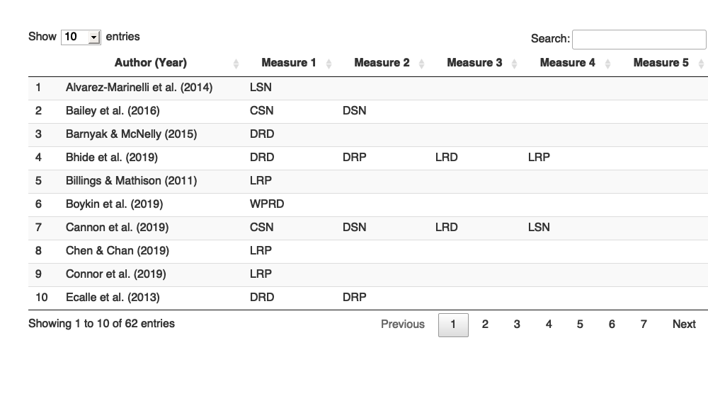

Metaanalysis Script
================
Saurabh Khanna
2020-04-10

  - [Reading in data](#reading-in-data)
  - [R Studies](#r-studies)
      - [Calculate effect sizes](#calculate-effect-sizes)
      - [Synthesizing effect sizes](#synthesizing-effect-sizes)
      - [Moderator effects](#moderator-effects)

``` r
# Libraries
library(tidyverse)
```

    ## ── Attaching packages ─────────────────────────────────────────────────────────────────────────────────────────────────────── tidyverse 1.3.0 ──

    ## ✓ ggplot2 3.3.0     ✓ purrr   0.3.3
    ## ✓ tibble  3.0.0     ✓ dplyr   0.8.5
    ## ✓ tidyr   1.0.2     ✓ stringr 1.4.0
    ## ✓ readr   1.3.1     ✓ forcats 0.5.0

    ## ── Conflicts ────────────────────────────────────────────────────────────────────────────────────────────────────────── tidyverse_conflicts() ──
    ## x dplyr::filter() masks stats::filter()
    ## x dplyr::lag()    masks stats::lag()

``` r
library(readxl)
library(metafor)
```

    ## Loading required package: Matrix

    ## 
    ## Attaching package: 'Matrix'

    ## The following objects are masked from 'package:tidyr':
    ## 
    ##     expand, pack, unpack

    ## Loading 'metafor' package (version 2.4-0). For an overview 
    ## and introduction to the package please type: help(metafor).

``` r
library(robumeta)

# Parameters
data_file <- here::here("data/L&L Data Set Means SDs.xlsx")
```

## Reading in data

``` r
# join checks
read_xlsx(data_file, sheet = "VR") %>% 
  select(AUTYR) %>% 
  drop_na(AUTYR) %>% 
  anti_join(
    read_xlsx(data_file, sheet = "StudyChar") %>% 
      select(AUTYR) %>% 
      drop_na(AUTYR),
    by = "AUTYR"
  )
```

    ## # A tibble: 0 x 1
    ## # … with 1 variable: AUTYR <chr>

``` r
read_xlsx(data_file, sheet = "VS") %>% 
  select(AUTYR) %>% 
  drop_na(AUTYR) %>% 
  anti_join(
    read_xlsx(data_file, sheet = "StudyChar") %>% 
      select(AUTYR) %>% 
      drop_na(AUTYR),
    by = "AUTYR"
  )
```

    ## # A tibble: 0 x 1
    ## # … with 1 variable: AUTYR <chr>

``` r
read_xlsx(data_file, sheet = "LR") %>% 
  select(AUTYR) %>% 
  drop_na(AUTYR) %>% 
  anti_join(
    read_xlsx(data_file, sheet = "StudyChar") %>% 
      select(AUTYR) %>% 
      drop_na(AUTYR),
    by = "AUTYR"
  )
```

    ## # A tibble: 0 x 1
    ## # … with 1 variable: AUTYR <chr>

``` r
read_xlsx(data_file, sheet = "LS") %>% 
  select(AUTYR) %>% 
  drop_na(AUTYR) %>% 
  anti_join(
    read_xlsx(data_file, sheet = "StudyChar") %>% 
      select(AUTYR) %>% 
      drop_na(AUTYR),
    by = "AUTYR"
  )
```

    ## # A tibble: 0 x 1
    ## # … with 1 variable: AUTYR <chr>

``` r
read_xlsx(data_file, sheet = "RR") %>% 
  select(AUTYR) %>% 
  drop_na(AUTYR) %>% 
  anti_join(
    read_xlsx(data_file, sheet = "StudyChar") %>% 
      select(AUTYR) %>% 
      drop_na(AUTYR),
    by = "AUTYR"
  )
```

    ## # A tibble: 0 x 1
    ## # … with 1 variable: AUTYR <chr>

``` r
read_xlsx(data_file, sheet = "RS") %>% 
  select(AUTYR) %>% 
  drop_na(AUTYR) %>% 
  anti_join(
    read_xlsx(data_file, sheet = "StudyChar") %>% 
      select(AUTYR) %>% 
      drop_na(AUTYR),
    by = "AUTYR"
  )
```

    ## New names:
    ## * TSRS1delay -> TSRS1delay...8
    ## * TSRS1delay -> TSRS1delay...9
    ## * TSRS2delay -> TSRS2delay...24
    ## * TSRS2delay -> TSRS2delay...25

    ## # A tibble: 0 x 1
    ## # … with 1 variable: AUTYR <chr>

All good\!

## R Studies

### Calculate effect sizes

#### Post only

``` r
df_r_post <-
  read_xlsx(data_file, sheet = "RR") %>% 
  rename_at(vars(-AUTYR), ~ str_replace(., "RR", "")) %>%
  bind_rows(
    "RR" = .,
    "RS" = read_xlsx(data_file, sheet = "RS") %>% rename_at(vars(-AUTYR), ~ str_replace(., "RS", "")),
    .id = "type"
  ) %>% 
  drop_na(AUTYR) %>%
  filter(is.na(TM1pre)) %>% 
  select_if(~ any(!is.na(.))) %>%
  select(AUTYR, type, sort(current_vars()))
```

    ## New names:
    ## * TSRS1delay -> TSRS1delay...8
    ## * TSRS1delay -> TSRS1delay...9
    ## * TSRS2delay -> TSRS2delay...24
    ## * TSRS2delay -> TSRS2delay...25

    ## Warning: current_vars() is deprecated. 
    ## Please use tidyselect::peek_vars() instead
    ## This warning is displayed once per session.

``` r
for (mt in 1:4) {
  for (mc in 1:4) {
    if (
      !(str_glue("TM{mt}post") %in% colnames(df_r_post)) | 
      !(str_glue("CM{mc}post") %in% colnames(df_r_post))
    ) {
      next
    }
    df_r_post <-
      escalc(
        data = df_r_post,
        measure = "SMD",
        m1i = df_r_post[, str_c("TM", mt, "post")] %>% unlist(),
        m2i = df_r_post[, str_c("CM", mc, "post")] %>% unlist(),
        sd1i = df_r_post[, str_c("TS", mt, "post")] %>% unlist(),
        sd2i = df_r_post[, str_c("CM", mc, "post")] %>% unlist(),
        n1i = df_r_post[, str_c("TN", mt, "post")] %>% unlist(),
        n2i = df_r_post[, str_c("CN", mc, "post")] %>% unlist(),
        var.names = c(str_glue("ES_TM{mt}_CM{mc}"), str_glue("EV_TM{mt}_CM{mc}"))
      ) 
  }
}


df_r_post <-
  df_r_post %>% 
  transmute(
    AUTYR, 
    type,
    ES =
      pmap_dbl(
        select(., starts_with("ES_")),
        ~ mean(c(...), na.rm = TRUE)
      ),
    EV =
      pmap_dbl(
        select(., starts_with("EV_")),
        ~ mean(c(...), na.rm = TRUE)
      )
  )
```

#### Pre and Post

``` r
df_r_prepost <-
  read_xlsx(data_file, sheet = "RR") %>% 
  rename_at(vars(-AUTYR), ~ str_replace(., "RR", "")) %>%
  bind_rows(
    "RR" = .,
    "RS" = read_xlsx(data_file, sheet = "RS") %>% rename_at(vars(-AUTYR), ~ str_replace(., "RS", "")),
    .id = "type"
  ) %>% 
  drop_na(AUTYR) %>%
  filter(!is.na(TM1pre)) %>% 
  select_if(~ any(!is.na(.))) %>%
  select(AUTYR, type, sort(current_vars()))
```

    ## New names:
    ## * TSRS1delay -> TSRS1delay...8
    ## * TSRS1delay -> TSRS1delay...9
    ## * TSRS2delay -> TSRS2delay...24
    ## * TSRS2delay -> TSRS2delay...25

``` r
# treatment (post-pre)
for (mt in 1:4) {
  for (mc in 1:4) {
    if (
      !(str_glue("TM{mt}post") %in% colnames(df_r_prepost)) | 
      !(str_glue("TM{mt}pre") %in% colnames(df_r_prepost))
    ) {
      next
    }
    df_r_prepost <-
      escalc(
        data = df_r_prepost,
        measure = "SMCR",
        m1i = df_r_prepost[, str_c("TM", mt, "post")] %>% unlist(),
        m2i = df_r_prepost[, str_c("TM", mt, "pre")] %>% unlist(),
        sd1i = df_r_prepost[, str_c("TS", mt, "pre")] %>% unlist(),
        ni = df_r_prepost[, str_c("TN", mt, "post")] %>% unlist(),
        ri = rep(0.7, 19),
        var.names = c(str_glue("TES_TM{mt}_CM{mc}"), str_glue("TEV_TM{mt}_CM{mc}"))
      ) 
  }
}

# control (post-pre)
for (mt in 1:4) {
  for (mc in 1:4) {
    if (
      !(str_glue("CM{mc}post") %in% colnames(df_r_prepost)) | 
      !(str_glue("CM{mc}pre") %in% colnames(df_r_prepost))
    ) {
      next
    }
    df_r_prepost <-
      escalc(
        data = df_r_prepost,
        measure = "SMCR",
        m1i = df_r_prepost[, str_c("CM", mc, "post")] %>% unlist(),
        m2i = df_r_prepost[, str_c("CM", mc, "pre")] %>% unlist(),
        sd1i = df_r_prepost[, str_c("CS", mc, "pre")] %>% unlist(),
        ni = df_r_prepost[, str_c("CN", mc, "post")] %>% unlist(),
        ri = rep(0.7, 19),
        var.names = c(str_glue("CES_TM{mt}_CM{mc}"), str_glue("CEV_TM{mt}_CM{mc}"))
      ) 
  }
}

# ES and EV taken together
for (mt in 1:4) {
  for (mc in 1:4) {
    if (
      !(str_glue("TES_TM{mt}_CM{mc}") %in% colnames(df_r_prepost)) | 
      !(str_glue("TEV_TM{mt}_CM{mc}") %in% colnames(df_r_prepost)) |
      !(str_glue("CES_TM{mt}_CM{mc}") %in% colnames(df_r_prepost)) | 
      !(str_glue("CEV_TM{mt}_CM{mc}") %in% colnames(df_r_prepost))
    ) {
      next
    }
    # subtracting effect size
    df_r_prepost[, str_c("ES_TM", mt, "_CM", mc)] <- 
      (df_r_prepost[, str_c("TES_TM", mt, "_CM", mc)] %>% unlist()) -
      (df_r_prepost[, str_c("CES_TM", mt, "_CM", mc)] %>% unlist())
    # adding variance
    df_r_prepost[, str_c("EV_TM", mt, "_CM", mc)] <- 
      (df_r_prepost[, str_c("TEV_TM", mt, "_CM", mc)] %>% unlist()) +
      (df_r_prepost[, str_c("CEV_TM", mt, "_CM", mc)] %>% unlist())
  }
}


df_r_prepost <- 
  df_r_prepost %>% 
  transmute(
    AUTYR, 
    type,
    ES =
      pmap_dbl(
        select(., starts_with("ES_")),
        ~ mean(c(...), na.rm = TRUE)
      ),
    EV =
      pmap_dbl(
        select(., starts_with("EV_")),
        ~ mean(c(...), na.rm = TRUE)
      )
  )
```

### Synthesizing effect sizes

``` r
# Combining all R studies in a single tibble
df_r <- bind_rows(df_r_post, df_r_prepost) %>% arrange(type, AUTYR)

df_r %>% knitr::kable()
```

| AUTYR            | type |          ES |        EV |
| :--------------- | :--: | ----------: | --------: |
| Berry13          |  RR  | \-0.3571446 | 1.2383362 |
| Dalton11\_V      |  RR  |   0.0995073 | 0.0543501 |
| Dalton11\_VC     |  RR  |   0.1255728 | 0.0579221 |
| Graham15         |  RR  |   0.1519858 | 0.0106017 |
| Silverman17a\_4  |  RR  |   0.8508342 | 0.0139246 |
| VadSanHer15      |  RR  |   0.2178669 | 0.0020603 |
| Apel14\_1        |  RS  |   0.3604871 | 0.0768706 |
| Apel14\_2        |  RS  | \-0.0919161 | 0.0553390 |
| Connor18\_3\_COM |  RS  |   0.0074417 | 0.0208056 |
| Connor18\_3\_ERC |  RS  | \-0.0044229 | 0.0201864 |
| Connor18\_3\_LIM |  RS  | \-0.0039575 | 0.0198170 |
| Connor18\_4\_ERC |  RS  | \-0.0055516 | 0.0179116 |
| Dalton11\_V      |  RS  |   0.0289196 | 0.0540992 |
| Dalton11\_VC     |  RS  |   0.0059258 | 0.0575660 |
| Daunic13         |  RS  | \-0.2206484 | 0.0596250 |
| Jones19\_1       |  RS  |   0.0537309 | 0.0010934 |
| Jones19\_2       |  RS  |   0.1929975 | 0.0011084 |
| Morris12         |  RS  |   0.2364356 | 0.0196849 |
| Proctor11        |  RS  | \-0.0436775 | 0.0105416 |
| Proctor19        |  RS  |   0.2331418 | 0.0124730 |
| Silverman17a\_4  |  RS  | \-0.0014823 | 0.0045630 |
| Silverman17b\_4  |  RS  | \-0.1127521 | 0.0114530 |
| Simmons10\_CALT  |  RS  | \-0.0568601 | 0.0044384 |
| Simmons10\_CBAU  |  RS  | \-0.0727496 | 0.0054170 |
| Tong10\_B        |  RS  |   0.0172740 | 0.0777953 |
| Tong10\_G        |  RS  |   0.2822964 | 0.0908513 |
| VadSanHer15      |  RS  |   0.0500486 | 0.0020736 |

``` r
# All R studies (REML)
df_r %>% 
  rma(
    yi = ES, 
    vi = EV, 
    data = ., 
    method = "REML",
    slab = AUTYR
  )
```

    ## 
    ## Random-Effects Model (k = 27; tau^2 estimator: REML)
    ## 
    ## tau^2 (estimated amount of total heterogeneity): 0.0273 (SE = 0.0121)
    ## tau (square root of estimated tau^2 value):      0.1651
    ## I^2 (total heterogeneity / total variability):   79.49%
    ## H^2 (total variability / sampling variability):  4.88
    ## 
    ## Test for Heterogeneity:
    ## Q(df = 26) = 86.3072, p-val < .0001
    ## 
    ## Model Results:
    ## 
    ## estimate      se    zval    pval   ci.lb   ci.ub 
    ##   0.0888  0.0420  2.1138  0.0345  0.0065  0.1711  * 
    ## 
    ## ---
    ## Signif. codes:  0 '***' 0.001 '**' 0.01 '*' 0.05 '.' 0.1 ' ' 1

``` r
# All R studies (Forest plot)
df_r %>% 
  rma(
    yi = ES, 
    vi = EV, 
    data = ., 
    method = "REML",
    slab = AUTYR
  ) %>% 
  forest(
    order = "obs",
    xlab = "Reading Comprehension",
    addcred = T, 
    header = T
  )
```


``` r
# All RR studies (REML)
df_r %>% 
  filter(type == "RR") %>% 
  rma(
    yi = ES, 
    vi = EV, 
    data = ., 
    method = "REML",
    slab = AUTYR
  )
```

    ## 
    ## Random-Effects Model (k = 6; tau^2 estimator: REML)
    ## 
    ## tau^2 (estimated amount of total heterogeneity): 0.0866 (SE = 0.0771)
    ## tau (square root of estimated tau^2 value):      0.2943
    ## I^2 (total heterogeneity / total variability):   84.88%
    ## H^2 (total variability / sampling variability):  6.61
    ## 
    ## Test for Heterogeneity:
    ## Q(df = 5) = 28.0725, p-val < .0001
    ## 
    ## Model Results:
    ## 
    ## estimate      se    zval    pval   ci.lb   ci.ub 
    ##   0.2980  0.1470  2.0272  0.0426  0.0099  0.5860  * 
    ## 
    ## ---
    ## Signif. codes:  0 '***' 0.001 '**' 0.01 '*' 0.05 '.' 0.1 ' ' 1

``` r
# All RS studies (REML)
df_r %>% 
  filter(type == "RS") %>% 
  rma(
    yi = ES, 
    vi = EV, 
    data = ., 
    method = "REML",
    slab = AUTYR
  )
```

    ## 
    ## Random-Effects Model (k = 21; tau^2 estimator: REML)
    ## 
    ## tau^2 (estimated amount of total heterogeneity): 0.0054 (SE = 0.0045)
    ## tau (square root of estimated tau^2 value):      0.0738
    ## I^2 (total heterogeneity / total variability):   44.77%
    ## H^2 (total variability / sampling variability):  1.81
    ## 
    ## Test for Heterogeneity:
    ## Q(df = 20) = 34.9346, p-val = 0.0205
    ## 
    ## Model Results:
    ## 
    ## estimate      se    zval    pval    ci.lb   ci.ub 
    ##   0.0395  0.0288  1.3709  0.1704  -0.0170  0.0959    
    ## 
    ## ---
    ## Signif. codes:  0 '***' 0.001 '**' 0.01 '*' 0.05 '.' 0.1 ' ' 1

### Moderator effects

``` r
df_r %>% 
  left_join(
    read_xlsx(data_file, sheet = "StudyChar") %>% 
      drop_na(AUTYR),
    by = "AUTYR"
  ) %>%
  mutate(
    Hours = Hours %>% parse_number()
  ) %>%
  rma(
    yi = ES, 
    vi = EV, 
    data = ., 
    method = "REML",
    slab = AUTYR,
    mods = ~ factor(TMULT)
  )
```

    ## 
    ## Mixed-Effects Model (k = 27; tau^2 estimator: REML)
    ## 
    ## tau^2 (estimated amount of residual heterogeneity):     0.0291 (SE = 0.0130)
    ## tau (square root of estimated tau^2 value):             0.1706
    ## I^2 (residual heterogeneity / unaccounted variability): 80.70%
    ## H^2 (unaccounted variability / sampling variability):   5.18
    ## R^2 (amount of heterogeneity accounted for):            0.00%
    ## 
    ## Test for Residual Heterogeneity:
    ## QE(df = 25) = 86.3001, p-val < .0001
    ## 
    ## Test of Moderators (coefficient 2):
    ## QM(df = 1) = 0.0214, p-val = 0.8837
    ## 
    ## Model Results:
    ## 
    ##                 estimate      se    zval    pval    ci.lb   ci.ub 
    ## intrcpt           0.0859  0.0471  1.8250  0.0680  -0.0064  0.1781  . 
    ## factor(TMULT)1    0.0169  0.1153  0.1463  0.8837  -0.2092  0.2429    
    ## 
    ## ---
    ## Signif. codes:  0 '***' 0.001 '**' 0.01 '*' 0.05 '.' 0.1 ' ' 1

``` r
df_r %>% 
  left_join(
    read_xlsx(data_file, sheet = "StudyChar") %>% 
      drop_na(AUTYR),
    by = "AUTYR"
  ) %>%
  mutate(
    Hours = Hours %>% parse_number()
  ) %>%
  rma(
    yi = ES, 
    vi = EV, 
    data = ., 
    method = "REML",
    slab = AUTYR,
    mods = ~ factor(TMULT)
  ) %>% 
  forest(
    order = "obs",
    xlab = "Reading Comprehension",
    addcred = T, 
    header = T
  )
```

<!-- -->
