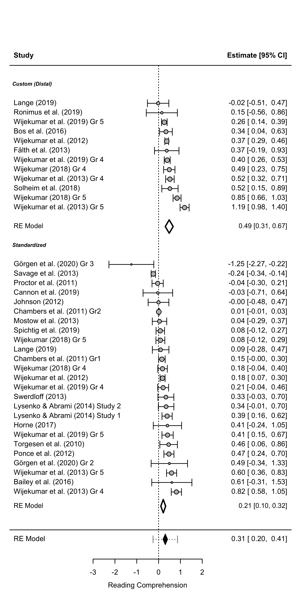

Meta-analysis Script
================
Saurabh Khanna
2020-04-26

  - [Reading in data](#reading-in-data)
  - [Calculate effect sizes](#calculate-effect-sizes)
      - [Post only](#post-only)
      - [Pre and Post](#pre-and-post)
      - [Directly entered ES](#directly-entered-es)
      - [Combining all](#combining-all)
      - [Summary stats](#summary-stats)
  - [Synthesizing effect sizes](#synthesizing-effect-sizes)
      - [Vocabulary](#vocabulary)
      - [Listening Comprehension](#listening-comprehension)
      - [Reading Comprehension](#reading-comprehension)
      - [Morphology](#morphology)
      - [Syntax](#syntax)
      - [Academic Learning](#academic-learning)
  - [Synthesizing effect sizes (Excluding Daunic RS, Simmons VR, Nelson,
    VadSan15,
    VadSan16)](#synthesizing-effect-sizes-excluding-daunic-rs-simmons-vr-nelson-vadsan15-vadsan16)
      - [Vocabulary](#vocabulary-1)
      - [Listening Comprehension](#listening-comprehension-1)
      - [Reading Comprehension](#reading-comprehension-1)
      - [Morphology](#morphology-1)
      - [Syntax](#syntax-1)
      - [Academic Learning](#academic-learning-1)
  - [MetaForest plots](#metaforest-plots)
      - [Vocabulary](#vocabulary-2)
      - [Listening Comprehension](#listening-comprehension-2)
      - [Reading Comprehension](#reading-comprehension-2)

``` r
# Libraries
library(tidyverse)
```

    ## ── Attaching packages ─────────────────────────────────────────────────────────────────────────────────────────────────────── tidyverse 1.3.0 ──

    ## ✓ ggplot2 3.3.0     ✓ purrr   0.3.4
    ## ✓ tibble  3.0.1     ✓ dplyr   0.8.5
    ## ✓ tidyr   1.0.2     ✓ stringr 1.4.0
    ## ✓ readr   1.3.1     ✓ forcats 0.5.0

    ## ── Conflicts ────────────────────────────────────────────────────────────────────────────────────────────────────────── tidyverse_conflicts() ──
    ## x dplyr::filter() masks stats::filter()
    ## x dplyr::lag()    masks stats::lag()

``` r
library(readxl)
library(metafor)
```

    ## Loading required package: Matrix

    ## 
    ## Attaching package: 'Matrix'

    ## The following objects are masked from 'package:tidyr':
    ## 
    ##     expand, pack, unpack

    ## Loading 'metafor' package (version 2.4-0). For an overview 
    ## and introduction to the package please type: help(metafor).

``` r
library(MAd)
library(metaforest)
```

    ## Loading required package: ranger

    ## Loading required package: data.table

    ## 
    ## Attaching package: 'data.table'

    ## The following objects are masked from 'package:dplyr':
    ## 
    ##     between, first, last

    ## The following object is masked from 'package:purrr':
    ## 
    ##     transpose

``` r
# Parameters
data_file <- here::here("data/L&L Data Set Means SDs.xlsx")
```

## Reading in data

``` r
# join checks
read_xlsx(data_file, sheet = "VR") %>% 
  select(AUTYR) %>% 
  drop_na(AUTYR) %>% 
  anti_join(
    read_xlsx(data_file, sheet = "StudyChar") %>% 
      select(AUTYR) %>% 
      drop_na(AUTYR),
    by = "AUTYR"
  )
```

    ## # A tibble: 0 x 1
    ## # … with 1 variable: AUTYR <chr>

``` r
read_xlsx(data_file, sheet = "VS") %>% 
  select(AUTYR) %>% 
  drop_na(AUTYR) %>% 
  anti_join(
    read_xlsx(data_file, sheet = "StudyChar") %>% 
      select(AUTYR) %>% 
      drop_na(AUTYR),
    by = "AUTYR"
  )
```

    ## # A tibble: 0 x 1
    ## # … with 1 variable: AUTYR <chr>

``` r
read_xlsx(data_file, sheet = "LR") %>% 
  select(AUTYR) %>% 
  drop_na(AUTYR) %>% 
  anti_join(
    read_xlsx(data_file, sheet = "StudyChar") %>% 
      select(AUTYR) %>% 
      drop_na(AUTYR),
    by = "AUTYR"
  )
```

    ## # A tibble: 0 x 1
    ## # … with 1 variable: AUTYR <chr>

``` r
read_xlsx(data_file, sheet = "LS") %>% 
  select(AUTYR) %>% 
  drop_na(AUTYR) %>% 
  anti_join(
    read_xlsx(data_file, sheet = "StudyChar") %>% 
      select(AUTYR) %>% 
      drop_na(AUTYR),
    by = "AUTYR"
  )
```

    ## # A tibble: 0 x 1
    ## # … with 1 variable: AUTYR <chr>

``` r
read_xlsx(data_file, sheet = "RR") %>% 
  select(AUTYR) %>% 
  drop_na(AUTYR) %>% 
  anti_join(
    read_xlsx(data_file, sheet = "StudyChar") %>% 
      select(AUTYR) %>% 
      drop_na(AUTYR),
    by = "AUTYR"
  )
```

    ## # A tibble: 0 x 1
    ## # … with 1 variable: AUTYR <chr>

``` r
read_xlsx(data_file, sheet = "RS") %>% 
  select(AUTYR) %>% 
  drop_na(AUTYR) %>% 
  anti_join(
    read_xlsx(data_file, sheet = "StudyChar") %>% 
      select(AUTYR) %>% 
      drop_na(AUTYR),
    by = "AUTYR"
  )
```

    ## # A tibble: 0 x 1
    ## # … with 1 variable: AUTYR <chr>

All good\!

## Calculate effect sizes

### Post only

``` r
df_post <-
  bind_rows(
    "VR" = read_xlsx(data_file, sheet = "VR") %>% rename_at(vars(-AUTYR), ~ str_replace(., "VR", "")),
    "VS" = read_xlsx(data_file, sheet = "VS") %>% rename_at(vars(-AUTYR), ~ str_replace(., "VS", "")),
    "RR" = read_xlsx(data_file, sheet = "RR") %>% rename_at(vars(-AUTYR), ~ str_replace(., "RR", "")),
    "RS" = read_xlsx(data_file, sheet = "RS") %>% rename_at(vars(-AUTYR), ~ str_replace(., "RS", "")),
    "LR" = read_xlsx(data_file, sheet = "LR") %>% rename_at(vars(-AUTYR), ~ str_replace(., "LR", "")),
    "LS" = read_xlsx(data_file, sheet = "LS") %>% rename_at(vars(-AUTYR), ~ str_replace(., "LS", "")),
    "MR" = read_xlsx(data_file, sheet = "MR") %>% rename_at(vars(-AUTYR), ~ str_replace(., "MR", "")),
    "MS" = read_xlsx(data_file, sheet = "MS") %>% rename_at(vars(-AUTYR), ~ str_replace(., "MS", "")),
    "SR" = read_xlsx(data_file, sheet = "SR") %>% rename_at(vars(-AUTYR), ~ str_replace(., "SR", "")),
    "SS" = read_xlsx(data_file, sheet = "SS") %>% rename_at(vars(-AUTYR), ~ str_replace(., "SS", "")),
    "AS" = read_xlsx(data_file, sheet = "AS") %>% rename_at(vars(-AUTYR), ~ str_replace(., "AS", "")),
    .id = "type"
  ) %>% 
  drop_na(AUTYR) %>%
  filter(is.na(TM1pre)) %>% 
  select_if(~ any(!is.na(.))) %>%
  select(AUTYR, type, sort(current_vars()))
```

    ## Warning: current_vars() is deprecated. 
    ## Please use tidyselect::peek_vars() instead
    ## This warning is displayed once per session.

``` r
for (mt in 1:4) {
  for (mc in 1:4) {
    if (
      !(str_glue("TM{mt}post") %in% colnames(df_post)) | 
      !(str_glue("CM{mc}post") %in% colnames(df_post))
    ) {
      next
    }
    df_post <-
      escalc(
        data = df_post,
        measure = "SMD",
        m1i = df_post[, str_c("TM", mt, "post")] %>% unlist(),
        m2i = df_post[, str_c("CM", mc, "post")] %>% unlist(),
        sd1i = df_post[, str_c("TS", mt, "post")] %>% unlist(),
        sd2i = df_post[, str_c("CS", mc, "post")] %>% unlist(),
        n1i = df_post[, str_c("TN", mt, "post")] %>% unlist(),
        n2i = df_post[, str_c("CN", mc, "post")] %>% unlist(),
        var.names = c(str_glue("ES_TM{mt}_CM{mc}"), str_glue("EV_TM{mt}_CM{mc}"))
      ) 
  }
}


df_post <-
  df_post %>% 
  transmute(
    AUTYR, 
    type,
    ES =
      pmap_dbl(
        select(., starts_with("ES_")),
        ~ mean(c(...), na.rm = TRUE)
      ),
    EV =
      pmap_dbl(
        select(., starts_with("EV_")),
        ~ mean(c(...), na.rm = TRUE)
      )
  )
```

### Pre and Post

``` r
df_prepost <-
  bind_rows(
    "VR" = read_xlsx(data_file, sheet = "VR") %>% rename_at(vars(-AUTYR), ~ str_replace(., "VR", "")),
    "VS" = read_xlsx(data_file, sheet = "VS") %>% rename_at(vars(-AUTYR), ~ str_replace(., "VS", "")),
    "RR" = read_xlsx(data_file, sheet = "RR") %>% rename_at(vars(-AUTYR), ~ str_replace(., "RR", "")),
    "RS" = read_xlsx(data_file, sheet = "RS") %>% rename_at(vars(-AUTYR), ~ str_replace(., "RS", "")),
    "LR" = read_xlsx(data_file, sheet = "LR") %>% rename_at(vars(-AUTYR), ~ str_replace(., "LR", "")),
    "LS" = read_xlsx(data_file, sheet = "LS") %>% rename_at(vars(-AUTYR), ~ str_replace(., "LS", "")),
    "MR" = read_xlsx(data_file, sheet = "MR") %>% rename_at(vars(-AUTYR), ~ str_replace(., "MR", "")),
    "MS" = read_xlsx(data_file, sheet = "MS") %>% rename_at(vars(-AUTYR), ~ str_replace(., "MS", "")),
    "SR" = read_xlsx(data_file, sheet = "SR") %>% rename_at(vars(-AUTYR), ~ str_replace(., "SR", "")),
    "SS" = read_xlsx(data_file, sheet = "SS") %>% rename_at(vars(-AUTYR), ~ str_replace(., "SS", "")),
    "AS" = read_xlsx(data_file, sheet = "AS") %>% rename_at(vars(-AUTYR), ~ str_replace(., "AS", "")),
    .id = "type"
  ) %>% 
  drop_na(AUTYR) %>%
  filter(!is.na(TM1pre)) %>% 
  select_if(~ any(!is.na(.))) %>%
  select(AUTYR, type, sort(current_vars())) %>% 
  mutate(
    TN1post = if_else(is.na(TN1post) & !is.na(TN1pre), TN1pre, TN1post),
    TN2post = if_else(is.na(TN2post) & !is.na(TN2pre), TN2pre, TN2post),
    CN1post = if_else(is.na(CN1post) & !is.na(CN1pre), CN1pre, CN1post),
    CN2post = if_else(is.na(CN2post) & !is.na(CN2pre), CN2pre, CN2post)
  )


# treatment (post-pre)
for (mt in 1:4) {
  if (
    !(str_glue("TM{mt}post") %in% colnames(df_prepost)) | 
    !(str_glue("TM{mt}pre") %in% colnames(df_prepost))
  ) {
    next
  }
  df_prepost <-
    escalc(
      data = df_prepost,
      measure = "SMCR",
      m1i = df_prepost[, str_c("TM", mt, "post")] %>% unlist(),
      m2i = df_prepost[, str_c("TM", mt, "pre")] %>% unlist(),
      sd1i = df_prepost[, str_c("TS", mt, "pre")] %>% unlist(),
      ni = df_prepost[, str_c("TN", mt, "post")] %>% unlist(),
      ri = rep(0.5, 84),
      var.names = c(str_glue("TES_TM{mt}"), str_glue("TEV_TM{mt}"))
    ) 
}

# control (post-pre)
for (mc in 1:4) {
  if (
    !(str_glue("CM{mc}post") %in% colnames(df_prepost)) | 
    !(str_glue("CM{mc}pre") %in% colnames(df_prepost))
  ) {
    next
  }
  df_prepost <-
    escalc(
      data = df_prepost,
      measure = "SMCR",
      m1i = df_prepost[, str_c("CM", mc, "post")] %>% unlist(),
      m2i = df_prepost[, str_c("CM", mc, "pre")] %>% unlist(),
      sd1i = df_prepost[, str_c("CS", mc, "pre")] %>% unlist(),
      ni = df_prepost[, str_c("CN", mc, "post")] %>% unlist(),
      ri = rep(0.5, 84),
      var.names = c(str_glue("CES_CM{mc}"), str_glue("CEV_CM{mc}"))
    ) 
}


# ES and EV taken together
for (m in 1:4) {
  if (
    !(str_glue("TES_TM{m}") %in% colnames(df_prepost)) | 
    !(str_glue("TEV_TM{m}") %in% colnames(df_prepost)) |
    !(str_glue("CES_CM{m}") %in% colnames(df_prepost)) | 
    !(str_glue("CEV_CM{m}") %in% colnames(df_prepost))
  ) {
    next
  }
  # subtracting effect size
  df_prepost[, str_c("ES_TM", m, "_CM", m)] <- 
    (df_prepost[, str_c("TES_TM", m)] %>% unlist()) -
    (df_prepost[, str_c("CES_CM", m)] %>% unlist())
  # adding variance
  df_prepost[, str_c("EV_TM", m, "_CM", m)] <- 
    (df_prepost[, str_c("TEV_TM", m)] %>% unlist()) +
    (df_prepost[, str_c("CEV_CM", m)] %>% unlist())
}


df_prepost <- 
  df_prepost %>% 
  transmute(
    AUTYR, 
    type,
    ES =
      pmap_dbl(
        select(., starts_with("ES_")),
        ~ mean(c(...), na.rm = TRUE)
      ),
    EV =
      pmap_dbl(
        select(., starts_with("EV_")),
        ~ mean(c(...), na.rm = TRUE)
      )
  )
```

### Directly entered ES

``` r
df_es_direct <-
  tribble(
    ~AUTYR,        ~type, ~ES, ~EV,
    
    # "Apthorp12_K", "VR",  0.98, 0,
    # "Apthorp12_1", "VR",  1.00, 0,
    # "Apthorp12_3", "VR",  0.95, 0,
    # "Apthorp12_4", "VR",  1.24, 0,
    
    # "Apthorp12_P", "VS",  0.06, 0,
    # "Apthorp12_I", "VS", -0.14, 0,
    "Gersten10",   "VS",  0.33, 0.05,
    "Jayanthi18",  "VS", -0.043, 0.001,

    # "Apthorp12_K", "LR",  0.24, 0,
    # "Apthorp12_1", "LR",  0.21, 0,
    # 
    # "Apthorp12_P", "LS",  0.05, 0,
    # 
    # "Apthorp12_3", "RR",  0.09, 0,
    # "Apthorp12_4", "RR",  0.44, 0,
    # 
    # "Apthorp12_I", "RS", -0.11, 0,
    "Gersten10",   "RS",  0.13, 0.04
  )
```

### Combining all

``` r
df_append <- 
  bind_rows(df_post, df_prepost, df_es_direct) %>% 
  left_join(
    read_xlsx(data_file, sheet = "StudyChar") %>% 
      drop_na(AUTYR),
    by = "AUTYR"
  ) %>%
  mutate(
    Hours = Hours %>% parse_number(),
    CONT = recode(CONT, "BAU" = "0", "ALT" = "1") %>% as.integer()
  ) %>%
  arrange(type, stdid) %>%
  select(type, stdid, AUTYR, everything())
  
cor_es <-
  df_append %>%
  unite("type_stdid", c("type", "stdid")) %>% 
  agg(id = type_stdid, es = ES, var = EV, method = "BHHR", data = .) %>% 
  separate(id, c("type", "stdid")) %>% 
  rename(ES = es, EV = var)

df_clean <-
  df_append %>%
  group_by(type, stdid) %>% 
  summarize_at(vars(TMULT:Hours), ~ round(mean(.))) %>%
  ungroup() %>%
  left_join(cor_es, by = c("type", "stdid")) %>% 
  select(type, stdid, ES, EV, everything()) %>% 
  mutate(
    design = case_when(
      RCT == 1 ~ "RCT",
      QED == 1 ~ "QED",
      WSD == 1 ~ "WSD",
      TRUE ~ NA_character_
    ) %>% as_factor(),
    grade = case_when(
      (GradeK + Grade1 + Grade2) > 0 & (Grade3 + Grade4 + Grade5) == 0 ~ "K-2",
      (Grade3 + Grade4 + Grade5) > 0 & (GradeK + Grade1 + Grade2) == 0 ~ "3-5",
      TRUE ~ "Both"
    ) %>% as_factor(),
    grouping = case_when(
      ((WholeCl + SmallGr) == 2) | ((WholeCl + Indiv) == 2) ~ "Combination",
      WholeCl == 1 ~ "Whole class",
      (SmallGr == 1) | (Indiv == 1) ~ "Small or Indiv",
      TRUE ~ NA_character_
    ) %>% as_factor(),
    type = type %>% as_factor(),
    CONT = CONT %>% factor(labels = c("BAU", "ALT")),
    TCOM = if_else(TLC == 1 | TRC == 1, 1, 0)
  ) %>%
  select(-c(RCT, QED, WSD, WholeCl, SmallGr, Indiv), -starts_with("Grade", ignore.case = F)) %>% 
  left_join(
    read_xlsx(data_file, sheet = "citations"),
    by = c("type", "stdid")
  )
```

    ## Warning: Column `type` joining factor and character vector, coercing into
    ## character vector

``` r
rm(df_post, df_prepost, df_es_direct, df_append, cor_es)

#df_clean %>% knitr::kable()
```

### Summary stats

``` r
df_clean %>% count(stdid)
```

    ## # A tibble: 58 x 2
    ##    stdid     n
    ##    <chr> <int>
    ##  1 Apel1     2
    ##  2 Apel2     2
    ##  3 ApelK     1
    ##  4 Apth1     2
    ##  5 Apth3     2
    ##  6 ApthK     2
    ##  7 ApthP     2
    ##  8 Arth1     1
    ##  9 Arth2     1
    ## 10 Arth3     1
    ## # … with 48 more rows

``` r
#df_clean %>% arrange(type, ES) %>% writexl::write_xlsx("df_clean.xlsx")
#df_clean %>% select(stdid, type) %>% arrange(stdid, type) %>% writexl::write_xlsx("temp.xlsx")
df_clean %>% count(type, stdid)
```

    ## # A tibble: 115 x 3
    ##    type  stdid       n
    ##    <chr> <chr>   <int>
    ##  1 AS    Jones1      1
    ##  2 AS    Jones2      1
    ##  3 AS    Proc19      1
    ##  4 LR    Apth1       1
    ##  5 LR    ApthK       1
    ##  6 LR    Baker       1
    ##  7 LR    Coyne10     1
    ##  8 LR    Coyne19     1
    ##  9 LR    Jiang1      1
    ## 10 LR    Jiang2      1
    ## # … with 105 more rows

``` r
df_v <- df_clean %>% filter(type %in% c("VR", "VS"))
df_l <- df_clean %>% filter(type %in% c("LR", "LS"))
df_r <- df_clean %>% filter(type %in% c("RR", "RS"))
df_m <- df_clean %>% filter(type %in% c("MR", "MS"))
df_s <- df_clean %>% filter(type %in% c("SR", "SS"))
df_a <- df_clean %>% filter(type == "AS")
```

## Synthesizing effect sizes

### Vocabulary

``` r
model_1 <-
  df_v %>%
  arrange(desc(type), desc(ES)) %>% 
  rma(
    yi = ES, 
    vi = EV, 
    data = ., 
    method = "REML",
    slab = stdid
  )

model_2 <-
  df_v %>%
  rma(
    yi = ES, 
    vi = EV, 
    data = ., 
    method = "REML",
    subset = (type == "VR"),
    slab = stdid
  )

model_3 <-
  df_v %>%
  rma(
    yi = ES, 
    vi = EV, 
    data = ., 
    method = "REML",
    subset = (type == "VS"),
    slab = stdid
  )

model_1
```

    ## 
    ## Random-Effects Model (k = 68; tau^2 estimator: REML)
    ## 
    ## tau^2 (estimated amount of total heterogeneity): 1.2132 (SE = 0.2205)
    ## tau (square root of estimated tau^2 value):      1.1014
    ## I^2 (total heterogeneity / total variability):   99.13%
    ## H^2 (total variability / sampling variability):  114.51
    ## 
    ## Test for Heterogeneity:
    ## Q(df = 67) = 2184.8689, p-val < .0001
    ## 
    ## Model Results:
    ## 
    ## estimate      se    zval    pval   ci.lb   ci.ub 
    ##   0.8727  0.1371  6.3637  <.0001  0.6039  1.1415  *** 
    ## 
    ## ---
    ## Signif. codes:  0 '***' 0.001 '**' 0.01 '*' 0.05 '.' 0.1 ' ' 1

``` r
  model_2
```

    ## 
    ## Random-Effects Model (k = 44; tau^2 estimator: REML)
    ## 
    ## tau^2 (estimated amount of total heterogeneity): 1.4094 (SE = 0.3205)
    ## tau (square root of estimated tau^2 value):      1.1872
    ## I^2 (total heterogeneity / total variability):   99.10%
    ## H^2 (total variability / sampling variability):  111.38
    ## 
    ## Test for Heterogeneity:
    ## Q(df = 43) = 1274.4054, p-val < .0001
    ## 
    ## Model Results:
    ## 
    ## estimate      se    zval    pval   ci.lb   ci.ub 
    ##   1.3139  0.1840  7.1415  <.0001  0.9533  1.6746  *** 
    ## 
    ## ---
    ## Signif. codes:  0 '***' 0.001 '**' 0.01 '*' 0.05 '.' 0.1 ' ' 1

``` r
model_3
```

    ## 
    ## Random-Effects Model (k = 24; tau^2 estimator: REML)
    ## 
    ## tau^2 (estimated amount of total heterogeneity): 0.0013 (SE = 0.0024)
    ## tau (square root of estimated tau^2 value):      0.0359
    ## I^2 (total heterogeneity / total variability):   12.12%
    ## H^2 (total variability / sampling variability):  1.14
    ## 
    ## Test for Heterogeneity:
    ## Q(df = 23) = 29.6378, p-val = 0.1601
    ## 
    ## Model Results:
    ## 
    ## estimate      se    zval    pval    ci.lb   ci.ub 
    ##   0.0221  0.0227  0.9725  0.3308  -0.0225  0.0667    
    ## 
    ## ---
    ## Signif. codes:  0 '***' 0.001 '**' 0.01 '*' 0.05 '.' 0.1 ' ' 1

``` r
df_v %>% count(type)
```

    ## # A tibble: 2 x 2
    ##   type      n
    ##   <chr> <int>
    ## 1 VR       44
    ## 2 VS       24

``` r
forest(
  model_1,
  xlab = "Vocabulary",
  addcred = T, 
  header = T,
  #xlim = c(-5, 8),
  ylim = c(-1, 85),
  rows = c(3:26, 34:77),
  pch = 21,
  bg = "grey",
  lwd = 1.5
)
op <- par(cex = 0.75, font = 4)
text(-11.5, c(29, 80), pos = 4, c("Standardized Measure", "Custom Measure"))
addpoly(model_2, row = 32, cex = 1.25, col = "white", lwd = 3)
addpoly(model_3, row = 1.5, cex = 1.25, col = "white", lwd = 3)
```


### Listening Comprehension

``` r
model_1 <-
  df_l %>%
  arrange(desc(type), desc(ES)) %>%  
  rma(
    yi = ES, 
    vi = EV, 
    data = ., 
    method = "REML",
    slab = citation
  )

model_2 <-
  df_l %>%
  rma(
    yi = ES, 
    vi = EV, 
    data = ., 
    method = "REML",
    subset = (type == "LR"),
    slab = stdid
  )

model_3 <-
  df_l %>%
  rma(
    yi = ES, 
    vi = EV, 
    data = ., 
    method = "REML",
    subset = (type == "LS"),
    slab = stdid
  )

model_1
```

    ## 
    ## Random-Effects Model (k = 16; tau^2 estimator: REML)
    ## 
    ## tau^2 (estimated amount of total heterogeneity): 0.2081 (SE = 0.0906)
    ## tau (square root of estimated tau^2 value):      0.4562
    ## I^2 (total heterogeneity / total variability):   95.95%
    ## H^2 (total variability / sampling variability):  24.66
    ## 
    ## Test for Heterogeneity:
    ## Q(df = 15) = 131.2093, p-val < .0001
    ## 
    ## Model Results:
    ## 
    ## estimate      se    zval    pval    ci.lb   ci.ub 
    ##   0.1187  0.1251  0.9489  0.3427  -0.1265  0.3639    
    ## 
    ## ---
    ## Signif. codes:  0 '***' 0.001 '**' 0.01 '*' 0.05 '.' 0.1 ' ' 1

``` r
model_2
```

    ## 
    ## Random-Effects Model (k = 10; tau^2 estimator: REML)
    ## 
    ## tau^2 (estimated amount of total heterogeneity): 0.0059 (SE = 0.0077)
    ## tau (square root of estimated tau^2 value):      0.0765
    ## I^2 (total heterogeneity / total variability):   39.69%
    ## H^2 (total variability / sampling variability):  1.66
    ## 
    ## Test for Heterogeneity:
    ## Q(df = 9) = 14.0048, p-val = 0.1222
    ## 
    ## Model Results:
    ## 
    ## estimate      se    zval    pval   ci.lb   ci.ub 
    ##   0.3128  0.0445  7.0226  <.0001  0.2255  0.4001  *** 
    ## 
    ## ---
    ## Signif. codes:  0 '***' 0.001 '**' 0.01 '*' 0.05 '.' 0.1 ' ' 1

``` r
model_3
```

    ## 
    ## Random-Effects Model (k = 6; tau^2 estimator: REML)
    ## 
    ## tau^2 (estimated amount of total heterogeneity): 0.5141 (SE = 0.3658)
    ## tau (square root of estimated tau^2 value):      0.7170
    ## I^2 (total heterogeneity / total variability):   94.63%
    ## H^2 (total variability / sampling variability):  18.63
    ## 
    ## Test for Heterogeneity:
    ## Q(df = 5) = 57.9194, p-val < .0001
    ## 
    ## Model Results:
    ## 
    ## estimate      se     zval    pval    ci.lb   ci.ub 
    ##  -0.1886  0.3108  -0.6068  0.5440  -0.7977  0.4205    
    ## 
    ## ---
    ## Signif. codes:  0 '***' 0.001 '**' 0.01 '*' 0.05 '.' 0.1 ' ' 1

``` r
df_l %>% count(type)
```

    ## # A tibble: 2 x 2
    ##   type      n
    ##   <chr> <int>
    ## 1 LR       10
    ## 2 LS        6

``` r
forest(
  model_1,
  xlab = "Listening Comprehension",
  addcred = T, 
  header = T,
  ylim = c(-1, 31),
  rows = c(3:8, 15:24),
  pch = 21,
  bg = "grey",
  lwd = 1.5
)
op <- par(cex = 0.75, font = 4)
text(-6.3, c(10, 26), pos = 4, c("Standardized Measure", "Custom Measure"))
addpoly(model_2, row = 13, cex = 1.25, col = "white", lwd = 3)
addpoly(model_3, row = 1.5, cex = 1.25, col = "white", lwd = 3)
```


### Reading Comprehension

``` r
model_1 <-
  df_r %>%
  arrange(desc(type), desc(ES)) %>%  
  rma(
    yi = ES, 
    vi = EV, 
    data = ., 
    method = "REML",
    slab = stdid
  )

model_2 <-
  df_r %>%
  rma(
    yi = ES, 
    vi = EV, 
    data = ., 
    method = "REML",
    subset = (type == "RR"),
    slab = stdid
  )

model_3 <-
  df_r %>%
  rma(
    yi = ES, 
    vi = EV, 
    data = ., 
    method = "REML",
    subset = (type == "RS"),
    slab = stdid
  )

model_1
```

    ## 
    ## Random-Effects Model (k = 22; tau^2 estimator: REML)
    ## 
    ## tau^2 (estimated amount of total heterogeneity): 0.1183 (SE = 0.0440)
    ## tau (square root of estimated tau^2 value):      0.3440
    ## I^2 (total heterogeneity / total variability):   93.65%
    ## H^2 (total variability / sampling variability):  15.76
    ## 
    ## Test for Heterogeneity:
    ## Q(df = 21) = 108.7824, p-val < .0001
    ## 
    ## Model Results:
    ## 
    ## estimate      se    zval    pval   ci.lb   ci.ub 
    ##   0.2064  0.0811  2.5440  0.0110  0.0474  0.3655  * 
    ## 
    ## ---
    ## Signif. codes:  0 '***' 0.001 '**' 0.01 '*' 0.05 '.' 0.1 ' ' 1

``` r
model_2
```

    ## 
    ## Random-Effects Model (k = 5; tau^2 estimator: REML)
    ## 
    ## tau^2 (estimated amount of total heterogeneity): 0.4753 (SE = 0.3533)
    ## tau (square root of estimated tau^2 value):      0.6894
    ## I^2 (total heterogeneity / total variability):   98.42%
    ## H^2 (total variability / sampling variability):  63.24
    ## 
    ## Test for Heterogeneity:
    ## Q(df = 4) = 53.7350, p-val < .0001
    ## 
    ## Model Results:
    ## 
    ## estimate      se    zval    pval    ci.lb   ci.ub 
    ##   0.6133  0.3162  1.9396  0.0524  -0.0064  1.2330  . 
    ## 
    ## ---
    ## Signif. codes:  0 '***' 0.001 '**' 0.01 '*' 0.05 '.' 0.1 ' ' 1

``` r
model_3
```

    ## 
    ## Random-Effects Model (k = 17; tau^2 estimator: REML)
    ## 
    ## tau^2 (estimated amount of total heterogeneity): 0.0167 (SE = 0.0112)
    ## tau (square root of estimated tau^2 value):      0.1293
    ## I^2 (total heterogeneity / total variability):   64.71%
    ## H^2 (total variability / sampling variability):  2.83
    ## 
    ## Test for Heterogeneity:
    ## Q(df = 16) = 44.3772, p-val = 0.0002
    ## 
    ## Model Results:
    ## 
    ## estimate      se    zval    pval    ci.lb   ci.ub 
    ##   0.0852  0.0455  1.8725  0.0611  -0.0040  0.1745  . 
    ## 
    ## ---
    ## Signif. codes:  0 '***' 0.001 '**' 0.01 '*' 0.05 '.' 0.1 ' ' 1

``` r
df_r %>% count(type)
```

    ## # A tibble: 2 x 2
    ##   type      n
    ##   <chr> <int>
    ## 1 RR        5
    ## 2 RS       17

``` r
forest(
  model_1,
  xlab = "Reading Comprehension",
  addcred = T, 
  header = T,
  ylim = c(-1, 37),
  rows = c(3:19, 27:31),
  pch = 21,
  bg = "grey",
  lwd = 1.5
)
op <- par(cex = 0.75, font = 4)
text(-4.7, c(21, 33), pos = 4, c("Standardized Measure", "Custom Measure"))
addpoly(model_2, row = 24, cex = 1.25, col = "white", lwd = 3)
addpoly(model_3, row = 1, cex = 1.25, col = "white", lwd = 3)
```


### Morphology

``` r
df_m %>%
  rma(
    yi = ES, 
    vi = EV, 
    data = ., 
    method = "REML",
    slab = stdid
  )
```

    ## 
    ## Random-Effects Model (k = 4; tau^2 estimator: REML)
    ## 
    ## tau^2 (estimated amount of total heterogeneity): 0.0340 (SE = 0.1776)
    ## tau (square root of estimated tau^2 value):      0.1844
    ## I^2 (total heterogeneity / total variability):   14.06%
    ## H^2 (total variability / sampling variability):  1.16
    ## 
    ## Test for Heterogeneity:
    ## Q(df = 3) = 5.0583, p-val = 0.1676
    ## 
    ## Model Results:
    ## 
    ## estimate      se    zval    pval   ci.lb   ci.ub 
    ##   0.9660  0.2362  4.0892  <.0001  0.5030  1.4290  *** 
    ## 
    ## ---
    ## Signif. codes:  0 '***' 0.001 '**' 0.01 '*' 0.05 '.' 0.1 ' ' 1

``` r
df_m %>%
  rma(
    yi = ES, 
    vi = EV, 
    data = ., 
    method = "REML",
    slab = citation
  ) %>% 
  forest(
    order = "obs",
    xlab = "Morphology",
    addcred = T, 
    header = T,
    pch = 21,
    bg = "grey",
    lwd = 1.5
  )
```


### Syntax

``` r
df_s %>%
  rma(
    yi = ES, 
    vi = EV, 
    data = ., 
    method = "REML",
    slab = stdid
  )
```

    ## 
    ## Random-Effects Model (k = 2; tau^2 estimator: REML)
    ## 
    ## tau^2 (estimated amount of total heterogeneity): 0 (SE = 0.0292)
    ## tau (square root of estimated tau^2 value):      0
    ## I^2 (total heterogeneity / total variability):   0.00%
    ## H^2 (total variability / sampling variability):  1.00
    ## 
    ## Test for Heterogeneity:
    ## Q(df = 1) = 0.2039, p-val = 0.6516
    ## 
    ## Model Results:
    ## 
    ## estimate      se    zval    pval    ci.lb   ci.ub 
    ##   0.0314  0.1003  0.3133  0.7540  -0.1651  0.2280    
    ## 
    ## ---
    ## Signif. codes:  0 '***' 0.001 '**' 0.01 '*' 0.05 '.' 0.1 ' ' 1

``` r
df_s %>%
  rma(
    yi = ES, 
    vi = EV, 
    data = ., 
    method = "REML",
    slab = citation
  ) %>% 
  forest(
    order = "obs",
    xlab = "Syntax",
    addcred = T, 
    header = T,
    pch = 21,
    bg = "grey",
    lwd = 1.5
  )
```


### Academic Learning

``` r
df_a %>%
  rma(
    yi = ES, 
    vi = EV, 
    data = ., 
    method = "REML",
    slab = stdid
  )
```

    ## 
    ## Random-Effects Model (k = 3; tau^2 estimator: REML)
    ## 
    ## tau^2 (estimated amount of total heterogeneity): 0.0014 (SE = 0.0046)
    ## tau (square root of estimated tau^2 value):      0.0380
    ## I^2 (total heterogeneity / total variability):   30.44%
    ## H^2 (total variability / sampling variability):  1.44
    ## 
    ## Test for Heterogeneity:
    ## Q(df = 2) = 2.2530, p-val = 0.3242
    ## 
    ## Model Results:
    ## 
    ## estimate      se    zval    pval   ci.lb   ci.ub 
    ##   0.0792  0.0392  2.0170  0.0437  0.0022  0.1561  * 
    ## 
    ## ---
    ## Signif. codes:  0 '***' 0.001 '**' 0.01 '*' 0.05 '.' 0.1 ' ' 1

``` r
df_a %>%
  rma(
    yi = ES, 
    vi = EV, 
    data = ., 
    method = "REML",
    slab = citation
  ) %>% 
  forest(
    order = "obs",
    xlab = "Academic Learning",
    addcred = T, 
    header = T,
    pch = 21,
    bg = "grey",
    lwd = 1.5
  )
```


## Synthesizing effect sizes (Excluding Daunic RS, Simmons VR, Nelson, VadSan15, VadSan16)

``` r
df_clean <-
  df_clean %>%
  filter(
    !(
      (str_detect(stdid, "Daunic") & type == "RS") |
        (str_detect(stdid, "Nelson")) |
        (str_detect(stdid, "VadSan1")) |
        (str_detect(stdid, "Simmons") & type == "VR")
    )
  )

df_v <- df_clean %>% filter(type %in% c("VR", "VS"))
df_l <- df_clean %>% filter(type %in% c("LR", "LS"))
df_r <- df_clean %>% filter(type %in% c("RR", "RS"))
df_m <- df_clean %>% filter(type %in% c("MR", "MS"))
df_s <- df_clean %>% filter(type %in% c("SR", "SS"))
df_a <- df_clean %>% filter(type == "AS")
```

### Vocabulary

``` r
model_1 <-
  df_v %>%
  arrange(desc(type), desc(ES)) %>% 
  rma(
    yi = ES, 
    vi = EV, 
    data = ., 
    method = "REML",
    slab = stdid
  )

model_2 <-
  df_v %>%
  rma(
    yi = ES, 
    vi = EV, 
    data = ., 
    method = "REML",
    subset = (type == "VR"),
    slab = stdid
  )

model_3 <-
  df_v %>%
  rma(
    yi = ES, 
    vi = EV, 
    data = ., 
    method = "REML",
    subset = (type == "VS"),
    slab = stdid
  )

model_1
```

    ## 
    ## Random-Effects Model (k = 62; tau^2 estimator: REML)
    ## 
    ## tau^2 (estimated amount of total heterogeneity): 0.7102 (SE = 0.1391)
    ## tau (square root of estimated tau^2 value):      0.8428
    ## I^2 (total heterogeneity / total variability):   98.62%
    ## H^2 (total variability / sampling variability):  72.68
    ## 
    ## Test for Heterogeneity:
    ## Q(df = 61) = 1846.7259, p-val < .0001
    ## 
    ## Model Results:
    ## 
    ## estimate      se    zval    pval   ci.lb   ci.ub 
    ##   0.8218  0.1116  7.3653  <.0001  0.6031  1.0405  *** 
    ## 
    ## ---
    ## Signif. codes:  0 '***' 0.001 '**' 0.01 '*' 0.05 '.' 0.1 ' ' 1

``` r
model_2
```

    ## 
    ## Random-Effects Model (k = 40; tau^2 estimator: REML)
    ## 
    ## tau^2 (estimated amount of total heterogeneity): 0.6912 (SE = 0.1719)
    ## tau (square root of estimated tau^2 value):      0.8314
    ## I^2 (total heterogeneity / total variability):   98.32%
    ## H^2 (total variability / sampling variability):  59.70
    ## 
    ## Test for Heterogeneity:
    ## Q(df = 39) = 986.3174, p-val < .0001
    ## 
    ## Model Results:
    ## 
    ## estimate      se    zval    pval   ci.lb   ci.ub 
    ##   1.2294  0.1382  8.8948  <.0001  0.9585  1.5003  *** 
    ## 
    ## ---
    ## Signif. codes:  0 '***' 0.001 '**' 0.01 '*' 0.05 '.' 0.1 ' ' 1

``` r
model_3
```

    ## 
    ## Random-Effects Model (k = 22; tau^2 estimator: REML)
    ## 
    ## tau^2 (estimated amount of total heterogeneity): 0.0011 (SE = 0.0023)
    ## tau (square root of estimated tau^2 value):      0.0334
    ## I^2 (total heterogeneity / total variability):   11.25%
    ## H^2 (total variability / sampling variability):  1.13
    ## 
    ## Test for Heterogeneity:
    ## Q(df = 21) = 20.2749, p-val = 0.5039
    ## 
    ## Model Results:
    ## 
    ## estimate      se    zval    pval    ci.lb   ci.ub 
    ##   0.0258  0.0226  1.1424  0.2533  -0.0184  0.0700    
    ## 
    ## ---
    ## Signif. codes:  0 '***' 0.001 '**' 0.01 '*' 0.05 '.' 0.1 ' ' 1

``` r
df_v %>% count(type)
```

    ## # A tibble: 2 x 2
    ##   type      n
    ##   <chr> <int>
    ## 1 VR       40
    ## 2 VS       22

``` r
forest(
  model_1,
  xlab = "Vocabulary",
  addcred = T, 
  header = T,
  #xlim = c(-5, 8),
  ylim = c(-1, 78),
  rows = c(3:24, 34:73),
  pch = 21,
  bg = "grey",
  lwd = 1.5
)
op <- par(cex = 0.75, font = 4)
text(-7, c(27, 75), pos = 4, c("Standardized Measure", "Custom Measure"))
addpoly(model_2, row = 32, cex = 1.25, col = "white", lwd = 3)
addpoly(model_3, row = 1.5, cex = 1.25, col = "white", lwd = 3)
```


### Listening Comprehension

``` r
model_1 <-
  df_l %>%
  arrange(desc(type), desc(ES)) %>%  
  rma(
    yi = ES, 
    vi = EV, 
    data = ., 
    method = "REML",
    slab = citation
  )

model_2 <-
  df_l %>%
  rma(
    yi = ES, 
    vi = EV, 
    data = ., 
    method = "REML",
    subset = (type == "LR"),
    slab = stdid
  )

model_3 <-
  df_l %>%
  rma(
    yi = ES, 
    vi = EV, 
    data = ., 
    method = "REML",
    subset = (type == "LS"),
    slab = stdid
  )

model_1
```

    ## 
    ## Random-Effects Model (k = 16; tau^2 estimator: REML)
    ## 
    ## tau^2 (estimated amount of total heterogeneity): 0.2081 (SE = 0.0906)
    ## tau (square root of estimated tau^2 value):      0.4562
    ## I^2 (total heterogeneity / total variability):   95.95%
    ## H^2 (total variability / sampling variability):  24.66
    ## 
    ## Test for Heterogeneity:
    ## Q(df = 15) = 131.2093, p-val < .0001
    ## 
    ## Model Results:
    ## 
    ## estimate      se    zval    pval    ci.lb   ci.ub 
    ##   0.1187  0.1251  0.9489  0.3427  -0.1265  0.3639    
    ## 
    ## ---
    ## Signif. codes:  0 '***' 0.001 '**' 0.01 '*' 0.05 '.' 0.1 ' ' 1

``` r
model_2
```

    ## 
    ## Random-Effects Model (k = 10; tau^2 estimator: REML)
    ## 
    ## tau^2 (estimated amount of total heterogeneity): 0.0059 (SE = 0.0077)
    ## tau (square root of estimated tau^2 value):      0.0765
    ## I^2 (total heterogeneity / total variability):   39.69%
    ## H^2 (total variability / sampling variability):  1.66
    ## 
    ## Test for Heterogeneity:
    ## Q(df = 9) = 14.0048, p-val = 0.1222
    ## 
    ## Model Results:
    ## 
    ## estimate      se    zval    pval   ci.lb   ci.ub 
    ##   0.3128  0.0445  7.0226  <.0001  0.2255  0.4001  *** 
    ## 
    ## ---
    ## Signif. codes:  0 '***' 0.001 '**' 0.01 '*' 0.05 '.' 0.1 ' ' 1

``` r
model_3
```

    ## 
    ## Random-Effects Model (k = 6; tau^2 estimator: REML)
    ## 
    ## tau^2 (estimated amount of total heterogeneity): 0.5141 (SE = 0.3658)
    ## tau (square root of estimated tau^2 value):      0.7170
    ## I^2 (total heterogeneity / total variability):   94.63%
    ## H^2 (total variability / sampling variability):  18.63
    ## 
    ## Test for Heterogeneity:
    ## Q(df = 5) = 57.9194, p-val < .0001
    ## 
    ## Model Results:
    ## 
    ## estimate      se     zval    pval    ci.lb   ci.ub 
    ##  -0.1886  0.3108  -0.6068  0.5440  -0.7977  0.4205    
    ## 
    ## ---
    ## Signif. codes:  0 '***' 0.001 '**' 0.01 '*' 0.05 '.' 0.1 ' ' 1

``` r
df_l %>% count(type)
```

    ## # A tibble: 2 x 2
    ##   type      n
    ##   <chr> <int>
    ## 1 LR       10
    ## 2 LS        6

``` r
forest(
  model_1,
  xlab = "Listening Comprehension",
  addcred = T, 
  header = T,
  ylim = c(-1, 31),
  rows = c(3:8, 15:24),
  pch = 21,
  bg = "grey",
  lwd = 1.5
)
op <- par(cex = 0.75, font = 4)
text(-6.3, c(10, 26), pos = 4, c("Standardized Measure", "Custom Measure"))
addpoly(model_2, row = 13, cex = 1.25, col = "white", lwd = 3)
addpoly(model_3, row = 1.5, cex = 1.25, col = "white", lwd = 3)
```


### Reading Comprehension

``` r
model_1 <-
  df_r %>%
  arrange(desc(type), desc(ES)) %>%  
  rma(
    yi = ES, 
    vi = EV, 
    data = ., 
    method = "REML",
    slab = stdid
  )

model_2 <-
  df_r %>%
  rma(
    yi = ES, 
    vi = EV, 
    data = ., 
    method = "REML",
    subset = (type == "RR"),
    slab = stdid
  )

model_3 <-
  df_r %>%
  rma(
    yi = ES, 
    vi = EV, 
    data = ., 
    method = "REML",
    subset = (type == "RS"),
    slab = stdid
  )

model_1
```

    ## 
    ## Random-Effects Model (k = 21; tau^2 estimator: REML)
    ## 
    ## tau^2 (estimated amount of total heterogeneity): 0.1204 (SE = 0.0452)
    ## tau (square root of estimated tau^2 value):      0.3469
    ## I^2 (total heterogeneity / total variability):   94.01%
    ## H^2 (total variability / sampling variability):  16.69
    ## 
    ## Test for Heterogeneity:
    ## Q(df = 20) = 107.3314, p-val < .0001
    ## 
    ## Model Results:
    ## 
    ## estimate      se    zval    pval   ci.lb   ci.ub 
    ##   0.2209  0.0831  2.6596  0.0078  0.0581  0.3838  ** 
    ## 
    ## ---
    ## Signif. codes:  0 '***' 0.001 '**' 0.01 '*' 0.05 '.' 0.1 ' ' 1

``` r
model_2
```

    ## 
    ## Random-Effects Model (k = 5; tau^2 estimator: REML)
    ## 
    ## tau^2 (estimated amount of total heterogeneity): 0.4753 (SE = 0.3533)
    ## tau (square root of estimated tau^2 value):      0.6894
    ## I^2 (total heterogeneity / total variability):   98.42%
    ## H^2 (total variability / sampling variability):  63.24
    ## 
    ## Test for Heterogeneity:
    ## Q(df = 4) = 53.7350, p-val < .0001
    ## 
    ## Model Results:
    ## 
    ## estimate      se    zval    pval    ci.lb   ci.ub 
    ##   0.6133  0.3162  1.9396  0.0524  -0.0064  1.2330  . 
    ## 
    ## ---
    ## Signif. codes:  0 '***' 0.001 '**' 0.01 '*' 0.05 '.' 0.1 ' ' 1

``` r
model_3
```

    ## 
    ## Random-Effects Model (k = 16; tau^2 estimator: REML)
    ## 
    ## tau^2 (estimated amount of total heterogeneity): 0.0173 (SE = 0.0115)
    ## tau (square root of estimated tau^2 value):      0.1314
    ## I^2 (total heterogeneity / total variability):   66.74%
    ## H^2 (total variability / sampling variability):  3.01
    ## 
    ## Test for Heterogeneity:
    ## Q(df = 15) = 43.2187, p-val = 0.0001
    ## 
    ## Model Results:
    ## 
    ## estimate      se    zval    pval   ci.lb   ci.ub 
    ##   0.0918  0.0465  1.9756  0.0482  0.0007  0.1828  * 
    ## 
    ## ---
    ## Signif. codes:  0 '***' 0.001 '**' 0.01 '*' 0.05 '.' 0.1 ' ' 1

``` r
df_r %>% count(type)
```

    ## # A tibble: 2 x 2
    ##   type      n
    ##   <chr> <int>
    ## 1 RR        5
    ## 2 RS       16

``` r
forest(
  model_1,
  xlab = "Reading Comprehension",
  addcred = T, 
  header = T,
  ylim = c(-1, 37),
  rows = c(3:18, 27:31),
  pch = 21,
  bg = "grey",
  lwd = 1.5
)
op <- par(cex = 0.75, font = 4)
text(-4.5, c(21, 33), pos = 4, c("Standardized Measure", "Custom Measure"))
addpoly(model_2, row = 24, cex = 1.25, col = "white", lwd = 3)
addpoly(model_3, row = 1, cex = 1.25, col = "white", lwd = 3)
```


### Morphology

``` r
df_m %>%
  rma(
    yi = ES, 
    vi = EV, 
    data = ., 
    method = "REML",
    slab = stdid
  )
```

    ## 
    ## Random-Effects Model (k = 4; tau^2 estimator: REML)
    ## 
    ## tau^2 (estimated amount of total heterogeneity): 0.0340 (SE = 0.1776)
    ## tau (square root of estimated tau^2 value):      0.1844
    ## I^2 (total heterogeneity / total variability):   14.06%
    ## H^2 (total variability / sampling variability):  1.16
    ## 
    ## Test for Heterogeneity:
    ## Q(df = 3) = 5.0583, p-val = 0.1676
    ## 
    ## Model Results:
    ## 
    ## estimate      se    zval    pval   ci.lb   ci.ub 
    ##   0.9660  0.2362  4.0892  <.0001  0.5030  1.4290  *** 
    ## 
    ## ---
    ## Signif. codes:  0 '***' 0.001 '**' 0.01 '*' 0.05 '.' 0.1 ' ' 1

``` r
df_m %>%
  rma(
    yi = ES, 
    vi = EV, 
    data = ., 
    method = "REML",
    slab = citation
  ) %>% 
  forest(
    order = "obs",
    xlab = "Morphology",
    addcred = T, 
    header = T,
    pch = 21,
    bg = "grey",
    lwd = 1.5
  )
```


### Syntax

``` r
df_s %>%
  rma(
    yi = ES, 
    vi = EV, 
    data = ., 
    method = "REML",
    slab = stdid
  )
```

    ## 
    ## Random-Effects Model (k = 2; tau^2 estimator: REML)
    ## 
    ## tau^2 (estimated amount of total heterogeneity): 0 (SE = 0.0292)
    ## tau (square root of estimated tau^2 value):      0
    ## I^2 (total heterogeneity / total variability):   0.00%
    ## H^2 (total variability / sampling variability):  1.00
    ## 
    ## Test for Heterogeneity:
    ## Q(df = 1) = 0.2039, p-val = 0.6516
    ## 
    ## Model Results:
    ## 
    ## estimate      se    zval    pval    ci.lb   ci.ub 
    ##   0.0314  0.1003  0.3133  0.7540  -0.1651  0.2280    
    ## 
    ## ---
    ## Signif. codes:  0 '***' 0.001 '**' 0.01 '*' 0.05 '.' 0.1 ' ' 1

``` r
df_s %>%
  rma(
    yi = ES, 
    vi = EV, 
    data = ., 
    method = "REML",
    slab = citation
  ) %>% 
  forest(
    order = "obs",
    xlab = "Syntax",
    addcred = T, 
    header = T,
    pch = 21,
    bg = "grey",
    lwd = 1.5
  )
```


### Academic Learning

``` r
df_a %>%
  rma(
    yi = ES, 
    vi = EV, 
    data = ., 
    method = "REML",
    slab = stdid
  )
```

    ## 
    ## Random-Effects Model (k = 3; tau^2 estimator: REML)
    ## 
    ## tau^2 (estimated amount of total heterogeneity): 0.0014 (SE = 0.0046)
    ## tau (square root of estimated tau^2 value):      0.0380
    ## I^2 (total heterogeneity / total variability):   30.44%
    ## H^2 (total variability / sampling variability):  1.44
    ## 
    ## Test for Heterogeneity:
    ## Q(df = 2) = 2.2530, p-val = 0.3242
    ## 
    ## Model Results:
    ## 
    ## estimate      se    zval    pval   ci.lb   ci.ub 
    ##   0.0792  0.0392  2.0170  0.0437  0.0022  0.1561  * 
    ## 
    ## ---
    ## Signif. codes:  0 '***' 0.001 '**' 0.01 '*' 0.05 '.' 0.1 ' ' 1

``` r
df_a %>%
  rma(
    yi = ES, 
    vi = EV, 
    data = ., 
    method = "REML",
    slab = citation
  ) %>% 
  forest(
    order = "obs",
    xlab = "Academic Learning",
    addcred = T, 
    header = T,
    pch = 21,
    bg = "grey",
    lwd = 1.5
  )
```



## MetaForest plots

### Vocabulary

``` r
df_v %>%
  rename(vi = EV) %>%
  mutate(stdid = stdid %>% as_factor()) %>% 
  drop_na(Hours) %>% 
  MetaForest(
    formula = ES ~ .,
    data = .,
    study = "stdid"
  ) %>%
  preselect(replications = 500L) %>% 
  plot()
```

### Listening Comprehension

``` r
df_l %>%
  rename(vi = EV) %>%
  mutate(stdid = stdid %>% as_factor()) %>% 
  MetaForest(
    formula = ES ~ .,
    data = .,
    study = "stdid"
  ) %>%
  preselect(replications = 500L) %>% 
  plot()
```

### Reading Comprehension

``` r
df_r %>%
  rename(vi = EV) %>%
  mutate(stdid = stdid %>% as_factor()) %>% 
  drop_na(Hours) %>% 
  MetaForest(
    formula = ES ~ .,
    data = .,
    study = "stdid"
  ) %>%
  preselect(replications = 500L) %>% 
  plot()
```
